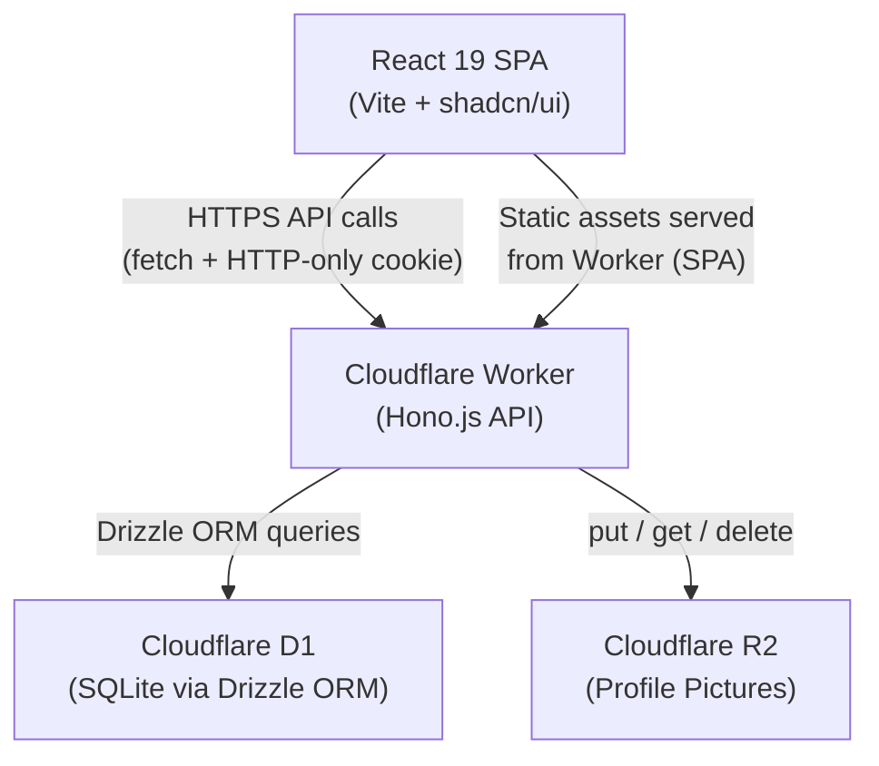
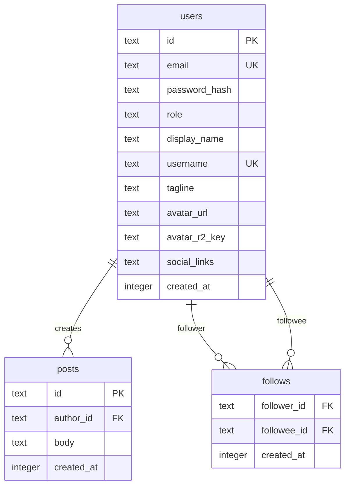
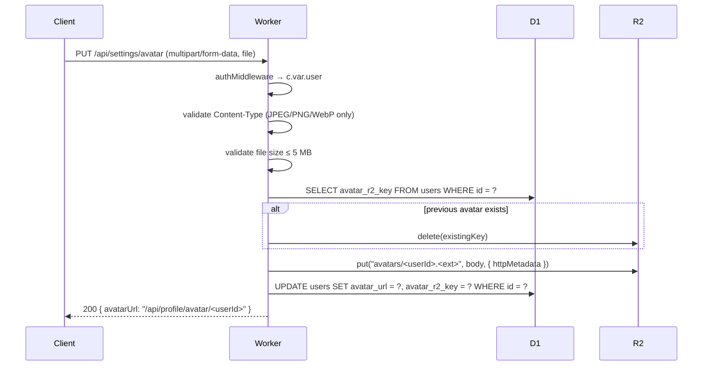

# Design Document: auth-and-social-feed

## Overview

This document describes the technical design for the initial release of the subscription-based social network SaaS. The system is a full-stack application running on the Cloudflare Developer Platform: a Hono.js API on Cloudflare Workers, a Cloudflare D1 SQLite database accessed via Drizzle ORM, Cloudflare R2 for profile picture storage, and a React 19 SPA frontend built with Vite, shadcn/ui, and Tailwind CSS v4.

The feature scope covers:
- User registration, login, and logout with JWT sessions in HTTP-only cookies
- Role-based access control (subscriber / creator)
- A social feed showing posts from followed creators
- Follow/unfollow relationships
- Public user profile pages
- Settings for profile picture, password, and email management

Creator onboarding and email verification are explicitly out of scope.

### Key Design Decisions

| Decision | Choice | Rationale |
|---|---|---|
| Auth token storage | HTTP-only cookie | Prevents XSS token theft; Workers `cookie` helper handles set/get |
| Password hashing | PBKDF2 via Web Crypto API | Workers runtime supports full SubtleCrypto; bcrypt requires Node.js native modules which are unavailable in Workers even with `nodejs_compat` |
| JWT signing | HMAC-SHA256 via Web Crypto API | Native Workers support, no external dependency |
| ORM | Drizzle ORM | Lightweight, type-safe, first-class D1 support |
| Frontend routing | React Router v7 (declarative) | Standard SPA routing; no server-side rendering needed |
| Profile picture serving | R2 public URL or signed URL via Worker proxy | Worker proxies reads to avoid exposing R2 bucket directly |

---

## Architecture



The Worker serves both the static React SPA (via the `assets` binding in `wrangler.json`) and the `/api/*` routes. All authenticated state lives in a signed JWT stored in an HTTP-only `session` cookie. The Worker validates the JWT on every protected request via middleware before the route handler runs.

### Request Lifecycle

```mermaid
sequenceDiagram
    participant B as Browser
    participant W as Worker (Hono)
    participant D as D1
    participant R as R2

    B->>W: POST /api/auth/login {email, password}
    W->>D: SELECT user WHERE email = ?
    D-->>W: user row
    W->>W: verify PBKDF2 hash
    W->>W: sign JWT (HMAC-SHA256)
    W-->>B: 200 OK + Set-Cookie: session=<jwt>; HttpOnly; SameSite=Lax

    B->>W: GET /api/feed (Cookie: session=<jwt>)
    W->>W: authMiddleware: verify JWT → set c.var.user
    W->>D: SELECT posts JOIN follows WHERE follower_id = ?
    D-->>W: post rows
    W-->>B: 200 {posts: [...]}
```

---

## Components and Interfaces

### Backend — Hono App Structure

```
src/worker/
├── index.ts              # Hono app entry, route mounting
├── db/
│   ├── schema.ts         # Drizzle schema definitions
│   └── client.ts         # Drizzle client factory (accepts D1Database)
├── middleware/
│   └── auth.ts           # JWT verification middleware + role guard factory
├── lib/
│   ├── crypto.ts         # PBKDF2 hash/verify, JWT sign/verify (Web Crypto)
│   └── cookie.ts         # Cookie helpers (thin wrapper over hono/cookie)
└── routes/
    ├── auth.ts           # /api/auth — register, login, logout, me
    ├── feed.ts           # /api/feed — feed list, follow
    ├── profile.ts        # /api/profile — public profile, subscriptions
    └── settings.ts       # /api/settings — avatar upload, change password, change email
```

### Frontend — React App Structure

```
src/react-app/
├── main.tsx              # ReactDOM.createRoot, BrowserRouter
├── App.tsx               # Route definitions (React Router)
├── lib/
│   ├── utils.ts          # cn() helper (existing)
│   └── api.ts            # Typed fetch wrapper (uses credentials: 'include')
├── hooks/
│   ├── useAuth.ts        # Auth context consumer
│   └── useCurrentUser.ts # GET /api/auth/me → User shape
├── context/
│   └── AuthContext.tsx   # AuthProvider: currentUser, login, logout
├── components/
│   ├── ui/               # shadcn/ui components (button, input, avatar, etc.)
│   ├── AppShell.tsx      # Layout: Sidebar + <Outlet />
│   ├── Sidebar.tsx       # Fixed left nav (Feed, Profile, Settings links)
│   ├── ProtectedRoute.tsx # Redirects unauthenticated users to /login
│   └── PostCard.tsx      # Single feed post display
└── pages/
    ├── LoginPage.tsx
    ├── RegisterPage.tsx
    ├── FeedPage.tsx
    ├── ProfilePage.tsx
    └── SettingsPage.tsx
```

### API Route Summary

| Method | Path | Auth | Role | Description |
|---|---|---|---|---|
| POST | `/api/auth/register` | No | — | Create account |
| POST | `/api/auth/login` | No | — | Login, set session cookie |
| POST | `/api/auth/logout` | Yes | any | Clear session cookie |
| GET | `/api/auth/me` | Yes | any | Return current user info |
| GET | `/api/feed` | Yes | subscriber | Paginated feed posts |
| POST | `/api/feed/follow` | Yes | subscriber | Follow a creator |
| GET | `/api/profile/:username` | No | — | Public profile data |
| GET | `/api/profile/:username/subscriptions` | No | — | Creator list for a user |
| PUT | `/api/settings/avatar` | Yes | any | Upload profile picture |
| PUT | `/api/settings/password` | Yes | any | Change password |
| PUT | `/api/settings/email` | Yes | any | Change email |

### Hono App Wiring

```typescript
// src/worker/index.ts
import { Hono } from 'hono'
import { authRoutes } from './routes/auth'
import { feedRoutes } from './routes/feed'
import { profileRoutes } from './routes/profile'
import { settingsRoutes } from './routes/settings'

type HonoEnv = {
  Bindings: Env
  Variables: { user: { id: string; email: string; role: 'subscriber' | 'creator' } }
}

const app = new Hono<HonoEnv>()

app.route('/api/auth', authRoutes)
app.route('/api/feed', feedRoutes)
app.route('/api/profile', profileRoutes)
app.route('/api/settings', settingsRoutes)

export default app
```

---

## Data Models

### Drizzle Schema (`src/worker/db/schema.ts`)

```typescript
import { sqliteTable, text, integer, primaryKey, index } from 'drizzle-orm/sqlite-core'
import { sql } from 'drizzle-orm'

// ── Users ──────────────────────────────────────────────────────────────────
export const users = sqliteTable('users', {
  id:             text('id').primaryKey(),                          // crypto.randomUUID()
  email:          text('email').notNull().unique(),
  passwordHash:   text('password_hash').notNull(),                  // PBKDF2 encoded string
  role:           text('role', { enum: ['subscriber', 'creator'] })
                    .notNull()
                    .default('subscriber'),
  displayName:    text('display_name').notNull(),
  username:       text('username').notNull().unique(),
  tagline:        text('tagline'),
  avatarUrl:      text('avatar_url'),
  avatarR2Key:    text('avatar_r2_key'),                            // R2 object key for deletion
  socialLinks:    text('social_links'),                             // JSON string: { twitter?, github?, website? }
  createdAt:      integer('created_at', { mode: 'timestamp' })
                    .notNull()
                    .default(sql`(unixepoch())`),
})

// ── Posts ──────────────────────────────────────────────────────────────────
export const posts = sqliteTable('posts', {
  id:        text('id').primaryKey(),
  authorId:  text('author_id').notNull().references(() => users.id, { onDelete: 'cascade' }),
  body:      text('body').notNull(),
  createdAt: integer('created_at', { mode: 'timestamp' })
               .notNull()
               .default(sql`(unixepoch())`),
}, (t) => [
  index('posts_author_created_idx').on(t.authorId, t.createdAt),
])

// ── Follows ────────────────────────────────────────────────────────────────
export const follows = sqliteTable('follows', {
  followerId: text('follower_id').notNull().references(() => users.id, { onDelete: 'cascade' }),
  followeeId: text('followee_id').notNull().references(() => users.id, { onDelete: 'cascade' }),
  createdAt:  integer('created_at', { mode: 'timestamp' })
                .notNull()
                .default(sql`(unixepoch())`),
}, (t) => [
  primaryKey({ columns: [t.followerId, t.followeeId] }),
  index('follows_follower_idx').on(t.followerId),
  index('follows_followee_idx').on(t.followeeId),
])

// ── Inferred types ─────────────────────────────────────────────────────────
export type User    = typeof users.$inferSelect
export type NewUser = typeof users.$inferInsert
export type Post    = typeof posts.$inferSelect
export type Follow  = typeof follows.$inferSelect
```

### Drizzle Client Factory (`src/worker/db/client.ts`)

```typescript
import { drizzle } from 'drizzle-orm/d1'
import * as schema from './schema'

export function createDb(d1: D1Database) {
  return drizzle(d1, { schema })
}

export type Db = ReturnType<typeof createDb>
```

### Entity Relationship Diagram



### Password Hash Format

Passwords are hashed using PBKDF2-HMAC-SHA256 via the Web Crypto API (no bcrypt — bcrypt requires native Node.js modules unavailable in Workers). The stored `password_hash` field encodes all parameters needed for verification:

```
pbkdf2:sha256:<iterations>:<base64(salt)>:<base64(derivedKey)>
```

Example: `pbkdf2:sha256:100000:abc123==:xyz789==`

This self-describing format allows future iteration count upgrades without a separate migration.

### JWT Payload

```typescript
type JwtPayload = {
  sub: string           // user.id
  email: string
  role: 'subscriber' | 'creator'
  iat: number           // issued at (Unix seconds)
  exp: number           // expiry (Unix seconds, iat + 7 days)
}
```

JWTs are signed with HMAC-SHA256 using a `JWT_SECRET` Wrangler secret. The `authMiddleware` verifies the signature and expiry on every protected request, then sets `c.var.user` for downstream handlers.

### R2 Object Key Convention

Profile pictures are stored under a deterministic key scoped to the user:

```
avatars/<userId>.<ext>
```

Example: `avatars/01J2XYZ.jpg`

When a user uploads a new picture, the Worker:
1. Reads `user.avatarR2Key` from D1
2. If non-null, calls `R2.delete(existingKey)` to remove the orphaned object
3. Calls `R2.put(newKey, body, { httpMetadata: { contentType } })` to store the new file
4. Updates `users.avatarUrl` and `users.avatarR2Key` in D1

Profile picture reads are proxied through the Worker at `GET /api/profile/avatar/:userId` to keep the R2 bucket private.

---

## Authentication Flow

### Middleware Design

```typescript
// src/worker/middleware/auth.ts
import { createMiddleware } from 'hono/factory'
import { getCookie } from 'hono/cookie'
import { verifyJwt } from '../lib/crypto'

// Verifies JWT and populates c.var.user. Returns 401 if missing/invalid.
export const authMiddleware = createMiddleware<HonoEnv>(async (c, next) => {
  const token = getCookie(c, 'session')
  if (!token) return c.json({ error: 'Unauthorized' }, 401)

  const payload = await verifyJwt(token, c.env.JWT_SECRET)
  if (!payload) return c.json({ error: 'Unauthorized' }, 401)

  c.set('user', { id: payload.sub, email: payload.email, role: payload.role })
  await next()
})

// Role guard factory — use after authMiddleware
export const requireRole = (role: 'subscriber' | 'creator') =>
  createMiddleware<HonoEnv>(async (c, next) => {
    if (c.var.user.role !== role) return c.json({ error: 'Forbidden' }, 403)
    await next()
  })
```

Applied to routes:

```typescript
// Protected route example
feedRoutes.get('/', authMiddleware, requireRole('subscriber'), async (c) => { ... })
```

### Registration Flow

```mermaid
sequenceDiagram
    participant C as Client
    participant W as Worker
    participant D as D1

    C->>W: POST /api/auth/register {email, password}
    W->>W: validate email format + password length
    W->>D: SELECT id FROM users WHERE email = ?
    alt email exists
        W-->>C: 409 Conflict
    else email free
        W->>W: PBKDF2 hash password (100,000 iterations)
        W->>W: generate UUID for user id + username slug
        W->>D: INSERT INTO users (id, email, password_hash, role='subscriber', ...)
        W->>W: sign JWT
        W-->>C: 201 Created + Set-Cookie: session=<jwt>; HttpOnly; SameSite=Lax; Path=/
    end
```

### Login Flow

```mermaid
sequenceDiagram
    participant C as Client
    participant W as Worker
    participant D as D1

    C->>W: POST /api/auth/login {email, password}
    W->>D: SELECT * FROM users WHERE email = ?
    alt user not found OR hash mismatch
        W-->>C: 401 Unauthorized (same message for both)
    else credentials valid
        W->>W: sign JWT
        W-->>C: 200 OK + Set-Cookie: session=<jwt>; HttpOnly; SameSite=Lax; Path=/
    end
```

### Logout

The logout handler clears the cookie by setting it with `Max-Age=0` and returns 200. No server-side session store is needed since JWTs are stateless; the cookie deletion is sufficient for the browser to stop sending the token.

### Cookie Configuration

```typescript
setCookie(c, 'session', token, {
  httpOnly: true,
  sameSite: 'Lax',
  path: '/',
  maxAge: 60 * 60 * 24 * 7,  // 7 days
  secure: true,               // set in production; omit in local dev
})
```

---

## Frontend Component Architecture

### Routing Structure

```typescript
// src/react-app/App.tsx
<BrowserRouter>
  <AuthProvider>
    <Routes>
      {/* Public routes */}
      <Route path="/login"    element={<LoginPage />} />
      <Route path="/register" element={<RegisterPage />} />

      {/* Protected routes — wrapped in AppShell */}
      <Route element={<ProtectedRoute />}>
        <Route element={<AppShell />}>
          <Route index element={<Navigate to="/feed" replace />} />
          <Route path="/feed"              element={<FeedPage />} />
          <Route path="/profile/:username" element={<ProfilePage />} />
          <Route path="/settings"          element={<SettingsPage />} />
        </Route>
      </Route>
    </Routes>
  </AuthProvider>
</BrowserRouter>
```

`ProtectedRoute` reads from `AuthContext`. If `currentUser` is null (not yet loaded), it renders a loading spinner. If null after load, it redirects to `/login`.

### AppShell Layout

```
┌─────────────────────────────────────────────────────┐
│  Sidebar (fixed, w-64)  │  Content column (flex-1)  │
│  ─────────────────────  │  ─────────────────────    │
│  [Avatar + display name]│  <Outlet />               │
│  ─────────────────────  │                           │
│  ◉ Feed                 │                           │
│  ○ Profile              │                           │
│  ○ Settings             │                           │
│  ─────────────────────  │                           │
│  [Logout button]        │                           │
└─────────────────────────────────────────────────────┘
```

All layout uses shadcn/ui primitives (`Button`, `Avatar`, `Separator`) and Tailwind utility classes. No custom CSS is introduced.

### Key Component Responsibilities

**`AuthContext`** — Holds `currentUser: User | null`, `isLoading: boolean`. On mount, calls `GET /api/auth/me`. Exposes `login(email, password)` and `logout()` functions that call the API and update state.

**`ProtectedRoute`** — Renders `<Outlet />` when authenticated, `<Navigate to="/login" />` when not. Shows a centered spinner while `isLoading` is true.

**`Sidebar`** — Uses `useLocation()` to determine the active route and applies the active variant to the corresponding `NavLink`. Renders the current user's avatar and display name at the top.

**`FeedPage`** — Fetches `GET /api/feed`. Renders a list of `PostCard` components. Shows the "You have not followed yet" empty state when the API returns an empty array.

**`ProfilePage`** — Fetches `GET /api/profile/:username` and `GET /api/profile/:username/subscriptions`. Uses shadcn `Tabs` to show a "Subscribed" tab. Defaults to the Subscribed tab when viewing own profile.

**`SettingsPage`** — Three shadcn `Card` sections: avatar upload (file input + preview), change password (current + new + confirm), change email (new email + current password). Each section submits independently.

### API Client (`src/react-app/lib/api.ts`)

A thin typed wrapper around `fetch` that:
- Always sets `credentials: 'include'` so the HTTP-only cookie is sent
- Sets `Content-Type: application/json` for JSON bodies
- Returns `{ data, error, status }` — never throws, so components can handle errors inline

---

## R2 Storage Design

### Bucket Configuration (`wrangler.json` addition)

```jsonc
"r2_buckets": [
  {
    "binding": "AVATARS",
    "bucket_name": "social-feed-avatars"
  }
]
```

### Upload Flow



### Avatar Read (Proxy)

Profile picture reads go through the Worker to keep the R2 bucket private:

```
GET /api/profile/avatar/:userId
  → R2.get("avatars/<userId>.<ext>")
  → stream body back with correct Content-Type header
```

This avoids exposing the R2 bucket publicly and allows future access control (e.g., subscriber-only content).

### File Validation

| Check | Rule | Error |
|---|---|---|
| Content-Type header | `image/jpeg`, `image/png`, `image/webp` | 415 |
| File size | ≤ 5,242,880 bytes (5 MB) | 413 |
| Magic bytes (optional hardening) | Verify first bytes match declared type | 415 |

---

## Error Handling

### API Error Response Shape

All API errors return a consistent JSON body:

```typescript
type ApiError = {
  error: string    // human-readable message
  code?: string    // optional machine-readable code (e.g. "EMAIL_TAKEN")
}
```

### HTTP Status Code Mapping

| Scenario | Status |
|---|---|
| Missing/invalid JWT | 401 |
| Wrong role | 403 |
| Resource not found | 404 |
| Duplicate email / duplicate follow | 409 |
| Validation failure (format, length) | 422 |
| File too large | 413 |
| Unsupported file type | 415 |
| Unhandled server error | 500 |

### Global Error Handler (Hono)

```typescript
app.onError((err, c) => {
  console.error(err)
  return c.json({ error: 'Internal server error' }, 500)
})

app.notFound((c) => c.json({ error: 'Not found' }, 404))
```

### Frontend Error Handling

- Form validation errors (422) are displayed inline below the relevant field using shadcn `FormMessage` patterns.
- Auth errors (401) trigger a redirect to `/login` via the API client interceptor.
- Network errors show a toast notification (shadcn `Sonner` or `Toast`).

---

## Correctness Properties

*A property is a characteristic or behavior that should hold true across all valid executions of a system — essentially, a formal statement about what the system should do. Properties serve as the bridge between human-readable specifications and machine-verifiable correctness guarantees.*

Property-based testing applies here because the core auth and feed logic consists of pure or near-pure functions (password hashing, JWT signing/verification, input validation, feed query logic) where input variation meaningfully exercises edge cases. The PBT library used is **fast-check** (TypeScript-native, works in Vitest).

**Property Reflection:** After reviewing all testable criteria, Properties 1 and 2 together fully cover all password hash/verify scenarios (1.3, 2.4, 9.2, 9.3). Property 3 covers JWT payload fidelity (1.7, 4.2). Properties 5 and 6 cover all input validation criteria (1.5, 1.6, 10.3, 9.4). No redundant properties remain.

### Property 1: Password hash round-trip

*For any* password string of at least 8 characters, hashing it and then verifying the original password against the resulting hash SHALL return `true`.

**Validates: Requirements 1.3, 9.2**

### Property 2: Wrong password verification always fails

*For any* two distinct password strings `p1` and `p2` where `p1 ≠ p2`, hashing `p1` and then verifying `p2` against that hash SHALL return `false`.

**Validates: Requirements 2.4, 9.3, 10.5**

### Property 3: JWT sign/verify round-trip preserves payload

*For any* valid JWT payload containing a user id, email, and role, signing it with a secret and then verifying the resulting token with the same secret SHALL return a payload with fields equivalent to the original.

**Validates: Requirements 1.7, 2.2, 4.2**

### Property 4: Tampered JWT is always rejected

*For any* valid signed JWT token string, modifying any single character anywhere in the string SHALL cause verification to return `null` (i.e., the token is treated as invalid).

**Validates: Requirements 4.3**

### Property 5: Email validator rejects all malformed addresses

*For any* string that does not conform to the `local@domain.tld` pattern (no `@`, no domain, no TLD, or containing illegal characters), the email validator SHALL return invalid.

**Validates: Requirements 1.5, 10.3**

### Property 6: Password length validator enforces 8-character minimum

*For any* string of length strictly less than 8, the password validator SHALL return invalid. *For any* string of length 8 or greater, the password validator SHALL return valid.

**Validates: Requirements 1.6, 9.4**

### Property 7: Feed posts are always ordered by creation date descending

*For any* non-empty list of posts returned by the feed query for a subscriber who follows at least one creator, every consecutive pair of posts `(posts[i], posts[i+1])` SHALL satisfy `posts[i].createdAt >= posts[i+1].createdAt`.

**Validates: Requirements 5.2**

### Property 8: Follow relationship is unique per (subscriber, creator) pair

*For any* subscriber and creator pair, inserting a follow record when one already exists SHALL return a 409 Conflict response, and the follows table SHALL contain exactly one record for that (followerId, followeeId) pair.

**Validates: Requirements 6.3**

---

## Testing Strategy

### Dual Testing Approach

Both unit/example-based tests and property-based tests are used. Unit tests cover specific scenarios and integration points; property tests verify universal correctness across the input space.

### Test Setup

- **Test runner**: Vitest (already in the Vite ecosystem)
- **PBT library**: `fast-check` — TypeScript-native, integrates with Vitest via `fc.assert(fc.property(...))`
- **Minimum iterations**: 100 per property test (`numRuns: 100` in fast-check config)
- **Workers bindings**: Mocked via `vitest-pool-workers` or manual mocks for unit tests; integration tests use `wrangler dev` + `workers-fetch`

### Unit Tests

Focus areas:
- `lib/crypto.ts` — hash, verify, signJwt, verifyJwt with concrete examples
- Route handlers — specific request/response examples using `app.request()`
- Input validators — boundary values (7-char password, 8-char password, valid/invalid email)
- R2 upload handler — mock R2 binding, verify delete-then-put sequence

### Property-Based Tests

Each property test is tagged with a comment referencing the design property:

```typescript
// Feature: auth-and-social-feed, Property 1: Password hash round-trip
it('password hash round-trip', async () => {
  await fc.assert(
    fc.asyncProperty(
      fc.string({ minLength: 8, maxLength: 128 }),
      async (password) => {
        const hash = await hashPassword(password)
        expect(await verifyPassword(password, hash)).toBe(true)
      }
    ),
    { numRuns: 100 }
  )
})
```

Tag format: `Feature: auth-and-social-feed, Property {N}: {property_title}`

### Integration Tests

Run against a local `wrangler dev` instance:
- Full registration → login → feed → follow → feed-again flow
- Avatar upload with valid and invalid file types
- Cookie presence and HttpOnly flag verification

### What Is Not Property-Tested

- R2 put/delete/get operations — these test Cloudflare infrastructure, not our code; covered by integration tests with 1–2 examples
- D1 query execution — infrastructure; covered by integration tests
- UI rendering — covered by snapshot tests and manual review
- Cookie `HttpOnly`/`SameSite` flags — infrastructure/browser behavior; covered by a single integration smoke test
