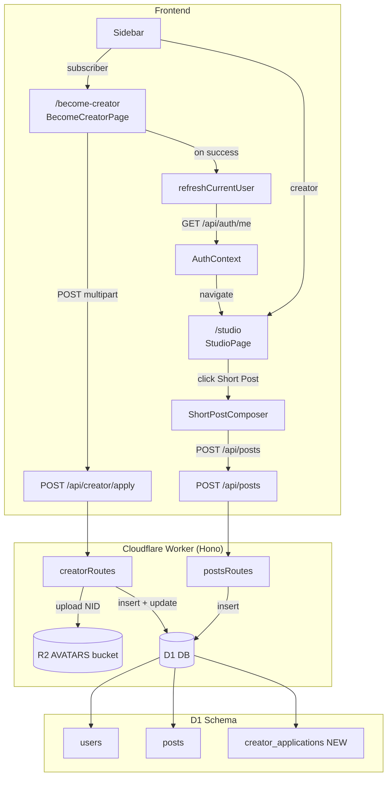
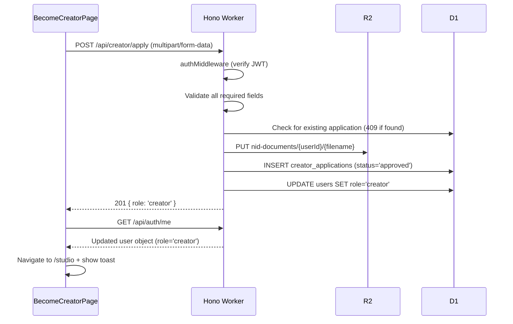

# Design Document: Become Creator

## Overview

The Become Creator feature extends the social feed application with a creator onboarding flow and a content-creation workspace (Studio). It spans three layers:

1. **Creator Application** — a multi-field form at `/become-creator` that collects identity and content verification data from subscribers, uploads an NID document to R2, and submits the application to the backend.
2. **Role Upgrade & Session Refresh** — the backend auto-approves the application, atomically upgrades the user's role to `creator`, and the frontend immediately refreshes the session so the new role is reflected without a page reload.
3. **Studio** — a creator-only page at `/studio` with content-type cards and a short-post composer modal.

The feature builds on the existing Hono + D1 + R2 + React + React Router stack. No new infrastructure bindings are required; the existing `DB` (D1) and `AVATARS` (R2) bindings are reused, with the NID documents stored in the same R2 bucket under a separate key prefix.

---

## Architecture



### Request Flow: Creator Application



---

## Components and Interfaces

### New Frontend Components

#### `BecomeCreatorPage` (`src/react-app/pages/BecomeCreatorPage.tsx`)

Renders at `/become-creator`. Uses `react-hook-form` + `zod` (consistent with the existing settings form pattern). Displays a read-only status view when an existing application is detected (HTTP 409 on load check or on submit).

Key responsibilities:
- Render all required fields (full legal name, address, city, country, NID number, NID document upload, social URLs, content sample URLs)
- Support dynamic addition of extra social/content URL fields
- Validate with Zod schema before submission
- Submit as `multipart/form-data` via `apiPost` (FormData branch already handled in `api.ts`)
- On success: call `refreshCurrentUser()`, navigate to `/studio`, show congratulations toast

#### `StudioPage` (`src/react-app/pages/StudioPage.tsx`)

Renders at `/studio`. Creator-only; subscribers are redirected to `/become-creator` by a `CreatorRoute` guard component.

Key responsibilities:
- Render `ContentTypeCard` components for Short Post, Long Post, Course
- Long Post and Course cards are visually disabled with "Coming Soon" label
- Clicking Short Post opens `ShortPostComposer` modal

#### `ContentTypeCard` (`src/react-app/components/ContentTypeCard.tsx`)

A reusable card component. Props:

```typescript
type ContentTypeCardProps = {
  icon: React.ReactNode
  title: string
  description: string
  disabled?: boolean
  comingSoon?: boolean
  onClick?: () => void
}
```

#### `ShortPostComposer` (`src/react-app/components/ShortPostComposer.tsx`)

A modal overlay (using a simple `dialog`-style div or a shadcn Dialog). Renders on top of the Studio page without route navigation.

Key responsibilities:
- Textarea with `maxLength={500}`
- Live character count display: `{remaining} / 500`
- Disable publish button when body is empty or > 500 chars
- Submit `POST /api/posts` with `{ body }`
- On success: close modal, show success toast
- On dismiss: close without request

#### `CreatorRoute` (`src/react-app/components/CreatorRoute.tsx`)

A route guard component analogous to `ProtectedRoute`. Wraps creator-only routes and redirects subscribers to `/become-creator`.

```typescript
export function CreatorRoute() {
  const { currentUser, isLoading } = useAuth()
  if (isLoading) return <LoadingSpinner />
  if (!currentUser) return <Navigate to="/login" replace />
  if (currentUser.role !== 'creator') return <Navigate to="/become-creator" replace />
  return <Outlet />
}
```

### Updated Frontend Components

#### `Sidebar` (`src/react-app/components/Sidebar.tsx`)

Add conditional navigation link based on `currentUser.role`:
- `'subscriber'` → render `<NavLink to="/become-creator">Become Creator</NavLink>`
- `'creator'` → render `<NavLink to="/studio">Studio</NavLink>`

Both use the existing `navLinkClass` helper for consistent active-link styling.

#### `App.tsx`

Add new routes:
```tsx
// Inside ProtectedRoute > AppShell
<Route path="/become-creator" element={<BecomeCreatorPage />} />

// Creator-only, nested under CreatorRoute
<Route element={<CreatorRoute />}>
  <Route path="/studio" element={<StudioPage />} />
</Route>
```

### New Backend Routes

#### `creatorRoutes` (`src/worker/routes/creator.ts`)

Mounted at `/api/creator`.

| Method | Path | Auth | Description |
|--------|------|------|-------------|
| POST | `/apply` | `authMiddleware` | Submit creator application |

#### `postsRoutes` (`src/worker/routes/posts.ts`)

Mounted at `/api/posts`.

| Method | Path | Auth | Description |
|--------|------|------|-------------|
| POST | `/` | `authMiddleware` + `requireRole('creator')` | Publish a short post |

---

## Data Models

### New DB Table: `creator_applications`

```typescript
// src/worker/db/schema.ts addition
export const creatorApplications = sqliteTable('creator_applications', {
  id:              text('id').primaryKey().$defaultFn(() => crypto.randomUUID()),
  userId:          text('user_id').notNull().unique().references(() => users.id, { onDelete: 'cascade' }),
  fullName:        text('full_name').notNull(),
  address:         text('address').notNull(),
  city:            text('city').notNull(),
  country:         text('country').notNull(),
  nidNumber:       text('nid_number').notNull(),
  nidDocumentR2Key: text('nid_document_r2_key').notNull(),
  socialLinks:     text('social_links').notNull(),   // JSON array of URL strings
  contentLinks:    text('content_links').notNull(),  // JSON array of URL strings
  status:          text('status', { enum: ['pending', 'approved', 'rejected'] })
                     .notNull()
                     .default('approved'),
  createdAt:       integer('created_at', { mode: 'timestamp' })
                     .notNull()
                     .default(sql`(unixepoch())`),
})

export type CreatorApplication    = typeof creatorApplications.$inferSelect
export type NewCreatorApplication = typeof creatorApplications.$inferInsert
```

The `userId` column has a `UNIQUE` constraint, enforcing one application per user at the database level (in addition to the API-level 409 check).

### R2 Key Convention

NID documents are stored in the existing `AVATARS` R2 bucket under a separate prefix:

```
nid-documents/{userId}/{originalFilename}
```

Example: `nid-documents/abc-123/passport-scan.jpg`

### API Request / Response Shapes

#### `POST /api/creator/apply`

Request: `multipart/form-data`

| Field | Type | Required |
|-------|------|----------|
| `fullName` | string | ✓ |
| `address` | string | ✓ |
| `city` | string | ✓ |
| `country` | string | ✓ |
| `nidNumber` | string | ✓ |
| `nidDocument` | File (JPEG/PNG/WebP, ≤ 10 MB) | ✓ |
| `socialLinks` | JSON string (array of URLs) | ✓ (min 1) |
| `contentLinks` | JSON string (array of URLs) | ✓ (min 1) |

Response `201`: `{ "role": "creator" }`
Response `409`: `{ "error": "Application already submitted" }` or `{ "error": "User is already a creator" }`
Response `413`: `{ "error": "NID document exceeds 10 MB limit" }`
Response `415`: `{ "error": "NID document must be JPEG, PNG, or WebP" }`
Response `422`: `{ "error": "Missing required field: {fieldName}" }`

#### `POST /api/posts`

Request: `application/json`

```json
{ "body": "string (1–500 chars)" }
```

Response `201`:
```json
{ "id": "uuid", "body": "string", "createdAt": 1234567890 }
```

Response `403`: `{ "error": "Forbidden" }`
Response `422`: `{ "error": "Post body must be between 1 and 500 characters" }`

### Zod Validation Schema (Frontend)

```typescript
const creatorApplicationSchema = z.object({
  fullName:     z.string().min(1, 'Full legal name is required'),
  address:      z.string().min(1, 'Street address is required'),
  city:         z.string().min(1, 'City is required'),
  country:      z.string().min(1, 'Country is required'),
  nidNumber:    z.string().min(1, 'NID number is required'),
  socialLinks:  z.array(z.string().url('Must be a valid URL').startsWith('https://', 'Must start with https://')).min(1),
  contentLinks: z.array(z.string().url('Must be a valid URL').startsWith('https://', 'Must start with https://')).min(1),
  // nidDocument validated separately (File object, not Zod-friendly)
})
```

---

## Correctness Properties

*A property is a characteristic or behavior that should hold true across all valid executions of a system — essentially, a formal statement about what the system should do. Properties serve as the bridge between human-readable specifications and machine-verifiable correctness guarantees.*

### Property 1: URL validation accepts only https:// URLs

*For any* string input to the social profile URL or content sample URL fields, the validation function SHALL accept the input if and only if it is a well-formed absolute URL whose scheme is `https`.

**Validates: Requirements 2.5**

### Property 2: Application submission stores all required fields

*For any* valid creator application payload (with random but well-formed values for all required fields), after a successful `POST /api/creator/apply`, the persisted `creator_applications` record SHALL contain all of: `userId`, `fullName`, `address`, `city`, `country`, `nidNumber`, `nidDocumentR2Key`, `socialLinks`, `contentLinks`, `status`, and `createdAt`.

**Validates: Requirements 3.2**

### Property 3: R2 key follows the nid-documents/{userId}/{filename} pattern

*For any* `userId` string and original filename string, the R2 key constructed by the application handler SHALL equal `nid-documents/{userId}/{filename}` exactly.

**Validates: Requirements 3.3**

### Property 4: Duplicate application is always rejected

*For any* user who has already submitted a creator application, any subsequent `POST /api/creator/apply` from that same user SHALL return HTTP 409 and SHALL NOT create an additional `creator_applications` record or change the user's role.

**Validates: Requirements 3.4**

### Property 5: Missing required fields always return 422

*For any* non-empty subset of required fields omitted from a `POST /api/creator/apply` request, the API SHALL return HTTP 422 with an error message that identifies at least one of the missing fields.

**Validates: Requirements 3.6**

### Property 6: Character count display is always accurate

*For any* string of length `n` (where `0 ≤ n ≤ 500`) typed into the Short Post Composer textarea, the displayed character count SHALL show `n / 500` (or equivalently `500 - n` remaining).

**Validates: Requirements 7.3**

### Property 7: Invalid post bodies are always rejected by the composer

*For any* post body that is either empty (length 0) or exceeds 500 characters, the Short Post Composer SHALL keep the publish button disabled and display a validation message.

**Validates: Requirements 7.5**

### Property 8: Post creation round-trip preserves body

*For any* valid post body string (1–500 characters), a successful `POST /api/posts` SHALL return HTTP 201 with a response body containing the same `body` string, plus a non-empty `id` and a positive integer `createdAt`.

**Validates: Requirements 8.4**

### Property 9: Invalid post bodies are always rejected by the API

*For any* post body that is empty or exceeds 500 characters, `POST /api/posts` SHALL return HTTP 422 with a descriptive error message.

**Validates: Requirements 8.3**

### Property 10: New posts appear in follower feeds in reverse-chronological order

*For any* set of posts published by a creator, when a subscriber who follows that creator loads their feed, all posts SHALL appear in descending order of `createdAt`.

**Validates: Requirements 8.5**

---

## Error Handling

### Backend

| Scenario | HTTP Status | Error Message |
|----------|-------------|---------------|
| Unauthenticated request | 401 | `"Unauthorized"` |
| Subscriber attempts `POST /api/posts` | 403 | `"Forbidden"` |
| Application already exists | 409 | `"Application already submitted"` |
| User is already a creator | 409 | `"User is already a creator"` |
| Missing required field | 422 | `"Missing required field: {fieldName}"` |
| Invalid URL in socialLinks/contentLinks | 422 | `"Invalid URL in socialLinks"` / `"Invalid URL in contentLinks"` |
| Post body empty or > 500 chars | 422 | `"Post body must be between 1 and 500 characters"` |
| NID document > 10 MB | 413 | `"NID document exceeds 10 MB limit"` |
| NID document wrong format | 415 | `"NID document must be JPEG, PNG, or WebP"` |
| R2 upload failure | 500 | `"Internal server error"` (logged) |
| D1 write failure | 500 | `"Internal server error"` (logged) |

### Frontend

- **Form validation errors**: Displayed inline adjacent to each field using `react-hook-form`'s `formState.errors`, consistent with the existing settings form pattern.
- **API errors**: Displayed as a toast notification via `sonner` (consistent with existing usage).
- **Network errors**: The `apiFetch` wrapper returns `{ error: 'Network error' }`; the form surfaces this as a toast.
- **Loading states**: Submit button is disabled and shows a spinner while the request is in flight.
- **Already-applied state**: On page load, if the API returns 409, the form is replaced with a read-only status message.

### Atomicity

The `POST /api/creator/apply` handler performs two D1 writes (INSERT into `creator_applications` and UPDATE `users.role`). D1 supports transactions via `db.batch()`; both operations are wrapped in a batch to ensure atomicity — if either fails, neither is committed.

```typescript
await db.batch([
  db.insert(creatorApplications).values({ ... }),
  db.update(users).set({ role: 'creator' }).where(eq(users.id, userId)),
])
```

---

## Testing Strategy

### Unit Tests (example-based)

Located alongside source files (`*.test.ts` / `*.test.tsx`), run with `vitest --run`.

**Backend (`src/worker/`):**
- `creator.test.ts`: Test 409 on duplicate application, 409 for existing creator, 413 for oversized file, 415 for wrong file type, 422 for each missing required field, 201 happy path.
- `posts.test.ts`: Test 403 for subscriber, 422 for empty body, 422 for body > 500 chars, 201 happy path.

**Frontend (`src/react-app/`):**
- `BecomeCreatorPage.test.tsx`: Render with subscriber user, verify all fields present; render with existing application, verify read-only state; mock successful submit, verify navigation and toast.
- `StudioPage.test.tsx`: Render as creator, verify all three cards; verify Long Post and Course are disabled; click Short Post, verify composer opens.
- `ShortPostComposer.test.tsx`: Verify textarea maxLength; verify publish button disabled on empty/overflow; mock successful submit, verify modal closes and toast shown; dismiss without submit, verify no request.
- `Sidebar.test.tsx`: Render with subscriber, verify "Become Creator" link; render with creator, verify "Studio" link.

### Property-Based Tests

Using `fast-check` (already installed as a dev dependency). Run with `vitest --run`.

Each property test runs a minimum of **100 iterations**.

**`src/worker/lib/validators.test.ts` additions:**

```
// Feature: become-creator, Property 1: URL validation accepts only https:// URLs
```

**`src/worker/routes/creator.test.ts`:**

```
// Feature: become-creator, Property 2: Application submission stores all required fields
// Feature: become-creator, Property 3: R2 key follows the nid-documents/{userId}/{filename} pattern
// Feature: become-creator, Property 4: Duplicate application is always rejected
// Feature: become-creator, Property 5: Missing required fields always return 422
```

**`src/worker/routes/posts.test.ts`:**

```
// Feature: become-creator, Property 8: Post creation round-trip preserves body
// Feature: become-creator, Property 9: Invalid post bodies are always rejected by the API
// Feature: become-creator, Property 10: New posts appear in follower feeds in reverse-chronological order
```

**`src/react-app/components/ShortPostComposer.test.tsx`:**

```
// Feature: become-creator, Property 6: Character count display is always accurate
// Feature: become-creator, Property 7: Invalid post bodies are always rejected by the composer
```

### Integration / Smoke Tests

- Verify the `/studio` route is registered and accessible to creators.
- Verify the `/become-creator` route is registered and accessible to subscribers.
- Verify `CreatorRoute` redirects subscribers to `/become-creator`.
- Verify `ProtectedRoute` redirects unauthenticated users to `/login`.

### Test Configuration

Property tests use `{ numRuns: 100 }` (matching the existing `feed.test.ts` convention). Each test is tagged with a comment in the format:

```
// Feature: become-creator, Property {N}: {property_text}
```
