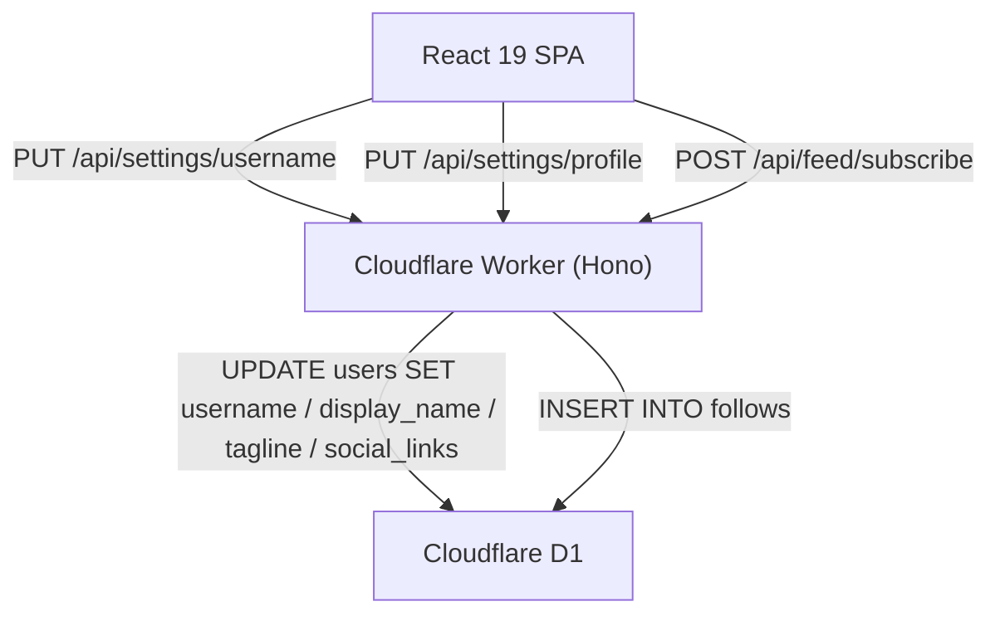

# Design Document: profile-and-settings-improvements

## Overview

This document describes the technical design for the second iteration of the subscription-based social network SaaS. It covers only the **changes and additions** on top of the existing `auth-and-social-feed` implementation. Refer to `.kiro/specs/auth-and-social-feed/design.md` for the baseline architecture, data models, auth flow, and testing infrastructure.

The scope of this iteration:

1. **Username validation and generation** — new `isValidUsername`, `isValidUrl`, and `generateUsername` functions in `src/worker/lib/validators.ts`
2. **New settings endpoints** — `PUT /api/settings/username` and `PUT /api/settings/profile`
3. **Email change idempotency fix** — `PUT /api/settings/email` returns 200 when the submitted email matches the current one
4. **Subscription terminology** — `POST /api/feed/subscribe` replaces `POST /api/feed/follow`; copy updated throughout
5. **Profile route rename** — frontend route `/profile/:username` → `/u/:username`
6. **Theme switcher** — `next-themes` `ThemeProvider` + new `ThemeSwitcher` component in the Sidebar
7. **Settings page additions** — Public Profile card and Username card
8. **UI copy updates** — FeedPage and ProfilePage subscription language

No database schema changes are required. The `follows` table and its `follower_id` / `followee_id` columns remain unchanged.

---

## Architecture

The overall architecture (Cloudflare Worker + D1 + R2 + React SPA) is unchanged. This iteration adds two new Hono route handlers to the existing `settingsRoutes` app, replaces one feed route handler, and adds new React components and page sections.



---

## Components and Interfaces

### Backend Changes

#### `src/worker/lib/validators.ts` — New Exports

Three new exported functions are added alongside the existing `isValidEmail` and `isValidPassword`:

```typescript
/**
 * Validates a username against the platform rules:
 *   - 3–10 characters
 *   - Only lowercase letters, digits, underscores, hyphens
 *   - Must not start or end with _ or -
 */
export function isValidUsername(username: string): boolean {
  return /^[a-z0-9][a-z0-9_-]{1,8}[a-z0-9]$|^[a-z0-9]{3}$/.test(username)
}

/**
 * Validates a URL by attempting to parse it with the URL constructor.
 * Returns true only if parsing succeeds and the protocol is http: or https:.
 */
export function isValidUrl(url: string): boolean {
  try {
    const parsed = new URL(url)
    return parsed.protocol === 'http:' || parsed.protocol === 'https:'
  } catch {
    return false
  }
}

/**
 * Derives a valid username from an email local part.
 * Algorithm:
 *   1. Lowercase the local part
 *   2. Replace chars outside [a-z0-9] with hyphens
 *   3. Strip leading/trailing hyphens
 *   4. If empty after stripping, use 'u' as base
 *   5. Truncate to max 5 chars (leaves room for '-xxxx' suffix = 6 chars, total ≤ 10)
 *   6. Strip trailing hyphens from truncated base
 *   7. Append '-' + 4-char alphanumeric suffix (Math.random().toString(36).slice(2,6))
 * Result is always 6–10 chars and passes isValidUsername.
 */
export function generateUsername(emailLocalPart: string): string {
  let base = emailLocalPart
    .toLowerCase()
    .replace(/[^a-z0-9]/g, '-')
    .replace(/^-+|-+$/g, '')

  if (base.length === 0) base = 'u'

  base = base.slice(0, 5).replace(/-+$/, '')

  const suffix = Math.random().toString(36).slice(2, 6).padEnd(4, '0')
  return `${base}-${suffix}`
}
```

**Regex explanation for `isValidUsername`:**

The regex `/^[a-z0-9][a-z0-9_-]{1,8}[a-z0-9]$|^[a-z0-9]{3}$/` has two branches:
- `^[a-z0-9][a-z0-9_-]{1,8}[a-z0-9]$` — matches 3–10 char usernames where the first and last chars are `[a-z0-9]` and the middle 1–8 chars allow `_` and `-`. This covers lengths 3–10 (1 + 1–8 + 1).
- `^[a-z0-9]{3}$` — matches exactly 3-char usernames composed entirely of `[a-z0-9]`. This is needed because the first branch requires a middle section of at least 1 char, making its minimum length 3 only when the middle is exactly 1 char — but that middle char could be `_` or `-`, which the second branch explicitly excludes for the 3-char case. The second branch ensures 3-char usernames with no special chars are also valid.

Wait — re-examining: the first branch `^[a-z0-9][a-z0-9_-]{1,8}[a-z0-9]$` with `{1,8}` middle gives lengths 3–10. A 3-char username like `abc` matches the first branch (a + b + c). A 3-char username like `a-b` also matches the first branch. The second branch `^[a-z0-9]{3}$` is actually a subset of what the first branch already matches for 3-char strings. The regex is written this way to be explicit about the 3-char all-alphanumeric case. Both branches together correctly implement the rules.

**`generateUsername` migration:** The existing `generateUsername` function in `src/worker/routes/auth.ts` is removed and replaced with an import from `validators.ts`. The corrected algorithm fixes a bug in the original where the base could be empty or produce an invalid username.

#### `src/worker/routes/settings.ts` — New Endpoints

**`PUT /api/settings/username`**

```typescript
settingsRoutes.put('/username', authMiddleware, async (c) => {
  const userId = c.var.user.id

  let body: { newUsername?: unknown }
  try {
    body = await c.req.json()
  } catch {
    return c.json({ error: 'Invalid JSON body' }, 422)
  }

  const { newUsername } = body as { newUsername: string }

  if (!newUsername || typeof newUsername !== 'string') {
    return c.json({ error: 'newUsername is required and must be a string' }, 422)
  }

  if (!isValidUsername(newUsername)) {
    return c.json({
      error: 'Username must be 3–10 characters, lowercase letters, digits, underscores, or hyphens, and must not start or end with _ or -'
    }, 422)
  }

  const db = createDb(c.env.DB)

  const currentUser = await db
    .select({ username: users.username })
    .from(users)
    .where(eq(users.id, userId))
    .get()

  if (!currentUser) return c.json({ error: 'User not found' }, 404)

  // Idempotency: same username → 200 without DB write
  if (newUsername === currentUser.username) {
    return c.json({ message: 'Username unchanged' })
  }

  // Uniqueness check
  const taken = await db
    .select({ id: users.id })
    .from(users)
    .where(and(eq(users.username, newUsername), not(eq(users.id, userId))))
    .get()

  if (taken) {
    return c.json({ error: 'Username is already taken' }, 409)
  }

  await db
    .update(users)
    .set({ username: newUsername })
    .where(eq(users.id, userId))
    .run()

  return c.json({ username: newUsername })
})
```

**`PUT /api/settings/profile`**

```typescript
settingsRoutes.put('/profile', authMiddleware, async (c) => {
  const userId = c.var.user.id

  let body: {
    displayName?: unknown
    tagline?: unknown
    socialLinks?: { twitter?: unknown; github?: unknown; website?: unknown }
  }
  try {
    body = await c.req.json()
  } catch {
    return c.json({ error: 'Invalid JSON body' }, 422)
  }

  const { displayName, tagline, socialLinks } = body as {
    displayName: string
    tagline?: string
    socialLinks?: { twitter?: string; github?: string; website?: string }
  }

  if (!displayName || typeof displayName !== 'string' || displayName.trim() === '') {
    return c.json({ error: 'displayName is required and must be a non-empty string' }, 422)
  }

  // Validate each provided URL
  if (socialLinks) {
    for (const [field, url] of Object.entries(socialLinks)) {
      if (url && !isValidUrl(url)) {
        return c.json({ error: `Invalid URL for ${field}` }, 422)
      }
    }
  }

  const db = createDb(c.env.DB)

  await db
    .update(users)
    .set({
      displayName: displayName.trim(),
      tagline: tagline ?? null,
      socialLinks: socialLinks ? JSON.stringify(socialLinks) : null,
    })
    .where(eq(users.id, userId))
    .run()

  return c.json({ displayName: displayName.trim(), tagline, socialLinks })
})
```

#### `src/worker/routes/settings.ts` — Email Idempotency Fix

The existing `PUT /api/settings/email` handler currently checks for duplicate email before verifying the password. This causes a 409 when a user submits their own current email. The fix fetches the current user's email first and short-circuits with 200 if the submitted email matches:

```typescript
// Before the existing duplicate-email check, add:
const currentUser = await db
  .select({ email: users.email, passwordHash: users.passwordHash })
  .from(users)
  .where(eq(users.id, userId))
  .get()

if (!currentUser) return c.json({ error: 'User not found' }, 404)

// Idempotency: same email → verify password, return 200 without DB write
if (newEmail === currentUser.email) {
  const passwordOk = await verifyPassword(currentPassword, currentUser.passwordHash)
  if (!passwordOk) return c.json({ error: 'Current password is incorrect' }, 401)
  return c.json({ message: 'Email unchanged' })
}

// Then proceed with the existing duplicate-email check against OTHER users
```

The existing `SELECT id FROM users WHERE email = newEmail` check is kept but now only runs when `newEmail !== currentUser.email`, so it correctly returns 409 only for conflicts with a different account.

#### `src/worker/routes/feed.ts` — Subscribe Endpoint

`POST /api/feed/follow` is removed. `POST /api/feed/subscribe` is added with the same logic but updated field names and messages:

```typescript
feedRoutes.post('/subscribe', authMiddleware, requireRole('subscriber'), async (c) => {
  // ... same validation and creator lookup as /follow ...

  const subscriberId = c.var.user.id
  const creatorId = body.creatorId as string

  try {
    await db.insert(follows).values({
      followerId: subscriberId,   // DB column name unchanged
      followeeId: creatorId,      // DB column name unchanged
    }).run()
  } catch (err) {
    if (err instanceof Error && err.message.toLowerCase().includes('unique')) {
      return c.json({ error: 'Already subscribed to this creator' }, 409)
    }
    throw err
  }

  return c.json({ subscriberId, creatorId }, 201)
})
```

The empty feed message is updated:

```typescript
// GET /api/feed — empty state
return c.json({ posts: [], message: "You haven't subscribed to any creators yet" })
```

`POST /api/feed/follow` is removed entirely. Requests to that path fall through to Hono's default 404 handler.

### Updated API Route Table (changes only)

| Method | Path | Change |
|---|---|---|
| PUT | `/api/settings/username` | NEW — change username |
| PUT | `/api/settings/profile` | NEW — update display name, tagline, social links |
| PUT | `/api/settings/email` | MODIFIED — idempotency fix |
| POST | `/api/feed/subscribe` | NEW — replaces `/api/feed/follow` |
| POST | `/api/feed/follow` | REMOVED — returns 404 |

### Frontend Changes

#### `src/react-app/main.tsx` — ThemeProvider Wrapper

`next-themes` is already in `package.json`. Wrap the app with `ThemeProvider`:

```tsx
import { ThemeProvider } from 'next-themes'
import { BrowserRouter } from 'react-router'
import App from './App'

ReactDOM.createRoot(document.getElementById('root')!).render(
  <React.StrictMode>
    <ThemeProvider attribute="class" defaultTheme="system" enableSystem disableTransitionOnChange>
      <BrowserRouter>
        <App />
      </BrowserRouter>
    </ThemeProvider>
  </React.StrictMode>
)
```

`attribute="class"` causes `next-themes` to add `class="dark"` to `<html>`, which Tailwind v4 picks up automatically via its `@variant dark` strategy. `disableTransitionOnChange` prevents a flash of unstyled content during theme switches.

#### `src/react-app/App.tsx` — Route Rename

```tsx
// Before:
<Route path="/profile/:username" element={<ProfilePage />} />

// After:
<Route path="/u/:username" element={<ProfilePage />} />
```

No `/profile/:username` route is defined; requests to that path fall through to the SPA's not-found handling.

#### `src/react-app/components/ThemeSwitcher.tsx` — New Component

```tsx
import { useTheme } from 'next-themes'
import { Sun, Moon, Monitor } from 'lucide-react'
import { Button } from './ui/button'

export function ThemeSwitcher() {
  const { theme, setTheme } = useTheme()

  return (
    <div className="flex gap-1">
      <Button
        variant={theme === 'light' ? 'secondary' : 'ghost'}
        size="icon"
        onClick={() => setTheme('light')}
        aria-label="Light theme"
      >
        <Sun className="h-4 w-4" />
      </Button>
      <Button
        variant={theme === 'dark' ? 'secondary' : 'ghost'}
        size="icon"
        onClick={() => setTheme('dark')}
        aria-label="Dark theme"
      >
        <Moon className="h-4 w-4" />
      </Button>
      <Button
        variant={theme === 'system' ? 'secondary' : 'ghost'}
        size="icon"
        onClick={() => setTheme('system')}
        aria-label="System theme"
      >
        <Monitor className="h-4 w-4" />
      </Button>
    </div>
  )
}
```

#### `src/react-app/components/Sidebar.tsx` — Profile Link + ThemeSwitcher

Two changes:
1. Profile `NavLink` href changes from `/profile/${username}` to `/u/${username}`
2. `ThemeSwitcher` is inserted between the nav links and the logout button (above the `Separator` before logout)

```tsx
// Profile NavLink:
<NavLink to={`/u/${currentUser?.username}`} className={navLinkClass}>
  Profile
</NavLink>

// Between nav and logout separator:
<ThemeSwitcher />
<Separator className="my-4" />
<Button variant="ghost" className="w-full justify-start" onClick={logout}>
  Logout
</Button>
```

#### `src/react-app/pages/SettingsPage.tsx` — New Cards

Two new `Card` sections are inserted at the top of the settings page (before the existing avatar card), as they are the most commonly edited fields.

**Public Profile card** — pre-populated from `useAuth().currentUser`:

```tsx
const { currentUser } = useAuth()
const [displayName, setDisplayName] = useState(currentUser?.displayName ?? '')
const [tagline, setTagline] = useState(currentUser?.tagline ?? '')
const [twitter, setTwitter] = useState(/* parsed from currentUser.socialLinks */)
const [github, setGithub] = useState(/* parsed from currentUser.socialLinks */)
const [website, setWebsite] = useState(/* parsed from currentUser.socialLinks */)

async function handleProfileSubmit(e: React.FormEvent) {
  e.preventDefault()
  const { error } = await apiPut('/api/settings/profile', {
    displayName,
    tagline: tagline || undefined,
    socialLinks: { twitter: twitter || undefined, github: github || undefined, website: website || undefined },
  })
  if (error) setProfileError(error)
  else toast.success('Profile updated successfully.')
}
```

**Username card** — pre-populated with `currentUser.username`:

```tsx
const [username, setUsername] = useState(currentUser?.username ?? '')

async function handleUsernameSubmit(e: React.FormEvent) {
  e.preventDefault()
  const { data, error } = await apiPut('/api/settings/username', { newUsername: username })
  if (error) setUsernameError(error)
  else {
    toast.success('Username updated successfully.')
    // Refresh currentUser so the Sidebar profile link updates
    await refreshCurrentUser()  // calls GET /api/auth/me and updates AuthContext
  }
}
```

`AuthContext` needs a `refreshCurrentUser` function (or equivalent) that re-fetches `GET /api/auth/me` and updates the `currentUser` state. This is a small addition to the existing `AuthContext`.

#### `src/react-app/pages/FeedPage.tsx` — Copy Update

```tsx
// Empty state:
<p className="text-lg font-medium">
  {message ?? "You haven't subscribed to any creators yet"}
</p>
<p className="text-sm">Subscribe to creators to see their posts here.</p>
```

#### `src/react-app/pages/ProfilePage.tsx` — Copy and Link Updates

```tsx
// Tab trigger label:
<TabsTrigger value="subscribed">Subscribed to</TabsTrigger>

// Empty state in subscribed tab:
{subscriptions.length === 0 ? (
  <p className="text-sm text-muted-foreground">Not subscribed to any creators yet.</p>
) : (
  subscriptions.map((sub) => (
    <Link to={`/u/${sub.username}`} key={sub.username} className="flex items-center gap-3">
      {/* ... avatar and name ... */}
    </Link>
  ))
)}
```

---

## Data Models

No schema changes. The existing `users` table already has `tagline`, `socialLinks`, and `username` columns. The `follows` table is unchanged.

The `socialLinks` column stores a JSON string. The `PUT /api/settings/profile` endpoint writes `JSON.stringify({ twitter?, github?, website? })` and the profile page reads it with `JSON.parse`.

---

## Correctness Properties

*A property is a characteristic or behavior that should hold true across all valid executions of a system — essentially, a formal statement about what the system should do. Properties serve as the bridge between human-readable specifications and machine-verifiable correctness guarantees.*

Property-based testing applies to the new validator and generator functions in `validators.ts` because they are pure functions with large input spaces where input variation meaningfully exercises edge cases. The PBT library is **fast-check** (already in `devDependencies`).

**Property Reflection:** After reviewing all testable criteria:
- Properties 9 and 10 test opposite directions of `isValidUsername` (accept vs. reject) — not redundant, both needed.
- Property 11 subsumes criteria 1.8 and 1.9 — a single property covers both since `isValidUsername` already validates length.
- A URL validator property (Property 12) covers criteria 3.4 for `isValidUrl`.
- Properties 9 and 11 are not redundant: Property 9 tests the validator in isolation; Property 11 tests the composition of generator + validator.

### Property 9: Username validator accepts all valid usernames

*For any* string matching the pattern `/^[a-z0-9][a-z0-9_-]{1,8}[a-z0-9]$/` or `/^[a-z0-9]{3}$/`, `isValidUsername` SHALL return `true`.

**Validates: Requirements 1.1, 1.2**

### Property 10: Username validator rejects all invalid usernames

*For any* string that contains an uppercase letter, has length less than 3 or greater than 10, or starts or ends with `-` or `_`, `isValidUsername` SHALL return `false`.

**Validates: Requirements 1.3, 1.4**

### Property 11: Username generator always produces valid usernames

*For any* string used as an email local part (regardless of length or character composition), `generateUsername(localPart)` SHALL return a string for which `isValidUsername` returns `true`.

**Validates: Requirements 1.8, 1.9**

### Property 12: URL validator accepts valid http/https URLs and rejects others

*For any* well-formed URL string with protocol `http:` or `https:`, `isValidUrl` SHALL return `true`. *For any* string that is not a valid URL or has a protocol other than `http:` or `https:`, `isValidUrl` SHALL return `false`.

**Validates: Requirements 3.4**

---

## Error Handling

### New Error Cases

| Scenario | Status | Message |
|---|---|---|
| `newUsername` missing or not a string | 422 | `'newUsername is required and must be a string'` |
| `newUsername` fails `isValidUsername` | 422 | Descriptive format rules message |
| `newUsername` taken by another user | 409 | `'Username is already taken'` |
| `newUsername` same as current | 200 | `{ message: 'Username unchanged' }` |
| `displayName` missing or empty | 422 | `'displayName is required and must be a non-empty string'` |
| Social link URL invalid | 422 | `'Invalid URL for {field}'` |
| `newEmail` same as current + wrong password | 401 | `'Current password is incorrect'` |
| `newEmail` same as current + correct password | 200 | `{ message: 'Email unchanged' }` |
| `POST /api/feed/follow` | 404 | Hono default not-found |

### Frontend Error Display

- Username and profile form errors are displayed inline below the relevant input field (same pattern as existing password/email forms).
- Success states use `toast.success(...)` via Sonner (same as existing forms).
- After a successful username change, `GET /api/auth/me` is re-fetched to update `AuthContext` so the Sidebar profile link reflects the new username immediately.

---

## Testing Strategy

### Dual Testing Approach

Unit/example-based tests cover specific scenarios and integration points. Property-based tests verify universal correctness for the pure validator and generator functions.

### Property-Based Tests (`src/worker/lib/validators.test.ts`)

The existing `validators.test.ts` file gains three new property test suites using `fast-check`:

```typescript
import fc from 'fast-check'
import { isValidUsername, isValidUrl, generateUsername } from './validators'

// Feature: profile-and-settings-improvements, Property 9: Username validator accepts all valid usernames
it('accepts all valid usernames (long form)', async () => {
  await fc.assert(
    fc.property(
      fc.stringMatching(/^[a-z0-9][a-z0-9_-]{1,8}[a-z0-9]$/),
      (username) => expect(isValidUsername(username)).toBe(true)
    ),
    { numRuns: 100 }
  )
})

it('accepts all valid 3-char usernames', async () => {
  await fc.assert(
    fc.property(
      fc.stringMatching(/^[a-z0-9]{3}$/),
      (username) => expect(isValidUsername(username)).toBe(true)
    ),
    { numRuns: 100 }
  )
})

// Feature: profile-and-settings-improvements, Property 10: Username validator rejects all invalid usernames
it('rejects usernames with uppercase letters', async () => {
  await fc.assert(
    fc.property(
      fc.string({ minLength: 3, maxLength: 10 }).filter(s => /[A-Z]/.test(s)),
      (username) => expect(isValidUsername(username)).toBe(false)
    ),
    { numRuns: 100 }
  )
})

it('rejects usernames shorter than 3 or longer than 10 chars', async () => {
  await fc.assert(
    fc.property(
      fc.oneof(
        fc.string({ maxLength: 2 }),
        fc.string({ minLength: 11 })
      ),
      (username) => expect(isValidUsername(username)).toBe(false)
    ),
    { numRuns: 100 }
  )
})

it('rejects usernames starting or ending with _ or -', async () => {
  await fc.assert(
    fc.property(
      fc.oneof(
        fc.stringMatching(/^[-_][a-z0-9_-]{1,8}[a-z0-9]$/),
        fc.stringMatching(/^[a-z0-9][a-z0-9_-]{1,8}[-_]$/)
      ),
      (username) => expect(isValidUsername(username)).toBe(false)
    ),
    { numRuns: 100 }
  )
})

// Feature: profile-and-settings-improvements, Property 11: Username generator always produces valid usernames
it('generateUsername always produces valid usernames', async () => {
  await fc.assert(
    fc.property(
      fc.emailAddress().map(email => email.split('@')[0]),
      (localPart) => expect(isValidUsername(generateUsername(localPart))).toBe(true)
    ),
    { numRuns: 100 }
  )
})

// Feature: profile-and-settings-improvements, Property 12: URL validator accepts valid http/https URLs
it('isValidUrl accepts valid http and https URLs', async () => {
  await fc.assert(
    fc.property(
      fc.webUrl({ validSchemes: ['http', 'https'] }),
      (url) => expect(isValidUrl(url)).toBe(true)
    ),
    { numRuns: 100 }
  )
})

it('isValidUrl rejects non-URL strings', async () => {
  await fc.assert(
    fc.property(
      fc.string().filter(s => { try { new URL(s); return false } catch { return true } }),
      (s) => expect(isValidUrl(s)).toBe(false)
    ),
    { numRuns: 100 }
  )
})
```

**Minimum iterations**: 100 per property test (`numRuns: 100`).

### Unit Tests

Focus areas for new functionality:

- `isValidUsername` — boundary values: exactly 3 chars, exactly 10 chars, `a-b` (valid), `-ab` (invalid), `ab-` (invalid), `ABC` (invalid)
- `isValidUrl` — `'https://example.com'` (valid), `'ftp://example.com'` (invalid), `'not-a-url'` (invalid), `''` (invalid)
- `generateUsername` — empty string input, all-special-char input (e.g. `'!!!'`), very long input (50+ chars), normal input
- `PUT /api/settings/username` — 422 on invalid username, 409 on taken username, 200 on same username, 200 on valid new username
- `PUT /api/settings/profile` — 422 on empty displayName, 422 on invalid URL, 200 on valid body
- `PUT /api/settings/email` — 200 when same email + correct password, 401 when same email + wrong password, 409 when different user's email
- `POST /api/feed/subscribe` — 201 on success, 409 on duplicate, 404 on non-creator
- `POST /api/feed/follow` — 404 (removed endpoint)

### What Is Not Property-Tested

- Theme switcher behavior — `next-themes` is a third-party library; its logic is already tested by its authors. Our integration is a wiring test (smoke/example).
- Route rename — a routing configuration change; covered by a single navigation example test.
- UI copy changes — string literal checks; covered by snapshot or example tests.
- New settings endpoint DB writes — infrastructure; covered by integration tests with 1–2 examples.
