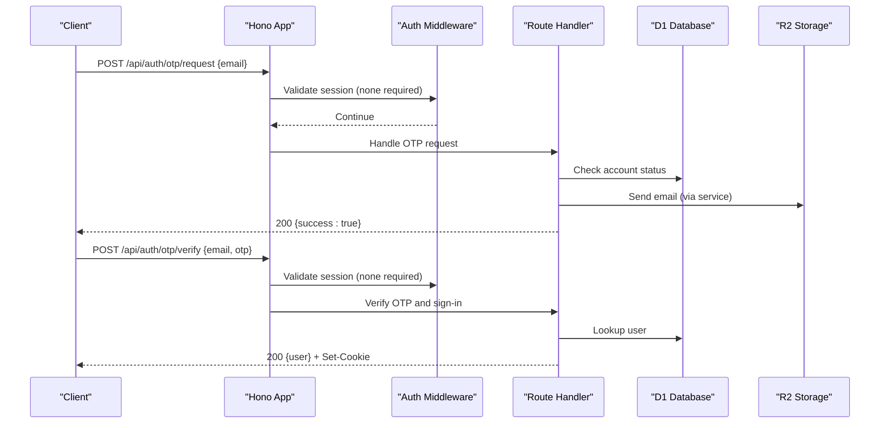
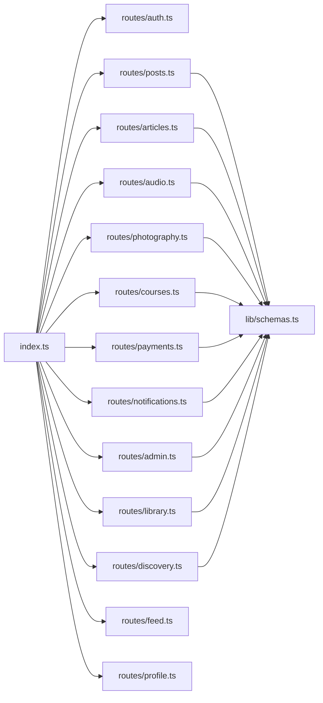

# API Reference

<cite>
**Referenced Files in This Document**
- [index.ts](file://src/worker/index.ts)
- [auth.ts](file://src/worker/routes/auth.ts)
- [posts.ts](file://src/worker/routes/posts.ts)
- [articles.ts](file://src/worker/routes/articles.ts)
- [audio.ts](file://src/worker/routes/audio.ts)
- [photography.ts](file://src/worker/routes/photography.ts)
- [courses.ts](file://src/worker/routes/courses.ts)
- [payments.ts](file://src/worker/routes/payments.ts)
- [notifications.ts](file://src/worker/routes/notifications.ts)
- [admin.ts](file://src/worker/routes/admin.ts)
- [library.ts](file://src/worker/routes/library.ts)
- [schedules.ts](file://src/worker/routes/schedules.ts)
- [discovery.ts](file://src/worker/routes/discovery.ts)
- [feed.ts](file://src/worker/routes/feed.ts)
- [profile.ts](file://src/worker/routes/profile.ts)
- [schemas.ts](file://src/worker/lib/schemas.ts)
</cite>

## Table of Contents
1. Introduction
2. Project Structure
3. Core Components
4. Architecture Overview
5. Detailed Component Analysis
6. Dependency Analysis
7. Performance Considerations
8. Troubleshooting Guide
9. Conclusion
10. Appendices

## Introduction
This document provides a comprehensive API reference for Zenith’s HTTP endpoints. It covers authentication, user management, content operations (posts, articles, audio, photography, courses), social features (replies, likes, polls), payments and subscriptions, notifications, library, schedules, discovery, and administration. For each endpoint group, you will find:
- HTTP methods and URL patterns
- Authentication requirements and headers
- Request/response schemas using Zod validation
- Error codes and responses
- Rate limiting and versioning notes
- Client implementation guidelines and best practices
- Security considerations and input/output sanitization patterns

No WebSocket endpoints are exposed by the server; real-time-like behavior is achieved via polling and scheduled jobs.

## Project Structure
Zenith exposes a single Hono application that mounts multiple route modules under /api/* namespaces. The main entry point wires all routes and global error handling.

```mermaid
graph TB
A["Hono App<br/>src/worker/index.ts"] --> B["/api/auth<br/>routes/auth.ts"]
A --> C["/api/feed<br/>routes/feed.ts"]
A --> D["/api/profile<br/>routes/profile.ts"]
A --> E["/api/settings<br/>(not detailed here)"]
A --> F["/api/creator<br/>routes/creator.ts"]
A --> G["/api/posts<br/>routes/posts.ts"]
A --> H["/api/articles<br/>routes/articles.ts"]
A --> I["/api/audio<br/>routes/audio.ts"]
A --> J["/api/photography<br/>routes/photography.ts"]
A --> K["/api/replies<br/>routes/posts.ts (repliesRoutes)"]
A --> L["/api/polls<br/>routes/posts.ts (pollsRoutes)"]
A --> M["/api/media<br/>routes/posts.ts (mediaRoutes)"]
A --> N["/api/payments<br/>routes/payments.ts"]
A --> O["/api/notifications<br/>routes/notifications.ts"]
A --> P["/api/courses<br/>routes/courses.ts"]
A --> Q["/api/reports<br/>routes/reports.ts"]
A --> R["/api/admin<br/>routes/admin.ts"]
A --> S["/api/library<br/>routes/library.ts"]
A --> T["/api/schedules<br/>routes/schedules.ts"]
A --> U["/api/discovery<br/>routes/discovery.ts"]
```

**Diagram sources**
- [index.ts:24-45](file://src/worker/index.ts#L24-L45)

**Section sources**
- [index.ts:24-45](file://src/worker/index.ts#L24-L45)

## Core Components
- Authentication: Email OTP sign-in flow with session cookies and protected routes.
- Content: Posts, Articles, Audio, Photography, Courses with draft/publish lifecycle and media uploads.
- Social: Replies, Likes, Polls, Notifications.
- Payments: Creator Stripe Sandbox onboarding, plans, subscriptions, checkout sessions.
- Administration: Moderation, creator applications, audit logs, discovery categories, featured creators.
- Library: Saved items across content types with search and pagination.
- Discovery: Creator search, preferences, category selection.
- Feed: Personalized feed for subscribed creators’ content.

Authentication and authorization:
- Most endpoints require an authenticated session via cookie-based auth middleware.
- Role checks: subscriber vs creator vs admin roles enforced per endpoint.
- Admin endpoints require owner or moderator roles.

Input validation:
- All JSON bodies and parameters validated with Zod schemas from lib/schemas.ts.
- File uploads validated for type, size, and count.

Error handling:
- Centralized error responses with consistent code/message structure.
- Not found, forbidden, conflict, payload too large, unsupported media type handled explicitly.

Versioning:
- No explicit API version header; base path is /api. Future versions should be introduced via new base paths (e.g., /api/v2).

Rate limiting:
- Not implemented at the HTTP layer in these routes. Clients should implement retry/backoff strategies.

Security:
- Strict input validation, safe filename sanitization, content-type enforcement, moderation checks, and access control based on ownership and subscription entitlements.

**Section sources**
- [auth.ts:14-259](file://src/worker/routes/auth.ts#L14-L259)
- [posts.ts:1-120](file://src/worker/routes/posts.ts#L1-L120)
- [articles.ts:1-120](file://src/worker/routes/articles.ts#L1-L120)
- [audio.ts:1-120](file://src/worker/routes/audio.ts#L1-L120)
- [photography.ts:1-120](file://src/worker/routes/photography.ts#L1-L120)
- [courses.ts:1-120](file://src/worker/routes/courses.ts#L1-L120)
- [payments.ts:1-120](file://src/worker/routes/payments.ts#L1-L120)
- [notifications.ts:1-60](file://src/worker/routes/notifications.ts#L1-L60)
- [admin.ts:1-120](file://src/worker/routes/admin.ts#L1-L120)
- [library.ts:1-80](file://src/worker/routes/library.ts#L1-L80)
- [discovery.ts:1-60](file://src/worker/routes/discovery.ts#L1-L60)
- [feed.ts:1-60](file://src/worker/routes/feed.ts#L1-L60)
- [schemas.ts:1-120](file://src/worker/lib/schemas.ts#L1-L120)

## Architecture Overview
The API follows a modular Hono router architecture:
- Global app registers route modules under /api/* prefixes.
- Each module defines its own routes with middleware for auth, role checks, and Zod validation.
- Data access uses Drizzle ORM against a D1 database.
- Media stored in Cloudflare R2 storage accessed via c.env.STORAGE.
- Scheduled tasks run background maintenance (scheduling, membership maintenance).

**Diagram sources**
- [index.ts:24-45](file://src/worker/index.ts#L24-L45)
- [auth.ts:135-212](file://src/worker/routes/auth.ts#L135-L212)

## Detailed Component Analysis

### Authentication (/api/auth)
Endpoints:
- POST /api/auth/otp/request
  - Auth: None
  - Body: { email } validated by authOtpRequestSchema
  - Response: 200 { success: true }
  - Errors: 403 account_suspended, 503 otp_email_unavailable
- POST /api/auth/otp/verify
  - Auth: None
  - Body: { email, otp } validated by authOtpVerifySchema
  - Response: 200 { user } with Set-Cookie
  - Errors: 400 invalid_otp, 403 too_many_otp_attempts
- POST /api/auth/logout
  - Auth: Required
  - Response: 200 { message: "Logged out" }
- GET /api/auth/me
  - Auth: Required
  - Response: 200 { id, email, role, displayName, username, tagline, avatarUrl, socialLinks, adminRole }

Notes:
- Password login/register disabled; OTP-based email sign-in only.
- Native Better Auth endpoints proxied except blocked paths.

Example:
- Request: POST /api/auth/otp/request { "email": "user@example.com" }
- Response: 200 { "success": true }

**Section sources**
- [auth.ts:135-212](file://src/worker/routes/auth.ts#L135-L212)
- [auth.ts:214-249](file://src/worker/routes/auth.ts#L214-L249)
- [schemas.ts:13-23](file://src/worker/lib/schemas.ts#L13-L23)

### Posts (/api/posts)
Key endpoints:
- GET /api/posts/moderated/mine
  - Auth: Required, role: creator
  - Response: { items: [...] }
- POST /api/posts/
  - Auth: Required, role: creator
  - Content-Type: multipart/form-data or application/json
  - Body (JSON): postCreateSchema { body, scheduledFor? }
  - Body (form): fields body, images[], pollQuestion, pollOptions[]
  - Response: 201 { id, slug, body, createdAt, publishedAt, schedule? }
- PATCH /api/posts/:postId
  - Auth: Required, role: creator
  - Validates draft ownership and schedule state
  - Response: { post: ... }
- DELETE /api/posts/:postId
  - Auth: Required, role: creator
  - Response: { deleted: true }
- GET /api/posts/by-slug/:username/:slug
  - Auth: Required
  - Response: { post: ..., replies: [...] }
- GET /api/posts/:postId/replies
  - Auth: Required
  - Response: { replies: [...] }
- POST /api/posts/:postId/replies
  - Auth: Required
  - Body: replyCreateJsonSchema { body, parentReplyId? }
  - Response: 201 { reply: ... }
- POST /api/posts/:postId/like
  - Auth: Required
  - Response toggles like state

Validation and constraints:
- Post body length limits, image counts/types/sizes, poll options validation.
- Schedule must be at least one minute in future.

Example:
- Request: POST /api/posts/ (multipart)
  - Fields: body="Hello world", images=[...], pollQuestion="Best language?", pollOptions=["JS","TS","Go","Rust"]
- Response: 201 { id, slug, body, createdAt, publishedAt, schedule: null }

**Section sources**
- [posts.ts:399-542](file://src/worker/routes/posts.ts#L399-L542)
- [posts.ts:555-623](file://src/worker/routes/posts.ts#L555-L623)
- [posts.ts:625-636](file://src/worker/routes/posts.ts#L625-L636)
- [posts.ts:640-678](file://src/worker/routes/posts.ts#L640-L678)
- [posts.ts:682-775](file://src/worker/routes/posts.ts#L682-L775)
- [posts.ts:779-800](file://src/worker/routes/posts.ts#L779-L800)
- [schemas.ts:25-66](file://src/worker/lib/schemas.ts#L25-L66)

### Articles (/api/articles)
Key endpoints:
- POST /api/articles/
  - Auth: Required, role: creator
  - Content-Type: multipart/form-data
  - Fields: title, excerpt, markdown, status, cover
  - Response: 201 { article: ... }
- PATCH /api/articles/:postId
  - Auth: Required, role: creator
  - Updates draft or publishes if valid
  - Response: { article: ... }
- POST /api/articles/:postId/publish
  - Auth: Required, role: creator
  - Response: { article: ... }
- GET /api/articles/by-slug/:username/:slug
  - Auth: Required
  - Response: { article: ..., replies: [...] }
- GET /api/articles/:postId
  - Auth: Required
  - Response: { article: ..., replies: [...] }
- GET /api/articles/:postId/cover
  - Auth: Required
  - Streams cover image with appropriate headers

Validation:
- Title/excerpt/markdown length limits, cover image type/size, publish rules.

Example:
- Request: POST /api/articles/ (multipart)
  - Fields: title="My Article", markdown="# Intro...", status="draft", cover=(image)
- Response: 201 { article: { id, title, status, coverUrl, ... } }

**Section sources**
- [articles.ts:215-260](file://src/worker/routes/articles.ts#L215-L260)
- [articles.ts:262-314](file://src/worker/routes/articles.ts#L262-L314)
- [articles.ts:316-331](file://src/worker/routes/articles.ts#L316-L331)
- [articles.ts:333-380](file://src/worker/routes/articles.ts#L333-L380)
- [articles.ts:382-415](file://src/worker/routes/articles.ts#L382-L415)

### Audio (/api/audio)
Key endpoints:
- GET /api/audio/collections/mine
  - Auth: Required, role: creator
  - Query: kind? (album|podcast)
  - Response: { collections: [...] }
- POST /api/audio/collections
  - Auth: Required, role: creator
  - Fields: kind, title, description, status, releaseDate?, cover
  - Response: 201 { collection: ... }
- PATCH /api/audio/collections/:collectionId
  - Auth: Required, role: creator
  - Response: { collection: ... }
- DELETE /api/audio/collections/:collectionId
  - Auth: Required, role: creator
  - Response: { ok: true }
- POST /api/audio/items
  - Auth: Required, role: creator
  - Fields: collectionId, title, description, status, durationSeconds?, audio, cover
  - Response: 201 { item: ... }
- PATCH /api/audio/items/:itemId
  - Auth: Required, role: creator
  - Response: { item: ... }
- DELETE /api/audio/items/:itemId
  - Auth: Required, role: creator
  - Response: { ok: true }
- PUT /api/audio/collections/:collectionId/order
  - Auth: Required, role: creator
  - Body: { itemIds: string[] }
  - Response: { ok: true }
- GET /api/audio/collections/by-slug/:username/:slug
  - Auth: Required
  - Response: { collection: ..., items: [...] }

Validation:
- Audio file type/size, cover image type/size, publish rules, ordering constraints.

Example:
- Request: POST /api/audio/items (multipart)
  - Fields: collectionId="...", title="Episode 1", description="Intro", status="published", audio=(mp3), cover=(image)
- Response: 201 { item: { id, title, streamUrl, coverUrl, ... } }

**Section sources**
- [audio.ts:480-537](file://src/worker/routes/audio.ts#L480-L537)
- [audio.ts:539-568](file://src/worker/routes/audio.ts#L539-L568)
- [audio.ts:570-589](file://src/worker/routes/audio.ts#L570-L589)
- [audio.ts:591-656](file://src/worker/routes/audio.ts#L591-L656)
- [audio.ts:658-717](file://src/worker/routes/audio.ts#L658-L717)
- [audio.ts:719-735](file://src/worker/routes/audio.ts#L719-L735)
- [audio.ts:737-768](file://src/worker/routes/audio.ts#L737-L768)
- [audio.ts:770-800](file://src/worker/routes/audio.ts#L770-L800)

### Photography (/api/photography)
Key endpoints:
- GET /api/photography/albums/mine
  - Auth: Required, role: creator
  - Response: { albums: [...] }
- POST /api/photography/albums
  - Auth: Required, role: creator
  - Fields: title, description, status, downloadsEnabled?, shootDate?, coverPhotoId?
  - Response: 201 { album: ... }
- PATCH /api/photography/albums/:albumId
  - Auth: Required, role: creator
  - Response: { album: ... }
- DELETE /api/photography/albums/:albumId
  - Auth: Required, role: creator
  - Response: { ok: true }
- POST /api/photography/albums/:albumId/photos
  - Auth: Required, role: creator
  - Fields: previews[], originals[], metadata[]
  - Response: 201 { photos: [...] }
- PATCH /api/photography/photos/:photoId
  - Auth: Required, role: creator
  - Response: { photo: ... }
- DELETE /api/photography/photos/:photoId
  - Auth: Required, role: creator
  - Response: { ok: true }
- PUT /api/photography/albums/:albumId/order
  - Auth: Required, role: creator
  - Body: { photoIds: string[] }
  - Response: { ok: true }
- GET /api/photography/albums/by-slug/:username/:slug
  - Auth: Required
  - Response: { album: ..., photos: [...], replies: [...] }
- GET /api/photography/photos/:photoId/preview
  - Auth: Required
  - Streams preview image

Validation:
- Preview/original file types/sizes, publish rules, ordering constraints.

Example:
- Request: POST /api/photography/albums/:albumId/photos (multipart)
  - Fields: previews=[image1,image2], originals=[raw1,raw2], metadata=[{title:"A"},{caption:"B"}]
- Response: 201 { photos: [{ id, previewUrl, originalUrl?, ... }] }

**Section sources**
- [photography.ts:437-500](file://src/worker/routes/photography.ts#L437-L500)
- [photography.ts:502-555](file://src/worker/routes/photography.ts#L502-L555)
- [photography.ts:557-578](file://src/worker/routes/photography.ts#L557-L578)
- [photography.ts:580-653](file://src/worker/routes/photography.ts#L580-L653)
- [photography.ts:655-706](file://src/worker/routes/photography.ts#L655-L706)
- [photography.ts:708-732](file://src/worker/routes/photography.ts#L708-L732)
- [photography.ts:734-764](file://src/worker/routes/photography.ts#L734-L764)
- [photography.ts:766-788](file://src/worker/routes/photography.ts#L766-L788)
- [photography.ts:790-800](file://src/worker/routes/photography.ts#L790-L800)

### Courses (/api/courses)
Key endpoints:
- GET /api/courses/mine
  - Auth: Required, role: creator
  - Response: { courses: [...] }
- POST /api/courses/
  - Auth: Required, role: creator
  - Body: coursePayloadSchema { title, description?, status? }
  - Response: 201 { course: ... }
- GET /api/courses/by-slug/:username/:slug
  - Auth: Required
  - Response: { course: ..., replies: [...] }
- GET /api/courses/:courseId
  - Auth: Required
  - Response: { course: ..., replies: [...] }
- PATCH /api/courses/:courseId
  - Auth: Required, role: creator
  - Body: courseUpdateSchema
  - Response: { course: ... }
- POST /api/courses/:courseId/publish
  - Auth: Required, role: creator
  - Response: { course: ... }
- POST /api/courses/:courseId/unpublish
  - Auth: Required, role: creator
  - Response: { course: ... }
- DELETE /api/courses/:courseId
  - Auth: Required, role: creator
  - Response: { ok: true }
- Module/Lesson CRUD and ordering endpoints
- Upload endpoints for lesson attachments (multipart upload)
  - POST /api/courses/uploads/start
  - PUT /api/courses/uploads/:attachmentId/parts/:partNumber
  - POST /api/courses/uploads/:attachmentId/complete
  - DELETE /api/courses/attachments/:attachmentId
  - GET /api/courses/attachments/:attachmentId (supports Range)
- Progress tracking
  - PUT /api/courses/lessons/:lessonId/progress

Validation:
- Title/description lengths, markdown limits, attachment sizes and types, ordering uniqueness.

Example:
- Request: POST /api/courses/uploads/start { lessonId, kind, fileName, contentType, sizeBytes }
- Response: 201 { attachmentId, uploadId, key, partSize }

**Section sources**
- [courses.ts:365-396](file://src/worker/routes/courses.ts#L365-L396)
- [courses.ts:398-415](file://src/worker/routes/courses.ts#L398-L415)
- [courses.ts:417-443](file://src/worker/routes/courses.ts#L417-L443)
- [courses.ts:445-464](file://src/worker/routes/courses.ts#L445-L464)
- [courses.ts:466-476](file://src/worker/routes/courses.ts#L466-L476)
- [courses.ts:478-536](file://src/worker/routes/courses.ts#L478-L536)
- [courses.ts:538-616](file://src/worker/routes/courses.ts#L538-L616)
- [courses.ts:618-696](file://src/worker/routes/courses.ts#L618-L696)
- [courses.ts:709-743](file://src/worker/routes/courses.ts#L709-L743)
- [courses.ts:745-765](file://src/worker/routes/courses.ts#L745-L765)

### Payments (/api/payments)
Key endpoints:
- GET /api/payments/creator/account
  - Auth: Required, role: creator
  - Response: { account: { provider, status, connected, ... }, sandbox: true }
- POST /api/payments/creator/onboarding
  - Auth: Required, role: creator
  - Response: { account: ..., url: "https://..." }
- POST /api/payments/creator/dashboard-link
  - Auth: Required, role: creator
  - Response: { url: "...", sandbox: true }
- GET /api/payments/creator/plan
  - Auth: Required, role: creator
  - Response: { plan: {...}, account: {...}, transitions: {...} }
- PUT /api/payments/creator/plan
  - Auth: Required, role: creator
  - Body: creatorPlanUpdateSchema (discriminated union mode)
  - Response: { plan: {...} }
- GET /api/payments/profile/:username/options
  - Auth: Required
  - Response: { creator: {...}, plan: {...}, viewerMembership: {...}, trialAvailable: boolean }
- POST /api/payments/subscribe
  - Auth: Required
  - Body: membershipSubscribeSchema { creatorId, interval? }
  - Response: 201 { kind: "membership", membership: {...} } or redirect to checkout

Notes:
- Paid memberships require creator Stripe Sandbox onboarding completion.
- Free permanent/trial modes supported without payment provider.

Example:
- Request: POST /api/payments/subscribe { "creatorId": "abc123", "interval": "monthly" }
- Response: 201 { "kind": "membership", "membership": { "id", "status", "accessType", "interval", ... } }

**Section sources**
- [payments.ts:260-333](file://src/worker/routes/payments.ts#L260-L333)
- [payments.ts:337-536](file://src/worker/routes/payments.ts#L337-L536)
- [payments.ts:540-599](file://src/worker/routes/payments.ts#L540-L599)
- [payments.ts:601-800](file://src/worker/routes/payments.ts#L601-L800)
- [schemas.ts:74-106](file://src/worker/lib/schemas.ts#L74-L106)

### Notifications (/api/notifications)
Key endpoints:
- GET /api/notifications
  - Auth: Required
  - Query: filter=all|unread, limit, offset
  - Response: { notifications: [...], nextOffset: number|null }
- GET /api/notifications/unread-count
  - Auth: Required
  - Response: { count: number }
- GET /api/notifications/preferences
  - Auth: Required
  - Response: { preferences: {...} }
- PUT /api/notifications/preferences
  - Auth: Required
  - Body: notificationPreferencesSchema
  - Response: { preferences: {...} }
- PATCH /api/notifications/:notificationId/read
  - Auth: Required
  - Response: { ok: true }
- POST /api/notifications/read-all
  - Auth: Required
  - Response: { ok: true }

Example:
- Request: GET /api/notifications?filter=unread&limit=20&offset=0
- Response: { "notifications": [...], "nextOffset": 20 }

**Section sources**
- [notifications.ts:74-183](file://src/worker/routes/notifications.ts#L74-L183)
- [schemas.ts:189-198](file://src/worker/lib/schemas.ts#L189-L198)

### Administration (/api/admin)
Key endpoints:
- GET /api/admin/overview
  - Auth: Required, adminMiddleware
  - Response: { counts: {...} }
- GET /api/admin/health
  - Auth: Required, adminMiddleware
  - Response: { overall, signals, cloudflareDashboardUrl }
- Creator applications: list, get, approve/reject, document download
- Reports: list, get, assign, action (hide/restore/suspend/restore_user/dismiss)
- Users: list, get, suspend/restore, revoke sessions
- Discovery categories: CRUD, order, eligible/featured creators
- Audit log: list
- Administrators: list, grant/revoke roles

Notes:
- Owner-only endpoints for certain actions (e.g., category creation, featured creators).
- All admin actions logged with reason and metadata.

Example:
- Request: POST /api/admin/applications/:id/approve { reason, note? }
- Response: { status: "approved" }

**Section sources**
- [admin.ts:88-170](file://src/worker/routes/admin.ts#L88-L170)
- [admin.ts:172-236](file://src/worker/routes/admin.ts#L172-L236)
- [admin.ts:238-305](file://src/worker/routes/admin.ts#L238-L305)
- [admin.ts:307-364](file://src/worker/routes/admin.ts#L307-L364)
- [admin.ts:366-474](file://src/worker/routes/admin.ts#L366-L474)
- [admin.ts:476-512](file://src/worker/routes/admin.ts#L476-L512)

### Library (/api/library)
Key endpoints:
- GET /api/library
  - Auth: Required
  - Query: page, pageSize, type, sort, query
  - Response: { items: [...], page, pageSize, total }
- POST /api/library/:postId
  - Auth: Required
  - Response: { saved: true }
- DELETE /api/library/:postId
  - Auth: Required
  - Response: { saved: false }

Notes:
- Supports searching across creators and content; filters by availability and membership entitlements.

Example:
- Request: GET /api/library?type=all&sort=newest&page=1&pageSize=20&query=design
- Response: { "items": [...], "page": 1, "pageSize": 20, "total": 120 }

**Section sources**
- [library.ts:66-151](file://src/worker/routes/library.ts#L66-L151)
- [library.ts:153-169](file://src/worker/routes/library.ts#L153-L169)

### Discovery (/api/discovery)
Key endpoints:
- GET /api/discovery
  - Auth: Required
  - Response: overview data
- GET /api/discovery/creators
  - Auth: Required
  - Query: q, category, sort, page, pageSize
  - Response: { creators: [...], page, pageSize }
- GET /api/discovery/preferences
  - Auth: Required
  - Response: { categories, interestCategoryIds, creatorCategoryIds }
- PUT /api/discovery/interests
  - Auth: Required
  - Body: { categoryIds: string[] }
  - Response: { categoryIds: string[] }
- PUT /api/discovery/creator-categories
  - Auth: Required, role: creator
  - Body: { categoryIds: string[] }
  - Response: { categoryIds: string[] }

Example:
- Request: PUT /api/discovery/interests { "categoryIds": ["cat1","cat2"] }
- Response: { "categoryIds": ["cat1","cat2"] }

**Section sources**
- [discovery.ts:58-119](file://src/worker/routes/discovery.ts#L58-L119)

### Feed (/api/feed)
Key endpoints:
- GET /api/feed
  - Auth: Required
  - Response: { posts: [...], items: [...] }

Notes:
- Aggregates posts, articles, audio, photography, courses from subscribed creators’ content.

Example:
- Request: GET /api/feed
- Response: { "posts": [...], "items": [post, article, audio, photography, course...] }

**Section sources**
- [feed.ts:13-394](file://src/worker/routes/feed.ts#L13-L394)

### Profile (/api/profile)
Key endpoints:
- GET /api/profile/avatar/:userId
  - Streams avatar image
- GET /api/profile/:username
  - Response: { id, displayName, username, role, tagline, avatarUrl, socialLinks, categories, profileTabs }
- GET /api/profile/:username/subscriptions
  - Response: { subscriptions: [...] }
- GET /api/profile/:username/subscribers
  - Auth: Required
  - Response: { subscribers: [...] }
- GET /api/profile/:username/posts|articles|photography|audio|courses
  - Auth: Required
  - Response: lists with access flags

Example:
- Request: GET /api/profile/janedoe
- Response: { "id":"...", "displayName":"Jane Doe", "role":"creator", "categories":[...], "profileTabs":[...] }

**Section sources**
- [profile.ts:22-82](file://src/worker/routes/profile.ts#L22-L82)
- [profile.ts:86-155](file://src/worker/routes/profile.ts#L86-L155)
- [profile.ts:159-226](file://src/worker/routes/profile.ts#L159-L226)
- [profile.ts:230-280](file://src/worker/routes/profile.ts#L230-L280)
- [profile.ts:284-328](file://src/worker/routes/profile.ts#L284-L328)

### Schedules (/api/schedules)
- Endpoint definitions exist in routes/schedules.ts; used internally for publishing and maintenance.

**Section sources**
- [index.ts:64-70](file://src/worker/index.ts#L64-L70)

## Dependency Analysis
- Routes depend on:
  - db/client.ts for database access
  - lib/schemas.ts for Zod validation
  - lib/http.ts for standardized error responses
  - middleware/auth.ts for authentication and role checks
  - lib/post-data.ts for media URLs and extras
  - lib/publication.ts for publish flows
  - lib/memberships.ts for entitlement logic
  - lib/notifications.ts for notification helpers
  - lib/discovery.ts for discovery queries
  - lib/payments.ts for Stripe integration

**Diagram sources**
- [index.ts:24-45](file://src/worker/index.ts#L24-L45)
- [schemas.ts:1-120](file://src/worker/lib/schemas.ts#L1-L120)

**Section sources**
- [index.ts:24-45](file://src/worker/index.ts#L24-L45)
- [schemas.ts:1-120](file://src/worker/lib/schemas.ts#L1-L120)

## Performance Considerations
- Use pagination and filtering where available (library, admin, discovery).
- Prefer batched DB operations when updating multiple rows.
- Avoid unnecessary joins; fetch extras in parallel (buildPostExtras).
- Stream large files (audio, photography, courses attachments) with Range support.
- Cache static assets and use short cache-control for private resources.

[No sources needed since this section provides general guidance]

## Troubleshooting Guide
Common errors and resolutions:
- 400 bad_request: Invalid input; check Zod schema issues returned in response.
- 401 unauthorized: Missing or invalid session cookie; re-authenticate.
- 403 forbidden: Insufficient permissions or moderated content; ensure role and access rights.
- 404 not_found: Resource does not exist; verify IDs and slugs.
- 409 conflict: Duplicate operation or conflicting state (e.g., already subscribed); adjust request.
- 413 payload_too_large: File too large; reduce size or split uploads.
- 415 unsupported_media_type: Wrong content type; use multipart/form-data for uploads.
- 503 service_unavailable: External service unavailable (e.g., OTP email, Stripe sandbox); retry later.

Debugging tips:
- Inspect response body for error.code and error.message.
- Log request payloads and headers during development.
- Use admin health endpoint to monitor system signals.

**Section sources**
- [auth.ts:135-212](file://src/worker/routes/auth.ts#L135-L212)
- [posts.ts:420-542](file://src/worker/routes/posts.ts#L420-L542)
- [articles.ts:215-314](file://src/worker/routes/articles.ts#L215-L314)
- [audio.ts:172-249](file://src/worker/routes/audio.ts#L172-L249)
- [photography.ts:170-249](file://src/worker/routes/photography.ts#L170-L249)
- [courses.ts:618-696](file://src/worker/routes/courses.ts#L618-L696)
- [payments.ts:260-333](file://src/worker/routes/payments.ts#L260-L333)
- [admin.ts:88-170](file://src/worker/routes/admin.ts#L88-L170)

## Conclusion
Zenith’s API provides a robust, secure, and extensible surface for content creation, social interaction, monetization, and administration. By following the documented schemas, headers, and error handling patterns, clients can reliably integrate with the platform. Adopt recommended client practices such as retries, pagination, and careful input validation to ensure resilient integrations.

[No sources needed since this section summarizes without analyzing specific files]

## Appendices

### Authentication Methods
- Session-based cookies set after successful OTP verification.
- Protected endpoints require authMiddleware; some require role checks (creator/admin).

### Input Validation Patterns
- All JSON bodies validated via Zod schemas defined in lib/schemas.ts.
- File uploads validated for type, size, and count; filenames sanitized.

### Output Sanitization
- Dates serialized to Unix seconds.
- Markdown stripped for excerpts; titles and descriptions truncated to limits.
- URLs validated and restricted to http/https.

### Client Implementation Guidelines
- Always include Accept: application/json for JSON endpoints.
- For uploads, use multipart/form-data and adhere to field names.
- Implement exponential backoff for transient errors (5xx).
- Respect rate limits by implementing client-side throttling.

### Security Considerations
- Enforce HTTPS in production.
- Validate and sanitize all inputs.
- Limit file sizes and types strictly.
- Use role-based access controls and ownership checks.
- Monitor admin actions via audit logs.

[No sources needed since this section provides general guidance]