# Administration API

<cite>
**Referenced Files in This Document**
- [admin.ts](file://src/worker/routes/admin.ts)
- [reports.ts](file://src/worker/routes/reports.ts)
- [admin.ts](file://src/worker/middleware/admin.ts)
- [auth.ts](file://src/worker/middleware/auth.ts)
- [http.ts](file://src/worker/lib/http.ts)
- [admin.ts](file://src/worker/lib/admin.ts)
- [schema.ts](file://src/worker/db/schema.ts)
- [0011_admin_dashboard.sql](file://drizzle/0011_admin_dashboard.sql)
</cite>

## Table of Contents
1. [Introduction](#introduction)
2. [Project Structure](#project-structure)
3. [Core Components](#core-components)
4. [Architecture Overview](#architecture-overview)
5. [Detailed Component Analysis](#detailed-component-analysis)
6. [Dependency Analysis](#dependency-analysis)
7. [Performance Considerations](#performance-considerations)
8. [Troubleshooting Guide](#troubleshooting-guide)
9. [Conclusion](#conclusion)
10. [Appendices](#appendices)

## Introduction
This document provides detailed API documentation for administrative endpoints, covering user management, content moderation, platform analytics, and system administration operations. It specifies HTTP methods, URL patterns, admin-only access controls, and audit logging requirements. It also includes examples of user suspension, content approval workflows, analytics queries, and system configuration. Role-based access control (RBAC), permission matrices, bulk operations, reporting endpoints, and system health monitoring are addressed. Audit trails, compliance reporting, and administrative best practices are explained to ensure secure and compliant operations.

## Project Structure
Administrative functionality is implemented as a Hono-based API with middleware for authentication and authorization. The key components include:
- Routes: Admin routes for overview, health, applications, reports, users, discovery, audit log, and administrators.
- Middleware: Authentication and role checks (admin/owner).
- Utilities: HTTP error helpers, validation hooks, and audit logging utilities.
- Data model: Database schema for users, moderation cases, audit logs, creator applications, and discovery categories.

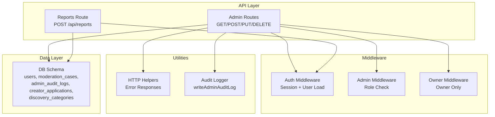

**Diagram sources**
- [admin.ts:85-86](file://src/worker/routes/admin.ts#L85-L86)
- [reports.ts:17-19](file://src/worker/routes/reports.ts#L17-L19)
- [auth.ts:23-50](file://src/worker/middleware/auth.ts#L23-L50)
- [admin.ts:5-13](file://src/worker/middleware/admin.ts#L5-L13)
- [http.ts:23-80](file://src/worker/lib/http.ts#L23-L80)
- [admin.ts:7-31](file://src/worker/lib/admin.ts#L7-L31)
- [schema.ts:5-43](file://src/worker/db/schema.ts#L5-L43)

**Section sources**
- [admin.ts:85-86](file://src/worker/routes/admin.ts#L85-L86)
- [reports.ts:17-19](file://src/worker/routes/reports.ts#L17-L19)
- [auth.ts:23-50](file://src/worker/middleware/auth.ts#L23-L50)
- [admin.ts:5-13](file://src/worker/middleware/admin.ts#L5-L13)
- [http.ts:23-80](file://src/worker/lib/http.ts#L23-L80)
- [admin.ts:7-31](file://src/worker/lib/admin.ts#L7-L31)
- [schema.ts:5-43](file://src/worker/db/schema.ts#L5-L43)

## Core Components
- Authentication and Authorization:
  - Auth middleware loads session and user context, including admin role. Suspended accounts are blocked.
  - Admin middleware requires an admin role; owner middleware restricts to owners only.
- Admin Routes:
  - Overview and Health endpoints provide platform metrics and system health signals.
  - Creator Applications endpoints allow listing, viewing details, downloading documents, approving, and rejecting applications.
  - Reports endpoints list and manage moderation cases, assign admins, and perform actions on posts, replies, or users.
  - Users endpoints list users, fetch details, suspend/restore users, and revoke sessions.
  - Discovery endpoints manage categories and featured creators (owner-only).
  - Audit Log endpoint lists admin actions with filtering.
  - Administrators endpoints list and manage administrator roles (owner-only).
- Audit Logging:
  - All administrative actions write structured audit logs and emit console events for observability.
- Error Handling:
  - Standardized error responses with codes like bad_request, unauthorized, forbidden, not_found, conflict, etc.

**Section sources**
- [auth.ts:23-50](file://src/worker/middleware/auth.ts#L23-L50)
- [admin.ts:5-13](file://src/worker/middleware/admin.ts#L5-L13)
- [admin.ts:88-170](file://src/worker/routes/admin.ts#L88-L170)
- [admin.ts:172-236](file://src/worker/routes/admin.ts#L172-L236)
- [admin.ts:238-305](file://src/worker/routes/admin.ts#L238-L305)
- [admin.ts:307-364](file://src/worker/routes/admin.ts#L307-L364)
- [admin.ts:366-474](file://src/worker/routes/admin.ts#L366-L474)
- [admin.ts:476-512](file://src/worker/routes/admin.ts#L476-L512)
- [admin.ts:7-31](file://src/worker/lib/admin.ts#L7-L31)
- [http.ts:23-80](file://src/worker/lib/http.ts#L23-L80)

## Architecture Overview
The administrative API follows a layered architecture:
- Client requests authenticate via session and are validated by auth middleware.
- Admin/owner middleware enforces RBAC before route handlers execute.
- Route handlers validate payloads using Zod schemas and interact with the database through Drizzle ORM or raw SQL.
- Administrative actions trigger notifications and audit logging.
- Health and overview endpoints aggregate multiple signals to provide a comprehensive status view.

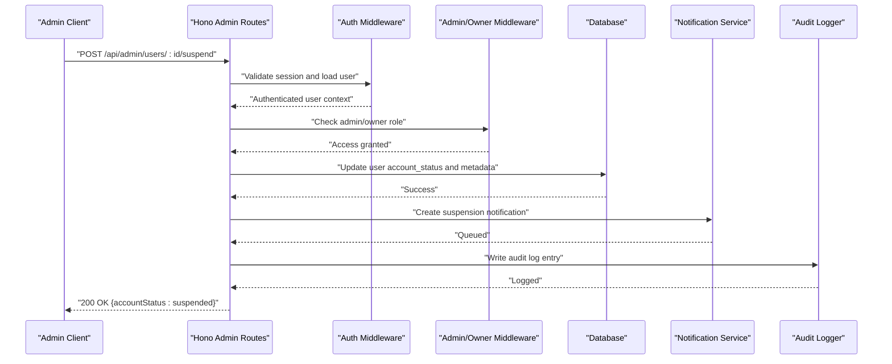

**Diagram sources**
- [admin.ts:334-342](file://src/worker/routes/admin.ts#L334-L342)
- [auth.ts:23-50](file://src/worker/middleware/auth.ts#L23-L50)
- [admin.ts:5-13](file://src/worker/middleware/admin.ts#L5-L13)
- [admin.ts:7-31](file://src/worker/lib/admin.ts#L7-L31)

## Detailed Component Analysis

### Authentication and Authorization
- Auth middleware ensures a valid session exists, loads user data including admin role, and blocks suspended accounts.
- Admin middleware requires any admin role; owner middleware restricts to owners only.
- Role checks prevent moderators from acting on other administrators.

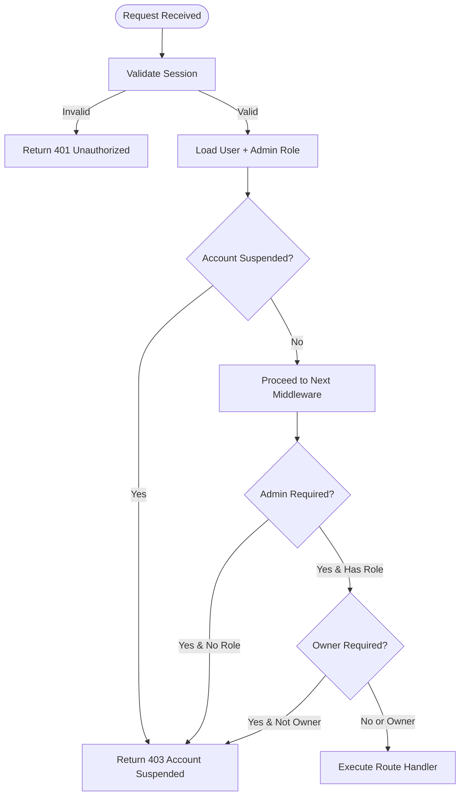

**Diagram sources**
- [auth.ts:23-50](file://src/worker/middleware/auth.ts#L23-L50)
- [admin.ts:5-13](file://src/worker/middleware/admin.ts#L5-L13)

**Section sources**
- [auth.ts:23-50](file://src/worker/middleware/auth.ts#L23-L50)
- [admin.ts:5-13](file://src/worker/middleware/admin.ts#L5-L13)

### User Management Endpoints
- GET /api/admin/users: List users with pagination and filters (role, account status, admin membership).
- GET /api/admin/users/:id: Fetch user details and recent audit history.
- POST /api/admin/users/:id/suspend: Suspend a user, send notification, revoke sessions, and log audit.
- POST /api/admin/users/:id/restore: Restore a user and notify them.
- POST /api/admin/users/:id/revoke-sessions: Revoke all active sessions for a user.

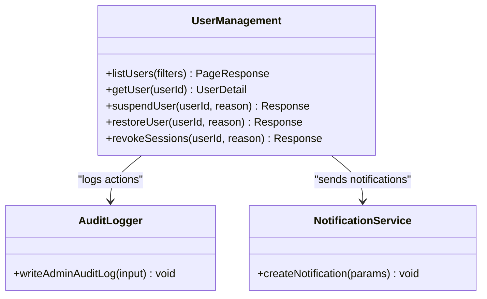

**Diagram sources**
- [admin.ts:307-364](file://src/worker/routes/admin.ts#L307-L364)
- [admin.ts:7-31](file://src/worker/lib/admin.ts#L7-L31)

**Section sources**
- [admin.ts:307-364](file://src/worker/routes/admin.ts#L307-L364)
- [admin.ts:7-31](file://src/worker/lib/admin.ts#L7-L31)

### Content Moderation Endpoints
- GET /api/admin/reports: List moderation cases with filters (status, target type, assignment).
- GET /api/admin/reports/:id: Get case details and associated reports.
- POST /api/admin/reports/:id/assign: Assign or unassign an admin to a case.
- POST /api/admin/reports/:id/action: Perform moderation actions (hide/restore/dismiss for posts/replies; suspend/restore_user for users).

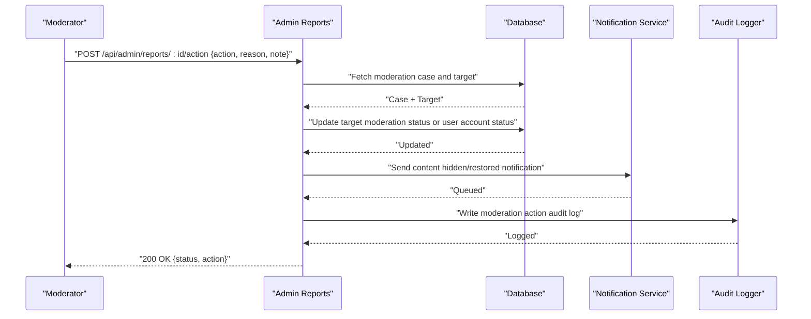

**Diagram sources**
- [admin.ts:238-305](file://src/worker/routes/admin.ts#L238-L305)
- [admin.ts:7-31](file://src/worker/lib/admin.ts#L7-L31)

**Section sources**
- [admin.ts:238-305](file://src/worker/routes/admin.ts#L238-L305)
- [admin.ts:7-31](file://src/worker/lib/admin.ts#L7-L31)

### Creator Applications Workflow
- GET /api/admin/applications: List applications with search and status filters.
- GET /api/admin/applications/:id: View application details.
- GET /api/admin/applications/:id/document: Download NID document (audit logged).
- POST /api/admin/applications/:id/approve: Approve application, set user role to creator, notify, and log.
- POST /api/admin/applications/:id/reject: Reject application with reason, notify, and log.

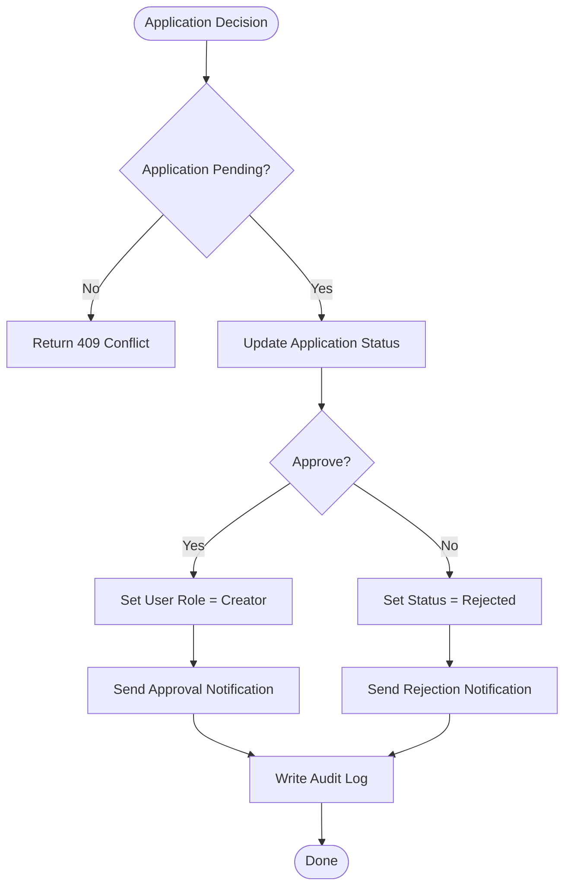

**Diagram sources**
- [admin.ts:172-236](file://src/worker/routes/admin.ts#L172-L236)
- [admin.ts:7-31](file://src/worker/lib/admin.ts#L7-L31)

**Section sources**
- [admin.ts:172-236](file://src/worker/routes/admin.ts#L172-L236)
- [admin.ts:7-31](file://src/worker/lib/admin.ts#L7-L31)

### Platform Analytics and System Health
- GET /api/admin/overview: Returns counts for users, creators, content, pending applications, open reports, suspended users, and hidden content.
- GET /api/admin/health: Aggregates multiple health signals (D1 availability, failed emails, stale uploads, memberships, webhooks, schedules, Stripe sandbox, review workload) and returns overall status.

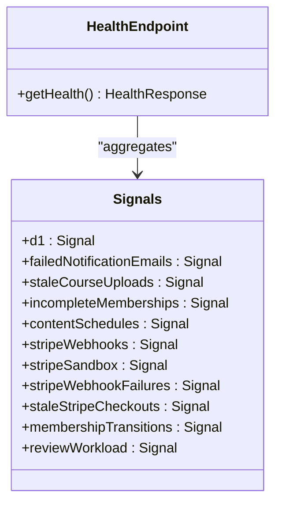

**Diagram sources**
- [admin.ts:88-170](file://src/worker/routes/admin.ts#L88-L170)

**Section sources**
- [admin.ts:88-170](file://src/worker/routes/admin.ts#L88-L170)

### Discovery Management (Owner-Only)
- GET /api/admin/discovery/categories: List categories with assignment counts.
- POST /api/admin/discovery/categories: Create category with slug generation and uniqueness checks.
- PUT /api/admin/discovery/categories/order: Bulk reorder categories with validation.
- PUT /api/admin/discovery/categories/:id: Update category name, description, and active state.
- GET /api/admin/discovery/eligible-creators: List eligible creators with search.
- GET /api/admin/discovery/featured: List current featured creators.
- PUT /api/admin/discovery/featured: Replace featured creators list with eligibility checks and audit logging.

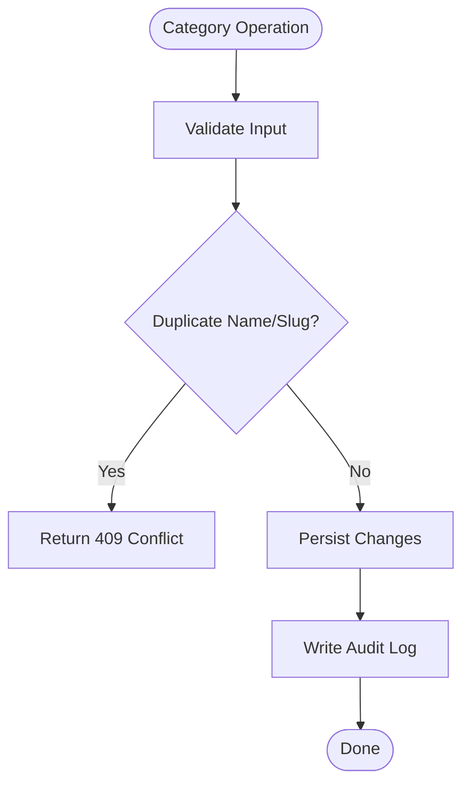

**Diagram sources**
- [admin.ts:366-474](file://src/worker/routes/admin.ts#L366-L474)
- [admin.ts:7-31](file://src/worker/lib/admin.ts#L7-L31)

**Section sources**
- [admin.ts:366-474](file://src/worker/routes/admin.ts#L366-L474)
- [admin.ts:7-31](file://src/worker/lib/admin.ts#L7-L31)

### Audit Log and Administrator Management
- GET /api/admin/audit-log: List audit entries with filtering by action.
- GET /api/admin/administrators: List administrators with roles and account status.
- POST /api/admin/administrators/:userId: Grant or update administrator role (ensures at least one owner remains).
- DELETE /api/admin/administrators/:userId: Revoke administrator role (ensures at least one owner remains).

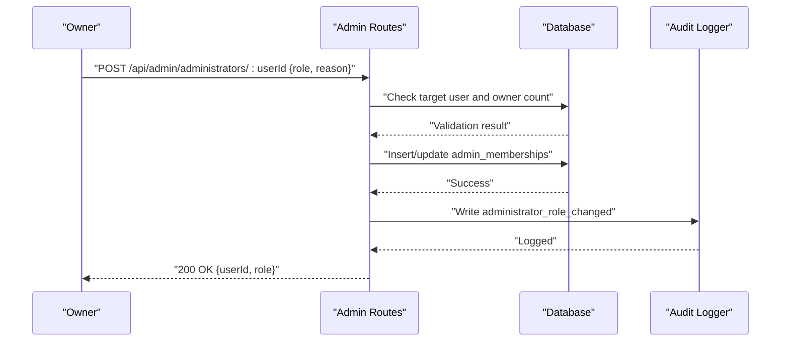

**Diagram sources**
- [admin.ts:476-512](file://src/worker/routes/admin.ts#L476-L512)
- [admin.ts:7-31](file://src/worker/lib/admin.ts#L7-L31)

**Section sources**
- [admin.ts:476-512](file://src/worker/routes/admin.ts#L476-L512)
- [admin.ts:7-31](file://src/worker/lib/admin.ts#L7-L31)

### Reporting Endpoint (Public-Facing)
- POST /api/reports: Submit a report for post, reply, or user. Creates or updates moderation case and prevents duplicate reports by the same reporter.

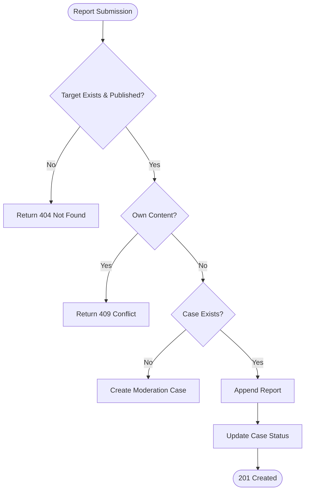

**Diagram sources**
- [reports.ts:19-80](file://src/worker/routes/reports.ts#L19-L80)

**Section sources**
- [reports.ts:19-80](file://src/worker/routes/reports.ts#L19-L80)

## Dependency Analysis
Administrative endpoints depend on:
- Authentication middleware for session validation and user loading.
- Admin/owner middleware for role enforcement.
- Database schema for users, moderation cases, audit logs, creator applications, and discovery categories.
- Utility functions for standardized error responses and audit logging.

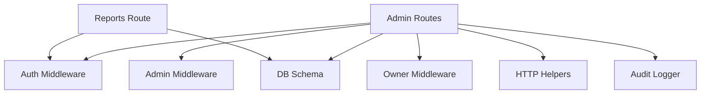

**Diagram sources**
- [admin.ts:85-86](file://src/worker/routes/admin.ts#L85-L86)
- [reports.ts:17-19](file://src/worker/routes/reports.ts#L17-L19)
- [auth.ts:23-50](file://src/worker/middleware/auth.ts#L23-L50)
- [admin.ts:5-13](file://src/worker/middleware/admin.ts#L5-L13)
- [schema.ts:5-43](file://src/worker/db/schema.ts#L5-L43)
- [http.ts:23-80](file://src/worker/lib/http.ts#L23-L80)
- [admin.ts:7-31](file://src/worker/lib/admin.ts#L7-L31)

**Section sources**
- [admin.ts:85-86](file://src/worker/routes/admin.ts#L85-L86)
- [reports.ts:17-19](file://src/worker/routes/reports.ts#L17-L19)
- [auth.ts:23-50](file://src/worker/middleware/auth.ts#L23-L50)
- [admin.ts:5-13](file://src/worker/middleware/admin.ts#L5-L13)
- [schema.ts:5-43](file://src/worker/db/schema.ts#L5-L43)
- [http.ts:23-80](file://src/worker/lib/http.ts#L23-L80)
- [admin.ts:7-31](file://src/worker/lib/admin.ts#L7-L31)

## Performance Considerations
- Pagination: All list endpoints support page and pageSize parameters to limit data transfer and improve response times.
- Batch Operations: Bulk updates (e.g., category ordering, featured creators replacement) use batched statements to reduce round trips.
- Query Optimization: Indexes on frequently filtered fields (account_status, moderation_status, created_at) enhance query performance.
- Health Aggregation: Health endpoint uses parallel queries to minimize latency while aggregating multiple signals.

[No sources needed since this section provides general guidance]

## Troubleshooting Guide
Common issues and resolutions:
- Unauthorized Access: Ensure valid session and correct admin/owner role.
- Forbidden Actions: Moderators cannot act on other administrators; verify target admin role.
- Validation Errors: Payload must match expected schema; check required fields and constraints.
- Conflicts: Duplicate resources (e.g., category names, reported items) return conflicts; adjust input accordingly.
- Suspended Accounts: Suspended users cannot access protected endpoints; restore account first.

**Section sources**
- [http.ts:23-80](file://src/worker/lib/http.ts#L23-L80)
- [admin.ts:79-83](file://src/worker/routes/admin.ts#L79-L83)
- [reports.ts:29-31](file://src/worker/routes/reports.ts#L29-L31)

## Conclusion
The Administration API provides comprehensive tools for managing users, moderating content, analyzing platform health, and administering system settings. Robust RBAC ensures secure access, while audit logging supports compliance and accountability. Best practices include using pagination, validating inputs, handling errors consistently, and leveraging batch operations for efficiency.

[No sources needed since this section summarizes without analyzing specific files]

## Appendices

### Permission Matrix
- Owner: Full access to all admin endpoints, including discovery and administrators management.
- Moderator: Access to overview, health, applications, reports, users, audit log; cannot act on other administrators.
- Regular Users: No access to admin endpoints; can submit reports via public endpoint.

**Section sources**
- [admin.ts:5-13](file://src/worker/middleware/admin.ts#L5-L13)
- [auth.ts:23-50](file://src/worker/middleware/auth.ts#L23-L50)

### Audit Trail Fields
- actorId: ID of the admin performing the action.
- action: Type of action (e.g., user_suspended, moderation_hide).
- targetType: Entity type affected (user, post, reply, etc.).
- targetId: ID of the affected entity.
- reason: Explanation for the action.
- metadata: Additional context (JSON stringified).

**Section sources**
- [admin.ts:7-31](file://src/worker/lib/admin.ts#L7-L31)
- [0011_admin_dashboard.sql:72-87](file://drizzle/0011_admin_dashboard.sql#L72-L87)

### Compliance Reporting
- Use audit log endpoint to export administrative actions for compliance reviews.
- Filter by action type to focus on specific operations (e.g., suspensions, role changes).
- Combine with moderation case data to assess content moderation effectiveness.

**Section sources**
- [admin.ts:476-485](file://src/worker/routes/admin.ts#L476-L485)
- [admin.ts:238-252](file://src/worker/routes/admin.ts#L238-L252)