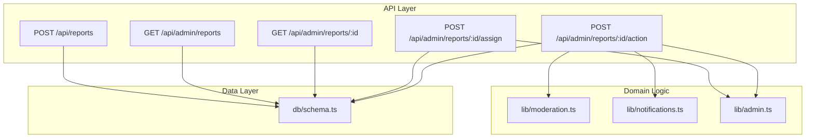
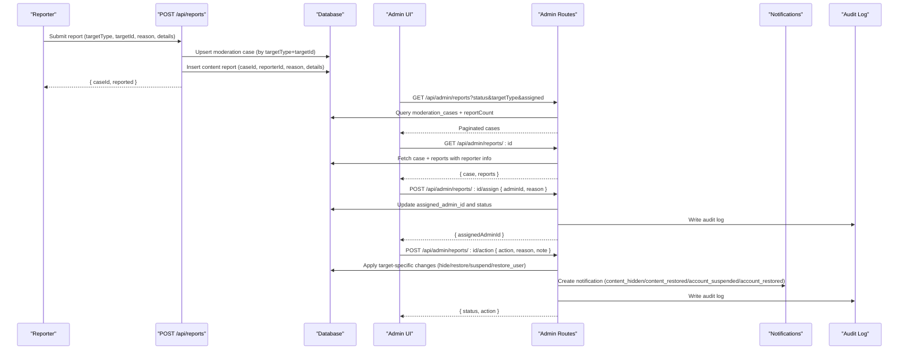
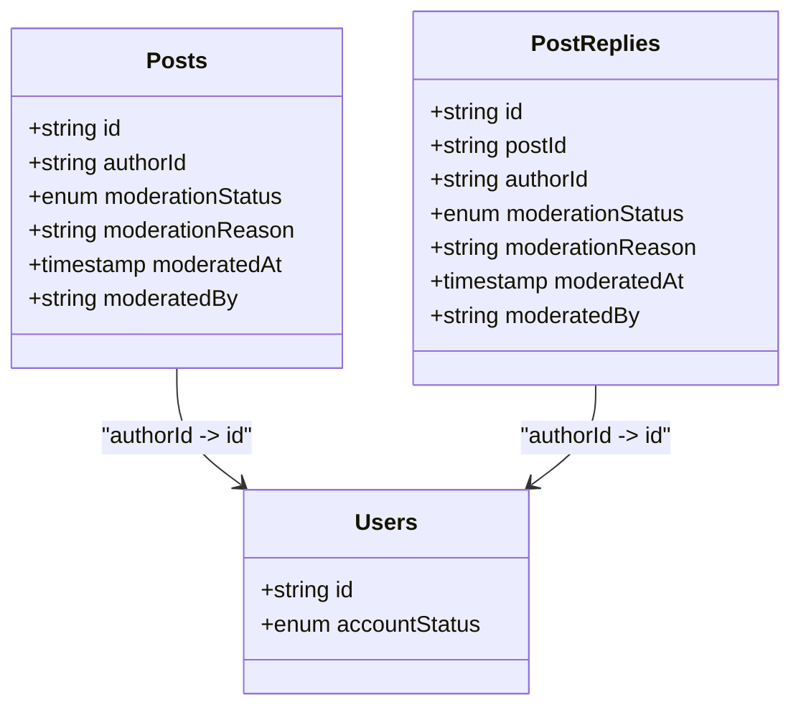
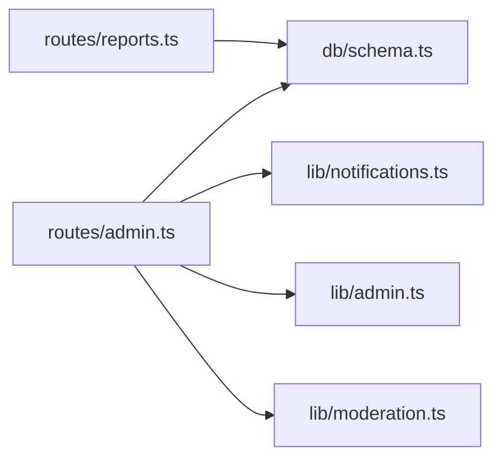

# Content Moderation API

<cite>
**Referenced Files in This Document**
- [reports.ts](file://src/worker/routes/reports.ts)
- [admin.ts](file://src/worker/routes/admin.ts)
- [schema.ts](file://src/worker/db/schema.ts)
- [moderation.ts](file://src/worker/lib/moderation.ts)
- [notifications.ts](file://src/worker/lib/notifications.ts)
- [admin.ts](file://src/worker/lib/admin.ts)
</cite>

## Table of Contents
1. [Introduction](#introduction)
2. [Project Structure](#project-structure)
3. [Core Components](#core-components)
4. [Architecture Overview](#architecture-overview)
5. [Detailed Component Analysis](#detailed-component-analysis)
6. [Dependency Analysis](#dependency-analysis)
7. [Performance Considerations](#performance-considerations)
8. [Troubleshooting Guide](#troubleshooting-guide)
9. [Conclusion](#conclusion)

## Introduction
This document provides comprehensive API documentation for the content moderation system. It covers:
- Reporting content and users to create moderation cases
- Listing and filtering moderation cases by status, target type, and assignment
- Retrieving case details with associated reports
- Assignment workflows for moderators
- Action execution (hide, restore, dismiss, suspend, restore_user)
- Content visibility management and user suspension from reports
- Notification triggers on moderation actions
- Case lifecycle states, action validation rules, and audit logging requirements
- Multi-target moderation scenarios and cross-content enforcement considerations

## Project Structure
The moderation system is implemented as a set of worker routes and libraries backed by a relational schema:
- Public reporting endpoint creates or reuses moderation cases and records reports
- Admin endpoints provide listing, assignment, and resolution actions
- Schema defines moderation cases, content reports, audit logs, and related entities
- Libraries handle moderation state checks, notifications, and audit logging



**Diagram sources**
- [reports.ts:1-81](file://src/worker/routes/reports.ts#L1-L81)
- [admin.ts:238-305](file://src/worker/routes/admin.ts#L238-L305)
- [schema.ts:625-667](file://src/worker/db/schema.ts#L625-L667)
- [moderation.ts:1-17](file://src/worker/lib/moderation.ts#L1-L17)
- [notifications.ts:153-200](file://src/worker/lib/notifications.ts#L153-L200)
- [admin.ts:1-53](file://src/worker/lib/admin.ts#L1-L53)

**Section sources**
- [reports.ts:1-81](file://src/worker/routes/reports.ts#L1-L81)
- [admin.ts:238-305](file://src/worker/routes/admin.ts#L238-L305)
- [schema.ts:625-667](file://src/worker/db/schema.ts#L625-L667)
- [moderation.ts:1-17](file://src/worker/lib/moderation.ts#L1-L17)
- [notifications.ts:153-200](file://src/worker/lib/notifications.ts#L153-L200)
- [admin.ts:1-53](file://src/worker/lib/admin.ts#L1-L53)

## Core Components
- Reporting endpoint: Creates or reuses a moderation case per unique target and records a report with reason and optional details. Prevents self-reporting and duplicates.
- Admin report listing: Paginated list with filters for status, target type, and assignment (me/unassigned).
- Case detail retrieval: Returns the case and all associated reports with reporter info.
- Assignment workflow: Assign or unassign an admin; transitions case to reviewing/open accordingly.
- Action execution: Applies target-specific actions (hide/restore/dismiss for posts/replies; suspend/restore_user/dismiss for users), updates case status, writes audit log, and sends notifications where applicable.
- Moderation state helpers: Determine post visibility based on content moderation status and author account status.

**Section sources**
- [reports.ts:10-80](file://src/worker/routes/reports.ts#L10-L80)
- [admin.ts:238-305](file://src/worker/routes/admin.ts#L238-L305)
- [moderation.ts:5-16](file://src/worker/lib/moderation.ts#L5-L16)

## Architecture Overview
The moderation flow spans public reporting, admin review, and side effects (content visibility changes, user suspension, notifications, audit logs).



**Diagram sources**
- [reports.ts:19-80](file://src/worker/routes/reports.ts#L19-L80)
- [admin.ts:238-305](file://src/worker/routes/admin.ts#L238-L305)
- [notifications.ts:153-200](file://src/worker/lib/notifications.ts#L153-L200)
- [admin.ts:7-31](file://src/worker/lib/admin.ts#L7-L31)

## Detailed Component Analysis

### Report Submission
- Endpoint: POST /api/reports
- Authentication: Required
- Request body:
  - targetType: one of post, reply, user
  - targetId: string identifier
  - reason: one of spam, harassment, hate, sexual, violence, copyright, impersonation, other
  - details: optional string
- Behavior:
  - Validates target existence and ownership constraints (cannot report own content/profile)
  - Ensures a single moderation case per unique (targetType, targetId)
  - Prevents duplicate reports from the same reporter on the same case
  - Creates or reuses case, inserts report, sets case status to open
- Response: 201 with { caseId, reported }

**Section sources**
- [reports.ts:10-80](file://src/worker/routes/reports.ts#L10-L80)
- [schema.ts:643-653](file://src/worker/db/schema.ts#L643-L653)

### List Moderation Cases
- Endpoint: GET /api/admin/reports
- Authentication: Admin required
- Query parameters:
  - page: integer (default 1)
  - pageSize: integer (default 20, max 50)
  - status: filter by open, reviewing, resolved, dismissed (empty for all)
  - targetType: filter by post, reply, user (empty for all)
  - assigned: empty, me, unassigned
- Response: { items, page, pageSize, total }
- Notes: Includes aggregated report count per case

**Section sources**
- [admin.ts:238-252](file://src/worker/routes/admin.ts#L238-L252)
- [schema.ts:625-641](file://src/worker/db/schema.ts#L625-L641)

### Get Case Detail with Reports
- Endpoint: GET /api/admin/reports/:id
- Authentication: Admin required
- Response: { case, reports }
- Reports include reporter email and username

**Section sources**
- [admin.ts:254-259](file://src/worker/routes/admin.ts#L254-L259)
- [schema.ts:643-653](file://src/worker/db/schema.ts#L643-L653)

### Assignment Workflow
- Endpoint: POST /api/admin/reports/:id/assign
- Authentication: Admin required
- Request body:
  - adminId: nullable string (null to unassign)
  - reason: string (min 3, max 500)
- Behavior:
  - Validates assignee role if provided
  - Updates assigned_admin_id and sets status to reviewing when assigned, open when unassigned
  - Writes audit log
- Response: { assignedAdminId }

**Section sources**
- [admin.ts:261-270](file://src/worker/routes/admin.ts#L261-L270)
- [schema.ts:625-641](file://src/worker/db/schema.ts#L625-L641)
- [admin.ts:7-31](file://src/worker/lib/admin.ts#L7-L31)

### Action Execution
- Endpoint: POST /api/admin/reports/:id/action
- Authentication: Admin required
- Request body:
  - action: one of hide, restore, dismiss, suspend, restore_user
  - reason: string (min 3, max 500)
  - note: optional string (max 1000)
- Validation and behavior by target type:
  - post: allowed actions hide, restore, dismiss; hides/restores post and sets moderation fields; marks resolved or dismissed
  - reply: allowed actions hide, restore, dismiss; hides/restores reply and sets moderation fields; marks resolved or dismissed
  - user: allowed actions suspend, restore_user, dismiss; suspends/restores user account; marks resolved or dismissed
- Side effects:
  - Updates moderation case status and metadata (resolutionAction, resolutionNote, resolvedBy, resolvedAt)
  - Writes audit log entry
  - Sends notifications for content hide/restore and user suspension/restoration
- Response: { status, action }

```mermaid
flowchart TD
Start([Function Entry]) --> LoadCase["Load moderation case"]
LoadCase --> CheckTarget{"Target Type?"}
CheckTarget --> |post| PostFlow["Validate action in {hide, restore, dismiss}<br/>Update post moderation fields"]
CheckTarget --> |reply| ReplyFlow["Validate action in {hide, restore, dismiss}<br/>Update reply moderation fields"]
CheckTarget --> |user| UserFlow["Validate action in {suspend, restore_user, dismiss}<br/>Ensure permissions<br/>Suspend/Restore user"]
PostFlow --> SetStatus["Set case status resolved or dismissed"]
ReplyFlow --> SetStatus
UserFlow --> SetStatus
SetStatus --> Audit["Write audit log"]
Audit --> Notify{"Action requires notification?"}
Notify --> |hide/restore| SendContentNotify["Create content_hidden/content_restored notification"]
Notify --> |suspend/restore_user| SendAccountNotify["Create account_suspended/account_restored notification"]
Notify --> |dismiss| End([Return { status, action }])
SendContentNotify --> End
SendAccountNotify --> End
```

**Diagram sources**
- [admin.ts:272-305](file://src/worker/routes/admin.ts#L272-L305)
- [notifications.ts:153-200](file://src/worker/lib/notifications.ts#L153-L200)
- [admin.ts:7-31](file://src/worker/lib/admin.ts#L7-L31)

**Section sources**
- [admin.ts:272-305](file://src/worker/routes/admin.ts#L272-L305)
- [schema.ts:625-641](file://src/worker/db/schema.ts#L625-L641)
- [notifications.ts:153-200](file://src/worker/lib/notifications.ts#L153-L200)
- [admin.ts:7-31](file://src/worker/lib/admin.ts#L7-L31)

### Content Visibility and Cross-Content Enforcement
- Post visibility check: A post is visible only if its moderationStatus is active and the author’s accountStatus is active.
- Reply visibility: Replies share the same moderationStatus field and are subject to similar visibility logic.
- Suspension impact: Suspending a user affects their ability to interact and may influence visibility depending on downstream checks.



**Diagram sources**
- [schema.ts:168-188](file://src/worker/db/schema.ts#L168-L188)
- [schema.ts:465-483](file://src/worker/db/schema.ts#L465-L483)
- [schema.ts:5-32](file://src/worker/db/schema.ts#L5-L32)

**Section sources**
- [moderation.ts:5-16](file://src/worker/lib/moderation.ts#L5-L16)
- [schema.ts:168-188](file://src/worker/db/schema.ts#L168-L188)
- [schema.ts:465-483](file://src/worker/db/schema.ts#L465-L483)
- [schema.ts:5-32](file://src/worker/db/schema.ts#L5-L32)

### Notifications Triggers
- Content hidden: Triggered when a moderator hides content (post/reply).
- Content restored: Triggered when a moderator restores content (post/reply).
- Account suspended: Triggered when a user is suspended via moderation action or direct admin action.
- Account restored: Triggered when a user is restored.
- Deduplication and preferences: Notifications are deduplicated by key and respect user preferences; account category emails are always sent when forceEmail is true.

**Section sources**
- [notifications.ts:153-200](file://src/worker/lib/notifications.ts#L153-L200)
- [schema.ts:871-896](file://src/worker/db/schema.ts#L871-L896)
- [admin.ts:514-529](file://src/worker/routes/admin.ts#L514-L529)

### Audit Logging Requirements
- All moderation actions write structured audit entries including actor, action, target type/id, reason, and optional metadata.
- Console logging also emits event summaries for observability.

**Section sources**
- [admin.ts:7-31](file://src/worker/lib/admin.ts#L7-L31)
- [schema.ts:655-667](file://src/worker/db/schema.ts#L655-L667)
- [admin.ts:261-270](file://src/worker/routes/admin.ts#L261-L270)
- [admin.ts:272-305](file://src/worker/routes/admin.ts#L272-L305)

## Dependency Analysis
Moderation endpoints depend on:
- Database schema for moderation cases, content reports, audit logs, and related entities
- Notification library for creating and sending notifications
- Admin utilities for writing audit logs and enforcing roles



**Diagram sources**
- [reports.ts:1-81](file://src/worker/routes/reports.ts#L1-L81)
- [admin.ts:238-305](file://src/worker/routes/admin.ts#L238-L305)
- [schema.ts:625-667](file://src/worker/db/schema.ts#L625-L667)
- [notifications.ts:153-200](file://src/worker/lib/notifications.ts#L153-L200)
- [admin.ts:1-53](file://src/worker/lib/admin.ts#L1-L53)
- [moderation.ts:1-17](file://src/worker/lib/moderation.ts#L1-L17)

**Section sources**
- [reports.ts:1-81](file://src/worker/routes/reports.ts#L1-L81)
- [admin.ts:238-305](file://src/worker/routes/admin.ts#L238-L305)
- [schema.ts:625-667](file://src/worker/db/schema.ts#L625-L667)
- [notifications.ts:153-200](file://src/worker/lib/notifications.ts#L153-L200)
- [admin.ts:1-53](file://src/worker/lib/admin.ts#L1-L53)
- [moderation.ts:1-17](file://src/worker/lib/moderation.ts#L1-L17)

## Performance Considerations
- Pagination: Admin listing uses page and pageSize with bounded defaults to prevent large payloads.
- Batch operations: Report submission batches insert and update operations to reduce round-trips.
- Indexes: Schema includes indexes on moderation_cases.status and updatedAt, and content_reports.case_created_idx to optimize queries.
- Deduplication: Notifications use dedupe keys to avoid redundant processing.

[No sources needed since this section provides general guidance]

## Troubleshooting Guide
Common issues and resolutions:
- Duplicate report error: Occurs when the same reporter attempts to report the same item again. Ensure the case exists and no prior report from the reporter exists.
- Invalid action for target: Actions must match target type (e.g., suspend not allowed for posts). Validate input before calling.
- Permission denied for user actions: Moderators cannot act on administrators; ensure the target is not an admin unless acting as owner.
- Missing target: If the reported post/reply/user does not exist, the request will fail. Verify identifiers.
- Notification delivery: Check user notification preferences and email configuration; account-related notifications can be forced via forceEmail.

**Section sources**
- [reports.ts:29-60](file://src/worker/routes/reports.ts#L29-L60)
- [admin.ts:284-298](file://src/worker/routes/admin.ts#L284-L298)
- [notifications.ts:153-200](file://src/worker/lib/notifications.ts#L153-L200)

## Conclusion
The moderation system provides a robust workflow for reporting, reviewing, assigning, and resolving content and user issues. It enforces strict validation rules, maintains clear state transitions, and ensures transparency through audit logs and notifications. The design supports multi-target moderation and cross-content enforcement by centralizing case management and applying targeted side effects consistently across posts, replies, and users.