# Content Moderation Workflow

<cite>
**Referenced Files in This Document**
- [reports.ts](file://src/worker/routes/reports.ts)
- [admin.ts](file://src/worker/routes/admin.ts)
- [schema.ts](file://src/worker/db/schema.ts)
- [notifications.ts](file://src/worker/lib/notifications.ts)
- [auth.ts](file://src/worker/middleware/auth.ts)
- [admin.ts](file://src/worker/middleware/admin.ts)
- [moderation.ts](file://src/worker/lib/moderation.ts)
- [AdminPage.tsx](file://src/react-app/pages/AdminPage.tsx)
- [ReportDialog.tsx](file://src/react-app/components/ReportDialog.tsx)
- [admin.ts](file://src/react-app/lib/admin.ts)
</cite>

## Table of Contents
1. [Introduction](#introduction)
2. [Project Structure](#project-structure)
3. [Core Components](#core-components)
4. [Architecture Overview](#architecture-overview)
5. [Detailed Component Analysis](#detailed-component-analysis)
6. [Dependency Analysis](#dependency-analysis)
7. [Performance Considerations](#performance-considerations)
8. [Troubleshooting Guide](#troubleshooting-guide)
9. [Conclusion](#conclusion)
10. [Appendices](#appendices)

## Introduction
This document explains the complete content moderation workflow, from report submission through case resolution. It covers:
- Case lifecycle and status transitions (open → reviewing → resolved/dismissed)
- Relationship between content reports and moderation cases
- Multi-target moderation scenarios (post, reply, user)
- Cross-content enforcement policies (visibility checks and account-level actions)
- Audit logging for all moderation actions
- Notification triggers to content creators
- Role-based access control for moderators vs owners
- Common moderation scenarios, bulk operations, and integration with notifications
- Edge cases such as suspended users and administrator protection mechanisms

## Project Structure
The moderation system spans backend routes, middleware, database schema, utilities, and the admin UI:
- Backend routes handle reporting and administrative actions
- Middleware enforces authentication and role-based authorization
- Database schema defines moderation cases, reports, and audit logs
- Utilities implement visibility checks and notification creation
- Admin UI provides interfaces for assigning, acting on, and auditing moderation cases

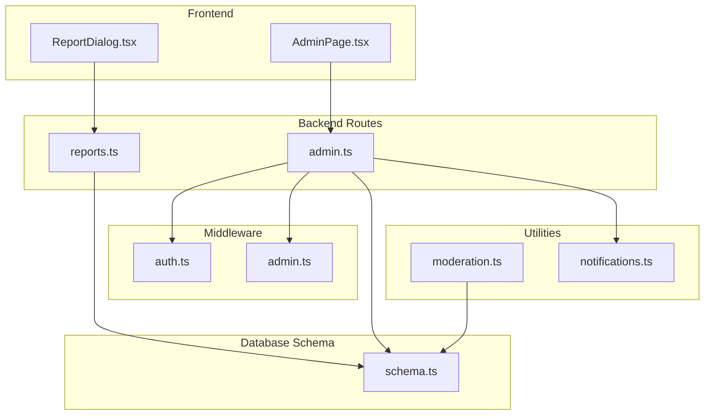

**Diagram sources**
- [reports.ts](file://src/worker/routes/reports.ts)
- [admin.ts](file://src/worker/routes/admin.ts)
- [auth.ts](file://src/worker/middleware/auth.ts)
- [admin.ts](file://src/worker/middleware/admin.ts)
- [schema.ts](file://src/worker/db/schema.ts)
- [moderation.ts](file://src/worker/lib/moderation.ts)
- [notifications.ts](file://src/worker/lib/notifications.ts)
- [AdminPage.tsx](file://src/react-app/pages/AdminPage.tsx)
- [ReportDialog.tsx](file://src/react-app/components/ReportDialog.tsx)

**Section sources**
- [reports.ts](file://src/worker/routes/reports.ts)
- [admin.ts](file://src/worker/routes/admin.ts)
- [schema.ts](file://src/worker/db/schema.ts)
- [notifications.ts](file://src/worker/lib/notifications.ts)
- [auth.ts](file://src/worker/middleware/auth.ts)
- [admin.ts](file://src/worker/middleware/admin.ts)
- [moderation.ts](file://src/worker/lib/moderation.ts)
- [AdminPage.tsx](file://src/react-app/pages/AdminPage.tsx)
- [ReportDialog.tsx](file://src/react-app/components/ReportDialog.tsx)

## Core Components
- Reporting endpoint: Creates or reopens a moderation case and records a report entry
- Administrative endpoints: Assign cases, perform actions (hide/restore/suspend/restore_user/dismiss), list reports, and audit logs
- Database models: moderation_cases, content_reports, admin_audit_logs
- Visibility utility: Determines if a post is visible based on moderation status and author account status
- Notifications: Sends account-category notifications for moderation outcomes and suspensions/restorations
- Auth and admin middleware: Enforce session validity, suspension checks, and role-based access

**Section sources**
- [reports.ts](file://src/worker/routes/reports.ts)
- [admin.ts](file://src/worker/routes/admin.ts)
- [schema.ts](file://src/worker/db/schema.ts)
- [moderation.ts](file://src/worker/lib/moderation.ts)
- [notifications.ts](file://src/worker/lib/notifications.ts)
- [auth.ts](file://src/worker/middleware/auth.ts)
- [admin.ts](file://src/worker/middleware/admin.ts)

## Architecture Overview
The moderation workflow integrates frontend reporting, backend routing, database persistence, and side effects (audit logs and notifications).

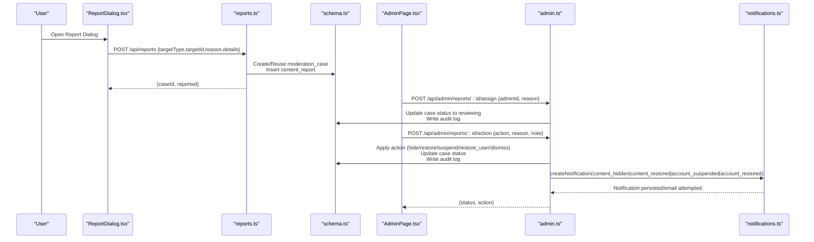

**Diagram sources**
- [reports.ts](file://src/worker/routes/reports.ts)
- [admin.ts](file://src/worker/routes/admin.ts)
- [schema.ts](file://src/worker/db/schema.ts)
- [notifications.ts](file://src/worker/lib/notifications.ts)
- [AdminPage.tsx](file://src/react-app/pages/AdminPage.tsx)
- [ReportDialog.tsx](file://src/react-app/components/ReportDialog.tsx)

## Detailed Component Analysis

### Reporting Flow
- Input validation ensures target type and reason are allowed
- Target existence check prevents self-reporting and validates published targets
- Case creation or reuse ensures one active case per target
- Duplicate report prevention by reporter per case
- Batch writes ensure atomic updates to case status and report insertion

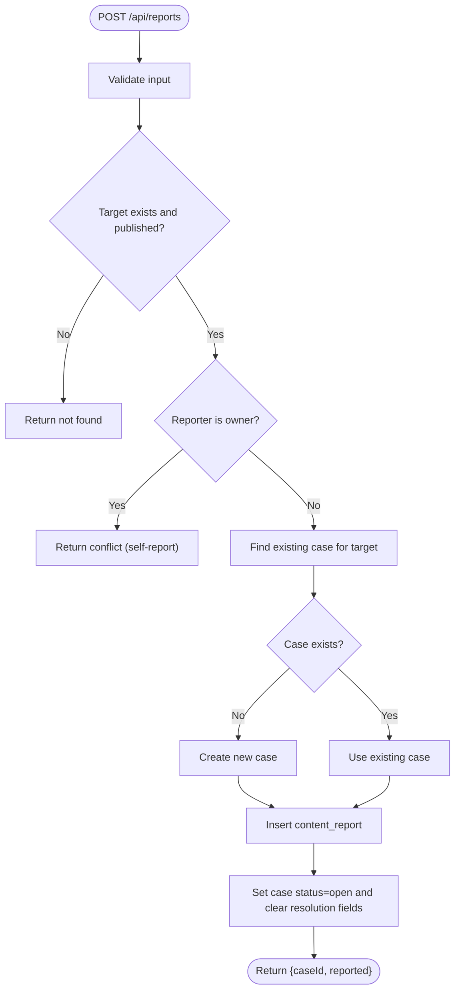

**Diagram sources**
- [reports.ts](file://src/worker/routes/reports.ts)
- [schema.ts](file://src/worker/db/schema.ts)

**Section sources**
- [reports.ts](file://src/worker/routes/reports.ts)
- [schema.ts](file://src/worker/db/schema.ts)

### Case Assignment and Status Transitions
- Assignment sets assignedAdminId and moves case to reviewing
- Clearing assignment returns case to open
- All assignments are audited

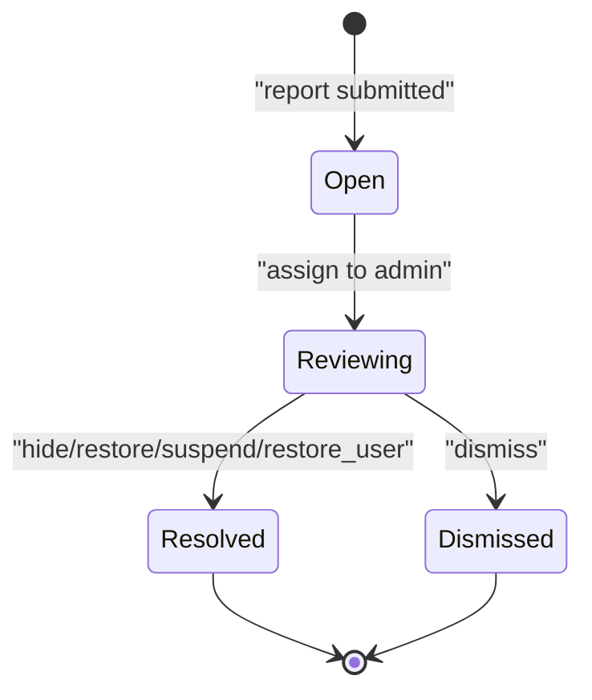

**Diagram sources**
- [admin.ts](file://src/worker/routes/admin.ts)
- [schema.ts](file://src/worker/db/schema.ts)

**Section sources**
- [admin.ts](file://src/worker/routes/admin.ts)
- [schema.ts](file://src/worker/db/schema.ts)

### Administrative Actions
- Post/Reply actions: hide, restore, dismiss
- User actions: suspend, restore_user, dismiss
- Action validation depends on target type
- Suspend/restore update user account status and revoke sessions; notifications sent
- Audit logs record actor, action, target, reason, and metadata

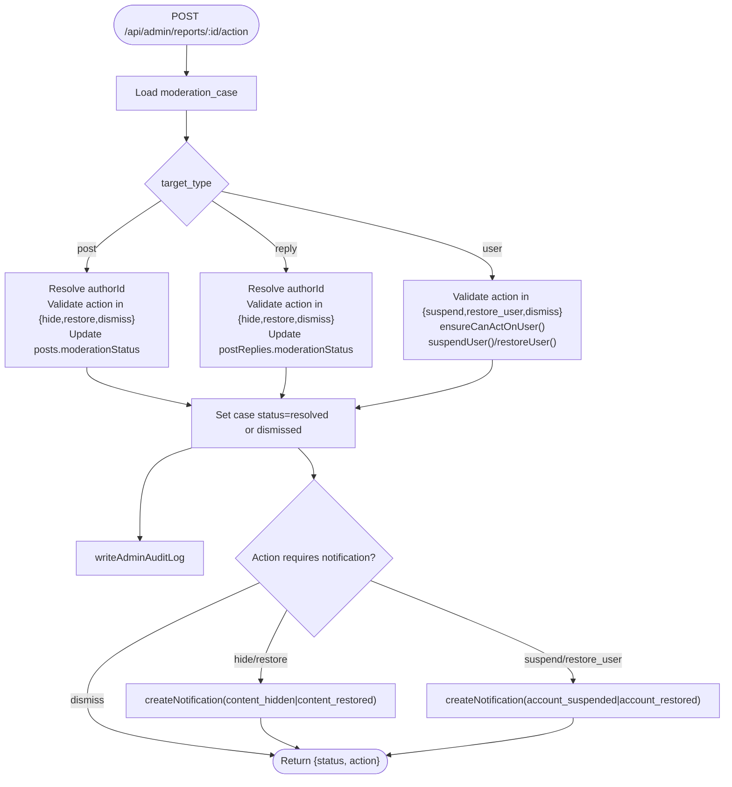

**Diagram sources**
- [admin.ts](file://src/worker/routes/admin.ts)
- [notifications.ts](file://src/worker/lib/notifications.ts)
- [schema.ts](file://src/worker/db/schema.ts)

**Section sources**
- [admin.ts](file://src/worker/routes/admin.ts)
- [notifications.ts](file://src/worker/lib/notifications.ts)
- [schema.ts](file://src/worker/db/schema.ts)

### Visibility Enforcement
- Post visibility determined by moderation status and author account status
- Consumers can use the utility to decide whether to show content

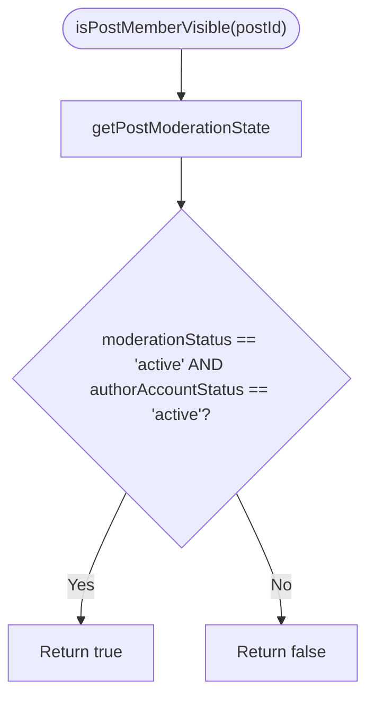

**Diagram sources**
- [moderation.ts](file://src/worker/lib/moderation.ts)
- [schema.ts](file://src/worker/db/schema.ts)

**Section sources**
- [moderation.ts](file://src/worker/lib/moderation.ts)
- [schema.ts](file://src/worker/db/schema.ts)

### Audit Logging
- Every administrative action writes an audit log entry
- Includes actor, action, target type/id, reason, and optional metadata
- Admin UI exposes paginated audit log view

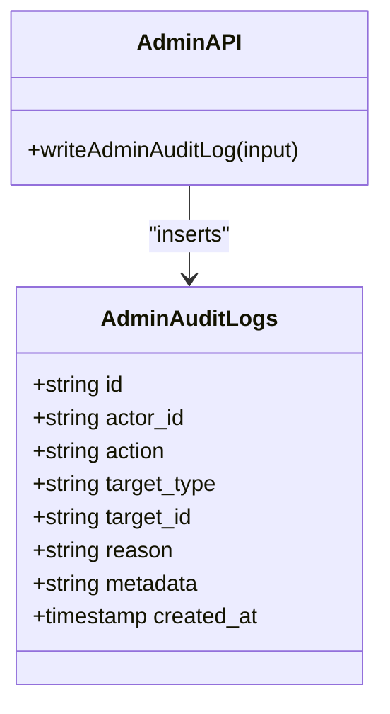

**Diagram sources**
- [schema.ts](file://src/worker/db/schema.ts)
- [admin.ts](file://src/worker/lib/admin.ts)

**Section sources**
- [schema.ts](file://src/worker/db/schema.ts)
- [admin.ts](file://src/worker/lib/admin.ts)
- [AdminPage.tsx](file://src/react-app/pages/AdminPage.tsx)

### Notification Integration
- Notifications are created for moderation actions affecting content visibility and account status
- Deduplication via dedupeKey prevents duplicate messages
- Email delivery attempted when preferences allow or forceEmail is set

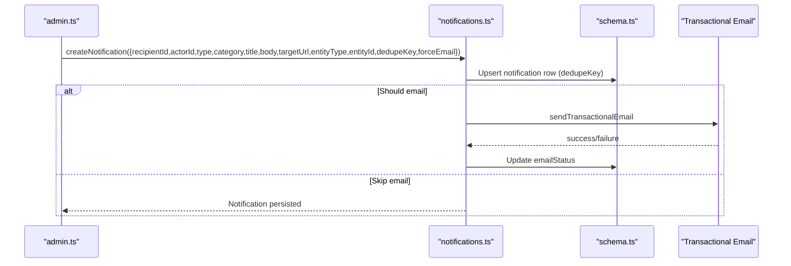

**Diagram sources**
- [notifications.ts](file://src/worker/lib/notifications.ts)
- [schema.ts](file://src/worker/db/schema.ts)
- [admin.ts](file://src/worker/routes/admin.ts)

**Section sources**
- [notifications.ts](file://src/worker/lib/notifications.ts)
- [schema.ts](file://src/worker/db/schema.ts)
- [admin.ts](file://src/worker/routes/admin.ts)

### Role-Based Access Control
- Authentication middleware validates session and rejects suspended accounts
- Admin middleware requires any admin role; owner middleware restricts to owners
- Moderator cannot act on administrators; owner protections prevent removing the last owner

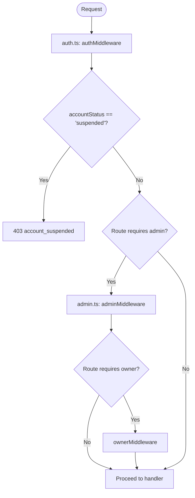

**Diagram sources**
- [auth.ts](file://src/worker/middleware/auth.ts)
- [admin.ts](file://src/worker/middleware/admin.ts)
- [admin.ts](file://src/worker/routes/admin.ts)

**Section sources**
- [auth.ts](file://src/worker/middleware/auth.ts)
- [admin.ts](file://src/worker/middleware/admin.ts)
- [admin.ts](file://src/worker/routes/admin.ts)

### Admin UI Workflows
- Reports page lists cases with filters and allows assign, dismiss, suspend/restore, and restore actions
- Audit log page displays paginated history with actor, action, target, reason, and time
- Administrator management allows granting/promoting/demoting roles and revoking access

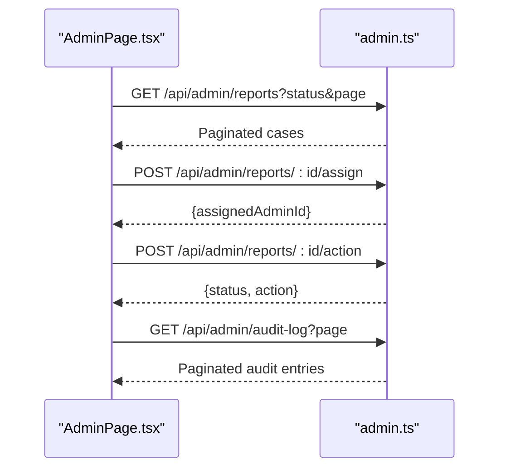

**Diagram sources**
- [AdminPage.tsx](file://src/react-app/pages/AdminPage.tsx)
- [admin.ts](file://src/worker/routes/admin.ts)

**Section sources**
- [AdminPage.tsx](file://src/react-app/pages/AdminPage.tsx)
- [admin.ts](file://src/worker/routes/admin.ts)

## Dependency Analysis
- Reporting route depends on schema definitions for moderation_cases and content_reports
- Administrative actions depend on schema for moderation_cases, posts, postReplies, users, and admin_audit_logs
- Visibility utility depends on posts and users tables
- Notifications depend on notification preferences and users tables
- Middleware depends on users and admin_memberships for role checks

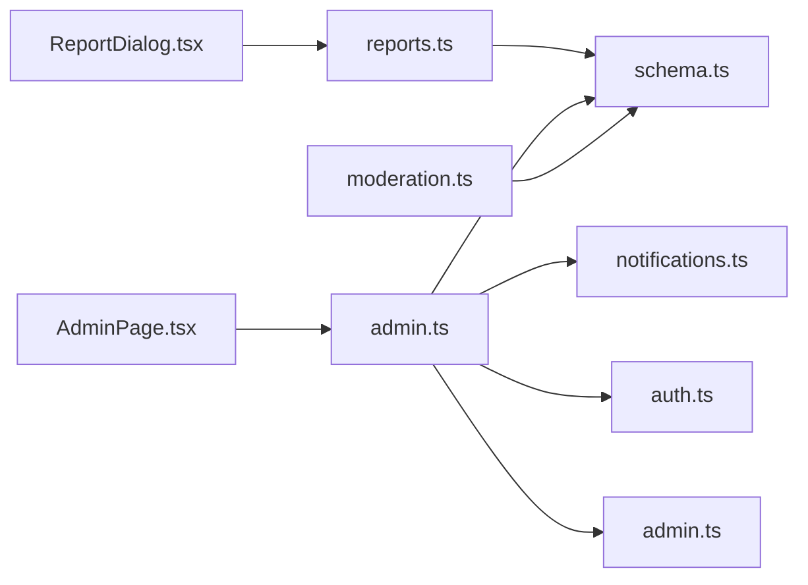

**Diagram sources**
- [reports.ts](file://src/worker/routes/reports.ts)
- [admin.ts](file://src/worker/routes/admin.ts)
- [schema.ts](file://src/worker/db/schema.ts)
- [notifications.ts](file://src/worker/lib/notifications.ts)
- [auth.ts](file://src/worker/middleware/auth.ts)
- [admin.ts](file://src/worker/middleware/admin.ts)
- [moderation.ts](file://src/worker/lib/moderation.ts)
- [AdminPage.tsx](file://src/react-app/pages/AdminPage.tsx)
- [ReportDialog.tsx](file://src/react-app/components/ReportDialog.tsx)

**Section sources**
- [reports.ts](file://src/worker/routes/reports.ts)
- [admin.ts](file://src/worker/routes/admin.ts)
- [schema.ts](file://src/worker/db/schema.ts)
- [notifications.ts](file://src/worker/lib/notifications.ts)
- [auth.ts](file://src/worker/middleware/auth.ts)
- [admin.ts](file://src/worker/middleware/admin.ts)
- [moderation.ts](file://src/worker/lib/moderation.ts)
- [AdminPage.tsx](file://src/react-app/pages/AdminPage.tsx)
- [ReportDialog.tsx](file://src/react-app/components/ReportDialog.tsx)

## Performance Considerations
- Batch writes for report submission reduce round-trips and ensure consistency
- Pagination on admin endpoints limits data transfer and improves UI responsiveness
- Deduplication keys prevent redundant notifications and emails
- Indexes on moderation_cases and audit logs support efficient filtering and sorting

[No sources needed since this section provides general guidance]

## Troubleshooting Guide
- If reporting fails with “already reported,” verify unique constraint on case/reporter
- If assignment fails with “Assignee must be an administrator,” confirm admin membership
- If action fails with “Action does not match the report target,” ensure action aligns with target type
- If suspended users cannot access APIs, confirm account_status and session state
- For missing notifications, check dedupeKey collisions and email preference settings

**Section sources**
- [reports.ts](file://src/worker/routes/reports.ts)
- [admin.ts](file://src/worker/routes/admin.ts)
- [auth.ts](file://src/worker/middleware/auth.ts)
- [notifications.ts](file://src/worker/lib/notifications.ts)

## Conclusion
The moderation system provides a robust, auditable workflow for handling user reports across multiple content types. It enforces role-based access, integrates notifications, and supports both targeted and account-level actions while maintaining visibility controls and protecting administrators. The design balances safety (validation, deduplication, indexes) with operational flexibility (assignment, actions, audit trails).

[No sources needed since this section summarizes without analyzing specific files]

## Appendices

### Common Moderation Scenarios
- Hide spam post: Reporter submits report → case created/open → moderator assigns → action hide → case resolved → creator notified
- Restore mistakenly hidden content: Moderator selects restore → case resolved → creator notified
- Suspend abusive user: Moderator selects suspend → user suspended, sessions revoked, account notification sent → case resolved
- Dismiss false report: Moderator selects dismiss → case dismissed → no content changes

**Section sources**
- [reports.ts](file://src/worker/routes/reports.ts)
- [admin.ts](file://src/worker/routes/admin.ts)
- [notifications.ts](file://src/worker/lib/notifications.ts)

### Bulk Operations
- While individual actions are supported per case, bulk operations can be implemented by iterating over selected cases and invoking the same action endpoints in sequence
- Ensure rate limiting and error handling for batched requests

[No sources needed since this section provides general guidance]

### Data Model Summary
- moderation_cases: tracks target type/id, status, assignment, resolution details, timestamps
- content_reports: links reporters to cases with reasons and optional details
- admin_audit_logs: immutable record of administrative actions

**Section sources**
- [schema.ts](file://src/worker/db/schema.ts)