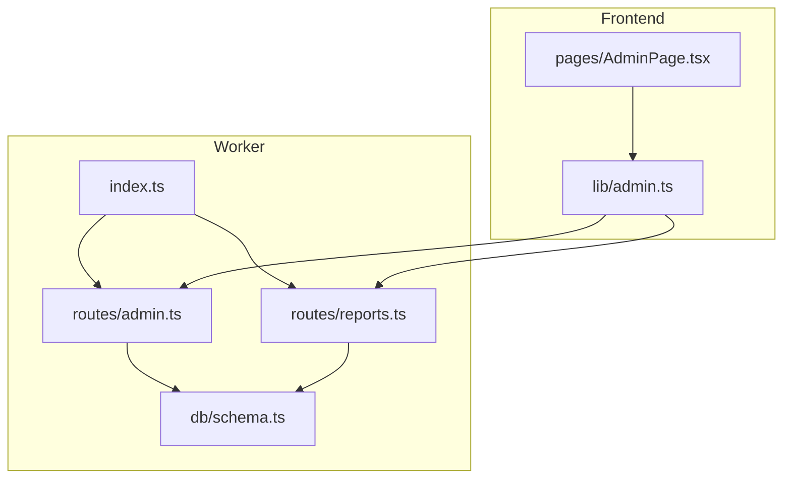
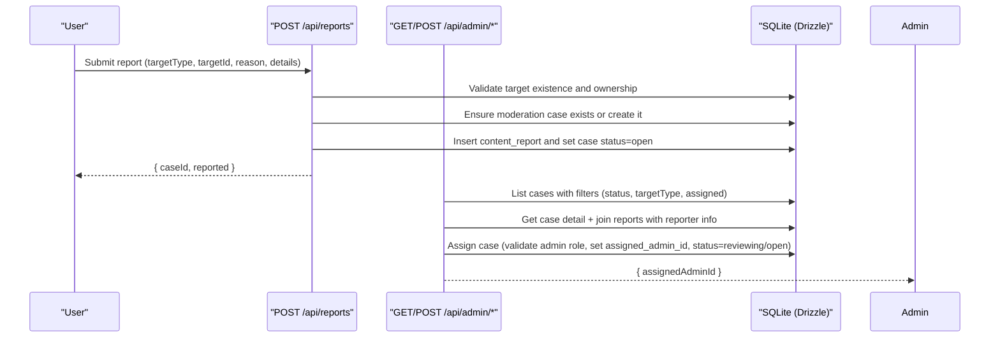
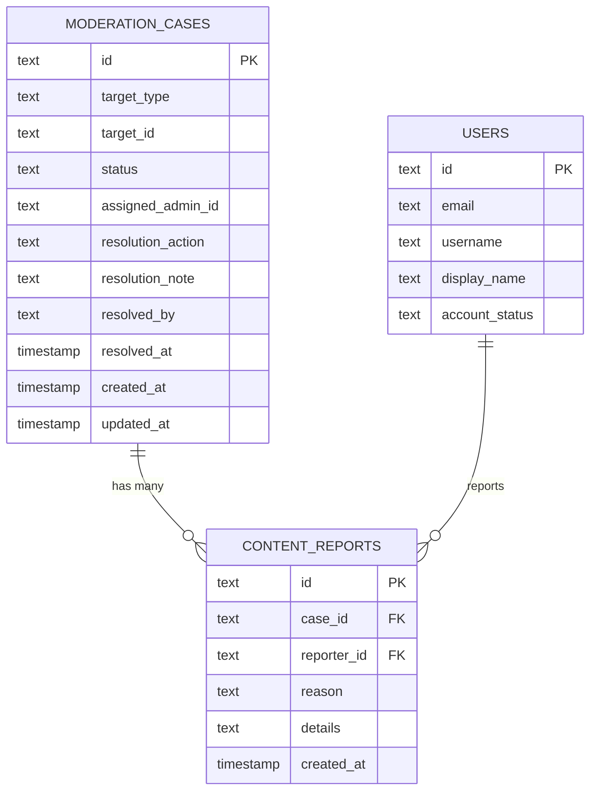
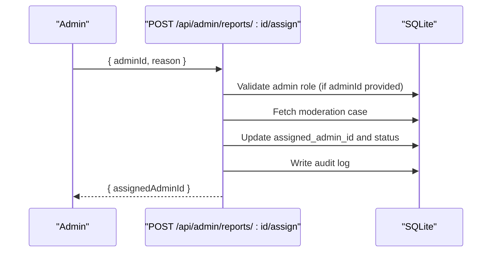
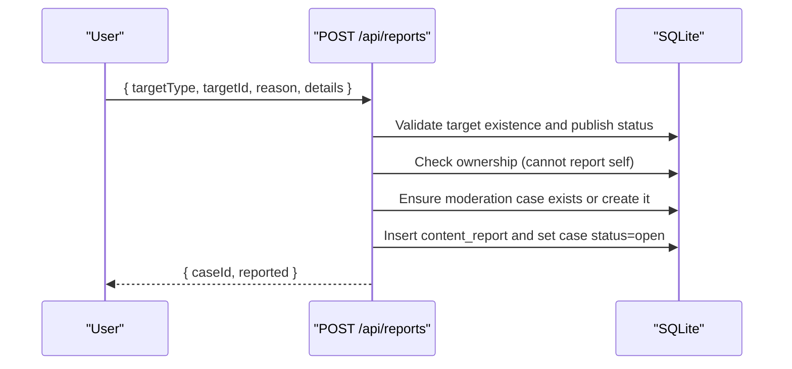
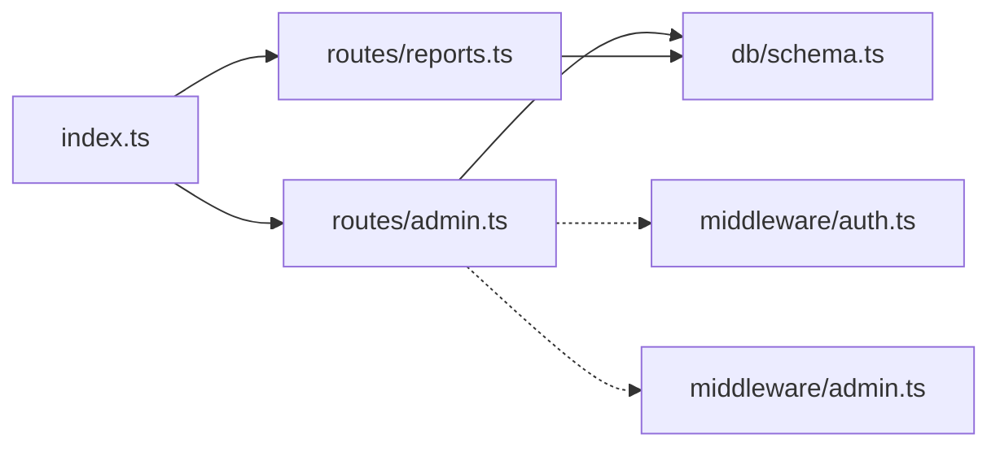

# Moderation Cases Management

<cite>
**Referenced Files in This Document**
- [reports.ts](file://src/worker/routes/reports.ts)
- [admin.ts](file://src/worker/routes/admin.ts)
- [index.ts](file://src/worker/index.ts)
- [schema.ts](file://src/worker/db/schema.ts)
- [admin.ts (frontend)](file://src/react-app/lib/admin.ts)
- [AdminPage.tsx](file://src/react-app/pages/AdminPage.tsx)
</cite>

## Table of Contents
1. [Introduction](#introduction)
2. [Project Structure](#project-structure)
3. [Core Components](#core-components)
4. [Architecture Overview](#architecture-overview)
5. [Detailed Component Analysis](#detailed-component-analysis)
6. [Dependency Analysis](#dependency-analysis)
7. [Performance Considerations](#performance-considerations)
8. [Troubleshooting Guide](#troubleshooting-guide)
9. [Conclusion](#conclusion)

## Introduction
This document provides detailed API documentation for moderation case management endpoints, focusing on:
- Listing and filtering moderation cases
- Retrieving case details with associated reports and reporter information
- Assigning cases to administrators with validation and status transitions
- Reporting content and users to create or update moderation cases

The endpoints are implemented using Hono routes under the /api/admin and /api/reports namespaces, with database access via Drizzle ORM against SQLite tables defined in the schema.

## Project Structure
Moderation-related functionality is primarily implemented in:
- Worker routes for admin operations and reporting
- Database schema defining moderation cases and content reports
- Frontend utilities and pages that consume these APIs

**Diagram sources**
- [index.ts:1-71](file://src/worker/index.ts#L1-L71)
- [admin.ts:1-530](file://src/worker/routes/admin.ts#L1-L530)
- [reports.ts:1-81](file://src/worker/routes/reports.ts#L1-L81)
- [schema.ts:625-653](file://src/worker/db/schema.ts#L625-L653)
- [admin.ts (frontend):1-69](file://src/react-app/lib/admin.ts#L1-L69)
- [AdminPage.tsx:534-717](file://src/react-app/pages/AdminPage.tsx#L534-L717)

**Section sources**
- [index.ts:1-71](file://src/worker/index.ts#L1-L71)
- [admin.ts:1-530](file://src/worker/routes/admin.ts#L1-L530)
- [reports.ts:1-81](file://src/worker/routes/reports.ts#L1-L81)
- [schema.ts:625-653](file://src/worker/db/schema.ts#L625-L653)
- [admin.ts (frontend):1-69](file://src/react-app/lib/admin.ts#L1-L69)
- [AdminPage.tsx:534-717](file://src/react-app/pages/AdminPage.tsx#L534-L717)

## Core Components
- GET /api/admin/reports: Paginated listing of moderation cases with filters for status, target type, and assignment.
- GET /api/admin/reports/:id: Case detail including associated reports and reporter information.
- POST /api/admin/reports/:id/assign: Assign a case to an administrator; validates assignee role and updates status.
- POST /api/reports: Create or associate a report to a moderation case; enforces ownership and duplicate checks.

Key data models:
- moderation_cases: id, target_type, target_id, status, assigned_admin_id, timestamps, resolution fields
- content_reports: id, case_id, reporter_id, reason, details, created_at

**Section sources**
- [admin.ts:238-270](file://src/worker/routes/admin.ts#L238-L270)
- [reports.ts:1-81](file://src/worker/routes/reports.ts#L1-L81)
- [schema.ts:625-653](file://src/worker/db/schema.ts#L625-L653)

## Architecture Overview
The moderation workflow spans user reporting, case creation, admin review, assignment, and resolution actions.

**Diagram sources**
- [reports.ts:19-80](file://src/worker/routes/reports.ts#L19-L80)
- [admin.ts:238-270](file://src/worker/routes/admin.ts#L238-L270)
- [schema.ts:625-653](file://src/worker/db/schema.ts#L625-L653)

## Detailed Component Analysis

### GET /api/admin/reports
- Purpose: Retrieve paginated moderation cases with optional filters.
- Authentication: Requires authenticated admin (enforced by middleware).
- Query parameters:
  - page: integer >= 1 (default 1)
  - pageSize: integer between 1 and 50 (default 20)
  - status: filter by case status (open, reviewing, resolved, dismissed); empty string means no filter
  - targetType: filter by target type (post, reply, user); empty string means no filter
  - assigned: filter by assignment (me, unassigned); empty string means no filter
- Response structure:
  - items: array of moderation cases with additional reportCount field
  - page: current page number
  - pageSize: requested page size
  - total: total number of matching cases
- Filtering logic:
  - status: exact match if provided
  - targetType: exact match if provided
  - assigned:
    - me: only cases where assigned_admin_id equals current user id
    - unassigned: only cases where assigned_admin_id is null
- Sorting: ordered by updated_at descending.

Example request:
- GET /api/admin/reports?page=1&pageSize=20&status=open&targetType=post&assigned=me

Example response:
- { items: [...], page: 1, pageSize: 20, total: N }

**Section sources**
- [admin.ts:238-252](file://src/worker/routes/admin.ts#L238-L252)
- [schema.ts:625-641](file://src/worker/db/schema.ts#L625-L641)

### GET /api/admin/reports/:id
- Purpose: Retrieve a single moderation case with its associated reports and reporter details.
- Authentication: Requires authenticated admin.
- Path parameter:
  - id: case id
- Response structure:
  - case: full moderation case record
  - reports: array of content_reports joined with users (reporter email, username), ordered by created_at descending

Example request:
- GET /api/admin/reports/{caseId}

Example response:
- { case: {...}, reports: [{ ... }, ...] }

**Section sources**
- [admin.ts:254-259](file://src/worker/routes/admin.ts#L254-L259)
- [schema.ts:643-653](file://src/worker/db/schema.ts#L643-L653)

### POST /api/admin/reports/:id/assign
- Purpose: Assign a moderation case to an administrator and transition status accordingly.
- Authentication: Requires authenticated admin.
- Request body:
  - adminId: string | null (nullable to unassign)
  - reason: string (min length 3, max length 500)
- Validation:
  - If adminId is provided, must be an administrator; otherwise returns bad request
  - Case must exist; otherwise returns not found
- Behavior:
  - Sets assigned_admin_id to adminId
  - Updates status:
    - If adminId is provided: status becomes reviewing
    - If adminId is null: status becomes open
  - Records audit log entry
- Response:
  - { assignedAdminId: string | null }

Example request:
- POST /api/admin/reports/{caseId}
- Body: { adminId: "<userId>", reason: "Reviewing spam pattern" }

Example response:
- { assignedAdminId: "<userId>" }

**Section sources**
- [admin.ts:261-270](file://src/worker/routes/admin.ts#L261-L270)
- [schema.ts:625-641](file://src/worker/db/schema.ts#L625-L641)

### POST /api/reports
- Purpose: Report content or a user; creates or associates a report with a moderation case.
- Authentication: Requires authenticated user.
- Request body:
  - targetType: enum post, reply, user
  - targetId: string (trimmed, min 1, max 128)
  - reason: enum spam, harassment, hate, sexual, violence, copyright, impersonation, other
  - details: string (optional, trimmed, max 1000)
- Validation:
  - Target must exist and be published (for posts/replies)
  - Cannot report own content/profile
  - Duplicate report from same reporter to same case is rejected
- Behavior:
  - Ensures moderation case exists for the target; creates if missing
  - Inserts content_report and sets case status=open
- Response:
  - { caseId: string, reported: true } with 201 status

Example request:
- POST /api/reports
- Body: { targetType: "post", targetId: "<postId>", reason: "spam", details: "Repeated spam links" }

Example response:
- { caseId: "<uuid>", reported: true }

**Section sources**
- [reports.ts:19-80](file://src/worker/routes/reports.ts#L19-L80)
- [schema.ts:625-653](file://src/worker/db/schema.ts#L625-L653)

### Data Model Relationships

**Diagram sources**
- [schema.ts:625-653](file://src/worker/db/schema.ts#L625-L653)

### Assignment Flow Sequence

**Diagram sources**
- [admin.ts:261-270](file://src/worker/routes/admin.ts#L261-L270)
- [schema.ts:625-641](file://src/worker/db/schema.ts#L625-L641)

### Reporting Flow Sequence

**Diagram sources**
- [reports.ts:19-80](file://src/worker/routes/reports.ts#L19-L80)
- [schema.ts:625-653](file://src/worker/db/schema.ts#L625-L653)

## Dependency Analysis
- Route registration:
  - /api/reports maps to reportRoutes
  - /api/admin maps to adminRoutes
- Middleware:
  - authMiddleware ensures authenticated user context
  - adminMiddleware ensures admin role for admin routes
- Database schema:
  - moderation_cases and content_reports define core entities
  - Users table referenced by both moderation and reporting flows

**Diagram sources**
- [index.ts:1-71](file://src/worker/index.ts#L1-L71)
- [admin.ts:1-530](file://src/worker/routes/admin.ts#L1-L530)
- [reports.ts:1-81](file://src/worker/routes/reports.ts#L1-L81)
- [schema.ts:625-653](file://src/worker/db/schema.ts#L625-L653)

**Section sources**
- [index.ts:1-71](file://src/worker/index.ts#L1-L71)
- [admin.ts:1-530](file://src/worker/routes/admin.ts#L1-L530)
- [reports.ts:1-81](file://src/worker/routes/reports.ts#L1-L81)
- [schema.ts:625-653](file://src/worker/db/schema.ts#L625-L653)

## Performance Considerations
- Pagination:
  - page and pageSize are validated and bounded; default pageSize is 20, maximum 50
  - Offset-based pagination used in SQL queries
- Filtering:
  - Filters are applied via SQL WHERE clauses with bindings to prevent injection
  - Count query runs in parallel with items query to compute totals efficiently
- Database indexing:
  - moderation_cases has indexes on status and updatedAt for efficient filtering and sorting
  - content_reports has index on case_id and created_at for report retrieval
- Batch operations:
  - Reporting uses batch inserts/updates to ensure atomicity and reduce round-trips

[No sources needed since this section provides general guidance]

## Troubleshooting Guide
Common errors and resolutions:
- Not Found:
  - Case not found when retrieving details or assigning
  - Reported target not found during reporting
- Conflict:
  - Attempting to report own content/profile
  - Duplicate report from same reporter to same case
  - Only pending applications can be approved/rejected (not applicable to reports but relevant in admin flow)
- Bad Request:
  - Invalid input validation (e.g., reason length, targetType/targetId constraints)
  - Assignee must be an administrator when assigning
- Forbidden:
  - Missing admin role for admin endpoints
  - Moderator cannot act on administrators (in broader admin flows)

Recommendations:
- Always validate inputs on the client side before sending requests
- Handle error responses gracefully and display user-friendly messages
- Use audit logs to trace actions taken by admins

**Section sources**
- [admin.ts:238-270](file://src/worker/routes/admin.ts#L238-L270)
- [reports.ts:19-80](file://src/worker/routes/reports.ts#L19-L80)

## Conclusion
The moderation case management system provides robust endpoints for reporting, listing, detailing, and assigning cases. It enforces security through authentication and authorization, ensures data integrity with validations and unique constraints, and supports efficient querying with pagination and filtering. The design enables clear workflows for moderators to triage and resolve reports while maintaining comprehensive audit trails.

[No sources needed since this section summarizes without analyzing specific files]