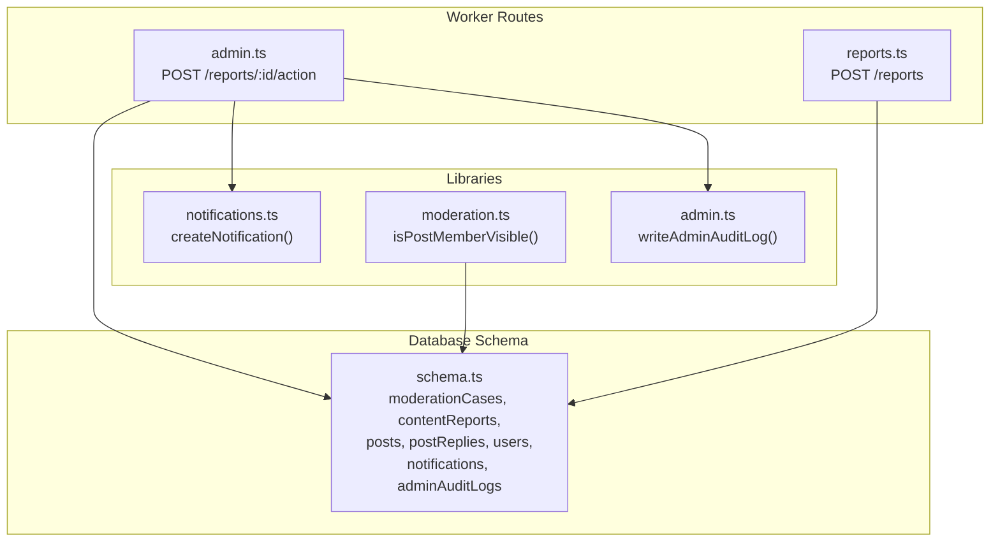
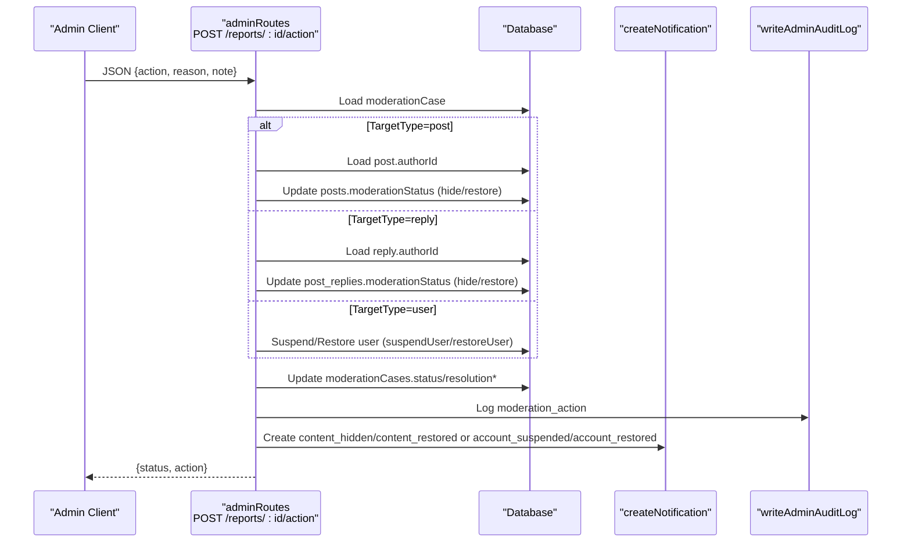
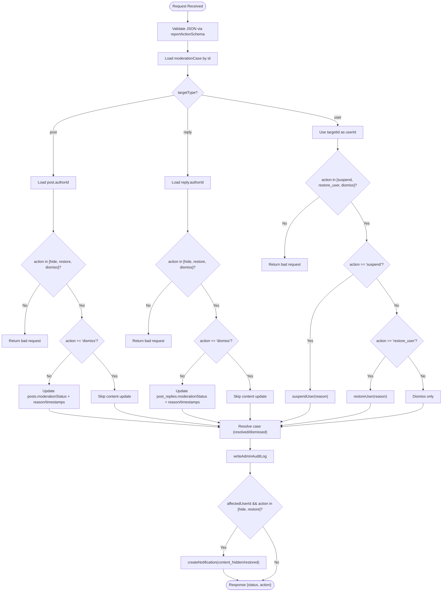
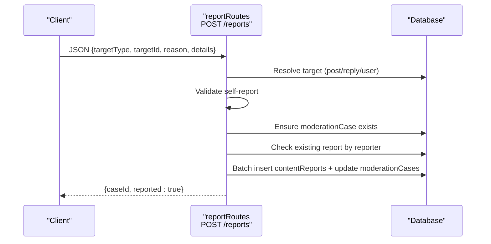
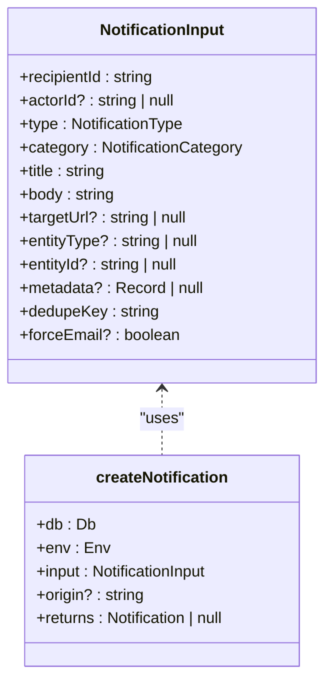
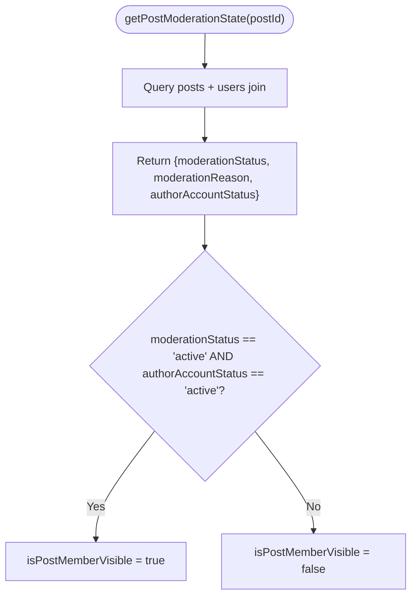
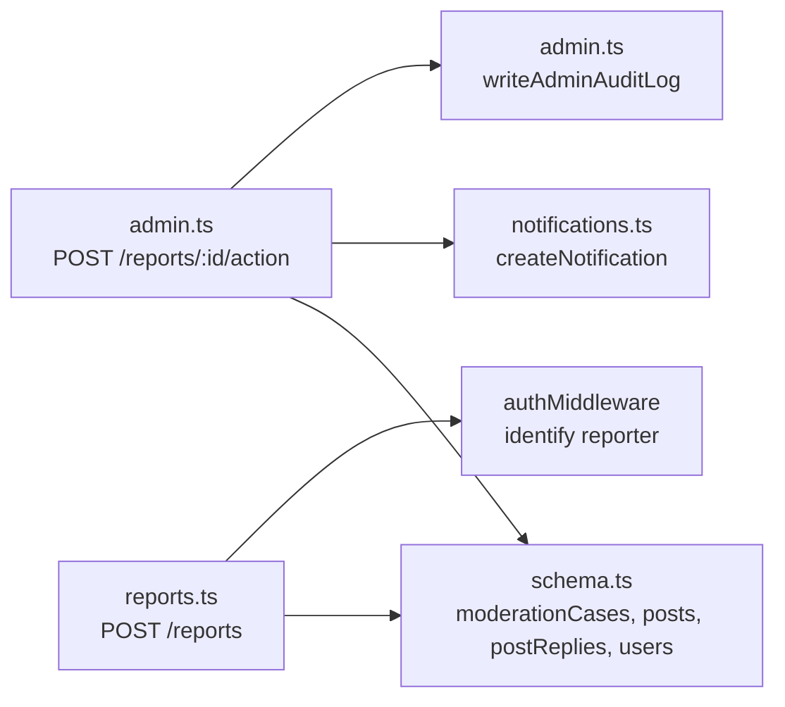

# Report Actions and Workflows

<cite>
**Referenced Files in This Document**
- [admin.ts](file://src/worker/routes/admin.ts)
- [reports.ts](file://src/worker/routes/reports.ts)
- [schema.ts](file://src/worker/db/schema.ts)
- [notifications.ts](file://src/worker/lib/notifications.ts)
- [moderation.ts](file://src/worker/lib/moderation.ts)
- [admin.ts](file://src/worker/lib/admin.ts)
</cite>

## Table of Contents
1. [Introduction](#introduction)
2. [Project Structure](#project-structure)
3. [Core Components](#core-components)
4. [Architecture Overview](#architecture-overview)
5. [Detailed Component Analysis](#detailed-component-analysis)
6. [Dependency Analysis](#dependency-analysis)
7. [Performance Considerations](#performance-considerations)
8. [Troubleshooting Guide](#troubleshooting-guide)
9. [Conclusion](#conclusion)

## Introduction
This document provides comprehensive API documentation for moderation action endpoints, focusing on the POST /reports/:id/action endpoint. It explains how actions are validated based on target type (post, reply, user), content visibility changes, user suspension workflows, notification triggers, audit logging, state transitions, affected user identification logic, and multi-target moderation scenarios.

## Project Structure
The moderation system is implemented within the worker routes and libraries:
- Admin routes define the report action endpoint and related admin operations.
- Reports route handles creating new reports and associating them with moderation cases.
- Database schema defines tables for moderation cases, content reports, users, posts, post replies, notifications, and audit logs.
- Notification library manages creation and delivery of notifications.
- Moderation utilities provide helpers to determine post visibility states.
- Admin library provides audit logging and role checks.



**Diagram sources**
- [admin.ts:272-305](file://src/worker/routes/admin.ts#L272-L305)
- [reports.ts:19-80](file://src/worker/routes/reports.ts#L19-L80)
- [notifications.ts:153-234](file://src/worker/lib/notifications.ts#L153-L234)
- [moderation.ts:5-16](file://src/worker/lib/moderation.ts#L5-L16)
- [schema.ts:626-667](file://src/worker/db/schema.ts#L626-L667)

**Section sources**
- [admin.ts:272-305](file://src/worker/routes/admin.ts#L272-L305)
- [reports.ts:19-80](file://src/worker/routes/reports.ts#L19-L80)
- [schema.ts:626-667](file://src/worker/db/schema.ts#L626-L667)
- [notifications.ts:153-234](file://src/worker/lib/notifications.ts#L153-L234)
- [moderation.ts:5-16](file://src/worker/lib/moderation.ts#L5-L16)
- [admin.ts:7-31](file://src/worker/lib/admin.ts#L7-L31)

## Core Components
- Report Action Endpoint: POST /reports/:id/action
  - Validates input using reportActionSchema.
  - Determines allowed actions by target type.
  - Updates moderation status or user account status accordingly.
  - Writes audit log and sends notifications when applicable.
- Report Creation Endpoint: POST /reports
  - Creates a moderation case if none exists.
  - Records a report with reason and optional details.
- Notification System: createNotification
  - Persists notifications and optionally sends emails based on preferences.
- Moderation Utilities: getPostModerationState, isPostMemberVisible
  - Determine whether a post should be visible based on moderation status and author account status.
- Audit Logging: writeAdminAuditLog
  - Records admin actions with actor, target, reason, and metadata.

**Section sources**
- [admin.ts:34-41](file://src/worker/routes/admin.ts#L34-L41)
- [admin.ts:272-305](file://src/worker/routes/admin.ts#L272-L305)
- [reports.ts:10-15](file://src/worker/routes/reports.ts#L10-L15)
- [reports.ts:19-80](file://src/worker/routes/reports.ts#L19-L80)
- [notifications.ts:153-234](file://src/worker/lib/notifications.ts#L153-L234)
- [moderation.ts:5-16](file://src/worker/lib/moderation.ts#L5-L16)
- [admin.ts:7-31](file://src/worker/lib/admin.ts#L7-L31)

## Architecture Overview
The moderation workflow integrates routing, validation, database updates, notifications, and audit logging.



**Diagram sources**
- [admin.ts:272-305](file://src/worker/routes/admin.ts#L272-L305)
- [notifications.ts:153-234](file://src/worker/lib/notifications.ts#L153-L234)
- [admin.ts:7-31](file://src/worker/lib/admin.ts#L7-L31)
- [schema.ts:626-667](file://src/worker/db/schema.ts#L626-L667)

## Detailed Component Analysis

### Report Action Endpoint: POST /reports/:id/action
- Input Validation:
  - reportActionSchema enforces action enum values: dismiss, hide, restore, suspend, restore_user.
  - reason is required (string, trimmed, min 3, max 500).
  - note is optional (string, trimmed, max 1000).
- Allowed Actions by Target Type:
  - Post: hide, restore, dismiss.
  - Reply: hide, restore, dismiss.
  - User: suspend, restore_user, dismiss.
- Content Visibility Changes:
  - For hide: set moderationStatus to hidden and record moderationReason, moderatedAt, moderatedBy.
  - For restore: set moderationStatus to active and clear moderationReason.
  - For dismiss: no content change; only resolves the case.
- User Suspension Workflow:
  - suspendUser sets accountStatus to suspended, records suspensionReason, suspendedAt, suspendedBy, deletes sessions, and sends account_suspended notification.
  - restoreUser sets accountStatus to active, clears suspension fields, and sends account_restored notification.
- Case Resolution:
  - Sets status to resolved or dismissed depending on action.
  - Records resolutionAction, resolutionNote, resolvedBy, resolvedAt, updatedAt.
- Affected User Identification:
  - For post/reply targets, fetches authorId to identify the affected user.
  - For user targets, uses targetId directly.
- Notifications:
  - For hide/restore on content: creates content_hidden or content_restored notifications with forceEmail=true.
  - For suspend/restore_user: handled inside suspendUser/restoreUser functions.
- Audit Logging:
  - Logs moderation_hide, moderation_restore, moderation_suspend, moderation_restore_user, moderation_dismiss with reason and metadata including caseId.



**Diagram sources**
- [admin.ts:272-305](file://src/worker/routes/admin.ts#L272-L305)
- [admin.ts:7-31](file://src/worker/lib/admin.ts#L7-L31)
- [notifications.ts:153-234](file://src/worker/lib/notifications.ts#L153-L234)

**Section sources**
- [admin.ts:34-41](file://src/worker/routes/admin.ts#L34-L41)
- [admin.ts:272-305](file://src/worker/routes/admin.ts#L272-L305)
- [schema.ts:168-188](file://src/worker/db/schema.ts#L168-L188)
- [schema.ts:466-491](file://src/worker/db/schema.ts#L466-L491)
- [schema.ts:626-667](file://src/worker/db/schema.ts#L626-L667)
- [notifications.ts:153-234](file://src/worker/lib/notifications.ts#L153-L234)
- [admin.ts:7-31](file://src/worker/lib/admin.ts#L7-L31)

### Report Creation Endpoint: POST /reports
- Input Validation:
  - targetType must be one of post, reply, user.
  - targetId is a non-empty string up to 128 characters.
  - reason is an enum from spam, harassment, hate, sexual, violence, copyright, impersonation, other.
  - details is optional (trimmed, max 1000).
- Target Resolution:
  - For post: ensures publishedAt is not null.
  - For reply: joins with posts to ensure parent post is published.
  - For user: direct lookup by id.
- Self-report Prevention:
  - Prevents reporting own content or profile.
- Moderation Case Handling:
  - Creates a moderation case if none exists for the target.
  - Ensures unique report per reporter per case.
- Batch Operations:
  - Inserts contentReports and updates moderationCases status to open with reset resolution fields.



**Diagram sources**
- [reports.ts:10-15](file://src/worker/routes/reports.ts#L10-L15)
- [reports.ts:19-80](file://src/worker/routes/reports.ts#L19-L80)

**Section sources**
- [reports.ts:10-15](file://src/worker/routes/reports.ts#L10-L15)
- [reports.ts:19-80](file://src/worker/routes/reports.ts#L19-L80)
- [schema.ts:626-667](file://src/worker/db/schema.ts#L626-L667)

### Notification System Integration
- createNotification:
  - Deduplicates by dedupeKey.
  - Respects user notification preferences for email delivery.
  - Persists notification and attempts email sending if eligible.
  - Tracks emailStatus (not_applicable, pending, sent, failed).
- Moderation-triggered notifications:
  - content_hidden/content_restored for content visibility changes.
  - account_suspended/account_restored for user suspension workflows.



**Diagram sources**
- [notifications.ts:39-52](file://src/worker/lib/notifications.ts#L39-L52)
- [notifications.ts:153-234](file://src/worker/lib/notifications.ts#L153-L234)

**Section sources**
- [notifications.ts:153-234](file://src/worker/lib/notifications.ts#L153-L234)
- [schema.ts:872-930](file://src/worker/db/schema.ts#L872-L930)

### Moderation State Helpers
- getPostModerationState:
  - Returns moderationStatus, moderationReason, and authorAccountStatus for a given postId.
- isPostMemberVisible:
  - Determines visibility based on both post moderationStatus being active and author accountStatus being active.



**Diagram sources**
- [moderation.ts:5-16](file://src/worker/lib/moderation.ts#L5-L16)

**Section sources**
- [moderation.ts:5-16](file://src/worker/lib/moderation.ts#L5-L16)
- [schema.ts:168-188](file://src/worker/db/schema.ts#L168-L188)
- [schema.ts:466-491](file://src/worker/db/schema.ts#L466-L491)

### Audit Logging Requirements
- writeAdminAuditLog:
  - Records actorId, action, targetType, targetId, reason, and metadata.
  - Emits structured console log for admin actions.
- Moderation actions logged include:
  - moderation_hide, moderation_restore, moderation_suspend, moderation_restore_user, moderation_dismiss.
  - Includes caseId in metadata for traceability.

```mermaid
classDiagram
class AdminAuditLog {
+id : string
+actorId : string
+action : string
+targetType : string
+targetId : string
+reason : string | null
+metadata : string | null
+createdAt : timestamp
}
class writeAdminAuditLog {
+db : Db
+input : {actorId, action, targetType, targetId, reason?, metadata?}
+returns : void
}
AdminAuditLog <.. writeAdminAuditLog : "inserts"
```

**Diagram sources**
- [admin.ts:7-31](file://src/worker/lib/admin.ts#L7-L31)
- [schema.ts:655-667](file://src/worker/db/schema.ts#L655-L667)

**Section sources**
- [admin.ts:7-31](file://src/worker/lib/admin.ts#L7-L31)
- [schema.ts:655-667](file://src/worker/db/schema.ts#L655-L667)

## Dependency Analysis
- The report action endpoint depends on:
  - Database schema for moderationCases, posts, postReplies, users, notifications, adminAuditLogs.
  - Notification library for creating and delivering notifications.
  - Admin library for audit logging.
- Report creation depends on:
  - Database schema for moderationCases and contentReports.
  - Authentication middleware to identify reporter.



**Diagram sources**
- [admin.ts:272-305](file://src/worker/routes/admin.ts#L272-L305)
- [reports.ts:19-80](file://src/worker/routes/reports.ts#L19-L80)
- [schema.ts:626-667](file://src/worker/db/schema.ts#L626-L667)
- [notifications.ts:153-234](file://src/worker/lib/notifications.ts#L153-L234)
- [admin.ts:7-31](file://src/worker/lib/admin.ts#L7-L31)

**Section sources**
- [admin.ts:272-305](file://src/worker/routes/admin.ts#L272-L305)
- [reports.ts:19-80](file://src/worker/routes/reports.ts#L19-L80)
- [schema.ts:626-667](file://src/worker/db/schema.ts#L626-L667)
- [notifications.ts:153-234](file://src/worker/lib/notifications.ts#L153-L234)
- [admin.ts:7-31](file://src/worker/lib/admin.ts#L7-L31)

## Performance Considerations
- Batch operations are used where possible to minimize round trips.
- Deduplication in notifications prevents redundant processing.
- Indexes on frequently queried fields (e.g., moderation_status, account_status) improve performance.
- Short-circuit validations reduce unnecessary database calls.

[No sources needed since this section provides general guidance]

## Troubleshooting Guide
- Common errors:
  - Bad request when action does not match target type.
  - Not found when moderation case or target entity is missing.
  - Conflict when attempting to report own content or duplicate reports.
- Debugging steps:
  - Verify reportActionSchema input validity.
  - Check moderation case existence and target entity presence.
  - Review audit logs for action traceability.
  - Inspect notification emailStatus for delivery issues.

**Section sources**
- [admin.ts:272-305](file://src/worker/routes/admin.ts#L272-L305)
- [reports.ts:19-80](file://src/worker/routes/reports.ts#L19-L80)
- [admin.ts:7-31](file://src/worker/lib/admin.ts#L7-L31)
- [notifications.ts:153-234](file://src/worker/lib/notifications.ts#L153-L234)

## Conclusion
The moderation action endpoint provides a robust mechanism for handling content and user moderation through validated actions, consistent state transitions, comprehensive audit logging, and integrated notifications. By adhering to the defined schemas and workflows, administrators can effectively manage reports and maintain platform integrity.

[No sources needed since this section summarizes without analyzing specific files]