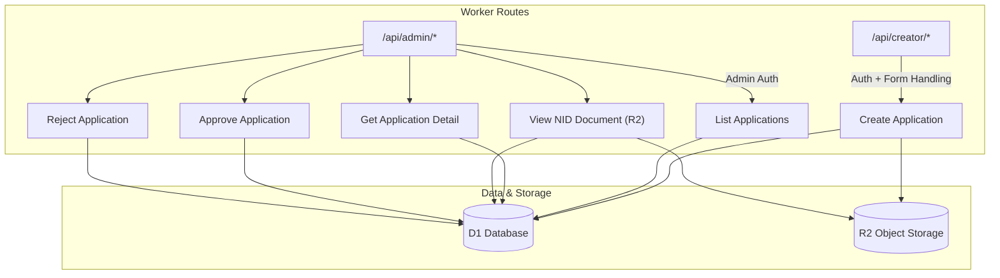
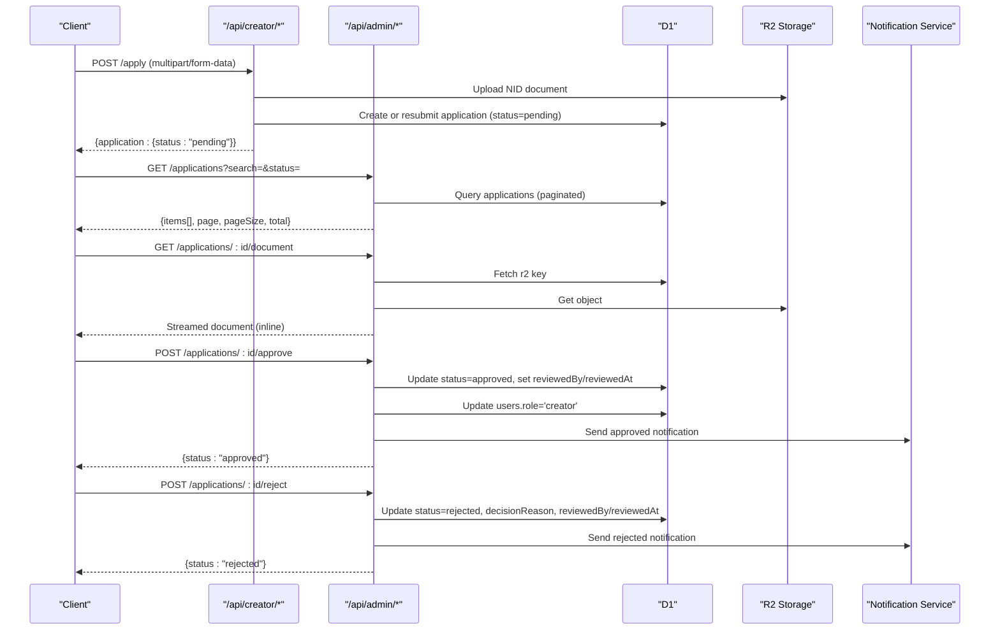
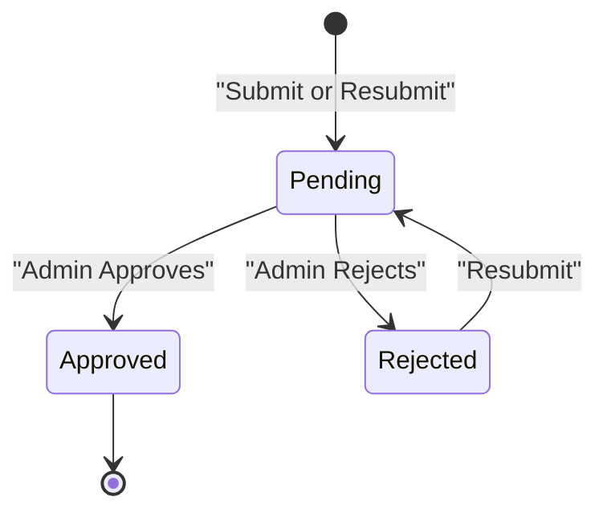
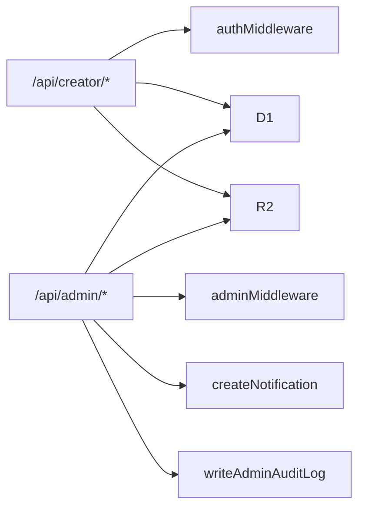

# Creator Application API

<cite>
**Referenced Files in This Document**
- [creator.ts](file://src/worker/routes/creator.ts)
- [admin.ts](file://src/worker/routes/admin.ts)
- [schema.ts](file://src/worker/db/schema.ts)
- [0001_add-creator-applications.sql](file://drizzle/0001_add-creator-applications.sql)
- [auth.integration.test.ts](file://src/worker/routes/auth.integration.test.ts)
- [BecomeCreatorPage.tsx](file://src/react-app/pages/BecomeCreatorPage.tsx)
- [AdminPage.tsx](file://src/react-app/pages/AdminPage.tsx)
- [admin.ts](file://src/worker/lib/admin.ts)
</cite>

## Table of Contents
1. [Introduction](#introduction)
2. [Project Structure](#project-structure)
3. [Core Components](#core-components)
4. [Architecture Overview](#architecture-overview)
5. [Detailed Component Analysis](#detailed-component-analysis)
6. [Dependency Analysis](#dependency-analysis)
7. [Performance Considerations](#performance-considerations)
8. [Troubleshooting Guide](#troubleshooting-guide)
9. [Conclusion](#conclusion)

## Introduction
This document provides detailed API documentation for creator application management endpoints. It covers:
- Application submission and retrieval by the applicant
- Admin listing with search and status filtering
- Application detail retrieval and secure document viewing via R2 storage
- Approval and rejection workflows, including role assignment and notifications
- Decision recording and audit logging
- Application lifecycle states, validation rules, security, and compliance considerations

## Project Structure
The creator application feature spans worker routes (API), database schema, migrations, and frontend pages that call these APIs.

**Diagram sources**
- [creator.ts](file://src/worker/routes/creator.ts)
- [admin.ts](file://src/worker/routes/admin.ts)
- [schema.ts](file://src/worker/db/schema.ts)

**Section sources**
- [creator.ts](file://src/worker/routes/creator.ts)
- [admin.ts](file://src/worker/routes/admin.ts)
- [schema.ts](file://src/worker/db/schema.ts)

## Core Components
- Creator application form submission endpoint (multipart/form-data)
- Creator application retrieval endpoint (per-user)
- Admin application list endpoint (paginated, searchable, filterable)
- Admin application detail endpoint
- Admin document viewer endpoint (R2-backed)
- Admin approval and rejection endpoints (with role update and notifications)
- Audit logging for admin actions

**Section sources**
- [creator.ts](file://src/worker/routes/creator.ts)
- [admin.ts](file://src/worker/routes/admin.ts)
- [schema.ts](file://src/worker/db/schema.ts)

## Architecture Overview
The system uses a Hono-based worker with D1 for relational data and R2 for object storage. Authentication is enforced via middleware; admin operations require admin roles. Decisions trigger user role updates and notifications. All admin actions are audited.

**Diagram sources**
- [creator.ts](file://src/worker/routes/creator.ts)
- [admin.ts](file://src/worker/routes/admin.ts)
- [schema.ts](file://src/worker/db/schema.ts)

## Detailed Component Analysis

### Endpoint: POST /api/creator/apply
- Purpose: Submit a new creator application or resubmit a rejected one.
- Method: POST
- URL: /api/creator/apply
- Authentication: Required (user must be authenticated).
- Content-Type: multipart/form-data
- Request fields:
  - fullName: string (required)
  - address: string (required)
  - city: string (required)
  - country: string (required)
  - nidNumber: string (required)
  - socialLinks: JSON array of strings (optional parsing fallback to [])
  - contentLinks: JSON array of strings (optional parsing fallback to [])
  - nidDocument: File (required; image/jpeg, image/png, image/webp; max 10 MB)
- Validation rules:
  - Multipart body required
  - NID document MIME type restricted to JPEG, PNG, WebP
  - NID document size ≤ 10 MB
  - Existing non-rejected application blocks duplicate submissions
- Response:
  - 201 Created on new application
  - 200 OK on resubmission
  - Body: { application: { status: "pending" } }
- Error responses:
  - 409 Conflict if user already has role 'creator' or existing pending application
  - 422 Validation errors for missing fields or invalid multipart
  - 415 Unsupported Media Type for invalid NID document MIME
  - 413 Payload Too Large for oversized NID document
  - 500 Server error on R2 upload or DB write failures
- Side effects:
  - Uploads NID document to R2 under key pattern nid-documents/{userId}/{uuid}-{filename}
  - Persists application with status 'pending'
  - On resubmission, clears review metadata and sets resubmitted timestamp
  - Deletes superseded NID document when resubmitting

**Section sources**
- [creator.ts](file://src/worker/routes/creator.ts)
- [auth.integration.test.ts](file://src/worker/routes/auth.integration.test.ts)

### Endpoint: GET /api/creator/application/me
- Purpose: Retrieve the current user’s creator application details.
- Method: GET
- URL: /api/creator/application/me
- Authentication: Required (user must be authenticated).
- Response:
  - 200 OK
  - Body: { application: null | { id, fullName, address, city, country, nidNumber, socialLinks: string[], contentLinks: string[], status, decisionReason, reviewedAt, resubmittedAt, createdAt, updatedAt } }
- Notes:
  - socialLinks and contentLinks are returned as arrays parsed from JSON strings
  - If no application exists, returns null

**Section sources**
- [creator.ts](file://src/worker/routes/creator.ts)

### Endpoint: GET /api/admin/applications
- Purpose: List creator applications with pagination, search, and status filtering.
- Method: GET
- URL: /api/admin/applications
- Authentication: Required (admin role required).
- Query parameters:
  - page: number (default 1)
  - pageSize: number (default 20, max 50)
  - search: string (fuzzy match against email, username, full_name)
  - status: string (filter by status; empty means all)
- Response:
  - 200 OK
  - Body: { items: Array<{ id, userId, fullName, city, country, status, createdAt, updatedAt, email, username }>, page, pageSize, total }
- Behavior:
  - Joins users table to include email and username
  - Applies LIKE filters for search across multiple fields
  - Orders by updated_at descending

**Section sources**
- [admin.ts](file://src/worker/routes/admin.ts)

### Endpoint: GET /api/admin/applications/:id
- Purpose: Retrieve detailed information for a specific application.
- Method: GET
- URL: /api/admin/applications/:id
- Authentication: Required (admin role required).
- Response:
  - 200 OK with application details (excluding nid_document_r2_key)
  - social_links and content_links returned as parsed JSON arrays
  - 404 Not Found if application does not exist

**Section sources**
- [admin.ts](file://src/worker/routes/admin.ts)

### Endpoint: GET /api/admin/applications/:id/document
- Purpose: Securely view the NID document associated with an application.
- Method: GET
- URL: /api/admin/applications/:id/document
- Authentication: Required (admin role required).
- Response:
  - Streams the document directly from R2 with inline disposition
  - Sets Cache-Control: no-store
  - 404 Not Found if application or document not found
- Audit:
  - Logs admin action 'creator_document_viewed' with actorId, target type, and target id

**Section sources**
- [admin.ts](file://src/worker/routes/admin.ts)
- [admin.ts](file://src/worker/lib/admin.ts)

### Endpoint: POST /api/admin/applications/:id/approve
- Purpose: Approve a pending application and grant creator role.
- Method: POST
- URL: /api/admin/applications/:id/approve
- Authentication: Required (admin role required).
- Request body (JSON):
  - reason: string (min 3, max 500)
  - note: string (optional, max 1000)
- Response:
  - 200 OK with { status: "approved" }
  - 404 Not Found if application does not exist
  - 409 Conflict if application is not in 'pending' state
- Side effects:
  - Updates application status to 'approved', records reviewedBy and reviewedAt, clears decisionReason, sets adminNote
  - Updates user role to 'creator'
  - Writes audit log entry 'creator_application_approved'
  - Sends notification to applicant with title "Creator application approved" and link to studio

**Section sources**
- [admin.ts](file://src/worker/routes/admin.ts)
- [admin.ts](file://src/worker/lib/admin.ts)

### Endpoint: POST /api/admin/applications/:id/reject
- Purpose: Reject a pending application with a reason.
- Method: POST
- URL: /api/admin/applications/:id/reject
- Authentication: Required (admin role required).
- Request body (JSON):
  - reason: string (min 3, max 500)
  - note: string (optional, max 1000)
- Response:
  - 200 OK with { status: "rejected" }
  - 404 Not Found if application does not exist
  - 409 Conflict if application is not in 'pending' state
- Side effects:
  - Updates application status to 'rejected', records reviewedBy and reviewedAt, sets decisionReason and optional adminNote
  - Writes audit log entry 'creator_application_rejected'
  - Sends notification to applicant with title "Creator application needs changes" and link to become-creator

**Section sources**
- [admin.ts](file://src/worker/routes/admin.ts)
- [admin.ts](file://src/worker/lib/admin.ts)

### Data Model: Creator Applications
- Table: creator_applications
- Key fields:
  - id: primary key
  - user_id: unique foreign key to users
  - full_name, address, city, country, nid_number
  - nid_document_r2_key: reference to R2 object
  - social_links, content_links: JSON arrays stored as text
  - status: enum ['pending','approved','rejected']
  - reviewed_by, reviewed_at, decision_reason, admin_note, resubmitted_at
  - created_at, updated_at
- Indexes:
  - Unique index on user_id
  - Composite index on status, updated_at for efficient listing/filtering

**Section sources**
- [schema.ts](file://src/worker/db/schema.ts)
- [0001_add-creator-applications.sql](file://drizzle/0001_add-creator-applications.sql)

### Application Lifecycle States
- pending: Initial state after submission or resubmission
- approved: After admin approval; user role becomes 'creator'
- rejected: After admin rejection; applicant may resubmit

**Diagram sources**
- [schema.ts](file://src/worker/db/schema.ts)

### Frontend Integration Examples
- Applicant flow:
  - BecomeCreatorPage calls POST /api/creator/apply with FormData
  - Retrieves application status via GET /api/creator/application/me
- Admin flow:
  - AdminPage lists applications via GET /api/admin/applications with search and status filters
  - Views details and documents via GET /api/admin/applications/:id and /document
  - Approves or rejects via POST /api/admin/applications/:id/approve or /reject

**Section sources**
- [BecomeCreatorPage.tsx](file://src/react-app/pages/BecomeCreatorPage.tsx)
- [AdminPage.tsx](file://src/react-app/pages/AdminPage.tsx)

## Dependency Analysis
- Creator routes depend on authentication middleware and use D1 and R2 for persistence and storage.
- Admin routes enforce admin middleware and interact with D1, R2, and notification services.
- Schema defines relationships between users and creator applications, ensuring referential integrity.
- Audit logging is centralized through a utility function that writes to admin_audit_logs.

**Diagram sources**
- [creator.ts](file://src/worker/routes/creator.ts)
- [admin.ts](file://src/worker/routes/admin.ts)
- [admin.ts](file://src/worker/lib/admin.ts)

**Section sources**
- [creator.ts](file://src/worker/routes/creator.ts)
- [admin.ts](file://src/worker/routes/admin.ts)
- [admin.ts](file://src/worker/lib/admin.ts)

## Performance Considerations
- Pagination and filtering reduce payload sizes and improve query performance.
- R2 streaming avoids loading entire documents into memory for viewing.
- Batch database operations minimize round-trips during approvals.
- Indexes on status and updated_at optimize listing queries.
- Best-effort cleanup of superseded R2 objects prevents storage bloat.

[No sources needed since this section provides general guidance]

## Troubleshooting Guide
Common issues and resolutions:
- Missing NID document or invalid MIME type: Ensure file is present and one of JPEG, PNG, WebP.
- Oversized NID document: Reduce file size to ≤ 10 MB.
- Duplicate application submission: Only one pending application per user; rejected applications can be resubmitted.
- R2 upload failure: Check storage permissions and environment configuration; server returns 500.
- DB write failure: R2 object is cleaned up; retry submission after resolving underlying issue.
- Admin access denied: Verify admin role and permissions.

**Section sources**
- [creator.ts](file://src/worker/routes/creator.ts)
- [admin.ts](file://src/worker/routes/admin.ts)

## Conclusion
The Creator Application API provides a robust workflow for applicants to submit and track their applications, and for administrators to review, approve, or reject them securely. Integrations with R2 ensure safe document handling, while audit logging and notifications maintain transparency and compliance. The design emphasizes validation, security, and performance, supporting scalable creator onboarding.

[No sources needed since this section summarizes without analyzing specific files]