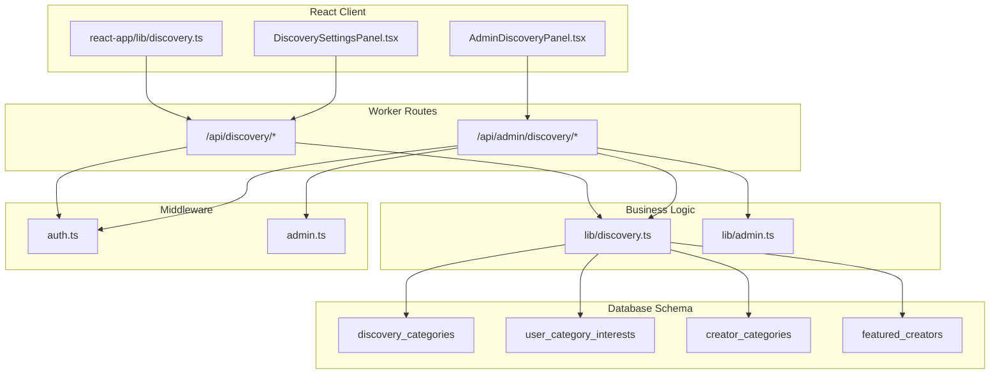
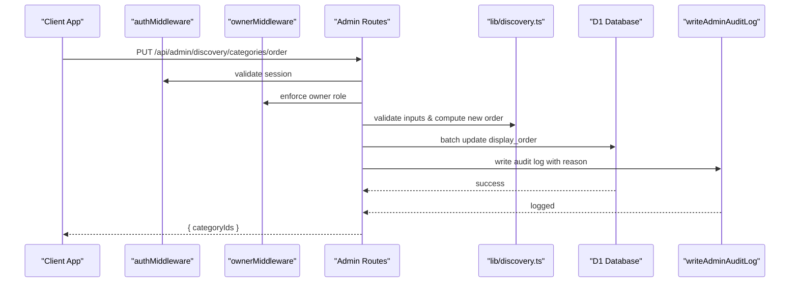
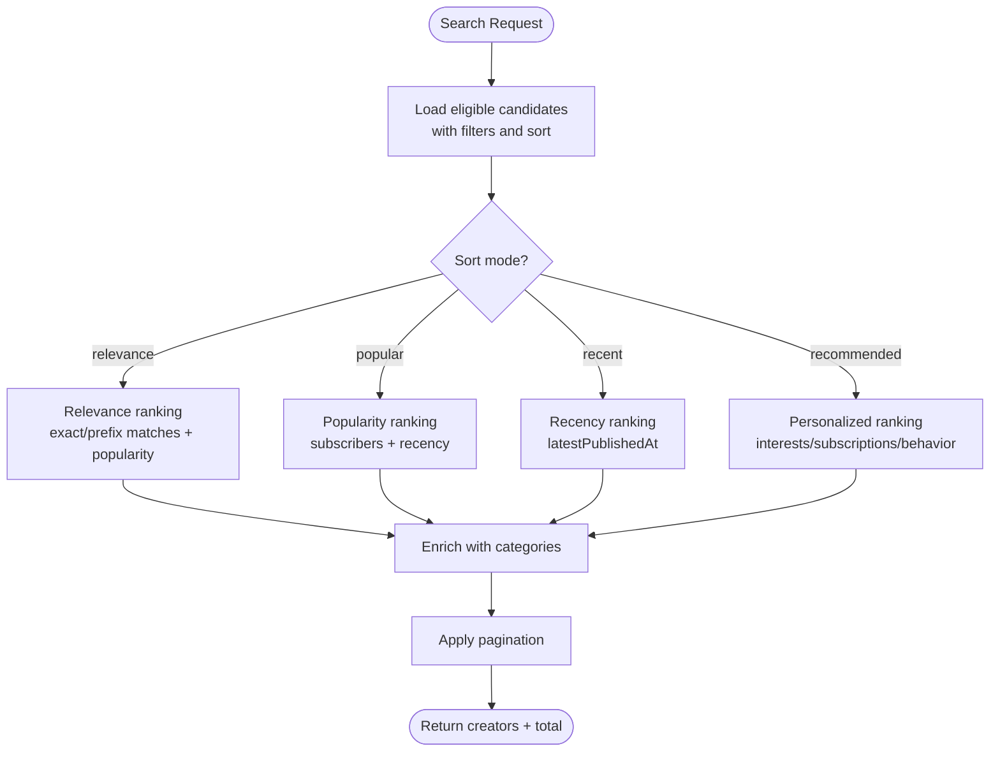
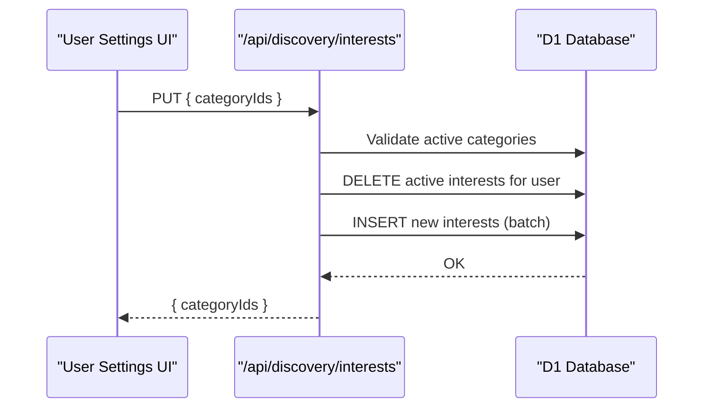
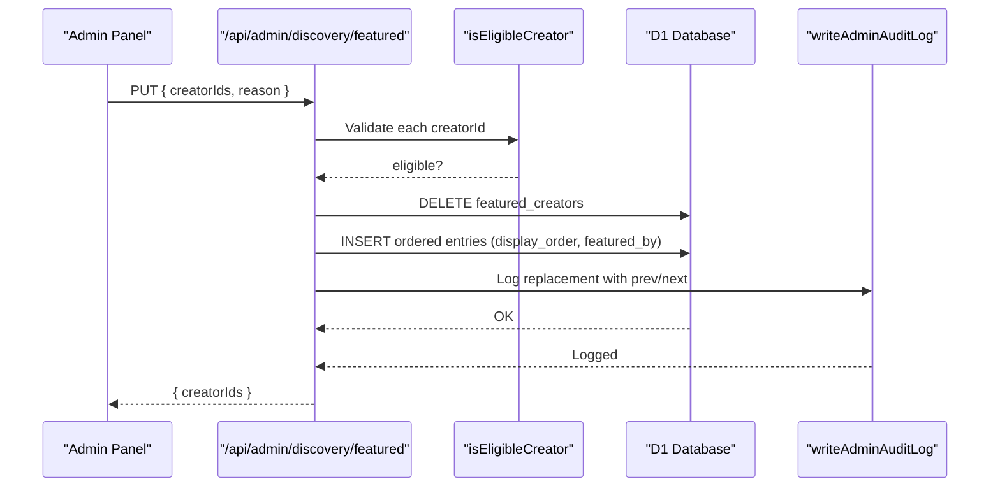
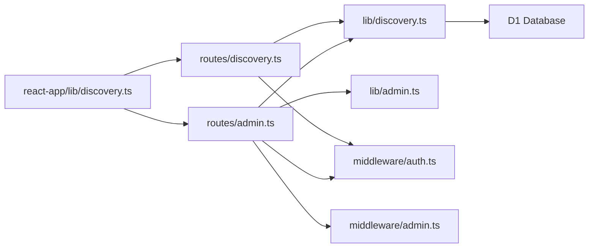

# Discovery Management API

<cite>
**Referenced Files in This Document**
- [discovery.ts](file://src/worker/routes/discovery.ts)
- [discovery.ts](file://src/worker/lib/discovery.ts)
- [admin.ts](file://src/worker/routes/admin.ts)
- [0015_creator_discovery.sql](file://drizzle/0015_creator_discovery.sql)
- [auth.ts](file://src/worker/middleware/auth.ts)
- [admin.ts](file://src/worker/middleware/admin.ts)
- [admin.ts](file://src/worker/lib/admin.ts)
- [discovery.ts](file://src/react-app/lib/discovery.ts)
- [AdminDiscoveryPanel.tsx](file://src/react-app/components/AdminDiscoveryPanel.tsx)
- [DiscoverySettingsPanel.tsx](file://src/react-app/components/DiscoverySettingsPanel.tsx)
- [discovery.test.ts](file://src/worker/routes/discovery.test.ts)
</cite>

## Table of Contents
1. [Introduction](#introduction)
2. [Project Structure](#project-structure)
3. [Core Components](#core-components)
4. [Architecture Overview](#architecture-overview)
5. [Detailed Component Analysis](#detailed-component-analysis)
6. [Dependency Analysis](#dependency-analysis)
7. [Performance Considerations](#performance-considerations)
8. [Troubleshooting Guide](#troubleshooting-guide)
9. [Conclusion](#conclusion)
10. [Appendices](#appendices)

## Introduction
This document provides comprehensive API documentation for discovery and featured content management endpoints. It covers:
- Category management (CRUD, ordering, activation)
- Eligible creator discovery
- Featured creator selection and rotation
- Category assignment workflows for users and creators
- HTTP methods, URL patterns, request/response schemas
- Owner-only access controls and audit logging
- Discovery algorithm integration, eligibility criteria, uniqueness constraints, order validation, and platform-wide impact

## Project Structure
The discovery feature spans worker routes, business logic, database schema, middleware, and React client utilities:
- Worker routes define public and admin endpoints
- Business logic implements search, ranking, eligibility, and category listing
- Database schema defines categories, user interests, creator categories, and featured creators
- Middleware enforces authentication and authorization
- React client provides query hooks and mutation helpers

**Diagram sources**
- [discovery.ts:1-120](file://src/worker/routes/discovery.ts#L1-L120)
- [discovery.ts:1-390](file://src/worker/lib/discovery.ts#L1-L390)
- [admin.ts:366-474](file://src/worker/routes/admin.ts#L366-L474)
- [0015_creator_discovery.sql:1-70](file://drizzle/0015_creator_discovery.sql#L1-L70)
- [auth.ts:1-57](file://src/worker/middleware/auth.ts#L1-L57)
- [admin.ts:1-14](file://src/worker/middleware/admin.ts#L1-L14)
- [discovery.ts:1-99](file://src/react-app/lib/discovery.ts#L1-L99)
- [AdminDiscoveryPanel.tsx:1-252](file://src/react-app/components/AdminDiscoveryPanel.tsx#L1-L252)
- [DiscoverySettingsPanel.tsx:1-93](file://src/react-app/components/DiscoverySettingsPanel.tsx#L1-L93)

**Section sources**
- [discovery.ts:1-120](file://src/worker/routes/discovery.ts#L1-L120)
- [discovery.ts:1-390](file://src/worker/lib/discovery.ts#L1-L390)
- [admin.ts:366-474](file://src/worker/routes/admin.ts#L366-L474)
- [0015_creator_discovery.sql:1-70](file://drizzle/0015_creator_discovery.sql#L1-L70)
- [auth.ts:1-57](file://src/worker/middleware/auth.ts#L1-L57)
- [admin.ts:1-14](file://src/worker/middleware/admin.ts#L1-L14)
- [discovery.ts:1-99](file://src/react-app/lib/discovery.ts#L1-L99)
- [AdminDiscoveryPanel.tsx:1-252](file://src/react-app/components/AdminDiscoveryPanel.tsx#L1-L252)
- [DiscoverySettingsPanel.tsx:1-93](file://src/react-app/components/DiscoverySettingsPanel.tsx#L1-L93)

## Core Components
- Public discovery endpoints: overview, creator search, preferences read/write
- Admin discovery endpoints: category CRUD, ordering, activation, eligible creators list, featured creators curation
- Business logic: category listing, candidate loading, recommendation scoring, eligibility checks
- Data model: categories, user interests, creator categories, featured creators
- Authorization: authenticated users for public endpoints; owner-only for admin endpoints

**Section sources**
- [discovery.ts:1-120](file://src/worker/routes/discovery.ts#L1-L120)
- [discovery.ts:1-390](file://src/worker/lib/discovery.ts#L1-L390)
- [admin.ts:366-474](file://src/worker/routes/admin.ts#L366-L474)
- [0015_creator_discovery.sql:1-70](file://drizzle/0015_creator_discovery.sql#L1-L70)
- [auth.ts:1-57](file://src/worker/middleware/auth.ts#L1-L57)
- [admin.ts:1-14](file://src/worker/middleware/admin.ts#L1-L14)

## Architecture Overview
The system separates public-facing discovery APIs from administrative control planes:
- Public APIs require authentication and provide discovery data and personalization
- Admin APIs require owner role and manage taxonomy and featured curation
- All changes are audited with reasons and metadata

**Diagram sources**
- [admin.ts:398-420](file://src/worker/routes/admin.ts#L398-L420)
- [admin.ts:7-31](file://src/worker/lib/admin.ts#L7-L31)
- [auth.ts:23-50](file://src/worker/middleware/auth.ts#L23-L50)
- [admin.ts:10-13](file://src/worker/middleware/admin.ts#L10-L13)

## Detailed Component Analysis

### Public Discovery Endpoints
- GET /api/discovery
  - Purpose: Returns overview including categories, featured creators, recommended creators, and user interests
  - Authentication: Required
  - Response fields: categories, featured, recommended, interests, needsInterests
- GET /api/discovery/creators
  - Query parameters: q, category, sort (relevance|recommended|popular|recent), page, pageSize
  - Purpose: Search eligible creators with filtering and sorting
  - Authentication: Required
  - Response fields: creators[], total, page, pageSize
- GET /api/discovery/preferences
  - Purpose: Get available categories and current user’s interest and creator category selections
  - Authentication: Required
  - Response fields: categories[], interestCategoryIds[], creatorCategoryIds[]
- PUT /api/discovery/interests
  - Body: { categoryIds: string[] }
  - Constraints: Max 5 unique active categories; duplicates rejected
  - Purpose: Update user’s recommendation interests
  - Authentication: Required
  - Response: { categoryIds }
- PUT /api/discovery/creator-categories
  - Body: { categoryIds: string[] }
  - Constraints: Max 3 unique active categories; duplicates rejected; only creators allowed
  - Purpose: Update public creator categories shown on profile and cards
  - Authentication: Required; role must be creator
  - Response: { categoryIds }

Notes:
- Eligibility filters ensure only active creators with published content appear
- Recommendation ranking uses interests, subscriptions, and behavior signals
- Inactive category selections are preserved but not returned in active lists

**Section sources**
- [discovery.ts:55-120](file://src/worker/routes/discovery.ts#L55-L120)
- [discovery.ts:151-390](file://src/worker/lib/discovery.ts#L151-L390)
- [discovery.ts:1-99](file://src/react-app/lib/discovery.ts#L1-L99)
- [discovery.test.ts:59-121](file://src/worker/routes/discovery.test.ts#L59-L121)

### Admin Discovery Endpoints
- GET /api/admin/discovery/categories
  - Purpose: List all discovery categories with assignment counts
  - Access: Owner-only
  - Response: { categories[] }
- POST /api/admin/discovery/categories
  - Body: { name, description?, reason }
  - Behavior: Generates slug from name; enforces unique name and slug; assigns next display_order
  - Access: Owner-only
  - Response: { id, slug, name }, status 201
- PUT /api/admin/discovery/categories/order
  - Body: { categoryIds: string[], reason }
  - Validation: Must include all existing categories; IDs must be unique; unknown IDs rejected
  - Behavior: Batch updates display_order; records audit log
  - Access: Owner-only
  - Response: { categoryIds }
- PUT /api/admin/discovery/categories/:id
  - Body: { name, description?, active, reason }
  - Validation: Unique name across other categories; toggles active flag
  - Access: Owner-only
  - Response: { id, slug, name, active }
- GET /api/admin/discovery/eligible-creators
  - Query: q (optional)
  - Purpose: Return eligible creators for selection
  - Access: Owner-only
  - Response: { creators[] }
- GET /api/admin/discovery/featured
  - Purpose: Return currently featured creators
  - Access: Owner-only
  - Response: { creators[] }
- PUT /api/admin/discovery/featured
  - Body: { creatorIds: string[], reason }
  - Validation: Max 12 unique eligible creators; each must be eligible
  - Behavior: Replaces entire featured list with ordered entries; records audit log
  - Access: Owner-only
  - Response: { creatorIds }

Notes:
- Slug generation is deterministic and stable per category creation
- Order updates require full list to prevent gaps or conflicts
- All admin actions are audited with actor, action, target, reason, and metadata

**Section sources**
- [admin.ts:366-474](file://src/worker/routes/admin.ts#L366-L474)
- [admin.ts:7-31](file://src/worker/lib/admin.ts#L7-L31)
- [admin.ts:10-13](file://src/worker/middleware/admin.ts#L10-L13)
- [discovery.test.ts:123-148](file://src/worker/routes/discovery.test.ts#L123-L148)

### Data Model and Schema
Key tables:
- discovery_categories: id, slug (unique), name (unique lowercase), description, display_order, active, timestamps
- user_category_interests: user_id, category_id (composite PK), created_at
- creator_categories: creator_id, category_id (composite PK), display_order, created_at
- featured_creators: creator_id (PK), display_order, featured_by, timestamps

Indexes optimize queries by active+order, category+creator, and creator+display_order.

**Section sources**
- [0015_creator_discovery.sql:1-70](file://drizzle/0015_creator_discovery.sql#L1-L70)

### Discovery Algorithm Integration
- Candidate loading filters eligible creators (role=creator, account_status=active, has published posts)
- Sorting modes:
  - relevance: exact username/display_name match highest, then prefix matches, then popularity/activity
  - popular: active subscriber count, recent publication count, latest activity
  - recent: latestPublishedAt descending
  - recommended: personalized ranking using interests, subscriptions, behavior signals
- Recommendation scoring weights:
  - Base score from subscribers and recent publications
  - +100 if category matches user interest
  - +40 if category matches subscription
  - +20 if category matches behavior (likes/saves)
- Recommendation reason explains the top signal for each creator

**Diagram sources**
- [discovery.ts:167-220](file://src/worker/lib/discovery.ts#L167-L220)
- [discovery.ts:290-318](file://src/worker/lib/discovery.ts#L290-L318)
- [discovery.ts:340-373](file://src/worker/lib/discovery.ts#L340-L373)

**Section sources**
- [discovery.ts:100-220](file://src/worker/lib/discovery.ts#L100-L220)
- [discovery.ts:245-318](file://src/worker/lib/discovery.ts#L245-L318)
- [discovery.ts:340-373](file://src/worker/lib/discovery.ts#L340-L373)

### Category Assignment Workflows
- User interests:
  - PUT /api/discovery/interests replaces all active interests for the user
  - Validates that selected categories are active and unique
  - Preserves inactive selections in storage but excludes from active lists
- Creator categories:
  - PUT /api/discovery/creator-categories replaces all active categories for the creator
  - Enforces max 3 unique active categories
  - Affects public profile and discovery card presentation

**Diagram sources**
- [discovery.ts:96-106](file://src/worker/routes/discovery.ts#L96-L106)
- [discovery.ts:151-165](file://src/worker/lib/discovery.ts#L151-L165)

**Section sources**
- [discovery.ts:96-119](file://src/worker/routes/discovery.ts#L96-L119)
- [discovery.ts:151-165](file://src/worker/lib/discovery.ts#L151-L165)

### Featured Content Rotation
- Admin selects up to 12 eligible creators
- Each creator must pass eligibility check
- The endpoint replaces the entire featured list with a new ordered sequence
- Changes are audited with previous and next lists

**Diagram sources**
- [admin.ts:452-474](file://src/worker/routes/admin.ts#L452-L474)
- [discovery.ts:383-390](file://src/worker/lib/discovery.ts#L383-L390)
- [admin.ts:7-31](file://src/worker/lib/admin.ts#L7-L31)

**Section sources**
- [admin.ts:443-474](file://src/worker/routes/admin.ts#L443-L474)
- [discovery.ts:375-390](file://src/worker/lib/discovery.ts#L375-L390)

### Ownership and Access Controls
- Public discovery endpoints require authentication via authMiddleware
- Admin discovery endpoints require owner role via ownerMiddleware
- Creator-only endpoints enforce role=creator
- Suspended accounts receive explicit error responses

**Section sources**
- [auth.ts:23-50](file://src/worker/middleware/auth.ts#L23-L50)
- [admin.ts:10-13](file://src/worker/middleware/admin.ts#L10-L13)
- [discovery.ts:55-120](file://src/worker/routes/discovery.ts#L55-L120)
- [admin.ts:366-474](file://src/worker/routes/admin.ts#L366-L474)

### Audit Logging
- All admin actions write structured logs with actor, action, target type/id, reason, and metadata
- Examples: discovery_category_created, discovery_categories_reordered, discovery_category_updated, featured_creators_replaced
- Logs support auditing and compliance tracking

**Section sources**
- [admin.ts:7-31](file://src/worker/lib/admin.ts#L7-L31)
- [admin.ts:387-395](file://src/worker/routes/admin.ts#L387-L395)
- [admin.ts:411-418](file://src/worker/routes/admin.ts#L411-L418)
- [admin.ts:432-439](file://src/worker/routes/admin.ts#L432-L439)
- [admin.ts:465-473](file://src/worker/routes/admin.ts#L465-L473)

## Dependency Analysis
- Routes depend on lib functions for business logic
- Business logic depends on D1 database queries and membership entitlement SQL
- Admin routes depend on owner middleware and audit logging utility
- React client depends on API helpers and query keys for caching

**Diagram sources**
- [discovery.ts:1-120](file://src/worker/routes/discovery.ts#L1-L120)
- [discovery.ts:1-390](file://src/worker/lib/discovery.ts#L1-L390)
- [admin.ts:1-530](file://src/worker/routes/admin.ts#L1-L530)
- [admin.ts:1-53](file://src/worker/lib/admin.ts#L1-L53)
- [auth.ts:1-57](file://src/worker/middleware/auth.ts#L1-L57)
- [admin.ts:1-14](file://src/worker/middleware/admin.ts#L1-L14)
- [discovery.ts:1-99](file://src/react-app/lib/discovery.ts#L1-L99)

**Section sources**
- [discovery.ts:1-120](file://src/worker/routes/discovery.ts#L1-L120)
- [discovery.ts:1-390](file://src/worker/lib/discovery.ts#L1-L390)
- [admin.ts:1-530](file://src/worker/routes/admin.ts#L1-L530)
- [admin.ts:1-53](file://src/worker/lib/admin.ts#L1-L53)
- [auth.ts:1-57](file://src/worker/middleware/auth.ts#L1-L57)
- [admin.ts:1-14](file://src/worker/middleware/admin.ts#L1-L14)
- [discovery.ts:1-99](file://src/react-app/lib/discovery.ts#L1-L99)

## Performance Considerations
- Queries use indexed columns (active+display_order, category+creator, creator+display_order)
- Pagination limits results to reduce payload size
- Bulk operations use batch statements for efficiency
- Recommendation ranking loads a bounded pool (up to 1000) before scoring
- Escape functions protect LIKE queries from injection and special characters

[No sources needed since this section provides general guidance]

## Troubleshooting Guide
Common errors and resolutions:
- 401 Unauthorized: Missing or invalid session cookie; re-authenticate
- 403 Forbidden: Insufficient permissions (non-owner for admin endpoints; non-creator for creator categories); verify roles
- 422 Validation Error: Duplicate category IDs, exceeding maximum selections, inactive categories; correct input
- 409 Conflict: Duplicate category name or slug; choose a unique name
- 404 Not Found: Invalid category ID or creator ID; verify identifiers
- Account suspended: Explicit error response; contact support

Operational tips:
- Ensure all category IDs are present when updating order
- Verify eligibility before selecting featured creators
- Use reason fields consistently for audit clarity

**Section sources**
- [discovery.ts:96-119](file://src/worker/routes/discovery.ts#L96-L119)
- [admin.ts:374-441](file://src/worker/routes/admin.ts#L374-L441)
- [auth.ts:44-46](file://src/worker/middleware/auth.ts#L44-L46)
- [discovery.test.ts:117-121](file://src/worker/routes/discovery.test.ts#L117-L121)

## Conclusion
The Discovery Management API provides robust tools for managing category taxonomy, personalizing recommendations, and curating featured creators. It enforces strict access controls, validates inputs thoroughly, and maintains comprehensive audit trails. The design balances performance with flexibility, enabling platform-wide impact while preserving user privacy and creator eligibility.

[No sources needed since this section summarizes without analyzing specific files]

## Appendices

### HTTP Methods and URL Patterns Summary
- GET /api/discovery
- GET /api/discovery/creators?q=&category=&sort=&page=&pageSize=
- GET /api/discovery/preferences
- PUT /api/discovery/interests { categoryIds: string[] }
- PUT /api/discovery/creator-categories { categoryIds: string[] }
- GET /api/admin/discovery/categories
- POST /api/admin/discovery/categories { name, description?, reason }
- PUT /api/admin/discovery/categories/order { categoryIds: string[], reason }
- PUT /api/admin/discovery/categories/:id { name, description?, active, reason }
- GET /api/admin/discovery/eligible-creators?q=
- GET /api/admin/discovery/featured
- PUT /api/admin/discovery/featured { creatorIds: string[], reason }

**Section sources**
- [discovery.ts:55-120](file://src/worker/routes/discovery.ts#L55-L120)
- [admin.ts:366-474](file://src/worker/routes/admin.ts#L366-L474)

### Example Workflows
- Category creation with slug generation:
  - POST /api/admin/discovery/categories with name “Architecture” generates slug “architecture”
  - Enforces uniqueness of name and slug; assigns next display_order
- Drag-and-drop reordering:
  - PUT /api/admin/discovery/categories/order with full categoryIds array; validates completeness and uniqueness
- Eligibility validation:
  - GET /api/admin/discovery/eligible-creators returns creators meeting role, status, and content criteria
- Featured content rotation:
  - PUT /api/admin/discovery/featured replaces list with ordered creatorIds; validates eligibility and limits

**Section sources**
- [admin.ts:374-420](file://src/worker/routes/admin.ts#L374-L420)
- [admin.ts:443-474](file://src/worker/routes/admin.ts#L443-L474)
- [discovery.ts:375-390](file://src/worker/lib/discovery.ts#L375-L390)