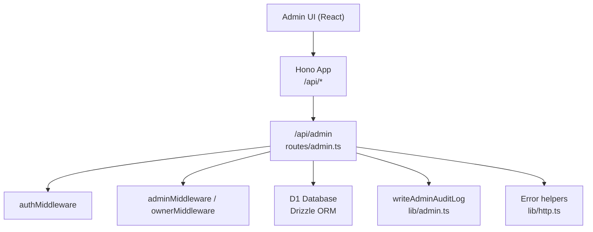
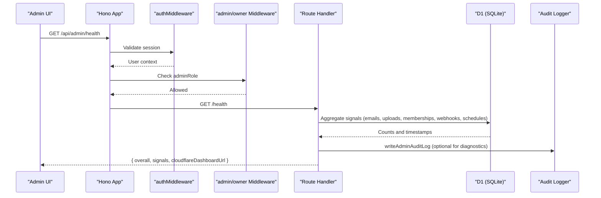
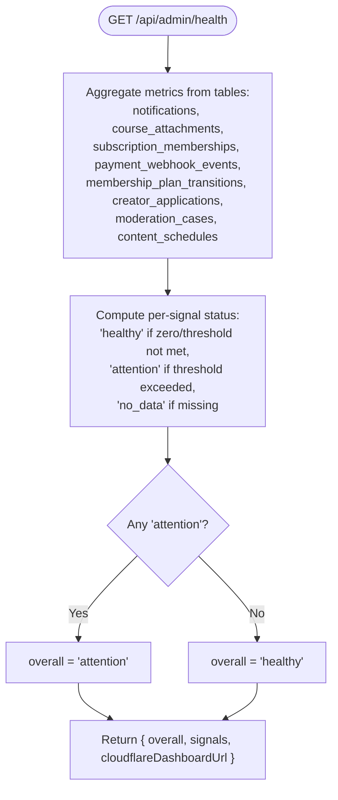
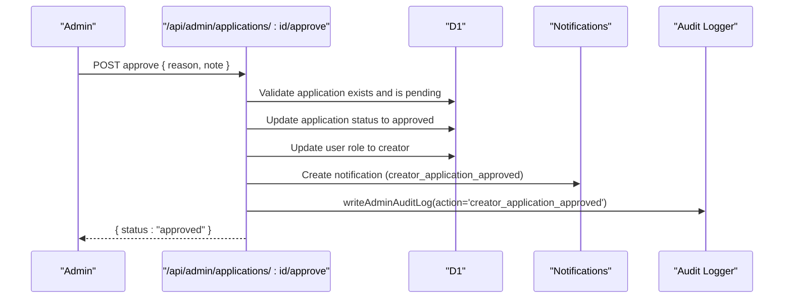
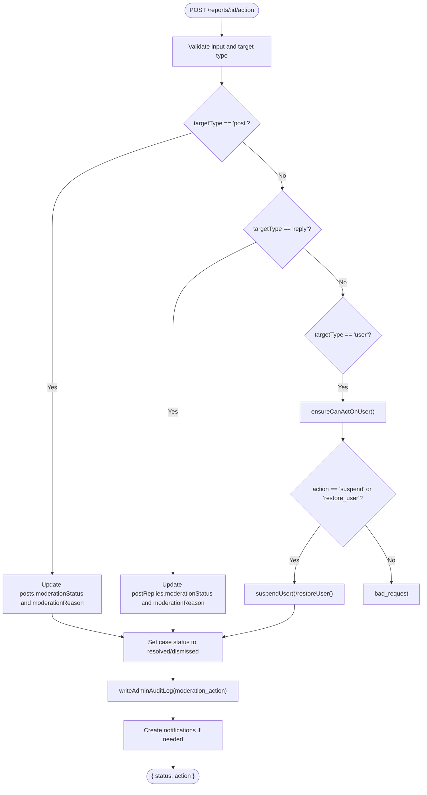
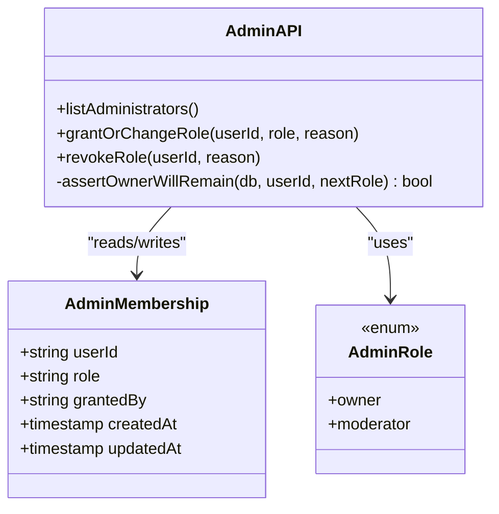
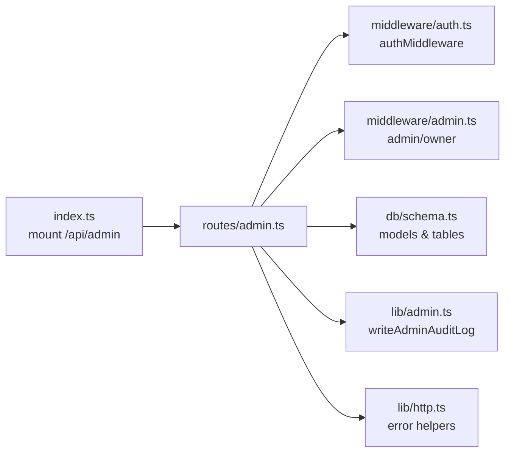

# System Administration API

<cite>
**Referenced Files in This Document**
- [index.ts](file://src/worker/index.ts)
- [admin.ts](file://src/worker/routes/admin.ts)
- [admin.ts](file://src/worker/middleware/admin.ts)
- [admin.ts](file://src/worker/lib/admin.ts)
- [schema.ts](file://src/worker/db/schema.ts)
- [http.ts](file://src/worker/lib/http.ts)
- [AdminPage.tsx](file://src/react-app/pages/AdminPage.tsx)
</cite>

## Table of Contents
1. [Introduction](#introduction)
2. [Project Structure](#project-structure)
3. [Core Components](#core-components)
4. [Architecture Overview](#architecture-overview)
5. [Detailed Component Analysis](#detailed-component-analysis)
6. [Dependency Analysis](#dependency-analysis)
7. [Performance Considerations](#performance-considerations)
8. [Troubleshooting Guide](#troubleshooting-guide)
9. [Conclusion](#conclusion)

## Introduction
This document provides comprehensive API documentation for the system administration endpoints exposed by the platform’s worker runtime. It covers health monitoring with service status checks, analytics overview with platform metrics, administrator role management, audit log retrieval, and operational workflows such as creator application review and moderation actions. Each endpoint specifies HTTP methods, URL patterns, request/response schemas, and administrative access requirements. It also explains the health signal system, monitoring thresholds, alerting mechanisms, and best practices for platform maintenance.

## Project Structure
The admin API is implemented as a Hono router mounted under /api/admin. Authentication and authorization are enforced via middleware that validates user identity and admin roles. The routes interact with a SQLite database (D1) through Drizzle ORM and expose structured JSON responses. A React-based Admin UI consumes these endpoints to provide an interactive dashboard.

**Diagram sources**
- [index.ts:24-45](file://src/worker/index.ts#L24-L45)
- [admin.ts:85-86](file://src/worker/routes/admin.ts#L85-L86)
- [admin.ts:5-13](file://src/worker/middleware/admin.ts#L5-L13)
- [admin.ts:7-31](file://src/worker/lib/admin.ts#L7-L31)
- [http.ts:23-75](file://src/worker/lib/http.ts#L23-L75)

**Section sources**
- [index.ts:24-45](file://src/worker/index.ts#L24-L45)
- [admin.ts:85-86](file://src/worker/routes/admin.ts#L85-L86)

## Core Components
- Admin Routes: Centralized handlers for all admin operations including overview, health, applications, reports, users, discovery, audit log, and administrators.
- Middleware: Enforces authentication and role-based access control (moderator vs owner).
- Audit Logging: Centralized function to record admin actions with actor, action type, target, reason, and metadata.
- Error Handling: Standardized error response format and validation hooks.

Key responsibilities:
- Health signal aggregation across multiple subsystems (DB, emails, payments, schedules, moderation workload).
- Role-gated endpoints ensuring only authorized admins can perform sensitive operations.
- Consistent pagination and filtering for list endpoints.
- Secure session revocation and account lifecycle management.

**Section sources**
- [admin.ts:85-86](file://src/worker/routes/admin.ts#L85-L86)
- [admin.ts:5-13](file://src/worker/middleware/admin.ts#L5-L13)
- [admin.ts:7-31](file://src/worker/lib/admin.ts#L7-L31)
- [http.ts:23-75](file://src/worker/lib/http.ts#L23-L75)

## Architecture Overview
The admin API follows a layered architecture:
- Presentation layer: React Admin UI calls /api/admin endpoints.
- Routing layer: Hono app mounts /api/admin routes.
- Authorization layer: authMiddleware ensures valid sessions; adminMiddleware/ownerMiddleware enforce roles.
- Business logic layer: Route handlers orchestrate data operations and side effects.
- Data layer: D1 queries via Drizzle ORM; external integrations like Stripe webhooks and R2 storage are referenced.

**Diagram sources**
- [index.ts:24-45](file://src/worker/index.ts#L24-L45)
- [admin.ts:103-170](file://src/worker/routes/admin.ts#L103-L170)
- [admin.ts:5-13](file://src/worker/middleware/admin.ts#L5-L13)
- [admin.ts:7-31](file://src/worker/lib/admin.ts#L7-L31)

## Detailed Component Analysis

### Health Monitoring Endpoint
- Method: GET
- URL: /api/admin/health
- Access: Requires authenticated admin (any admin role)
- Response schema:
  - overall: "healthy" | "attention"
  - signals: object keyed by subsystem with fields:
    - status: "healthy" | "attention" | "no_data"
    - value: number, timestamp, or structured object depending on subsystem
  - cloudflareDashboardUrl: string | null
- Signals include:
  - d1: availability
  - failedNotificationEmails: count in last 24h
  - staleCourseUploads: pending attachments older than 24h
  - incompleteMemberships: subscriptions in past_due/incomplete
  - contentSchedules: failed and overdue counts
  - stripeWebhooks: last processedAt or no_data
  - stripeSandbox: configured mode and accountId or error
  - stripeWebhookFailures: failures in last 24h
  - staleStripeCheckouts: pending checkouts with provider ID older than 24h
  - membershipTransitions: failed transitions count
  - reviewWorkload: sum of pending applications and open reports > 20 triggers attention
- Interpretation:
  - overall is "attention" if any signal is "attention"; otherwise "healthy"
  - Use values to identify bottlenecks (e.g., high failed emails, stale uploads, webhook failures)
- Example interpretation:
  - If stripeWebhookFailures.value > 0, investigate payment processing pipeline
  - If contentSchedules.value.overdue > 0, review scheduling queue and retry policies

**Diagram sources**
- [admin.ts:103-170](file://src/worker/routes/admin.ts#L103-L170)

**Section sources**
- [admin.ts:103-170](file://src/worker/routes/admin.ts#L103-L170)

### Analytics Overview Endpoint
- Method: GET
- URL: /api/admin/overview
- Access: Requires authenticated admin (any admin role)
- Response schema:
  - counts: object with keys:
    - users: total users
    - creators: users with role 'creator'
    - content: total posts
    - pendingApplications: creator applications with status 'pending'
    - openReports: moderation cases with status 'open' or 'reviewing'
    - suspendedUsers: users with account_status 'suspended'
    - hiddenContent: posts + replies with moderation_status 'hidden'
- Usage: Dashboard tiles display key platform metrics for quick situational awareness.

**Section sources**
- [admin.ts:88-101](file://src/worker/routes/admin.ts#L88-L101)

### Creator Applications Management
- List applications:
  - Method: GET
  - URL: /api/admin/applications
  - Query params: page, pageSize, search, status
  - Response: PageResponse<AdminApplication>
- Get application details:
  - Method: GET
  - URL: /api/admin/applications/:id
  - Response: Application object with social_links and content_links parsed from JSON
- View NID document:
  - Method: GET
  - URL: /api/admin/applications/:id/document
  - Response: Streamed document with inline disposition and cache-control headers
  - Side effect: Logs audit event creator_document_viewed
- Approve application:
  - Method: POST
  - URL: /api/admin/applications/:id/approve
  - Request body: { reason: string (3-500), note?: string (max 1000) }
  - Response: { status: "approved" }
  - Side effects: Update application status, set user role to 'creator', send notification, log audit
- Reject application:
  - Method: POST
  - URL: /api/admin/applications/:id/reject
  - Request body: { reason: string (3-500), note?: string (max 1000) }
  - Response: { status: "rejected" }
  - Side effects: Update application status, send notification, log audit

**Diagram sources**
- [admin.ts:209-223](file://src/worker/routes/admin.ts#L209-L223)
- [admin.ts:7-31](file://src/worker/lib/admin.ts#L7-L31)

**Section sources**
- [admin.ts:172-236](file://src/worker/routes/admin.ts#L172-L236)
- [admin.ts:196-207](file://src/worker/routes/admin.ts#L196-L207)

### Moderation Reports
- List reports:
  - Method: GET
  - URL: /api/admin/reports
  - Query params: page, pageSize, status, targetType, assigned
  - Response: PageResponse<ModerationCase>
- Get report details:
  - Method: GET
  - URL: /api/admin/reports/:id
  - Response: { case, reports[] }
- Assign case:
  - Method: POST
  - URL: /api/admin/reports/:id/assign
  - Request body: { adminId: string|null, reason: string (3-500) }
  - Response: { assignedAdminId: string|null }
  - Side effects: Update case status and assignee, log audit
- Take action:
  - Method: POST
  - URL: /api/admin/reports/:id/action
  - Request body: { action: "dismiss"|"hide"|"restore"|"suspend"|"restore_user", reason: string (3-500), note?: string (max 1000) }
  - Response: { status: "resolved"|"dismissed", action }
  - Side effects: Update target moderation status or user suspension, send notifications, log audit

**Diagram sources**
- [admin.ts:272-305](file://src/worker/routes/admin.ts#L272-L305)
- [admin.ts:514-529](file://src/worker/routes/admin.ts#L514-L529)

**Section sources**
- [admin.ts:238-305](file://src/worker/routes/admin.ts#L238-L305)

### Users Management
- List users:
  - Method: GET
  - URL: /api/admin/users
  - Query params: page, pageSize, search, role, accountStatus, admin
  - Response: PageResponse<ManagedUser>
- Get user details:
  - Method: GET
  - URL: /api/admin/users/:id
  - Response: { user, history[] } where history includes recent audit entries for the user
- Suspend user:
  - Method: POST
  - URL: /api/admin/users/:id/suspend
  - Request body: { reason: string (3-500), note?: string (max 1000) }
  - Response: { accountStatus: "suspended" }
  - Side effects: Send notification, update account status, revoke sessions, log audit
- Restore user:
  - Method: POST
  - URL: /api/admin/users/:id/restore
  - Request body: { reason: string (3-500), note?: string (max 1000) }
  - Response: { accountStatus: "active" }
  - Side effects: Clear suspension fields, send notification, log audit
- Revoke sessions:
  - Method: POST
  - URL: /api/admin/users/:id/revoke-sessions
  - Request body: { reason: string (3-500), note?: string (max 1000) }
  - Response: { revoked: true }
  - Side effects: Delete sessions for user, log audit

**Section sources**
- [admin.ts:307-364](file://src/worker/routes/admin.ts#L307-L364)

### Discovery Configuration (Owner-only)
- List categories:
  - Method: GET
  - URL: /api/admin/discovery/categories
  - Access: Owner
  - Response: { categories[] }
- Create category:
  - Method: POST
  - URL: /api/admin/discovery/categories
  - Request body: { name: string (2-60), description?: string (max 200), reason: string (3-500) }
  - Response: { id, slug, name }, status 201
  - Side effects: Insert category, log audit
- Update category order:
  - Method: PUT
  - URL: /api/admin/discovery/categories/order
  - Request body: { categoryIds: string[] (unique, max 100), reason: string (3-500) }
  - Response: { categoryIds }
  - Side effects: Batch update display_order, log audit
- Update category:
  - Method: PUT
  - URL: /api/admin/discovery/categories/:id
  - Request body: { name: string (2-60), description?: string (max 200), active: boolean, reason: string (3-500) }
  - Response: { id, slug, name, active }
  - Side effects: Update fields, log audit
- Eligible creators:
  - Method: GET
  - URL: /api/admin/discovery/eligible-creators
  - Query param: q (search)
  - Response: { creators[] }
- Featured creators:
  - Method: GET
  - URL: /api/admin/discovery/featured
  - Response: { creators[] }
- Replace featured creators:
  - Method: PUT
  - URL: /api/admin/discovery/featured
  - Request body: { creatorIds: string[] (unique, max MAX_FEATURED_CREATORS), reason: string (3-500) }
  - Response: { creatorIds }
  - Side effects: Replace featured_creators table, log audit

**Section sources**
- [admin.ts:366-474](file://src/worker/routes/admin.ts#L366-L474)

### Audit Log Retrieval
- Method: GET
- URL: /api/admin/audit-log
- Query params: page, pageSize, action (filter by action)
- Response: PageResponse<AuditEntry> where each entry includes actorEmail, action, targetType, targetId, reason, createdAt
- Usage: Investigate administrative actions and reasons; supports filtering by action type.

**Section sources**
- [admin.ts:476-485](file://src/worker/routes/admin.ts#L476-L485)

### Administrator Role Management (Owner-only)
- List administrators:
  - Method: GET
  - URL: /api/admin/administrators
  - Access: Owner
  - Response: { items[] } including userId, role, grantedBy, createdAt, email, username, accountStatus
- Grant or change role:
  - Method: POST
  - URL: /api/admin/administrators/:userId
  - Request body: { role: "owner"|"moderator", reason: string (3-500) }
  - Response: { userId, role }
  - Constraints: Final owner cannot be demoted; upserts admin_memberships
  - Side effects: Log audit
- Revoke role:
  - Method: DELETE
  - URL: /api/admin/administrators/:userId
  - Request body: { reason: string (3-500) }
  - Response: { revoked: true }
  - Constraints: Final owner cannot be removed
  - Side effects: Log audit and delete membership

**Diagram sources**
- [schema.ts:35-43](file://src/worker/db/schema.ts#L35-L43)
- [admin.ts:487-512](file://src/worker/routes/admin.ts#L487-L512)
- [admin.ts:41-52](file://src/worker/lib/admin.ts#L41-L52)

**Section sources**
- [admin.ts:487-512](file://src/worker/routes/admin.ts#L487-L512)
- [admin.ts:41-52](file://src/worker/lib/admin.ts#L41-L52)

## Dependency Analysis
- Routing and mounting:
  - The Hono app mounts /api/admin routes at index.ts.
- Authorization:
  - authMiddleware validates sessions and populates user context.
  - adminMiddleware requires adminRole present; ownerMiddleware requires adminRole === "owner".
- Data access:
  - Route handlers use createDb(c.env.DB) and Drizzle ORM models for queries and mutations.
- Audit logging:
  - writeAdminAuditLog persists admin actions and emits console logs for observability.
- Error handling:
  - Standardized error responses via lib/http.ts with consistent codes and messages.

**Diagram sources**
- [index.ts:24-45](file://src/worker/index.ts#L24-L45)
- [admin.ts:85-86](file://src/worker/routes/admin.ts#L85-L86)
- [admin.ts:5-13](file://src/worker/middleware/admin.ts#L5-L13)
- [schema.ts:35-43](file://src/worker/db/schema.ts#L35-L43)
- [admin.ts:7-31](file://src/worker/lib/admin.ts#L7-L31)
- [http.ts:23-75](file://src/worker/lib/http.ts#L23-L75)

**Section sources**
- [index.ts:24-45](file://src/worker/index.ts#L24-L45)
- [admin.ts:85-86](file://src/worker/routes/admin.ts#L85-L86)

## Performance Considerations
- Health endpoint aggregates multiple counters using parallel queries; ensure indexes exist on frequently filtered columns (e.g., created_at, status).
- Pagination is enforced with default pageSize capped at 50 to prevent large payloads.
- Batch updates are used for operations like category ordering to reduce round trips.
- Avoid excessive client-side polling; the Admin UI refreshes health every 60 seconds.
- For large datasets, consider adding additional filters (e.g., date ranges) to list endpoints if needed.

[No sources needed since this section provides general guidance]

## Troubleshooting Guide
Common errors and resolutions:
- Validation failures:
  - Status 422 with code "validation_failed" indicates Zod schema issues; inspect request payload against endpoint schemas.
- Unauthorized/Forbidden:
  - 401 unauthorized: Missing or invalid session token.
  - 403 forbidden: Insufficient admin role (requires moderator or owner).
- Not found:
  - 404 not_found: Resource does not exist (e.g., application, user, category).
- Conflict:
  - 409 conflict: State mismatch (e.g., approving non-pending application) or policy violation (final owner constraints).
- Internal server error:
  - 500 internal_server_error: Unexpected exceptions; check server logs and database connectivity.

Operational tips:
- Use /api/admin/audit-log to trace actions and reasons for changes.
- Review /api/admin/health signals to pinpoint failing subsystems (webhooks, schedules, memberships).
- For user suspensions, verify notifications were sent and sessions revoked.

**Section sources**
- [http.ts:23-75](file://src/worker/lib/http.ts#L23-L75)
- [admin.ts:476-485](file://src/worker/routes/admin.ts#L476-L485)
- [admin.ts:103-170](file://src/worker/routes/admin.ts#L103-L170)

## Conclusion
The System Administration API provides robust controls for platform maintenance, including health monitoring, analytics overview, creator application workflows, moderation actions, user lifecycle management, discovery configuration, audit logging, and administrator role governance. By adhering to the documented schemas, access requirements, and best practices, administrators can maintain platform stability, security, and compliance while leveraging clear diagnostic signals and audit trails.

[No sources needed since this section summarizes without analyzing specific files]