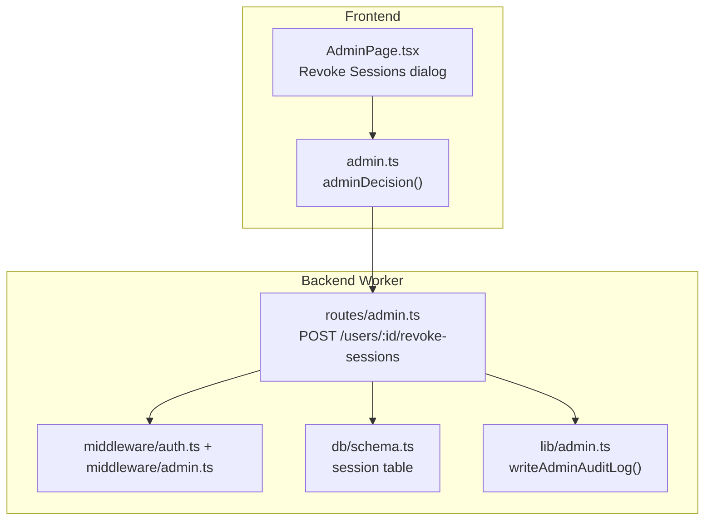
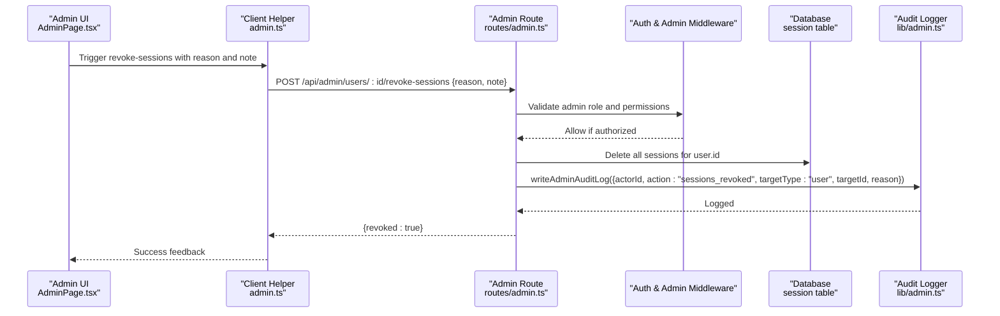
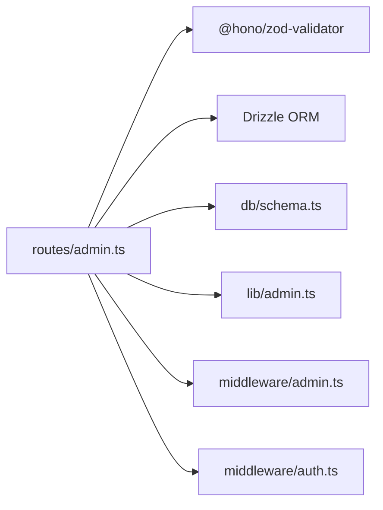

# Session Management

<cite>
**Referenced Files in This Document**
- [admin.ts](file://src/worker/routes/admin.ts)
- [admin.ts](file://src/worker/lib/admin.ts)
- [schema.ts](file://src/worker/db/schema.ts)
- [admin.ts](file://src/react-app/lib/admin.ts)
- [AdminPage.tsx](file://src/react-app/pages/AdminPage.tsx)
</cite>

## Table of Contents
1. [Introduction](#introduction)
2. [Project Structure](#project-structure)
3. [Core Components](#core-components)
4. [Architecture Overview](#architecture-overview)
5. [Detailed Component Analysis](#detailed-component-analysis)
6. [Dependency Analysis](#dependency-analysis)
7. [Performance Considerations](#performance-considerations)
8. [Troubleshooting Guide](#troubleshooting-guide)
9. [Conclusion](#conclusion)

## Introduction
This document provides detailed API documentation for the session management endpoint that allows administrators to terminate all active sessions for a specific user: POST /api/admin/users/:id/revoke-sessions. It explains request validation, response format, security implications, use cases (such as emergency account lockdown or incident response), immediate effects on user authentication, and integration with the audit logging system. It also covers considerations around session token invalidation and user notification mechanisms.

## Project Structure
The session revocation feature is implemented across backend routes, middleware, database schema, and the admin UI:
- Backend route handling and business logic: src/worker/routes/admin.ts
- Audit logging utility: src/worker/lib/admin.ts
- Database schema definitions (session table): src/worker/db/schema.ts
- Frontend helper utilities: src/react-app/lib/admin.ts
- Admin UI triggering the action: src/react-app/pages/AdminPage.tsx

**Diagram sources**
- [AdminPage.tsx:133-209](file://src/react-app/pages/AdminPage.tsx#L133-L209)
- [admin.ts:53-55](file://src/react-app/lib/admin.ts#L53-L55)
- [admin.ts:354-364](file://src/worker/routes/admin.ts#L354-L364)
- [schema.ts:108-124](file://src/worker/db/schema.ts#L108-L124)
- [admin.ts:7-31](file://src/worker/lib/admin.ts#L7-L31)

**Section sources**
- [admin.ts:354-364](file://src/worker/routes/admin.ts#L354-L364)
- [admin.ts:7-31](file://src/worker/lib/admin.ts#L7-L31)
- [schema.ts:108-124](file://src/worker/db/schema.ts#L108-L124)
- [admin.ts:53-55](file://src/react-app/lib/admin.ts#L53-L55)
- [AdminPage.tsx:133-209](file://src/react-app/pages/AdminPage.tsx#L133-L209)

## Core Components
- Endpoint: POST /api/admin/users/:id/revoke-sessions
- Purpose: Revoke all active sessions for a given user, effectively signing them out from every device.
- Authorization: Requires administrator access; enforced by middleware.
- Request body: JSON object with a required reason field and an optional note field.
- Response: JSON object indicating success with a revoked flag.

Key implementation details:
- Validation: Uses a decision schema requiring a trimmed reason string (min length 3, max 500) and an optional trimmed note (max 1000).
- Security checks: Ensures the calling admin can act on the target user (e.g., moderators cannot act on administrators).
- Data operation: Deletes all session records associated with the target user.
- Audit logging: Records the action with actor ID, action type, target type, target ID, and reason.

**Section sources**
- [admin.ts:34-36](file://src/worker/routes/admin.ts#L34-L36)
- [admin.ts:354-364](file://src/worker/routes/admin.ts#L354-L364)
- [admin.ts:7-31](file://src/worker/lib/admin.ts#L7-L31)
- [schema.ts:108-124](file://src/worker/db/schema.ts#L108-L124)

## Architecture Overview
The revoke-sessions flow involves the admin UI, backend route, authorization middleware, database operations, and audit logging.

**Diagram sources**
- [AdminPage.tsx:133-209](file://src/react-app/pages/AdminPage.tsx#L133-L209)
- [admin.ts:53-55](file://src/react-app/lib/admin.ts#L53-L55)
- [admin.ts:354-364](file://src/worker/routes/admin.ts#L354-L364)
- [admin.ts:7-31](file://src/worker/lib/admin.ts#L7-L31)
- [schema.ts:108-124](file://src/worker/db/schema.ts#L108-L124)

## Detailed Component Analysis

### API Definition: POST /api/admin/users/:id/revoke-sessions
- Path: /api/admin/users/:id/revoke-sessions
- Method: POST
- Authentication: Administrator required (enforced by middleware)
- Request Body:
  - reason: string, required, trimmed, min 3 characters, max 500 characters
  - note: string, optional, trimmed, max 1000 characters
- Response Body:
  - revoked: boolean, true on successful revocation
- Error Responses:
  - Not Found: If the specified user does not exist
  - Forbidden: If the admin lacks permission to act on the target user (e.g., moderator acting on an administrator)
  - Bad Request: If validation fails (e.g., missing or invalid reason)

Behavior:
- Validates input using decisionSchema.
- Checks admin permissions via ensureCanActOnUser.
- Verifies user existence.
- Deletes all session rows for the user.
- Writes an audit log entry with action "sessions_revoked".

**Section sources**
- [admin.ts:34-36](file://src/worker/routes/admin.ts#L34-L36)
- [admin.ts:354-364](file://src/worker/routes/admin.ts#L354-L364)

### Request Validation
- The decision schema enforces:
  - reason: non-empty, trimmed, between 3 and 500 characters
  - note: optional, trimmed, up to 1000 characters
- Zod-based validation ensures consistent input constraints across endpoints.

**Section sources**
- [admin.ts:34-36](file://src/worker/routes/admin.ts#L34-L36)

### Authorization and Permissions
- All admin routes are protected by authMiddleware and adminMiddleware.
- ownerMiddleware restricts certain actions to owners only.
- ensureCanActOnUser prevents moderators from acting on administrators.

**Section sources**
- [admin.ts:85-86](file://src/worker/routes/admin.ts#L85-L86)
- [admin.ts:5-13](file://src/worker/middleware/admin.ts#L5-L13)
- [admin.ts:79-83](file://src/worker/routes/admin.ts#L79-L83)

### Database Operations
- Session table schema includes id, expiresAt, token, createdAt, updatedAt, ipAddress, userAgent, userId.
- Indexes include session_user_id_idx for efficient deletion by user.
- Revoking sessions deletes all rows where userId matches the target.

**Section sources**
- [schema.ts:108-124](file://src/worker/db/schema.ts#L108-L124)
- [admin.ts:354-364](file://src/worker/routes/admin.ts#L354-L364)

### Audit Logging Integration
- writeAdminAuditLog persists an audit record with actorId, action, targetType, targetId, reason, and metadata.
- For revoke-sessions, action is "sessions_revoked", targetType is "user", and reason is provided by the admin.
- Console logs an event for observability.

**Section sources**
- [admin.ts:7-31](file://src/worker/lib/admin.ts#L7-L31)
- [admin.ts:354-364](file://src/worker/routes/admin.ts#L354-L364)

### Frontend Integration
- Admin UI presents a confirmation dialog titled "Revoke sessions" with fields for reason and private note.
- On confirm, it calls the backend via adminDecision which posts {reason, note}.
- Success triggers a toast and refreshes relevant data.

**Section sources**
- [AdminPage.tsx:133-209](file://src/react-app/pages/AdminPage.tsx#L133-L209)
- [admin.ts:53-55](file://src/react-app/lib/admin.ts#L53-L55)

### Immediate Effect on User Authentication
- Deleting all session rows invalidates existing session tokens immediately.
- Any subsequent requests using those tokens will fail authentication until the user re-authenticates.
- Users may experience unexpected sign-outs if they have active sessions across multiple devices.

[No sources needed since this section summarizes behavior without analyzing specific files]

### Use Cases
- Emergency account lockdown: Immediately invalidate sessions when suspicious activity is detected.
- Security incident response: Terminate all sessions after a compromise is suspected.
- Policy enforcement: Enforce password changes or security updates by forcing re-authentication.
- Administrative cleanup: Remove stale sessions after account status changes.

[No sources needed since this section provides general guidance]

### Security Considerations
- Session token invalidation: Ensure session storage is centralized and deletions propagate correctly across services.
- Rate limiting: Consider throttling revoke-sessions to prevent abuse.
- Least privilege: Restrict who can perform session revocation to trusted administrators.
- Audit trail: Always require a reason and log actions for accountability.
- Notification mechanism: Optionally notify users about session revocations via email or in-app notifications.

[No sources needed since this section provides general guidance]

## Dependency Analysis
The revoke-sessions endpoint depends on:
- Hono routing and context
- Zod validation via @hono/zod-validator
- Drizzle ORM for database operations
- Admin middleware for authorization
- Audit logging utility for persistence

**Diagram sources**
- [admin.ts:1-31](file://src/worker/routes/admin.ts#L1-L31)
- [schema.ts:108-124](file://src/worker/db/schema.ts#L108-L124)
- [admin.ts:7-31](file://src/worker/lib/admin.ts#L7-L31)
- [admin.ts:5-13](file://src/worker/middleware/admin.ts#L5-L13)

**Section sources**
- [admin.ts:1-31](file://src/worker/routes/admin.ts#L1-L31)
- [schema.ts:108-124](file://src/worker/db/schema.ts#L108-L124)
- [admin.ts:7-31](file://src/worker/lib/admin.ts#L7-L31)
- [admin.ts:5-13](file://src/worker/middleware/admin.ts#L5-L13)

## Performance Considerations
- Deletion performance: Deleting all sessions for a user is O(n) based on the number of active sessions. Ensure indexes on userId are present to optimize queries.
- Batch operations: Consider batching deletions if session counts are large.
- Concurrency: Handle concurrent revoke requests to avoid race conditions or partial deletions.
- Observability: Monitor audit log writes and database operations for latency spikes.

[No sources needed since this section provides general guidance]

## Troubleshooting Guide
Common issues and resolutions:
- 403 Forbidden: Ensure the admin has sufficient privileges (owner or appropriate moderator role) to act on the target user.
- 404 Not Found: Verify the user ID exists before attempting revocation.
- Validation errors: Confirm the reason field meets minimum length requirements and is properly trimmed.
- Audit log gaps: Check writeAdminAuditLog calls and database connectivity to ensure logs are persisted.

**Section sources**
- [admin.ts:354-364](file://src/worker/routes/admin.ts#L354-L364)
- [admin.ts:7-31](file://src/worker/lib/admin.ts#L7-L31)

## Conclusion
The POST /api/admin/users/:id/revoke-sessions endpoint provides a secure and auditable way for administrators to terminate all active sessions for a user. It enforces strict validation, authorization, and integrates with the audit logging system. Proper usage ensures immediate session invalidation and supports critical security workflows such as emergency lockdowns and incident response. Administrators should always provide meaningful reasons and consider user notification strategies to maintain transparency and trust.

[No sources needed since this section summarizes without analyzing specific files]