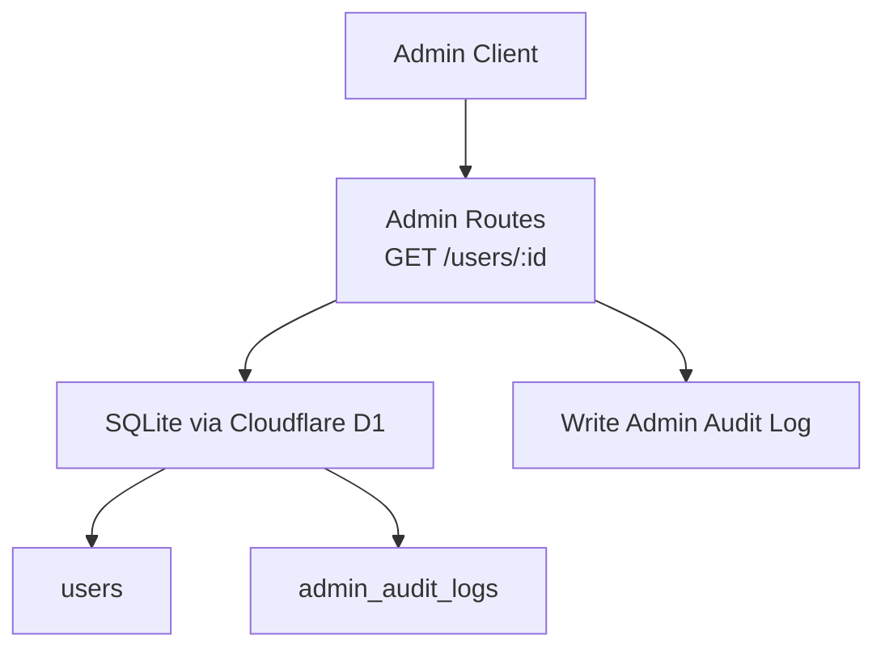
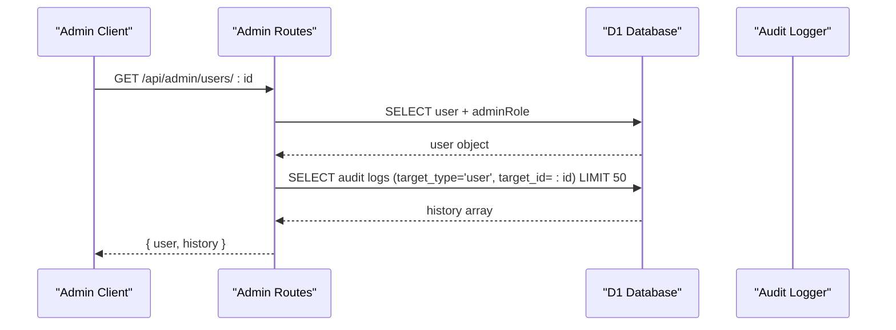
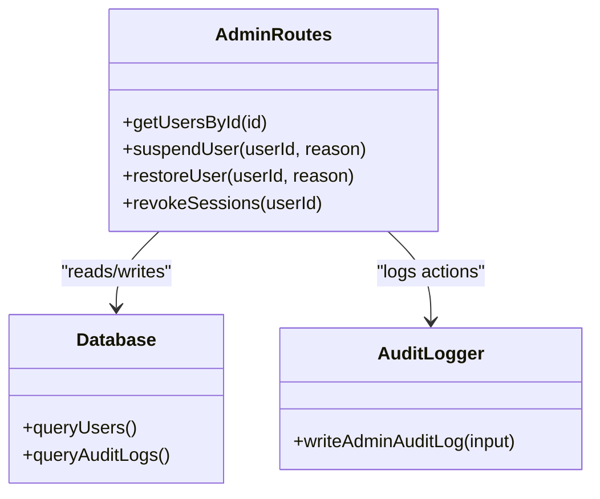

# User Details and History

<cite>
**Referenced Files in This Document**
- [admin.ts](file://src/worker/routes/admin.ts)
- [schema.ts](file://src/worker/db/schema.ts)
- [admin.ts](file://src/worker/lib/admin.ts)
</cite>

## Table of Contents
1. [Introduction](#introduction)
2. [Project Structure](#project-structure)
3. [Core Components](#core-components)
4. [Architecture Overview](#architecture-overview)
5. [Detailed Component Analysis](#detailed-component-analysis)
6. [Dependency Analysis](#dependency-analysis)
7. [Performance Considerations](#performance-considerations)
8. [Troubleshooting Guide](#troubleshooting-guide)
9. [Conclusion](#conclusion)

## Introduction
This document provides detailed API documentation for the GET /api/admin/users/:id endpoint that returns comprehensive user information, including suspension details, and an integrated audit history feature that returns up to 50 recent administrative actions performed on the user. It also explains how to interpret the audit trail data for compliance and investigation purposes.

The endpoint is part of the admin routes and requires authentication and admin privileges. The response includes:
- A user object with identity, role, account status, and suspension details (reason, timestamp, by whom).
- A history array containing up to 50 recent administrative actions targeting the user, such as suspension, restoration, session revocation, and administrator role changes. Each entry includes action type, reason, and timestamp.

## Project Structure
The relevant implementation resides in the worker layer:
- Route definitions and request handling are in src/worker/routes/admin.ts.
- Database schema definitions are in src/worker/db/schema.ts.
- Audit logging utility is in src/worker/lib/admin.ts.

**Diagram sources**
- [admin.ts:325-332](file://src/worker/routes/admin.ts#L325-L332)
- [schema.ts:655-667](file://src/worker/db/schema.ts#L655-L667)
- [admin.ts:7-31](file://src/worker/lib/admin.ts#L7-L31)

**Section sources**
- [admin.ts:325-332](file://src/worker/routes/admin.ts#L325-L332)
- [schema.ts:655-667](file://src/worker/db/schema.ts#L655-L667)
- [admin.ts:7-31](file://src/worker/lib/admin.ts#L7-L31)

## Core Components
- GET /api/admin/users/:id
  - Returns a user object and an audit history array limited to 50 entries.
  - Requires authentication and admin middleware.
- Audit log writing
  - All administrative actions write to admin_audit_logs using writeAdminAuditLog.
- Data model
  - users table stores account status and suspension fields.
  - admin_audit_logs table records actor, action, target, reason, metadata, and timestamp.

Key behaviors:
- Suspension sets account_status to suspended, records suspension_reason, suspended_at, and suspended_by.
- Restoration clears suspension fields and sets account_status to active.
- Session revocation deletes all sessions for the user and logs the action.
- Administrator role changes update admin_memberships and log the change.

**Section sources**
- [admin.ts:325-332](file://src/worker/routes/admin.ts#L325-L332)
- [admin.ts:334-364](file://src/worker/routes/admin.ts#L334-L364)
- [admin.ts:492-511](file://src/worker/routes/admin.ts#L492-L511)
- [schema.ts:5-32](file://src/worker/db/schema.ts#L5-L32)
- [schema.ts:655-667](file://src/worker/db/schema.ts#L655-L667)
- [admin.ts:7-31](file://src/worker/lib/admin.ts#L7-L31)

## Architecture Overview
The endpoint performs two database queries:
1. Fetches user details from users and admin_memberships tables.
2. Retrieves up to 50 recent audit log entries for the user, ordered by creation time descending.

**Diagram sources**
- [admin.ts:325-332](file://src/worker/routes/admin.ts#L325-L332)

**Section sources**
- [admin.ts:325-332](file://src/worker/routes/admin.ts#L325-L332)

## Detailed Component Analysis

### Endpoint: GET /api/admin/users/:id
- Path parameters
  - id: string, required, unique user identifier
- Authentication and authorization
  - Protected by authMiddleware and adminMiddleware; only authenticated admins can access
- Response structure
  - user: object with fields:
    - id: string
    - email: string
    - username: string
    - displayName: string
    - role: string (e.g., subscriber or creator)
    - accountStatus: string (active or suspended)
    - suspensionReason: string | null
    - suspendedAt: number (Unix timestamp) | null
    - suspendedBy: string | null
    - createdAt: number (Unix timestamp)
    - adminRole: string | null (owner or moderator if applicable)
  - history: array of objects (up to 50), each with:
    - action: string (e.g., user_suspended, user_restored, sessions_revoked, administrator_role_changed, administrator_revoked)
    - reason: string | null
    - createdAt: number (Unix timestamp)
- Error responses
  - 404 Not Found when user does not exist
  - 401/403 when authentication or admin authorization fails

Example usage
- Request
  - GET /api/admin/users/<user-id>
- Response body
  - {
      "user": { ... },
      "history": [
        { "action": "user_suspended", "reason": "...", "createdAt": <ts> },
        { "action": "sessions_revoked", "reason": "...", "createdAt": <ts> },
        { "action": "administrator_role_changed", "reason": "...", "createdAt": <ts>, "metadata": { "role": "moderator" } }
      ]
    }

Interpreting audit trail data
- user_suspended: Indicates the user was suspended; check suspensionReason and suspendedAt/suspendedBy in user object for context.
- user_restored: Indicates the user was restored; accountStatus should be active.
- sessions_revoked: Indicates all sessions were deleted; useful for forcing logout during investigations.
- administrator_role_changed: Indicates admin role change; metadata contains the new role.
- administrator_revoked: Indicates admin role removal; metadata may contain previous role.

Compliance and investigation tips
- Use history.createdAt to build a timeline of actions.
- Combine user.suspensionReason and history.reason to understand policy enforcement.
- For security incidents, revoke sessions immediately and review the most recent history entries.

**Section sources**
- [admin.ts:325-332](file://src/worker/routes/admin.ts#L325-L332)
- [admin.ts:334-364](file://src/worker/routes/admin.ts#L334-L364)
- [admin.ts:492-511](file://src/worker/routes/admin.ts#L492-L511)
- [schema.ts:5-32](file://src/worker/db/schema.ts#L5-L32)
- [schema.ts:655-667](file://src/worker/db/schema.ts#L655-L667)

### Related Endpoints and Actions
- POST /api/admin/users/:id/suspend
  - Suspends the user, updates account_status, records suspension fields, revokes sessions, and writes audit log with action user_suspended.
- POST /api/admin/users/:id/restore
  - Restores the user, clears suspension fields, sets account_status to active, and writes audit log with action user_restored.
- POST /api/admin/users/:id/revoke-sessions
  - Deletes all sessions for the user and writes audit log with action sessions_revoked.
- PUT /api/admin/administrators/:userId
  - Changes administrator role and writes audit log with action administrator_role_changed.
- DELETE /api/admin/administrators/:userId
  - Revokes administrator role and writes audit log with action administrator_revoked.

These endpoints contribute entries to the same audit history returned by GET /api/admin/users/:id.

**Section sources**
- [admin.ts:334-364](file://src/worker/routes/admin.ts#L334-L364)
- [admin.ts:492-511](file://src/worker/routes/admin.ts#L492-L511)
- [admin.ts:7-31](file://src/worker/lib/admin.ts#L7-L31)

### Data Model and Schema
- users table fields relevant to this endpoint:
  - id, email, username, display_name, role, account_status, suspension_reason, suspended_at, suspended_by, created_at
- admin_audit_logs table fields:
  - id, actor_id, action, target_type, target_id, reason, metadata, created_at

Indexes ensure efficient retrieval of audit logs by created_at and actor_id+created_at.

**Section sources**
- [schema.ts:5-32](file://src/worker/db/schema.ts#L5-L32)
- [schema.ts:655-667](file://src/worker/db/schema.ts#L655-L667)

## Dependency Analysis
- Route handler depends on:
  - Database client for direct SQL queries
  - Admin middleware for authorization
  - Audit logger utility for consistent logging
- Data dependencies:
  - users table for core identity and status
  - admin_memberships for admin roles
  - admin_audit_logs for historical actions

**Diagram sources**
- [admin.ts:325-332](file://src/worker/routes/admin.ts#L325-L332)
- [admin.ts:7-31](file://src/worker/lib/admin.ts#L7-L31)

**Section sources**
- [admin.ts:325-332](file://src/worker/routes/admin.ts#L325-L332)
- [admin.ts:7-31](file://src/worker/lib/admin.ts#L7-L31)

## Performance Considerations
- The endpoint performs two queries: one for user details and one for audit history limited to 50 rows.
- Indexes on admin_audit_logs.created_at and admin_audit_logs.actor_id+created_at optimize query performance.
- Avoid excessive pagination on history beyond 50; consider filtering by action type at the route level if needed.

[No sources needed since this section provides general guidance]

## Troubleshooting Guide
Common issues and resolutions:
- 404 Not Found
  - Ensure the user id exists and is valid.
- 401/403 Unauthorized
  - Verify authentication token and admin privileges.
- Empty history array
  - No administrative actions have been recorded for the user yet.
- Stale suspension state
  - Check recent user_suspended/user_restored entries and confirm account_status matches expectations.

Operational checks:
- Confirm audit logs are being written by inspecting admin_audit_logs for the target user.
- Validate that suspend/restore/revoke-sessions endpoints are called with proper reasons.

**Section sources**
- [admin.ts:325-332](file://src/worker/routes/admin.ts#L325-L332)
- [admin.ts:7-31](file://src/worker/lib/admin.ts#L7-L31)

## Conclusion
The GET /api/admin/users/:id endpoint provides a comprehensive view of a user’s current state and their recent administrative interactions. By combining user details with an integrated audit history, administrators can efficiently investigate and enforce policies while maintaining clear compliance records. Use the provided schemas and examples to integrate this endpoint into your admin workflows confidently.

[No sources needed since this section summarizes without analyzing specific files]