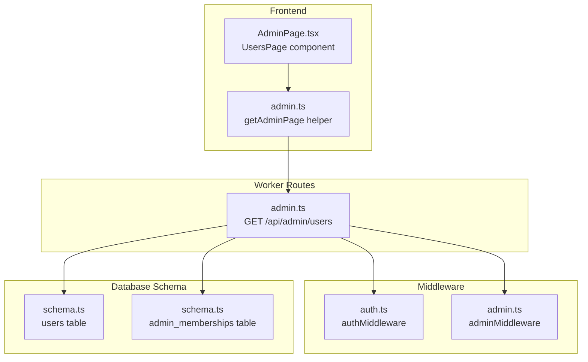
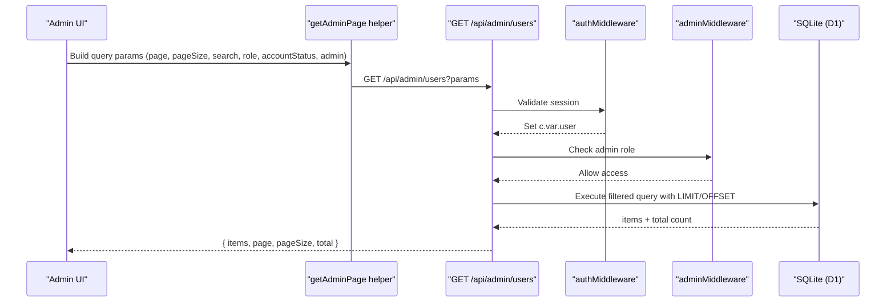
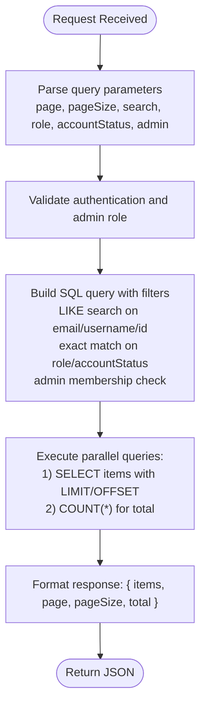
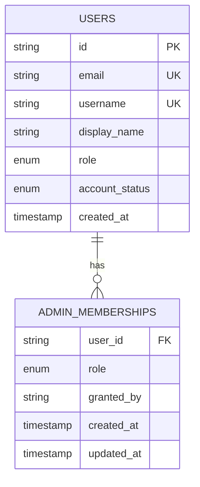
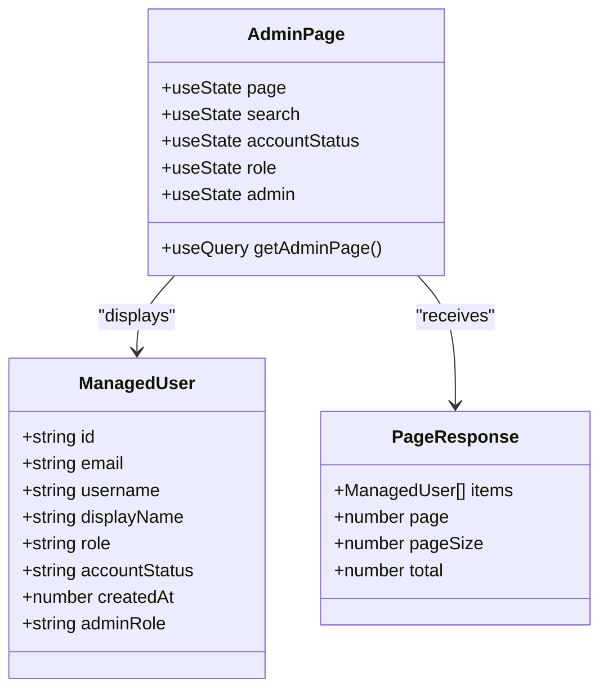
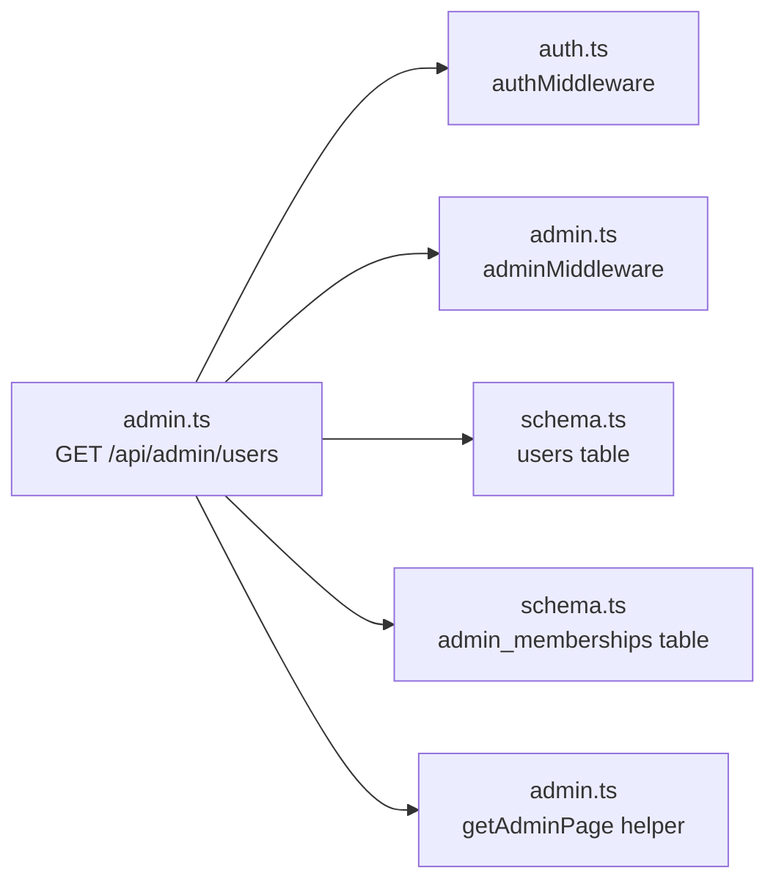

# User Listing and Search

<cite>
**Referenced Files in This Document**
- [admin.ts](file://src/worker/routes/admin.ts)
- [schema.ts](file://src/worker/db/schema.ts)
- [auth.ts](file://src/worker/middleware/auth.ts)
- [admin.ts](file://src/worker/middleware/admin.ts)
- [AdminPage.tsx](file://src/react-app/pages/AdminPage.tsx)
- [admin.ts](file://src/react-app/lib/admin.ts)
</cite>

## Table of Contents
1. [Introduction](#introduction)
2. [Project Structure](#project-structure)
3. [Core Components](#core-components)
4. [Architecture Overview](#architecture-overview)
5. [Detailed Component Analysis](#detailed-component-analysis)
6. [Dependency Analysis](#dependency-analysis)
7. [Performance Considerations](#performance-considerations)
8. [Troubleshooting Guide](#troubleshooting-guide)
9. [Conclusion](#conclusion)

## Introduction
This document provides detailed API documentation for the user listing and search endpoint used by administrators to browse, filter, and paginate users across the platform. It focuses on the GET /api/admin/users endpoint, which supports:
- Text search across email, username, and user ID fields
- Role-based filtering (subscriber, creator)
- Account status filtering (active, suspended)
- Administrator status filtering (yes/no)
- Pagination with page and pageSize parameters

The response includes a standardized user object containing id, email, username, displayName, role, accountStatus, createdAt, and adminRole.

## Project Structure
The user listing feature is implemented as part of the admin routes in the worker layer. The database schema defines the users table and related indexes. The frontend consumes this endpoint via React components that pass query parameters for filtering and pagination.

**Diagram sources**
- [AdminPage.tsx:719-800](file://src/react-app/pages/AdminPage.tsx#L719-L800)
- [admin.ts:49-51](file://src/react-app/lib/admin.ts#L49-L51)
- [admin.ts:307-323](file://src/worker/routes/admin.ts#L307-L323)
- [auth.ts:23-50](file://src/worker/middleware/auth.ts#L23-L50)
- [admin.ts:5-8](file://src/worker/middleware/admin.ts#L5-L8)
- [schema.ts:5-32](file://src/worker/db/schema.ts#L5-L32)
- [schema.ts:35-43](file://src/worker/db/schema.ts#L35-L43)

**Section sources**
- [admin.ts:307-323](file://src/worker/routes/admin.ts#L307-L323)
- [schema.ts:5-32](file://src/worker/db/schema.ts#L5-L32)
- [auth.ts:23-50](file://src/worker/middleware/auth.ts#L23-L50)
- [admin.ts:5-8](file://src/worker/middleware/admin.ts#L5-L8)
- [AdminPage.tsx:719-800](file://src/react-app/pages/AdminPage.tsx#L719-L800)
- [admin.ts:49-51](file://src/react-app/lib/admin.ts#L49-L51)

## Core Components
- Endpoint: GET /api/admin/users
- Authentication and authorization: Requires an authenticated session and administrator privileges
- Query parameters:
  - search: text to match against email, username, and id
  - role: filter by user role (subscriber, creator)
  - accountStatus: filter by account status (active, suspended)
  - admin: filter by administrator membership (yes, no)
  - page: page number (default 1)
  - pageSize: items per page (default 20, max 50)
- Response shape:
  - items: array of user objects
  - page: current page number
  - pageSize: requested page size
  - total: total count matching filters

User object fields:
- id: string
- email: string
- username: string
- displayName: string
- role: 'subscriber' | 'creator'
- accountStatus: 'active' | 'suspended'
- createdAt: number (timestamp)
- adminRole: 'owner' | 'moderator' | null

Pagination behavior:
- page defaults to 1 if missing or invalid
- pageSize defaults to 20 if missing or invalid; clamped between 1 and 50
- offset computed as (page - 1) * pageSize
- Results ordered by creation date descending

Search behavior:
- search parameter is trimmed and wrapped with LIKE wildcards
- Matches are applied to email, username, and id fields

Filtering behavior:
- role: empty value means no filter; otherwise exact match on role field
- accountStatus: empty value means no filter; otherwise exact match on account_status field
- admin: empty value means no filter; 'yes' returns users with admin membership; 'no' returns users without admin membership

**Section sources**
- [admin.ts:307-323](file://src/worker/routes/admin.ts#L307-L323)
- [admin.ts:64-68](file://src/worker/routes/admin.ts#L64-L68)
- [schema.ts:5-32](file://src/worker/db/schema.ts#L5-L32)
- [schema.ts:35-43](file://src/worker/db/schema.ts#L35-L43)
- [auth.ts:23-50](file://src/worker/middleware/auth.ts#L23-L50)
- [admin.ts:5-8](file://src/worker/middleware/admin.ts#L5-L8)
- [admin.ts:49-51](file://src/react-app/lib/admin.ts#L49-L51)

## Architecture Overview
The request flow involves authentication middleware, authorization middleware, route handler logic, and database queries. The frontend composes query parameters and renders results using a paginated table.

**Diagram sources**
- [admin.ts:307-323](file://src/worker/routes/admin.ts#L307-L323)
- [auth.ts:23-50](file://src/worker/middleware/auth.ts#L23-L50)
- [admin.ts:5-8](file://src/worker/middleware/admin.ts#L5-L8)
- [admin.ts:49-51](file://src/react-app/lib/admin.ts#L49-L51)

## Detailed Component Analysis

### GET /api/admin/users Endpoint
- Purpose: List users with filtering and pagination
- Authorization: Requires admin role
- Query parameters:
  - search: optional text; matches email, username, id
  - role: optional; values include subscriber, creator
  - accountStatus: optional; values include active, suspended
  - admin: optional; values include yes, no
  - page: optional; default 1
  - pageSize: optional; default 20; max 50
- Response:
  - items: array of user objects
  - page: number
  - pageSize: number
  - total: number

Request examples:
- Basic list: GET /api/admin/users?page=1&pageSize=20
- Filter by role: GET /api/admin/users?role=creator&page=1&pageSize=20
- Filter by account status: GET /api/admin/users?accountStatus=suspended&page=1&pageSize=20
- Filter by admin membership: GET /api/admin/users?admin=yes&page=1&pageSize=20
- Text search: GET /api/admin/users?search=john&page=1&pageSize=20
- Combined filters: GET /api/admin/users?role=creator&accountStatus=active&admin=no&search=alice&page=1&pageSize=20

Response schema:
- items: array of user objects
  - id: string
  - email: string
  - username: string
  - displayName: string
  - role: 'subscriber' | 'creator'
  - accountStatus: 'active' | 'suspended'
  - createdAt: number
  - adminRole: 'owner' | 'moderator' | null
- page: number
- pageSize: number
- total: number

Complex query example:
- Retrieve creators who are not administrators and have active accounts, searching for usernames containing "alex", returning page 2 with 10 items per page:
  GET /api/admin/users?role=creator&accountStatus=active&admin=no&search=alex&page=2&pageSize=10

Handling large result sets:
- Use reasonable pageSize values (up to 50) to avoid heavy payloads
- Implement client-side pagination controls to navigate pages
- Combine filters to reduce result set size before pagination

**Diagram sources**
- [admin.ts:307-323](file://src/worker/routes/admin.ts#L307-L323)
- [admin.ts:64-68](file://src/worker/routes/admin.ts#L64-L68)

**Section sources**
- [admin.ts:307-323](file://src/worker/routes/admin.ts#L307-L323)
- [admin.ts:64-68](file://src/worker/routes/admin.ts#L64-L68)

### Data Model and Relationships
The users table contains core user information, while admin_memberships tracks administrative roles. The endpoint joins these tables to determine admin status.

**Diagram sources**
- [schema.ts:5-32](file://src/worker/db/schema.ts#L5-L32)
- [schema.ts:35-43](file://src/worker/db/schema.ts#L35-L43)

**Section sources**
- [schema.ts:5-32](file://src/worker/db/schema.ts#L5-L32)
- [schema.ts:35-43](file://src/worker/db/schema.ts#L35-L43)

### Frontend Integration
The AdminPage component demonstrates how the endpoint is consumed with filtering and pagination controls.

**Diagram sources**
- [AdminPage.tsx:719-800](file://src/react-app/pages/AdminPage.tsx#L719-L800)
- [admin.ts:30-39](file://src/react-app/lib/admin.ts#L30-L39)

**Section sources**
- [AdminPage.tsx:719-800](file://src/react-app/pages/AdminPage.tsx#L719-L800)
- [admin.ts:30-39](file://src/react-app/lib/admin.ts#L30-L39)

## Dependency Analysis
The endpoint depends on several components:
- Authentication middleware for session validation
- Authorization middleware for admin role verification
- Database schema definitions for users and admin_memberships tables
- Frontend utilities for building query strings and handling responses

**Diagram sources**
- [admin.ts:307-323](file://src/worker/routes/admin.ts#L307-L323)
- [auth.ts:23-50](file://src/worker/middleware/auth.ts#L23-L50)
- [admin.ts:5-8](file://src/worker/middleware/admin.ts#L5-L8)
- [schema.ts:5-32](file://src/worker/db/schema.ts#L5-L32)
- [schema.ts:35-43](file://src/worker/db/schema.ts#L35-L43)
- [admin.ts:49-51](file://src/react-app/lib/admin.ts#L49-L51)

**Section sources**
- [admin.ts:307-323](file://src/worker/routes/admin.ts#L307-L323)
- [auth.ts:23-50](file://src/worker/middleware/auth.ts#L23-L50)
- [admin.ts:5-8](file://src/worker/middleware/admin.ts#L5-L8)
- [schema.ts:5-32](file://src/worker/db/schema.ts#L5-L32)
- [schema.ts:35-43](file://src/worker/db/schema.ts#L35-L43)
- [admin.ts:49-51](file://src/react-app/lib/admin.ts#L49-L51)

## Performance Considerations
- Pagination limits: pageSize is capped at 50 to prevent excessive data transfer
- Database indexing: An index exists on account_status for efficient filtering
- Query optimization: Parallel execution of data retrieval and count queries
- Search performance: LIKE queries with wildcards may be slower on large datasets; consider limiting search scope when possible
- Caching: Consider implementing server-side caching for frequently accessed filters

[No sources needed since this section provides general guidance]

## Troubleshooting Guide
Common issues and solutions:
- Authentication errors: Ensure valid session token is provided
- Authorization errors: Verify the user has admin privileges
- Invalid parameters: Check parameter types and allowed values
- Empty results: Verify filter combinations are valid
- Performance issues: Reduce pageSize or add more specific filters

Error responses:
- Unauthorized: Missing or invalid session
- Forbidden: Insufficient permissions (not an admin)
- Bad Request: Invalid parameter values

**Section sources**
- [auth.ts:23-50](file://src/worker/middleware/auth.ts#L23-L50)
- [admin.ts:5-8](file://src/worker/middleware/admin.ts#L5-L8)

## Conclusion
The GET /api/admin/users endpoint provides comprehensive user management capabilities for administrators through robust filtering, search, and pagination features. The implementation follows security best practices with proper authentication and authorization checks. The design supports efficient querying through database indexing and optimized query patterns, making it suitable for managing large user bases in production environments.

[No sources needed since this section summarizes without analyzing specific files]