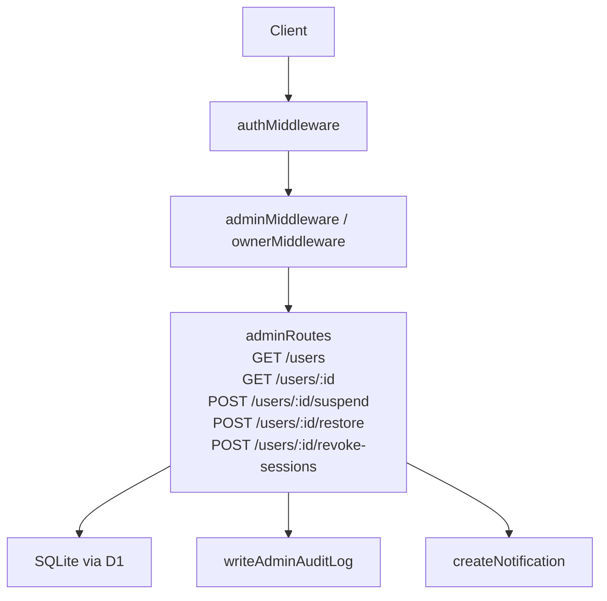
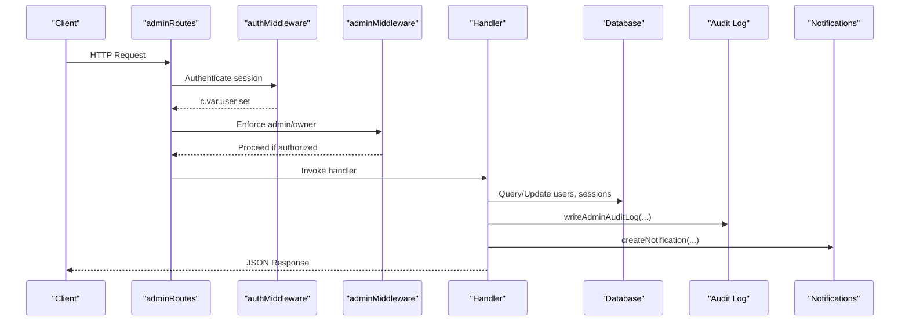
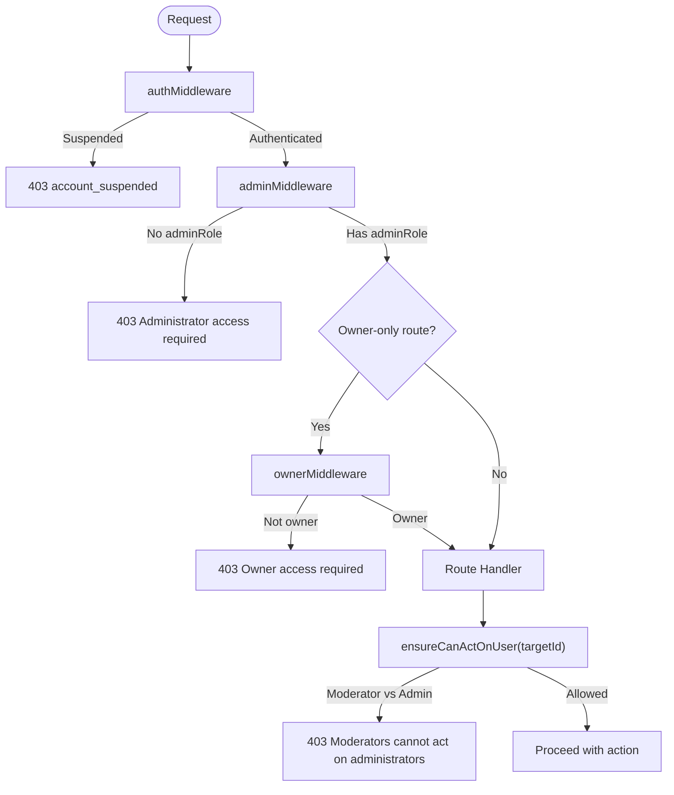
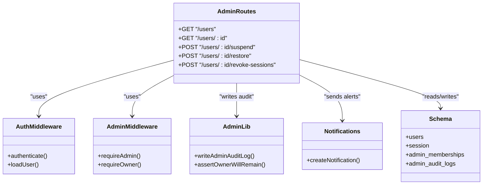

# User Management API

<cite>
**Referenced Files in This Document**
- [admin.ts](file://src/worker/routes/admin.ts)
- [auth.ts](file://src/worker/middleware/auth.ts)
- [admin-middleware.ts](file://src/worker/middleware/admin.ts)
- [schema.ts](file://src/worker/db/schema.ts)
- [admin-lib.ts](file://src/worker/lib/admin.ts)
- [notifications.ts](file://src/worker/lib/notifications.ts)
</cite>

## Table of Contents
1. [Introduction](#introduction)
2. [Project Structure](#project-structure)
3. [Core Components](#core-components)
4. [Architecture Overview](#architecture-overview)
5. [Detailed Component Analysis](#detailed-component-analysis)
6. [Dependency Analysis](#dependency-analysis)
7. [Performance Considerations](#performance-considerations)
8. [Troubleshooting Guide](#troubleshooting-guide)
9. [Conclusion](#conclusion)
10. [Appendices](#appendices)

## Introduction
This document provides detailed API documentation for user management endpoints exposed by the admin routes. It covers listing and searching users, filtering by role and account status, retrieving user details, suspending and restoring users, revoking sessions, and tracking audit history. All endpoints are protected with authentication and require administrative privileges. The document also explains access control behavior, including ensureCanActOnUser, role-based permissions, and notification flows during lifecycle changes.

## Project Structure
The user management functionality is implemented within the worker’s Hono application:
- Routes: src/worker/routes/admin.ts
- Middleware: src/worker/middleware/auth.ts (authentication), src/worker/middleware/admin.ts (authorization)
- Data model: src/worker/db/schema.ts (users, session, admin_memberships, admin_audit_logs)
- Admin utilities: src/worker/lib/admin.ts (audit logging and owner safety checks)
- Notifications: src/worker/lib/notifications.ts (account notifications on suspend/restore)

**Diagram sources**
- [admin.ts:85-364](file://src/worker/routes/admin.ts#L85-L364)
- [auth.ts:23-50](file://src/worker/middleware/auth.ts#L23-L50)
- [admin-middleware.ts:5-13](file://src/worker/middleware/admin.ts#L5-L13)
- [admin-lib.ts:7-31](file://src/worker/lib/admin.ts#L7-L31)
- [notifications.ts:153-234](file://src/worker/lib/notifications.ts#L153-L234)

**Section sources**
- [admin.ts:1-530](file://src/worker/routes/admin.ts#L1-L530)
- [auth.ts:1-57](file://src/worker/middleware/auth.ts#L1-L57)
- [admin-middleware.ts:1-14](file://src/worker/middleware/admin.ts#L1-L14)
- [schema.ts:5-32](file://src/worker/db/schema.ts#L5-L32)
- [admin-lib.ts:1-53](file://src/worker/lib/admin.ts#L1-L53)
- [notifications.ts:1-461](file://src/worker/lib/notifications.ts#L1-L461)

## Core Components
- Authentication middleware validates sessions and attaches an authenticated user object to the request context. Suspended accounts receive a specific error response.
- Authorization middleware enforces admin or owner roles for protected routes.
- Admin routes implement user listing, search, filtering, detail retrieval, suspension, restoration, and session revocation.
- Admin utilities provide audit logging and owner safety checks.
- Notification system sends account-related emails and in-app notifications when users are suspended or restored.

**Section sources**
- [auth.ts:23-50](file://src/worker/middleware/auth.ts#L23-L50)
- [admin-middleware.ts:5-13](file://src/worker/middleware/admin.ts#L5-L13)
- [admin.ts:85-364](file://src/worker/routes/admin.ts#L85-L364)
- [admin-lib.ts:7-53](file://src/worker/lib/admin.ts#L7-L53)
- [notifications.ts:153-234](file://src/worker/lib/notifications.ts#L153-L234)

## Architecture Overview
The admin user management flow follows a strict pipeline:
1. Request arrives at adminRoutes.
2. authMiddleware authenticates the session and loads user + admin role.
3. adminMiddleware ensures the caller has adminRole; ownerMiddleware further restricts to owner.
4. Route handlers validate inputs, enforce business rules (ensureCanActOnUser), perform DB operations, write audit logs, and send notifications.

**Diagram sources**
- [admin.ts:85-364](file://src/worker/routes/admin.ts#L85-L364)
- [auth.ts:23-50](file://src/worker/middleware/auth.ts#L23-L50)
- [admin-middleware.ts:5-13](file://src/worker/middleware/admin.ts#L5-L13)
- [admin-lib.ts:7-31](file://src/worker/lib/admin.ts#L7-L31)
- [notifications.ts:153-234](file://src/worker/lib/notifications.ts#L153-L234)

## Detailed Component Analysis

### Access Control and Role Matrix
- Authentication: Required for all admin routes. Suspended accounts are rejected early.
- Authorization:
  - adminMiddleware: Requires adminRole (owner or moderator).
  - ownerMiddleware: Requires adminRole === 'owner'.
- ensureCanActOnUser: Prevents moderators from acting on administrators. Owners can act on any user.

**Diagram sources**
- [auth.ts:23-50](file://src/worker/middleware/auth.ts#L23-L50)
- [admin-middleware.ts:5-13](file://src/worker/middleware/admin.ts#L5-L13)
- [admin.ts:79-83](file://src/worker/routes/admin.ts#L79-L83)

**Section sources**
- [auth.ts:23-50](file://src/worker/middleware/auth.ts#L23-L50)
- [admin-middleware.ts:5-13](file://src/worker/middleware/admin.ts#L5-L13)
- [admin.ts:79-83](file://src/worker/routes/admin.ts#L79-L83)

### GET /admin/users
Lists users with pagination and filters.

- Method: GET
- URL: /admin/users
- Auth: Required (admin)
- Query parameters:
  - page: integer >= 1 (default 1)
  - pageSize: integer 1..50 (default 20)
  - search: string (matches email, username, id)
  - role: string (filters by user.role)
  - accountStatus: string (filters by users.account_status)
  - admin: string ("yes" | "no") filters whether user has admin membership
- Response schema:
  - items: array of user summaries
    - id: string
    - email: string
    - username: string
    - displayName: string
    - role: "subscriber" | "creator"
    - accountStatus: "active" | "suspended"
    - createdAt: timestamp
    - adminRole: "owner" | "moderator" | null
  - page: number
  - pageSize: number
  - total: number

Notes:
- Search supports partial matches across multiple fields.
- Filtering supports exact match on role and accountStatus.
- Pagination uses offset based on page and pageSize.

**Section sources**
- [admin.ts:307-323](file://src/worker/routes/admin.ts#L307-L323)
- [schema.ts:5-32](file://src/worker/db/schema.ts#L5-L32)

### GET /admin/users/:id
Retrieves a single user’s details and recent audit history.

- Method: GET
- URL: /admin/users/:id
- Auth: Required (admin)
- Path parameter:
  - id: string (user.id)
- Response schema:
  - user: object
    - id: string
    - email: string
    - username: string
    - displayName: string
    - role: "subscriber" | "creator"
    - accountStatus: "active" | "suspended"
    - suspensionReason: string | null
    - suspendedAt: timestamp | null
    - createdAt: timestamp
    - adminRole: "owner" | "moderator" | null
  - history: array of audit entries
    - action: string
    - reason: string | null
    - createdAt: timestamp

Notes:
- History is limited to last 50 entries for the target user.

**Section sources**
- [admin.ts:325-332](file://src/worker/routes/admin.ts#L325-L332)
- [schema.ts:655-667](file://src/worker/db/schema.ts#L655-L667)

### POST /admin/users/:id/suspend
Suspends a user and invalidates their sessions.

- Method: POST
- URL: /admin/users/:id/suspend
- Auth: Required (admin)
- Body schema:
  - reason: string (min 3, max 500)
  - note: string (optional, max 1000)
- Behavior:
  - ensureCanActOnUser prevents moderators from acting on admins.
  - Updates users.account_status to "suspended", sets suspensionReason, suspendedAt, suspendedBy.
  - Deletes all sessions for the user.
  - Writes audit log entry.
  - Sends account_suspended notification (email forced).
- Response schema:
  - accountStatus: "suspended"

**Section sources**
- [admin.ts:334-342](file://src/worker/routes/admin.ts#L334-L342)
- [admin.ts:514-521](file://src/worker/routes/admin.ts#L514-L521)
- [admin-lib.ts:7-31](file://src/worker/lib/admin.ts#L7-L31)
- [notifications.ts:153-234](file://src/worker/lib/notifications.ts#L153-L234)
- [schema.ts:108-124](file://src/worker/db/schema.ts#L108-L124)

### POST /admin/users/:id/restore
Restores a previously suspended user.

- Method: POST
- URL: /admin/users/:id/restore
- Auth: Required (admin)
- Body schema:
  - reason: string (min 3, max 500)
  - note: string (optional, max 1000)
- Behavior:
  - ensureCanActOnUser prevents moderators from acting on admins.
  - Sets users.account_status to "active", clears suspensionReason, suspendedAt, suspendedBy.
  - Writes audit log entry.
  - Sends account_restored notification (email forced).
- Response schema:
  - accountStatus: "active"

**Section sources**
- [admin.ts:344-352](file://src/worker/routes/admin.ts#L344-L352)
- [admin.ts:523-529](file://src/worker/routes/admin.ts#L523-L529)
- [admin-lib.ts:7-31](file://src/worker/lib/admin.ts#L7-L31)
- [notifications.ts:153-234](file://src/worker/lib/notifications.ts#L153-L234)

### POST /admin/users/:id/revoke-sessions
Revokes all active sessions for a user.

- Method: POST
- URL: /admin/users/:id/revoke-sessions
- Auth: Required (admin)
- Body schema:
  - reason: string (min 3, max 500)
  - note: string (optional, max 1000)
- Behavior:
  - ensureCanActOnUser prevents moderators from acting on admins.
  - Validates user existence.
  - Deletes all sessions for the user.
  - Writes audit log entry.
- Response schema:
  - revoked: boolean

**Section sources**
- [admin.ts:354-364](file://src/worker/routes/admin.ts#L354-L364)
- [schema.ts:108-124](file://src/worker/db/schema.ts#L108-L124)
- [admin-lib.ts:7-31](file://src/worker/lib/admin.ts#L7-L31)

### ensureCanActOnUser behavior
- If the current actor is an owner, no restriction applies.
- If the target user has an admin membership, moderators are blocked from acting on them.
- Returns a forbidden response when unauthorized; otherwise proceeds.

**Section sources**
- [admin.ts:75-83](file://src/worker/routes/admin.ts#L75-L83)

### Audit History Tracking
- All admin actions are recorded using writeAdminAuditLog with actorId, action, targetType, targetId, reason, and optional metadata.
- The GET /admin/users/:id endpoint returns the last 50 audit entries for the target user.
- The GET /admin/audit-log endpoint lists global audit entries with optional filtering by action.

**Section sources**
- [admin-lib.ts:7-31](file://src/worker/lib/admin.ts#L7-L31)
- [admin.ts:325-332](file://src/worker/routes/admin.ts#L325-L332)
- [admin.ts:476-485](file://src/worker/routes/admin.ts#L476-L485)
- [schema.ts:655-667](file://src/worker/db/schema.ts#L655-L667)

### Notification System Integration
- Account events trigger notifications:
  - account_suspended: sent on suspend with forceEmail enabled.
  - account_restored: sent on restore with forceEmail enabled.
- Notifications respect recipient preferences but can be forced via forceEmail.
- Deduplication is enforced via dedupeKey to avoid duplicate messages.

**Section sources**
- [notifications.ts:153-234](file://src/worker/lib/notifications.ts#L153-L234)
- [admin.ts:514-529](file://src/worker/routes/admin.ts#L514-L529)

### Bulk Operations and Permission Validation
- No dedicated bulk endpoints exist for users. Bulk-like operations should be implemented client-side by iterating over user IDs and calling individual endpoints.
- Each operation validates:
  - Authentication and authorization (admin/owner).
  - ensureCanActOnUser for moderation constraints.
  - Input validation via Zod schemas.
- For batch efficiency, clients may parallelize requests while respecting rate limits and server capacity.

[No sources needed since this section provides general guidance]

### Security Considerations
- All endpoints require valid sessions; suspended accounts are rejected early.
- Owner-only routes protect sensitive administrative functions.
- Moderators cannot act on administrators to prevent privilege escalation.
- Audit logs capture actor, action, target, and reason for accountability.
- Session revocation immediately invalidates active sessions.

**Section sources**
- [auth.ts:23-50](file://src/worker/middleware/auth.ts#L23-L50)
- [admin-middleware.ts:5-13](file://src/worker/middleware/admin.ts#L5-L13)
- [admin.ts:79-83](file://src/worker/routes/admin.ts#L79-L83)
- [admin-lib.ts:7-31](file://src/worker/lib/admin.ts#L7-L31)

## Dependency Analysis

**Diagram sources**
- [admin.ts:85-364](file://src/worker/routes/admin.ts#L85-L364)
- [auth.ts:23-50](file://src/worker/middleware/auth.ts#L23-L50)
- [admin-middleware.ts:5-13](file://src/worker/middleware/admin.ts#L5-L13)
- [admin-lib.ts:7-31](file://src/worker/lib/admin.ts#L7-L31)
- [notifications.ts:153-234](file://src/worker/lib/notifications.ts#L153-L234)
- [schema.ts:5-32](file://src/worker/db/schema.ts#L5-L32)

**Section sources**
- [admin.ts:85-364](file://src/worker/routes/admin.ts#L85-L364)
- [auth.ts:23-50](file://src/worker/middleware/auth.ts#L23-L50)
- [admin-middleware.ts:5-13](file://src/worker/middleware/admin.ts#L5-L13)
- [admin-lib.ts:7-31](file://src/worker/lib/admin.ts#L7-L31)
- [notifications.ts:153-234](file://src/worker/lib/notifications.ts#L153-L234)
- [schema.ts:5-32](file://src/worker/db/schema.ts#L5-L32)

## Performance Considerations
- Pagination: Use reasonable pageSize values (<=50) to limit result sets.
- Search: Leverage LIKE queries on indexed columns where possible; consider adding indexes for frequent search fields if needed.
- Batch operations: Implement client-side batching carefully to avoid overwhelming the server.
- Notifications: Forced emails bypass preference checks; ensure email provider capacity.

[No sources needed since this section provides general guidance]

## Troubleshooting Guide
Common errors and resolutions:
- 401 Unauthorized: Invalid or missing session. Verify authentication headers and session validity.
- 403 Forbidden:
  - "Administrator access required": Missing adminRole.
  - "Owner access required": Missing owner role on owner-only routes.
  - "Moderators cannot act on administrators": ensureCanActOnUser blocked due to target admin membership.
  - "Account suspended": Authenticated account is suspended.
- 404 Not Found: Target user or resource not found.
- 409 Conflict: Only pending applications can be approved/rejected (not applicable to user endpoints).
- 422 Validation Error: Invalid input per Zod schemas.

Diagnostics:
- Review audit logs via GET /admin/audit-log to trace admin actions.
- Inspect user details via GET /admin/users/:id to see suspensionReason and timestamps.

**Section sources**
- [auth.ts:23-50](file://src/worker/middleware/auth.ts#L23-L50)
- [admin-middleware.ts:5-13](file://src/worker/middleware/admin.ts#L5-L13)
- [admin.ts:79-83](file://src/worker/routes/admin.ts#L79-L83)
- [admin.ts:476-485](file://src/worker/routes/admin.ts#L476-L485)

## Conclusion
The user management API provides comprehensive administrative capabilities for listing, searching, filtering, inspecting, suspending, restoring, and revoking sessions for users. Strict authentication and authorization ensure only qualified administrators can perform sensitive actions, with robust audit logging and notification integration supporting transparency and operational awareness. Clients should implement safe bulk operations and adhere to pagination and validation constraints for optimal performance and reliability.

[No sources needed since this section summarizes without analyzing specific files]

## Appendices

### HTTP Methods and URL Patterns Summary
- GET /admin/users
- GET /admin/users/:id
- POST /admin/users/:id/suspend
- POST /admin/users/:id/restore
- POST /admin/users/:id/revoke-sessions

### Request/Response Schemas Summary
- List Users: query params include page, pageSize, search, role, accountStatus, admin; response includes paginated items and totals.
- Get User: path param id; response includes user object and history array.
- Suspend/Restore/Revoke Sessions: body includes reason and optional note; responses confirm state change or revocation.

### Administrative Privilege Requirements
- All endpoints require authentication.
- adminMiddleware requires adminRole (owner or moderator).
- ownerMiddleware restricts certain routes to owner only.
- ensureCanActOnUser blocks moderators from acting on administrators.

**Section sources**
- [admin.ts:85-364](file://src/worker/routes/admin.ts#L85-L364)
- [auth.ts:23-50](file://src/worker/middleware/auth.ts#L23-L50)
- [admin-middleware.ts:5-13](file://src/worker/middleware/admin.ts#L5-L13)
- [admin.ts:79-83](file://src/worker/routes/admin.ts#L79-L83)