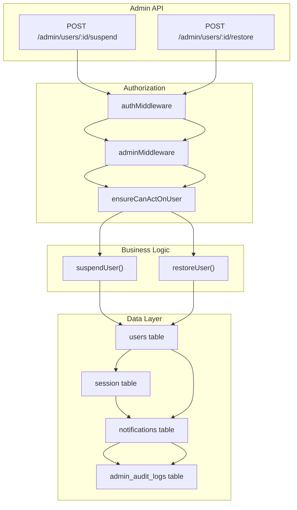
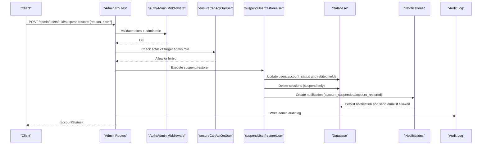
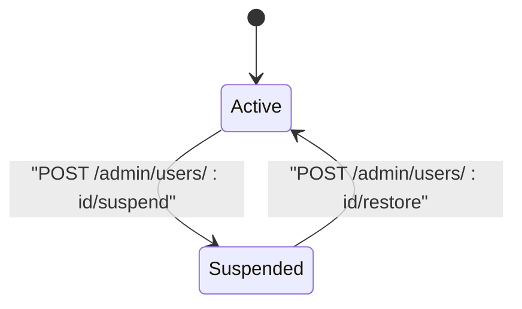
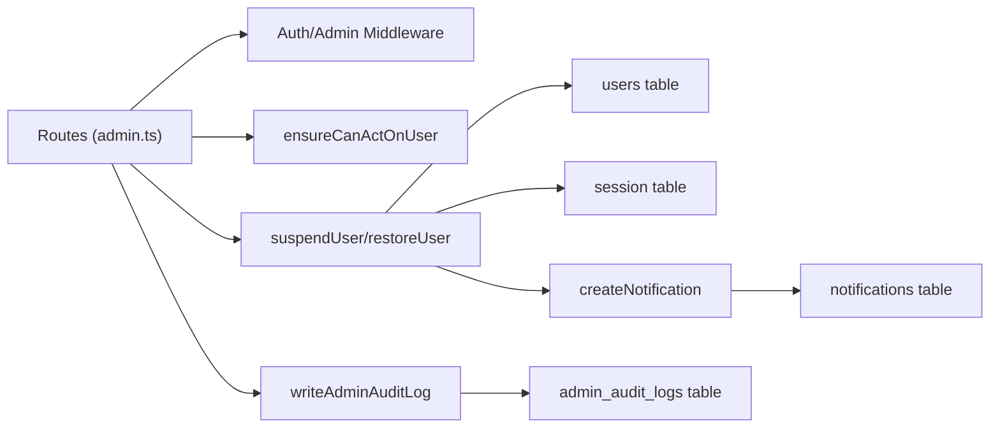

# User Suspension and Restoration

<cite>
**Referenced Files in This Document**
- [admin.ts](file://src/worker/routes/admin.ts)
- [notifications.ts](file://src/worker/lib/notifications.ts)
- [schema.ts](file://src/worker/db/schema.ts)
- [admin.ts](file://src/worker/lib/admin.ts)
- [http.ts](file://src/worker/lib/http.ts)
- [admin.ts](file://src/worker/middleware/admin.ts)
</cite>

## Table of Contents
1. [Introduction](#introduction)
2. [Project Structure](#project-structure)
3. [Core Components](#core-components)
4. [Architecture Overview](#architecture-overview)
5. [Detailed Component Analysis](#detailed-component-analysis)
6. [Dependency Analysis](#dependency-analysis)
7. [Performance Considerations](#performance-considerations)
8. [Troubleshooting Guide](#troubleshooting-guide)
9. [Conclusion](#conclusion)

## Introduction
This document provides detailed API documentation for user suspension and restoration workflows, focusing on the following endpoints:
- POST /admin/users/:id/suspend
- POST /admin/users/:id/restore

It explains request validation (including reason length constraints), authorization behavior via ensureCanActOnUser, automatic session termination during suspension, notification system integration, error handling, and complete state transitions between active and suspended account statuses.

## Project Structure
The relevant implementation is located in the worker layer:
- Routes and business logic for admin operations are defined in src/worker/routes/admin.ts
- Notification creation and email delivery are handled in src/worker/lib/notifications.ts
- Database schema definitions (users, sessions, notifications, audit logs) are in src/worker/db/schema.ts
- Admin utilities (audit logging and role helpers) are in src/worker/lib/admin.ts
- HTTP error helpers and Zod validation hook are in src/worker/lib/http.ts
- Authorization middleware for admin and owner roles is in src/worker/middleware/admin.ts

**Diagram sources**
- [admin.ts:85-86](file://src/worker/routes/admin.ts#L85-L86)
- [admin.ts:334-352](file://src/worker/routes/admin.ts#L334-L352)
- [admin.ts:514-529](file://src/worker/routes/admin.ts#L514-L529)
- [schema.ts:5-32](file://src/worker/db/schema.ts#L5-L32)
- [schema.ts:108-124](file://src/worker/db/schema.ts#L108-L124)
- [schema.ts:872-915](file://src/worker/db/schema.ts#L872-L915)
- [schema.ts:654-665](file://src/worker/db/schema.ts#L654-L665)

**Section sources**
- [admin.ts:85-86](file://src/worker/routes/admin.ts#L85-L86)
- [admin.ts:334-352](file://src/worker/routes/admin.ts#L334-L352)
- [admin.ts:514-529](file://src/worker/routes/admin.ts#L514-L529)
- [schema.ts:5-32](file://src/worker/db/schema.ts#L5-L32)
- [schema.ts:108-124](file://src/worker/db/schema.ts#L108-L124)
- [schema.ts:872-915](file://src/worker/db/schema.ts#L872-L915)
- [schema.ts:654-665](file://src/worker/db/schema.ts#L654-L665)

## Core Components
- Request validation schemas:
  - reasonSchema: string, trimmed, min 3 characters, max 500 characters
  - decisionSchema: object with required reason (per reasonSchema) and optional note (string, trimmed, max 1000 characters)
- Authorization:
  - authMiddleware ensures authenticated requests
  - adminMiddleware requires an admin role
  - ensureCanActOnUser prevents moderators from acting on administrators; owners have full access
- Business functions:
  - suspendUser updates user status to suspended, records reason/timestamps, deletes all sessions, and sends a notification
  - restoreUser sets user status back to active, clears suspension fields, and sends a notification
- Audit logging:
  - writeAdminAuditLog records actor, action, target type/id, reason, and metadata

**Section sources**
- [admin.ts:34-41](file://src/worker/routes/admin.ts#L34-L41)
- [admin.ts:79-83](file://src/worker/routes/admin.ts#L79-L83)
- [admin.ts:334-352](file://src/worker/routes/admin.ts#L334-L352)
- [admin.ts:514-529](file://src/worker/routes/admin.ts#L514-L529)
- [admin.ts:7-31](file://src/worker/lib/admin.ts#L7-L31)

## Architecture Overview
The suspension and restoration flows follow a consistent pattern:
1. Client sends a POST request with a JSON body validated by decisionSchema
2. Middleware enforces authentication and admin role
3. ensureCanActOnUser checks if the actor can act on the target user
4. The appropriate function (suspendUser or restoreUser) performs database updates and side effects
5. Notifications are created and optionally emailed based on preferences
6. An audit log entry is written for compliance and traceability

**Diagram sources**
- [admin.ts:85-86](file://src/worker/routes/admin.ts#L85-L86)
- [admin.ts:334-352](file://src/worker/routes/admin.ts#L334-L352)
- [admin.ts:514-529](file://src/worker/routes/admin.ts#L514-L529)
- [notifications.ts:153-234](file://src/worker/lib/notifications.ts#L153-L234)
- [admin.ts:7-31](file://src/worker/lib/admin.ts#L7-L31)

## Detailed Component Analysis

### API Endpoints

#### POST /admin/users/:id/suspend
- Purpose: Suspend a user account
- Authentication: Required (admin role)
- Authorization: Moderators cannot suspend administrators; owners can suspend any user
- Request body:
  - reason: string, trimmed, 3–500 characters (required)
  - note: string, trimmed, up to 1000 characters (optional)
- Response:
  - 200 OK: { accountStatus: "suspended" }
- Side effects:
  - Updates users.account_status to "suspended", sets suspension_reason, suspended_at, suspended_by
  - Deletes all sessions for the user
  - Creates a notification of type "account_suspended"
  - Writes an audit log entry with action "user_suspended"

**Section sources**
- [admin.ts:334-342](file://src/worker/routes/admin.ts#L334-L342)
- [admin.ts:514-521](file://src/worker/routes/admin.ts#L514-L521)
- [schema.ts:5-32](file://src/worker/db/schema.ts#L5-L32)
- [schema.ts:108-124](file://src/worker/db/schema.ts#L108-L124)
- [schema.ts:872-915](file://src/worker/db/schema.ts#L872-L915)
- [admin.ts:7-31](file://src/worker/lib/admin.ts#L7-L31)

#### POST /admin/users/:id/restore
- Purpose: Restore a previously suspended user account
- Authentication: Required (admin role)
- Authorization: Moderators cannot restore administrators; owners can restore any user
- Request body:
  - reason: string, trimmed, 3–500 characters (required)
  - note: string, trimmed, up to 1000 characters (optional)
- Response:
  - 200 OK: { accountStatus: "active" }
- Side effects:
  - Updates users.account_status to "active", clears suspension_reason, suspended_at, suspended_by
  - Creates a notification of type "account_restored"
  - Writes an audit log entry with action "user_restored"

**Section sources**
- [admin.ts:344-352](file://src/worker/routes/admin.ts#L344-L352)
- [admin.ts:523-529](file://src/worker/routes/admin.ts#L523-L529)
- [schema.ts:5-32](file://src/worker/db/schema.ts#L5-L32)
- [schema.ts:872-915](file://src/worker/db/schema.ts#L872-L915)
- [admin.ts:7-31](file://src/worker/lib/admin.ts#L7-L31)

### Validation and Error Handling
- Validation:
  - Zod schemas enforce reason length (3–500) and optional note length (up to 1000)
  - Invalid payloads return 422 with validation_failed code and details containing issues
- Errors:
  - Unauthorized: 401 unauthorized when not authenticated
  - Forbidden: 403 forbidden when missing admin role or moderator attempts to act on an administrator
  - Not Found: 404 not_found when target user does not exist
  - Conflict: 409 conflict for invalid state transitions (not used directly in these endpoints)
  - Internal Server Error: 500 internal_server_error for unexpected failures

**Section sources**
- [admin.ts:34-41](file://src/worker/routes/admin.ts#L34-L41)
- [http.ts:35-80](file://src/worker/lib/http.ts#L35-L80)
- [admin.ts:5-13](file://src/worker/middleware/admin.ts#L5-L13)
- [admin.ts:79-83](file://src/worker/routes/admin.ts#L79-L83)

### ensureCanActOnUser Behavior
- If the current actor has adminRole "owner", they can act on any user
- If the current actor has adminRole "moderator", they cannot act on users who have any admin role (owner or moderator)
- Returns a forbidden response when a moderator tries to act on an administrator

**Section sources**
- [admin.ts:75-83](file://src/worker/routes/admin.ts#L75-L83)
- [admin.ts:5-13](file://src/worker/middleware/admin.ts#L5-L13)

### Automatic Session Termination During Suspension
- On suspension, all existing sessions for the targeted user are deleted immediately
- This ensures the user cannot continue using the platform after suspension

**Section sources**
- [admin.ts:514-521](file://src/worker/routes/admin.ts#L514-L521)
- [schema.ts:108-124](file://src/worker/db/schema.ts#L108-L124)

### Notification System Integration
- Suspensions create a notification with type "account_suspended"
- Restorations create a notification with type "account_restored"
- Notifications respect user preferences; category "account" always allows email unless disabled globally
- forceEmail flag ensures emails are sent for critical account events
- Email delivery is attempted asynchronously; failures are recorded in email_status and email_error fields

**Section sources**
- [admin.ts:514-529](file://src/worker/routes/admin.ts#L514-L529)
- [notifications.ts:153-234](file://src/worker/lib/notifications.ts#L153-L234)
- [schema.ts:872-915](file://src/worker/db/schema.ts#L872-L915)

### State Transitions
- Active -> Suspended:
  - Triggered by POST /admin/users/:id/suspend
  - Sets account_status to "suspended", records suspension_reason, suspended_at, suspended_by
- Suspended -> Active:
  - Triggered by POST /admin/users/:id/restore
  - Clears suspension fields and sets account_status to "active"

**Diagram sources**
- [schema.ts:5-32](file://src/worker/db/schema.ts#L5-L32)
- [admin.ts:334-352](file://src/worker/routes/admin.ts#L334-L352)

## Dependency Analysis
The following diagram shows how components depend on each other during suspension and restoration:

**Diagram sources**
- [admin.ts:85-86](file://src/worker/routes/admin.ts#L85-L86)
- [admin.ts:334-352](file://src/worker/routes/admin.ts#L334-L352)
- [admin.ts:514-529](file://src/worker/routes/admin.ts#L514-L529)
- [notifications.ts:153-234](file://src/worker/lib/notifications.ts#L153-L234)
- [admin.ts:7-31](file://src/worker/lib/admin.ts#L7-L31)
- [schema.ts:5-32](file://src/worker/db/schema.ts#L5-L32)
- [schema.ts:108-124](file://src/worker/db/schema.ts#L108-L124)
- [schema.ts:872-915](file://src/worker/db/schema.ts#L872-L915)
- [schema.ts:654-665](file://src/worker/db/schema.ts#L654-L665)

**Section sources**
- [admin.ts:85-86](file://src/worker/routes/admin.ts#L85-L86)
- [admin.ts:334-352](file://src/worker/routes/admin.ts#L334-L352)
- [admin.ts:514-529](file://src/worker/routes/admin.ts#L514-L529)
- [notifications.ts:153-234](file://src/worker/lib/notifications.ts#L153-L234)
- [admin.ts:7-31](file://src/worker/lib/admin.ts#L7-L31)
- [schema.ts:5-32](file://src/worker/db/schema.ts#L5-L32)
- [schema.ts:108-124](file://src/worker/db/schema.ts#L108-L124)
- [schema.ts:872-915](file://src/worker/db/schema.ts#L872-L915)
- [schema.ts:654-665](file://src/worker/db/schema.ts#L654-L665)

## Performance Considerations
- Database operations are minimal and focused on single-row updates and deletions
- Notification creation uses dedupe keys to prevent duplicates and avoids redundant work
- Email sending is best-effort; failures are logged without blocking the main flow
- Audit logging is synchronous but lightweight; consider batching if high volume is expected

[No sources needed since this section provides general guidance]

## Troubleshooting Guide
Common errors and their causes:
- 422 validation_failed:
  - Reason too short (<3) or too long (>500)
  - Note exceeds 1000 characters
  - Missing required fields
- 401 unauthorized:
  - Missing or invalid authentication token
- 403 forbidden:
  - Missing admin role
  - Moderator attempting to act on an administrator
- 404 not_found:
  - Target user ID does not exist
- 500 internal_server_error:
  - Unexpected server-side failure

Resolution steps:
- Ensure request payload matches decisionSchema
- Verify the actor has appropriate admin privileges
- Confirm the target user exists and is accessible per policy
- Check notification email configuration and user preferences if emails are not delivered
- Review audit logs for traceability of actions taken

**Section sources**
- [http.ts:35-80](file://src/worker/lib/http.ts#L35-L80)
- [admin.ts:5-13](file://src/worker/middleware/admin.ts#L5-L13)
- [admin.ts:79-83](file://src/worker/routes/admin.ts#L79-L83)

## Conclusion
The suspension and restoration endpoints provide robust administrative controls over user accounts with strong validation, clear authorization rules, immediate session termination on suspension, integrated notifications, and comprehensive audit logging. These features ensure secure, auditable, and user-informed account management workflows.

[No sources needed since this section summarizes without analyzing specific files]