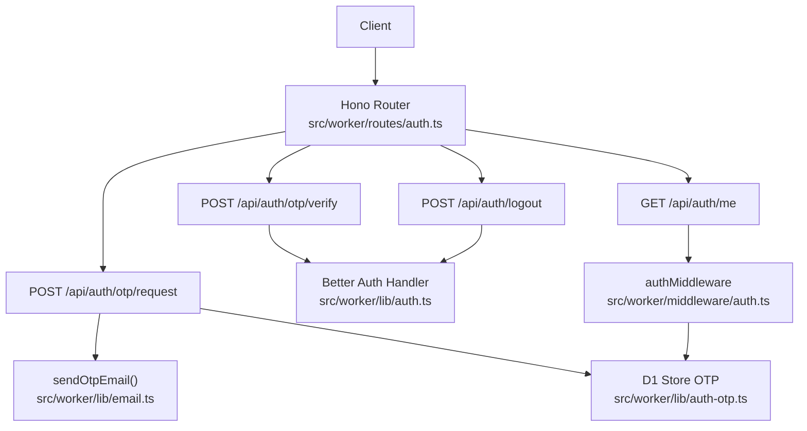
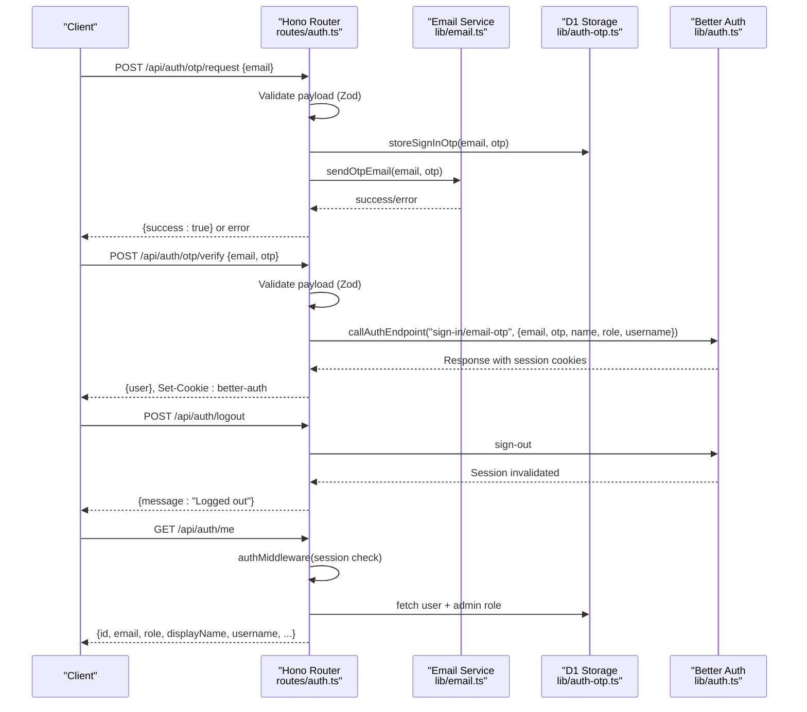
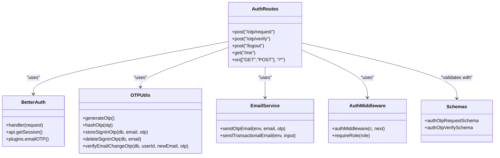

# Authentication API

<cite>
**Referenced Files in This Document**
- [auth.ts](file://src/worker/routes/auth.ts)
- [auth.ts](file://src/worker/lib/auth.ts)
- [auth-otp.ts](file://src/worker/lib/auth-otp.ts)
- [email.ts](file://src/worker/lib/email.ts)
- [schemas.ts](file://src/worker/lib/schemas.ts)
- [http.ts](file://src/worker/lib/http.ts)
- [middleware/auth.ts](file://src/worker/middleware/auth.ts)
- [schema.ts](file://src/worker/db/schema.ts)
- [0002_better_auth.sql](file://drizzle/0002_better_auth.sql)
- [settings.ts](file://src/worker/routes/settings.ts)
- [plans/002-throttle-otp-requests.md](file://plans/002-throttle-otp-requests.md)
</cite>

## Table of Contents
1. [Introduction](#introduction)
2. [Project Structure](#project-structure)
3. [Core Components](#core-components)
4. [Architecture Overview](#architecture-overview)
5. [Detailed Component Analysis](#detailed-component-analysis)
6. [Dependency Analysis](#dependency-analysis)
7. [Performance Considerations](#performance-considerations)
8. [Troubleshooting Guide](#troubleshooting-guide)
9. [Conclusion](#conclusion)
10. [Appendices](#appendices)

## Introduction
This document provides comprehensive API documentation for Zenith’s authentication endpoints. It covers the email OTP sign-in flow, session management, logout, and user profile retrieval. The system uses Better Auth with an email OTP plugin, Hono routes, Zod validation, and a middleware-based authentication layer. Password-based registration and login are disabled; all authentication is performed via email OTP codes.

## Project Structure
Authentication-related code is organized into:
- Routes: HTTP endpoints under src/worker/routes/auth.ts
- Better Auth configuration: src/worker/lib/auth.ts
- OTP utilities: src/worker/lib/auth-otp.ts
- Email delivery: src/worker/lib/email.ts
- Validation schemas: src/worker/lib/schemas.ts
- HTTP helpers and error responses: src/worker/lib/http.ts
- Middleware for authenticated requests: src/worker/middleware/auth.ts
- Database schema and migrations: src/worker/db/schema.ts and drizzle/0002_better_auth.sql
- Settings endpoints (password/email change): src/worker/routes/settings.ts
- Rate limiting plan: plans/002-throttle-otp-requests.md

**Diagram sources**
- [auth.ts:1-259](file://src/worker/routes/auth.ts#L1-L259)
- [auth.ts:1-80](file://src/worker/lib/auth.ts#L1-L80)
- [auth-otp.ts:1-124](file://src/worker/lib/auth-otp.ts#L1-L124)
- [email.ts:1-56](file://src/worker/lib/email.ts#L1-L56)
- [middleware/auth.ts:1-57](file://src/worker/middleware/auth.ts#L1-L57)

**Section sources**
- [auth.ts:1-259](file://src/worker/routes/auth.ts#L1-L259)
- [auth.ts:1-80](file://src/worker/lib/auth.ts#L1-L80)
- [auth-otp.ts:1-124](file://src/worker/lib/auth-otp.ts#L1-L124)
- [email.ts:1-56](file://src/worker/lib/email.ts#L1-L56)
- [schemas.ts:1-221](file://src/worker/lib/schemas.ts#L1-L221)
- [http.ts:1-80](file://src/worker/lib/http.ts#L1-L80)
- [middleware/auth.ts:1-57](file://src/worker/middleware/auth.ts#L1-L57)
- [schema.ts:1-200](file://src/worker/db/schema.ts#L1-L200)
- [0002_better_auth.sql:1-79](file://drizzle/0002_better_auth.sql#L1-L79)
- [settings.ts:137-179](file://src/worker/routes/settings.ts#L137-L179)
- [plans/002-throttle-otp-requests.md:1-164](file://plans/002-throttle-otp-requests.md#L1-L164)

## Core Components
- Better Auth integration: Configured with Drizzle adapter, email OTP plugin, and custom user fields mapping.
- OTP generation and storage: Secure hashing, attempt tracking, expiration handling.
- Email delivery: Cloudflare Email binding sends OTP messages.
- Validation: Zod schemas enforce request payloads.
- Middleware: Validates sessions and enriches context with user data.
- Error handling: Centralized JSON error responses with typed codes.

**Section sources**
- [auth.ts:1-80](file://src/worker/lib/auth.ts#L1-L80)
- [auth-otp.ts:1-124](file://src/worker/lib/auth-otp.ts#L1-L124)
- [email.ts:1-56](file://src/worker/lib/email.ts#L1-L56)
- [schemas.ts:1-221](file://src/worker/lib/schemas.ts#L1-L221)
- [middleware/auth.ts:1-57](file://src/worker/middleware/auth.ts#L1-L57)
- [http.ts:1-80](file://src/worker/lib/http.ts#L1-L80)

## Architecture Overview
The authentication architecture combines Hono routes with Better Auth and D1 storage:
- POST /api/auth/otp/request validates input, stores OTP, and sends email.
- POST /api/auth/otp/verify validates OTP, calls Better Auth to create a session, and returns a legacy-compatible user object with cookies.
- POST /api/auth/logout delegates to Better Auth to invalidate the session.
- GET /api/auth/me retrieves current user details using middleware-authenticated session.

**Diagram sources**
- [auth.ts:135-249](file://src/worker/routes/auth.ts#L135-L249)
- [auth.ts:1-80](file://src/worker/lib/auth.ts#L1-L80)
- [auth-otp.ts:67-73](file://src/worker/lib/auth-otp.ts#L67-L73)
- [email.ts:45-56](file://src/worker/lib/email.ts#L45-L56)
- [middleware/auth.ts:23-50](file://src/worker/middleware/auth.ts#L23-L50)

## Detailed Component Analysis

### Endpoints

#### POST /api/auth/otp/request
- Purpose: Request a one-time password (OTP) for sign-in.
- Method: POST
- URL: /api/auth/otp/request
- Headers:
  - Content-Type: application/json
- Body Schema (Zod):
  - email: string, trimmed, lowercased, valid email format
- Behavior:
  - Validates account status (suspended accounts are rejected).
  - Generates a secure 6-digit OTP.
  - Stores hashed OTP with expiration and attempt counter in verification table.
  - Sends OTP via email service.
  - On email failure, deletes stored OTP and returns a specific error.
- Success Response:
  - Status: 200
  - Body: { success: true }
- Errors:
  - 403 account_suspended: Account is suspended.
  - 503 otp_email_unavailable: Email delivery failed.
- Notes:
  - Password-based register/login endpoints are disabled and return 400 password_auth_disabled.

**Section sources**
- [auth.ts:135-164](file://src/worker/routes/auth.ts#L135-L164)
- [auth-otp.ts:26-73](file://src/worker/lib/auth-otp.ts#L26-L73)
- [email.ts:45-56](file://src/worker/lib/email.ts#L45-L56)
- [schemas.ts:13-15](file://src/worker/lib/schemas.ts#L13-L15)
- [http.ts:23-33](file://src/worker/lib/http.ts#L23-L33)

#### POST /api/auth/otp/verify
- Purpose: Verify OTP and establish a session.
- Method: POST
- URL: /api/auth/otp/verify
- Headers:
  - Content-Type: application/json
- Body Schema (Zod):
  - email: string, trimmed, lowercased, valid email format
  - otp: string, exactly 6 digits
- Behavior:
  - Validates account status (suspended accounts are rejected).
  - Calls Better Auth sign-in endpoint with normalized user fields.
  - Returns a legacy-compatible user object and sets session cookie.
  - Maps Better Auth errors to standardized codes.
- Success Response:
  - Status: 200
  - Body: { id, email, role, displayName, username }
  - Cookie: Set-Cookie: better-auth
- Errors:
  - 400 invalid_otp: Invalid or expired OTP.
  - 403 too_many_otp_attempts: Too many incorrect attempts.
  - 403 account_suspended: Account is suspended.

**Section sources**
- [auth.ts:168-212](file://src/worker/routes/auth.ts#L168-L212)
- [auth.ts:1-80](file://src/worker/lib/auth.ts#L1-L80)
- [schemas.ts:17-23](file://src/worker/lib/schemas.ts#L17-L23)
- [http.ts:23-33](file://src/worker/lib/http.ts#L23-L33)

#### POST /api/auth/logout
- Purpose: Invalidate the current session.
- Method: POST
- URL: /api/auth/logout
- Headers:
  - Authorization: Not required (session validated via cookie)
  - Content-Type: application/json
- Behavior:
  - Requires active session via middleware.
  - Delegates to Better Auth sign-out.
- Success Response:
  - Status: 200
  - Body: { message: "Logged out" }
- Errors:
  - 401 unauthorized: No active session.

**Section sources**
- [auth.ts:216-220](file://src/worker/routes/auth.ts#L216-L220)
- [middleware/auth.ts:23-50](file://src/worker/middleware/auth.ts#L23-L50)

#### GET /api/auth/me
- Purpose: Retrieve current user profile information.
- Method: GET
- URL: /api/auth/me
- Headers:
  - Cookie: Required (session cookie from Better Auth)
- Behavior:
  - Requires active session via middleware.
  - Fetches user details and optional admin role from database.
- Success Response:
  - Status: 200
  - Body: { id, email, role, displayName, username, tagline, avatarUrl, socialLinks, adminRole }
- Errors:
  - 401 unauthorized: No active session.
  - 404 not_found: User not found.

**Section sources**
- [auth.ts:224-249](file://src/worker/routes/auth.ts#L224-L249)
- [middleware/auth.ts:23-50](file://src/worker/middleware/auth.ts#L23-L50)
- [schema.ts:5-32](file://src/worker/db/schema.ts#L5-L32)

### Better Auth Integration Patterns
- Configuration:
  - Base URL and secret configured per environment.
  - Drizzle adapter maps to SQLite schema.
  - Email OTP plugin configured with length, expiry, allowed attempts, and custom storage hashing.
- User Fields:
  - Mapping between Better Auth fields and custom user schema (displayName, avatarUrl, etc.).
  - Additional fields include role, username, tagline, socialLinks.
- Native Endpoints:
  - Better Auth native endpoints are proxied except blocked paths to prevent bypassing security controls.

**Section sources**
- [auth.ts:9-77](file://src/worker/lib/auth.ts#L9-L77)
- [auth.ts:253-258](file://src/worker/routes/auth.ts#L253-L258)

### Middleware-Based Authentication
- authMiddleware:
  - Validates session using Better Auth getSession.
  - Loads user data including role and account status.
  - Rejects suspended accounts with 403 account_suspended.
  - Attaches user object to context for downstream handlers.
- requireRole:
  - Role-based access control middleware for subscriber/creator roles.

**Section sources**
- [middleware/auth.ts:23-56](file://src/worker/middleware/auth.ts#L23-L56)

### Email OTP Flow Details
- OTP Generation:
  - Cryptographically secure random number generation.
  - 6-digit numeric code.
- Storage:
  - Hashed OTP stored with attempt counter and expiration timestamp.
  - Identifier format includes email for uniqueness.
- Verification:
  - Constant-time comparison prevents timing attacks.
  - Attempt counting and cleanup on expiration or success.

**Section sources**
- [auth-otp.ts:26-124](file://src/worker/lib/auth-otp.ts#L26-L124)

### Security Considerations
- Password Authentication Disabled:
  - Legacy register/login endpoints return 400 password_auth_disabled.
- Account Suspension:
  - Suspended accounts are blocked throughout the flow.
- OTP Security:
  - SHA-256 hashing with base64url encoding.
  - Constant-time comparison for resistance against timing attacks.
  - Expiration after 5 minutes with maximum 3 attempts.
- Session Management:
  - Better Auth handles session creation, validation, and cleanup.
  - Cookies set securely by Better Auth.
- Rate Limiting:
  - Planned implementation for throttling OTP requests per email fingerprint and IP address.

**Section sources**
- [auth.ts:129-131](file://src/worker/routes/auth.ts#L129-L131)
- [auth-otp.ts:5-7](file://src/worker/lib/auth-otp.ts#L5-L7)
- [plans/002-throttle-otp-requests.md:65-99](file://plans/002-throttle-otp-requests.md#L65-L99)

### Error Codes and Responses
Standardized error response format:
- Status codes: 400, 401, 403, 404, 409, 413, 415, 422, 500, 503
- Error body structure:
  - { error: { code, message, details? } }
- Common codes:
  - password_auth_disabled: Password authentication is not available
  - account_suspended: Account has been suspended
  - invalid_otp: OTP is invalid or expired
  - too_many_otp_attempts: Too many incorrect OTP attempts
  - otp_email_unavailable: Email delivery service unavailable
  - rate_limited: Request rate limit exceeded (planned)

**Section sources**
- [http.ts:4-33](file://src/worker/lib/http.ts#L4-L33)
- [auth.ts:96-103](file://src/worker/routes/auth.ts#L96-L103)
- [plans/002-throttle-otp-requests.md:94-96](file://plans/002-throttle-otp-requests.md#L94-L96)

### Password Policies and Account Recovery
- Password Policy:
  - Password authentication is completely disabled in favor of email OTP.
  - Legacy password endpoints return appropriate error codes.
- Account Recovery:
  - Email OTP serves as the primary authentication mechanism.
  - Email change requires OTP verification through settings endpoints.

**Section sources**
- [auth.ts:129-131](file://src/worker/routes/auth.ts#L129-L131)
- [settings.ts:137-144](file://src/worker/routes/settings.ts#L137-L144)

### Multi-Factor Authentication
- Current Implementation:
  - Email OTP serves as the sole authentication factor.
  - No additional MFA factors implemented.
- Future Considerations:
  - Rate limiting for OTP requests planned to prevent abuse.
  - Potential for additional verification steps in future enhancements.

**Section sources**
- [auth.ts:27-37](file://src/worker/lib/auth.ts#L27-L37)
- [plans/002-throttle-otp-requests.md:65-99](file://plans/002-throttle-otp-requests.md#L65-L99)

## Dependency Analysis

**Diagram sources**
- [auth.ts:1-259](file://src/worker/routes/auth.ts#L1-L259)
- [auth.ts:1-80](file://src/worker/lib/auth.ts#L1-L80)
- [auth-otp.ts:1-124](file://src/worker/lib/auth-otp.ts#L1-L124)
- [email.ts:1-56](file://src/worker/lib/email.ts#L1-L56)
- [middleware/auth.ts:1-57](file://src/worker/middleware/auth.ts#L1-L57)
- [schemas.ts:13-23](file://src/worker/lib/schemas.ts#L13-L23)

**Section sources**
- [auth.ts:1-259](file://src/worker/routes/auth.ts#L1-L259)
- [auth.ts:1-80](file://src/worker/lib/auth.ts#L1-L80)
- [auth-otp.ts:1-124](file://src/worker/lib/auth-otp.ts#L1-L124)
- [email.ts:1-56](file://src/worker/lib/email.ts#L1-L56)
- [middleware/auth.ts:1-57](file://src/worker/middleware/auth.ts#L1-L57)
- [schemas.ts:1-221](file://src/worker/lib/schemas.ts#L1-L221)

## Performance Considerations
- Database Operations:
  - Minimal queries per request for optimal performance.
  - Indexed columns for user lookups and session management.
- Email Delivery:
  - Asynchronous email sending to avoid blocking request processing.
  - Fallback error handling for email service unavailability.
- Session Management:
  - Efficient session validation through Better Auth.
  - Cached user data in middleware to reduce database load.
- Rate Limiting:
  - Planned implementation will prevent abuse without impacting legitimate users.

[No sources needed since this section provides general guidance]

## Troubleshooting Guide

### Common Issues and Solutions
- **Invalid OTP**: Ensure OTP is exactly 6 digits and hasn't expired (5-minute window).
- **Too Many Attempts**: Wait before retrying if you've exceeded the 3-attempt limit.
- **Account Suspended**: Contact support if your account has been suspended.
- **Email Delivery Failed**: Check email service configuration and try again later.
- **Session Issues**: Clear browser cookies and retry the authentication flow.

### Debugging Tips
- Verify request payloads match expected schemas.
- Check response status codes and error messages.
- Ensure proper headers (Content-Type, Cookie) are set.
- Monitor server logs for detailed error information.

**Section sources**
- [auth.ts:168-212](file://src/worker/routes/auth.ts#L168-L212)
- [http.ts:23-33](file://src/worker/lib/http.ts#L23-L33)

## Conclusion
Zenith's authentication system provides a secure, modern approach to user authentication using email OTP codes. The integration with Better Auth ensures robust session management while maintaining flexibility for future enhancements. The middleware-based architecture enables consistent authentication across all protected endpoints, and the centralized error handling provides clear feedback to clients.

[No sources needed since this section summarizes without analyzing specific files]

## Appendices

### Database Schema Reference
Key tables involved in authentication:
- users: Core user information and authentication state
- session: Better Auth session management
- verification: OTP storage and validation
- account: Provider-specific account information

**Section sources**
- [schema.ts:5-32](file://src/worker/db/schema.ts#L5-L32)
- [schema.ts:107-165](file://src/worker/db/schema.ts#L107-L165)
- [0002_better_auth.sql:9-53](file://drizzle/0002_better_auth.sql#L9-L53)

### Rate Limiting Implementation Plan
Planned rate limiting strategy:
- Per-email fingerprint: 3 requests per 60 seconds
- Per-IP address: 10 requests per 60 seconds
- Privacy-preserving implementation using SHA-256 fingerprints
- Early rejection before database writes or email sending

**Section sources**
- [plans/002-throttle-otp-requests.md:65-99](file://plans/002-throttle-otp-requests.md#L65-L99)