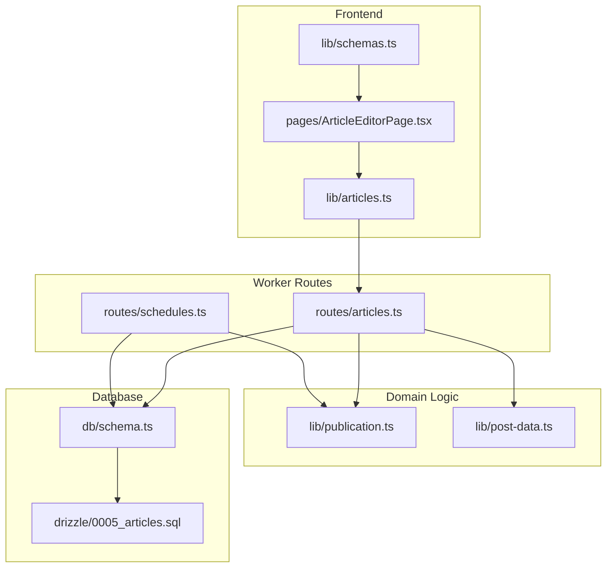
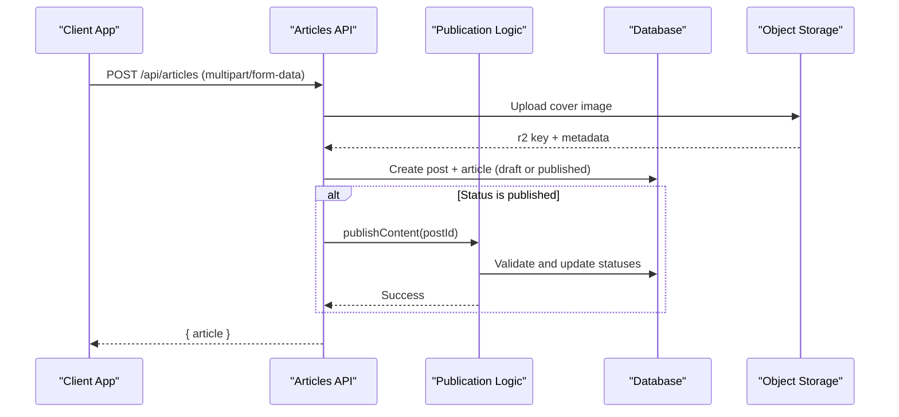
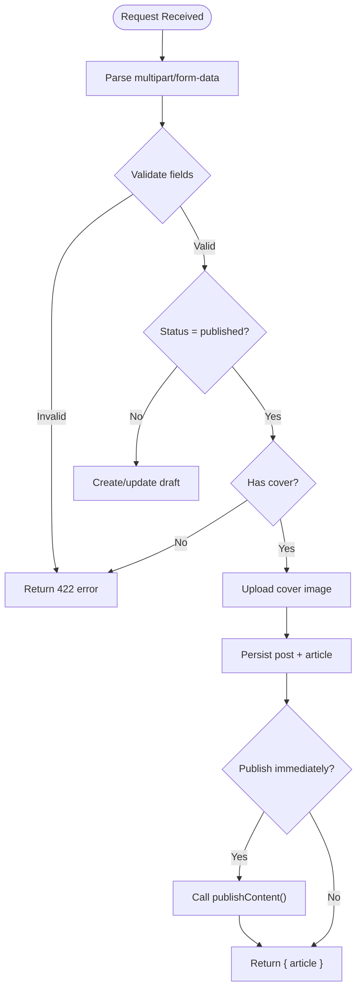
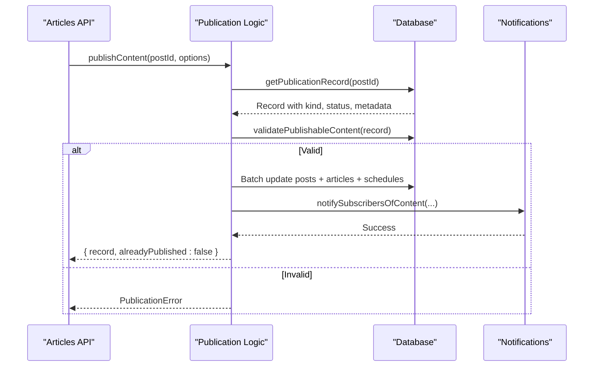
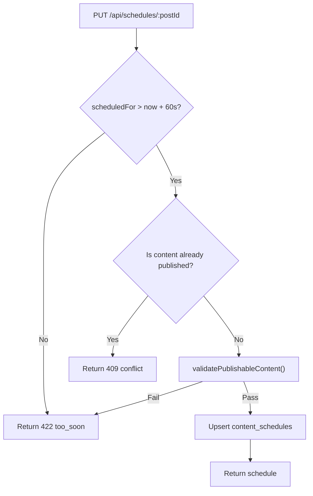
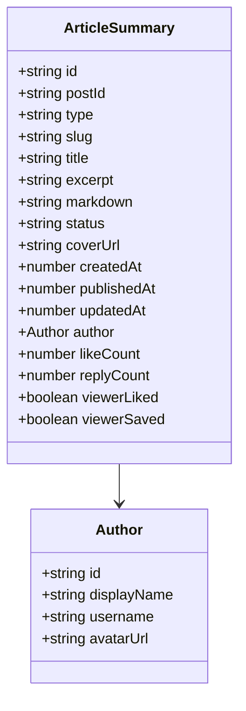
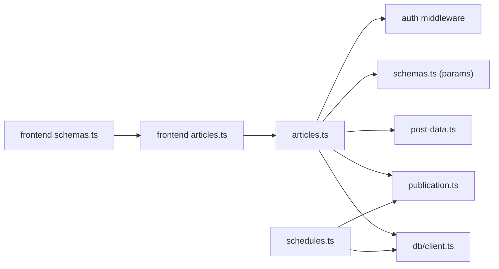

# Articles API

<cite>
**Referenced Files in This Document**
- [articles.ts](file://src/worker/routes/articles.ts)
- [schema.ts](file://src/worker/db/schema.ts)
- [publication.ts](file://src/worker/lib/publication.ts)
- [post-data.ts](file://src/worker/lib/post-data.ts)
- [schedules.ts](file://src/worker/routes/schedules.ts)
- [articles.ts (frontend)](file://src/react-app/lib/articles.ts)
- [schemas.ts (frontend)](file://src/react-app/lib/schemas.ts)
- [ArticleEditorPage.tsx](file://src/react-app/pages/ArticleEditorPage.tsx)
- [0005_articles.sql](file://drizzle/0005_articles.sql)
</cite>

## Table of Contents
1. [Introduction](#introduction)
2. [Project Structure](#project-structure)
3. [Core Components](#core-components)
4. [Architecture Overview](#architecture-overview)
5. [Detailed Component Analysis](#detailed-component-analysis)
6. [Dependency Analysis](#dependency-analysis)
7. [Performance Considerations](#performance-considerations)
8. [Troubleshooting Guide](#troubleshooting-guide)
9. [Conclusion](#conclusion)
10. [Appendices](#appendices)

## Introduction
This document provides comprehensive API documentation for the Articles API endpoints used to create, edit, publish, and manage long-form content. It covers HTTP methods, request/response formats, validation rules, cover image handling, rich text (Markdown), publication status control (draft vs published), scheduling workflows, moderation integration, and relationships with posts. It also includes practical examples for creating articles with Markdown content, uploading cover images, and scheduling publication.

## Project Structure
The Articles feature spans server routes, data models, publishing logic, and frontend integrations:
- Server routes define the REST endpoints for article CRUD and publishing.
- Data models define the database schema for posts and articles, including indexes and constraints.
- Publishing logic centralizes validation and state transitions for content publication.
- Frontend libraries and pages provide client-side APIs and UI for authoring and scheduling.



**Diagram sources**
- [articles.ts:1-456](file://src/worker/routes/articles.ts#L1-L456)
- [schedules.ts:1-295](file://src/worker/routes/schedules.ts#L1-L295)
- [publication.ts:1-273](file://src/worker/lib/publication.ts#L1-L273)
- [post-data.ts:1-350](file://src/worker/lib/post-data.ts#L1-L350)
- [schema.ts:168-231](file://src/worker/db/schema.ts#L168-L231)
- [0005_articles.sql:1-22](file://drizzle/0005_articles.sql#L1-L22)
- [articles.ts (frontend):1-71](file://src/react-app/lib/articles.ts#L1-L71)
- [schemas.ts (frontend):157-190](file://src/react-app/lib/schemas.ts#L157-L190)
- [ArticleEditorPage.tsx:1-336](file://src/react-app/pages/ArticleEditorPage.tsx#L1-L336)

**Section sources**
- [articles.ts:1-456](file://src/worker/routes/articles.ts#L1-L456)
- [schema.ts:168-231](file://src/worker/db/schema.ts#L168-L231)
- [publication.ts:1-273](file://src/worker/lib/publication.ts#L1-L273)
- [post-data.ts:1-350](file://src/worker/lib/post-data.ts#L1-L350)
- [schedules.ts:1-295](file://src/worker/routes/schedules.ts#L1-L295)
- [articles.ts (frontend):1-71](file://src/react-app/lib/articles.ts#L1-L71)
- [schemas.ts (frontend):157-190](file://src/react-app/lib/schemas.ts#L157-L190)
- [ArticleEditorPage.tsx:1-336](file://src/react-app/pages/ArticleEditorPage.tsx#L1-L336)
- [0005_articles.sql:1-22](file://drizzle/0005_articles.sql#L1-L22)

## Core Components
- Article creation and editing via multipart/form-data payloads containing title, excerpt, markdown, status, and optional cover image.
- Publication workflow that validates content and updates both post-level and article-level records.
- Cover image upload and retrieval through a dedicated endpoint.
- Scheduling system for delayed publication with retry and cancellation support.
- Moderation checks integrated into read/edit/publish flows.

Key responsibilities:
- Route handlers parse and validate requests, enforce authorization, and orchestrate DB operations.
- Publication library centralizes validation and state transitions across content types.
- Post utilities provide media URL helpers and access checks.
- Frontend schemas ensure consistent client-side validation aligned with server rules.

**Section sources**
- [articles.ts:86-131](file://src/worker/routes/articles.ts#L86-L131)
- [publication.ts:113-195](file://src/worker/lib/publication.ts#L113-L195)
- [post-data.ts:100-133](file://src/worker/lib/post-data.ts#L100-L133)
- [schedules.ts:170-224](file://src/worker/routes/schedules.ts#L170-L224)
- [schemas.ts (frontend):157-190](file://src/react-app/lib/schemas.ts#L157-L190)

## Architecture Overview
The Articles API follows a layered architecture:
- Client layer constructs FormData and calls REST endpoints.
- Worker routes handle authentication, validation, and business logic.
- Domain logic enforces publication rules and interacts with storage and notifications.
- Database layer persists posts and articles with appropriate indexes.



**Diagram sources**
- [articles.ts:215-260](file://src/worker/routes/articles.ts#L215-L260)
- [publication.ts:197-272](file://src/worker/lib/publication.ts#L197-L272)
- [post-data.ts:133-144](file://src/worker/lib/post-data.ts#L133-L144)

**Section sources**
- [articles.ts:215-331](file://src/worker/routes/articles.ts#L215-L331)
- [publication.ts:197-272](file://src/worker/lib/publication.ts#L197-L272)

## Detailed Component Analysis

### Articles Endpoints
- Create Article
  - Method: POST
  - Path: /api/articles
  - Auth: Creator role required
  - Content-Type: multipart/form-data
  - Fields:
    - title: string (max 140)
    - excerpt: string (max 280)
    - markdown: string (max 50,000)
    - status: "draft" | "published"
    - cover: File (JPEG/PNG/WebP, max 5 MB)
  - Validation:
    - Draft requires at least title or markdown.
    - Published requires title, markdown, and cover.
  - Behavior:
    - Creates a post record and an article record.
    - If status is "published", triggers publication flow.
  - Response:
    - 201 Created with { article }

- Update Article
  - Method: PATCH
  - Path: /api/articles/:postId
  - Auth: Creator role required; owner check enforced
  - Content-Type: multipart/form-data
  - Fields: Same as create
  - Validation:
    - Prevents edits if moderated or schedule processing
    - Requires cover when transitioning to published without existing cover
  - Behavior:
    - Updates post body and article fields
    - Preserves publishedAt if already published
    - Triggers publication if transitioning from draft to published
  - Response:
    - 200 OK with { article }

- Publish Article
  - Method: POST
  - Path: /api/articles/:postId/publish
  - Auth: Creator role required; owner check enforced
  - Behavior:
    - Validates publishability and updates statuses atomically
  - Response:
    - 200 OK with { article }

- Get Article by ID
  - Method: GET
  - Path: /api/articles/:postId
  - Auth: Required
  - Access Control:
    - Enforces moderation and membership visibility
  - Response:
    - 200 OK with { article, replies }

- Get Article by Username and Slug
  - Method: GET
  - Path: /api/articles/by-slug/:username/:slug
  - Auth: Required
  - Access Control:
    - Filters by kind=article, active moderation, active account
  - Response:
    - 200 OK with { article, replies }

- Get Cover Image
  - Method: GET
  - Path: /api/articles/:postId/cover
  - Auth: Required
  - Access Control:
    - Enforces same visibility rules as article
  - Response:
    - 200 OK with image bytes and headers



**Diagram sources**
- [articles.ts:86-131](file://src/worker/routes/articles.ts#L86-L131)
- [articles.ts:215-260](file://src/worker/routes/articles.ts#L215-L260)
- [publication.ts:197-272](file://src/worker/lib/publication.ts#L197-L272)

**Section sources**
- [articles.ts:215-415](file://src/worker/routes/articles.ts#L215-L415)

### Data Models and Relationships
- Posts table stores common metadata for all content types, including kind, slug, body, moderation status, and publishedAt.
- Articles table extends posts with title, excerpt, markdown, status, cover metadata, and timestamps.
- Indexes optimize queries by status, publishedAt, and author relationships.

```mermaid
erDiagram
USERS {
text id PK
text username UK
text display_name
text avatar_url
text account_status
}
POSTS {
text id PK
text author_id FK
text kind
text slug
text body
text moderation_status
integer published_at
integer created_at
}
ARTICLES {
text post_id PK FK
text title
text excerpt
text markdown
text status
text cover_r2_key
text cover_file_name
text cover_content_type
integer cover_size_bytes
integer published_at
integer created_at
integer updated_at
}
CONTENT_SCHEDULES {
text post_id PK FK
text creator_id FK
text status
integer scheduled_for
integer next_attempt_at
integer attempt_count
integer revision
integer published_at
integer created_at
integer updated_at
}
USERS ||--o{ POSTS : author
POSTS ||--|| ARTICLES : has_article
POSTS ||--o{ CONTENT_SCHEDULES : scheduled
```

**Diagram sources**
- [schema.ts:168-231](file://src/worker/db/schema.ts#L168-L231)
- [0005_articles.sql:1-22](file://drizzle/0005_articles.sql#L1-L22)

**Section sources**
- [schema.ts:168-231](file://src/worker/db/schema.ts#L168-L231)
- [0005_articles.sql:1-22](file://drizzle/0005_articles.sql#L1-L22)

### Publication Workflow
- Centralized validation ensures content meets requirements before publication.
- Atomic updates maintain consistency across posts and articles tables.
- Notifications are sent to subscribers upon successful publication.



**Diagram sources**
- [publication.ts:197-272](file://src/worker/lib/publication.ts#L197-L272)
- [publication.ts:113-195](file://src/worker/lib/publication.ts#L113-L195)

**Section sources**
- [publication.ts:113-272](file://src/worker/lib/publication.ts#L113-L272)

### Scheduling System
- Creators can schedule articles for future publication.
- Supports rescheduling, retry on failure, cancel, and immediate publish.
- Integrates with moderation and validation checks.



**Diagram sources**
- [schedules.ts:170-224](file://src/worker/routes/schedules.ts#L170-L224)
- [publication.ts:113-195](file://src/worker/lib/publication.ts#L113-L195)

**Section sources**
- [schedules.ts:170-224](file://src/worker/routes/schedules.ts#L170-L224)

### Frontend Integration
- Client library provides typed functions for creating, updating, and publishing articles.
- Form schemas enforce validation rules matching server expectations.
- Editor page supports Markdown editing, cover upload, and scheduling dialog.



**Diagram sources**
- [articles.ts (frontend):5-28](file://src/react-app/lib/articles.ts#L5-L28)

**Section sources**
- [articles.ts (frontend):1-71](file://src/react-app/lib/articles.ts#L1-L71)
- [schemas.ts (frontend):157-190](file://src/react-app/lib/schemas.ts#L157-L190)
- [ArticleEditorPage.tsx:79-108](file://src/react-app/pages/ArticleEditorPage.tsx#L79-L108)

## Dependency Analysis
- Articles routes depend on:
  - Authentication middleware for role enforcement
  - Schema validators for parameter validation
  - Post utilities for media URLs and access checks
  - Publication library for validation and state transitions
  - Database client for queries and mutations
- Schedules routes depend on publication logic and shared schema definitions.
- Frontend depends on API client utilities and form schemas.



**Diagram sources**
- [articles.ts:1-28](file://src/worker/routes/articles.ts#L1-L28)
- [schedules.ts:1-25](file://src/worker/routes/schedules.ts#L1-L25)
- [articles.ts (frontend):1-10](file://src/react-app/lib/articles.ts#L1-L10)

**Section sources**
- [articles.ts:1-28](file://src/worker/routes/articles.ts#L1-L28)
- [schedules.ts:1-25](file://src/worker/routes/schedules.ts#L1-L25)
- [articles.ts (frontend):1-10](file://src/react-app/lib/articles.ts#L1-L10)

## Performance Considerations
- Use batched database operations for atomic updates during publication.
- Leverage indexes on frequently queried columns (status, publishedAt, authorId).
- Implement caching strategies for cover images with appropriate cache-control headers.
- Minimize payload sizes by excluding markdown in list responses where not needed.
- Optimize query patterns by selecting only required fields and using joins efficiently.

[No sources needed since this section provides general guidance]

## Troubleshooting Guide
Common issues and resolutions:
- Validation errors: Ensure all required fields are present and meet length/type constraints.
- Unauthorized access: Verify user role and ownership permissions.
- Moderation blocks: Check moderation status and restore content if necessary.
- Schedule conflicts: Avoid concurrent modifications while schedule is processing.
- Cover image failures: Validate file type and size limits.

**Section sources**
- [articles.ts:106-131](file://src/worker/routes/articles.ts#L106-L131)
- [publication.ts:113-195](file://src/worker/lib/publication.ts#L113-L195)
- [schedules.ts:170-224](file://src/worker/routes/schedules.ts#L170-L224)

## Conclusion
The Articles API provides a robust foundation for managing long-form content with comprehensive validation, secure access controls, and flexible publication workflows. The integration with scheduling and moderation systems ensures reliable content delivery while maintaining high standards for data integrity and user experience.

[No sources needed since this section summarizes without analyzing specific files]

## Appendices

### API Examples

#### Create Article with Markdown and Cover
```http
POST /api/articles
Content-Type: multipart/form-data

title=Understanding%20React%20Hooks&excerpt=Learn%20the%20basics&markdown=%23%20React%20Hooks%0A%0A%23%23%20useState%0A%0AExample%20code...&status=published&cover=@cover.jpg
```

Response:
```json
{
  "article": {
    "id": "abc123",
    "postId": "def456",
    "type": "article",
    "slug": "understanding-react-hooks",
    "title": "Understanding React Hooks",
    "excerpt": "Learn the basics",
    "markdown": "# React Hooks\n\n## useState\n\nExample code...",
    "status": "published",
    "coverUrl": "/api/articles/def456/cover",
    "createdAt": 1700000000,
    "publishedAt": 1700000000,
    "updatedAt": 1700000000,
    "author": {
      "id": "user123",
      "displayName": "John Doe",
      "username": "johndoe",
      "avatarUrl": "https://example.com/avatar.jpg"
    },
    "likeCount": 0,
    "replyCount": 0,
    "viewerLiked": false,
    "viewerSaved": false
  }
}
```

#### Schedule Article Publication
```http
PUT /api/schedules/def456
Content-Type: application/json

{
  "scheduledFor": "2024-12-25T10:00:00Z"
}
```

Response:
```json
{
  "schedule": {
    "postId": "def456",
    "contentType": "article",
    "title": "Understanding React Hooks",
    "status": "pending",
    "scheduledFor": 1735113600,
    "nextAttemptAt": 1735113600,
    "attemptCount": 0,
    "revision": 1,
    "failure": null
  }
}
```

**Section sources**
- [articles.ts:215-260](file://src/worker/routes/articles.ts#L215-L260)
- [schedules.ts:170-224](file://src/worker/routes/schedules.ts#L170-L224)