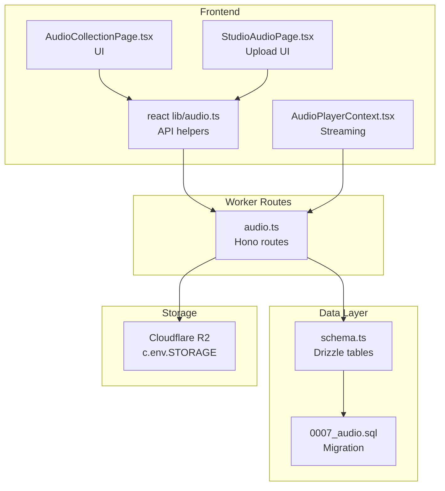
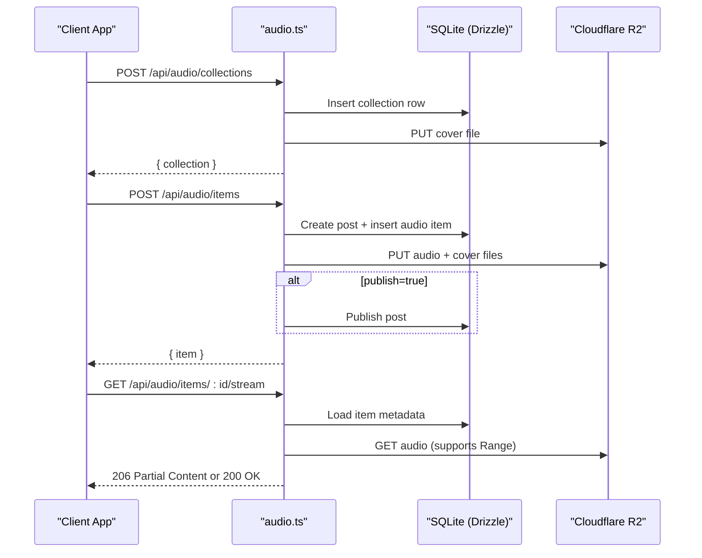
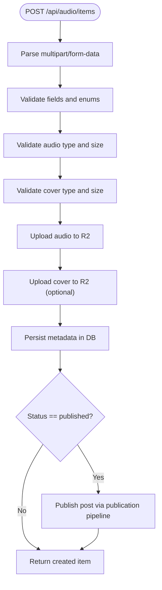
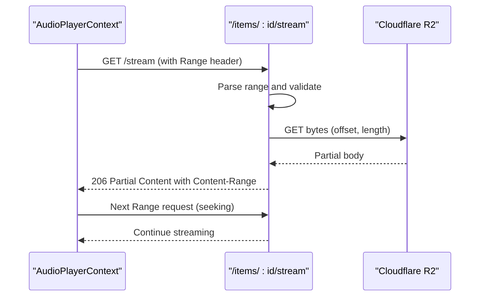
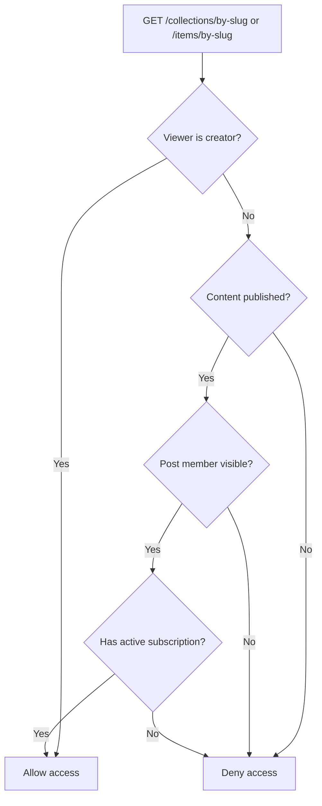
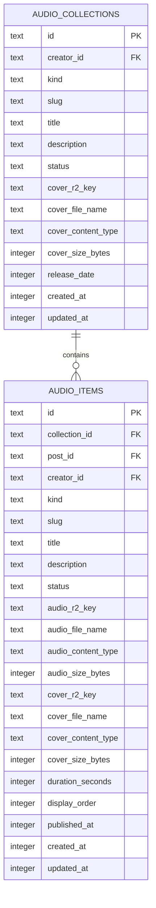
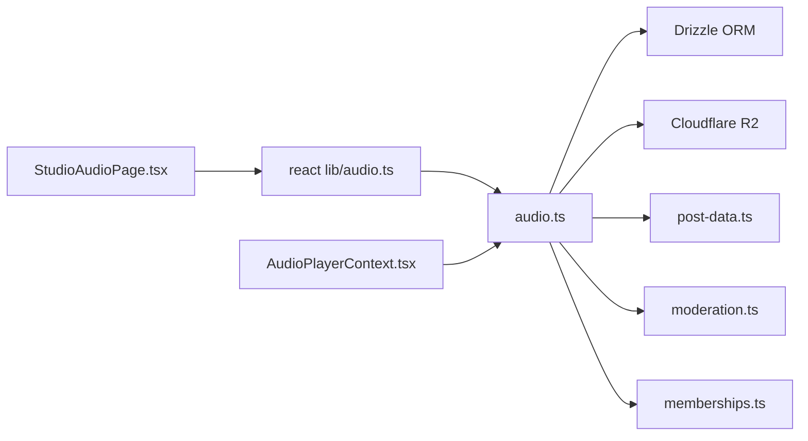

# Audio Collections API

<cite>
**Referenced Files in This Document**
- [audio.ts](file://src/worker/routes/audio.ts)
- [post-data.ts](file://src/worker/lib/post-data.ts)
- [schema.ts](file://src/worker/db/schema.ts)
- [0007_audio.sql](file://drizzle/0007_audio.sql)
- [audio.ts](file://src/react-app/lib/audio.ts)
- [AudioCollectionPage.tsx](file://src/react-app/pages/AudioCollectionPage.tsx)
- [AudioPlayerContext.tsx](file://src/react-app/context/AudioPlayerContext.tsx)
- [StudioAudioPage.tsx](file://src/react-app/pages/StudioAudioPage.tsx)
</cite>

## Table of Contents
1. [Introduction](#introduction)
2. [Project Structure](#project-structure)
3. [Core Components](#core-components)
4. [Architecture Overview](#architecture-overview)
5. [Detailed Component Analysis](#detailed-component-analysis)
6. [Dependency Analysis](#dependency-analysis)
7. [Performance Considerations](#performance-considerations)
8. [Troubleshooting Guide](#troubleshooting-guide)
9. [Conclusion](#conclusion)
10. [Appendices](#appendices)

## Introduction
This document provides comprehensive API documentation for the Audio Collections API. It covers endpoints for creating and managing audio collections (albums and podcasts), uploading and processing audio files, metadata management, playback streaming, thumbnail generation, progress tracking via scheduling, and subscription-based access control. The API integrates with Cloudflare R2 storage for durable object storage and supports range requests for efficient streaming.

## Project Structure
The Audio Collections feature is implemented as a Hono route module that exposes REST endpoints under /api/audio. Data models are defined using Drizzle ORM and persisted to SQLite. Frontend utilities provide typed client functions and React Query hooks for consuming the API.

**Diagram sources**
- [audio.ts:1-32](file://src/worker/routes/audio.ts#L1-L32)
- [schema.ts:234-291](file://src/worker/db/schema.ts#L234-L291)
- [0007_audio.sql:1-58](file://drizzle/0007_audio.sql#L1-L58)
- [audio.ts:121-147](file://src/react-app/lib/audio.ts#L121-L147)
- [AudioCollectionPage.tsx:1-111](file://src/react-app/pages/AudioCollectionPage.tsx#L1-L111)
- [AudioPlayerContext.tsx:135-276](file://src/react-app/context/AudioPlayerContext.tsx#L135-L276)
- [StudioAudioPage.tsx:62-618](file://src/react-app/pages/StudioAudioPage.tsx#L62-L618)

**Section sources**
- [audio.ts:1-32](file://src/worker/routes/audio.ts#L1-L32)
- [schema.ts:234-291](file://src/worker/db/schema.ts#L234-L291)
- [0007_audio.sql:1-58](file://drizzle/0007_audio.sql#L1-L58)

## Core Components
- Audio Collections: Represent albums or podcasts with metadata, status, cover image, and release date.
- Audio Items: Represent tracks or podcast episodes linked to a collection, with audio file, optional cover, duration, and ordering.
- Streaming Endpoint: Serves audio with HTTP Range support for progressive playback.
- Cover Endpoints: Serve collection and item cover images with appropriate caching headers.
- Access Control: Enforces creator ownership, moderation, and subscription-based access.

Key supported audio formats include MP3, M4A, WAV, OGG, and WebM. Image formats for covers include JPEG, PNG, and WebP.

**Section sources**
- [audio.ts:148-157](file://src/worker/routes/audio.ts#L148-L157)
- [post-data.ts:18-20](file://src/worker/lib/post-data.ts#L18-L20)
- [post-data.ts:108-118](file://src/worker/lib/post-data.ts#L108-L118)

## Architecture Overview
The API follows a layered architecture:
- Route handlers parse multipart form data, validate inputs, and orchestrate business logic.
- Storage operations write files to Cloudflare R2 and persist metadata to the database.
- Read endpoints enforce access control and return serialized JSON responses.
- Streaming endpoint handles byte-range requests for efficient playback.

**Diagram sources**
- [audio.ts:511-537](file://src/worker/routes/audio.ts#L511-L537)
- [audio.ts:591-656](file://src/worker/routes/audio.ts#L591-L656)
- [audio.ts:895-929](file://src/worker/routes/audio.ts#L895-L929)

## Detailed Component Analysis

### Audio Collections Endpoints
- GET /api/audio/collections/mine
  - Purpose: List collections owned by the authenticated creator; optional kind filter.
  - Auth: Requires creator role.
  - Response: Array of collection summaries with item counts.
- POST /api/audio/collections
  - Purpose: Create a new collection (album or podcast).
  - Body: multipart/form-data with fields kind, title, description, status, releaseDate, cover.
  - Validation: Title length, status enum, cover type and size.
  - Response: Created collection summary.
- PATCH /api/audio/collections/:collectionId
  - Purpose: Update collection metadata and optionally replace cover.
  - Validation: Kind cannot be changed; published requires cover if not already present.
  - Response: Updated collection summary.
- DELETE /api/audio/collections/:collectionId
  - Purpose: Delete an empty collection; deletes associated cover from R2.
  - Error: Conflict if items exist.
- PUT /api/audio/collections/:collectionId/order
  - Purpose: Reorder items within a collection by setting displayOrder.
  - Body: JSON { itemIds: string[] }.
  - Validation: Must include all items exactly once; no concurrent publishing.
- GET /api/audio/collections/by-slug/:username/:slug
  - Purpose: Fetch collection detail and its published items with access checks.
  - Response: Collection summary and list of items.
- GET /api/audio/collections/:collectionId/cover
  - Purpose: Stream collection cover image with private caching.
  - Access: Enforced via canReadCollection.

**Section sources**
- [audio.ts:480-509](file://src/worker/routes/audio.ts#L480-L509)
- [audio.ts:511-537](file://src/worker/routes/audio.ts#L511-L537)
- [audio.ts:539-568](file://src/worker/routes/audio.ts#L539-L568)
- [audio.ts:570-589](file://src/worker/routes/audio.ts#L570-L589)
- [audio.ts:737-768](file://src/worker/routes/audio.ts#L737-L768)
- [audio.ts:770-806](file://src/worker/routes/audio.ts#L770-L806)
- [audio.ts:831-847](file://src/worker/routes/audio.ts#L831-L847)

### Audio Items Endpoints
- POST /api/audio/items
  - Purpose: Add a track or episode to a collection.
  - Body: multipart/form-data with fields collectionId, title, description, status, durationSeconds, audio, cover.
  - Validation: Status enums, required fields when published, cover fallback rules.
  - Response: Created item summary with streamUrl and coverUrl.
- PATCH /api/audio/items/:itemId
  - Purpose: Update item metadata, replace audio/cover, manage publish state.
  - Validation: Cannot move between collections; prevents editing moderated content; preserves publishedAt when remains published.
  - Response: Updated item summary.
- DELETE /api/audio/items/:itemId
  - Purpose: Delete an item and associated media from R2.
  - Access: Prevents deletion of moderated content until restored.
- GET /api/audio/items/by-slug/:username/:slug
  - Purpose: Fetch item detail with replies and post extras.
  - Access: Enforced via canReadItem.
- GET /api/audio/items/:itemId/cover
  - Purpose: Stream item cover image; falls back to collection cover if none provided.
- GET /api/audio/items/:itemId/stream
  - Purpose: Stream audio with Range support for seeking and buffering.
  - Headers: Accept-Ranges, Content-Range on partial responses, private cache.

**Section sources**
- [audio.ts:591-656](file://src/worker/routes/audio.ts#L591-L656)
- [audio.ts:658-717](file://src/worker/routes/audio.ts#L658-L717)
- [audio.ts:719-735](file://src/worker/routes/audio.ts#L719-L735)
- [audio.ts:808-829](file://src/worker/routes/audio.ts#L808-L829)
- [audio.ts:849-869](file://src/worker/routes/audio.ts#L849-L869)
- [audio.ts:895-929](file://src/worker/routes/audio.ts#L895-L929)

### File Upload and Processing Workflow
- Form parsing enforces multipart/form-data and validates fields.
- Audio validation checks MIME types against allowed set and size limits.
- Cover validation ensures supported image types and size constraints.
- Files are uploaded to Cloudflare R2 with deterministic keys and HTTP metadata.
- Database rows store R2 keys and file metadata for retrieval and streaming.
- Publishing workflow creates posts and triggers publication with validation.

**Diagram sources**
- [audio.ts:159-170](file://src/worker/routes/audio.ts#L159-L170)
- [audio.ts:209-249](file://src/worker/routes/audio.ts#L209-L249)
- [audio.ts:264-288](file://src/worker/routes/audio.ts#L264-L288)
- [audio.ts:591-656](file://src/worker/routes/audio.ts#L591-L656)

### Streaming and Playback Controls
- The streaming endpoint supports HTTP Range requests for seeking and partial downloads.
- Clients receive proper Content-Range and Accept-Ranges headers.
- Private caching is enabled to protect content visibility.
- Frontend player context manages queue, playback state, volume, and seek operations.

**Diagram sources**
- [audio.ts:871-893](file://src/worker/routes/audio.ts#L871-L893)
- [audio.ts:895-929](file://src/worker/routes/audio.ts#L895-L929)
- [AudioPlayerContext.tsx:135-276](file://src/react-app/context/AudioPlayerContext.tsx#L135-L276)

### Subscription-Based Access Control
- Access to collections and items is enforced based on:
  - Creator identity
  - Published status
  - Moderation status
  - Subscription membership entitlement
- hasCreatorAccess checks active subscriptions for the viewer against the creator.
- isPostMemberVisible ensures post-level moderation and visibility.

**Diagram sources**
- [audio.ts:461-474](file://src/worker/routes/audio.ts#L461-L474)
- [post-data.ts:84-98](file://src/worker/lib/post-data.ts#L84-L98)

### Data Models and Schema
- audio_collections: Stores collection metadata, cover info, status, and timestamps.
- audio_items: Stores item metadata, audio and cover references, duration, order, and timestamps.
- Indexes optimize queries by creator, kind, status, and ordering.

**Diagram sources**
- [schema.ts:234-291](file://src/worker/db/schema.ts#L234-L291)
- [0007_audio.sql:1-58](file://drizzle/0007_audio.sql#L1-L58)

**Section sources**
- [schema.ts:234-291](file://src/worker/db/schema.ts#L234-L291)
- [0007_audio.sql:1-58](file://drizzle/0007_audio.sql#L1-L58)

## Dependency Analysis
- Route handlers depend on:
  - Drizzle ORM for database queries and schema definitions.
  - Cloudflare R2 for object storage via c.env.STORAGE.
  - Post utilities for URL generation and post extras.
  - Moderation and membership utilities for access control.
- Frontend depends on:
  - Typed API helpers for consistent request/response handling.
  - React Query for caching and background updates.
  - Audio player context for playback state and controls.

**Diagram sources**
- [audio.ts:1-31](file://src/worker/routes/audio.ts#L1-L31)
- [post-data.ts:108-118](file://src/worker/lib/post-data.ts#L108-L118)
- [audio.ts:121-147](file://src/react-app/lib/audio.ts#L121-L147)
- [AudioPlayerContext.tsx:135-276](file://src/react-app/context/AudioPlayerContext.tsx#L135-L276)
- [StudioAudioPage.tsx:62-618](file://src/react-app/pages/StudioAudioPage.tsx#L62-L618)

**Section sources**
- [audio.ts:1-31](file://src/worker/routes/audio.ts#L1-L31)
- [post-data.ts:108-118](file://src/worker/lib/post-data.ts#L108-L118)
- [audio.ts:121-147](file://src/react-app/lib/audio.ts#L121-L147)

## Performance Considerations
- Use Range requests to minimize bandwidth and enable fast seeking.
- Cache covers with short-lived private cache headers to reduce repeated fetches.
- Batch post extras loading to avoid N+1 queries.
- Avoid moving items between collections in update endpoints to prevent expensive migrations.
- Enforce size limits to prevent large uploads from impacting performance.

[No sources needed since this section provides general guidance]

## Troubleshooting Guide
Common errors and resolutions:
- Unsupported media type: Ensure audio MIME types are within allowed set; verify client sends correct content-type.
- Payload too large: Reduce file sizes below maximum limits.
- Validation failed: Check required fields and enums; ensure published status includes necessary assets.
- Schedule processing: Wait until scheduled publishing completes before editing or deleting.
- Moderated content: Editing/deleting blocked until moderation restores content.

**Section sources**
- [audio.ts:148-157](file://src/worker/routes/audio.ts#L148-L157)
- [audio.ts:209-249](file://src/worker/routes/audio.ts#L209-L249)
- [audio.ts:668-670](file://src/worker/routes/audio.ts#L668-L670)
- [audio.ts:725-728](file://src/worker/routes/audio.ts#L725-L728)

## Conclusion
The Audio Collections API provides a robust system for managing audio content with secure storage, streaming, and access control. It supports both album and podcast workflows, integrates seamlessly with Cloudflare R2, and offers a clear frontend integration path through typed helpers and React Query. Proper validation, error handling, and performance optimizations ensure reliable operation at scale.

[No sources needed since this section summarizes without analyzing specific files]

## Appendices

### API Examples

- Create a collection (album)
  - Method: POST /api/audio/collections
  - Content-Type: multipart/form-data
  - Fields: kind=album, title, description, status=draft|published, releaseDate (optional), cover (image)
  - Response: { collection: AudioCollectionSummary }

- Upload a track to a collection
  - Method: POST /api/audio/items
  - Content-Type: multipart/form-data
  - Fields: collectionId, title, description, status=draft|published, durationSeconds (optional), audio (MP3/M4A/WAV/OGG/WebM), cover (optional)
  - Response: { item: AudioItemSummary }

- Stream audio
  - Method: GET /api/audio/items/:itemId/stream
  - Optional Header: Range: bytes=start-end
  - Response: 200 OK or 206 Partial Content with audio bytes

- Play a collection
  - Method: GET /api/audio/collections/by-slug/:username/:slug
  - Response: { collection: AudioCollectionSummary, items: AudioItemSummary[] }

- Reorder items
  - Method: PUT /api/audio/collections/:collectionId/order
  - Body: { itemIds: ["id1","id2",...] }
  - Response: { ok: true }

[No sources needed since this section lists examples without analyzing specific files]