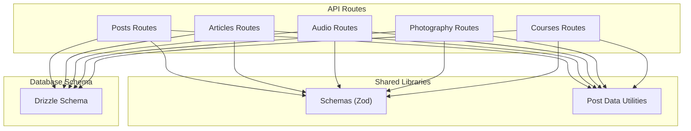
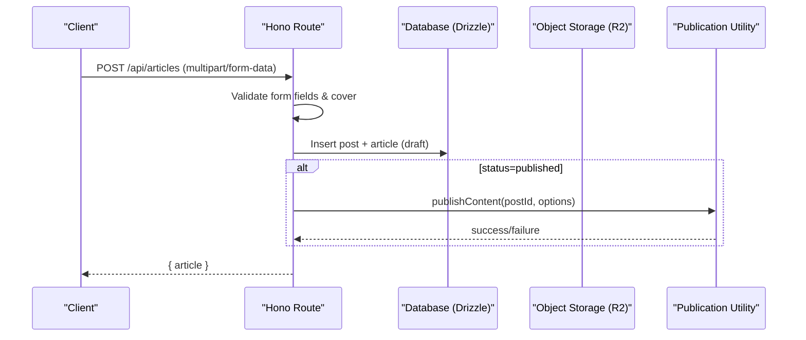

# Content APIs

<cite>
**Referenced Files in This Document**
- [posts.ts](file://src/worker/routes/posts.ts)
- [articles.ts](file://src/worker/routes/articles.ts)
- [audio.ts](file://src/worker/routes/audio.ts)
- [photography.ts](file://src/worker/routes/photography.ts)
- [courses.ts](file://src/worker/routes/courses.ts)
- [schema.ts](file://src/worker/db/schema.ts)
- [schemas.ts](file://src/worker/lib/schemas.ts)
- [post-data.ts](file://src/worker/lib/post-data.ts)
</cite>

## Table of Contents
1. [Introduction](#introduction)
2. [Project Structure](#project-structure)
3. [Core Components](#core-components)
4. [Architecture Overview](#architecture-overview)
5. [Detailed Component Analysis](#detailed-component-analysis)
6. [Dependency Analysis](#dependency-analysis)
7. [Performance Considerations](#performance-considerations)
8. [Troubleshooting Guide](#troubleshooting-guide)
9. [Conclusion](#conclusion)
10. [Appendices](#appendices)

## Introduction
This document provides comprehensive API documentation for content management endpoints across posts, articles, audio collections and items, photography albums and photos, and course creation/editing workflows. It specifies HTTP methods, URL patterns, request/response schemas, file upload handling, media processing, validation rules, markdown support, rich text formatting, scheduling, versioning/drafts, publication workflows, relationships, tagging systems (polls), and metadata management.

## Project Structure
The content APIs are implemented as Hono routes under src/worker/routes with shared utilities in src/worker/lib and database schema definitions in src/worker/db/schema.ts. Each content type has its own route module:
- Posts: short-form posts, replies, polls, and media attachments
- Articles: long-form markdown content with cover images
- Audio: collections (albums/podcasts) and items (music/podcast episodes)
- Photography: albums and photos with preview/original assets
- Courses: structured modules and lessons with large file uploads and streaming



**Diagram sources**
- [posts.ts:1-64](file://src/worker/routes/posts.ts#L1-L64)
- [articles.ts:1-30](file://src/worker/routes/articles.ts#L1-L30)
- [audio.ts:1-33](file://src/worker/routes/audio.ts#L1-L33)
- [photography.ts:1-32](file://src/worker/routes/photography.ts#L1-L32)
- [courses.ts:1-33](file://src/worker/routes/courses.ts#L1-L33)
- [schemas.ts:1-67](file://src/worker/lib/schemas.ts#L1-L67)
- [post-data.ts:1-43](file://src/worker/lib/post-data.ts#L1-L43)
- [schema.ts:168-200](file://src/worker/db/schema.ts#L168-L200)

**Section sources**
- [posts.ts:1-64](file://src/worker/routes/posts.ts#L1-L64)
- [articles.ts:1-30](file://src/worker/routes/articles.ts#L1-L30)
- [audio.ts:1-33](file://src/worker/routes/audio.ts#L1-L33)
- [photography.ts:1-32](file://src/worker/routes/photography.ts#L1-L32)
- [courses.ts:1-33](file://src/worker/routes/courses.ts#L1-L33)
- [schema.ts:168-200](file://src/worker/db/schema.ts#L168-L200)
- [schemas.ts:1-67](file://src/worker/lib/schemas.ts#L1-L67)
- [post-data.ts:1-43](file://src/worker/lib/post-data.ts#L1-L43)

## Core Components
- Posts: Create, edit, delete draft posts; schedule publishing; attach multiple images; create polls; like/save; reply to posts; retrieve by slug; media download endpoint.
- Articles: Create/update drafts or publish directly; require title and markdown; optional excerpt; cover image upload; publish endpoint; read by id or username/slug; cover streaming.
- Audio: Manage collections (album/podcast) and items (music/podcast episode); upload covers and audio files; stream audio with range requests; order items within collection; read by username/slug.
- Photography: Manage albums and photos; upload previews and originals; set cover photo; enable downloads; order photos; stream preview/original with access control; read by username/slug.
- Courses: Create/update/unpublish courses; manage modules and lessons; multipart upload for large video/audio/file attachments; stream attachments with range; track lesson progress; read by username/slug.

Key cross-cutting concerns:
- Authentication and role checks via middleware
- Validation using Zod schemas
- Media storage via R2-compatible storage
- Publication workflow through a centralized publishContent utility
- Scheduling via contentSchedules table

**Section sources**
- [posts.ts:397-542](file://src/worker/routes/posts.ts#L397-L542)
- [articles.ts:215-260](file://src/worker/routes/articles.ts#L215-L260)
- [audio.ts:511-537](file://src/worker/routes/audio.ts#L511-L537)
- [photography.ts:463-500](file://src/worker/routes/photography.ts#L463-L500)
- [courses.ts:376-396](file://src/worker/routes/courses.ts#L376-L396)
- [schema.ts:168-200](file://src/worker/db/schema.ts#L168-L200)

## Architecture Overview
The API follows a layered architecture:
- Route handlers parse and validate requests
- Business logic interacts with the database via Drizzle ORM
- Media is uploaded/downloaded via environment storage (R2-like)
- Publication and scheduling are handled by shared libraries



**Diagram sources**
- [articles.ts:215-260](file://src/worker/routes/articles.ts#L215-L260)
- [schema.ts:168-200](file://src/worker/db/schema.ts#L168-L200)

**Section sources**
- [articles.ts:215-260](file://src/worker/routes/articles.ts#L215-L260)
- [schema.ts:168-200](file://src/worker/db/schema.ts#L168-L200)

## Detailed Component Analysis

### Posts API
- Endpoints:
  - POST /api/posts (create draft or scheduled post; supports multipart/form-data and JSON)
  - PATCH /api/posts/:postId (edit draft only; supports removing attachments)
  - DELETE /api/posts/:postId (delete draft only)
  - GET /api/posts/by-slug/:username/:slug (read published post with replies)
  - GET /api/posts/:postId/replies (list replies)
  - POST /api/posts/:postId/replies (create reply with optional parent and images)
  - POST /api/posts/:postId/like (toggle like)
  - DELETE /api/posts/:postId/like (remove like)
  - GET /api/media/:attachmentId (download post/reply attachment)
  - GET /api/posts/drafts/:postId (get draft post details)
  - GET /api/posts/moderated/mine (list moderated hidden posts for creator)

- Request schemas:
  - Multipart form fields: body, images[], pollQuestion, pollOptions (JSON), scheduledFor (ISO datetime)
  - JSON body: { body, scheduledFor? }
  - Reply JSON: { body, parentReplyId? }
  - Poll vote JSON: { optionId }

- Response schemas:
  - Post: { id, slug, body, createdAt, publishedAt, schedule? }
  - Post detail: { post, replies[] }
  - Like state: { likeCount, viewerLiked }
  - Reply: { id, postId, parentReplyId?, body, createdAt, editedAt, deletedAt, isDeleted, viewerCanManage, author?, mentionedUser?, attachments[], likeCount, viewerLiked }

- Validation rules:
  - Post body length ≤ 500 chars
  - Images: JPEG/PNG/WebP, max 5 MB each, up to 4 images
  - Poll: question required if present; 2–4 options; lengths validated
  - Schedule: must be at least 1 minute in future
  - Replies: 1–2000 chars; optional parent reply ID

- File upload handling:
  - Images stored under posts/{postId}/{id}.{ext}
  - Attachments recorded in post_attachments with r2 key, filename, contentType, sizeBytes, displayOrder

- Publishing and scheduling:
  - If scheduledFor provided, insert into contentSchedules; otherwise publish immediately
  - Draft-only editing/deleting enforced

- Relationships and metadata:
  - Likes, saves, replies, polls, attachments linked to post
  - Creator access checked via membership entitlement

- Example flows:
  - Create post with images and poll: POST /api/posts with multipart form
  - Edit draft and remove some attachments: PATCH /api/posts/:postId with removeAttachmentIds
  - Schedule post: include scheduledFor in request

**Section sources**
- [posts.ts:397-542](file://src/worker/routes/posts.ts#L397-L542)
- [posts.ts:545-636](file://src/worker/routes/posts.ts#L545-L636)
- [posts.ts:638-678](file://src/worker/routes/posts.ts#L638-L678)
- [posts.ts:680-775](file://src/worker/routes/posts.ts#L680-L775)
- [posts.ts:777-815](file://src/worker/routes/posts.ts#L777-L815)
- [posts.ts:817-887](file://src/worker/routes/posts.ts#L817-L887)
- [posts.ts:889-965](file://src/worker/routes/posts.ts#L889-L965)
- [posts.ts:967-1028](file://src/worker/routes/posts.ts#L967-L1028)
- [schemas.ts:25-67](file://src/worker/lib/schemas.ts#L25-L67)
- [post-data.ts:18-43](file://src/worker/lib/post-data.ts#L18-L43)
- [schema.ts:168-200](file://src/worker/db/schema.ts#L168-L200)

### Articles API
- Endpoints:
  - POST /api/articles (create article; multipart/form-data only)
  - PATCH /api/articles/:postId (update article; multipart/form-data only)
  - POST /api/articles/:postId/publish (publish draft article)
  - GET /api/articles/by-slug/:username/:slug (read published article with replies)
  - GET /api/articles/:postId (read article by id with replies)
  - GET /api/articles/:postId/cover (stream cover image)

- Request schemas:
  - Multipart fields: title, excerpt?, markdown, status (draft|published), cover (image)
  - Validation enforces title ≤ 140 chars, excerpt ≤ 280 chars, markdown ≤ 50k chars
  - Published requires cover image

- Response schemas:
  - Article: { id, postId, type, slug, title, excerpt, markdown, status, coverUrl, createdAt, publishedAt, updatedAt, author, likeCount, replyCount, viewerLiked, viewerSaved }
  - Cover stream returns image bytes with appropriate headers

- Markdown support:
  - Full markdown body supported; excerpt auto-generated from markdown when not provided

- Publishing workflow:
  - Direct publish on create/update or explicit publish endpoint
  - Uses publishContent utility; handles moderation/account status errors

- File upload handling:
  - Cover images stored under articles/{postId}/cover-{uuid}.{ext}
  - Allowed types: JPEG/PNG/WebP; max 5 MB

- Access control:
  - Member visibility checks; creator access via membership entitlement

- Example flows:
  - Create draft article: POST /api/articles with title, markdown, status=draft
  - Publish article: PATCH with status=published and cover; or POST /api/articles/:postId/publish

**Section sources**
- [articles.ts:215-260](file://src/worker/routes/articles.ts#L215-L260)
- [articles.ts:262-314](file://src/worker/routes/articles.ts#L262-L314)
- [articles.ts:316-331](file://src/worker/routes/articles.ts#L316-L331)
- [articles.ts:333-380](file://src/worker/routes/articles.ts#L333-L380)
- [articles.ts:382-415](file://src/worker/routes/articles.ts#L382-L415)
- [articles.ts:1-34](file://src/worker/routes/articles.ts#L1-L34)
- [post-data.ts:104-106](file://src/worker/lib/post-data.ts#L104-L106)

### Audio API
- Endpoints:
  - GET /api/audio/collections/mine (list creator’s collections)
  - POST /api/audio/collections (create album/podcast)
  - PATCH /api/audio/collections/:collectionId (update collection)
  - DELETE /api/audio/collections/:collectionId (delete empty collection)
  - POST /api/audio/items (add music/podcast episode)
  - PATCH /api/audio/items/:itemId (update item)
  - DELETE /api/audio/items/:itemId (delete item)
  - PUT /api/audio/collections/:collectionId/order (reorder items)
  - GET /api/audio/collections/by-slug/:username/:slug (read collection with items)
  - GET /api/audio/items/by-slug/:username/:slug (read single item)
  - GET /api/audio/collections/:collectionId/cover (stream cover)
  - GET /api/audio/items/:itemId/cover (stream item cover)
  - GET /api/audio/items/:itemId/stream (stream audio with range)

- Request schemas:
  - Collection form: kind (album|podcast), title, description?, status (draft|published), releaseDate?, cover (image)
  - Item form: collectionId, title, description?, status (draft|published), durationSeconds?, audio (file), cover (image)
  - Order update: { itemIds: string[] }

- Response schemas:
  - Collection: { id, type, kind, slug, title, description, status, coverUrl, releaseDate, createdAt, updatedAt, itemCount, creator }
  - Item: { id, postId, type, kind, slug, title, description, status, streamUrl, coverUrl, durationSeconds, displayOrder, createdAt, publishedAt, updatedAt, collection, author, likeCount, replyCount, viewerLiked, viewerSaved }

- Validation rules:
  - Title limits: collection ≤ 140, item ≤ 160; descriptions ≤ 1000
  - Audio types: MP3/M4A/WAV/OGG/WebM; max 90 MB
  - Cover images: JPEG/PNG/WebP; max 5 MB
  - Published items require audio and cover (item or collection cover)

- File upload handling:
  - Collection cover: audio/collections/{id}/cover-{uuid}.{ext}
  - Item audio: audio/items/{id}/source-{uuid}.{ext}
  - Item cover: audio/items/{id}/cover-{uuid}.{ext}

- Streaming:
  - Range requests supported for audio streaming; returns 206 partial content

- Ordering:
  - Reorder items within a collection; validates permutation completeness

- Access control:
  - Creator ownership checks; member visibility; creator access via membership entitlement

- Example flows:
  - Create podcast collection: POST /api/audio/collections with kind=podcast, title, cover
  - Add episode: POST /api/audio/items with collectionId, title, audio, cover
  - Stream episode: GET /api/audio/items/:itemId/stream with Range header

**Section sources**
- [audio.ts:480-537](file://src/worker/routes/audio.ts#L480-L537)
- [audio.ts:539-568](file://src/worker/routes/audio.ts#L539-L568)
- [audio.ts:570-589](file://src/worker/routes/audio.ts#L570-L589)
- [audio.ts:591-656](file://src/worker/routes/audio.ts#L591-L656)
- [audio.ts:658-717](file://src/worker/routes/audio.ts#L658-L717)
- [audio.ts:719-735](file://src/worker/routes/audio.ts#L719-L735)
- [audio.ts:737-768](file://src/worker/routes/audio.ts#L737-L768)
- [audio.ts:770-806](file://src/worker/routes/audio.ts#L770-L806)
- [audio.ts:808-829](file://src/worker/routes/audio.ts#L808-L829)
- [audio.ts:831-869](file://src/worker/routes/audio.ts#L831-L869)
- [audio.ts:895-929](file://src/worker/routes/audio.ts#L895-L929)
- [post-data.ts:108-118](file://src/worker/lib/post-data.ts#L108-L118)

### Photography API
- Endpoints:
  - GET /api/photography/albums/mine (list creator’s albums)
  - POST /api/photography/albums (create album draft)
  - PATCH /api/photography/albums/:albumId (update album; cannot publish without photos)
  - DELETE /api/photography/albums/:albumId (delete empty album)
  - POST /api/photography/albums/:albumId/photos (batch upload previews and originals)
  - PATCH /api/photography/photos/:photoId (update photo metadata/files)
  - DELETE /api/photography/photos/:photoId (delete photo)
  - PUT /api/photography/albums/:albumId/order (reorder photos)
  - GET /api/photography/albums/by-slug/:username/:slug (read album with photos)
  - GET /api/photography/photos/:photoId/preview (stream preview)
  - GET /api/photography/photos/:photoId/original (stream original if allowed)

- Request schemas:
  - Album form: title, description?, status (draft|published), downloadsEnabled?, shootDate?, coverPhotoId?
  - Photo batch: previews[], originals[] (position-matched), metadata[] (title, caption, altText, status, originalDownloadEnabled?)
  - Photo update: preview?, original?, title?, caption?, altText?, status?, originalDownloadEnabled?

- Response schemas:
  - Album: { id, postId, type, slug, title, description, status, downloadsEnabled, shootDate, coverPhotoId, coverUrl, photoCount, photos[], publishedAt, createdAt, updatedAt, author, likeCount, replyCount, viewerLiked, viewerSaved }
  - Photo: { id, albumId, title, caption, altText, status, previewUrl, displayUrl, originalUrl, originalContentType?, originalFileName?, originalSizeBytes?, originalDownloadEnabled, width, height, displayOrder, createdAt, updatedAt }

- Validation rules:
  - Title ≤ 140; descriptions ≤ 1000
  - Preview types: JPEG/PNG/WebP; max 10 MB
  - Original types: JPEG/PNG/WebP/TIFF and RAW extensions; max 90 MB
  - Published albums require at least one published photo and a published cover photo

- File upload handling:
  - Previews: photography/albums/{albumId}/photos/{photoId}/preview-{uuid}.{ext}
  - Originals: photography/albums/{albumId}/photos/{photoId}/original-{uuid}.{ext}

- Access control:
  - Creator ownership; member visibility; original downloads gated by album and photo settings

- Ordering:
  - Reorder photos within an album; validates permutation completeness

- Example flows:
  - Create album draft: POST /api/photography/albums with title, description
  - Upload photos: POST /api/photography/albums/:albumId/photos with previews and optional originals
  - Set cover: PATCH album with coverPhotoId

**Section sources**
- [photography.ts:437-500](file://src/worker/routes/photography.ts#L437-L500)
- [photography.ts:502-555](file://src/worker/routes/photography.ts#L502-L555)
- [photography.ts:557-578](file://src/worker/routes/photography.ts#L557-L578)
- [photography.ts:580-653](file://src/worker/routes/photography.ts#L580-L653)
- [photography.ts:655-706](file://src/worker/routes/photography.ts#L655-L706)
- [photography.ts:708-732](file://src/worker/routes/photography.ts#L708-L732)
- [photography.ts:734-764](file://src/worker/routes/photography.ts#L734-L764)
- [photography.ts:766-788](file://src/worker/routes/photography.ts#L766-L788)
- [photography.ts:790-829](file://src/worker/routes/photography.ts#L790-L829)

### Courses API
- Endpoints:
  - GET /api/courses/mine (list creator’s courses)
  - POST /api/courses (create course draft)
  - GET /api/courses/by-slug/:username/:slug (read published course with replies)
  - GET /api/courses/:courseId (read course by id with replies)
  - PATCH /api/courses/:courseId (update course; publish/unpublish)
  - POST /api/courses/:courseId/publish (explicit publish)
  - POST /api/courses/:courseId/unpublish (explicit unpublish)
  - DELETE /api/courses/:courseId (delete course and attachments)
  - POST /api/courses/:courseId/modules (create module)
  - PATCH /api/courses/modules/:moduleId (update module)
  - PUT /api/courses/:courseId/modules/order (reorder modules)
  - DELETE /api/courses/modules/:moduleId (delete module; cascades lessons and attachments)
  - POST /api/courses/modules/:moduleId/lessons (create lesson draft)
  - PATCH /api/courses/lessons/:lessonId (update lesson; publish requires content)
  - PUT /api/courses/modules/:moduleId/lessons/order (reorder lessons)
  - DELETE /api/courses/lessons/:lessonId (delete lesson and attachments)
  - POST /api/courses/uploads/start (start multipart upload)
  - PUT /api/courses/uploads/:attachmentId/parts/:partNumber (upload part)
  - POST /api/courses/uploads/:attachmentId/complete (complete multipart upload)
  - DELETE /api/courses/attachments/:attachmentId (delete attachment)
  - GET /api/courses/attachments/:attachmentId (stream attachment with range)
  - PUT /api/courses/lessons/:lessonId/progress (mark lesson completed/uncompleted)

- Request schemas:
  - Course payload: { title, description?, status? }
  - Module payload: { title, description? }
  - Lesson payload: { title, summary?, markdown?, status? }
  - Order payloads: { itemIds: string[] }
  - Progress payload: { completed: boolean }
  - Upload start: { lessonId, kind (video|audio|file), fileName, contentType, sizeBytes }
  - Upload complete: { parts: [{ partNumber, etag }] }

- Response schemas:
  - Course: { id, postId, type, slug, title, description, status, createdAt, publishedAt, updatedAt, creator, modules[], hasAccess, isOwner, moderationStatus, moderationReason?, progress?, likeCount, replyCount, viewerLiked, viewerSaved }
  - Attachment: { id, kind, fileName, contentType, sizeBytes, displayOrder, url }
  - Progress: { completedLessons, totalLessons }

- Validation rules:
  - Title ≤ 140; description ≤ 2000; summary ≤ 500; markdown ≤ 100k
  - Upload sizes: video ≤ 2 GB, audio ≤ 1 GB, file ≤ 250 MB
  - Lesson publish requires either markdown or a ready attachment

- File upload handling:
  - Multipart upload with configurable part size (8 MB)
  - Keys: courses/{creatorId}/{courseId}/{lessonId}/{uuid}-{cleanName}
  - Supports resume via r2UploadId; abort on delete

- Streaming:
  - Range requests supported; returns 206 partial content for video/audio/file

- Progress tracking:
  - Per-user per-lesson completion tracked; counts returned in progress response

- Example flows:
  - Create course: POST /api/courses with title and description
  - Add module and lesson: POST modules, then POST lessons
  - Upload video: start multipart, upload parts, complete; then publish lesson

**Section sources**
- [courses.ts:365-396](file://src/worker/routes/courses.ts#L365-L396)
- [courses.ts:398-415](file://src/worker/routes/courses.ts#L398-L415)
- [courses.ts:417-443](file://src/worker/routes/courses.ts#L417-L443)
- [courses.ts:445-464](file://src/worker/routes/courses.ts#L445-L464)
- [courses.ts:466-476](file://src/worker/routes/courses.ts#L466-L476)
- [courses.ts:478-488](file://src/worker/routes/courses.ts#L478-L488)
- [courses.ts:490-506](file://src/worker/routes/courses.ts#L490-L506)
- [courses.ts:508-518](file://src/worker/routes/courses.ts#L508-L518)
- [courses.ts:520-536](file://src/worker/routes/courses.ts#L520-L536)
- [courses.ts:538-563](file://src/worker/routes/courses.ts#L538-L563)
- [courses.ts:565-587](file://src/worker/routes/courses.ts#L565-L587)
- [courses.ts:589-603](file://src/worker/routes/courses.ts#L589-L603)
- [courses.ts:605-616](file://src/worker/routes/courses.ts#L605-L616)
- [courses.ts:618-652](file://src/worker/routes/courses.ts#L618-L652)
- [courses.ts:654-672](file://src/worker/routes/courses.ts#L654-L672)
- [courses.ts:674-696](file://src/worker/routes/courses.ts#L674-L696)
- [courses.ts:698-707](file://src/worker/routes/courses.ts#L698-L707)
- [courses.ts:709-743](file://src/worker/routes/courses.ts#L709-L743)
- [courses.ts:745-765](file://src/worker/routes/courses.ts#L745-L765)

## Dependency Analysis
- Shared dependencies:
  - Zod schemas for parameter/body validation
  - Post data utilities for media URLs, type constants, and extras building
  - Database schema defines core entities: posts, schedules, users, and content-specific tables
- Coupling:
  - All content types rely on posts as a base entity for moderation, authorship, and slugs
  - Publication utility centralizes publish behavior across articles, audio items, photography albums, and courses
- External integrations:
  - Object storage (R2-like) for media and large files
  - Notification utilities triggered on likes, replies, and new content

```mermaid
classDiagram
class Posts {
+id
+authorId
+kind
+slug
+body
+publishedAt
+moderationStatus
}
class Articles {
+postId
+title
+excerpt
+markdown
+status
+coverR2Key
}
class AudioCollections {
+id
+creatorId
+kind
+slug
+title
+description
+status
+coverR2Key
}
class AudioItems {
+id
+collectionId
+postId
+kind
+slug
+title
+description
+status
+audioR2Key
+coverR2Key
}
class PhotographyAlbums {
+id
+postId
+creatorId
+slug
+title
+description
+status
+coverPhotoId
}
class PhotographyPhotos {
+id
+albumId
+creatorId
+title
+caption
+altText
+status
+previewR2Key
+originalR2Key
}
class Courses {
+id
+postId
+creatorId
+slug
+title
+description
+status
}
class CourseModules {
+id
+courseId
+title
+description
+displayOrder
}
class CourseLessons {
+id
+courseId
+moduleId
+title
+summary
+markdown
+status
+displayOrder
}
Posts <|-- Articles : "linked by postId"
Posts <|-- AudioItems : "linked by postId"
Posts <|-- PhotographyAlbums : "linked by postId"
Posts <|-- Courses : "linked by postId"
AudioCollections ||--o{ AudioItems : "contains"
PhotographyAlbums ||--o{ PhotographyPhotos : "contains"
Courses ||--o{ CourseModules : "has"
CourseModules ||--o{ CourseLessons : "has"
```

**Diagram sources**
- [schema.ts:168-200](file://src/worker/db/schema.ts#L168-L200)
- [schema.ts:200-350](file://src/worker/db/schema.ts#L200-L350)

**Section sources**
- [schema.ts:168-200](file://src/worker/db/schema.ts#L168-L200)
- [post-data.ts:18-43](file://src/worker/lib/post-data.ts#L18-L43)
- [schemas.ts:1-67](file://src/worker/lib/schemas.ts#L1-L67)

## Performance Considerations
- Batch operations used where possible (e.g., DB batch for post updates, parallel storage deletes)
- Range requests for large media reduce bandwidth and improve streaming performance
- Multipart uploads allow resumable transfers for large files
- Parallel queries for building post extras minimize round-trips
- Indexes on moderation status, author, kind, and published timestamps optimize common reads

[No sources needed since this section provides general guidance]

## Troubleshooting Guide
Common errors and resolutions:
- Unsupported media type: Ensure correct content-type for uploads (images, audio, photography originals)
- Payload too large: Respect size limits (images 5 MB, audio 90 MB, photography originals 90 MB, course uploads per kind)
- Validation failed: Check field lengths and formats (titles, descriptions, markdown, schedules)
- Schedule processing conflict: Wait until scheduling completes before editing/deleting
- Moderation/access denied: Verify account status and creator membership entitlement
- Not found: Confirm IDs, slugs, and that content is published and accessible

**Section sources**
- [posts.ts:428-473](file://src/worker/routes/posts.ts#L428-L473)
- [articles.ts:86-131](file://src/worker/routes/articles.ts#L86-L131)
- [audio.ts:172-249](file://src/worker/routes/audio.ts#L172-L249)
- [photography.ts:170-208](file://src/worker/routes/photography.ts#L170-L208)
- [courses.ts:618-652](file://src/worker/routes/courses.ts#L618-L652)

## Conclusion
The content APIs provide robust CRUD operations, rich media handling, scheduling, and publication workflows across multiple content types. Consistent validation, access control, and storage strategies ensure reliability and scalability. Use the documented endpoints and schemas to integrate client applications effectively.

[No sources needed since this section summarizes without analyzing specific files]

## Appendices

### Content Types and Relationships
- Posts serve as a base entity for all content kinds, enabling unified moderation and authorship
- Articles, audio items, photography albums, and courses extend posts with specialized fields
- Collections and albums group related items; modules and lessons structure courses

**Section sources**
- [schema.ts:168-200](file://src/worker/db/schema.ts#L168-L200)

### Validation Constants and Limits
- Image types and sizes: JPEG/PNG/WebP, 5 MB
- Audio types and size: MP3/M4A/WAV/OGG/WebM, 90 MB
- Photography preview/original types and sizes: JPEG/PNG/WebP/TIFF/RAW, 10 MB/90 MB
- Course upload limits: video 2 GB, audio 1 GB, file 250 MB

**Section sources**
- [post-data.ts:18-43](file://src/worker/lib/post-data.ts#L18-L43)
- [courses.ts:34-44](file://src/worker/routes/courses.ts#L34-L44)