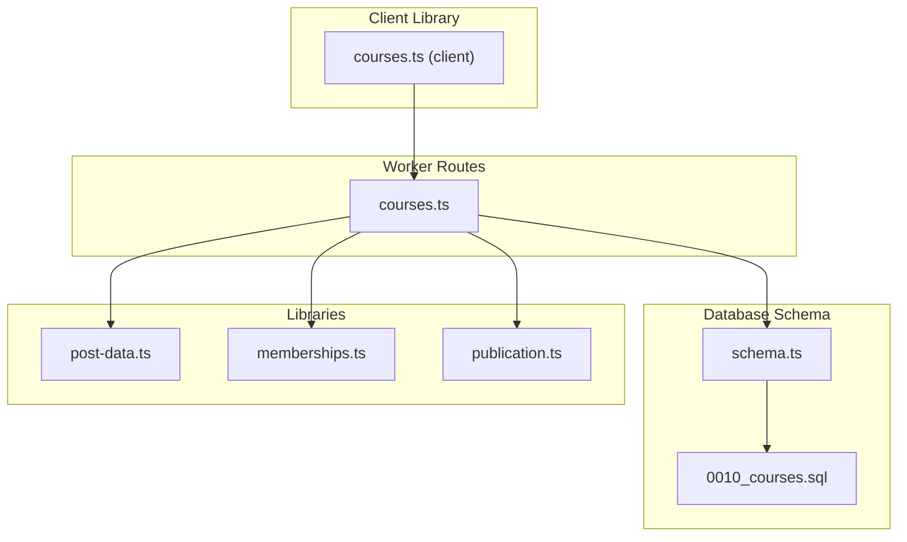
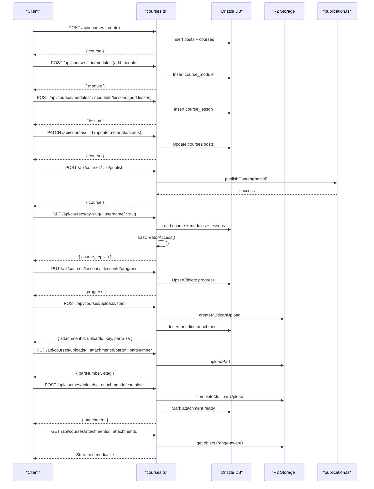
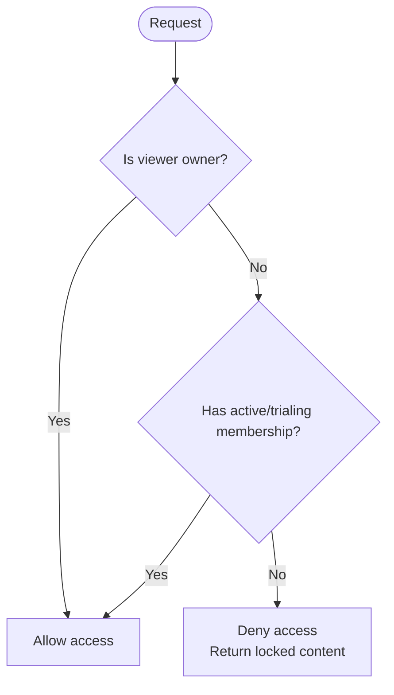
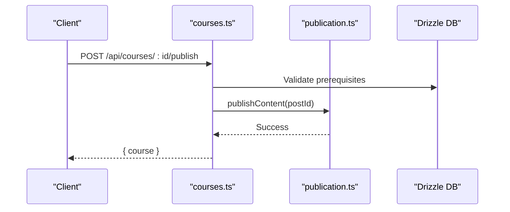
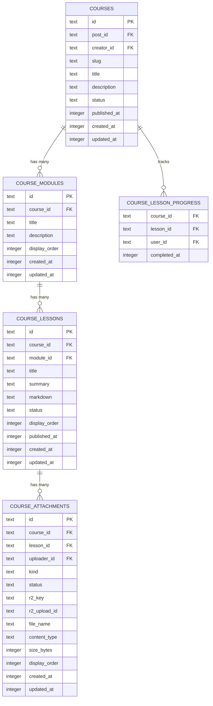

# Courses API

<cite>
**Referenced Files in This Document**
- [courses.ts](file://src/worker/routes/courses.ts)
- [0010_courses.sql](file://drizzle/0010_courses.sql)
- [schema.ts](file://src/worker/db/schema.ts)
- [post-data.ts](file://src/worker/lib/post-data.ts)
- [memberships.ts](file://src/worker/lib/memberships.ts)
- [publication.ts](file://src/worker/lib/publication.ts)
- [courses.ts (client)](file://src/react-app/lib/courses.ts)
- [courses.test.ts](file://src/worker/routes/courses.test.ts)
</cite>

## Table of Contents
1. [Introduction](#introduction)
2. [Project Structure](#project-structure)
3. [Core Components](#core-components)
4. [Architecture Overview](#architecture-overview)
5. [Detailed Component Analysis](#detailed-component-analysis)
6. [Dependency Analysis](#dependency-analysis)
7. [Performance Considerations](#performance-considerations)
8. [Troubleshooting Guide](#troubleshooting-guide)
9. [Conclusion](#conclusion)
10. [Appendices](#appendices)

## Introduction
This document provides comprehensive API documentation for the Courses feature, covering course creation, module and lesson management, enrollment via subscription-based access control, content delivery through attachments, and progress tracking. It explains how courses are structured into modules and lessons, how content is gated by creator subscriptions, and how learners track completion. It also outlines endpoints for managing course metadata and publishing workflows.

Note: Pricing, promotional materials, certificate generation, and analytics reporting are not exposed as dedicated Course API endpoints in this codebase. Access control is driven by subscription memberships, and progress tracking is available per lesson.

## Project Structure
The Courses API is implemented as a Hono route module with database models defined via Drizzle ORM and migrations. The client-side library exposes typed functions to call these endpoints.

**Diagram sources**
- [courses.ts:1-791](file://src/worker/routes/courses.ts#L1-L791)
- [schema.ts:350-446](file://src/worker/db/schema.ts#L350-L446)
- [0010_courses.sql:1-93](file://drizzle/0010_courses.sql#L1-L93)
- [post-data.ts:84-98](file://src/worker/lib/post-data.ts#L84-L98)
- [memberships.ts:1-144](file://src/worker/lib/memberships.ts#L1-L144)
- [publication.ts:180-216](file://src/worker/lib/publication.ts#L180-L216)
- [courses.ts (client):1-231](file://src/react-app/lib/courses.ts#L1-L231)

**Section sources**
- [courses.ts:1-791](file://src/worker/routes/courses.ts#L1-L791)
- [schema.ts:350-446](file://src/worker/db/schema.ts#L350-L446)
- [0010_courses.sql:1-93](file://drizzle/0010_courses.sql#L1-L93)
- [courses.ts (client):1-231](file://src/react-app/lib/courses.ts#L1-L231)

## Core Components
- Course entity: stores title, description, status (draft/published), timestamps, and links to posts and creators.
- Modules: group lessons within a course with ordering.
- Lessons: contain title, summary, markdown content, status, and ordering; can have multiple attachments.
- Attachments: support video, audio, and file types with multipart upload and range requests.
- Progress: tracks completed lessons per user per course.
- Access control: requires either ownership or an active/trialing membership to the creator.

Key data structures and relationships:
- courses -> course_modules -> course_lessons -> course_attachments
- course_lesson_progress ties users to completed lessons within a course
- hasCreatorAccess checks subscription_memberships for entitlement

**Section sources**
- [schema.ts:350-446](file://src/worker/db/schema.ts#L350-L446)
- [0010_courses.sql:1-93](file://drizzle/0010_courses.sql#L1-L93)
- [post-data.ts:84-98](file://src/worker/lib/post-data.ts#L84-L98)
- [memberships.ts:14-31](file://src/worker/lib/memberships.ts#L14-L31)

## Architecture Overview
The Courses API follows a layered architecture:
- HTTP routes define REST endpoints for CRUD operations on courses, modules, lessons, attachments, and progress.
- Middleware enforces authentication and role checks (creator).
- Business logic validates inputs, enforces publication rules, and computes payloads including access flags and progress summaries.
- Data layer uses Drizzle ORM queries against SQLite tables defined in schema.ts and migrations.
- Storage integration handles large files via Cloudflare R2 with multipart uploads and byte-range streaming.

**Diagram sources**
- [courses.ts:376-476](file://src/worker/routes/courses.ts#L376-L476)
- [publication.ts:180-216](file://src/worker/lib/publication.ts#L180-L216)
- [courses.ts (client):178-224](file://src/react-app/lib/courses.ts#L178-L224)

## Detailed Component Analysis

### Course Management Endpoints
- Create course: POST /api/courses
  - Requires creator role.
  - Creates post and course records; returns course payload.
- Get course by ID: GET /api/courses/:courseId
  - Returns course payload with modules and access info if viewer has access or is owner.
- Get course by slug: GET /api/courses/by-slug/:username/:slug
  - Returns course payload and replies.
- Update course: PATCH /api/courses/:courseId
  - Updates title, description, and status transitions (draft/published).
  - Prevents updates while scheduling is processing.
- Publish course: POST /api/courses/:courseId/publish
  - Validates prerequisites (at least one module and one published lesson).
  - Invokes publication pipeline.
- Unpublish course: POST /api/courses/:courseId/unpublish
  - Sets status to draft and clears publishedAt.
- Delete course: DELETE /api/courses/:courseId
  - Removes course and associated attachments.

Response payload includes:
- Basic metadata (id, slug, title, description, status, timestamps)
- Creator info
- Modules array with lessons
- Access flags (hasAccess, isOwner)
- Moderation fields
- Progress summary when accessible

**Section sources**
- [courses.ts:376-476](file://src/worker/routes/courses.ts#L376-L476)
- [publication.ts:180-216](file://src/worker/lib/publication.ts#L180-L216)

### Module Management Endpoints
- Create module: POST /api/courses/:courseId/modules
  - Adds module with title and optional description; assigns displayOrder.
- Update module: PATCH /api/courses/modules/:moduleId
  - Partial update of title/description.
- Reorder modules: PUT /api/courses/:courseId/modules/order
  - Expects itemIds array matching existing modules; updates displayOrder.
- Delete module: DELETE /api/courses/modules/:moduleId
  - Cascades deletion; cleans up lesson attachments before deleting module.

**Section sources**
- [courses.ts:478-536](file://src/worker/routes/courses.ts#L478-L536)

### Lesson Management Endpoints
- Create lesson: POST /api/courses/modules/:moduleId/lessons
  - Creates lesson in draft state; requires title, optional summary/markdown.
- Update lesson: PATCH /api/courses/lessons/:lessonId
  - Supports partial updates; validation enforced when setting status to published.
- Reorder lessons: PUT /api/courses/modules/:moduleId/lessons/order
  - Validates itemIds match existing lessons; updates displayOrder.
- Delete lesson: DELETE /api/courses/lessons/:lessonId
  - Deletes lesson and its attachments.

Lesson payload includes:
- id, title, summary, status, displayOrder, publishedAt
- locked flag (true unless viewer has access or is owner)
- markdown (null unless viewer has access or is owner)
- attachments (empty unless viewer has access or is owner)

**Section sources**
- [courses.ts:538-616](file://src/worker/routes/courses.ts#L538-L616)

### Attachment Upload and Delivery
- Start upload: POST /api/courses/uploads/start
  - Validates kind/contentType and size limits; creates R2 multipart upload and pending attachment record.
- Upload part: PUT /api/courses/uploads/:attachmentId/parts/:partNumber
  - Streams chunk to R2; returns part metadata.
- Complete upload: POST /api/courses/uploads/:attachmentId/complete
  - Completes multipart upload; verifies size; marks attachment ready.
- Delete attachment: DELETE /api/courses/attachments/:attachmentId
  - Cancels any in-progress uploads and deletes stored object.
- Serve attachment: GET /api/courses/attachments/:attachmentId
  - Enforces access control; supports Range headers for streaming; sets appropriate content-type/disposition and caching.

Attachment kinds supported:
- video
- audio
- file

**Section sources**
- [courses.ts:618-743](file://src/worker/routes/courses.ts#L618-L743)

### Progress Tracking
- Update progress: PUT /api/courses/lessons/:lessonId/progress
  - Requires viewer to have access to the creator’s content; toggles completion for the lesson.
  - Returns updated progress counts (completedLessons, totalLessons).

Progress is tracked per user per lesson within a course.

**Section sources**
- [courses.ts:745-765](file://src/worker/routes/courses.ts#L745-L765)

### Subscription-Based Access Control
Access to course content is governed by:
- Ownership: creator owns the course.
- Membership: viewer must have an active or trialing membership to the creator.

The system checks membership status using entitlement conditions that consider active and trial periods.

**Diagram sources**
- [post-data.ts:84-98](file://src/worker/lib/post-data.ts#L84-L98)
- [memberships.ts:14-31](file://src/worker/lib/memberships.ts#L14-L31)

**Section sources**
- [post-data.ts:84-98](file://src/worker/lib/post-data.ts#L84-L98)
- [memberships.ts:14-31](file://src/worker/lib/memberships.ts#L14-L31)

### Publication Workflow
Publishing a course requires:
- At least one module exists.
- At least one lesson is published.
- No conflicting schedule processing.

The publication process updates post and course statuses and ensures consistency.

**Diagram sources**
- [courses.ts:445-450](file://src/worker/routes/courses.ts#L445-L450)
- [publication.ts:180-216](file://src/worker/lib/publication.ts#L180-L216)

**Section sources**
- [publication.ts:180-216](file://src/worker/lib/publication.ts#L180-L216)

### Data Model Diagram

**Diagram sources**
- [schema.ts:350-446](file://src/worker/db/schema.ts#L350-L446)
- [0010_courses.sql:1-93](file://drizzle/0010_courses.sql#L1-L93)

## Dependency Analysis
- Route handlers depend on:
  - Database schema definitions for queries and constraints.
  - post-data utilities for building post extras and checking creator access.
  - memberships utilities for entitlement evaluation.
  - publication utilities for enforcing publish rules and updating post/course states.
  - Storage interface for R2 operations.

Coupling and cohesion:
- High cohesion within courses.ts for course/module/lesson/attachment operations.
- Clear separation of concerns: routes handle HTTP, libraries handle business logic, schema defines data model.

Potential circular dependencies:
- None observed between routes and libraries; dependencies are unidirectional.

External integrations:
- Cloudflare R2 for storage.
- Stripe membership modes and webhooks indirectly influence access control but are not directly invoked by course endpoints.

**Section sources**
- [courses.ts:1-791](file://src/worker/routes/courses.ts#L1-L791)
- [post-data.ts:84-98](file://src/worker/lib/post-data.ts#L84-L98)
- [memberships.ts:1-144](file://src/worker/lib/memberships.ts#L1-L144)
- [publication.ts:180-216](file://src/worker/lib/publication.ts#L180-L216)

## Performance Considerations
- Multipart uploads use 8 MB parts to balance throughput and memory usage.
- Range requests enable efficient streaming of large media without full downloads.
- Queries use indexes on display_order and status fields to optimize ordering and filtering.
- Batch updates reduce round-trips during unpublish and deletion flows.
- Cache headers on attachments minimize repeated fetches while preserving privacy.

[No sources needed since this section provides general guidance]

## Troubleshooting Guide
Common errors and resolutions:
- Validation failures: Ensure required fields like title, markdown or attachments meet constraints before publishing lessons.
- Schedule processing conflicts: If content is being scheduled, wait until processing completes before editing or publishing.
- Access denied: Verify viewer has an active or trialing membership to the creator or is the course owner.
- Upload size exceeded: Respect kind-specific maximum sizes for video/audio/file.
- Invalid Range header: Ensure correct bytes range format; server responds with 416 when invalid.

Operational tips:
- Use the client library functions for consistent request formatting and error handling.
- Monitor admin health endpoints for stale uploads and failed schedules.

**Section sources**
- [courses.ts:336-347](file://src/worker/routes/courses.ts#L336-L347)
- [courses.ts:618-743](file://src/worker/routes/courses.ts#L618-L743)
- [courses.test.ts:60-136](file://src/worker/routes/courses.test.ts#L60-L136)

## Conclusion
The Courses API provides a robust framework for creating and managing structured learning content with modular lessons, secure attachment delivery, and subscription-gated access. Progress tracking enables learner engagement insights, while publication workflows ensure content quality and availability. While pricing and certificates are not part of the Course API surface, access control integrates seamlessly with subscription memberships.

[No sources needed since this section summarizes without analyzing specific files]

## Appendices

### API Endpoint Reference Summary
- POST /api/courses
- GET /api/courses/:courseId
- GET /api/courses/by-slug/:username/:slug
- PATCH /api/courses/:courseId
- POST /api/courses/:courseId/publish
- POST /api/courses/:courseId/unpublish
- DELETE /api/courses/:courseId
- POST /api/courses/:courseId/modules
- PATCH /api/courses/modules/:moduleId
- PUT /api/courses/:courseId/modules/order
- DELETE /api/courses/modules/:moduleId
- POST /api/courses/modules/:moduleId/lessons
- PATCH /api/courses/lessons/:lessonId
- PUT /api/courses/modules/:moduleId/lessons/order
- DELETE /api/courses/lessons/:lessonId
- POST /api/courses/uploads/start
- PUT /api/courses/uploads/:attachmentId/parts/:partNumber
- POST /api/courses/uploads/:attachmentId/complete
- DELETE /api/courses/attachments/:attachmentId
- GET /api/courses/attachments/:attachmentId
- PUT /api/courses/lessons/:lessonId/progress

**Section sources**
- [courses.ts:365-765](file://src/worker/routes/courses.ts#L365-L765)
- [courses.ts (client):118-176](file://src/react-app/lib/courses.ts#L118-L176)

### Example Workflows

#### Creating a Course with Multiple Lessons
- Create course with title and description.
- Add modules to structure the curriculum.
- Add lessons under each module with titles, summaries, and markdown content.
- Publish lessons individually, then publish the course.

Reference:
- [courses.test.ts:66-101](file://src/worker/routes/courses.test.ts#L66-L101)

#### Enrollment Management via Subscriptions
- Viewer subscribes to creator (free/trial/paid).
- Access check grants visibility of lesson content and attachments.
- Progress tracking becomes available once access is granted.

Reference:
- [courses.test.ts:112-136](file://src/worker/routes/courses.test.ts#L112-L136)
- [post-data.ts:84-98](file://src/worker/lib/post-data.ts#L84-L98)

#### Student Progress Monitoring
- Toggle lesson completion via progress endpoint.
- Retrieve course detail to see progress summary (completed vs total lessons).

Reference:
- [courses.ts:745-765](file://src/worker/routes/courses.ts#L745-L765)
- [courses.ts (client):174-176](file://src/react-app/lib/courses.ts#L174-L176)

[No additional sources needed since examples reference already cited files]