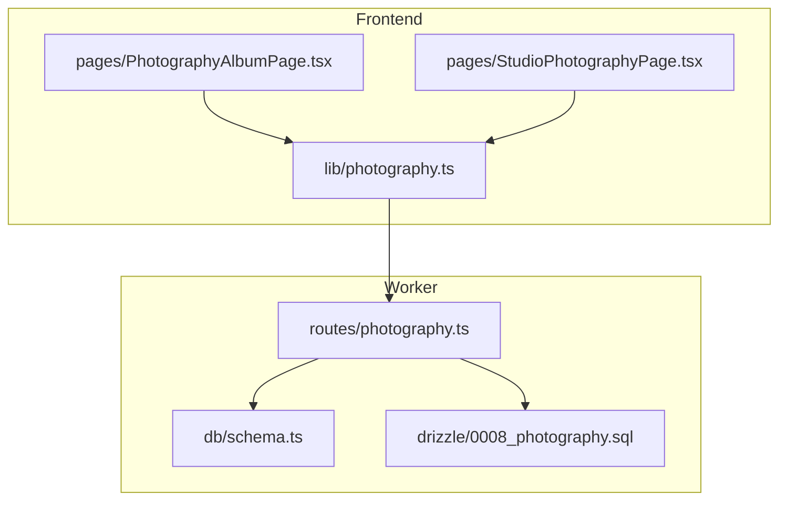
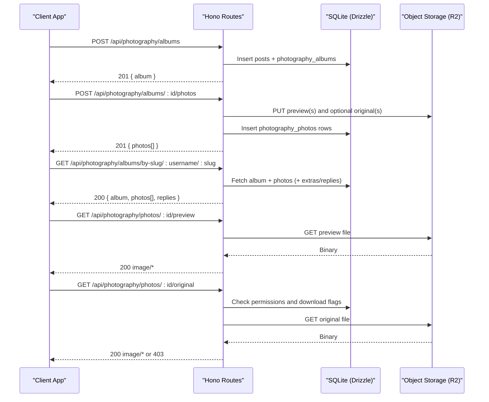
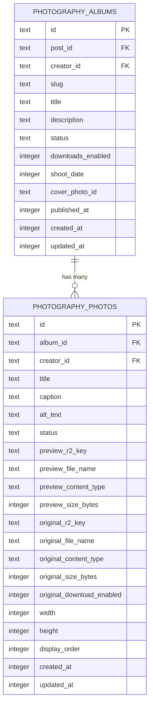
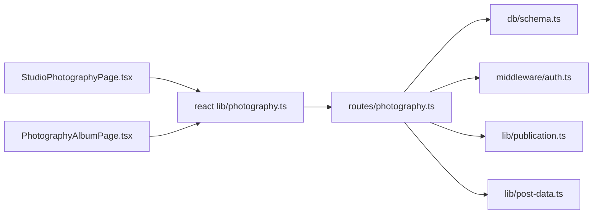

# Photography Albums API

<cite>
**Referenced Files in This Document**
- [photography.ts](file://src/worker/routes/photography.ts)
- [schema.ts](file://src/worker/db/schema.ts)
- [0008_photography.sql](file://drizzle/0008_photography.sql)
- [photography.ts (client)](file://src/react-app/lib/photography.ts)
- [PhotographyAlbumPage.tsx](file://src/react-app/pages/PhotographyAlbumPage.tsx)
- [StudioPhotographyPage.tsx](file://src/react-app/pages/StudioPhotographyPage.tsx)
- [auth.integration.test.ts](file://src/worker/routes/auth.integration.test.ts)
</cite>

## Table of Contents
1. [Introduction](#introduction)
2. [Project Structure](#project-structure)
3. [Core Components](#core-components)
4. [Architecture Overview](#architecture-overview)
5. [Detailed Component Analysis](#detailed-component-analysis)
6. [Dependency Analysis](#dependency-analysis)
7. [Performance Considerations](#performance-considerations)
8. [Troubleshooting Guide](#troubleshooting-guide)
9. [Conclusion](#conclusion)
10. [Appendices](#appendices)

## Introduction
This document provides comprehensive API documentation for the Photography Albums feature. It covers album creation, photo upload (including batch uploads), metadata handling, gallery management, privacy controls, viewer permissions, and integration with the creator’s profile. It also explains image processing workflows, format support, and CDN distribution via object storage.

## Project Structure
The photography feature is implemented as a Hono-based worker route module with:
- REST endpoints for albums and photos
- Database schema definitions using Drizzle ORM
- Client-side TypeScript helpers and React pages that consume the API
- Integration tests demonstrating end-to-end flows

**Diagram sources**
- [photography.ts:1-871](file://src/worker/routes/photography.ts#L1-L871)
- [schema.ts:293-348](file://src/worker/db/schema.ts#L293-L348)
- [0008_photography.sql:1-54](file://drizzle/0008_photography.sql#L1-L54)
- [photography.ts (client):1-130](file://src/react-app/lib/photography.ts#L1-L130)
- [PhotographyAlbumPage.tsx:1-285](file://src/react-app/pages/PhotographyAlbumPage.tsx#L1-L285)
- [StudioPhotographyPage.tsx:1-747](file://src/react-app/pages/StudioPhotographyPage.tsx#L1-L747)

**Section sources**
- [photography.ts:1-871](file://src/worker/routes/photography.ts#L1-L871)
- [schema.ts:293-348](file://src/worker/db/schema.ts#L293-L348)
- [0008_photography.sql:1-54](file://drizzle/0008_photography.sql#L1-L54)
- [photography.ts (client):1-130](file://src/react-app/lib/photography.ts#L1-L130)
- [PhotographyAlbumPage.tsx:1-285](file://src/react-app/pages/PhotographyAlbumPage.tsx#L1-L285)
- [StudioPhotographyPage.tsx:1-747](file://src/react-app/pages/StudioPhotographyPage.tsx#L1-L747)

## Core Components
- Album entity: stores title, description, status, downloadsEnabled, shootDate, coverPhotoId, timestamps, and links to a post record.
- Photo entity: stores per-image metadata (title, caption, altText), preview and original file references, dimensions, display order, and download flags.
- Endpoints: create/read/update/delete albums; batch upload and update/delete photos; reorder photos; read by slug; serve previews and originals.
- Privacy and access: enforced via post visibility and creator membership checks; optional original download gating at both album and photo levels.

**Section sources**
- [schema.ts:293-348](file://src/worker/db/schema.ts#L293-L348)
- [0008_photography.sql:1-54](file://drizzle/0008_photography.sql#L1-L54)
- [photography.ts:41-82](file://src/worker/routes/photography.ts#L41-L82)

## Architecture Overview
The API follows a clear separation between HTTP routes, data models, and storage:
- Routes handle authentication, validation, business rules, and orchestration.
- Data layer uses Drizzle ORM against SQLite.
- Media files are stored in object storage (R2) and served through dedicated endpoints.

**Diagram sources**
- [photography.ts:463-500](file://src/worker/routes/photography.ts#L463-L500)
- [photography.ts:580-653](file://src/worker/routes/photography.ts#L580-L653)
- [photography.ts:766-788](file://src/worker/routes/photography.ts#L766-L788)
- [photography.ts:790-807](file://src/worker/routes/photography.ts#L790-L807)
- [photography.ts:809-829](file://src/worker/routes/photography.ts#L809-L829)

## Detailed Component Analysis

### Authentication and Authorization
- All write endpoints require authentication and the creator role.
- Read endpoints require authentication and enforce:
  - Post-level visibility (moderation and membership).
  - Creator ownership or member access checks.
  - For original downloads: album-level downloadsEnabled AND photo-level originalDownloadEnabled must be true for non-creators.

**Section sources**
- [photography.ts:437-461](file://src/worker/routes/photography.ts#L437-L461)
- [photography.ts:766-788](file://src/worker/routes/photography.ts#L766-L788)
- [photography.ts:809-829](file://src/worker/routes/photography.ts#L809-L829)

### Album Endpoints

#### Create Album
- Method: POST
- Path: /api/photography/albums
- Auth: required, creator role
- Body: multipart/form-data
  - title (required, ≤140 chars)
  - description (optional, ≤1000 chars)
  - status (draft|published; published not allowed on create)
  - downloadsEnabled (boolean)
  - shootDate (optional date string)
  - coverPhotoId (ignored on create)
- Behavior:
  - Creates a linked post and an album row in draft status.
  - Returns serialized album.

Response: 201 { album }

**Section sources**
- [photography.ts:463-500](file://src/worker/routes/photography.ts#L463-L500)

#### Update Album
- Method: PATCH
- Path: /api/photography/albums/:albumId
- Auth: required, creator role
- Body: multipart/form-data (same fields as create)
- Validation:
  - If setting status to published, requires a published cover photo and at least one published photo.
  - Prevents edits while scheduling is processing.
- Behavior:
  - Updates post body and album fields.
  - Publishes content if transitioning from draft to published.

Response: 200 { album }

**Section sources**
- [photography.ts:502-555](file://src/worker/routes/photography.ts#L502-L555)

#### Delete Album
- Method: DELETE
- Path: /api/photography/albums/:albumId
- Auth: required, creator role
- Constraints:
  - Must own the album.
  - Cannot delete moderated content until restored.
  - Cannot delete if album has photos (must delete photos first).
  - Prevents deletion while scheduling is processing.
- Behavior:
  - Deletes associated post.

Response: 200 { ok: true }

**Section sources**
- [photography.ts:557-578](file://src/worker/routes/photography.ts#L557-L578)

#### List My Albums
- Method: GET
- Path: /api/photography/albums/mine
- Auth: required, creator role
- Response: { albums[] } with each album including its photos ordered by displayOrder.

**Section sources**
- [photography.ts:437-461](file://src/worker/routes/photography.ts#L437-L461)

#### Get Album By Slug
- Method: GET
- Path: /api/photography/albums/by-slug/:username/:slug
- Auth: required
- Access:
  - Enforces post visibility and creator/member access.
  - Creator sees drafts; others see only published photos.
- Response: { album, photos[], replies }

**Section sources**
- [photography.ts:766-788](file://src/worker/routes/photography.ts#L766-L788)

### Photo Endpoints

#### Batch Upload Photos
- Method: POST
- Path: /api/photography/albums/:albumId/photos
- Auth: required, creator role
- Body: multipart/form-data
  - previews: array of images (JPEG/PNG/WebP), max 30, size limit applies
  - originals: optional array matching previews by position (supports RAW and common formats)
  - metadata: JSON array of objects aligned with previews, each may include:
    - title (≤140)
    - caption (≤1000)
    - altText (≤280)
    - status (draft|published)
    - originalDownloadEnabled (boolean)
- Validation:
  - At least one preview required.
  - Originals cannot exceed previews count.
  - Type and size limits enforced per file.
- Behavior:
  - Uploads previews and optional originals to storage.
  - Inserts photo rows with metadata and ordering.
  - Auto-sets cover photo if none exists.
- Response: 201 { photos[] }

**Section sources**
- [photography.ts:580-653](file://src/worker/routes/photography.ts#L580-L653)

#### Update Photo
- Method: PATCH
- Path: /api/photography/photos/:photoId
- Auth: required, creator role
- Body: multipart/form-data
  - Optional replacements: preview, original
  - Metadata fields: title, caption, altText, status, originalDownloadEnabled
- Behavior:
  - Replaces files when provided and deletes old ones.
  - Updates metadata and timestamps.
- Response: 200 { photo }

**Section sources**
- [photography.ts:655-706](file://src/worker/routes/photography.ts#L655-L706)

#### Delete Photo
- Method: DELETE
- Path: /api/photography/photos/:photoId
- Auth: required, creator role
- Behavior:
  - Removes photo row and associated files.
  - If deleted photo was cover, resets album cover and unpublishes album/post.
- Response: 200 { ok: true }

**Section sources**
- [photography.ts:708-732](file://src/worker/routes/photography.ts#L708-L732)

#### Reorder Photos
- Method: PUT
- Path: /api/photography/albums/:albumId/order
- Auth: required, creator role
- Body: JSON { photoIds: string[] }
- Validation:
  - Must include every photo exactly once.
- Behavior:
  - Updates displayOrder for all photos in the given order.
- Response: 200 { ok: true }

**Section sources**
- [photography.ts:734-764](file://src/worker/routes/photography.ts#L734-L764)

### Image Serving Endpoints

#### Preview
- Method: GET
- Path: /api/photography/photos/:photoId/preview
- Auth: required
- Access: same as photo read rules
- Response: binary image with appropriate content-type and inline disposition

**Section sources**
- [photography.ts:790-807](file://src/worker/routes/photography.ts#L790-L807)

#### Original Download
- Method: GET
- Path: /api/photography/photos/:photoId/original
- Auth: required
- Access:
  - Requires photo to have original metadata.
  - Non-creators can download only if album.downloadsEnabled AND photo.originalDownloadEnabled.
- Response: binary image with attachment disposition

**Section sources**
- [photography.ts:809-829](file://src/worker/routes/photography.ts#L809-L829)

### Data Models and Schema

**Diagram sources**
- [schema.ts:293-348](file://src/worker/db/schema.ts#L293-L348)
- [0008_photography.sql:1-54](file://drizzle/0008_photography.sql#L1-L54)

**Section sources**
- [schema.ts:293-348](file://src/worker/db/schema.ts#L293-L348)
- [0008_photography.sql:1-54](file://drizzle/0008_photography.sql#L1-L54)

### Client-Side Integration
- The client library exposes typed functions for all endpoints and query keys for caching.
- Studio page implements album CRUD, batch upload, reordering, and editing.
- Profile page renders public album detail with like/save and discussion features.

Key client methods:
- minePhotographyAlbumsQueryOptions()
- createPhotographyAlbum(formData)
- updatePhotographyAlbum(albumId, formData)
- deletePhotographyAlbum(albumId)
- uploadPhotographyPhotos(albumId, formData)
- updatePhotographyPhoto(photoId, formData)
- deletePhotographyPhoto(photoId)
- reorderPhotographyPhotos(albumId, photoIds[])
- photographyAlbumDetailQueryOptions(username, slug)

**Section sources**
- [photography.ts (client):1-130](file://src/react-app/lib/photography.ts#L1-L130)
- [StudioPhotographyPage.tsx:1-747](file://src/react-app/pages/StudioPhotographyPage.tsx#L1-L747)
- [PhotographyAlbumPage.tsx:1-285](file://src/react-app/pages/PhotographyAlbumPage.tsx#L1-L285)

## Dependency Analysis
- Route module depends on:
  - Drizzle ORM for database queries
  - Middleware for auth and role checks
  - Post utilities for slugs, extras, and publication
  - Object storage for media
- Frontend depends on:
  - Typed client helpers
  - React Query for caching and mutations
  - UI components for forms and galleries

**Diagram sources**
- [photography.ts:1-30](file://src/worker/routes/photography.ts#L1-L30)
- [schema.ts:293-348](file://src/worker/db/schema.ts#L293-L348)
- [photography.ts (client):1-130](file://src/react-app/lib/photography.ts#L1-L130)
- [StudioPhotographyPage.tsx:1-747](file://src/react-app/pages/StudioPhotographyPage.tsx#L1-L747)
- [PhotographyAlbumPage.tsx:1-285](file://src/react-app/pages/PhotographyAlbumPage.tsx#L1-L285)

**Section sources**
- [photography.ts:1-30](file://src/worker/routes/photography.ts#L1-L30)
- [schema.ts:293-348](file://src/worker/db/schema.ts#L293-L348)
- [photography.ts (client):1-130](file://src/react-app/lib/photography.ts#L1-L130)

## Performance Considerations
- Batch uploads support up to 30 previews per request to reduce round-trips.
- Ordering updates use a single endpoint to set displayOrder for all photos atomically.
- Previews are served with short cache headers suitable for interactive browsing.
- Original downloads are gated and served directly from storage with minimal processing.

[No sources needed since this section provides general guidance]

## Troubleshooting Guide
Common errors and resolutions:
- Unsupported media type: Ensure previews are JPEG/PNG/WebP and originals are supported types/extensions.
- Payload too large: Respect size limits for previews and originals.
- Validation failed: Check field lengths and allowed values (status, boolean flags).
- Schedule processing: Wait until scheduled publish completes before editing or deleting.
- Moderated content: Editing/deleting blocked until moderation restores content.
- Not found: Verify IDs and slugs; ensure album has photos before attempting deletion.

**Section sources**
- [photography.ts:145-168](file://src/worker/routes/photography.ts#L145-L168)
- [photography.ts:502-555](file://src/worker/routes/photography.ts#L502-L555)
- [photography.ts:557-578](file://src/worker/routes/photography.ts#L557-L578)
- [photography.ts:580-653](file://src/worker/routes/photography.ts#L580-L653)
- [photography.ts:708-732](file://src/worker/routes/photography.ts#L708-L732)

## Conclusion
The Photography Albums API provides a robust, secure, and efficient system for managing photographic collections. It supports batch uploads, rich metadata, flexible privacy controls, and seamless integration with creator profiles and community features. The design emphasizes safety (validation and authorization), performance (batch operations and direct storage serving), and developer ergonomics (typed client helpers and clear error responses).

[No sources needed since this section summarizes without analyzing specific files]

## Appendices

### Example Workflows

#### Create Album With Multiple Photos
1. Create album as draft via POST /api/photography/albums with title, description, downloadsEnabled, shootDate.
2. Upload multiple previews and optional originals via POST /api/photography/albums/:id/photos with metadata arrays.
3. Set cover photo and publish via PATCH /api/photography/albums/:id with status=published and coverPhotoId.

Reference example usage in integration test.

**Section sources**
- [auth.integration.test.ts:531-593](file://src/worker/routes/auth.integration.test.ts#L531-L593)

#### Metadata Assignment
- Per-photo metadata includes title, caption, altText, status, and originalDownloadEnabled.
- Batch metadata is passed as a JSON array aligned with previews.

**Section sources**
- [photography.ts:199-208](file://src/worker/routes/photography.ts#L199-L208)
- [photography.ts:627-643](file://src/worker/routes/photography.ts#L627-L643)

#### Gallery Customization Options
- Cover selection via coverPhotoId.
- Display order via PUT /api/photography/albums/:albumId/order.
- Downloads control via album-level downloadsEnabled and per-photo originalDownloadEnabled.

**Section sources**
- [photography.ts:734-764](file://src/worker/routes/photography.ts#L734-L764)
- [photography.ts:809-829](file://src/worker/routes/photography.ts#L809-L829)

### Endpoint Summary

- POST /api/photography/albums — Create album (draft)
- PATCH /api/photography/albums/:albumId — Update album (publishing logic included)
- DELETE /api/photography/albums/:albumId — Delete album (empty only)
- GET /api/photography/albums/mine — List creator’s albums with photos
- GET /api/photography/albums/by-slug/:username/:slug — Public/private album detail
- POST /api/photography/albums/:albumId/photos — Batch upload previews and originals
- PATCH /api/photography/photos/:photoId — Update photo metadata/files
- DELETE /api/photography/photos/:photoId — Delete photo
- PUT /api/photography/albums/:albumId/order — Reorder photos
- GET /api/photography/photos/:photoId/preview — Serve preview
- GET /api/photography/photos/:photoId/original — Serve original (gated)

**Section sources**
- [photography.ts:437-829](file://src/worker/routes/photography.ts#L437-L829)
- [photography.ts (client):81-130](file://src/react-app/lib/photography.ts#L81-L130)