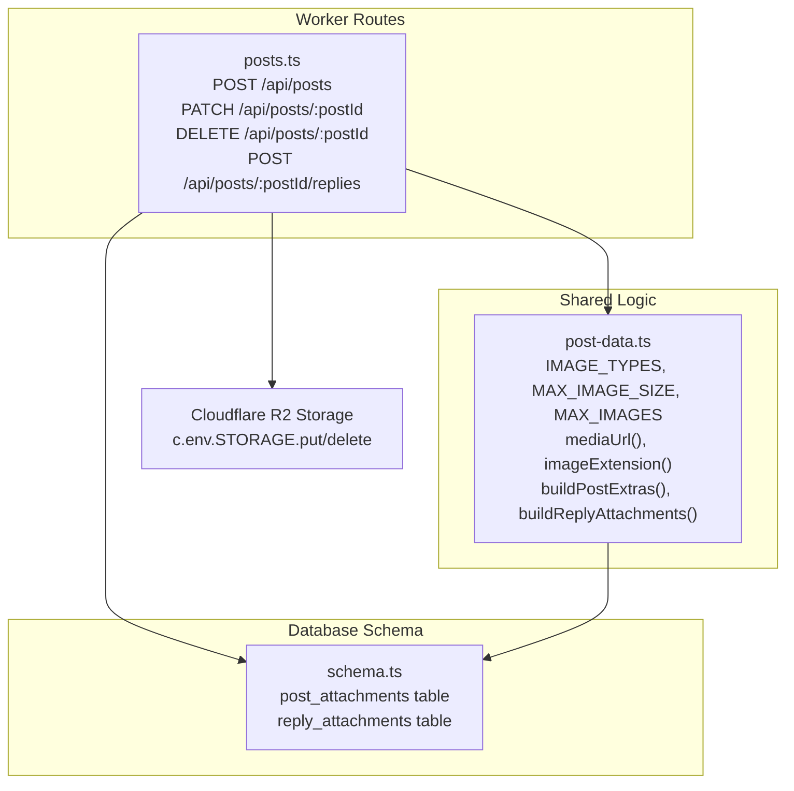
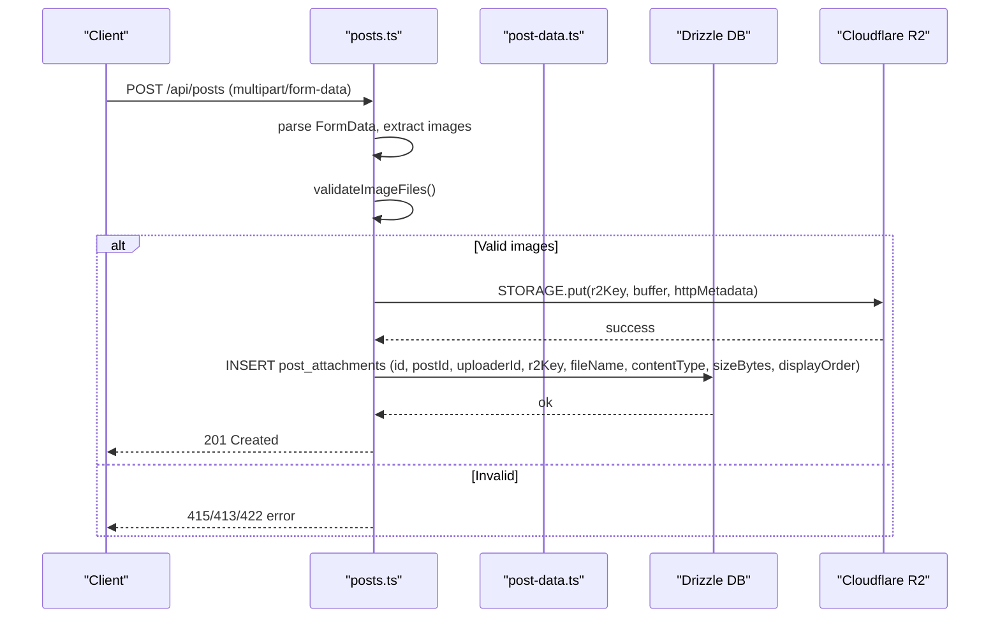
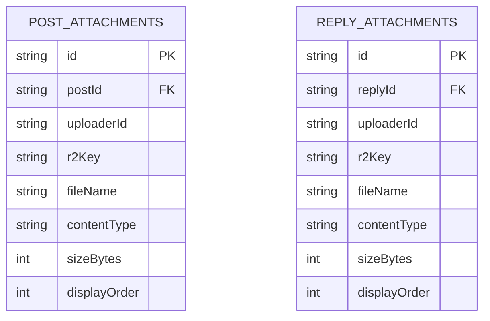
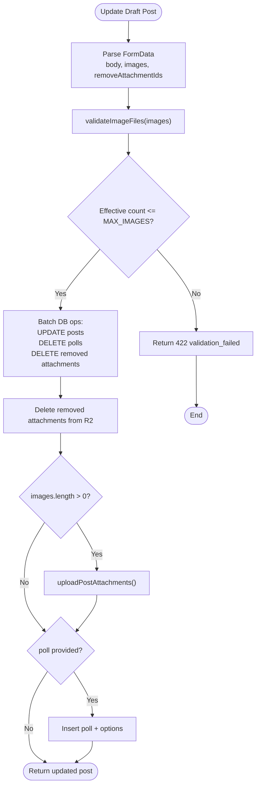
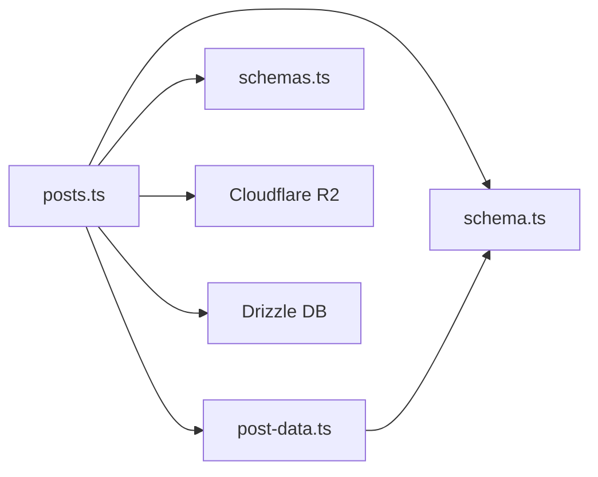

# Media Attachments

<cite>
**Referenced Files in This Document**
- [posts.ts](file://src/worker/routes/posts.ts)
- [post-data.ts](file://src/worker/lib/post-data.ts)
- [schema.ts](file://src/worker/db/schema.ts)
- [schemas.ts](file://src/worker/lib/schemas.ts)
</cite>

## Table of Contents
1. [Introduction](#introduction)
2. [Project Structure](#project-structure)
3. [Core Components](#core-components)
4. [Architecture Overview](#architecture-overview)
5. [Detailed Component Analysis](#detailed-component-analysis)
6. [Dependency Analysis](#dependency-analysis)
7. [Performance Considerations](#performance-considerations)
8. [Troubleshooting Guide](#troubleshooting-guide)
9. [Conclusion](#conclusion)

## Introduction
This document explains how media attachments are handled for posts and replies, including upload validation, Cloudflare R2 storage integration, metadata persistence, lifecycle management (creation, update with removal, deletion), error handling, data structures, display ordering, and URL generation. It is intended for both developers and product contributors who need to understand or extend the attachment system.

## Project Structure
The attachment feature spans three main areas:
- Worker routes that handle multipart/form-data uploads and JSON payloads for posts and replies
- Shared constants, helpers, and data builders for attachment metadata and URLs
- Database schema definitions for post and reply attachments

**Diagram sources**
- [posts.ts](file://src/worker/routes/posts.ts)
- [post-data.ts](file://src/worker/lib/post-data.ts)
- [schema.ts](file://src/worker/db/schema.ts)

**Section sources**
- [posts.ts](file://src/worker/routes/posts.ts)
- [post-data.ts](file://src/worker/lib/post-data.ts)
- [schema.ts](file://src/worker/db/schema.ts)

## Core Components
- Upload validation: supported formats, size limits, and per-request quantity limits
- Storage integration: Cloudflare R2 put/delete operations
- Metadata persistence: storing file name, MIME type, size, and display order
- Attachment retrieval: building ordered lists with stable URLs
- Update flow: removing selected attachments and enforcing total count constraints
- Deletion flow: cascading DB deletes and R2 deletions

Key behaviors:
- Supported image types: JPEG, PNG, WebP
- Maximum image size: 5 MB per image
- Maximum images per request: 4
- Attachment URLs: generated via a consistent endpoint using attachment IDs
- Display order: preserved by insertion index

**Section sources**
- [post-data.ts:18-42](file://src/worker/lib/post-data.ts#L18-L42)
- [post-data.ts:100-133](file://src/worker/lib/post-data.ts#L100-L133)
- [posts.ts:121-140](file://src/worker/routes/posts.ts#L121-L140)

## Architecture Overview
The attachment workflow integrates form parsing, validation, storage, and database writes.

**Diagram sources**
- [posts.ts:419-542](file://src/worker/routes/posts.ts#L419-L542)
- [posts.ts:172-194](file://src/worker/routes/posts.ts#L172-L194)
- [post-data.ts:100-133](file://src/worker/lib/post-data.ts#L100-L133)

## Detailed Component Analysis

### Upload Validation
- Supported formats: JPEG, PNG, WebP
- Size limit: 5 MB per image
- Quantity limit: maximum 4 images per request
- Error mapping:
  - Unsupported media type → 415
  - Payload too large → 413
  - Other validation failures → 422

Validation logic extracts files from the form, checks counts, MIME types, and sizes, then maps errors to appropriate HTTP responses.

**Section sources**
- [post-data.ts:18-42](file://src/worker/lib/post-data.ts#L18-L42)
- [posts.ts:121-140](file://src/worker/routes/posts.ts#L121-L140)
- [posts.ts:448-452](file://src/worker/routes/posts.ts#L448-L452)
- [posts.ts:575-579](file://src/worker/routes/posts.ts#L575-L579)
- [posts.ts:723-727](file://src/worker/routes/posts.ts#L723-L727)

### Cloudflare R2 Integration
- Upload path: c.env.STORAGE.put(key, arrayBuffer, { httpMetadata: { contentType } })
- Key format:
  - Posts: posts/{postId}/{uuid}{extension}
  - Replies: replies/{replyId}/{uuid}{extension}
- Extension selection based on content type

Deletion uses c.env.STORAGE.delete(key) during post updates and post deletions.

**Section sources**
- [posts.ts:172-194](file://src/worker/routes/posts.ts#L172-L194)
- [posts.ts:196-218](file://src/worker/routes/posts.ts#L196-L218)
- [posts.ts:618](file://src/worker/routes/posts.ts#L618)
- [posts.ts:634](file://src/worker/routes/posts.ts#L634)
- [post-data.ts:128-133](file://src/worker/lib/post-data.ts#L128-L133)

### Attachment Metadata and Data Model
Attachment records include:
- id: unique identifier used in URLs
- postId or replyId: parent entity
- uploaderId: creator/user who uploaded
- r2Key: object key in R2
- fileName: original file name or fallback
- contentType: MIME type
- sizeBytes: file size
- displayOrder: integer position for rendering

These fields are persisted when uploading new attachments.

**Diagram sources**
- [schema.ts:448-461](file://src/worker/db/schema.ts#L448-L461)
- [schema.ts:492-505](file://src/worker/db/schema.ts#L492-L505)

**Section sources**
- [posts.ts:183-193](file://src/worker/routes/posts.ts#L183-L193)
- [posts.ts:207-217](file://src/worker/routes/posts.ts#L207-L217)
- [schema.ts:448-461](file://src/worker/db/schema.ts#L448-L461)
- [schema.ts:492-505](file://src/worker/db/schema.ts#L492-L505)

### Attachment Retrieval and Display Ordering
- Post attachments are fetched and grouped by postId, ordered by displayOrder
- Reply attachments are fetched and grouped by replyId, ordered by displayOrder
- Each attachment includes an id and url generated via mediaUrl(id)

URL generation:
- mediaUrl(attachmentId) returns /api/media/{attachmentId}

This ensures consistent client-side access patterns and predictable caching.

**Section sources**
- [post-data.ts:144-219](file://src/worker/lib/post-data.ts#L144-L219)
- [post-data.ts:294-324](file://src/worker/lib/post-data.ts#L294-L324)
- [post-data.ts:100-102](file://src/worker/lib/post-data.ts#L100-L102)

### Post Update Flow and Batch Removal
When updating a draft post:
- Parse body, optional poll, and images
- Accept removeAttachmentIds list from form data
- Compute effective image count after removals and new uploads; enforce MAX_IMAGES
- Delete selected attachments from DB and R2
- Insert new attachments if any
- Persist poll changes and body update

**Diagram sources**
- [posts.ts:555-623](file://src/worker/routes/posts.ts#L555-L623)
- [posts.ts:595-618](file://src/worker/routes/posts.ts#L595-L618)

**Section sources**
- [posts.ts:555-623](file://src/worker/routes/posts.ts#L555-L623)

### Reply Creation with Attachments
Replies can include images similarly to posts:
- Validate images with the same rules
- Persist reply row first, then upload attachments
- Build reply response with attachments included

**Section sources**
- [posts.ts:695-775](file://src/worker/routes/posts.ts#L695-L775)
- [posts.ts:196-218](file://src/worker/routes/posts.ts#L196-L218)

### Post Deletion and Cleanup
Deleting a draft post:
- Fetch all associated attachments
- Delete the post row
- Delete all attachment objects from R2 asynchronously

**Section sources**
- [posts.ts:625-636](file://src/worker/routes/posts.ts#L625-L636)

## Dependency Analysis
- posts.ts depends on:
  - post-data.ts for constants, URL generation, and attachment builders
  - schema.ts for table definitions
  - schemas.ts for input validation schemas
  - Cloudflare R2 via c.env.STORAGE
  - Drizzle ORM via createDb(c.env.DB)

**Diagram sources**
- [posts.ts](file://src/worker/routes/posts.ts)
- [post-data.ts](file://src/worker/lib/post-data.ts)
- [schema.ts](file://src/worker/db/schema.ts)
- [schemas.ts](file://src/worker/lib/schemas.ts)

**Section sources**
- [posts.ts](file://src/worker/routes/posts.ts)
- [post-data.ts](file://src/worker/lib/post-data.ts)
- [schema.ts](file://src/worker/db/schema.ts)
- [schemas.ts](file://src/worker/lib/schemas.ts)

## Performance Considerations
- Use batched DB operations where possible to reduce round-trips
- Parallelize independent I/O:
  - R2 uploads for multiple images
  - R2 deletions for removed attachments
- Avoid loading unnecessary data; fetch only required attachment fields
- Keep payload sizes within limits to prevent timeouts and memory pressure

[No sources needed since this section provides general guidance]

## Troubleshooting Guide
Common errors and their causes:
- 415 Unsupported media type: non-JPEG/PNG/WebP files
- 413 Payload too large: single image exceeds 5 MB
- 422 Validation failed: exceeding 4 images, invalid form fields, or invalid removeAttachmentIds JSON
- Missing attachments after update: ensure removeAttachmentIds matches existing ids and effective count stays within limits

Debugging tips:
- Inspect FormData fields: body, images[], pollQuestion, pollOptions, scheduledFor, removeAttachmentIds
- Verify content-type headers for multipart vs JSON
- Confirm R2 keys follow expected paths and extensions match MIME types

**Section sources**
- [posts.ts:448-452](file://src/worker/routes/posts.ts#L448-L452)
- [posts.ts:575-579](file://src/worker/routes/posts.ts#L575-L579)
- [posts.ts:723-727](file://src/worker/routes/posts.ts#L723-L727)
- [posts.ts:583-588](file://src/worker/routes/posts.ts#L583-L588)

## Conclusion
The attachment system enforces strict validation, persists rich metadata, and integrates cleanly with Cloudflare R2. Updates support selective removal and maintain consistent ordering and URLs. By following the documented flows and constraints, clients can reliably upload, manage, and retrieve media for posts and replies.