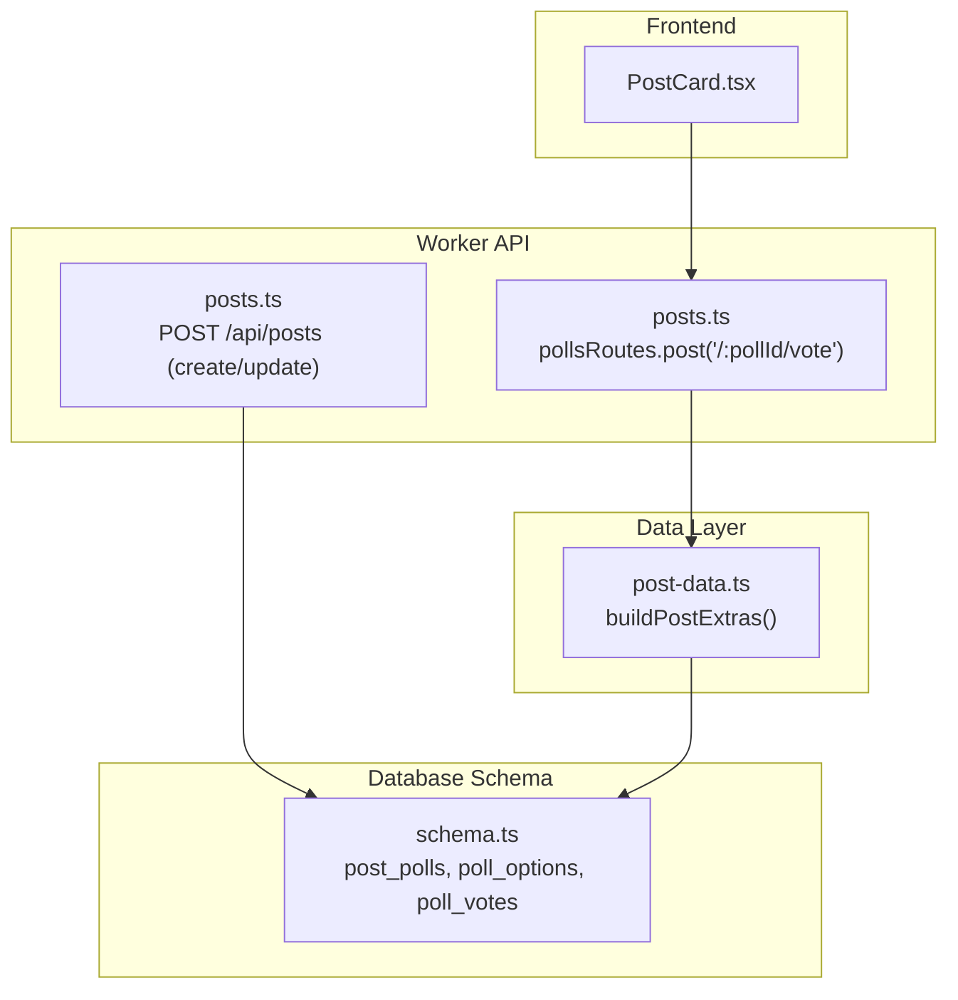
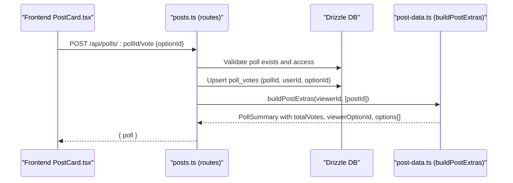
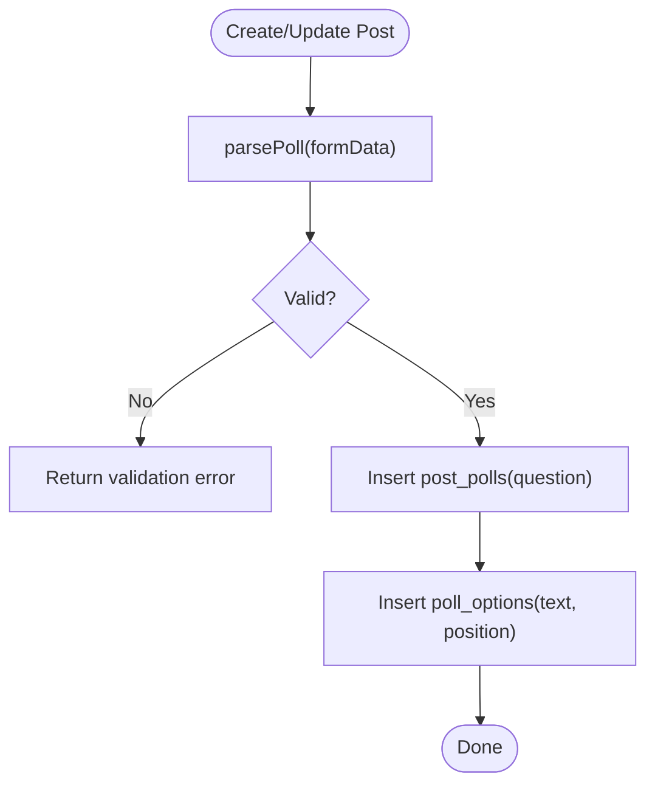
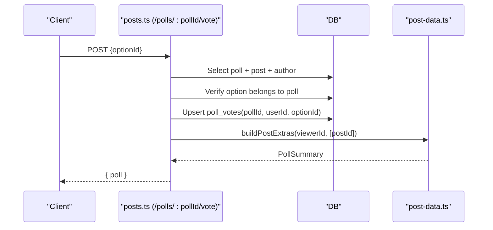
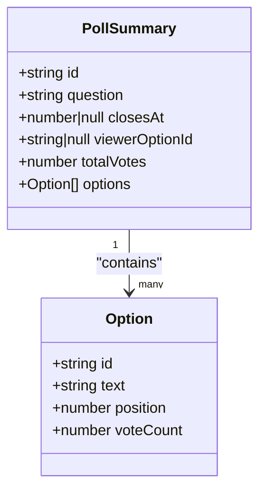
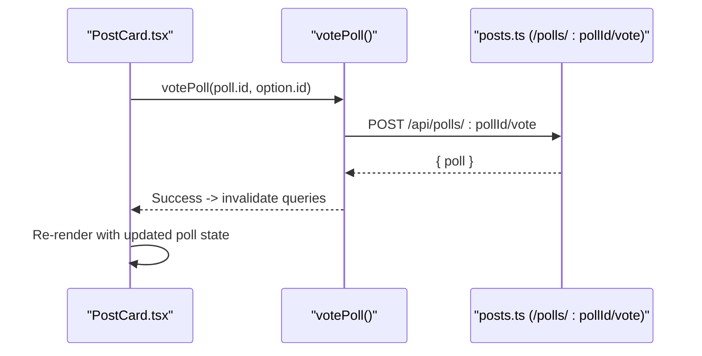
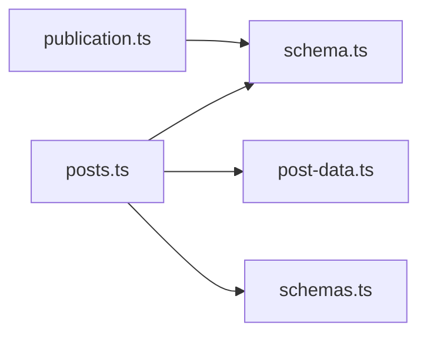

# Polls and Voting System

<cite>
**Referenced Files in This Document**
- [posts.ts](file://src/worker/routes/posts.ts)
- [post-data.ts](file://src/worker/lib/post-data.ts)
- [schema.ts](file://src/worker/db/schema.ts)
- [PostCard.tsx](file://src/react-app/components/PostCard.tsx)
- [schemas.ts](file://src/worker/lib/schemas.ts)
- [publication.ts](file://src/worker/lib/publication.ts)
</cite>

## Table of Contents
1. [Introduction](#introduction)
2. [Project Structure](#project-structure)
3. [Core Components](#core-components)
4. [Architecture Overview](#architecture-overview)
5. [Detailed Component Analysis](#detailed-component-analysis)
6. [Dependency Analysis](#dependency-analysis)
7. [Performance Considerations](#performance-considerations)
8. [Troubleshooting Guide](#troubleshooting-guide)
9. [Conclusion](#conclusion)

## Introduction
This document explains the polls and voting system integrated with posts. It covers how a poll is created alongside a post, the data model for polls and votes, validation rules for questions and options, vote recording and counting, serialization of poll data with posts, and the relationship between polls and their parent posts. It also documents error handling for invalid configurations and edge cases during option management.

## Project Structure
Polls are implemented as part of the worker backend (Hono routes), database schema (Drizzle ORM), and frontend components:
- Backend routes handle creation, updates, and voting endpoints.
- Data utilities build and serialize poll summaries with per-user vote state and totals.
- Database schema defines tables for polls, options, and votes.
- Frontend renders poll UI and triggers vote mutations.



**Diagram sources**
- [posts.ts:919-965](file://src/worker/routes/posts.ts#L919-L965)
- [post-data.ts:144-292](file://src/worker/lib/post-data.ts#L144-L292)
- [schema.ts:541-580](file://src/worker/db/schema.ts#L541-L580)

**Section sources**
- [posts.ts:419-542](file://src/worker/routes/posts.ts#L419-L542)
- [post-data.ts:144-292](file://src/worker/lib/post-data.ts#L144-L292)
- [schema.ts:541-580](file://src/worker/db/schema.ts#L541-L580)
- [PostCard.tsx:40-53](file://src/react-app/components/PostCard.tsx#L40-L53)

## Core Components
- Poll creation and update:
  - During POST /api/posts, poll question and options can be provided via form fields. Validation enforces limits and counts.
  - On update, existing poll is cleared and replaced if new poll data is present.
- Poll voting:
  - POST /api/polls/:pollId/vote records or updates a user’s vote atomically.
- Serialization:
  - buildPostExtras aggregates options, vote counts, and viewer’s selected option to produce a PollSummary attached to each post.
- Data model:
  - post_polls stores the poll question and optional close time.
  - poll_options stores option text and position.
  - poll_votes records one vote per user per poll, updatable.

Key behaviors:
- Question length limit: max 140 characters.
- Options: 2–4 options; each option text max 80 characters.
- At least two options required before publishing.
- One vote per user per poll; re-voting updates the selection.

**Section sources**
- [posts.ts:142-170](file://src/worker/routes/posts.ts#L142-L170)
- [posts.ts:494-505](file://src/worker/routes/posts.ts#L494-L505)
- [posts.ts:919-965](file://src/worker/routes/posts.ts#L919-L965)
- [post-data.ts:52-73](file://src/worker/lib/post-data.ts#L52-L73)
- [post-data.ts:226-292](file://src/worker/lib/post-data.ts#L226-L292)
- [schema.ts:541-580](file://src/worker/db/schema.ts#L541-L580)
- [publication.ts:121-133](file://src/worker/lib/publication.ts#L121-L133)

## Architecture Overview
The poll system integrates into the post lifecycle through three layers:
- API layer: validates inputs, persists poll and options, handles voting.
- Data layer: builds enriched poll summaries including per-user vote state and totals.
- Storage layer: relational tables enforce constraints and relationships.



**Diagram sources**
- [posts.ts:919-965](file://src/worker/routes/posts.ts#L919-L965)
- [post-data.ts:144-292](file://src/worker/lib/post-data.ts#L144-L292)

## Detailed Component Analysis

### Poll Creation and Update Flow
- Input parsing:
  - parsePoll extracts question and options from FormData, trims values, validates JSON, ensures 2–4 options, and enforces character limits.
- Persistence:
  - Creates post_polls row and inserts poll_options rows with sequential positions.
- Update behavior:
  - On patch, existing poll is deleted and replaced if new poll data is provided.



**Diagram sources**
- [posts.ts:142-170](file://src/worker/routes/posts.ts#L142-L170)
- [posts.ts:494-505](file://src/worker/routes/posts.ts#L494-L505)
- [posts.ts:613-617](file://src/worker/routes/posts.ts#L613-L617)

**Section sources**
- [posts.ts:142-170](file://src/worker/routes/posts.ts#L142-L170)
- [posts.ts:494-505](file://src/worker/routes/posts.ts#L494-L505)
- [posts.ts:613-617](file://src/worker/routes/posts.ts#L613-L617)

### Poll Voting Endpoint
- Validates poll existence and access permissions.
- Ensures the option belongs to the poll.
- Upserts vote record for the user, updating previous selection if needed.
- Returns updated PollSummary via buildPostExtras.



**Diagram sources**
- [posts.ts:919-965](file://src/worker/routes/posts.ts#L919-L965)
- [post-data.ts:144-292](file://src/worker/lib/post-data.ts#L144-L292)

**Section sources**
- [posts.ts:919-965](file://src/worker/routes/posts.ts#L919-L965)
- [post-data.ts:144-292](file://src/worker/lib/post-data.ts#L144-L292)

### Poll Data Model and Relationships
- Tables:
  - post_polls: id, postId (unique), question, closesAt, createdAt.
  - poll_options: id, pollId, text, position, createdAt.
  - poll_votes: composite primary key (pollId, userId), optionId, timestamps.
- Constraints:
  - Cascade deletes on poll deletion.
  - Unique constraint on post_id in post_polls ensures one poll per post.
  - Composite primary key prevents duplicate votes per user per poll.

```mermaid
erDiagram
POST_POLLS {
string id PK
string post_id UK FK
string question
int closes_at
int created_at
}
POLL_OPTIONS {
string id PK
string poll_id FK
string text
int position
int created_at
}
POLL_VOTES {
string poll_id FK
string user_id FK
string option_id FK
int created_at
int updated_at
}
POST_POLLS ||--o{ POLL_OPTIONS : "has many"
POST_POLLS ||--o{ POLL_VOTES : "has many"
POLL_OPTIONS ||--o{ POLL_VOTES : "referenced by"
```

**Diagram sources**
- [schema.ts:541-580](file://src/worker/db/schema.ts#L541-L580)

**Section sources**
- [schema.ts:541-580](file://src/worker/db/schema.ts#L541-L580)

### Serialization and Vote State Tracking
- buildPostExtras aggregates:
  - Options ordered by position.
  - Vote counts per option and total votes per poll.
  - Viewer’s selected option (viewerOptionId).
- Output structure (PollSummary):
  - id, question, closesAt, viewerOptionId, totalVotes, options[].
- Each option includes id, text, position, voteCount.



**Diagram sources**
- [post-data.ts:52-73](file://src/worker/lib/post-data.ts#L52-L73)
- [post-data.ts:226-292](file://src/worker/lib/post-data.ts#L226-L292)

**Section sources**
- [post-data.ts:52-73](file://src/worker/lib/post-data.ts#L52-L73)
- [post-data.ts:226-292](file://src/worker/lib/post-data.ts#L226-L292)

### Frontend Integration
- PostCard renders poll question and options.
- Clicking an option triggers vote mutation calling the voting endpoint.
- After success, queries are invalidated to refresh feed, creator page, and detail views.
- UI shows percentages based on totalVotes and highlights selected option.



**Diagram sources**
- [PostCard.tsx:40-53](file://src/react-app/components/PostCard.tsx#L40-L53)
- [posts.ts:919-965](file://src/worker/routes/posts.ts#L919-L965)

**Section sources**
- [PostCard.tsx:40-53](file://src/react-app/components/PostCard.tsx#L40-L53)

## Dependency Analysis
- Routes depend on:
  - Drizzle schema for table definitions and constraints.
  - post-data utilities for building enriched poll summaries.
  - Schemas for parameter and payload validation.
- Publication pipeline enforces minimum option count before publish.



**Diagram sources**
- [posts.ts:1-63](file://src/worker/routes/posts.ts#L1-L63)
- [post-data.ts:1-16](file://src/worker/lib/post-data.ts#L1-L16)
- [schema.ts:541-580](file://src/worker/db/schema.ts#L541-L580)
- [publication.ts:121-133](file://src/worker/lib/publication.ts#L121-L133)

**Section sources**
- [posts.ts:1-63](file://src/worker/routes/posts.ts#L1-L63)
- [post-data.ts:1-16](file://src/worker/lib/post-data.ts#L1-L16)
- [schema.ts:541-580](file://src/worker/db/schema.ts#L541-L580)
- [publication.ts:121-133](file://src/worker/lib/publication.ts#L121-L133)

## Performance Considerations
- Aggregated queries:
  - buildPostExtras uses parallel selects for options, vote counts, and viewer votes, then maps results efficiently using Maps.
- Indexes:
  - poll_options indexed by (pollId, position) for fast ordering.
  - poll_votes indexed by optionId for efficient lookups.
- Atomic upsert:
  - Voting uses onConflictDoUpdate to avoid race conditions and redundant writes.

[No sources needed since this section provides general guidance]

## Troubleshooting Guide
Common errors and causes:
- Invalid poll configuration:
  - Missing question or invalid JSON options.
  - Fewer than 2 or more than 4 options.
  - Question exceeds 140 characters or any option exceeds 80 characters.
- Publishing validation:
  - Poll must have at least two options before publishing.
- Access control:
  - Poll not found due to moderation status, unpublished post, or insufficient creator access.
- Option mismatch:
  - Voting with an optionId that does not belong to the poll returns not found.

Recovery steps:
- Ensure poll input meets all constraints before submission.
- Confirm the post is published and accessible to the viewer.
- Verify the optionId corresponds to the intended poll.

**Section sources**
- [posts.ts:142-170](file://src/worker/routes/posts.ts#L142-L170)
- [publication.ts:121-133](file://src/worker/lib/publication.ts#L121-L133)
- [posts.ts:919-965](file://src/worker/routes/posts.ts#L919-L965)

## Conclusion
The poll system integrates tightly with posts through validated creation flows, robust voting mechanics, and efficient serialization. The data model enforces integrity and scalability, while the frontend provides a responsive voting experience. Proper validation and access checks ensure reliability and security across the lifecycle.