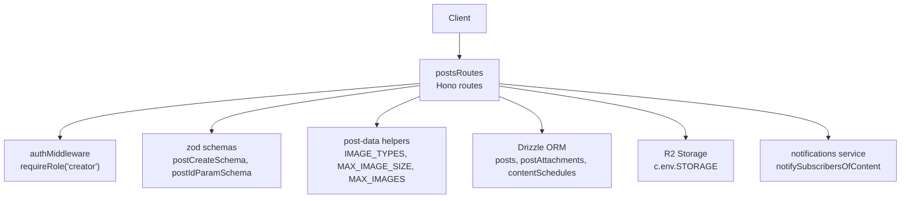
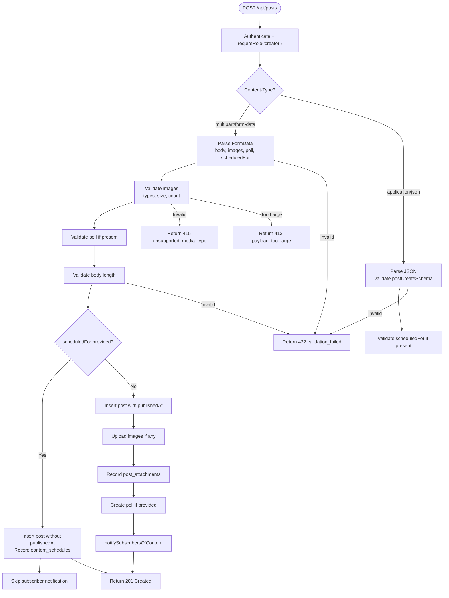
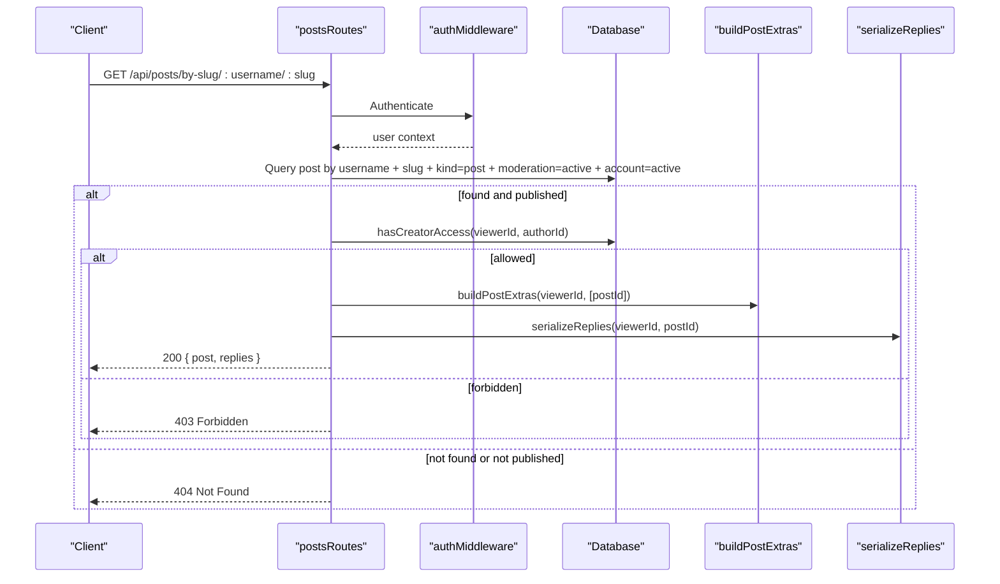
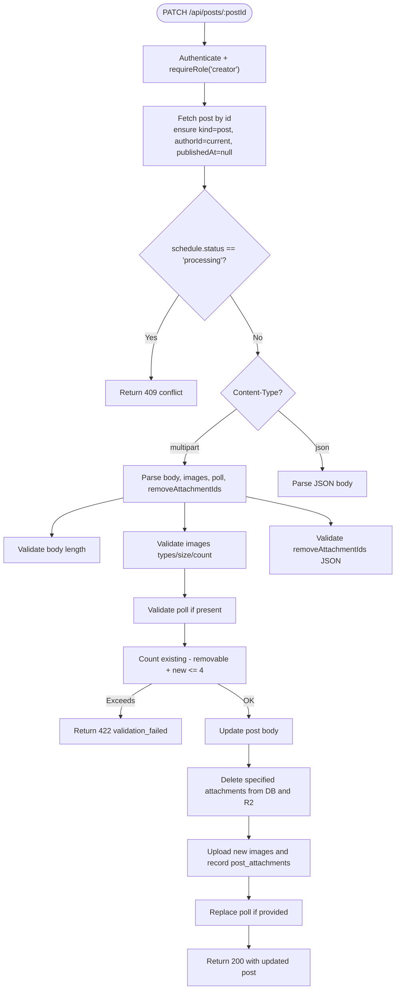
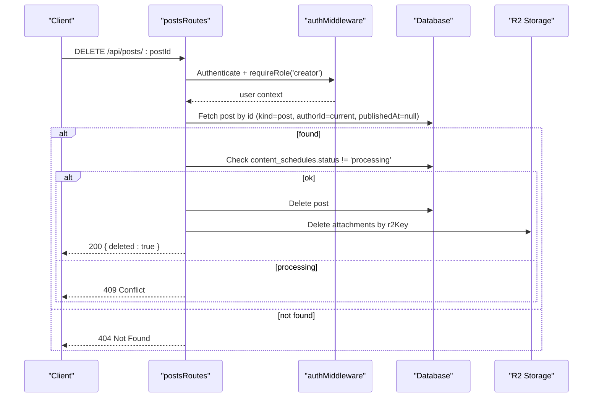
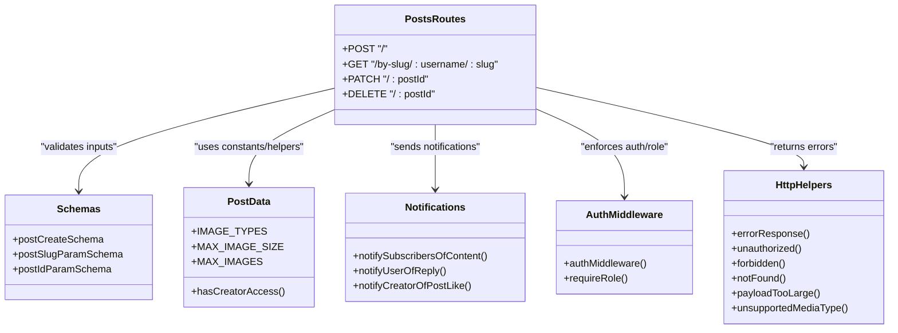

# Post CRUD Operations

<cite>
**Referenced Files in This Document**
- [posts.ts](file://src/worker/routes/posts.ts)
- [schemas.ts](file://src/worker/lib/schemas.ts)
- [post-data.ts](file://src/worker/lib/post-data.ts)
- [notifications.ts](file://src/worker/lib/notifications.ts)
- [auth.ts](file://src/worker/middleware/auth.ts)
- [http.ts](file://src/worker/lib/http.ts)
- [schema.ts](file://src/worker/db/schema.ts)
</cite>

## Table of Contents
1. [Introduction](#introduction)
2. [Project Structure](#project-structure)
3. [Core Components](#core-components)
4. [Architecture Overview](#architecture-overview)
5. [Detailed Component Analysis](#detailed-component-analysis)
6. [Dependency Analysis](#dependency-analysis)
7. [Performance Considerations](#performance-considerations)
8. [Troubleshooting Guide](#troubleshooting-guide)
9. [Conclusion](#conclusion)

## Introduction
This document provides detailed API documentation for post creation, reading, updating, and deletion operations. It covers:
- POST /api/posts supporting both multipart/form-data and JSON content types with validation rules (body length, image constraints, scheduling).
- GET /api/posts/by-slug/:username/:slug for retrieving published posts with access control.
- PATCH /api/posts/:postId for draft updates including attachment management.
- DELETE /api/posts/:postId for removing drafts.
It also documents authentication requirements (creator role), error responses, validation schemas, and integration with the notification system for subscriber updates.

## Project Structure
The post endpoints are implemented in a Hono-based worker route module. Validation schemas are centralized, media handling and constants live in a shared utility module, and notifications are handled via a dedicated service. Authentication is enforced through middleware that validates sessions and roles.



**Diagram sources**
- [posts.ts:419-542](file://src/worker/routes/posts.ts#L419-L542)
- [schemas.ts:25-28](file://src/worker/lib/schemas.ts#L25-L28)
- [post-data.ts:18-42](file://src/worker/lib/post-data.ts#L18-L42)
- [auth.ts:23-56](file://src/worker/middleware/auth.ts#L23-L56)
- [notifications.ts:257-299](file://src/worker/lib/notifications.ts#L257-L299)

**Section sources**
- [posts.ts:1-120](file://src/worker/routes/posts.ts#L1-L120)
- [auth.ts:1-57](file://src/worker/middleware/auth.ts#L1-L57)
- [schemas.ts:1-60](file://src/worker/lib/schemas.ts#L1-L60)
- [post-data.ts:1-42](file://src/worker/lib/post-data.ts#L1-L42)
- [notifications.ts:1-60](file://src/worker/lib/notifications.ts#L1-L60)

## Core Components
- Route handlers for posts: create, read by slug, update draft, delete draft.
- Validation schemas for request bodies and parameters.
- Image and file validation utilities and constants.
- Notification service for subscriber updates.
- Authentication middleware enforcing session and creator role.
- HTTP error helpers for consistent error responses.

Key responsibilities:
- POST /api/posts: parse multipart or JSON, validate body and images, optionally schedule publication, persist post and attachments, notify subscribers if immediately published.
- GET /api/posts/by-slug/:username/:slug: fetch published post with access control based on subscription membership.
- PATCH /api/posts/:postId: update draft post, manage attachments (add/remove), optional poll replacement.
- DELETE /api/posts/:postId: remove draft post and associated attachments.

**Section sources**
- [posts.ts:419-542](file://src/worker/routes/posts.ts#L419-L542)
- [posts.ts:555-623](file://src/worker/routes/posts.ts#L555-L623)
- [posts.ts:625-636](file://src/worker/routes/posts.ts#L625-L636)
- [posts.ts:640-678](file://src/worker/routes/posts.ts#L640-L678)
- [schemas.ts:25-39](file://src/worker/lib/schemas.ts#L25-L39)
- [post-data.ts:18-42](file://src/worker/lib/post-data.ts#L18-L42)
- [auth.ts:23-56](file://src/worker/middleware/auth.ts#L23-L56)
- [http.ts:23-75](file://src/worker/lib/http.ts#L23-L75)

## Architecture Overview
The post API follows a layered approach:
- Middleware layer enforces authentication and authorization.
- Route layer parses requests, validates inputs, and orchestrates business logic.
- Data layer uses Drizzle ORM to interact with SQLite.
- Storage layer persists media files to R2.
- Notification layer broadcasts updates to subscribers when content is published.

```mermaid
sequenceDiagram
participant C as "Client"
participant R as "postsRoutes"
participant A as "authMiddleware + requireRole"
participant V as "Validation (Zod)"
participant D as "Database (Drizzle)"
participant S as "R2 Storage"
participant N as "Notifications"
C->>R : POST /api/posts (multipart or JSON)
R->>A : Authenticate & enforce creator role
A-->>R : user context
R->>V : Validate body/images/poll/schedule
V-->>R : validated data or error
alt valid
R->>D : Insert post (draft or immediate publish)
opt images present
R->>S : Upload images
S-->>R : r2 keys
R->>D : Insert post_attachments
end
opt scheduledFor provided
R->>D : Insert content_schedules
else not scheduled
R->>N : notifySubscribersOfContent
end
R-->>C : 201 Created with post metadata
else invalid
R-->>C : 422/413/415 error response
end
```

**Diagram sources**
- [posts.ts:419-542](file://src/worker/routes/posts.ts#L419-L542)
- [auth.ts:23-56](file://src/worker/middleware/auth.ts#L23-L56)
- [schemas.ts:25-28](file://src/worker/lib/schemas.ts#L25-L28)
- [post-data.ts:18-42](file://src/worker/lib/post-data.ts#L18-L42)
- [notifications.ts:257-299](file://src/worker/lib/notifications.ts#L257-L299)

## Detailed Component Analysis

### POST /api/posts
- Purpose: Create a new post with optional images and poll; supports immediate publishing or scheduling.
- Authentication: Requires active session and creator role.
- Content Types:
  - multipart/form-data: fields include body, images (multiple File objects), optional pollQuestion and pollOptions (JSON string), optional scheduledFor (datetime).
  - application/json: body must match postCreateSchema (body required, scheduledFor optional datetime).
- Validation Rules:
  - Body: 1–500 characters.
  - Images: JPEG/PNG/WebP only; max 5 MB per image; maximum 4 images total.
  - Polls: question required if poll options provided; 2–4 options; question ≤ 140 chars; each option ≤ 80 chars.
  - Schedule: If provided, must be at least one minute in the future.
- Behavior:
  - Generates unique slug based on author and seed text.
  - Inserts post record; sets publishedAt immediately unless scheduledFor is provided.
  - Uploads images and records post_attachments.
  - Creates poll if provided.
  - Records content_schedules if scheduled.
  - Notifies subscribers if immediately published.
- Responses:
  - 201 Created with id, slug, body, createdAt, publishedAt, and schedule status when applicable.
  - 422 Validation errors with details for issues.
  - 413 Payload too large for oversized images.
  - 415 Unsupported media type for non-image formats.
  - 401 Unauthorized if no session.
  - 403 Forbidden if role is not creator.



**Diagram sources**
- [posts.ts:419-542](file://src/worker/routes/posts.ts#L419-L542)
- [schemas.ts:25-28](file://src/worker/lib/schemas.ts#L25-L28)
- [post-data.ts:18-42](file://src/worker/lib/post-data.ts#L18-L42)
- [notifications.ts:257-299](file://src/worker/lib/notifications.ts#L257-L299)

**Section sources**
- [posts.ts:419-542](file://src/worker/routes/posts.ts#L419-L542)
- [schemas.ts:25-28](file://src/worker/lib/schemas.ts#L25-L28)
- [post-data.ts:18-42](file://src/worker/lib/post-data.ts#L18-L42)
- [notifications.ts:257-299](file://src/worker/lib/notifications.ts#L257-L299)
- [http.ts:23-75](file://src/worker/lib/http.ts#L23-L75)

### GET /api/posts/by-slug/:username/:slug
- Purpose: Retrieve a published post by author username and slug.
- Authentication: Requires active session; access controlled via subscription membership to the creator.
- Access Control:
  - Post must be published (publishedAt set).
  - Author account must be active.
  - Viewer must have creator access (either same author or subscribed).
- Response:
  - 200 OK with serialized post and replies.
  - 404 Not Found if post not found, not published, or access denied.
  - 403 Forbidden if viewer lacks creator access.



**Diagram sources**
- [posts.ts:640-678](file://src/worker/routes/posts.ts#L640-L678)
- [post-data.ts:84-98](file://src/worker/lib/post-data.ts#L84-L98)

**Section sources**
- [posts.ts:640-678](file://src/worker/routes/posts.ts#L640-L678)
- [post-data.ts:84-98](file://src/worker/lib/post-data.ts#L84-L98)

### PATCH /api/posts/:postId
- Purpose: Update a draft post (not yet published). Supports replacing body, adding/removing images, and managing polls.
- Authentication: Requires active session and creator role; post must belong to the authenticated user and be unpublished.
- Input:
  - multipart/form-data: body, images (optional), pollQuestion/pollOptions (optional), removeAttachmentIds (JSON array of IDs to remove).
  - application/json: body only (via postCreateSchema).
- Validation:
  - Body: 1–500 characters.
  - Images: JPEG/PNG/WebP only; max 5 MB per image; total images after removal/addition must not exceed 4.
  - Polls: same rules as creation.
  - Attachment removal: removeAttachmentIds must be valid JSON array of strings.
- Behavior:
  - Updates post body.
  - Deletes specified attachments and corresponding storage objects.
  - Adds new images and records post_attachments.
  - Replaces poll entirely if provided.
  - Prevents editing while schedule is processing.
- Responses:
  - 200 OK with updated post serialization.
  - 404 Not Found if draft not found or not owned.
  - 409 Conflict if schedule is currently processing.
  - 422 Validation errors for body/images/poll/attachment IDs.
  - 413/415 for image size/type violations.



**Diagram sources**
- [posts.ts:555-623](file://src/worker/routes/posts.ts#L555-L623)
- [schemas.ts:25-28](file://src/worker/lib/schemas.ts#L25-L28)
- [post-data.ts:18-42](file://src/worker/lib/post-data.ts#L18-L42)

**Section sources**
- [posts.ts:555-623](file://src/worker/routes/posts.ts#L555-L623)
- [schemas.ts:25-28](file://src/worker/lib/schemas.ts#L25-L28)
- [post-data.ts:18-42](file://src/worker/lib/post-data.ts#L18-L42)

### DELETE /api/posts/:postId
- Purpose: Remove a draft post and its attachments.
- Authentication: Requires active session and creator role; post must belong to the authenticated user and be unpublished.
- Behavior:
  - Deletes post record.
  - Deletes all associated attachments from storage.
  - Prevents deletion while schedule is processing.
- Responses:
  - 200 OK with deleted flag.
  - 404 Not Found if draft not found or not owned.
  - 409 Conflict if schedule is currently processing.



**Diagram sources**
- [posts.ts:625-636](file://src/worker/routes/posts.ts#L625-L636)

**Section sources**
- [posts.ts:625-636](file://src/worker/routes/posts.ts#L625-L636)

### Error Responses and Validation Schemas
- Error format:
  - All errors return a JSON object with an error field containing code and message; optional details may include validation issues.
- Common codes:
  - validation_failed (422): input validation errors.
  - payload_too_large (413): image exceeds 5 MB.
  - unsupported_media_type (415): image type not JPEG/PNG/WebP.
  - unauthorized (401): missing or invalid session.
  - forbidden (403): insufficient role or access.
  - not_found (404): resource not found.
  - conflict (409): schedule processing state.
- Validation schemas:
  - postCreateSchema: body (string, 1–500 chars), scheduledFor (optional datetime).
  - postSlugParamSchema: username and slug required.
  - postIdParamSchema: postId required.

**Section sources**
- [http.ts:23-75](file://src/worker/lib/http.ts#L23-L75)
- [schemas.ts:25-39](file://src/worker/lib/schemas.ts#L25-L39)

### Authentication and Authorization
- Authentication:
  - Session-based via auth middleware; returns 401 if no session.
- Authorization:
  - requireRole('creator') enforces creator role for write operations.
  - Access control for reading by-slug checks subscription membership via hasCreatorAccess.

**Section sources**
- [auth.ts:23-56](file://src/worker/middleware/auth.ts#L23-L56)
- [post-data.ts:84-98](file://src/worker/lib/post-data.ts#L84-L98)

### Notification Integration
- Subscriber notifications:
  - When a post is immediately published (no schedule), notifySubscribersOfContent is invoked with creatorId, contentType='post', entityId, title, targetUrl.
  - Notifications are created per subscriber respecting preferences and deduplication.
- Reply notifications:
  - When a reply is created, notifyUserOfReply sends interaction notifications to mentioned users.
- Like notifications:
  - When a post is liked, notifyCreatorOfPostLike sends interaction notifications to the creator.

**Section sources**
- [notifications.ts:257-299](file://src/worker/lib/notifications.ts#L257-L299)
- [notifications.ts:328-360](file://src/worker/lib/notifications.ts#L328-L360)
- [notifications.ts:362-388](file://src/worker/lib/notifications.ts#L362-L388)

## Dependency Analysis
The post routes depend on several modules:
- Validation schemas define input contracts.
- post-data provides constants and helper functions for media and access control.
- Database schema defines tables for posts, attachments, schedules, polls, likes, and replies.
- Notifications service integrates with email and preference systems.



**Diagram sources**
- [posts.ts:419-678](file://src/worker/routes/posts.ts#L419-L678)
- [schemas.ts:25-39](file://src/worker/lib/schemas.ts#L25-L39)
- [post-data.ts:18-98](file://src/worker/lib/post-data.ts#L18-L98)
- [notifications.ts:257-388](file://src/worker/lib/notifications.ts#L257-L388)
- [auth.ts:23-56](file://src/worker/middleware/auth.ts#L23-L56)
- [http.ts:23-75](file://src/worker/lib/http.ts#L23-L75)

**Section sources**
- [posts.ts:419-678](file://src/worker/routes/posts.ts#L419-L678)
- [schemas.ts:25-39](file://src/worker/lib/schemas.ts#L25-L39)
- [post-data.ts:18-98](file://src/worker/lib/post-data.ts#L18-L98)
- [notifications.ts:257-388](file://src/worker/lib/notifications.ts#L257-L388)
- [auth.ts:23-56](file://src/worker/middleware/auth.ts#L23-L56)
- [http.ts:23-75](file://src/worker/lib/http.ts#L23-L75)

## Performance Considerations
- Batch database operations:
  - Draft updates use batched SQL statements to minimize round-trips.
- Parallel I/O:
  - Image uploads and attachment deletions are performed concurrently where possible.
- Efficient queries:
  - Post extras are built using parallel queries to aggregate attachments, likes, replies, and polls.
- Caching headers:
  - Media responses include cache-control headers to reduce repeated downloads.

[No sources needed since this section provides general guidance]

## Troubleshooting Guide
Common issues and resolutions:
- Validation failures (422):
  - Ensure body length is within 1–500 characters.
  - Verify images are JPEG/PNG/WebP and under 5 MB each; ensure total images do not exceed 4.
  - For multipart form-data, confirm poll options are valid JSON and meet length constraints.
- Schedule conflicts (409):
  - Do not edit or delete drafts while their schedule is processing; wait until status changes.
- Access denied (403):
  - Confirm the user has creator role for write operations.
  - For read-by-slug, ensure the viewer is subscribed to the creator or is the author.
- Not found (404):
  - Verify the post exists, is published (for read-by-slug), and belongs to the correct author.
- Media upload errors:
  - Check supported content types and sizes; ensure storage permissions are configured.

**Section sources**
- [http.ts:23-75](file://src/worker/lib/http.ts#L23-L75)
- [posts.ts:419-678](file://src/worker/routes/posts.ts#L419-L678)

## Conclusion
The post CRUD API provides robust creation, reading, updating, and deletion capabilities with strong validation, access control, and notification integration. It supports flexible content types, scheduling, and media attachments while maintaining consistent error handling and performance optimizations.

[No sources needed since this section summarizes without analyzing specific files]