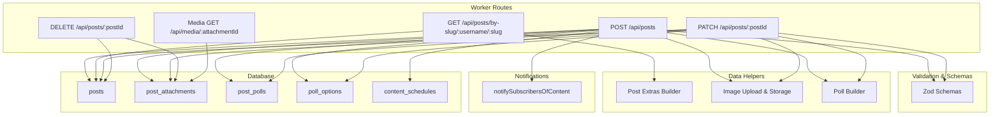
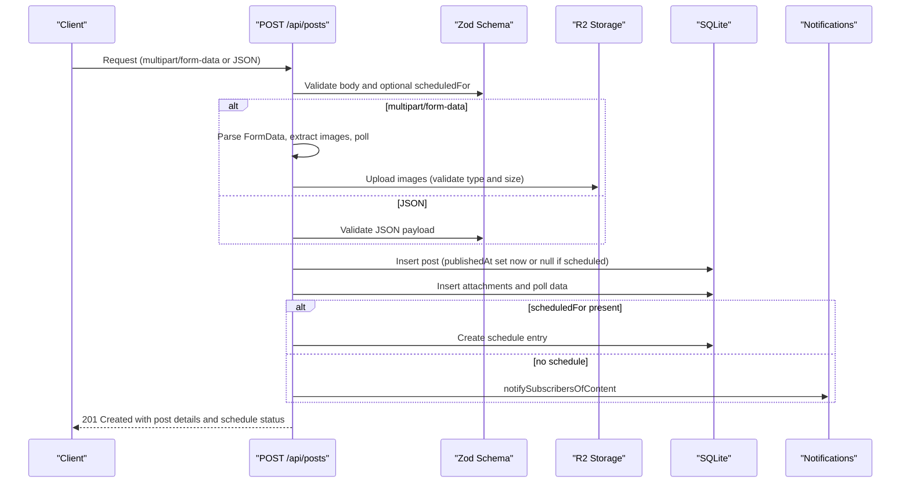
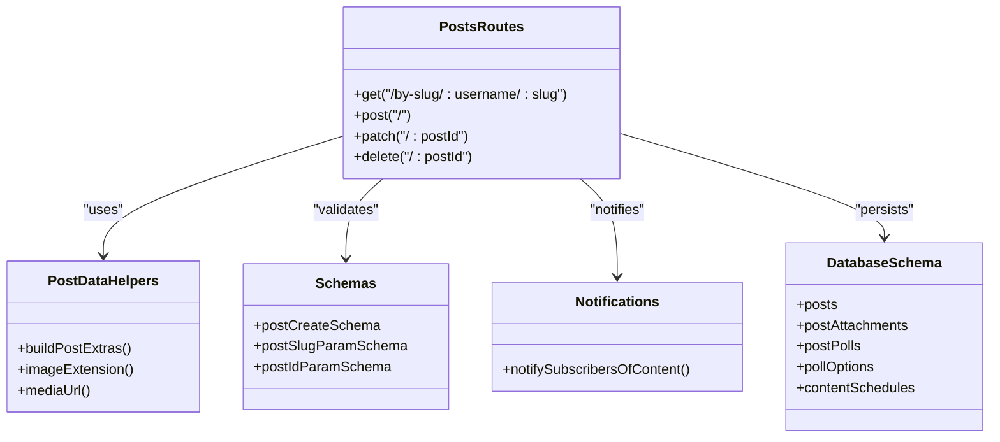

# Posts API

<cite>
**Referenced Files in This Document**
- [posts.ts](file://src/worker/routes/posts.ts)
- [post-data.ts](file://src/worker/lib/post-data.ts)
- [schemas.ts](file://src/worker/lib/schemas.ts)
- [notifications.ts](file://src/worker/lib/notifications.ts)
- [http.ts](file://src/worker/lib/http.ts)
- [schema.ts](file://src/worker/db/schema.ts)
- [posts.ts (frontend)](file://src/react-app/lib/posts.ts)
</cite>

## Table of Contents
1. [Introduction](#introduction)
2. [Project Structure](#project-structure)
3. [Core Components](#core-components)
4. [Architecture Overview](#architecture-overview)
5. [Detailed Component Analysis](#detailed-component-analysis)
6. [Dependency Analysis](#dependency-analysis)
7. [Performance Considerations](#performance-considerations)
8. [Troubleshooting Guide](#troubleshooting-guide)
9. [Conclusion](#conclusion)

## Introduction
This document provides comprehensive API documentation for the Posts API endpoints used to create, read, update, and delete posts. It covers:
- POST /api/posts for creating posts with multipart/form-data and JSON support
- GET /api/posts/by-slug/:username/:slug for retrieving a post by author username and slug
- PATCH /api/posts/:postId for updating draft posts
- DELETE /api/posts/:postId for deleting draft posts
- Poll creation and management
- Image upload handling (JPEG, PNG, WebP)
- Scheduling functionality for future publication
- Draft-only operations and validation rules
- Authentication requirements, error responses, and integration with the notification system for subscriber updates

## Project Structure
The Posts API is implemented as Hono routes within the worker layer. Core responsibilities are split across:
- Route handlers for HTTP endpoints
- Validation schemas using Zod
- Data helpers for building post extras, attachments, polls, and media URLs
- Notification utilities for subscriber updates and interactions
- Error response helpers for consistent error payloads
- Database schema definitions for posts, attachments, polls, likes, replies, and scheduling

**Diagram sources**
- [posts.ts:419-542](file://src/worker/routes/posts.ts#L419-L542)
- [posts.ts:640-678](file://src/worker/routes/posts.ts#L640-L678)
- [posts.ts:555-623](file://src/worker/routes/posts.ts#L555-L623)
- [posts.ts:625-636](file://src/worker/routes/posts.ts#L625-L636)
- [posts.ts:969-1027](file://src/worker/routes/posts.ts#L969-L1027)
- [post-data.ts:144-292](file://src/worker/lib/post-data.ts#L144-L292)
- [post-data.ts:17-42](file://src/worker/lib/post-data.ts#L17-L42)
- [notifications.ts:257-299](file://src/worker/lib/notifications.ts#L257-L299)
- [schema.ts:168-188](file://src/worker/db/schema.ts#L168-L188)
- [schema.ts:449-463](file://src/worker/db/schema.ts#L449-L463)
- [schema.ts:542-580](file://src/worker/db/schema.ts#L542-L580)
- [schema.ts:191-208](file://src/worker/db/schema.ts#L191-L208)

**Section sources**
- [posts.ts:419-542](file://src/worker/routes/posts.ts#L419-L542)
- [posts.ts:640-678](file://src/worker/routes/posts.ts#L640-L678)
- [posts.ts:555-623](file://src/worker/routes/posts.ts#L555-L623)
- [posts.ts:625-636](file://src/worker/routes/posts.ts#L625-L636)
- [posts.ts:969-1027](file://src/worker/routes/posts.ts#L969-L1027)
- [post-data.ts:144-292](file://src/worker/lib/post-data.ts#L144-L292)
- [post-data.ts:17-42](file://src/worker/lib/post-data.ts#L17-L42)
- [notifications.ts:257-299](file://src/worker/lib/notifications.ts#L257-L299)
- [schema.ts:168-188](file://src/worker/db/schema.ts#L168-L188)
- [schema.ts:449-463](file://src/worker/db/schema.ts#L449-L463)
- [schema.ts:542-580](file://src/worker/db/schema.ts#L542-L580)
- [schema.ts:191-208](file://src/worker/db/schema.ts#L191-L208)

## Core Components
- Post creation endpoint supports both multipart/form-data and JSON payloads.
- Retrieval endpoint returns a post by author username and slug along with replies.
- Update and delete endpoints operate on draft posts only.
- Polls can be created or updated alongside posts.
- Images are validated and uploaded to storage; metadata persisted in database.
- Scheduling allows setting a future publish time; immediate publish if none provided.
- Notifications are sent to subscribers when content is published immediately.

Key constants and validations:
- Body length limit: 500 characters
- Image types: JPEG, PNG, WebP
- Max image size: 5 MB per file
- Max images per post: 4
- Poll options: 2–4 options, question max 140 chars, option text max 80 chars

**Section sources**
- [posts.ts:419-542](file://src/worker/routes/posts.ts#L419-L542)
- [posts.ts:555-623](file://src/worker/routes/posts.ts#L555-L623)
- [posts.ts:640-678](file://src/worker/routes/posts.ts#L640-L678)
- [post-data.ts:17-42](file://src/worker/lib/post-data.ts#L17-L42)
- [schemas.ts:25-28](file://src/worker/lib/schemas.ts#L25-L28)

## Architecture Overview
The Posts API follows a layered architecture:
- HTTP layer: Hono route handlers parse requests, validate inputs, and return JSON responses.
- Validation layer: Zod schemas enforce request constraints.
- Business logic layer: Functions handle uploads, poll creation, scheduling, and access checks.
- Persistence layer: Drizzle ORM queries against SQLite tables for posts, attachments, polls, likes, and schedules.
- Notification layer: Subscriber notifications are triggered upon immediate publication.

**Diagram sources**
- [posts.ts:419-542](file://src/worker/routes/posts.ts#L419-L542)
- [post-data.ts:172-194](file://src/worker/lib/post-data.ts#L172-L194)
- [notifications.ts:257-299](file://src/worker/lib/notifications.ts#L257-L299)
- [schema.ts:168-188](file://src/worker/db/schema.ts#L168-L188)
- [schema.ts:449-463](file://src/worker/db/schema.ts#L449-L463)
- [schema.ts:542-580](file://src/worker/db/schema.ts#L542-L580)
- [schema.ts:191-208](file://src/worker/db/schema.ts#L191-L208)

## Detailed Component Analysis

### POST /api/posts — Create Post
- Supports multipart/form-data and JSON payloads.
- Multipart fields:
  - body: string (required if no images or poll)
  - images: File[] (JPEG, PNG, WebP; each ≤ 5 MB; up to 4 files)
  - pollQuestion: string (optional)
  - pollOptions: string[] (JSON array; 2–4 options)
  - scheduledFor: ISO datetime string (optional; must be at least 1 minute in the future)
- JSON payload:
  - body: string (1–500 characters)
  - scheduledFor: optional ISO datetime string
- Behavior:
  - Generates unique slug based on body or poll question.
  - If scheduledFor is provided, sets publishedAt to null and creates a schedule entry.
  - Otherwise, publishes immediately and notifies subscribers.
  - Stores images and poll data.
- Response:
  - 201 Created with id, slug, body, createdAt, publishedAt, and schedule object if applicable.

Request schemas:
- Multipart/form-data:
  - body: string (max 500 chars)
  - images: File[] (types: image/jpeg, image/png, image/webp; size ≤ 5MB; count ≤ 4)
  - pollQuestion: string (max 140 chars)
  - pollOptions: string[] (2–4 items; each ≤ 80 chars)
  - scheduledFor: string (ISO datetime; ≥ current time + 60 seconds)
- JSON:
  - body: string (1–500 chars)
  - scheduledFor: string (ISO datetime; optional)

Response schema:
- id: string
- slug: string
- body: string
- createdAt: number (Unix seconds)
- publishedAt: number | null (Unix seconds)
- schedule: { status: "pending", scheduledFor: number } | null

Error responses:
- 422 validation_failed for invalid body, images, poll, or schedule timing
- 415 unsupported_media_type for invalid image types
- 413 payload_too_large for oversized images

Authentication:
- Requires authenticated creator role via auth middleware.

Notification integration:
- On immediate publish, notifySubscribersOfContent is called with creatorId, contentType "post", entityId, title, targetUrl, and origin.

**Section sources**
- [posts.ts:419-542](file://src/worker/routes/posts.ts#L419-L542)
- [post-data.ts:172-194](file://src/worker/lib/post-data.ts#L172-L194)
- [post-data.ts:17-42](file://src/worker/lib/post-data.ts#L17-L42)
- [schemas.ts:25-28](file://src/worker/lib/schemas.ts#L25-L28)
- [notifications.ts:257-299](file://src/worker/lib/notifications.ts#L257-L299)
- [schema.ts:168-188](file://src/worker/db/schema.ts#L168-L188)
- [schema.ts:449-463](file://src/worker/db/schema.ts#L449-L463)
- [schema.ts:542-580](file://src/worker/db/schema.ts#L542-L580)
- [schema.ts:191-208](file://src/worker/db/schema.ts#L191-L208)

### GET /api/posts/by-slug/:username/:slug — Retrieve Post
- Retrieves a post by author username and slug.
- Access control:
  - Post must be active and published.
  - Viewer must have creator access (author or subscribed member).
- Returns serialized post with attachments, like/reply counts, viewer state, and poll data.
- Also returns replies associated with the post.

Response schema:
- post: FeedPost structure including id, type, slug, body, timestamps, author, attachments, likeCount, replyCount, viewerLiked, viewerSaved, poll
- replies: Array of PostReply objects

Access control:
- Uses hasCreatorAccess to verify viewer entitlement.

**Section sources**
- [posts.ts:640-678](file://src/worker/routes/posts.ts#L640-L678)
- [post-data.ts:144-292](file://src/worker/lib/post-data.ts#L144-L292)
- [schema.ts:168-188](file://src/worker/db/schema.ts#L168-L188)

### PATCH /api/posts/:postId — Update Draft Post
- Operates only on draft posts (kind=post, unpublished, authored by requester).
- Supports multipart/form-data and JSON payloads similar to creation.
- Allows removing existing attachments via removeAttachmentIds field.
- Validates total image count after removal and additions.
- Updates body, replaces poll, uploads new images, deletes removed attachments.
- Prevents editing while schedule is processing.

Request schemas:
- Multipart/form-data:
  - body: string (max 500 chars)
  - images: File[] (same constraints as creation)
  - pollQuestion, pollOptions: same constraints as creation
  - removeAttachmentIds: string[] (JSON array of attachment IDs to remove)
- JSON:
  - body: string (1–500 chars)

Response schema:
- post: FeedPost | null

Error responses:
- 404 not_found if draft not found
- 403 forbidden if moderated content cannot be edited until restored
- 409 conflict if schedule is processing
- 422 validation_failed for invalid inputs or exceeding limits

**Section sources**
- [posts.ts:555-623](file://src/worker/routes/posts.ts#L555-L623)
- [post-data.ts:172-194](file://src/worker/lib/post-data.ts#L172-L194)
- [schema.ts:168-188](file://src/worker/db/schema.ts#L168-L188)

### DELETE /api/posts/:postId — Delete Draft Post
- Operates only on draft posts (kind=post, unpublished, authored by requester).
- Prevents deletion while schedule is processing.
- Deletes post record and associated attachments from storage.

Response schema:
- deleted: true

Error responses:
- 404 not_found if draft not found
- 409 conflict if schedule is processing

**Section sources**
- [posts.ts:625-636](file://src/worker/routes/posts.ts#L625-L636)
- [schema.ts:168-188](file://src/worker/db/schema.ts#L168-L188)

### Media Endpoint — GET /api/media/:attachmentId
- Serves stored media attachments for posts and replies.
- Enforces access control based on post moderation status, author account status, and creator access.
- Returns raw binary with appropriate headers.

Response:
- Binary stream with content-type, cache-control, content-disposition, and content-length headers.

**Section sources**
- [posts.ts:969-1027](file://src/worker/routes/posts.ts#L969-L1027)
- [schema.ts:449-463](file://src/worker/db/schema.ts#L449-L463)

### Poll Creation and Management
- Polls are created alongside posts during creation or update.
- Poll data includes question and ordered options.
- Voting endpoint exists under polls routes; vote updates viewer’s selected option and returns poll summary.

Poll schema:
- id: string
- question: string
- closesAt: number | null
- viewerOptionId: string | null
- totalVotes: number
- options: Array<{ id, text, position, voteCount }>

**Section sources**
- [posts.ts:494-505](file://src/worker/routes/posts.ts#L494-L505)
- [posts.ts:613-617](file://src/worker/routes/posts.ts#L613-L617)
- [post-data.ts:197-288](file://src/worker/lib/post-data.ts#L197-L288)
- [schema.ts:542-580](file://src/worker/db/schema.ts#L542-L580)

### Scheduling Functionality
- When scheduledFor is provided, post is not published immediately.
- A schedule entry is created with status pending and nextAttemptAt set.
- Scheduled posts remain drafts until processing completes.

Schedule schema:
- postId: string
- creatorId: string
- status: "pending" | "processing" | "published" | "failed" | "canceled"
- scheduledFor: number (Unix timestamp)
- nextAttemptAt: number (Unix timestamp)
- attemptCount: number
- revision: number
- processingStartedAt: number | null
- lastErrorCode: string | null
- lastErrorMessage: string | null
- publishedAt: number | null
- createdAt: number
- updatedAt: number

**Section sources**
- [posts.ts:507-514](file://src/worker/routes/posts.ts#L507-L514)
- [schema.ts:191-208](file://src/worker/db/schema.ts#L191-L208)

### Draft Post Operations
- Draft-specific endpoints:
  - GET /api/posts/drafts/:postId retrieves a draft post with full context.
  - PATCH /api/posts/:postId updates draft content.
  - DELETE /api/posts/:postId removes draft post and attachments.
- Drafts are identified by kind=post and publishedAt being null.

**Section sources**
- [posts.ts:546-553](file://src/worker/routes/posts.ts#L546-L553)
- [posts.ts:555-623](file://src/worker/routes/posts.ts#L555-L623)
- [posts.ts:625-636](file://src/worker/routes/posts.ts#L625-L636)

### Validation Rules Summary
- Post body: 1–500 characters
- Image types: image/jpeg, image/png, image/webp
- Image size: ≤ 5 MB per file
- Max images per post: 4
- Poll question: ≤ 140 characters
- Poll options: 2–4 options, each ≤ 80 characters
- Schedule timing: must be at least 1 minute in the future

**Section sources**
- [post-data.ts:17-42](file://src/worker/lib/post-data.ts#L17-L42)
- [schemas.ts:25-28](file://src/worker/lib/schemas.ts#L25-L28)
- [posts.ts:444-452](file://src/worker/routes/posts.ts#L444-L452)
- [posts.ts:125-140](file://src/worker/routes/posts.ts#L125-L140)
- [posts.ts:142-170](file://src/worker/routes/posts.ts#L142-L170)

### Authentication Requirements
- All endpoints require authentication via authMiddleware.
- Creator role required for write operations (create, update, delete).
- Read endpoints enforce creator access checks for visibility.

**Section sources**
- [posts.ts:419-542](file://src/worker/routes/posts.ts#L419-L542)
- [posts.ts:640-678](file://src/worker/routes/posts.ts#L640-L678)
- [post-data.ts:84-98](file://src/worker/lib/post-data.ts#L84-L98)

### Error Responses
- Consistent error format with code, message, and optional details.
- Common codes: bad_request, validation_failed, unauthorized, forbidden, not_found, conflict, payload_too_large, unsupported_media_type, internal_server_error.

**Section sources**
- [http.ts:23-75](file://src/worker/lib/http.ts#L23-L75)

### Integration with Notification System
- Immediate post publication triggers notifySubscribersOfContent.
- Notifications include title, body, targetUrl, entityType, entityId, and dedupeKey.
- Email delivery respects user preferences and transactional email availability.

**Section sources**
- [notifications.ts:257-299](file://src/worker/lib/notifications.ts#L257-L299)
- [posts.ts:521-529](file://src/worker/routes/posts.ts#L521-L529)

## Dependency Analysis
The Posts API depends on several modules:
- Hono for routing and middleware
- Zod for input validation
- Drizzle ORM for database operations
- R2 storage for media files
- Notification utilities for subscriber updates

**Diagram sources**
- [posts.ts:419-542](file://src/worker/routes/posts.ts#L419-L542)
- [post-data.ts:144-292](file://src/worker/lib/post-data.ts#L144-L292)
- [schemas.ts:25-33](file://src/worker/lib/schemas.ts#L25-L33)
- [notifications.ts:257-299](file://src/worker/lib/notifications.ts#L257-L299)
- [schema.ts:168-188](file://src/worker/db/schema.ts#L168-L188)
- [schema.ts:449-463](file://src/worker/db/schema.ts#L449-L463)
- [schema.ts:542-580](file://src/worker/db/schema.ts#L542-L580)
- [schema.ts:191-208](file://src/worker/db/schema.ts#L191-L208)

**Section sources**
- [posts.ts:419-542](file://src/worker/routes/posts.ts#L419-L542)
- [post-data.ts:144-292](file://src/worker/lib/post-data.ts#L144-L292)
- [schemas.ts:25-33](file://src/worker/lib/schemas.ts#L25-L33)
- [notifications.ts:257-299](file://src/worker/lib/notifications.ts#L257-L299)
- [schema.ts:168-188](file://src/worker/db/schema.ts#L168-L188)
- [schema.ts:449-463](file://src/worker/db/schema.ts#L449-L463)
- [schema.ts:542-580](file://src/worker/db/schema.ts#L542-L580)
- [schema.ts:191-208](file://src/worker/db/schema.ts#L191-L208)

## Performance Considerations
- Batch database operations where possible to reduce round trips.
- Use parallel queries for building post extras (attachments, likes, replies, polls).
- Avoid unnecessary storage reads; rely on cached metadata when feasible.
- Ensure proper indexing on frequently queried columns (e.g., authorId, slug, publishedAt).

[No sources needed since this section provides general guidance]

## Troubleshooting Guide
Common issues and resolutions:
- Validation errors: Check body length, image types and sizes, poll constraints, and schedule timing.
- Unauthorized access: Verify authentication and creator role for write operations.
- Forbidden access: Ensure viewer has creator access to the post or media.
- Schedule conflicts: Do not edit or delete posts while schedule is processing.
- Media not found: Confirm post moderation status, author account status, and creator access.

**Section sources**
- [http.ts:23-75](file://src/worker/lib/http.ts#L23-L75)
- [posts.ts:419-542](file://src/worker/routes/posts.ts#L419-L542)
- [posts.ts:640-678](file://src/worker/routes/posts.ts#L640-L678)
- [posts.ts:969-1027](file://src/worker/routes/posts.ts#L969-L1027)

## Conclusion
The Posts API provides robust capabilities for managing short-form content with rich media, interactive polls, and scheduled publishing. It enforces strict validation, secure access controls, and integrates seamlessly with the notification system to keep subscribers informed. The modular design ensures maintainability and scalability for future enhancements.

[No sources needed since this section summarizes without analyzing specific files]