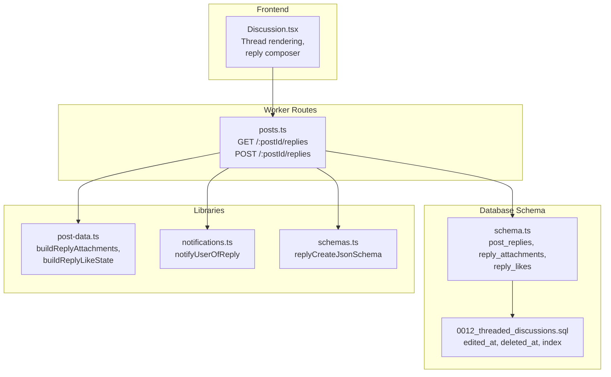
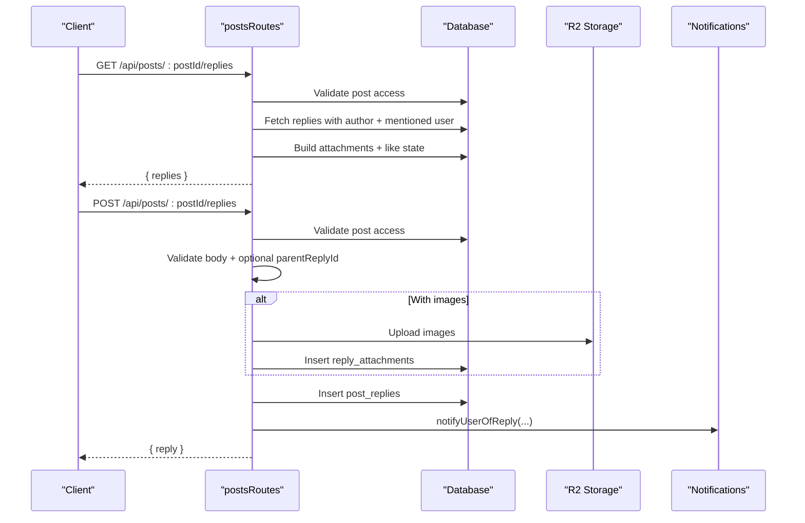
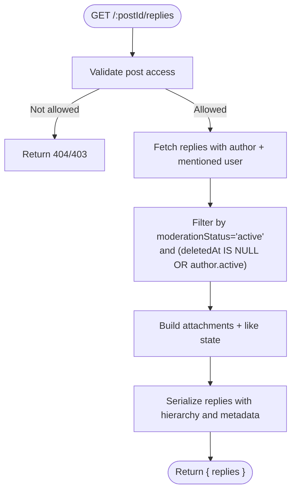
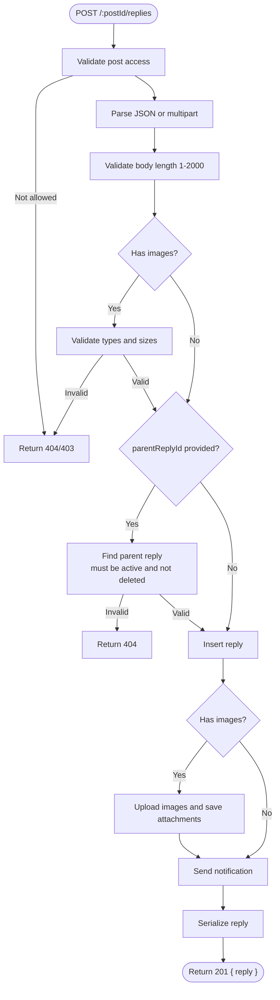
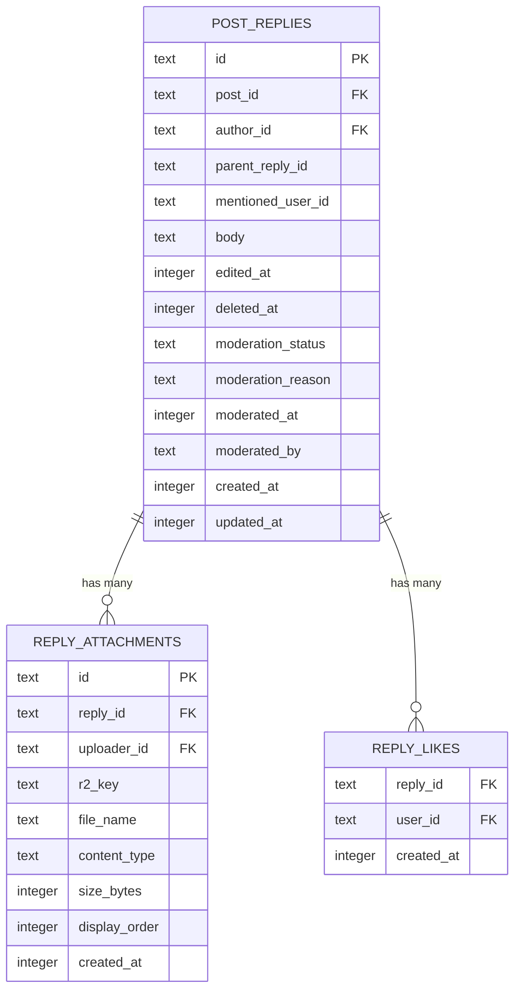
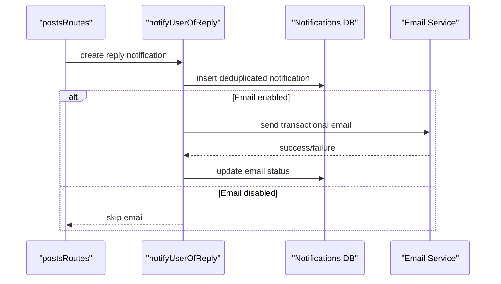
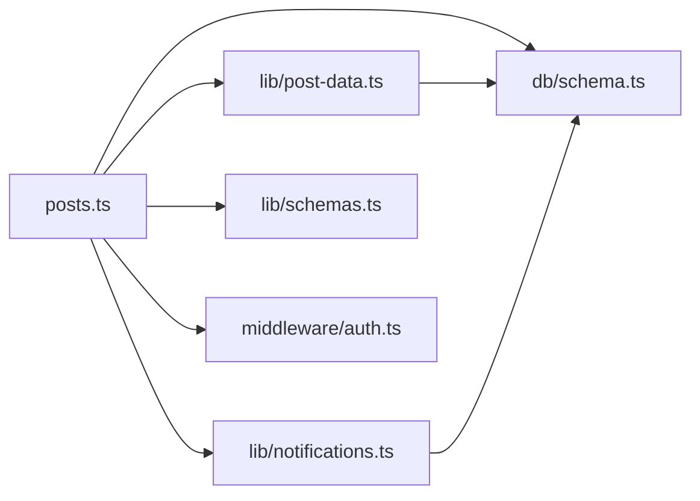

# Reply and Threading System

<cite>
**Referenced Files in This Document**
- [posts.ts](file://src/worker/routes/posts.ts)
- [schema.ts](file://src/worker/db/schema.ts)
- [0012_threaded_discussions.sql](file://drizzle/0012_threaded_discussions.sql)
- [notifications.ts](file://src/worker/lib/notifications.ts)
- [post-data.ts](file://src/worker/lib/post-data.ts)
- [schemas.ts](file://src/worker/lib/schemas.ts)
- [Discussion.tsx](file://src/react-app/components/Discussion.tsx)
</cite>

## Table of Contents
1. [Introduction](#introduction)
2. [Project Structure](#project-structure)
3. [Core Components](#core-components)
4. [Architecture Overview](#architecture-overview)
5. [Detailed Component Analysis](#detailed-component-analysis)
6. [Dependency Analysis](#dependency-analysis)
7. [Performance Considerations](#performance-considerations)
8. [Troubleshooting Guide](#troubleshooting-guide)
9. [Conclusion](#conclusion)

## Introduction
This document explains the reply and threading system for posts, focusing on:
- GET /api/posts/:postId/replies to retrieve threaded replies with parent-child relationships
- POST /api/posts/:postId/replies to create new replies with optional parentReplyId for threading
- Reply serialization including author information, attachments, like states, and mention context
- Validation rules (1–2000 characters), image attachment support, moderation status filtering, and deleted reply handling
- Hierarchical reply structure, visibility rules, and integration with the notification system for mentioning users

## Project Structure
The reply and threading system spans backend routes, database schema, utilities for data building, notifications, and the frontend discussion UI.

**Diagram sources**
- [posts.ts:682-775](file://src/worker/routes/posts.ts#L682-L775)
- [schema.ts:466-529](file://src/worker/db/schema.ts#L466-L529)
- [0012_threaded_discussions.sql:1-6](file://drizzle/0012_threaded_discussions.sql#L1-L6)
- [post-data.ts:294-349](file://src/worker/lib/post-data.ts#L294-L349)
- [notifications.ts:328-360](file://src/worker/lib/notifications.ts#L328-L360)
- [schemas.ts:55-58](file://src/worker/lib/schemas.ts#L55-L58)
- [Discussion.tsx:125-165](file://src/react-app/components/Discussion.tsx#L125-L165)

**Section sources**
- [posts.ts:682-775](file://src/worker/routes/posts.ts#L682-L775)
- [schema.ts:466-529](file://src/worker/db/schema.ts#L466-L529)
- [0012_threaded_discussions.sql:1-6](file://drizzle/0012_threaded_discussions.sql#L1-L6)
- [post-data.ts:294-349](file://src/worker/lib/post-data.ts#L294-L349)
- [notifications.ts:328-360](file://src/worker/lib/notifications.ts#L328-L360)
- [schemas.ts:55-58](file://src/worker/lib/schemas.ts#L55-L58)
- [Discussion.tsx:125-165](file://src/react-app/components/Discussion.tsx#L125-L165)

## Core Components
- API endpoints:
  - GET /api/posts/:postId/replies returns a flat list of replies that the frontend renders as a thread using parentReplyId.
  - POST /api/posts/:postId/replies creates a reply, supports optional parentReplyId, validates input, uploads images, and triggers notifications.
- Data models:
  - post_replies stores hierarchical replies with parentReplyId, mentionedUserId, editedAt, deletedAt, and moderation fields.
  - reply_attachments stores per-reply media.
  - reply_likes tracks likes per reply.
- Serialization:
  - serializeReplies builds reply objects with author info, attachments, like counts, viewer-like state, and mentions.
- Notifications:
  - notifyUserOfReply generates interaction notifications when someone comments or replies to a comment.

**Section sources**
- [posts.ts:305-369](file://src/worker/routes/posts.ts#L305-L369)
- [posts.ts:682-775](file://src/worker/routes/posts.ts#L682-L775)
- [schema.ts:466-529](file://src/worker/db/schema.ts#L466-L529)
- [post-data.ts:294-349](file://src/worker/lib/post-data.ts#L294-L349)
- [notifications.ts:328-360](file://src/worker/lib/notifications.ts#L328-L360)

## Architecture Overview
The reply system follows a clear request flow:
- Authentication and authorization are enforced via middleware.
- Post access is validated before reading or writing replies.
- Replies are fetched with joins to authors and mentioned users, filtered by moderation and account status.
- Attachments and like states are built in parallel for performance.
- On creation, images are uploaded, a reply is inserted, and a notification is sent to the mentioned user.

**Diagram sources**
- [posts.ts:682-775](file://src/worker/routes/posts.ts#L682-L775)
- [post-data.ts:294-349](file://src/worker/lib/post-data.ts#L294-L349)
- [notifications.ts:328-360](file://src/worker/lib/notifications.ts#L328-L360)

## Detailed Component Analysis

### GET /api/posts/:postId/replies
- Validates post accessibility (moderation, publication, creator access).
- Retrieves all replies for the post, ordered by creation time.
- Filters by moderationStatus = active and ensures either the reply is not deleted or the author’s account is active.
- Builds attachments and like state in parallel for efficiency.
- Serializes each reply with:
  - id, postId, parentReplyId (only if the parent exists in the result set)
  - body (empty string if deleted), timestamps, isDeleted flag
  - author object (null if deleted)
  - mentionedUser object (if present and not deleted)
  - attachments array (empty if deleted)
  - likeCount and viewerLiked flags (zero/false if deleted)

**Diagram sources**
- [posts.ts:682-691](file://src/worker/routes/posts.ts#L682-L691)
- [posts.ts:305-369](file://src/worker/routes/posts.ts#L305-L369)
- [post-data.ts:294-349](file://src/worker/lib/post-data.ts#L294-L349)

**Section sources**
- [posts.ts:682-691](file://src/worker/routes/posts.ts#L682-L691)
- [posts.ts:305-369](file://src/worker/routes/posts.ts#L305-L369)

### POST /api/posts/:postId/replies
- Validates post accessibility.
- Accepts JSON or multipart/form-data:
  - JSON uses replyCreateJsonSchema (body 1–2000 chars, optional parentReplyId).
  - Multipart validates body length (1–2000), extracts parentReplyId, and validates images.
- Image validation enforces supported types and size limits; errors map to appropriate HTTP codes.
- If parentReplyId is provided:
  - Parent reply must exist, belong to the same post, be active, and not deleted.
  - The mentioned user becomes the parent reply’s author.
- Inserts the reply, uploads images if any, then serializes and returns the created reply.
- Sends a notification to the mentioned user indicating a comment or thread reply.

**Diagram sources**
- [posts.ts:695-775](file://src/worker/routes/posts.ts#L695-L775)
- [schemas.ts:55-58](file://src/worker/lib/schemas.ts#L55-L58)
- [notifications.ts:328-360](file://src/worker/lib/notifications.ts#L328-L360)

**Section sources**
- [posts.ts:695-775](file://src/worker/routes/posts.ts#L695-L775)
- [schemas.ts:55-58](file://src/worker/lib/schemas.ts#L55-L58)

### Reply Data Model and Hierarchy
- post_replies includes:
  - id, postId, authorId, parentReplyId, mentionedUserId, body, editedAt, deletedAt, moderation fields, timestamps.
- Indices optimize queries by post_id, parent_reply_id, moderation status, and deletion ordering.
- Migration adds edited_at, deleted_at, and an index for efficient retrieval.

**Diagram sources**
- [schema.ts:466-529](file://src/worker/db/schema.ts#L466-L529)
- [0012_threaded_discussions.sql:1-6](file://drizzle/0012_threaded_discussions.sql#L1-L6)

**Section sources**
- [schema.ts:466-529](file://src/worker/db/schema.ts#L466-L529)
- [0012_threaded_discussions.sql:1-6](file://drizzle/0012_threaded_discussions.sql#L1-L6)

### Visibility Rules and Deleted Reply Handling
- Only replies with moderationStatus = 'active' are returned.
- Deleted replies are included only if the author’s account is still active; otherwise they are hidden.
- When a reply is deleted:
  - body is empty, author is null, attachments are empty, likeCount is zero, viewerLiked is false.
  - parentReplyId is preserved but may be normalized to null if the parent is not visible in the result set.
- Frontend hides fully deleted threads unless there are visible descendants.

**Section sources**
- [posts.ts:305-369](file://src/worker/routes/posts.ts#L305-L369)
- [Discussion.tsx:294-310](file://src/react-app/components/Discussion.tsx#L294-L310)

### Notification Integration for Mentions
- On reply creation, notifyUserOfReply is called with:
  - recipientId (mentioned user), actorId (author), postId, replyId, targetUrl, and isThreadReply flag.
- Notification type is 'reply_created', category 'interaction'.
- Title and body differ for top-level comments vs. thread replies.
- Email delivery respects user preferences and transactional email availability.

**Diagram sources**
- [notifications.ts:328-360](file://src/worker/lib/notifications.ts#L328-L360)

**Section sources**
- [posts.ts:765-773](file://src/worker/routes/posts.ts#L765-L773)
- [notifications.ts:328-360](file://src/worker/lib/notifications.ts#L328-L360)

### Frontend Threading and Composition
- Discussion component groups replies by parentReplyId and sorts children by createdAt.
- Root replies are sorted by score (likes + descendant count) or by newest/oldest.
- CommentComposer supports both JSON and multipart submissions, attaching images when present.
- Mentioning shows “to @username” based on parent or post author.

**Section sources**
- [Discussion.tsx:33-71](file://src/react-app/components/Discussion.tsx#L33-L71)
- [Discussion.tsx:125-165](file://src/react-app/components/Discussion.tsx#L125-L165)

## Dependency Analysis
- posts.ts depends on:
  - db/client for DB access
  - db/schema for table definitions
  - lib/post-data for attachment and like state builders
  - lib/notifications for reply notifications
  - lib/schemas for validation
  - middleware/auth for authentication and role checks
- post-data.ts depends on db/schema for query definitions and membership conditions.
- notifications.ts depends on db/schema and email utilities.

**Diagram sources**
- [posts.ts:1-58](file://src/worker/routes/posts.ts#L1-L58)
- [post-data.ts:1-16](file://src/worker/lib/post-data.ts#L1-L16)
- [notifications.ts:1-12](file://src/worker/lib/notifications.ts#L1-L12)
- [schemas.ts:1-10](file://src/worker/lib/schemas.ts#L1-L10)

**Section sources**
- [posts.ts:1-58](file://src/worker/routes/posts.ts#L1-L58)
- [post-data.ts:1-16](file://src/worker/lib/post-data.ts#L1-L16)
- [notifications.ts:1-12](file://src/worker/lib/notifications.ts#L1-L12)
- [schemas.ts:1-10](file://src/worker/lib/schemas.ts#L1-L10)

## Performance Considerations
- Parallelization:
  - buildReplyAttachments and buildReplyLikeState run concurrently to minimize latency.
- Indexes:
  - post_replies has indexes on post_id, parent_reply_id, moderation status, and deletion ordering to speed up queries.
- Filtering:
  - Moderation and account status filters reduce unnecessary data transfer.
- Attachment loading:
  - Media URLs are generated without fetching storage metadata at read time.

[No sources needed since this section provides general guidance]

## Troubleshooting Guide
Common issues and resolutions:
- Validation failures:
  - Body length outside 1–2000 characters returns 422 with validation_failed.
  - Unsupported image types return 415; oversized images return 413.
- Access denied:
  - If the post is not accessible (not published, moderated, or requires creator access), returns 404 or 403.
- Parent reply not found:
  - If parentReplyId is invalid or belongs to another post, returns 404.
- Deleted replies:
  - Deleted replies appear with empty content and no author; ensure frontend handles null author gracefully.
- Notifications:
  - If email is disabled or unavailable, notifications are stored but not emailed; check emailStatus in notifications table.

**Section sources**
- [posts.ts:695-775](file://src/worker/routes/posts.ts#L695-L775)
- [posts.ts:682-691](file://src/worker/routes/posts.ts#L682-L691)
- [notifications.ts:153-234](file://src/worker/lib/notifications.ts#L153-L234)

## Conclusion
The reply and threading system provides a robust, secure, and performant mechanism for nested conversations on posts. It enforces strict validation, supports rich media, handles moderation and deletion semantics, and integrates seamlessly with the notification system to keep users informed. The design balances backend efficiency with frontend usability, enabling smooth threaded discussions.