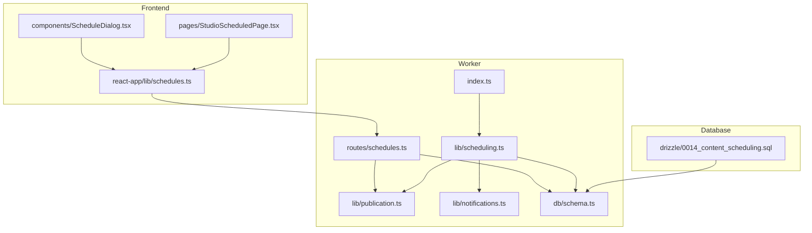
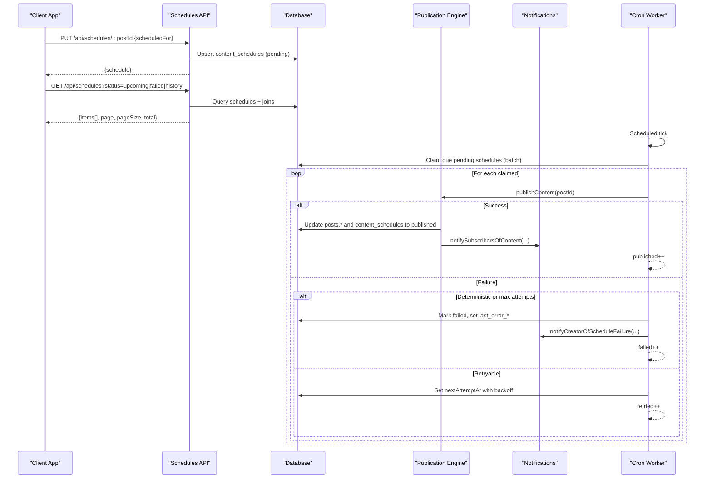
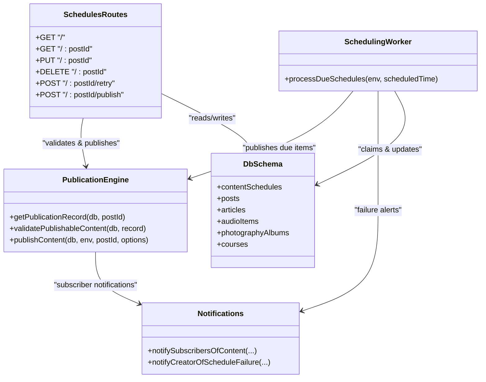

# Content Scheduling API

<cite>
**Referenced Files in This Document**
- [schedules.ts](file://src/worker/routes/schedules.ts)
- [scheduling.ts](file://src/worker/lib/scheduling.ts)
- [publication.ts](file://src/worker/lib/publication.ts)
- [notifications.ts](file://src/worker/lib/notifications.ts)
- [schema.ts](file://src/worker/db/schema.ts)
- [0014_content_scheduling.sql](file://drizzle/0014_content_scheduling.sql)
- [index.ts](file://src/worker/index.ts)
- [schedules.ts (frontend)](file://src/react-app/lib/schedules.ts)
- [ScheduleDialog.tsx](file://src/react-app/components/ScheduleDialog.tsx)
- [StudioScheduledPage.tsx](file://src/react-app/pages/StudioScheduledPage.tsx)
</cite>

## Table of Contents
1. [Introduction](#introduction)
2. [Project Structure](#project-structure)
3. [Core Components](#core-components)
4. [Architecture Overview](#architecture-overview)
5. [Detailed Component Analysis](#detailed-component-analysis)
6. [Dependency Analysis](#dependency-analysis)
7. [Performance Considerations](#performance-considerations)
8. [Troubleshooting Guide](#troubleshooting-guide)
9. [Conclusion](#conclusion)
10. [Appendices](#appendices)

## Introduction
This document provides detailed API documentation for the content scheduling endpoints. It covers HTTP methods, URL patterns, request/response schemas, validation rules, time zone handling, conflict resolution, automated publishing workflows, error handling, retry mechanisms, and monitoring. It also explains how one-time schedules work, how to perform bulk operations via the UI, and how webhook/email notifications are used for completion and failure scenarios.

## Project Structure
The scheduling system spans routes, background processing, database schema, and frontend integration:
- Routes define REST endpoints for creating, updating, deleting, querying, retrying, and publishing scheduled content.
- Background worker processes due schedules on a cron-like schedule, with retries and failure handling.
- Database schema defines the content_schedules table and related indexes.
- Frontend exposes scheduling UI and utilities to interact with the API.

**Diagram sources**
- [schedules.ts:1-295](file://src/worker/routes/schedules.ts#L1-L295)
- [scheduling.ts:1-127](file://src/worker/lib/scheduling.ts#L1-L127)
- [publication.ts:1-273](file://src/worker/lib/publication.ts#L1-L273)
- [notifications.ts:1-200](file://src/worker/lib/notifications.ts#L1-L200)
- [schema.ts:190-208](file://src/worker/db/schema.ts#L190-L208)
- [index.ts:1-71](file://src/worker/index.ts#L1-L71)
- [schedules.ts (frontend):1-73](file://src/react-app/lib/schedules.ts#L1-L73)
- [ScheduleDialog.tsx:1-108](file://src/react-app/components/ScheduleDialog.tsx#L1-L108)
- [StudioScheduledPage.tsx:35-143](file://src/react-app/pages/StudioScheduledPage.tsx#L35-L143)
- [0014_content_scheduling.sql:1-47](file://drizzle/0014_content_scheduling.sql#L1-L47)

**Section sources**
- [schedules.ts:1-295](file://src/worker/routes/schedules.ts#L1-L295)
- [scheduling.ts:1-127](file://src/worker/lib/scheduling.ts#L1-L127)
- [publication.ts:1-273](file://src/worker/lib/publication.ts#L1-L273)
- [notifications.ts:1-200](file://src/worker/lib/notifications.ts#L1-L200)
- [schema.ts:190-208](file://src/worker/db/schema.ts#L190-L208)
- [index.ts:1-71](file://src/worker/index.ts#L1-L71)
- [schedules.ts (frontend):1-73](file://src/react-app/lib/schedules.ts#L1-L73)
- [ScheduleDialog.tsx:1-108](file://src/react-app/components/ScheduleDialog.tsx#L1-L108)
- [StudioScheduledPage.tsx:35-143](file://src/react-app/pages/StudioScheduledPage.tsx#L35-L143)
- [0014_content_scheduling.sql:1-47](file://drizzle/0014_content_scheduling.sql#L1-L47)

## Core Components
- REST API endpoints for schedule management under /api/schedules.
- Background scheduler that claims and publishes due items with retry logic.
- Publication engine validating content and performing atomic updates.
- Notification subsystem sending creator alerts on failures and subscribers on publish.
- Database model for content_schedules with status transitions and timestamps.

Key responsibilities:
- Create/update/cancel schedules; query upcoming/failed/history lists.
- Enforce constraints: minimum scheduling delay, ownership, draft-only scheduling, processing locks.
- Automated publishing with exponential backoff and deterministic failure handling.
- Notify creators on failure and subscribers on successful publication.

**Section sources**
- [schedules.ts:1-295](file://src/worker/routes/schedules.ts#L1-L295)
- [scheduling.ts:1-127](file://src/worker/lib/scheduling.ts#L1-L127)
- [publication.ts:1-273](file://src/worker/lib/publication.ts#L1-L273)
- [notifications.ts:1-200](file://src/worker/lib/notifications.ts#L1-L200)
- [schema.ts:190-208](file://src/worker/db/schema.ts#L190-L208)

## Architecture Overview
The scheduling architecture combines synchronous API calls with an asynchronous worker:

**Diagram sources**
- [schedules.ts:128-295](file://src/worker/routes/schedules.ts#L128-L295)
- [scheduling.ts:42-127](file://src/worker/lib/scheduling.ts#L42-L127)
- [publication.ts:197-273](file://src/worker/lib/publication.ts#L197-L273)
- [notifications.ts:284-326](file://src/worker/lib/notifications.ts#L284-L326)
- [index.ts:62-71](file://src/worker/index.ts#L62-L71)

**Section sources**
- [schedules.ts:128-295](file://src/worker/routes/schedules.ts#L128-L295)
- [scheduling.ts:42-127](file://src/worker/lib/scheduling.ts#L42-L127)
- [publication.ts:197-273](file://src/worker/lib/publication.ts#L197-L273)
- [notifications.ts:284-326](file://src/worker/lib/notifications.ts#L284-L326)
- [index.ts:62-71](file://src/worker/index.ts#L62-L71)

## Detailed Component Analysis

### API Endpoints
Base path: /api/schedules
Authentication: Creator role required via middleware.

- GET /api/schedules
  - Purpose: List schedules with filtering and pagination.
  - Query parameters:
    - page: integer >= 1 (default 1)
    - pageSize: integer 1..50 (default 20)
    - status: enum ["upcoming", "failed", "history"] (default "upcoming")
    - type: enum ["all", "post", "article", "audio", "photography", "course"] (default "all")
  - Response:
    - items: array of schedule summaries
    - page: number
    - pageSize: number
    - total: number
  - Notes:
    - "upcoming" includes pending and processing statuses.
    - "failed" includes only failed.
    - "history" includes published and canceled.

- GET /api/schedules/:postId
  - Purpose: Get a single schedule by post ID.
  - Path param: postId (string, min 1, max 128)
  - Response: { schedule: ScheduleSummary }

- PUT /api/schedules/:postId
  - Purpose: Create or update a schedule for a draft post.
  - Path param: postId
  - Request body: { scheduledFor: string (ISO datetime with offset) }
  - Validation:
    - scheduledFor must be at least 60 seconds in the future.
    - Only draft content can be scheduled.
    - If already processing, returns conflict.
  - Response: { schedule: ScheduleSummary | null }

- DELETE /api/schedules/:postId
  - Purpose: Cancel a schedule if not processing/published.
  - Path param: postId
  - Behavior: Sets status to canceled; idempotent (returns success even if not found).
  - Response: { canceled: true, schedule: ScheduleSummary | null }

- POST /api/schedules/:postId/retry
  - Purpose: Retry a failed schedule after fixes.
  - Path param: postId
  - Constraints: Only allowed when status is failed; validates publishability again.
  - Response: { schedule: ScheduleSummary | null }

- POST /api/schedules/:postId/publish
  - Purpose: Publish immediately (bypasses schedule).
  - Path param: postId
  - Behavior: Validates and publishes; updates schedule to published.
  - Response: { published: true, schedule: ScheduleSummary | null }

Response shape (ScheduleSummary):
- Fields include postId, contentId, contentType, slug, title, status, scheduledFor (seconds), nextAttemptAt (seconds), attemptCount, revision, processingStartedAt (seconds|null), publishedAt (seconds|null), failure (code, message|null), createdAt, updatedAt.

Time zone handling:
- Input uses ISO datetime with offset; server converts to UTC timestamps stored as integers (seconds).
- Frontend displays local timezone and enforces minimum 60-second delay.

Conflict resolution:
- PUT will reject if the schedule is currently processing.
- DELETE will reject if processing or already published.
- PUT upserts existing schedule atomically, incrementing revision and resetting state.

Validation rules:
- Minimum scheduling delay enforced server-side (>= 60s from now).
- Ownership checks ensure creator owns the post.
- Draft-only scheduling enforced; published content cannot be rescheduled.
- Publication validation runs before scheduling and retry to catch invalid states early.

Error responses:
- 404: Not found (content or schedule missing).
- 403: Forbidden (ownership or moderation/account issues).
- 409: Conflict (processing or already published).
- 422: Validation errors (e.g., too soon, parent unpublished, missing fields).

Batch scheduling:
- No dedicated batch endpoint exists; use multiple PUT calls per post.
- The UI supports managing multiple schedules sequentially.

Webhook/email notifications:
- On successful publish: subscribers notified via internal notification system.
- On schedule failure: creator receives a forced email notification about the failure.

Monitoring:
- Use GET /api/schedules with status filters to monitor upcoming, failed, and history.
- Admin health endpoint aggregates counts including failed schedules and overdue items.

**Section sources**
- [schedules.ts:128-295](file://src/worker/routes/schedules.ts#L128-L295)
- [schedules.ts (frontend):1-73](file://src/react-app/lib/schedules.ts#L1-L73)
- [ScheduleDialog.tsx:1-108](file://src/react-app/components/ScheduleDialog.tsx#L1-L108)
- [StudioScheduledPage.tsx:35-143](file://src/react-app/pages/StudioScheduledPage.tsx#L35-L143)

### Background Scheduler
Responsibilities:
- Claim due pending schedules in batches.
- Attempt publication; handle deterministic vs retryable errors.
- Apply backoff delays for retries; cap at maximum attempts.
- Fail schedules deterministically or after max attempts; notify creator.
- Log metrics for due, published, retried, failed counts.

Key constants:
- MAX_ATTEMPTS = 3
- STALE_PROCESSING_MS = 5 minutes
- DUE_BATCH_SIZE = 20

Retry strategy:
- First retry delay: 60 seconds.
- Subsequent retry delay: 5 minutes.
- Deterministic errors fail immediately without retries.

Stale processing recovery:
- Any schedule stuck in processing beyond stale threshold is reset to pending.

**Section sources**
- [scheduling.ts:1-127](file://src/worker/lib/scheduling.ts#L1-L127)

### Publication Engine
Responsibilities:
- Fetch publication record across content types.
- Validate publishability based on content kind-specific rules.
- Atomically update content and schedule records to published.
- Notify subscribers upon successful publish.

Validation examples:
- Posts: require text, attachments, or polls; poll needs >= 2 options.
- Articles: require title, markdown, cover photo.
- Audio: require audio file, cover, and published parent collection.
- Photography: require album with published photos and cover.
- Courses: require modules and at least one published lesson.

Already-published behavior:
- If content is already published, schedule is marked published with original publishedAt timestamp.

**Section sources**
- [publication.ts:1-273](file://src/worker/lib/publication.ts#L1-L273)

### Notifications
Responsibilities:
- Send subscriber notifications on content publish.
- Send creator failure notifications on schedule failures.
- Respect user preferences and deduplicate notifications.

Types:
- content_published: sent to subscribers.
- content_schedule_failed: sent to creator with reason and target URL.

**Section sources**
- [notifications.ts:1-200](file://src/worker/lib/notifications.ts#L1-L200)
- [notifications.ts:284-326](file://src/worker/lib/notifications.ts#L284-L326)

### Database Schema
content_schedules table:
- Primary key: post_id
- Status: pending, processing, published, failed, canceled
- Timestamps: scheduled_for, next_attempt_at, processing_started_at, published_at, created_at, updated_at
- Metadata: attempt_count, revision, last_error_code, last_error_message

Indexes:
- Due queue: status + next_attempt_at
- Creator filter: creator_id + status + scheduled_for

**Section sources**
- [schema.ts:190-208](file://src/worker/db/schema.ts#L190-L208)
- [0014_content_scheduling.sql:26-47](file://drizzle/0014_content_scheduling.sql#L26-L47)

### Frontend Integration
- Utility functions wrap API calls for listing, detail, save, cancel, retry, and publish.
- Schedule dialog handles local timezone conversion and minimum delay enforcement.
- Studio scheduled page allows editing, rescheduling, retrying, publishing, and deleting drafts.

**Section sources**
- [schedules.ts (frontend):1-73](file://src/react-app/lib/schedules.ts#L1-L73)
- [ScheduleDialog.tsx:1-108](file://src/react-app/components/ScheduleDialog.tsx#L1-L108)
- [StudioScheduledPage.tsx:35-143](file://src/react-app/pages/StudioScheduledPage.tsx#L35-L143)

## Dependency Analysis

**Diagram sources**
- [schedules.ts:1-295](file://src/worker/routes/schedules.ts#L1-L295)
- [scheduling.ts:1-127](file://src/worker/lib/scheduling.ts#L1-L127)
- [publication.ts:1-273](file://src/worker/lib/publication.ts#L1-L273)
- [notifications.ts:1-200](file://src/worker/lib/notifications.ts#L1-L200)
- [schema.ts:190-208](file://src/worker/db/schema.ts#L190-L208)

**Section sources**
- [schedules.ts:1-295](file://src/worker/routes/schedules.ts#L1-L295)
- [scheduling.ts:1-127](file://src/worker/lib/scheduling.ts#L1-L127)
- [publication.ts:1-273](file://src/worker/lib/publication.ts#L1-L273)
- [notifications.ts:1-200](file://src/worker/lib/notifications.ts#L1-L200)
- [schema.ts:190-208](file://src/worker/db/schema.ts#L190-L208)

## Performance Considerations
- Batch size for due schedules is capped at 20 to avoid long-running jobs.
- Stale processing recovery prevents deadlocks by resetting stuck items.
- Backoff strategy minimizes load on external services during transient failures.
- Pagination limits pageSize to 50 to control response sizes.
- Atomic upserts and batched DB updates reduce contention.

[No sources needed since this section provides general guidance]

## Troubleshooting Guide
Common issues and resolutions:
- Schedule too soon: Ensure scheduledFor is at least 60 seconds in the future.
- Processing conflict: Wait until current processing completes or retry later.
- Published cannot be canceled: Published schedules cannot be canceled; delete the draft instead.
- Parent unpublished (audio): Publish the parent album or podcast before scheduling audio.
- Missing required fields: Add required content elements (title, markdown, cover, etc.).
- Failed retries: Check last_error_code and last_error_message; fix underlying issue and retry.

Monitoring:
- Use GET /api/schedules with status filters to track upcoming, failed, and history.
- Review logs for events like content_schedule_retry, content_schedule_failed, content_published.

**Section sources**
- [schedules.ts:170-295](file://src/worker/routes/schedules.ts#L170-L295)
- [scheduling.ts:93-127](file://src/worker/lib/scheduling.ts#L93-L127)
- [publication.ts:113-195](file://src/worker/lib/publication.ts#L113-L195)

## Conclusion
The Content Scheduling API provides robust, validated, and resilient scheduling for multiple content types. It integrates with a background worker for reliable automation, supports retry and failure handling, and offers comprehensive monitoring through list endpoints. The system ensures data integrity, respects ownership and moderation constraints, and notifies stakeholders appropriately.

[No sources needed since this section summarizes without analyzing specific files]

## Appendices

### One-Time vs Recurring Schedules
- One-time schedules: Each PUT creates or updates a single schedule entry for a post.
- Recurring schedules: Not implemented natively; implement recurring behavior by creating multiple schedule entries programmatically.

### Bulk Scheduling Operations
- No dedicated batch endpoint; call PUT /api/schedules/:postId multiple times for different posts.
- UI supports sequential operations for managing multiple schedules.

### Monitoring Scheduled Task Status
- Use GET /api/schedules with status filters:
  - upcoming: pending and processing
  - failed: failed
  - history: published and canceled
- Inspect failure details via failure.code and failure.message in schedule summary.

### Webhook Notifications
- Subscriber notifications are handled internally; no public webhook endpoint exposed.
- Creator failure notifications are sent via email; force-sent regardless of preferences.

**Section sources**
- [schedules.ts (frontend):1-73](file://src/react-app/lib/schedules.ts#L1-L73)
- [notifications.ts:284-326](file://src/worker/lib/notifications.ts#L284-L326)