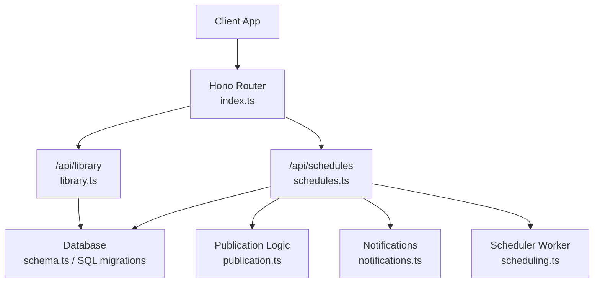
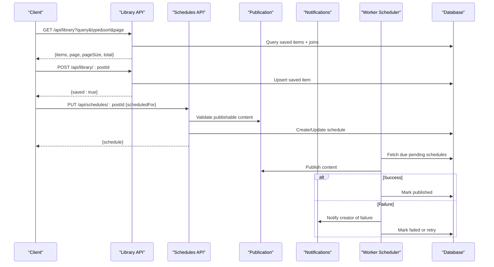
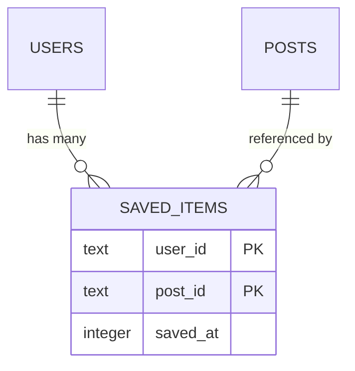
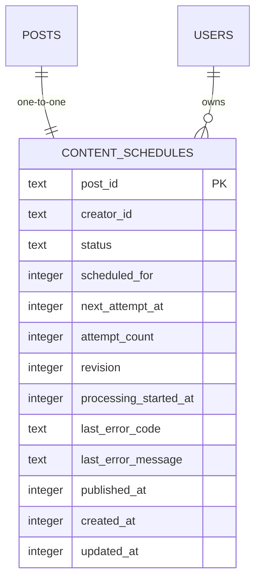
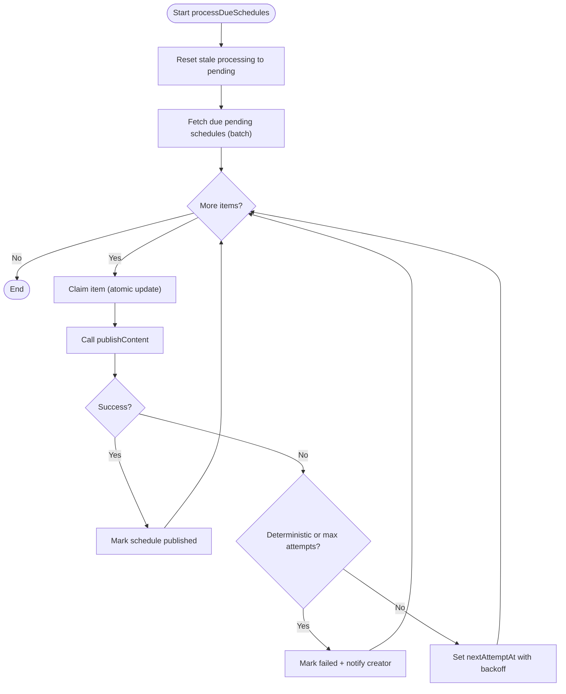
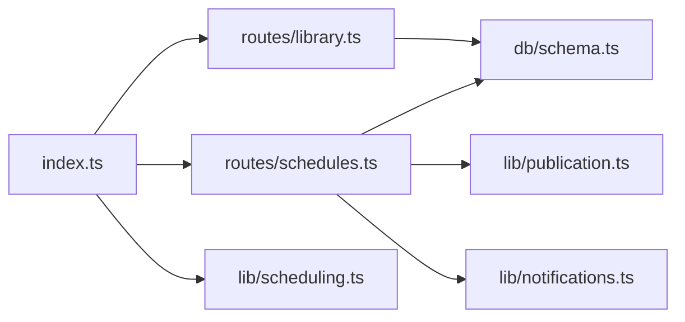

# Library & Scheduling API

<cite>
**Referenced Files in This Document**
- [library.ts](file://src/worker/routes/library.ts)
- [schedules.ts](file://src/worker/routes/schedules.ts)
- [index.ts](file://src/worker/index.ts)
- [schema.ts](file://src/worker/db/schema.ts)
- [0013_saved_library.sql](file://drizzle/0013_saved_library.sql)
- [0014_content_scheduling.sql](file://drizzle/0014_content_scheduling.sql)
- [library.ts (client)](file://src/react-app/lib/library.ts)
- [schedules.ts (client)](file://src/react-app/lib/schedules.ts)
- [scheduling.ts](file://src/worker/lib/scheduling.ts)
- [publication.ts](file://src/worker/lib/publication.ts)
- [notifications.ts](file://src/worker/lib/notifications.ts)
</cite>

## Table of Contents
1. [Introduction](#introduction)
2. [Project Structure](#project-structure)
3. [Core Components](#core-components)
4. [Architecture Overview](#architecture-overview)
5. [Detailed Component Analysis](#detailed-component-analysis)
6. [Dependency Analysis](#dependency-analysis)
7. [Performance Considerations](#performance-considerations)
8. [Troubleshooting Guide](#troubleshooting-guide)
9. [Conclusion](#conclusion)

## Introduction
This document provides comprehensive API documentation for library management and content scheduling endpoints. It covers saved content operations, bookmark management, content organization within personal libraries, and scheduling endpoints for automated publishing, batch processing, and cron-like task management. It also explains content relationships, metadata handling, search capabilities, scheduling constraints, conflict resolution, and notification triggers for scheduled tasks.

## Project Structure
The backend is a Hono-based worker that exposes REST APIs under /api prefixes. The library and schedules modules are mounted as separate route groups:
- /api/library: Personal library operations (list, save, remove).
- /api/schedules: Content scheduling operations (list, get, create/update schedule, cancel, retry, publish now).

**Diagram sources**
- [index.ts:24-45](file://src/worker/index.ts#L24-L45)
- [library.ts:31-170](file://src/worker/routes/library.ts#L31-L170)
- [schedules.ts:25-295](file://src/worker/routes/schedules.ts#L25-L295)
- [schema.ts:168-208](file://src/worker/db/schema.ts#L168-L208)
- [publication.ts:197-256](file://src/worker/lib/publication.ts#L197-L256)
- [notifications.ts:301-326](file://src/worker/lib/notifications.ts#L301-L326)
- [scheduling.ts:42-127](file://src/worker/lib/scheduling.ts#L42-L127)

**Section sources**
- [index.ts:24-45](file://src/worker/index.ts#L24-L45)

## Core Components
- Library API: Provides paginated listing with filtering by type and text search across creators and content fields; supports saving and removing bookmarks.
- Schedules API: Provides CRUD-like operations over scheduled publications, including status filtering, rescheduling, cancellation, retry, and immediate publish.

Key data models:
- saved_items: user_id, post_id, saved_at (unique per user+post).
- content_schedules: post_id (PK), creator_id, status, scheduled_for, next_attempt_at, attempt_count, revision, timestamps, error fields, published_at.

**Section sources**
- [library.ts:31-170](file://src/worker/routes/library.ts#L31-L170)
- [schedules.ts:25-168](file://src/worker/routes/schedules.ts#L25-L168)
- [schema.ts:168-208](file://src/worker/db/schema.ts#L168-L208)
- [0013_saved_library.sql:1-11](file://drizzle/0013_saved_library.sql#L1-L11)
- [0014_content_scheduling.sql:26-47](file://drizzle/0014_content_scheduling.sql#L26-L47)

## Architecture Overview
The system integrates three main layers:
- API layer: Hono routes handle request validation and orchestration.
- Domain logic: Publication and scheduling utilities enforce business rules and state transitions.
- Data layer: Drizzle ORM queries against SQLite schema defined in schema.ts and migrations.

**Diagram sources**
- [library.ts:66-170](file://src/worker/routes/library.ts#L66-L170)
- [schedules.ts:170-224](file://src/worker/routes/schedules.ts#L170-L224)
- [publication.ts:197-256](file://src/worker/lib/publication.ts#L197-L256)
- [notifications.ts:301-326](file://src/worker/lib/notifications.ts#L301-L326)
- [scheduling.ts:42-127](file://src/worker/lib/scheduling.ts#L42-L127)

## Detailed Component Analysis

### Library API
Endpoints:
- GET /api/library
  - Purpose: List saved content for the authenticated user with pagination, filtering, and search.
  - Query parameters:
    - page: integer >= 1 (default 1)
    - pageSize: integer 1..50 (default 20)
    - type: enum all|post|article|audio|photography|course (default all)
    - sort: enum newest|oldest (default newest)
    - query: string max 100 (default "")
  - Response:
    - items: array of LibraryItem objects
      - availability: available|membership_required|unavailable
      - postId: string
      - type: post|article|audio|photography|course
      - savedAt: number|null
      - item: object varies by type (includes id, slug, title/description, status, media URLs where applicable, author, interactions)
      - creator: when membership_required, includes id, displayName, username, avatarUrl
    - page: number
    - pageSize: number
    - total: number
  - Behavior:
    - Filters by user’s saved items.
    - Applies type filter if not “all”.
    - Text search across creator display name/username and content bodies/titles.
    - Enforces visibility and access rules based on moderation, account status, publication timestamps, and membership entitlements.
    - Returns availability states to guide client behavior.

- POST /api/library/:postId
  - Purpose: Save a piece of content to the user’s library.
  - Path parameter: postId (string min 1)
  - Response: { saved: true }
  - Behavior:
    - Validates that the post exists and is published and visible.
    - Requires creator access (subscription/membership) before saving.
    - Idempotent upsert (no duplicate saves).

- DELETE /api/library/:postId
  - Purpose: Remove a saved item from the user’s library.
  - Path parameter: postId (string min 1)
  - Response: { saved: false }
  - Behavior: Deletes the saved record for the current user and post.

Search and organization:
- Search spans multiple entities via joined tables (posts, articles, audioItems, photographyAlbums, courses).
- Sorting by savedAt ascending or descending.
- Pagination supported via page and pageSize.

Error handling:
- Not found when attempting to save non-existent or non-visible content.
- Forbidden when lacking required creator access.

Examples:
- Save an article: POST /api/library/{articlePostId}
- Remove a photo album: DELETE /api/library/{photographyPostId}
- List saved posts with search: GET /api/library?type=post&query=travel&sort=newest&page=1&pageSize=20

**Section sources**
- [library.ts:31-170](file://src/worker/routes/library.ts#L31-L170)
- [library.ts (client):9-70](file://src/react-app/lib/library.ts#L9-L70)
- [0013_saved_library.sql:1-11](file://drizzle/0013_saved_library.sql#L1-L11)

#### Library Data Model

**Diagram sources**
- [schema.ts:532-539](file://src/worker/db/schema.ts#L532-L539)
- [0013_saved_library.sql:1-11](file://drizzle/0013_saved_library.sql#L1-L11)

### Schedules API
Endpoints:
- GET /api/schedules
  - Purpose: List schedules for the authenticated creator with filters and pagination.
  - Query parameters:
    - page: integer >= 1 (default 1)
    - pageSize: integer 1..50 (default 20)
    - status: enum upcoming|failed|history (default upcoming)
    - type: enum all|post|article|audio|photography|course (default all)
  - Response:
    - items: array of ScheduleSummary
      - postId, contentId, contentType, slug, title, status, scheduledFor, nextAttemptAt, attemptCount, revision, processingStartedAt, publishedAt, failure (code, message), createdAt, updatedAt
    - page, pageSize, total

- GET /api/schedules/:postId
  - Purpose: Get a single schedule detail.
  - Path parameter: postId (string min 1, max 128)
  - Response: { schedule: ScheduleSummary | null }

- PUT /api/schedules/:postId
  - Purpose: Create or update a schedule for a draft content.
  - Path parameter: postId
  - Request body: { scheduledFor: string (ISO datetime with offset) }
  - Constraints:
    - scheduledFor must be at least one minute in the future.
    - Only draft content can be scheduled.
    - If already processing, returns conflict.
  - Validation:
    - Verifies ownership and validates publishable content prior to scheduling.
  - Response: { schedule: ScheduleSummary | null }

- DELETE /api/schedules/:postId
  - Purpose: Cancel a schedule.
  - Path parameter: postId
  - Behavior:
    - Cannot cancel if currently processing or already published.
  - Response: { canceled: true, schedule: ScheduleSummary | null }

- POST /api/schedules/:postId/retry
  - Purpose: Retry a failed schedule.
  - Path parameter: postId
  - Behavior:
    - Only allowed when status is failed.
    - Re-validates publishable content.
  - Response: { schedule: ScheduleSummary | null }

- POST /api/schedules/:postId/publish
  - Purpose: Immediately publish content associated with a schedule.
  - Path parameter: postId
  - Behavior:
    - Validates ownership and prevents concurrent processing.
    - Calls publishContent which updates statuses and timestamps.
  - Response: { published: true, schedule: ScheduleSummary | null }

Schedule lifecycle and constraints:
- States: pending, processing, published, failed, canceled.
- Conflict resolution:
  - Processing guard prevents overlapping attempts.
  - Published schedules cannot be canceled.
  - Minimum scheduling delay enforced (>= 60 seconds ahead).
- Retry policy:
  - Automatic retries with exponential backoff (first retry after 60s, subsequent after 5 minutes).
  - Max attempts capped; deterministic failures fail immediately.
- Notifications:
  - On failure, notifies the creator with details and links to studio/scheduled.

Examples:
- Schedule an article: PUT /api/schedules/{articlePostId} with { scheduledFor: "2025-01-01T12:00:00Z" }
- Cancel a schedule: DELETE /api/schedules/{postPostId}
- Retry a failed schedule: POST /api/schedules/{audioPostId}/retry
- Publish now: POST /api/schedules/{coursePostId}/publish

**Section sources**
- [schedules.ts:25-295](file://src/worker/routes/schedules.ts#L25-L295)
- [schedules.ts (client):1-73](file://src/react-app/lib/schedules.ts#L1-L73)
- [0014_content_scheduling.sql:26-47](file://drizzle/0014_content_scheduling.sql#L26-L47)

#### Schedules Data Model

**Diagram sources**
- [schema.ts:190-208](file://src/worker/db/schema.ts#L190-L208)
- [0014_content_scheduling.sql:26-47](file://drizzle/0014_content_scheduling.sql#L26-L47)

#### Scheduling Workflow Flowchart

**Diagram sources**
- [scheduling.ts:42-127](file://src/worker/lib/scheduling.ts#L42-L127)
- [publication.ts:197-256](file://src/worker/lib/publication.ts#L197-L256)
- [notifications.ts:301-326](file://src/worker/lib/notifications.ts#L301-L326)

## Dependency Analysis
- Routes depend on middleware for authentication and role checks.
- Library routes join multiple content tables to provide unified results and compute availability/access.
- Schedules routes rely on publication utilities to validate and publish content, and on notifications to alert creators on failures.
- Worker scheduler invokes processDueSchedules periodically to execute pending schedules.

**Diagram sources**
- [index.ts:24-45](file://src/worker/index.ts#L24-L45)
- [library.ts:31-170](file://src/worker/routes/library.ts#L31-L170)
- [schedules.ts:25-168](file://src/worker/routes/schedules.ts#L25-L168)
- [schema.ts:168-208](file://src/worker/db/schema.ts#L168-L208)
- [publication.ts:197-256](file://src/worker/lib/publication.ts#L197-L256)
- [notifications.ts:301-326](file://src/worker/lib/notifications.ts#L301-L326)
- [scheduling.ts:42-127](file://src/worker/lib/scheduling.ts#L42-L127)

**Section sources**
- [index.ts:24-45](file://src/worker/index.ts#L24-L45)

## Performance Considerations
- Efficient indexing:
  - saved_items indexed on (user_id, saved_at) for fast library listing and sorting.
  - content_schedules indexed on (status, next_attempt_at) and (creator_id, status, scheduled_for) for efficient due-item retrieval and creator-specific queries.
- Batched operations:
  - Publishing uses batch updates to minimize round trips and ensure consistency.
- Pagination and limits:
  - Library and schedules list endpoints support pagination with bounded pageSize to prevent heavy payloads.
- Concurrency control:
  - Atomic claim-and-update pattern avoids duplicate processing of schedules.
- Visibility and access checks:
  - Server-side checks reduce unnecessary data transfer for inaccessible content.

[No sources needed since this section provides general guidance]

## Troubleshooting Guide
Common errors and resolutions:
- Saving content fails with not found:
  - Ensure the post exists and is published and visible.
- Saving content forbidden:
  - Subscribe to the creator or verify membership entitlements.
- Scheduling too soon:
  - Choose a time at least one minute in the future.
- Conflict during scheduling:
  - Content may already be processing; wait or cancel and retry.
- Cannot cancel published schedule:
  - Published schedules cannot be canceled; consider creating a new version.
- Retry only allowed for failed schedules:
  - Check status before invoking retry.
- Immediate publish conflicts:
  - If processing, wait until completion or cancel first.

Notification triggers:
- Creator receives a notification when a scheduled publication fails, including reason and link to studio/scheduled.

**Section sources**
- [library.ts:153-169](file://src/worker/routes/library.ts#L153-L169)
- [schedules.ts:170-295](file://src/worker/routes/schedules.ts#L170-L295)
- [notifications.ts:301-326](file://src/worker/lib/notifications.ts#L301-L326)

## Conclusion
The Library and Scheduling APIs provide robust features for managing personal content collections and automating content publication workflows. With strong validation, clear state transitions, and reliable background processing, they enable creators to organize their audience’s experience and automate publishing with safety nets like retries and notifications. Clients should handle availability states and error responses gracefully to deliver smooth user experiences.