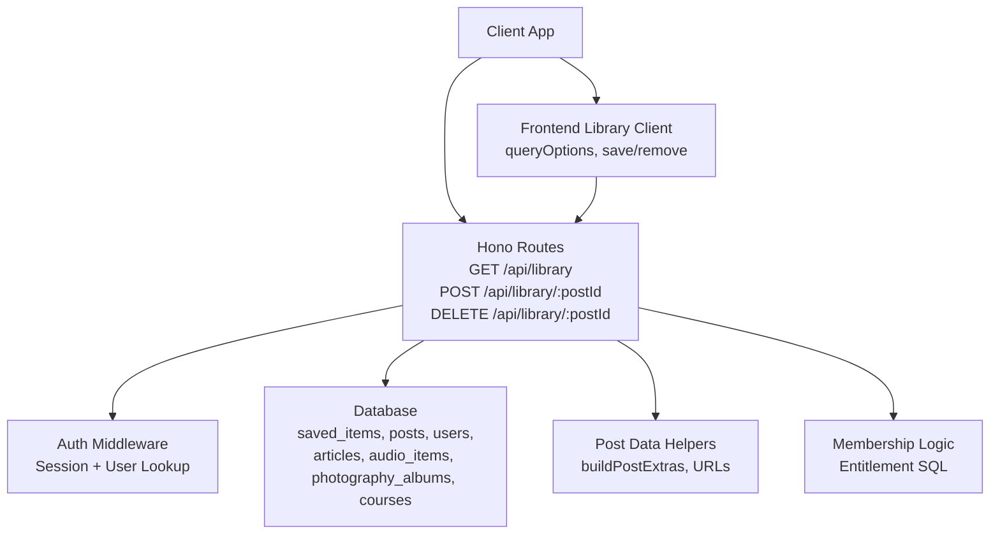
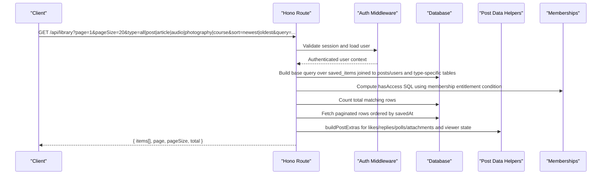
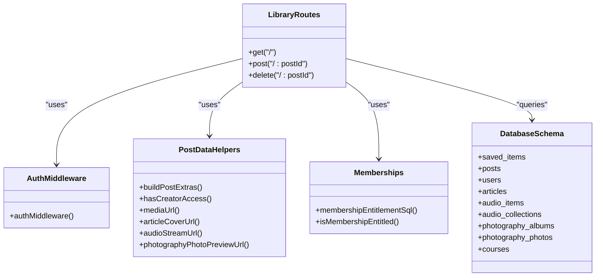

# Library Management API

<cite>
**Referenced Files in This Document**
- [library.ts](file://src/worker/routes/library.ts)
- [library.ts (frontend client)](file://src/react-app/lib/library.ts)
- [LibraryPage.tsx](file://src/react-app/pages/LibraryPage.tsx)
- [saved_items.sql](file://drizzle/0013_saved_library.sql)
- [post-data.ts](file://src/worker/lib/post-data.ts)
- [memberships.ts](file://src/worker/lib/memberships.ts)
- [auth.ts (middleware)](file://src/worker/middleware/auth.ts)
- [schema.ts](file://src/worker/db/schema.ts)
- [library.test.ts](file://src/worker/routes/library.test.ts)
</cite>

## Table of Contents
1. [Introduction](#introduction)
2. [Project Structure](#project-structure)
3. [Core Components](#core-components)
4. [Architecture Overview](#architecture-overview)
5. [Detailed Component Analysis](#detailed-component-analysis)
6. [Dependency Analysis](#dependency-analysis)
7. [Performance Considerations](#performance-considerations)
8. [Troubleshooting Guide](#troubleshooting-guide)
9. [Conclusion](#conclusion)
10. [Appendices](#appendices)

## Introduction
This document provides comprehensive API documentation for the Library Management endpoints that allow authenticated users to manage their saved content across multiple content types: posts, articles, audio items, photography albums, and courses. It covers retrieving saved items with pagination, filtering by type, sorting by newest or oldest, and searching across creator names and content fields. It also documents saving and removing items from a user’s personal library, including access control based on subscription membership and creator permissions.

## Project Structure
The Library Management feature is implemented as a Hono-based route module with middleware for authentication and validation, backed by Drizzle ORM queries against a SQLite database. The frontend uses React Query hooks to interact with the API and render the Library page with search, filters, and pagination controls.

**Diagram sources**
- [library.ts:31-170](file://src/worker/routes/library.ts#L31-L170)
- [auth.ts (middleware):23-50](file://src/worker/middleware/auth.ts#L23-L50)
- [post-data.ts:144-292](file://src/worker/lib/post-data.ts#L144-L292)
- [memberships.ts:23-40](file://src/worker/lib/memberships.ts#L23-L40)
- [library.ts (frontend client):42-69](file://src/react-app/lib/library.ts#L42-L69)

**Section sources**
- [library.ts:31-170](file://src/worker/routes/library.ts#L31-L170)
- [library.ts (frontend client):1-70](file://src/react-app/lib/library.ts#L1-L70)
- [LibraryPage.tsx:28-118](file://src/react-app/pages/LibraryPage.tsx#L28-L118)
- [auth.ts (middleware):23-50](file://src/worker/middleware/auth.ts#L23-L50)

## Core Components
- GET /api/library: Retrieves the authenticated user’s saved items with pagination, filtering by type, sorting by newest/oldest, and optional search across creator names and content fields. Returns availability states per item: available, unavailable, or membership_required.
- POST /api/library/:postId: Saves a piece of content to the user’s library if it is published and visible and the user has creator access (either the user is the creator or holds an active/trialing subscription).
- DELETE /api/library/:postId: Removes a saved item from the user’s library.

Key behaviors:
- Access control: Membership required when viewer is not the creator; checks active or trialing subscriptions.
- Availability: Items may be unavailable due to moderation status, author account status, or missing publication timestamps/statuses.
- Search: Case-insensitive substring search across creator display name and username, plus content fields depending on type.
- Pagination: Page and pageSize parameters with total count returned.

**Section sources**
- [library.ts:33-170](file://src/worker/routes/library.ts#L33-L170)
- [library.test.ts:44-127](file://src/worker/routes/library.test.ts#L44-L127)

## Architecture Overview
The endpoint flow enforces authentication, validates query parameters, constructs SQL conditions for filtering and searching, computes access entitlements, and serializes results into a unified response shape.

**Diagram sources**
- [library.ts:66-151](file://src/worker/routes/library.ts#L66-L151)
- [memberships.ts:23-40](file://src/worker/lib/memberships.ts#L23-L40)
- [post-data.ts:144-292](file://src/worker/lib/post-data.ts#L144-L292)

## Detailed Component Analysis

### GET /api/library
Retrieves saved content with pagination, filtering, sorting, and search.

Request parameters:
- page: integer, minimum 1, default 1
- pageSize: integer, minimum 1, maximum 50, default 20
- type: enum all | post | article | audio | photography | course, default all
- sort: enum newest | oldest, default newest
- query: string, trimmed, max length 100, default empty

Response body:
- items: array of LibraryItem objects
- page: number
- pageSize: number
- total: number

LibraryItem variants:
- Available:
  - availability: "available"
  - postId: string
  - type: one of post | article | audio | photography | course
  - savedAt: number (unix seconds)
  - item: content object specific to type
- Membership required:
  - availability: "membership_required"
  - postId: string
  - type: one of post | article | audio | photography | course
  - savedAt: number
  - creator: { id, displayName, username, avatarUrl }
- Unavailable:
  - availability: "unavailable"
  - postId: string
  - type: one of post | article | audio | photography | course
  - savedAt: number

Content metadata and interaction counts are included for available items:
- Posts include attachments and poll data when present.
- Articles include title, excerpt, cover URL, timestamps, and interactions.
- Audio items include stream URL, cover URL, duration, display order, collection info, and timestamps.
- Photography albums include photo list (up to first 4), cover photo, download settings, shoot date, and timestamps.
- Courses include description, timestamps, and creator info.

Interaction counts:
- likeCount: number
- replyCount: number
- viewerLiked: boolean
- viewerSaved: boolean (always true for items returned by this endpoint)

Availability logic:
- Unavailable when post moderationStatus is not active, author accountStatus is not active, or post.publishedAt is null; additionally, type-specific statuses must be published.
- Membership required when the viewer is not the creator and does not hold an active or trialing subscription at the time of request.

Search behavior:
- Searches creator display name and username.
- If the viewer has access to the creator’s content, searches content fields (post body, article title/excerpt, audio title/description, photography album title/description, course title/description).
- Only published and visible content participates in search results.

Sorting:
- newest: orders by savedAt descending
- oldest: orders by savedAt ascending

Pagination:
- Uses LIMIT and OFFSET based on pageSize and page.
- total reflects the full count before pagination.

Error handling:
- Invalid parameters return 422 (e.g., pageSize > 50).
- Unauthorized requests return 401.

Examples:
- Retrieve all saved items, page 1, size 20, sorted newest:
  GET /api/library?page=1&pageSize=20&type=all&sort=newest
- Filter to articles only and search “Private article”:
  GET /api/library?type=article&query=Private%20article
- Sort by oldest:
  GET /api/library?sort=oldest&pageSize=20

**Section sources**
- [library.ts:33-151](file://src/worker/routes/library.ts#L33-L151)
- [library.ts (frontend client):42-61](file://src/react-app/lib/library.ts#L42-L61)
- [library.test.ts:81-122](file://src/worker/routes/library.test.ts#L81-L122)

### POST /api/library/:postId
Saves content to the user’s library.

Path parameters:
- postId: string, non-empty

Behavior:
- Validates that the post exists and is published and visible.
- Requires creator access: either the viewer is the creator or holds an active/trialing subscription.
- Inserts a saved record if not already present (idempotent via upsert semantics).

Response:
- { saved: true }

Errors:
- 404 if content not found or not published/visible.
- 403 if subscriber lacks creator access.

Example:
- POST /api/library/{postId}

**Section sources**
- [library.ts:153-162](file://src/worker/routes/library.ts#L153-L162)
- [post-data.ts:84-98](file://src/worker/lib/post-data.ts#L84-L98)
- [library.test.ts:69-77](file://src/worker/routes/library.test.ts#L69-L77)

### DELETE /api/library/:postId
Removes a saved item from the user’s library.

Path parameters:
- postId: string, non-empty

Behavior:
- Deletes the saved record for the current user and postId.

Response:
- { saved: false }

Example:
- DELETE /api/library/{postId}

**Section sources**
- [library.ts:164-169](file://src/worker/routes/library.ts#L164-L169)
- [library.test.ts:124-126](file://src/worker/routes/library.test.ts#L124-L126)

## Dependency Analysis
The library routes depend on several modules:
- Authentication middleware ensures the requester is authenticated and loads user context.
- Database schema defines core entities: saved_items, posts, users, articles, audio_items, audio_collections, photography_albums, photography_photos, courses.
- Post data helpers provide extras like attachments, likes, replies, polls, and media URLs.
- Membership utilities compute entitlement SQL for access control.

**Diagram sources**
- [library.ts:31-170](file://src/worker/routes/library.ts#L31-L170)
- [auth.ts (middleware):23-50](file://src/worker/middleware/auth.ts#L23-L50)
- [post-data.ts:84-292](file://src/worker/lib/post-data.ts#L84-L292)
- [memberships.ts:23-40](file://src/worker/lib/memberships.ts#L23-L40)
- [schema.ts:168-400](file://src/worker/db/schema.ts#L168-L400)

**Section sources**
- [library.ts:31-170](file://src/worker/routes/library.ts#L31-L170)
- [schema.ts:168-400](file://src/worker/db/schema.ts#L168-L400)

## Performance Considerations
- Queries use indexed columns where applicable (e.g., saved_items.user_id, saved_at index).
- Aggregations for likes, replies, and polls are batched efficiently using inArray and groupBy.
- Media URLs are generated server-side to avoid extra network calls.
- Pagination limits result sets to reduce payload size.

[No sources needed since this section provides general guidance]

## Troubleshooting Guide
Common issues and resolutions:
- 401 Unauthorized: Ensure the session cookie is valid and includes an active user session.
- 403 Forbidden: Subscriber lacks creator access; verify subscription status is active or trialing.
- 404 Not Found: Content not found or not published/visible; check moderation and publication status.
- 422 Validation Error: pageSize exceeds maximum (50); adjust parameter values.
- Empty results: Verify search terms and filters; ensure content is published and visible.

**Section sources**
- [library.test.ts:120-127](file://src/worker/routes/library.test.ts#L120-L127)
- [library.ts:66-151](file://src/worker/routes/library.ts#L66-L151)

## Conclusion
The Library Management API provides a robust, secure, and flexible way for users to manage their saved content across multiple types. It supports advanced filtering, sorting, and search while enforcing strict access control through membership entitlements. The design balances performance with rich metadata and interaction state, enabling seamless user experiences in the frontend.

[No sources needed since this section summarizes without analyzing specific files]

## Appendices

### Request/Response Schemas

GET /api/library Response Schema:
- items: array of LibraryItem
- page: number
- pageSize: number
- total: number

LibraryItem:
- availability: "available" | "membership_required" | "unavailable"
- postId: string
- type: "post" | "article" | "audio" | "photography" | "course"
- savedAt: number (unix seconds)
- For "available":
  - item: content object with type-specific fields and interactions
- For "membership_required":
  - creator: { id, displayName, username, avatarUrl }

POST /api/library/:postId Response Schema:
- saved: true

DELETE /api/library/:postId Response Schema:
- saved: false

**Section sources**
- [library.ts (frontend client):13-40](file://src/react-app/lib/library.ts#L13-L40)
- [library.ts:128-151](file://src/worker/routes/library.ts#L128-L151)

### Example Workflows

Searching across multiple content types:
- Use query parameter to search creator names and content fields; combine with type filter to narrow results.

Handling membership-based content access:
- When a subscriber lacks an active/trialing subscription, items return availability "membership_required" with creator details.

Managing large libraries with pagination:
- Adjust page and pageSize to navigate through results; use total to compute totalPages.

**Section sources**
- [library.test.ts:89-111](file://src/worker/routes/library.test.ts#L89-L111)
- [LibraryPage.tsx:107-115](file://src/react-app/pages/LibraryPage.tsx#L107-L115)