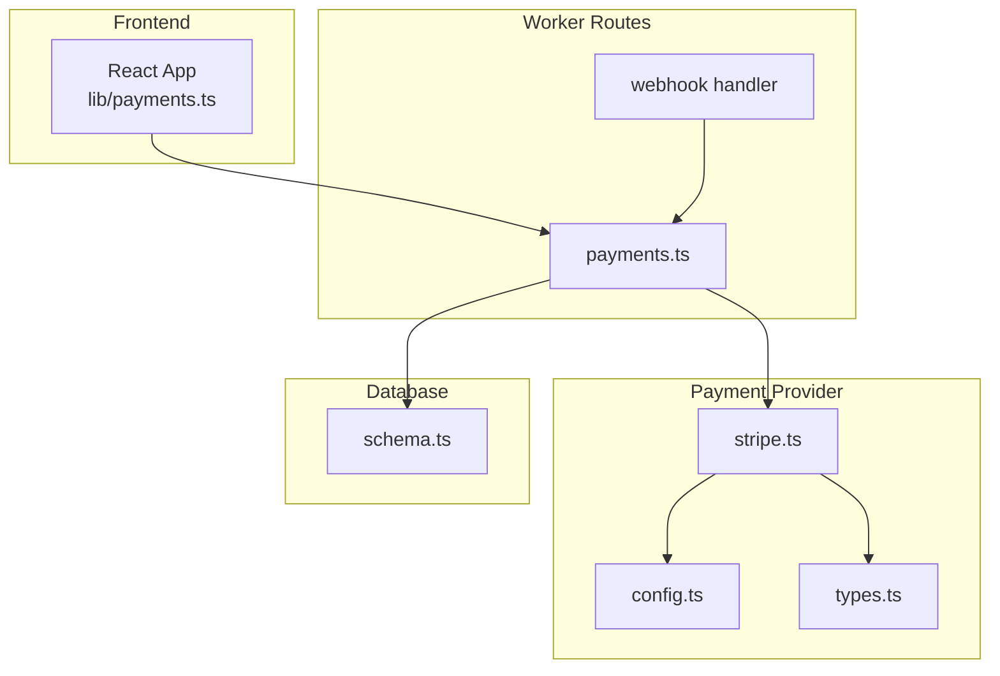
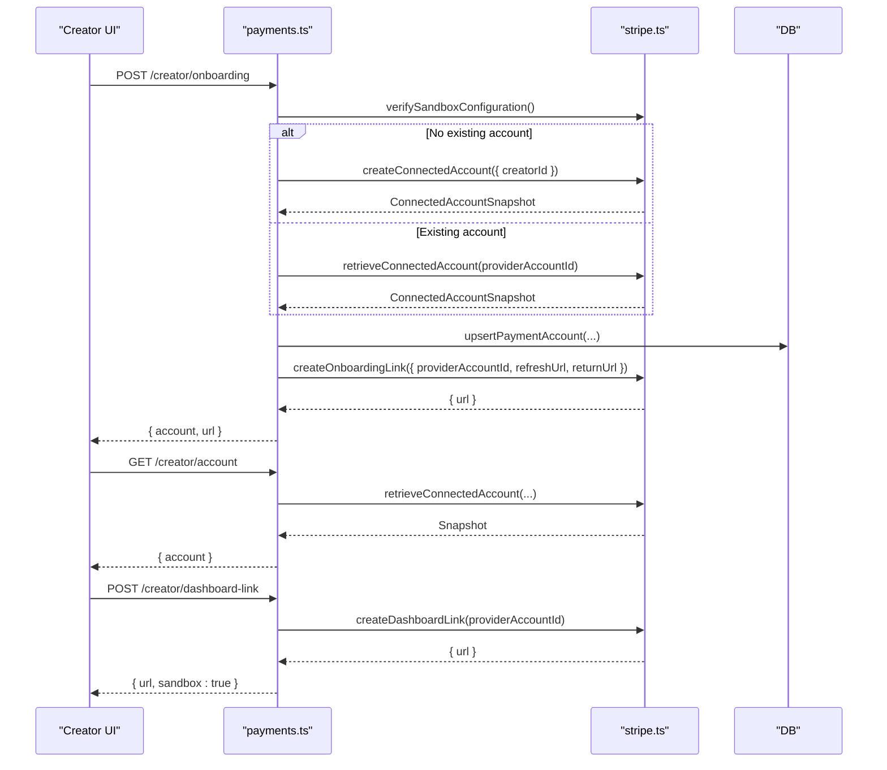
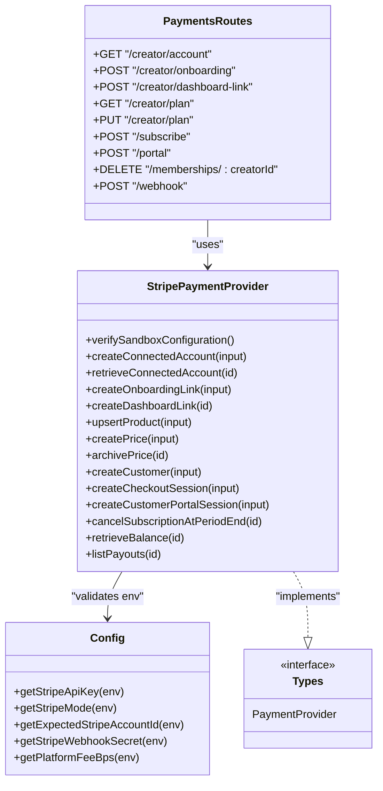

# Creator Payment Setup

<cite>
**Referenced Files in This Document**
- [payments.ts](file://src/worker/routes/payments.ts)
- [stripe.ts](file://src/worker/lib/payments/stripe.ts)
- [config.ts](file://src/worker/lib/payments/config.ts)
- [types.ts](file://src/worker/lib/payments/types.ts)
- [schemas.ts](file://src/worker/lib/schemas.ts)
- [schema.ts](file://src/worker/db/schema.ts)
- [payments.ts (frontend)](file://src/react-app/lib/payments.ts)
</cite>

## Table of Contents
1. [Introduction](#introduction)
2. [Project Structure](#project-structure)
3. [Core Components](#core-components)
4. [Architecture Overview](#architecture-overview)
5. [Detailed Component Analysis](#detailed-component-analysis)
6. [Dependency Analysis](#dependency-analysis)
7. [Performance Considerations](#performance-considerations)
8. [Troubleshooting Guide](#troubleshooting-guide)
9. [Conclusion](#conclusion)

## Introduction
This document provides comprehensive API documentation for creator payment account setup and management using Stripe Connect. It covers the following endpoints:
- POST /api/payments/creator/onboarding
- GET /api/payments/creator/account
- POST /api/payments/creator/dashboard-link
- GET /api/payments/creator/plan
- PUT /api/payments/creator/plan

It explains the Stripe Connect flow, required fields for plan configuration, validation rules, status tracking for connected accounts, and examples for completing onboarding, updating plans, handling errors, and managing payouts.

## Project Structure
The payment system is implemented as a set of Hono routes under the worker layer with a pluggable payment provider abstraction. The key files are:
- Route handlers for payments and webhooks
- Stripe provider implementation
- Configuration and environment validation
- Shared types and schemas
- Database schema definitions
- Frontend client helpers to call these APIs

**Diagram sources**
- [payments.ts](file://src/worker/routes/payments.ts)
- [stripe.ts](file://src/worker/lib/payments/stripe.ts)
- [config.ts](file://src/worker/lib/payments/config.ts)
- [types.ts](file://src/worker/lib/payments/types.ts)
- [schema.ts](file://src/worker/db/schema.ts)

**Section sources**
- [payments.ts](file://src/worker/routes/payments.ts)
- [stripe.ts](file://src/worker/lib/payments/stripe.ts)
- [config.ts](file://src/worker/lib/payments/config.ts)
- [types.ts](file://src/worker/lib/payments/types.ts)
- [schema.ts](file://src/worker/db/schema.ts)

## Core Components
- Payments routes expose creator-facing endpoints for onboarding, account status, dashboard link, and plan management.
- Stripe provider implements Stripe Connect operations: creating accounts, generating onboarding links, product and price management, checkout sessions, portal sessions, balance, and payouts.
- Configuration validates sandbox-only usage and required environment variables.
- Schemas define strict validation for plan updates and subscription requests.
- Database schema stores creator payment accounts, customers, memberships, revenue events, and webhook events.

**Section sources**
- [payments.ts](file://src/worker/routes/payments.ts)
- [stripe.ts](file://src/worker/lib/payments/stripe.ts)
- [config.ts](file://src/worker/lib/payments/config.ts)
- [schemas.ts](file://src/worker/lib/schemas.ts)
- [schema.ts](file://src/worker/db/schema.ts)

## Architecture Overview
The Stripe Connect flow for creator onboarding:
1. Creator calls POST /api/payments/creator/onboarding.
2. Server verifies sandbox configuration and either creates or retrieves a Stripe Express connected account.
3. Server persists account snapshot and returns an onboarding URL.
4. Creator completes Stripe’s Express onboarding; server can refresh status via GET /api/payments/creator/account.
5. Once active, creators can generate a dashboard link via POST /api/payments/creator/dashboard-link.

**Diagram sources**
- [payments.ts](file://src/worker/routes/payments.ts)
- [stripe.ts](file://src/worker/lib/payments/stripe.ts)

## Detailed Component Analysis

### Endpoint: POST /api/payments/creator/onboarding
- Purpose: Start or resume Stripe Connect Express onboarding for the authenticated creator.
- Authentication: Requires creator role.
- Behavior:
  - Verifies sandbox configuration.
  - Creates a new Express connected account if none exists; otherwise retrieves existing.
  - Persists account snapshot (status, capabilities, requirements).
  - Returns an onboarding URL and current account snapshot.
- Response:
  - account: provider, providerAccountId, status, transfersEnabled, payoutsEnabled, detailsSubmitted, requirementsDue, connected, sandbox.
  - url: Stripe Express onboarding URL.
- Errors:
  - 503 payment_provider_unconfigured when sandbox is not configured.
  - Other errors thrown by Stripe or internal logic.

Example flow:
- Call endpoint to get onboarding URL.
- Redirect creator to complete Stripe Express onboarding.
- After completion, poll GET /creator/account until connected is true.

**Section sources**
- [payments.ts](file://src/worker/routes/payments.ts)
- [stripe.ts](file://src/worker/lib/payments/stripe.ts)

### Endpoint: GET /api/payments/creator/account
- Purpose: Retrieve the current creator’s connected account status.
- Authentication: Requires creator role.
- Behavior:
  - Reads persisted account row.
  - Optionally refreshes snapshot from Stripe and persists updated state.
  - Normalizes status into a consistent response shape.
- Response:
  - account object with status and capability flags.
- Notes:
  - If no row exists, returns not_connected defaults.
  - If Stripe call fails due to configuration, falls back to persisted row.

**Section sources**
- [payments.ts](file://src/worker/routes/payments.ts)

### Endpoint: POST /api/payments/creator/dashboard-link
- Purpose: Generate a one-time login link to the Stripe Express Dashboard for the creator.
- Authentication: Requires creator role.
- Behavior:
  - Requires an existing connected account; otherwise returns 409 payment_setup_required.
  - Calls Stripe to create a login link.
- Response:
  - url: Stripe dashboard link.
  - sandbox: true.
- Errors:
  - 409 payment_setup_required if no connected account.
  - 503 payment_provider_unconfigured if sandbox is misconfigured.

**Section sources**
- [payments.ts](file://src/worker/routes/payments.ts)
- [stripe.ts](file://src/worker/lib/payments/stripe.ts)

### Endpoint: GET /api/payments/creator/plan
- Purpose: Read the creator’s membership plan configuration and related metrics.
- Authentication: Requires creator role.
- Behavior:
  - Retrieves plan and active prices.
  - Aggregates transition counts for plan changes.
  - Serializes plan including mode, free trial days, currency, revision, and prices.
  - Includes account status normalized from persisted row.
- Response:
  - plan: id, name, description, currency, mode, revision, freeTrialDays, prices.monthly/yearly.
  - account: normalized connected account status.
  - transitions: counts by status.

**Section sources**
- [payments.ts](file://src/worker/routes/payments.ts)

### Endpoint: PUT /api/payments/creator/plan
- Purpose: Update the creator’s membership plan configuration.
- Authentication: Requires creator role.
- Validation:
  - Uses discriminated union based on mode:
    - disabled: only name and description allowed.
    - free_permanent: only name and description allowed.
    - free_trial: requires freeTrialDays (1–90).
    - paid: requires monthlyAmountCents; yearlyAmountCents optional; amounts must be integers in cents within range.
- Behavior:
  - Ensures plan exists; creates if missing.
  - For paid mode, enforces that the connected account is fully active (transfers enabled, payouts enabled, details submitted).
  - Upserts Stripe product and creates/archives prices as needed.
  - Archives old prices when values change or mode switches away from paid.
  - Records plan transitions for existing paid memberships when disabling paid mode.
  - Batches database writes; rolls back provider-side price archives on failure.
- Response:
  - plan: updated serialized plan with active prices.
- Errors:
  - 409 payment_setup_required if enabling paid without completed onboarding.
  - 503 payment_provider_unconfigured if sandbox is misconfigured.

Validation rules summary:
- Name: required, trimmed, max length 80.
- Description: optional, trimmed, max length 500.
- Mode: exactly one of disabled, free_permanent, free_trial, paid.
- freeTrialDays: required for free_trial, integer 1–90.
- monthlyAmountCents: required for paid, integer >= 100 and <= 100,000,000.
- yearlyAmountCents: optional for paid, same constraints as monthly.

**Section sources**
- [payments.ts](file://src/worker/routes/payments.ts)
- [schemas.ts](file://src/worker/lib/schemas.ts)

### Webhook: POST /api/payments/webhook
- Purpose: Receive and process Stripe webhook events for subscriptions, invoices, and checkout sessions.
- Behavior:
  - Validates signature and rejects live mode events.
  - Claims event to avoid duplicates and retries.
  - Dispatches handlers for checkout.completed/expired, subscription created/updated/deleted, invoice.paid/payment_succeeded, invoice.payment_failed.
  - Updates membership statuses, records revenue events, and sends notifications.
- Responses:
  - 200 with { received: true } on success.
  - 400 for invalid signatures or live events.
  - 503 for misconfigured sandbox.

Key mappings:
- Stripe subscription statuses mapped to internal statuses (active, trialing, past_due, incomplete, expired, canceled).
- Revenue recorded per invoice with platform fee applied based on PLATFORM_FEE_BPS.

**Section sources**
- [payments.ts](file://src/worker/routes/payments.ts)
- [stripe.ts](file://src/worker/lib/payments/stripe.ts)

### Stripe Provider Implementation
- Sandbox enforcement:
  - Only test keys accepted; live keys rejected.
  - STRIPE_MODE must be test.
  - STRIPE_ACCOUNT_ID must match expected sandbox account.
- Connected Account:
  - Creates Express accounts with recipient capabilities and metadata.
  - Maps Stripe account fields to normalized snapshot including requirements due.
- Onboarding and Dashboard:
  - Generates onboarding links with eventual requirements collection.
  - Generates login links for Express Dashboard.
- Product and Prices:
  - Upserts products with revision metadata.
  - Creates prices with interval and metadata; archives inactive prices.
- Checkout and Portal:
  - Creates subscription checkout sessions with application fees and transfer destination.
  - Creates billing portal sessions for customer self-service.
- Balance and Payouts:
  - Retrieves available and pending balances.
  - Lists recent payouts.

**Section sources**
- [stripe.ts](file://src/worker/lib/payments/stripe.ts)
- [config.ts](file://src/worker/lib/payments/config.ts)

### Data Models and Schema
- Creator Payment Accounts:
  - Stores provider, providerAccountId, status, capability flags, requirementsDue JSON, timestamps.
- Payment Customers:
  - Maps users to provider customer IDs.
- Subscription Memberships:
  - Tracks access type, interval, status, provider identifiers, period boundaries, cancellation info.
- Revenue Events:
  - Records gross/net amounts, fees, currency, and occurrence time.
- Webhook Events:
  - Deduplicates and tracks processing lifecycle.

**Section sources**
- [schema.ts](file://src/worker/db/schema.ts)

## Dependency Analysis
- payments.ts depends on:
  - stripe.ts for provider operations.
  - config.ts for environment validation and platform fee calculation.
  - types.ts for shared interfaces and payloads.
  - db schema for data persistence.
- stripe.ts depends on:
  - config.ts for API key, mode, and account validation.
  - types.ts for input/output structures.
- Frontend lib/payments.ts calls:
  - /api/payments/creator/onboarding
  - /api/payments/creator/dashboard-link
  - /api/payments/creator/plan
  - /api/payments/profile/:username/options
  - /api/payments/subscribe
  - /api/payments/portal
  - /api/payments/memberships/:creatorId

**Diagram sources**
- [payments.ts](file://src/worker/routes/payments.ts)
- [stripe.ts](file://src/worker/lib/payments/stripe.ts)
- [config.ts](file://src/worker/lib/payments/config.ts)
- [types.ts](file://src/worker/lib/payments/types.ts)

**Section sources**
- [payments.ts](file://src/worker/routes/payments.ts)
- [stripe.ts](file://src/worker/lib/payments/stripe.ts)
- [config.ts](file://src/worker/lib/payments/config.ts)
- [types.ts](file://src/worker/lib/payments/types.ts)

## Performance Considerations
- Batched database writes reduce round-trips during plan updates.
- Idempotency keys used for Stripe product, price, customer, and checkout session creation to prevent duplicates.
- Webhook deduplication via claimed events prevents reprocessing.
- Optional Stripe snapshot refresh on account status retrieval avoids unnecessary network calls when not needed.

[No sources needed since this section provides general guidance]

## Troubleshooting Guide
Common issues and resolutions:
- 503 payment_provider_unconfigured:
  - Ensure STRIPE_API_KEY starts with sk_test_ or rk_test_.
  - Ensure STRIPE_MODE is test.
  - Ensure STRIPE_ACCOUNT_ID matches the sandbox account.
  - Ensure STRIPE_WEBHOOK_SECRET is set.
- 409 payment_setup_required:
  - Complete Stripe Express onboarding before enabling paid memberships.
  - Verify account status shows active with transfers and payouts enabled and details submitted.
- Invalid webhook signature:
  - Confirm webhook secret matches Stripe’s configured secret.
  - Ensure payload is read as raw text before verification.
- Live events rejected:
  - Only sandbox events are accepted; ensure testing in Stripe test mode.

Operational tips:
- Use GET /creator/account to monitor connected account status and requirementsDue list.
- Use GET /creator/plan to validate plan mode and active prices.
- Use POST /creator/dashboard-link to open Stripe Express Dashboard for manual checks.

**Section sources**
- [payments.ts](file://src/worker/routes/payments.ts)
- [config.ts](file://src/worker/lib/payments/config.ts)

## Conclusion
The creator payment setup leverages Stripe Connect Express to manage creator accounts securely and consistently. The API surface provides clear endpoints for onboarding, status checks, dashboard access, and plan configuration with robust validation and error handling. Webhooks keep membership states and revenue records synchronized. Following the documented flows ensures reliable setup and ongoing management of creator payouts and subscriptions.

[No sources needed since this section summarizes without analyzing specific files]