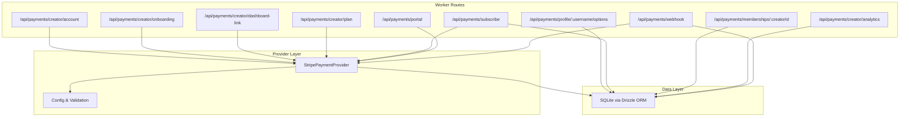
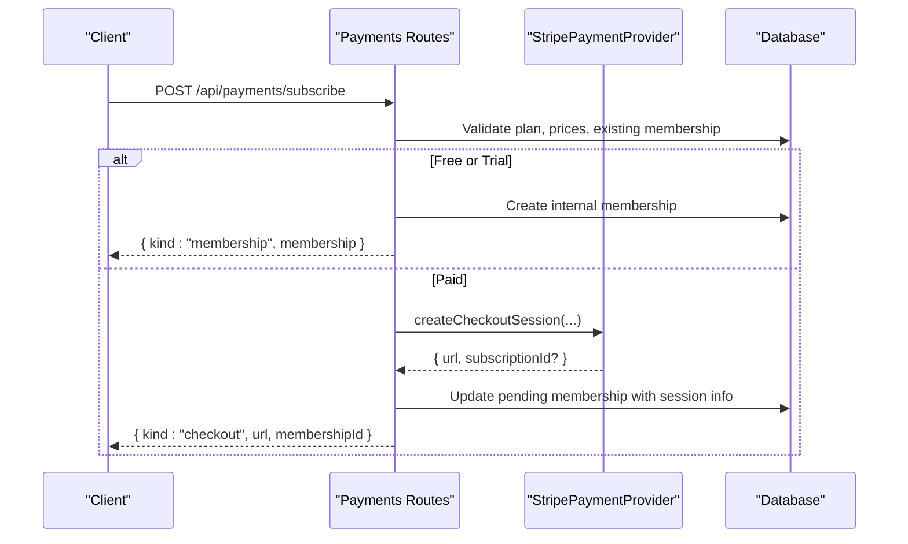
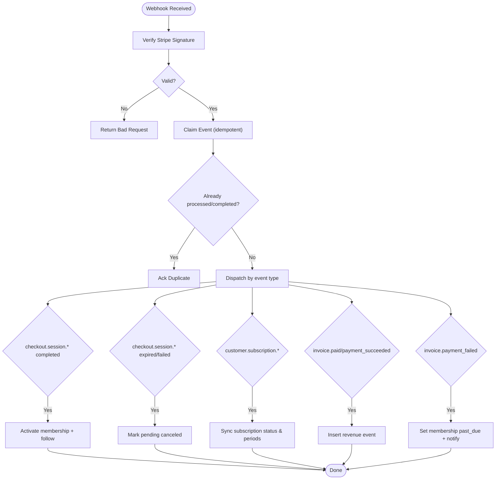
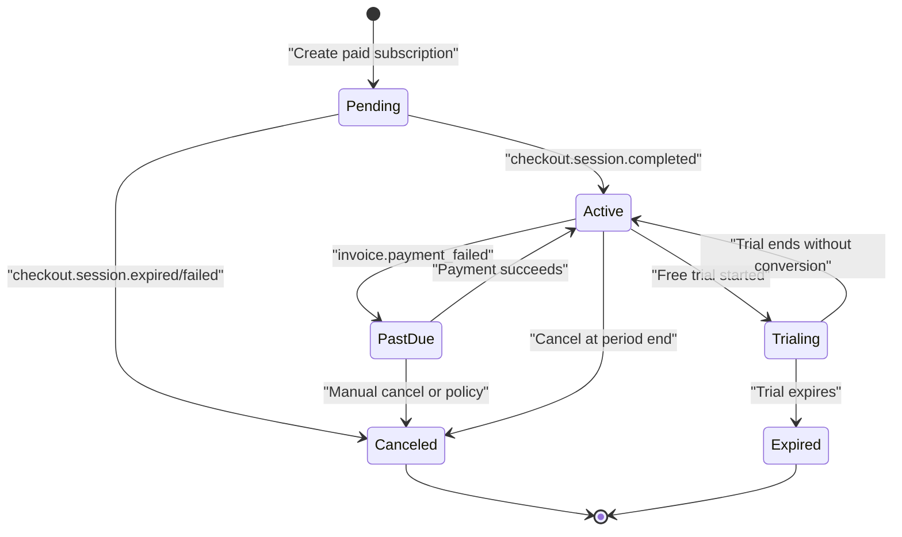
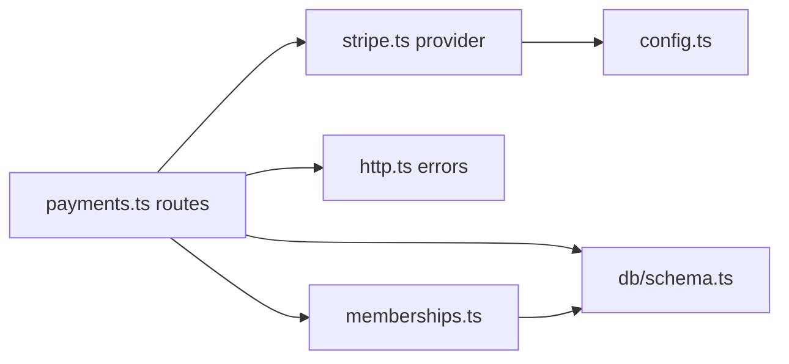

# Payments & Monetization API

<cite>
**Referenced Files in This Document**
- [payments.ts](file://src/worker/routes/payments.ts)
- [stripe.ts](file://src/worker/lib/payments/stripe.ts)
- [index.ts](file://src/worker/lib/payments/index.ts)
- [config.ts](file://src/worker/lib/payments/config.ts)
- [memberships.ts](file://src/worker/lib/memberships.ts)
- [schema.ts](file://src/worker/db/schema.ts)
- [0016_stripe_membership_modes.sql](file://drizzle/0016_stripe_membership_modes.sql)
- [0003_creator_subscriptions.sql](file://drizzle/0003_creator_subscriptions.sql)
- [payments.ts (frontend)](file://src/react-app/lib/payments.ts)
- [http.ts](file://src/worker/lib/http.ts)
</cite>

## Table of Contents
1. Introduction
2. Project Structure
3. Core Components
4. Architecture Overview
5. Detailed Component Analysis
6. Dependency Analysis
7. Performance Considerations
8. Troubleshooting Guide
9. Conclusion

## Introduction
This document provides comprehensive API documentation for payment and monetization endpoints, covering subscription management, Stripe integration, membership tiers, and revenue tracking. It specifies HTTP methods, URL patterns, webhook endpoints for payment events, and the full subscription lifecycle. It also includes security requirements, PCI considerations, error handling, status transitions, access control by membership levels, and reporting endpoints.

## Project Structure
The payments system is implemented as a Hono-based worker with:
- Route handlers for creator plan management, subscription flows, billing portal, analytics, and webhooks
- A Stripe provider abstraction for all external payment operations
- Database schema definitions and migrations for plans, prices, memberships, revenue events, and webhook event deduplication
- Frontend client helpers that call the same endpoints

**Diagram sources**
- [payments.ts:260-1285](file://src/worker/routes/payments.ts#L260-L1285)
- [stripe.ts:78-335](file://src/worker/lib/payments/stripe.ts#L78-L335)
- [config.ts:1-64](file://src/worker/lib/payments/config.ts#L1-L64)
- [schema.ts:1-200](file://src/worker/db/schema.ts#L1-L200)

**Section sources**
- [payments.ts:260-1285](file://src/worker/routes/payments.ts#L260-L1285)
- [stripe.ts:78-335](file://src/worker/lib/payments/stripe.ts#L78-L335)
- [config.ts:1-64](file://src/worker/lib/payments/config.ts#L1-L64)
- [schema.ts:1-200](file://src/worker/db/schema.ts#L1-L200)

## Core Components
- Creator Payment Account Management: retrieve account status, onboarding, dashboard link
- Membership Plan Management: read/update plan mode, pricing, and provider product/price synchronization
- Subscription Flows: free/free-trial subscriptions, paid checkout via Stripe, billing portal access, cancellation
- Webhook Processing: Stripe events for checkout, subscription changes, invoices, and failures
- Analytics & Revenue: creator analytics including balance, payouts, metrics, chart data, subscriber list
- Membership Utilities: entitlement checks, trial expiration, plan transition processing

Key responsibilities:
- Validate inputs and enforce role-based access
- Coordinate with Stripe via a provider abstraction
- Persist state to SQLite using Drizzle ORM
- Emit notifications on membership activation and status changes
- Record revenue events and build reporting data

**Section sources**
- [payments.ts:260-1285](file://src/worker/routes/payments.ts#L260-L1285)
- [memberships.ts:1-144](file://src/worker/lib/memberships.ts#L1-L144)
- [stripe.ts:78-335](file://src/worker/lib/payments/stripe.ts#L78-L335)
- [index.ts:1-28](file://src/worker/lib/payments/index.ts#L1-L28)
- [config.ts:1-64](file://src/worker/lib/payments/config.ts#L1-L64)

## Architecture Overview
The API follows a layered architecture:
- Routes layer handles HTTP requests, validation, authorization, and orchestration
- Provider layer encapsulates Stripe interactions with idempotency and sandbox enforcement
- Data layer persists entities and enforces constraints through Drizzle schema and migrations
- Background maintenance tasks handle trial expirations and plan transitions

**Diagram sources**
- [payments.ts:601-818](file://src/worker/routes/payments.ts#L601-L818)
- [stripe.ts:250-283](file://src/worker/lib/payments/stripe.ts#L250-L283)

**Section sources**
- [payments.ts:601-818](file://src/worker/routes/payments.ts#L601-L818)
- [stripe.ts:250-283](file://src/worker/lib/payments/stripe.ts#L250-L283)

## Detailed Component Analysis

### Creator Payment Account Endpoints
- GET /api/payments/creator/account
  - Purpose: Retrieve connected Stripe account status and capabilities
  - Auth: Required; Role: creator
  - Behavior: Fetches from DB and refreshes snapshot from provider if available
- POST /api/payments/creator/onboarding
  - Purpose: Start Express onboarding flow for new creators
  - Auth: Required; Role: creator
  - Behavior: Creates or retrieves connected account, returns onboarding URL
- POST /api/payments/creator/dashboard-link
  - Purpose: Generate a login link to the creator’s Stripe dashboard
  - Auth: Required; Role: creator
  - Behavior: Requires an existing connected account

Security and compliance:
- All endpoints require authentication and creator role
- Sandbox-only configuration enforced via provider config
- No raw card data touches the server; Stripe Checkout/Billing Portal used

Error handling:
- Returns 409 when payment setup is incomplete
- Returns 503 when Stripe sandbox is not configured

**Section sources**
- [payments.ts:260-333](file://src/worker/routes/payments.ts#L260-L333)
- [config.ts:28-55](file://src/worker/lib/payments/config.ts#L28-L55)
- [http.ts:23-75](file://src/worker/lib/http.ts#L23-L75)

### Membership Plan Management
- GET /api/payments/creator/plan
  - Purpose: Read plan details, active prices, and transition counts
  - Auth: Required; Role: creator
- PUT /api/payments/creator/plan
  - Purpose: Update plan name, description, mode, and pricing
  - Auth: Required; Role: creator
  - Behavior:
    - Validates account readiness for paid mode
    - Upserts product and creates/archives prices as needed
    - Records plan transitions when disabling paid mode

Response model highlights:
- Mode: disabled | free_permanent | free_trial | paid
- Prices: monthly/yearly objects with amountCents and providerPriceId
- Sandbox flag indicates test environment usage

**Section sources**
- [payments.ts:337-536](file://src/worker/routes/payments.ts#L337-L536)
- [0016_stripe_membership_modes.sql:1-26](file://drizzle/0016_stripe_membership_modes.sql#L1-L26)

### Subscription Options and Actions
- GET /api/payments/profile/:username/options
  - Purpose: Show available plan options, viewer’s current membership, and trial availability
  - Auth: Required
  - Behavior: Expires due trials before responding
- POST /api/payments/subscribe
  - Purpose: Start a subscription (free/trial/paid)
  - Auth: Required
  - Behavior:
    - For free/trial: creates internal membership and follow relationship
    - For paid: creates checkout session and returns redirect URL
- POST /api/payments/portal
  - Purpose: Open Stripe Billing Portal for managing paid subscriptions
  - Auth: Required
  - Behavior: Requires an existing paid membership with a customer ID
- DELETE /api/payments/memberships/:creatorId
  - Purpose: Cancel free/trial memberships directly
  - Auth: Required
  - Behavior: Paid cancellations must be done via Stripe Billing Portal

Access control:
- Prevents self-subscription
- Enforces creator account status and plan mode
- Blocks duplicate entitlements

**Section sources**
- [payments.ts:540-873](file://src/worker/routes/payments.ts#L540-L873)
- [memberships.ts:14-54](file://src/worker/lib/memberships.ts#L14-L54)

### Webhook Processing
- POST /api/payments/webhook
  - Purpose: Receive and process Stripe webhook events
  - Security: Validates signature; rejects live mode events
  - Deduplication: Claims unique event IDs; supports reprocessing stale claims
  - Supported events:
    - checkout.session.completed / async_payment_succeeded
    - checkout.session.expired / async_payment_failed
    - customer.subscription.created / updated / deleted
    - invoice.paid / payment_succeeded
    - invoice.payment_failed

Processing outcomes:
- Updates membership status and period boundaries
- Records revenue events for invoiced amounts
- Emits notifications for membership activation and status changes

**Diagram sources**
- [payments.ts:1016-1278](file://src/worker/routes/payments.ts#L1016-L1278)
- [stripe.ts:326-335](file://src/worker/lib/payments/stripe.ts#L326-L335)

**Section sources**
- [payments.ts:1016-1278](file://src/worker/routes/payments.ts#L1016-L1278)
- [0016_stripe_membership_modes.sql:72-85](file://drizzle/0016_stripe_membership_modes.sql#L72-L85)

### Creator Analytics and Revenue Reporting
- GET /api/payments/creator/analytics
  - Purpose: Provide creator-level metrics, balance, payouts, subscribers, and revenue chart
  - Auth: Required; Role: creator
  - Behavior:
    - Aggregates memberships and revenue events
    - Computes MRR based on active paid members and intervals
    - Builds a 30-day revenue chart
    - Optionally fetches balance and recent payouts from provider

Output fields include:
- account status and sandbox flag
- balance and payouts
- metrics: mrrCents, totalGrossCents, totalNetCents, subscriber counts
- chart: daily net/gross cents
- subscribers: detailed list with paying status

**Section sources**
- [payments.ts:905-1012](file://src/worker/routes/payments.ts#L905-L1012)
- [0003_creator_subscriptions.sql:106-128](file://drizzle/0003_creator_subscriptions.sql#L106-L128)

### Membership Lifecycle and Entitlement
- Status transitions are driven by both direct actions and Stripe webhooks
- Entitlement logic considers active status and valid trial windows
- Maintenance tasks expire trials and process plan transitions

**Diagram sources**
- [payments.ts:1137-1278](file://src/worker/routes/payments.ts#L1137-L1278)
- [memberships.ts:14-54](file://src/worker/lib/memberships.ts#L14-L54)

**Section sources**
- [payments.ts:1137-1278](file://src/worker/routes/payments.ts#L1137-L1278)
- [memberships.ts:14-54](file://src/worker/lib/memberships.ts#L14-L54)

## Dependency Analysis
- Routes depend on:
  - Provider abstraction for Stripe operations
  - Database schema for persistence
  - Middleware for auth and role checks
  - Notification utilities for membership events
- Provider depends on:
  - Configuration module for keys, secrets, and mode validation
  - Stripe SDK for API calls
- Maintenance utilities depend on:
  - Database schema and scheduled job interfaces

**Diagram sources**
- [payments.ts:1-44](file://src/worker/routes/payments.ts#L1-L44)
- [stripe.ts:1-20](file://src/worker/lib/payments/stripe.ts#L1-L20)
- [config.ts:1-20](file://src/worker/lib/payments/config.ts#L1-L20)
- [memberships.ts:1-10](file://src/worker/lib/memberships.ts#L1-L10)
- [schema.ts:1-20](file://src/worker/db/schema.ts#L1-L20)
- [http.ts:1-20](file://src/worker/lib/http.ts#L1-L20)

**Section sources**
- [payments.ts:1-44](file://src/worker/routes/payments.ts#L1-L44)
- [stripe.ts:1-20](file://src/worker/lib/payments/stripe.ts#L1-L20)
- [config.ts:1-20](file://src/worker/lib/payments/config.ts#L1-L20)
- [memberships.ts:1-10](file://src/worker/lib/memberships.ts#L1-L10)
- [schema.ts:1-20](file://src/worker/db/schema.ts#L1-L20)
- [http.ts:1-20](file://src/worker/lib/http.ts#L1-L20)

## Performance Considerations
- Idempotency:
  - Provider uses idempotency keys for product/price creation, customer creation, and checkout sessions
- Deduplication:
  - Webhook events are claimed once; stale processing allows recovery
- Batching:
  - Plan updates batch multiple DB operations to reduce round trips
- Caching:
  - Provider verifies platform account once per request context to avoid repeated checks
- Indexing:
  - Schema includes indexes on frequently queried columns (e.g., subscription_memberships, revenue_events)

[No sources needed since this section provides general guidance]

## Troubleshooting Guide
Common issues and resolutions:
- Missing Stripe signature on webhook: Ensure correct header and secret configuration
- Live mode events rejected: Only sandbox events are accepted; verify STRIPE_MODE=test
- Payment setup required: Complete Express onboarding and ensure transfers/payouts enabled
- Invalid plan price selection: Confirm active price exists for chosen interval
- Duplicate trial claim: Trials can be claimed only once per subscriber per creator

Error response format:
- Standardized JSON error body with code, message, and optional details
- Specific codes: bad_request, validation_failed, unauthorized, forbidden, not_found, conflict, payload_too_large, unsupported_media_type, internal_server_error

**Section sources**
- [payments.ts:1016-1062](file://src/worker/routes/payments.ts#L1016-L1062)
- [http.ts:23-75](file://src/worker/lib/http.ts#L23-L75)

## Conclusion
The Payments & Monetization API provides a robust, secure, and extensible foundation for subscription-based monetization. It integrates Stripe via a provider abstraction, enforces sandbox-only operation, and maintains consistent state through webhooks and maintenance tasks. Creators can manage plans and accounts, while subscribers experience seamless free/trial and paid flows. Revenue tracking and analytics support informed business decisions.

[No sources needed since this section summarizes without analyzing specific files]