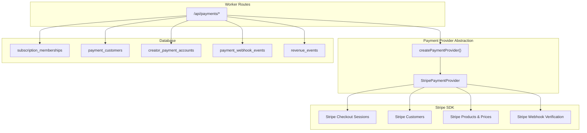
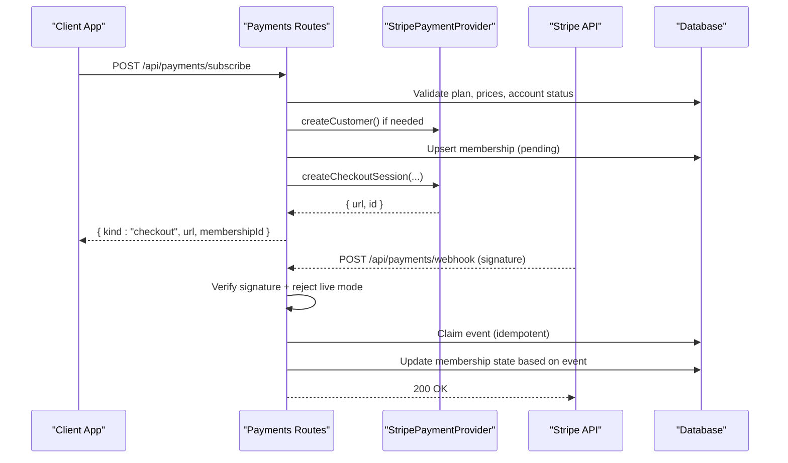
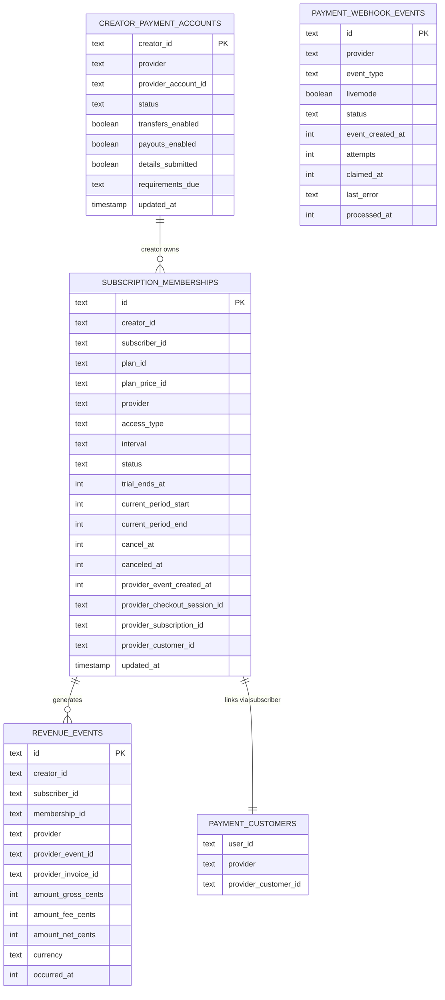
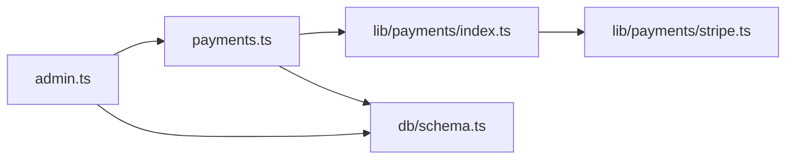

# Stripe Integration

<cite>
**Referenced Files in This Document**
- [payments.ts](file://src/worker/routes/payments.ts)
- [stripe.ts](file://src/worker/lib/payments/stripe.ts)
- [index.ts](file://src/worker/lib/payments/index.ts)
- [types.ts](file://src/worker/lib/payments/types.ts)
- [schema.ts](file://src/worker/db/schema.ts)
- [payments.integration.test.ts](file://src/worker/routes/payments.integration.test.ts)
- [payments.test.ts](file://src/worker/routes/payments.test.ts)
- [admin.ts](file://src/worker/routes/admin.ts)
</cite>

## Table of Contents
1. [Introduction](#introduction)
2. [Project Structure](#project-structure)
3. [Core Components](#core-components)
4. [Architecture Overview](#architecture-overview)
5. [Detailed Component Analysis](#detailed-component-analysis)
6. [Dependency Analysis](#dependency-analysis)
7. [Performance Considerations](#performance-considerations)
8. [Troubleshooting Guide](#troubleshooting-guide)
9. [Conclusion](#conclusion)

## Introduction
This document provides detailed API documentation for the Stripe payment integration endpoints used to manage creator subscriptions, checkout sessions, customer management, and webhooks. It covers authentication requirements, request/response schemas, webhook handling, platform fees, connected accounts, security considerations (including PCI compliance), error handling, and debugging techniques.

## Project Structure
The payment system is implemented as a Hono-based worker with:
- Public-facing routes under src/worker/routes/payments.ts
- A provider abstraction under src/worker/lib/payments/* that encapsulates Stripe operations
- Database schema definitions under src/worker/db/schema.ts
- Tests validating behavior and configuration constraints

**Diagram sources**
- [payments.ts](file://src/worker/routes/payments.ts)
- [index.ts](file://src/worker/lib/payments/index.ts)
- [stripe.ts](file://src/worker/lib/payments/stripe.ts)
- [schema.ts](file://src/worker/db/schema.ts)

**Section sources**
- [payments.ts](file://src/worker/routes/payments.ts)
- [index.ts](file://src/worker/lib/payments/index.ts)
- [stripe.ts](file://src/worker/lib/payments/stripe.ts)
- [schema.ts](file://src/worker/db/schema.ts)

## Core Components
- Payment provider factory: createPaymentProvider(env) returns a Stripe implementation.
- StripePaymentProvider: implements product/price lifecycle, customer creation, checkout sessions, billing portal, subscription cancellation, balance/payouts retrieval, and webhook event construction.
- Payments routes: expose endpoints for creator onboarding, plan management, subscription options, subscribe flow, billing portal, analytics, and Stripe webhook ingestion.
- Database tables: store memberships, customers, creator accounts, webhook events, and revenue events.

Key responsibilities:
- Enforce sandbox-only operation and validate configuration.
- Manage connected accounts and onboarding links.
- Create and manage products/prices per creator plan revisions.
- Build checkout sessions with platform fees and transfer destinations.
- Process Stripe webhooks idempotently and update membership states.
- Record revenue events and compute metrics.

**Section sources**
- [index.ts](file://src/worker/lib/payments/index.ts)
- [stripe.ts](file://src/worker/lib/payments/stripe.ts)
- [payments.ts](file://src/worker/routes/payments.ts)
- [schema.ts](file://src/worker/db/schema.ts)

## Architecture Overview
The system uses a provider abstraction to isolate Stripe-specific logic from route handlers. Webhooks are verified using Stripe’s signature verification and processed idempotently via database claims.

**Diagram sources**
- [payments.ts](file://src/worker/routes/payments.ts)
- [stripe.ts](file://src/worker/lib/payments/stripe.ts)

## Detailed Component Analysis

### Authentication and Authorization
- All protected endpoints require authentication via authMiddleware and role checks where applicable (e.g., creator-only endpoints).
- Webhook endpoint does not use session auth; it validates Stripe signatures and rejects live-mode events.

**Section sources**
- [payments.ts](file://src/worker/routes/payments.ts)

### Creator Connected Account Management
Endpoints:
- GET /api/payments/creator/account
  - Returns current connected account snapshot or row data.
- POST /api/payments/creator/onboarding
  - Creates or retrieves connected account and returns an Express onboarding link.
- POST /api/payments/creator/dashboard-link
  - Returns a login link to the Express dashboard.

Request/Response:
- Onboarding response includes account snapshot and onboarding URL.
- Dashboard link response includes URL and sandbox flag.

Error handling:
- If Stripe sandbox is misconfigured, returns 503 with provider-unconfigured code.

Security:
- Requires authenticated creator role.

**Section sources**
- [payments.ts](file://src/worker/routes/payments.ts)
- [stripe.ts](file://src/worker/lib/payments/stripe.ts)

### Creator Plan Management
Endpoints:
- GET /api/payments/creator/plan
  - Returns plan details, active prices, transitions counts, and account status.
- PUT /api/payments/creator/plan
  - Updates plan mode (disabled, free_permanent, free_trial, paid), names, descriptions, trial days, and price amounts. Creates/archives provider products/prices accordingly.

Request/Response:
- Input validated by schema; only one mode allowed at a time.
- Response includes updated plan serialization with prices.

Business rules:
- Paid mode requires completed connected account setup.
- Price changes trigger upserts with revision tracking and idempotency keys.

**Section sources**
- [payments.ts](file://src/worker/routes/payments.ts)
- [payments.test.ts](file://src/worker/routes/payments.test.ts)

### Subscription Options and Subscribe Flow
Endpoints:
- GET /api/payments/profile/:username/options
  - Returns creator info, plan, viewer membership, and trial availability.
- POST /api/payments/subscribe
  - Handles free/permanent/trial memberships instantly.
  - For paid memberships, creates a Stripe Checkout Session and returns redirect URL.

Request/Response:
- Input includes creatorId and optional interval for paid plans.
- Responses:
  - Free/trial: { kind: "membership", membership }
  - Paid: { kind: "checkout", url, membershipId, sandbox: true }

Business rules:
- Prevent self-subscription.
- Ensure creator is active and accepting memberships.
- One-time trials enforced via database constraints.

**Section sources**
- [payments.ts](file://src/worker/routes/payments.ts)
- [payments.integration.test.ts](file://src/worker/routes/payments.integration.test.ts)

### Billing Portal
Endpoint:
- POST /api/payments/portal
  - Creates a Stripe Customer Portal session for managing paid subscriptions.

Request/Response:
- Input includes creatorId.
- Response includes portal URL and sandbox flag.

Validation:
- Requires existing paid membership with a providerCustomerId.

**Section sources**
- [payments.ts](file://src/worker/routes/payments.ts)

### Membership Cancellation
Endpoint:
- DELETE /api/payments/memberships/:creatorId
  - Cancels free/trial memberships directly.
  - For paid memberships, directs users to Stripe Sandbox portal for cancellation.

Behavior:
- Returns 204 No Content when no membership exists.
- Returns conflict for paid memberships requiring portal usage.

**Section sources**
- [payments.ts](file://src/worker/routes/payments.ts)

### Creator Analytics and Payouts
Endpoint:
- GET /api/payments/creator/analytics
  - Aggregates account status, balance, payouts, subscriber metrics, and 30-day revenue chart.

Data sources:
- Local membership records and revenue events.
- Stripe balance and payouts via provider.

**Section sources**
- [payments.ts](file://src/worker/routes/payments.ts)

### Stripe Webhook Processing
Endpoint:
- POST /api/payments/webhook
  - Verifies Stripe signature using provided secret.
  - Rejects live-mode events.
  - Claims event idempotently and processes specific event types.

Supported events:
- checkout.session.completed / async_payment_succeeded
- checkout.session.expired / async_payment_failed
- customer.subscription.created / updated / deleted
- invoice.paid / payment_succeeded
- invoice.payment_failed

Processing:
- Updates membership statuses and period boundaries.
- Records revenue events with gross/net calculations including platform fee.
- Emits notifications for membership activation and status changes.

Idempotency:
- Uses payment_webhook_events table to prevent duplicate processing and handle stale claims.

**Section sources**
- [payments.ts](file://src/worker/routes/payments.ts)
- [schema.ts](file://src/worker/db/schema.ts)

### Payment Provider Abstraction
Interface:
- PaymentProvider defines methods for connected accounts, products/prices, customers, checkout sessions, portal sessions, subscription cancellation, balance/payouts, and sandbox verification.

Implementation:
- StripePaymentProvider implements all methods using Stripe SDK v2 and v1 APIs.
- Uses idempotency keys for safe retries.
- Maps Stripe account capabilities and requirements into normalized snapshots.

Configuration:
- Factory selects Stripe provider and enforces sandbox configuration.

**Section sources**
- [index.ts](file://src/worker/lib/payments/index.ts)
- [stripe.ts](file://src/worker/lib/payments/stripe.ts)
- [types.ts](file://src/worker/lib/payments/types.ts)

### Data Models and Relationships

**Diagram sources**
- [schema.ts](file://src/worker/db/schema.ts)

## Dependency Analysis
- Route handlers depend on the provider abstraction, which isolates Stripe SDK usage.
- Webhook processing depends on database tables for idempotency and auditability.
- Admin endpoints surface health signals including webhook processing status and failures.

**Diagram sources**
- [payments.ts](file://src/worker/routes/payments.ts)
- [index.ts](file://src/worker/lib/payments/index.ts)
- [stripe.ts](file://src/worker/lib/payments/stripe.ts)
- [schema.ts](file://src/worker/db/schema.ts)
- [admin.ts](file://src/worker/routes/admin.ts)

**Section sources**
- [payments.ts](file://src/worker/routes/payments.ts)
- [index.ts](file://src/worker/lib/payments/index.ts)
- [stripe.ts](file://src/worker/lib/payments/stripe.ts)
- [schema.ts](file://src/worker/db/schema.ts)
- [admin.ts](file://src/worker/routes/admin.ts)

## Performance Considerations
- Idempotency keys on Stripe calls reduce duplicate charges and resource creation.
- Database batch operations minimize round-trips during plan updates.
- Webhook claim mechanism prevents reprocessing and supports recovery from partial failures.
- Revenue chart computation buckets daily totals efficiently.

[No sources needed since this section provides general guidance]

## Troubleshooting Guide
Common issues and resolutions:
- Missing Stripe signature on webhook: ensure correct header and endpoint configuration.
- Live-mode webhook rejection: verify environment variables enforce test mode.
- Payment provider unconfigured: check STRIPE_API_KEY, STRIPE_WEBHOOK_SECRET, STRIPE_MODE, and STRIPE_ACCOUNT_ID.
- Stale pending checkouts: admin endpoint surfaces counts for investigation.
- Failed webhooks: review payment_webhook_events.last_error and retry via reprocessing pipeline.

Debugging techniques:
- Use admin health signals to inspect webhook processing timestamps and failure counts.
- Inspect membership provider fields (providerSubscriptionId, providerCheckoutSessionId) to correlate Stripe resources.
- Validate plan revisions and price archiving logs for inconsistencies.

**Section sources**
- [payments.ts](file://src/worker/routes/payments.ts)
- [admin.ts](file://src/worker/routes/admin.ts)

## Conclusion
The Stripe integration provides a robust, sandbox-first implementation for creator subscriptions with clear separation between route logic and provider specifics. It ensures secure webhook handling, idempotent state updates, and comprehensive analytics. Adhering to the documented endpoints, schemas, and security practices will maintain reliability and compliance.

[No sources needed since this section summarizes without analyzing specific files]