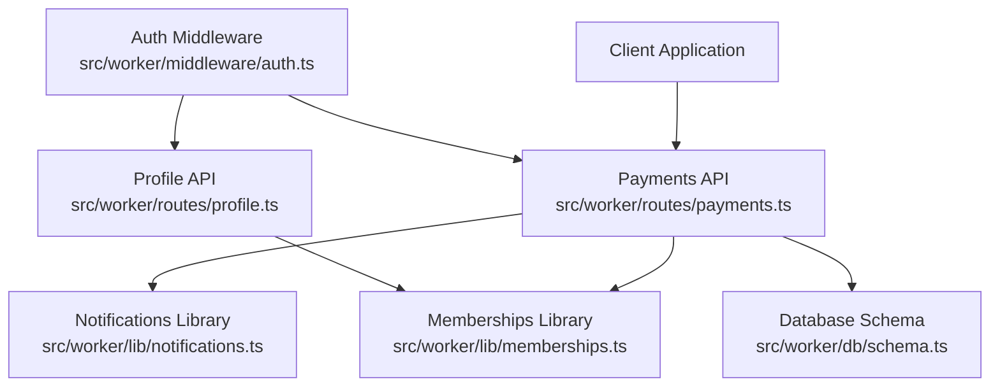
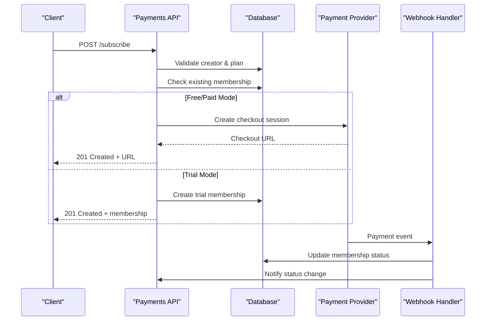
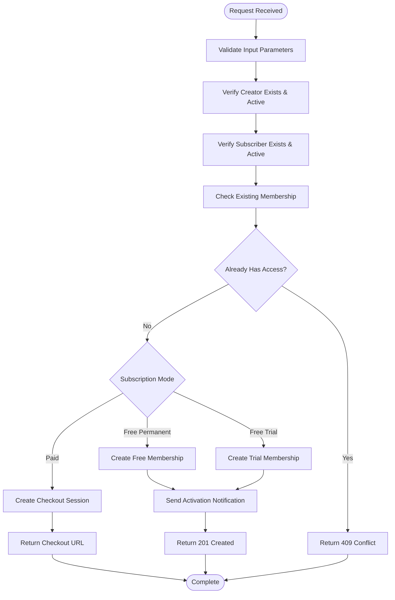
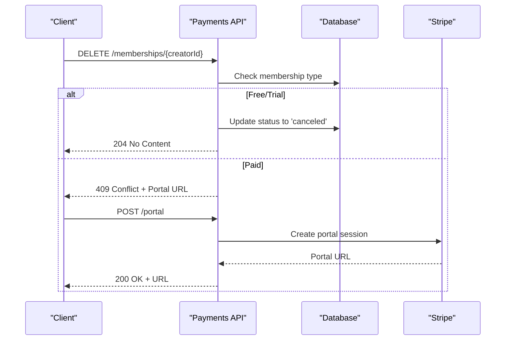
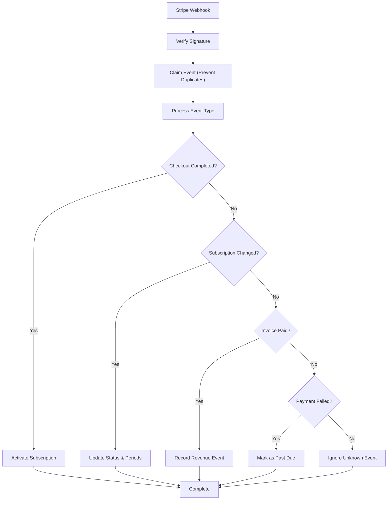
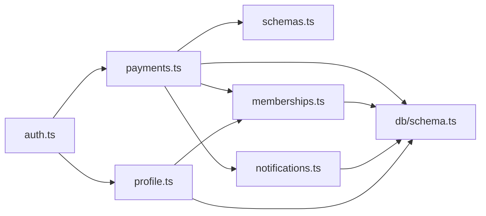

# Subscription Management

<cite>
**Referenced Files in This Document**
- [payments.ts](file://src/worker/routes/payments.ts)
- [memberships.ts](file://src/worker/lib/memberships.ts)
- [schema.ts](file://src/worker/db/schema.ts)
- [0003_creator_subscriptions.sql](file://drizzle/0003_creator_subscriptions.sql)
- [0016_stripe_membership_modes.sql](file://drizzle/0016_stripe_membership_modes.sql)
- [notifications.ts](file://src/worker/lib/notifications.ts)
- [profile.ts](file://src/worker/routes/profile.ts)
- [auth.ts](file://src/worker/middleware/auth.ts)
</cite>

## Table of Contents
1. [Introduction](#introduction)
2. [Project Structure](#project-structure)
3. [Core Components](#core-components)
4. [Architecture Overview](#architecture-overview)
5. [Detailed Component Analysis](#detailed-component-analysis)
6. [Dependency Analysis](#dependency-analysis)
7. [Performance Considerations](#performance-considerations)
8. [Troubleshooting Guide](#troubleshooting-guide)
9. [Conclusion](#conclusion)

## Introduction
This document provides comprehensive API documentation for subscription management endpoints, focusing on the complete subscription lifecycle: creation, status transitions, trial management, and cancellation flows. It covers:
- Initiating new subscriptions via POST /api/payments/subscribe
- Checking available subscription options via GET /api/payments/profile/:username/options
- Membership status queries and entitlement checks
- Subscription modes (free_permanent, free_trial, paid), billing intervals (monthly/yearly), and access control mechanisms
- Examples of subscription creation with different modes, handling trial claims, managing subscription states, and implementing proper error responses for duplicate subscriptions and invalid configurations

## Project Structure
Subscription functionality is implemented primarily in the payments routes and supporting libraries:
- Route handlers for subscription operations are defined in src/worker/routes/payments.ts
- Subscription state logic and utilities are in src/worker/lib/memberships.ts
- Database schema definitions are in src/worker/db/schema.ts and migration files
- Notification system integration is in src/worker/lib/notifications.ts
- Profile-related endpoints that use membership data are in src/worker/routes/profile.ts
- Authentication middleware is in src/worker/middleware/auth.ts



**Diagram sources**
- [payments.ts:1-100](file://src/worker/routes/payments.ts#L1-L100)
- [memberships.ts:1-50](file://src/worker/lib/memberships.ts#L1-L50)
- [schema.ts:761-799](file://src/worker/db/schema.ts#L761-L799)

**Section sources**
- [payments.ts:1-100](file://src/worker/routes/payments.ts#L1-L100)
- [memberships.ts:1-50](file://src/worker/lib/memberships.ts#L1-L50)
- [schema.ts:761-799](file://src/worker/db/schema.ts#L761-L799)

## Core Components
The subscription management system consists of several key components:

### Subscription Modes and Types
- **free_permanent**: Free permanent access without payment requirements
- **free_trial**: Time-limited trial access with configurable duration
- **paid**: Paid subscription requiring payment provider setup

### Billing Intervals
- **monthly**: Monthly recurring billing
- **yearly**: Annual recurring billing

### Access Control Mechanisms
- Authentication required for all subscription operations
- Role-based access control (creator vs subscriber roles)
- Account status validation (active/suspended)
- Creator payment account verification for paid subscriptions

### Key Data Structures
- **MembershipPlan**: Defines creator's subscription configuration
- **SubscriptionMembership**: Tracks individual subscription relationships
- **PaymentCustomer**: Manages payment provider customer records
- **MembershipTrialClaim**: Prevents duplicate trial usage

**Section sources**
- [schema.ts:761-799](file://src/worker/db/schema.ts#L761-L799)
- [payments.ts:46-82](file://src/worker/routes/payments.ts#L46-L82)
- [memberships.ts:14-31](file://src/worker/lib/memberships.ts#L14-L31)

## Architecture Overview
The subscription management system follows a layered architecture with clear separation of concerns:



**Diagram sources**
- [payments.ts:601-818](file://src/worker/routes/payments.ts#L601-L818)
- [payments.ts:1016-1062](file://src/worker/routes/payments.ts#L1016-L1062)

## Detailed Component Analysis

### Subscription Creation Endpoint: POST /api/payments/subscribe

This endpoint handles the complete subscription creation flow for both free and paid memberships.

#### Request Format
```json
{
  "creatorId": "string",
  "interval": "monthly|yearly" // optional for paid subscriptions
}
```

#### Response Formats

**Success - Free Subscription:**
```json
{
  "kind": "membership",
  "membership": {
    "id": "string",
    "status": "active|trialing",
    "accessType": "free|trial",
    "interval": null,
    "trialEndsAt": number | null,
    "currentPeriodEnd": number | null,
    "cancelAt": number | null,
    "entitled": boolean
  }
}
```

**Success - Paid Subscription:**
```json
{
  "kind": "checkout",
  "url": "string",
  "membershipId": "string",
  "sandbox": true
}
```

#### Error Responses
- **409 Conflict**: Duplicate subscription or already entitled
- **400 Bad Request**: Invalid interval for non-paid subscriptions
- **404 Not Found**: Creator not found
- **403 Forbidden**: Subscriber account not active or creator not accepting memberships

#### Processing Logic Flow



**Diagram sources**
- [payments.ts:601-725](file://src/worker/routes/payments.ts#L601-L725)

**Section sources**
- [payments.ts:601-818](file://src/worker/routes/payments.ts#L601-L818)

### Subscription Options Endpoint: GET /api/payments/profile/:username/options

This endpoint provides comprehensive information about available subscription options for a specific creator.

#### Request Format
```
GET /api/payments/profile/{username}/options
```

#### Response Format
```json
{
  "creator": {
    "id": "string",
    "displayName": "string",
    "username": "string",
    "avatarUrl": "string"
  },
  "plan": {
    "id": "string",
    "name": "string",
    "description": "string",
    "currency": "usd",
    "mode": "disabled|free_permanent|free_trial|paid",
    "revision": number,
    "freeTrialDays": number | null,
    "sandbox": true,
    "prices": {
      "monthly": {
        "id": "string",
        "amountCents": number,
        "providerPriceId": "string"
      } | null,
      "yearly": {
        "id": "string",
        "amountCents": number,
        "providerPriceId": "string"
      } | null
    }
  },
  "viewerMembership": {
    "id": "string",
    "status": "string",
    "accessType": "string",
    "interval": "string",
    "trialEndsAt": number | null,
    "currentPeriodEnd": number | null,
    "cancelAt": number | null,
    "entitled": boolean
  } | null,
  "trialAvailable": boolean
}
```

#### Processing Logic
1. Validates username parameter
2. Retrieves creator profile information
3. Fetches creator's membership plan configuration
4. Checks viewer's current membership status
5. Determines trial availability based on claim history
6. Returns comprehensive subscription options

**Section sources**
- [payments.ts:540-599](file://src/worker/routes/payments.ts#L540-L599)

### Membership Status and Entitlement System

The system uses sophisticated entitlement checking to determine if a user has access to creator content.

#### Entitlement Logic
A membership is considered entitled if:
- Status is "active", OR
- Status is "trialing" AND trial hasn't expired

#### Status Transitions
The system supports multiple subscription statuses:
- **pending**: Initial state for paid subscriptions awaiting payment completion
- **active**: Fully active subscription
- **trialing**: Active trial period
- **past_due**: Payment issues detected
- **canceled**: User-initiated cancellation
- **expired**: Trial or subscription expiration
- **incomplete**: Incomplete subscription setup

#### Trial Management
- Trials are tracked separately from regular subscriptions
- Each subscriber can only claim one trial per creator
- Trial duration is configurable per creator plan
- Automatic expiration handling through maintenance jobs

**Section sources**
- [memberships.ts:14-54](file://src/worker/lib/memberships.ts#L14-L54)
- [schema.ts:761-799](file://src/worker/db/schema.ts#L761-L799)

### Cancellation and Portal Management

#### Direct Cancellation (Free/Trial Only)
Free and trial subscriptions can be cancelled directly through the API:

```
DELETE /api/payments/memberships/{creatorId}
```

#### Paid Subscription Management
Paid subscriptions must be managed through Stripe Customer Portal:

```
POST /api/payments/portal
{
  "creatorId": "string"
}
```

#### Cancellation Flow


**Diagram sources**
- [payments.ts:851-873](file://src/worker/routes/payments.ts#L851-L873)
- [payments.ts:820-849](file://src/worker/routes/payments.ts#L820-L849)

**Section sources**
- [payments.ts:820-873](file://src/worker/routes/payments.ts#L820-L873)

### Webhook Integration and Status Updates

The system integrates with Stripe webhooks to handle real-time subscription status changes:

#### Supported Events
- **checkout.session.completed**: Activates pending subscriptions
- **customer.subscription.created/updated/deleted**: Updates subscription status
- **invoice.paid/payment_succeeded**: Records revenue events
- **invoice.payment_failed**: Marks subscriptions as past due

#### Event Processing Flow


**Diagram sources**
- [payments.ts:1016-1062](file://src/worker/routes/payments.ts#L1016-L1062)
- [payments.ts:1103-1128](file://src/worker/routes/payments.ts#L1103-L1128)

**Section sources**
- [payments.ts:1016-1062](file://src/worker/routes/payments.ts#L1016-L1062)

## Dependency Analysis

The subscription system has well-defined dependencies between components:



**Diagram sources**
- [payments.ts:1-44](file://src/worker/routes/payments.ts#L1-L44)
- [profile.ts:1-17](file://src/worker/routes/profile.ts#L1-L17)
- [memberships.ts:1-13](file://src/worker/lib/memberships.ts#L1-L13)

**Section sources**
- [payments.ts:1-44](file://src/worker/routes/payments.ts#L1-L44)
- [profile.ts:1-17](file://src/worker/routes/profile.ts#L1-L17)

## Performance Considerations

### Database Optimization
- Unique constraints prevent duplicate subscriptions and trial claims
- Indexed queries optimize membership lookups by creator/subscriber pairs
- Batch operations reduce database round trips during subscription creation

### Caching Strategies
- Membership entitlement calculations are optimized with SQL conditions
- Trial expiration checks run periodically to avoid real-time computation overhead
- Payment provider snapshots are cached to reduce external API calls

### Scalability Patterns
- Idempotent webhook processing prevents duplicate event handling
- Queue-based job processing for background tasks like trial expiration
- Connection pooling for database and payment provider APIs

## Troubleshooting Guide

### Common Issues and Solutions

#### Duplicate Subscription Errors
**Symptom**: 409 Conflict when attempting to subscribe
**Causes**: 
- User already has an active or trialing membership
- Attempting to subscribe to own content
**Solution**: Check existing membership status before attempting subscription

#### Invalid Configuration Errors
**Symptom**: 400 Bad Request for billing interval
**Causes**: 
- Providing interval parameter for free subscriptions
- Missing required parameters for paid subscriptions
**Solution**: Validate subscription mode before including billing parameters

#### Payment Setup Required
**Symptom**: 409 Conflict with "payment_setup_required" code
**Causes**: 
- Creator's Stripe account not fully configured
- Missing transfers or payouts enabled
**Solution**: Complete Stripe Sandbox onboarding process

#### Trial Already Used
**Symptom**: 409 Conflict indicating trial already used
**Causes**: 
- Previous trial claim exists for this creator-subscriber pair
**Solution**: Use free permanent option or wait for trial expiration

### Debugging Tips
- Check webhook event logs for failed payment processing
- Monitor membership transition queue for stuck jobs
- Verify creator payment account status before enabling paid subscriptions
- Use admin analytics endpoints to diagnose subscription issues

**Section sources**
- [payments.ts:601-725](file://src/worker/routes/payments.ts#L601-L725)
- [payments.ts:851-873](file://src/worker/routes/payments.ts#L851-L873)

## Conclusion

The subscription management system provides a comprehensive solution for creator-subscriber relationships with support for multiple subscription modes, flexible billing intervals, and robust payment processing. The architecture ensures data consistency through transactional operations, prevents abuse through trial claim tracking, and provides seamless integration with payment providers through webhook handling.

Key strengths include:
- Flexible subscription modes supporting free, trial, and paid access
- Comprehensive entitlement checking with trial expiration handling
- Robust error handling and validation throughout the API
- Real-time status updates through webhook integration
- Scalable architecture with proper indexing and caching strategies

The system is designed to handle high-volume subscription operations while maintaining data integrity and providing excellent developer experience through consistent error responses and comprehensive API documentation.