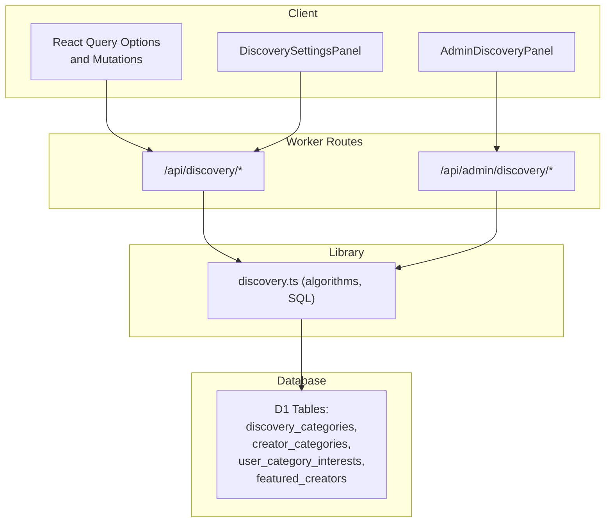
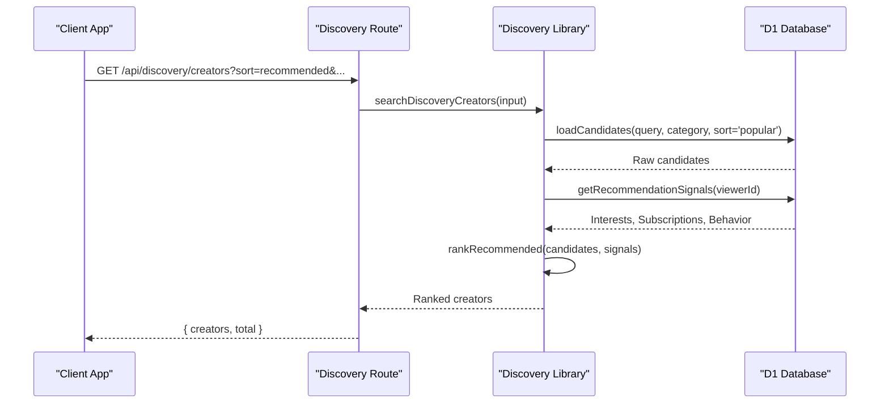
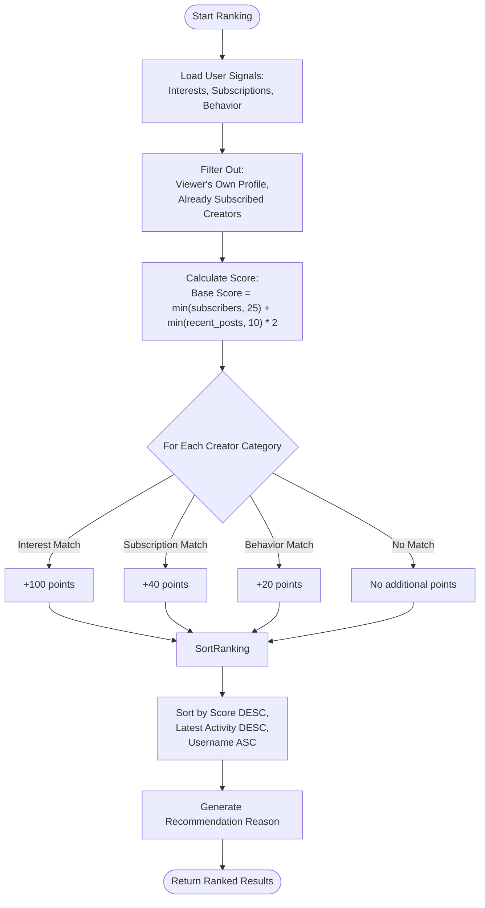
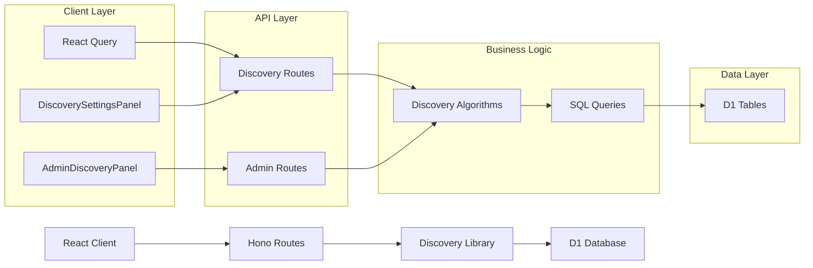

# Discovery API

<cite>
**Referenced Files in This Document**
- [discovery.ts](file://src/worker/routes/discovery.ts)
- [discovery.ts](file://src/worker/lib/discovery.ts)
- [discovery.ts](file://src/react-app/lib/discovery.ts)
- [0015_creator_discovery.sql](file://drizzle/0015_creator_discovery.sql)
- [schema.ts](file://src/worker/db/schema.ts)
- [admin.ts](file://src/worker/routes/admin.ts)
- [discovery.test.ts](file://src/worker/routes/discovery.test.ts)
- [DiscoverySettingsPanel.tsx](file://src/react-app/components/DiscoverySettingsPanel.tsx)
- [AdminDiscoveryPanel.tsx](file://src/react-app/components/AdminDiscoveryPanel.tsx)
</cite>

## Table of Contents
1. [Introduction](#introduction)
2. [Project Structure](#project-structure)
3. [Core Components](#core-components)
4. [Architecture Overview](#architecture-overview)
5. [Detailed Component Analysis](#detailed-component-analysis)
6. [Dependency Analysis](#dependency-analysis)
7. [Performance Considerations](#performance-considerations)
8. [Troubleshooting Guide](#troubleshooting-guide)
9. [Conclusion](#conclusion)
10. [Appendices](#appendices)

## Introduction
This document provides comprehensive API documentation for the content discovery and recommendation system. It covers:
- Creator discovery endpoints (search, overview, preferences)
- Category-based browsing and trending retrieval
- Algorithmic recommendations with scoring and ranking
- User preference tracking and discovery settings
- Admin management of categories and featured creators
- Data models, request/response schemas, and examples
- Performance characteristics and caching strategies used by the client

The system centers on creator discovery using category taxonomy, user interests, subscriptions, and behavioral signals to rank and recommend creators.

## Project Structure
The discovery feature spans worker routes, library logic, database schema, and React client utilities:
- Worker routes define HTTP endpoints under /api/discovery and admin endpoints under /api/admin/discovery
- Library functions implement discovery algorithms, SQL queries, and data transformations
- Database schema defines tables for categories, creator-category assignments, user interests, and featured creators
- React client exposes typed query options and mutations for discovery features



**Diagram sources**
- [discovery.ts:1-120](file://src/worker/routes/discovery.ts#L1-L120)
- [admin.ts:360-474](file://src/worker/routes/admin.ts#L360-L474)
- [discovery.ts:1-390](file://src/worker/lib/discovery.ts#L1-L390)
- [0015_creator_discovery.sql:1-70](file://drizzle/0015_creator_discovery.sql#L1-L70)

**Section sources**
- [discovery.ts:1-120](file://src/worker/routes/discovery.ts#L1-L120)
- [admin.ts:360-474](file://src/worker/routes/admin.ts#L360-L474)
- [discovery.ts:1-390](file://src/worker/lib/discovery.ts#L1-L390)
- [0015_creator_discovery.sql:1-70](file://drizzle/0015_creator_discovery.sql#L1-L70)

## Core Components
- Public discovery endpoints:
  - GET /api/discovery: Returns overview including categories, featured creators, recommended creators, and user interests
  - GET /api/discovery/creators: Search and list creators with filters and sorting
  - GET /api/discovery/preferences: Retrieve available categories and current user/creator selections
  - PUT /api/discovery/interests: Update user interest categories
  - PUT /api/discovery/creator-categories: Update public creator categories (creator role only)
- Admin discovery endpoints:
  - GET /api/admin/discovery/categories: List all categories with assignment counts
  - POST /api/admin/discovery/categories: Create a new category
  - PUT /api/admin/discovery/categories/order: Reorder all categories
  - PUT /api/admin/discovery/categories/:id: Update category metadata and active status
  - GET /api/admin/discovery/eligible-creators: Search eligible creators for curation
  - GET /api/admin/discovery/featured: Get currently featured creators
  - PUT /api/admin/discovery/featured: Replace featured creators list

All discovery endpoints require authentication via cookie/session middleware. Admin endpoints require owner-level permissions.

**Section sources**
- [discovery.ts:1-120](file://src/worker/routes/discovery.ts#L1-L120)
- [admin.ts:360-474](file://src/worker/routes/admin.ts#L360-L474)

## Architecture Overview
The discovery system combines multiple signals to rank creators:
- Interest signals from explicit user selections
- Subscription signals from active memberships
- Behavioral signals from likes and saved items
- Popularity signals from subscriber counts and recent activity
- Featured curation by administrators



**Diagram sources**
- [discovery.ts:62-73](file://src/worker/routes/discovery.ts#L62-L73)
- [discovery.ts:340-373](file://src/worker/lib/discovery.ts#L340-L373)

**Section sources**
- [discovery.ts:245-318](file://src/worker/lib/discovery.ts#L245-L318)

## Detailed Component Analysis

### HTTP Endpoints and Schemas

#### GET /api/discovery
Returns an overview including categories, featured creators, recommended creators, and user interests.

- Authentication: Required
- Response schema:
  - categories: Array of category summaries
  - featured: Array of creator cards (up to 12)
  - recommended: Array of recommended creator cards (up to 12)
  - interests: Array of user’s selected categories
  - needsInterests: Boolean indicating if user has not set any interests

Example response fields include creator id, displayName, username, tagline, avatarUrl, categories, publishedContentCount, contentTypes, featured flag, viewerSubscribed, and recommendationReason for recommended items.

**Section sources**
- [discovery.ts:58-60](file://src/worker/routes/discovery.ts#L58-L60)
- [discovery.ts:320-338](file://src/worker/lib/discovery.ts#L320-L338)

#### GET /api/discovery/creators
Searches and lists creators with filtering and sorting.

- Authentication: Required
- Query parameters:
  - q: Search string (trimmed, max 100)
  - category: Category slug filter
  - sort: One of relevance, recommended, popular, recent
  - page: Page number (min 1)
  - pageSize: Items per page (min 1, max 50)
- Response schema:
  - creators: Array of creator cards
  - total: Total count matching filters
  - page: Current page
  - pageSize: Requested page size

Sorting behavior:
- relevance: Exact match first, then prefix matches, then popularity and recency
- recommended: Personalized ranking based on interests, subscriptions, and behavior
- popular: By active subscribers, recent publications, latest activity
- recent: By latest publication time

Example usage:
- Category-based browsing: GET /api/discovery/creators?category=photography
- Trending content: GET /api/discovery/creators?sort=popular&page=1&pageSize=20
- Algorithmic recommendations: GET /api/discovery/creators?sort=recommended&page=1&pageSize=20

**Section sources**
- [discovery.ts:62-73](file://src/worker/routes/discovery.ts#L62-L73)
- [discovery.ts:340-373](file://src/worker/lib/discovery.ts#L340-L373)

#### GET /api/discovery/preferences
Retrieves available categories and current user selections.

- Authentication: Required
- Response schema:
  - categories: Full list of active categories
  - interestCategoryIds: Array of user-selected category IDs
  - creatorCategoryIds: Array of creator’s public categories (if user is a creator)

**Section sources**
- [discovery.ts:75-94](file://src/worker/routes/discovery.ts#L75-L94)

#### PUT /api/discovery/interests
Updates user interest categories.

- Authentication: Required
- Request body:
  - categoryIds: Array of unique category IDs (max 5)
- Validation: All categories must be active; duplicates are rejected
- Response: Updated categoryIds array

Behavior:
- Replaces all existing interests with provided selection
- Preserves inactive selections in database but excludes them from recommendations

**Section sources**
- [discovery.ts:96-106](file://src/worker/routes/discovery.ts#L96-L106)
- [discovery.ts:22-53](file://src/worker/lib/discovery.ts#L22-L53)

#### PUT /api/discovery/creator-categories
Updates public creator categories (creator role only).

- Authentication: Required
- Authorization: Creator role required
- Request body:
  - categoryIds: Array of unique category IDs (max 3)
- Validation: All categories must be active; duplicates are rejected
- Response: Updated categoryIds array

**Section sources**
- [discovery.ts:108-119](file://src/worker/routes/discovery.ts#L108-L119)

### Admin Endpoints

#### GET /api/admin/discovery/categories
Lists all discovery categories with assignment counts.

- Authentication: Required
- Authorization: Owner role required
- Response: { categories: [{ id, slug, name, description, displayOrder, active, assignmentCount }] }

#### POST /api/admin/discovery/categories
Creates a new discovery category.

- Authentication: Required
- Authorization: Owner role required
- Request body:
  - name: Category name (2-60 chars)
  - description: Optional description (max 200 chars)
  - reason: Audit reason (3-500 chars)
- Response: { id, slug, name } with 201 status

#### PUT /api/admin/discovery/categories/order
Reorders all discovery categories.

- Authentication: Required
- Authorization: Owner role required
- Request body:
  - categoryIds: Complete ordered list of all category IDs (unique, max 100)
  - reason: Audit reason (3-500 chars)
- Validates that all categories are present and known

#### PUT /api/admin/discovery/categories/:id
Updates category metadata and active status.

- Authentication: Required
- Authorization: Owner role required
- Request body:
  - name: New name (2-60 chars)
  - description: Optional description (max 200 chars)
  - active: Boolean to enable/disable category
  - reason: Audit reason (3-500 chars)

#### GET /api/admin/discovery/eligible-creators
Searches eligible creators for curation.

- Authentication: Required
- Authorization: Owner role required
- Query parameter:
  - q: Search string (trimmed, max 100)
- Response: { creators: CreatorDiscoveryCardData[] }

#### GET /api/admin/discovery/featured
Gets currently featured creators.

- Authentication: Required
- Authorization: Owner role required
- Response: { creators: CreatorDiscoveryCardData[] }

#### PUT /api/admin/discovery/featured
Replaces the featured creators list.

- Authentication: Required
- Authorization: Owner role required
- Request body:
  - creatorIds: Array of unique creator IDs (max 12)
  - reason: Audit reason (3-500 chars)
- Validates each creator is eligible before updating

**Section sources**
- [admin.ts:365-474](file://src/worker/routes/admin.ts#L365-L474)

### Data Models and Schema

The discovery system uses several key tables:

- discovery_categories: Central taxonomy with id, slug, name, description, display_order, active status
- creator_categories: Maps creators to categories with display order
- user_category_interests: Tracks user-selected interest categories
- featured_creators: Curated list of featured creators with ordering

```mermaid
erDiagram
DISCOVERY_CATEGORIES {
text id PK
text slug UK
text name UK_lower
text description
integer display_order
boolean active
timestamp created_at
timestamp updated_at
}
CREATOR_CATEGORIES {
text creator_id FK
text category_id FK
integer display_order
timestamp created_at
}
USER_CATEGORY_INTERESTS {
text user_id FK
text category_id FK
timestamp created_at
}
FEATURED_CREATORS {
text creator_id PK
integer display_order
text featured_by FK
timestamp created_at
timestamp updated_at
}
USERS ||--o{ CREATOR_CATEGORIES : "has"
DISCOVERY_CATEGORIES ||--o{ CREATOR_CATEGORIES : "assigned_to"
USERS ||--o{ USER_CATEGORY_INTERESTS : "selects"
DISCOVERY_CATEGORIES ||--o{ USER_CATEGORY_INTERESTS : "interest_in"
USERS ||--o{ FEATURED_CREATORS : "featured_as"
```

**Diagram sources**
- [0015_creator_discovery.sql:1-70](file://drizzle/0015_creator_discovery.sql#L1-L70)
- [schema.ts:63-105](file://src/worker/db/schema.ts#L63-L105)

**Section sources**
- [0015_creator_discovery.sql:1-70](file://drizzle/0015_creator_discovery.sql#L1-L70)
- [schema.ts:63-105](file://src/worker/db/schema.ts#L63-L105)

### Recommendation Algorithm

The recommendation system uses a multi-signal scoring approach:



**Diagram sources**
- [discovery.ts:290-318](file://src/worker/lib/discovery.ts#L290-L318)

Scoring components:
- Base score: Active subscriber count (capped at 25) + recent publication count (capped at 10, doubled)
- Category boosts: Interest (+100), Subscription (+40), Behavior (+20)
- Tie-breaking: Latest publication time, then alphabetical username
- Exclusions: Viewer’s own profile and already subscribed creators

Recommendation reasons are generated based on the strongest signal:
- Interest match: “Matches your [Category] interest”
- Subscription similarity: “Similar to creators you follow”
- Behavioral match: “Based on content you enjoyed”
- Popularity: “Popular on Zenith”
- Activity: “Recently active on Zenith”

**Section sources**
- [discovery.ts:245-318](file://src/worker/lib/discovery.ts#L245-L318)

### Content Categorization

Categories provide the foundation for discovery and personalization:
- Categories are centrally managed with slugs for stable URLs
- Creators can select up to 3 public categories displayed on their profiles
- Users can select up to 5 interest categories for recommendations
- Categories have display order for consistent UI presentation
- Active/inactive status controls visibility in discovery results

Category operations include creation, updates, reordering, and activation/deactivation through admin endpoints.

**Section sources**
- [admin.ts:365-441](file://src/worker/routes/admin.ts#L365-L441)
- [discovery.ts:151-165](file://src/worker/lib/discovery.ts#L151-L165)

### User Preference Tracking

User preferences drive personalized recommendations:
- Interest categories explicitly selected by users
- Creator categories publicly displayed on creator profiles
- Preferences are validated against active categories only
- Inactive category selections are preserved but excluded from recommendations
- Changes trigger cache invalidation in the client for fresh data

Preference endpoints support both user interests and creator category management.

**Section sources**
- [discovery.ts:96-119](file://src/worker/routes/discovery.ts#L96-L119)
- [DiscoverySettingsPanel.tsx:1-93](file://src/react-app/components/DiscoverySettingsPanel.tsx#L1-L93)

### Discovery Analytics

While explicit analytics endpoints are not implemented in the discovery module, the system includes:
- Admin audit logging for category changes and featured creator updates
- Creator eligibility validation ensures only active creators with published content appear
- Subscriber counts and engagement metrics influence ranking algorithms

Audit trails capture:
- Category creation, updates, and reordering
- Featured creator list changes
- Actor information and change reasons

**Section sources**
- [admin.ts:387-474](file://src/worker/routes/admin.ts#L387-L474)

## Dependency Analysis

The discovery system has clear separation of concerns:



Key dependencies:
- Routes depend on library functions for business logic
- Library handles SQL queries and data transformations
- Database schema enforces referential integrity
- Client uses React Query for caching and state management

**Diagram sources**
- [discovery.ts:1-120](file://src/worker/routes/discovery.ts#L1-L120)
- [admin.ts:360-474](file://src/worker/routes/admin.ts#L360-L474)
- [discovery.ts:1-390](file://src/worker/lib/discovery.ts#L1-L390)

**Section sources**
- [discovery.ts:1-120](file://src/worker/routes/discovery.ts#L1-L120)
- [admin.ts:360-474](file://src/worker/routes/admin.ts#L360-L474)
- [discovery.ts:1-390](file://src/worker/lib/discovery.ts#L1-L390)

## Performance Considerations

### Caching Strategies
The client implements intelligent caching using React Query:
- Stale time of 60 seconds for discovery queries
- Query keys structured for efficient invalidation
- Automatic refetching when preferences change
- Optimistic updates for better UX

### Database Optimization
- Indexed queries for category lookups and creator searches
- Efficient LIKE queries with proper escaping
- Batch operations for bulk updates
- Pagination limits prevent large result sets

### Algorithm Efficiency
- Candidate loading uses optimized SQL with early filtering
- Recommendation signals loaded once per ranking operation
- Score calculations use simple arithmetic operations
- Sorting leverages database capabilities where possible

### Security and Validation
- Input validation prevents SQL injection and excessive requests
- Role-based access control for admin operations
- Category validation ensures data integrity
- Proper error handling with meaningful messages

[No sources needed since this section provides general guidance]

## Troubleshooting Guide

### Common Issues and Solutions

**Authentication Errors (401)**
- Ensure valid session cookies are included in requests
- Verify user account is active and not suspended
- Check middleware configuration for proper authentication flow

**Validation Errors (422)**
- Category IDs must be unique and active
- Interest limits enforced (5 for users, 3 for creators)
- Search queries properly escaped and trimmed
- JSON payloads match expected schemas

**Permission Errors (403)**
- Admin endpoints require owner role
- Creator category updates require creator role
- Verify user roles and permissions

**Data Integrity Issues**
- Category slugs must be unique and URL-safe
- Creator eligibility requires active status and published content
- Foreign key constraints maintain referential integrity

**Performance Issues**
- Large result sets should use pagination
- Complex searches may benefit from specific category filters
- Monitor database query performance and indexing

**Section sources**
- [discovery.test.ts:59-121](file://src/worker/routes/discovery.test.ts#L59-L121)
- [discovery.ts:29-53](file://src/worker/routes/discovery.ts#L29-L53)

## Conclusion

The Discovery API provides a comprehensive system for creator discovery and recommendation with:
- Robust search and filtering capabilities
- Personalized recommendations based on multiple signals
- Flexible category management and user preferences
- Admin tools for content curation and oversight
- Strong security and validation measures
- Performance optimizations for scalability

The system balances algorithmic recommendations with human curation while maintaining data integrity and user privacy. The modular architecture allows for easy extension and maintenance.

[No sources needed since this section summarizes without analyzing specific files]

## Appendices

### Example Requests and Responses

**Category-Based Browsing**
```
GET /api/discovery/creators?category=photography&page=1&pageSize=20
```

**Trending Content Retrieval**
```
GET /api/discovery/creators?sort=popular&page=1&pageSize=20
```

**Algorithmic Recommendations**
```
GET /api/discovery/creators?sort=recommended&page=1&pageSize=20
```

**Setting User Interests**
```
PUT /api/discovery/interests
Body: { "categoryIds": ["cat-photography", "cat-art-design"] }
```

**Updating Creator Categories**
```
PUT /api/discovery/creator-categories
Body: { "categoryIds": ["cat-business", "cat-education"] }
```

**Creating Admin Category**
```
POST /api/admin/discovery/categories
Body: { "name": "Technology", "description": "Tech-related content", "reason": "Expand platform coverage" }
```

**Managing Featured Creators**
```
PUT /api/admin/discovery/featured
Body: { "creatorIds": ["creator-id-1", "creator-id-2"], "reason": "Feature launch creators" }
```

[No sources needed since this section provides example formats]