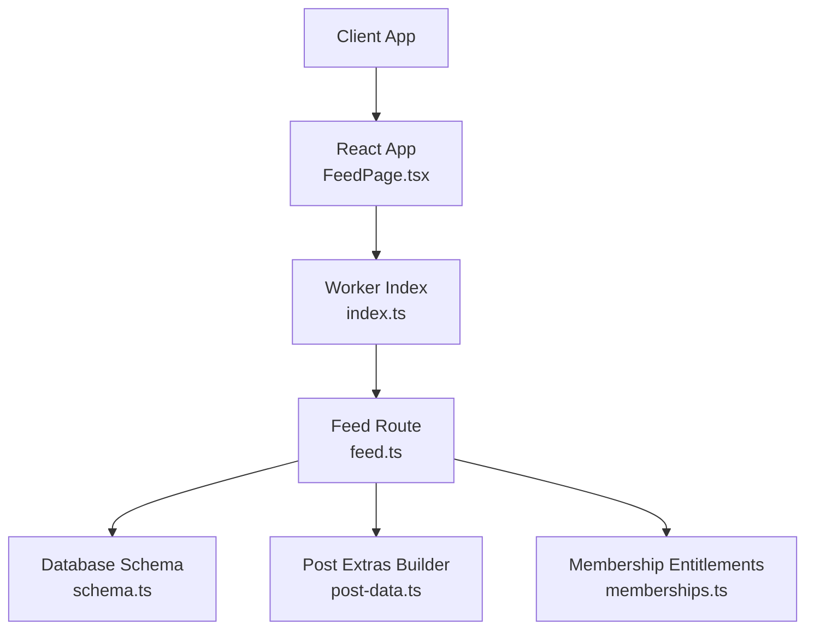
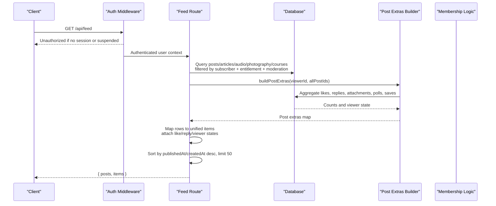
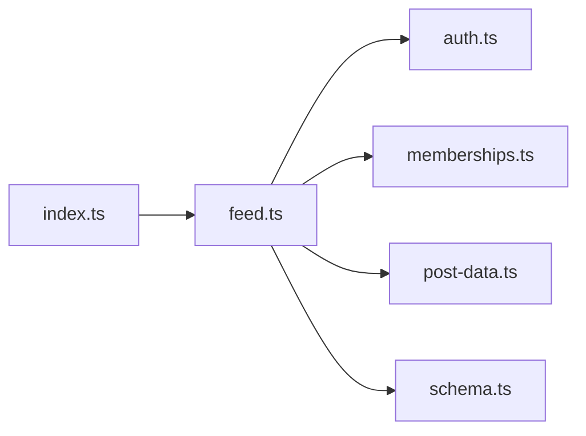

# Feed API

<cite>
**Referenced Files in This Document**
- [feed.ts](file://src/worker/routes/feed.ts)
- [index.ts](file://src/worker/index.ts)
- [auth.ts](file://src/worker/middleware/auth.ts)
- [post-data.ts](file://src/worker/lib/post-data.ts)
- [memberships.ts](file://src/worker/lib/memberships.ts)
- [schema.ts](file://src/worker/db/schema.ts)
- [0004_feed_interactions.sql](file://drizzle/0004_feed_interactions.sql)
- [0003_creator_subscriptions.sql](file://drizzle/0003_creator_subscriptions.sql)
- [posts.ts](file://src/react-app/lib/posts.ts)
- [FeedPage.tsx](file://src/react-app/pages/FeedPage.tsx)
</cite>

## Table of Contents
1. [Introduction](#introduction)
2. [Project Structure](#project-structure)
3. [Core Components](#core-components)
4. [Architecture Overview](#architecture-overview)
5. [Detailed Component Analysis](#detailed-component-analysis)
6. [Dependency Analysis](#dependency-analysis)
7. [Performance Considerations](#performance-considerations)
8. [Troubleshooting Guide](#troubleshooting-guide)
9. [Conclusion](#conclusion)

## Introduction
This document provides detailed API documentation for the feed generation endpoint that aggregates content from creators a user subscribes to across multiple content types: posts, articles, audio, photography, and courses. It specifies HTTP methods, URL patterns, request/response schemas, access control via subscriptions and membership entitlements, moderation integration, and the unified response format with consistent metadata such as like counts, reply counts, and viewer interactions.

## Project Structure
The feed system is implemented as a Hono-based worker route mounted under /api/feed. The frontend consumes this endpoint through React Query helpers and renders a unified feed view.

**Diagram sources**
- [index.ts:24-45](file://src/worker/index.ts#L24-L45)
- [feed.ts:1-20](file://src/worker/routes/feed.ts#L1-L20)
- [schema.ts:168-188](file://src/worker/db/schema.ts#L168-L188)
- [post-data.ts:144-292](file://src/worker/lib/post-data.ts#L144-L292)
- [memberships.ts:23-31](file://src/worker/lib/memberships.ts#L23-L31)

**Section sources**
- [index.ts:24-45](file://src/worker/index.ts#L24-L45)
- [feed.ts:1-20](file://src/worker/routes/feed.ts#L1-L20)

## Core Components
- Feed endpoint: GET /api/feed
- Authentication middleware: Ensures authenticated session and active account status
- Membership entitlement checks: Filters by active or valid trial subscription per creator
- Moderation filters: Only includes content with active moderation status and active author accounts
- Unified response builder: Aggregates items across content types and enriches with interaction metadata

Key behaviors:
- Returns both legacy posts array and a unified items array sorted by publishedAt/createdAt descending
- Enriches each item with likeCount, replyCount, viewerLiked, viewerSaved, and type-specific fields
- Limits results to 50 items per request (no pagination parameters supported)

**Section sources**
- [feed.ts:13-394](file://src/worker/routes/feed.ts#L13-L394)
- [auth.ts:23-50](file://src/worker/middleware/auth.ts#L23-L50)
- [memberships.ts:23-31](file://src/worker/lib/memberships.ts#L23-L31)
- [post-data.ts:144-292](file://src/worker/lib/post-data.ts#L144-L292)

## Architecture Overview
The feed endpoint performs multiple queries to gather eligible content from subscribed creators, then merges and sorts them into a single list.

**Diagram sources**
- [feed.ts:13-394](file://src/worker/routes/feed.ts#L13-L394)
- [post-data.ts:144-292](file://src/worker/lib/post-data.ts#L144-L292)
- [memberships.ts:23-31](file://src/worker/lib/memberships.ts#L23-L31)

## Detailed Component Analysis

### Endpoint Definition
- Method: GET
- URL: /api/feed
- Authentication: Required (session-based). Suspended accounts are rejected.
- Request body: None
- Response codes:
  - 200 OK: Success with data
  - 401 Unauthorized: Missing or invalid session
  - 403 Forbidden: Account suspended or insufficient role where applicable

Response schema:
- posts: Array of post-type items (legacy compatibility)
- items: Unified array containing any of the following types:
  - post
  - article
  - audio
  - photography
  - course
- message: Optional string when no subscribed creators exist

Unified item fields:
- Common:
  - id: string
  - postId: string (for non-post types; equals id for posts)
  - type: 'post' | 'article' | 'audio' | 'photography' | 'course'
  - slug: string
  - createdAt: number (Unix seconds)
  - publishedAt: number | null (Unix seconds)
  - updatedAt: number | null (Unix seconds, where applicable)
  - author: { id, displayName, username, avatarUrl }
  - likeCount: number
  - replyCount: number
  - viewerLiked: boolean
  - viewerSaved: boolean
- Type-specific highlights:
  - post: body, attachments[], poll?
  - article: title, excerpt, markdown (empty), status, coverUrl
  - audio: kind, description, status, streamUrl, coverUrl, durationSeconds, collection{...}
  - photography: title, description, status, downloadsEnabled, shootDate, coverPhotoId, coverUrl, photoCount, photos[]
  - course: title, description, status, creator{...}

Notes:
- Sorting: Items are sorted by publishedAt if present, otherwise createdAt, descending.
- Limit: Maximum 50 items returned.
- No query parameters for filtering or pagination are supported on this endpoint.

**Section sources**
- [feed.ts:13-394](file://src/worker/routes/feed.ts#L13-L394)
- [posts.ts:82-86](file://src/react-app/lib/posts.ts#L82-L86)

### Access Control and Subscription Entitlements
- Authentication: Session must be valid; user must not be suspended.
- Subscription requirement: Each content item’s creator must have an active subscription membership for the requesting user.
- Entitlement condition: Active status or trialing with a future trialEndsAt timestamp.

Implementation details:
- authMiddleware validates session and account status, sets c.var.user.
- membershipEntitlementCondition() is applied to all content queries to ensure only entitled content is included.

**Section sources**
- [auth.ts:23-50](file://src/worker/middleware/auth.ts#L23-L50)
- [memberships.ts:23-31](file://src/worker/lib/memberships.ts#L23-L31)
- [feed.ts:31-38](file://src/worker/routes/feed.ts#L31-L38)

### Moderation Integration
- Content inclusion requires:
  - posts.moderationStatus = 'active'
  - users.accountStatus = 'active'
  - For articles: articles.status = 'published'
  - For audio: audioItems.status = 'published' and audioCollections.status = 'published'
  - For photography: photographyAlbums.status = 'published'
  - For courses: courses.status = 'published'

These conditions are enforced in each content query within the feed endpoint.

**Section sources**
- [feed.ts:31-38](file://src/worker/routes/feed.ts#L31-L38)
- [feed.ts:66-74](file://src/worker/routes/feed.ts#L66-L74)
- [feed.ts:109-117](file://src/worker/routes/feed.ts#L109-L117)
- [feed.ts:145-152](file://src/worker/routes/feed.ts#L145-L152)
- [feed.ts:177-184](file://src/worker/routes/feed.ts#L177-L184)

### Unified Response Format and Interaction Metadata
- Post extras aggregation:
  - Attachments per post
  - Like counts per post
  - Reply counts per post (only active replies from active authors)
  - Viewer liked post IDs
  - Viewer saved post IDs
  - Poll summaries including options and vote counts

- Mapping:
  - Each content row is mapped to a unified item with consistent fields
  - Author info is normalized across types
  - URLs for media are generated via helper functions

**Section sources**
- [post-data.ts:144-292](file://src/worker/lib/post-data.ts#L144-L292)
- [feed.ts:225-393](file://src/worker/routes/feed.ts#L225-L393)

### Data Models and Relationships
Core tables involved:
- posts: Base entity with kind discriminator and moderation fields
- Articles, Audio collections/items, Photography albums/photos, Courses: Extended entities linked to posts
- subscription_memberships: Links subscribers to creators with entitlement status
- post_likes, post_replies, saved_items, post_polls, poll_options, poll_votes: Interaction and engagement data

Indexes and constraints:
- Unique constraints on subscription memberships (subscriber_id, creator_id)
- Moderation and publication status fields used for filtering
- Timestamps for ordering and scheduling

**Section sources**
- [schema.ts:168-188](file://src/worker/db/schema.ts#L168-L188)
- [0004_feed_interactions.sql:1-123](file://drizzle/0004_feed_interactions.sql#L1-L123)
- [0003_creator_subscriptions.sql:72-105](file://drizzle/0003_creator_subscriptions.sql#L72-L105)

### Frontend Consumption
- The React app calls /api/feed using a typed query helper.
- FeedPage renders different cards based on item.type.
- Empty state displays a message when no subscribed creators exist.

**Section sources**
- [posts.ts:96-101](file://src/react-app/lib/posts.ts#L96-L101)
- [FeedPage.tsx:10-59](file://src/react-app/pages/FeedPage.tsx#L10-L59)

## Dependency Analysis
The feed endpoint depends on authentication, membership logic, database schema, and post extras utilities.

**Diagram sources**
- [feed.ts:1-20](file://src/worker/routes/feed.ts#L1-L20)
- [auth.ts:1-20](file://src/worker/middleware/auth.ts#L1-L20)
- [memberships.ts:1-20](file://src/worker/lib/memberships.ts#L1-L20)
- [post-data.ts:1-20](file://src/worker/lib/post-data.ts#L1-L20)
- [schema.ts:1-20](file://src/worker/db/schema.ts#L1-L20)
- [index.ts:24-45](file://src/worker/index.ts#L24-L45)

**Section sources**
- [index.ts:24-45](file://src/worker/index.ts#L24-L45)
- [feed.ts:1-20](file://src/worker/routes/feed.ts#L1-L20)

## Performance Considerations
- Single request returns up to 50 items; no server-side pagination parameters are supported.
- Multiple queries are executed per content type; consider batching and caching strategies at the client layer.
- Post extras aggregation uses parallel queries to minimize latency.
- Avoid repeated full feed fetches; leverage client-side caching and stale-time settings.

[No sources needed since this section provides general guidance]

## Troubleshooting Guide
Common issues and resolutions:
- 401 Unauthorized: Ensure a valid session is present and cookies are sent with credentials.
- 403 Forbidden: Check if the account is suspended or lacks required roles.
- Empty feed: Verify subscriptions exist and entitlements are active or trial-valid.
- Missing interactions: Confirm likes, replies, and saves are recorded and not filtered by moderation.

Error handling:
- authMiddleware returns unauthorized for missing sessions and errorResponse for suspended accounts.
- Feed endpoint returns a message field when no subscribed creators are found.

**Section sources**
- [auth.ts:23-50](file://src/worker/middleware/auth.ts#L23-L50)
- [feed.ts:214-216](file://src/worker/routes/feed.ts#L214-L216)

## Conclusion
The feed API provides a unified, secure, and moderated aggregation of content from subscribed creators across multiple types. It enforces subscription-based access control, integrates moderation checks, and returns a consistent response format enriched with interaction metadata. Clients should handle empty states and rely on client-side caching for performance.

[No sources needed since this section summarizes without analyzing specific files]