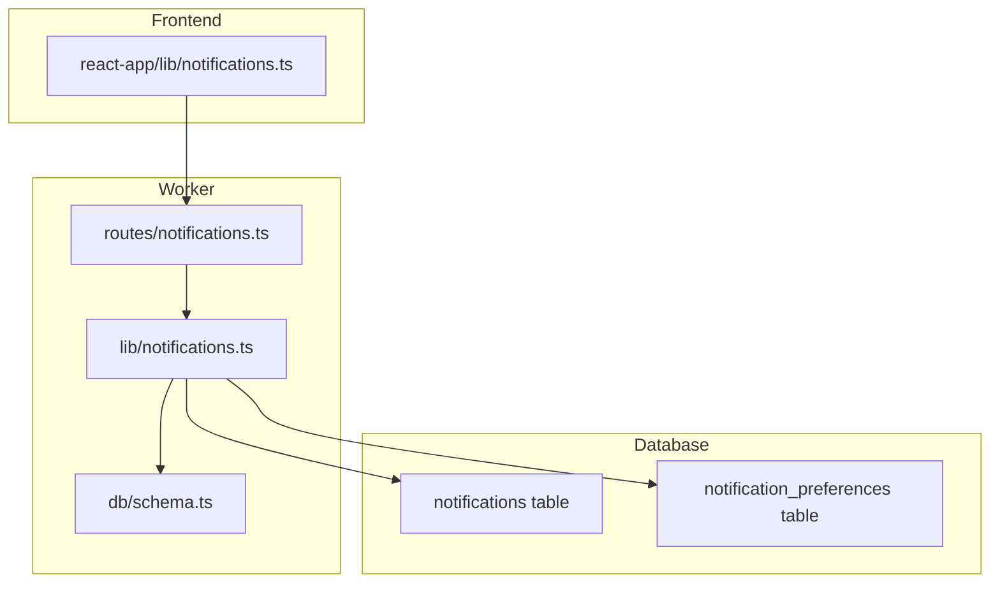
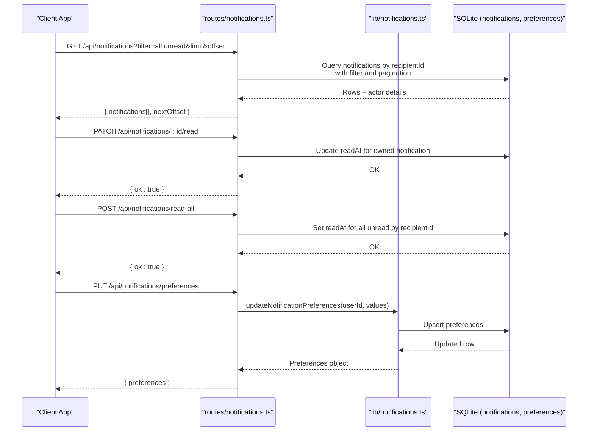
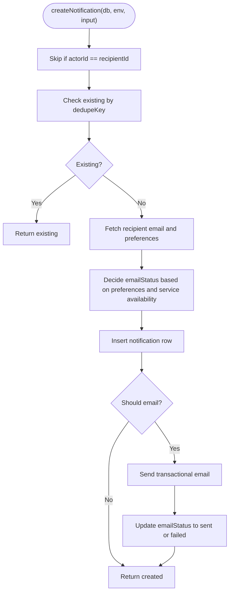
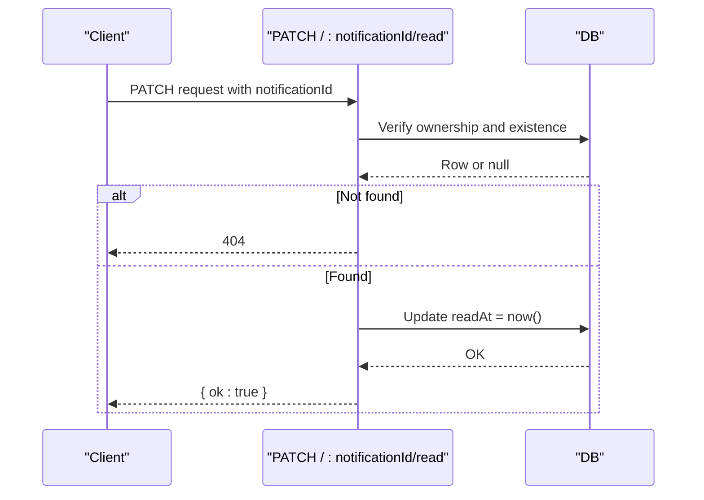
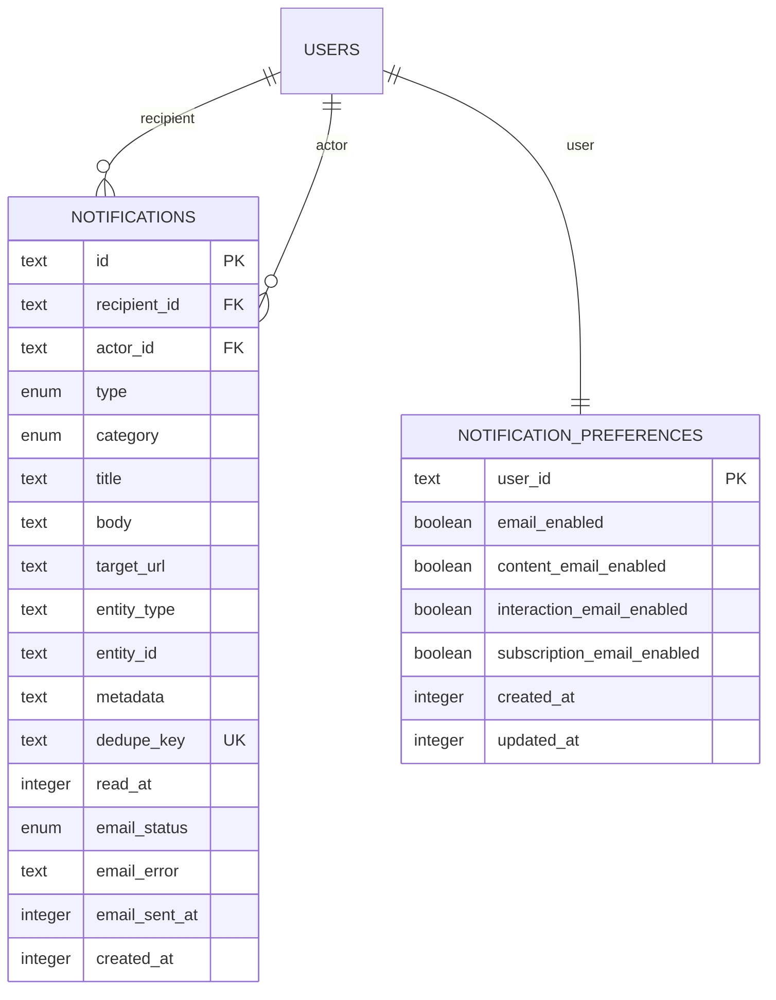
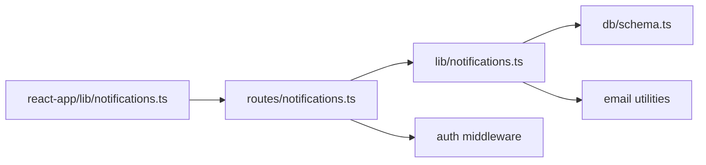

# Notifications API

<cite>
**Referenced Files in This Document**
- [notifications.ts](file://src/worker/routes/notifications.ts)
- [notifications.ts](file://src/worker/lib/notifications.ts)
- [schema.ts](file://src/worker/db/schema.ts)
- [0009_notifications.sql](file://drizzle/0009_notifications.sql)
- [notifications.ts](file://src/react-app/lib/notifications.ts)
- [notifications.integration.test.ts](file://src/worker/routes/notifications.integration.test.ts)
</cite>

## Table of Contents
1. [Introduction](#introduction)
2. [Project Structure](#project-structure)
3. [Core Components](#core-components)
4. [Architecture Overview](#architecture-overview)
5. [Detailed Component Analysis](#detailed-component-analysis)
6. [Dependency Analysis](#dependency-analysis)
7. [Performance Considerations](#performance-considerations)
8. [Troubleshooting Guide](#troubleshooting-guide)
9. [Conclusion](#conclusion)
10. [Appendices](#appendices)

## Introduction
This document provides comprehensive API documentation for the notification management endpoints. It covers notification creation, retrieval, marking as read, bulk operations, and preferences management. It also explains notification types, categories, email delivery behavior, filtering, pagination, and data model constraints. Real-time delivery is not implemented via server push; clients should poll or use background tasks to fetch updates.

## Project Structure
The notifications feature spans three layers:
- Worker routes (HTTP endpoints)
- Library logic (notification creation, preferences, and helpers)
- Database schema (tables and indexes)
- Frontend client library (React Query hooks and typed responses)

**Diagram sources**
- [notifications.ts:1-188](file://src/worker/routes/notifications.ts#L1-L188)
- [notifications.ts:1-461](file://src/worker/lib/notifications.ts#L1-L461)
- [schema.ts:871-930](file://src/worker/db/schema.ts#L871-L930)
- [notifications.ts:1-79](file://src/react-app/lib/notifications.ts#L1-L79)

**Section sources**
- [notifications.ts:1-188](file://src/worker/routes/notifications.ts#L1-L188)
- [notifications.ts:1-461](file://src/worker/lib/notifications.ts#L1-L461)
- [schema.ts:871-930](file://src/worker/db/schema.ts#L871-L930)
- [notifications.ts:1-79](file://src/react-app/lib/notifications.ts#L1-L79)

## Core Components
- HTTP endpoints for listing, unread count, preferences, marking read, and bulk mark-read.
- Notification creation utilities with deduplication and optional email delivery based on user preferences.
- Data models for notifications and preferences with robust indexing.
- Frontend client functions and query keys for efficient caching and polling.

Key responsibilities:
- Route handlers validate inputs, enforce authentication, and return JSON payloads.
- Library functions encapsulate business rules: preference checks, deduplication, email status tracking, and helper methods for various event types.
- Schema defines tables, enums, and indexes that support efficient queries and integrity.

**Section sources**
- [notifications.ts:1-188](file://src/worker/routes/notifications.ts#L1-L188)
- [notifications.ts:1-461](file://src/worker/lib/notifications.ts#L1-L461)
- [schema.ts:871-930](file://src/worker/db/schema.ts#L871-L930)

## Architecture Overview
The notification system follows a clear separation of concerns:
- Routes expose REST endpoints under /api/notifications.
- Library functions implement creation and preference logic.
- Database stores notifications and preferences with unique constraints and indexes.
- Frontend uses React Query to cache and refetch data efficiently.

**Diagram sources**
- [notifications.ts:74-183](file://src/worker/routes/notifications.ts#L74-L183)
- [notifications.ts:118-151](file://src/worker/lib/notifications.ts#L118-L151)

## Detailed Component Analysis

### Endpoints Reference
All endpoints require authentication via middleware.

- List notifications
  - Method: GET
  - URL: /api/notifications
  - Query parameters:
    - filter: all | unread (default: all)
    - limit: integer 1..50 (default: 30)
    - offset: integer >= 0 (default: 0)
  - Response:
    - notifications: array of NotificationItem
    - nextOffset: number | null
  - Notes:
    - Unread-only when filter=unread
    - Sorted by created_at descending
    - Includes actor info joined from users

- Unread count
  - Method: GET
  - URL: /api/notifications/unread-count
  - Response: { count: number }

- Get preferences
  - Method: GET
  - URL: /api/notifications/preferences
  - Response: { preferences: NotificationPreferences }

- Update preferences
  - Method: PUT
  - URL: /api/notifications/preferences
  - Body: NotificationPreferences
  - Response: { preferences: NotificationPreferences }

- Mark single notification read
  - Method: PATCH
  - URL: /api/notifications/:notificationId/read
  - Path param: notificationId (validated)
  - Response: { ok: true }
  - Behavior: Sets readAt timestamp; returns 404 if not found or not owned

- Bulk mark all unread as read
  - Method: POST
  - URL: /api/notifications/read-all
  - Response: { ok: true }

**Section sources**
- [notifications.ts:74-183](file://src/worker/routes/notifications.ts#L74-L183)
- [notifications.ts:49-78](file://src/react-app/lib/notifications.ts#L49-L78)

### Request and Response Schemas

- NotificationItem fields:
  - id: string
  - type: string
  - category: 'content' | 'interaction' | 'subscription' | 'account'
  - title: string
  - body: string
  - targetUrl: string | null
  - entityType: string | null
  - entityId: string | null
  - metadata: Record<string, unknown> | null
  - readAt: number | null
  - unread: boolean
  - emailStatus: 'not_applicable' | 'pending' | 'sent' | 'failed'
  - emailError: string | null
  - emailSentAt: number | null
  - createdAt: number | null
  - actor: { id: string; displayName: string | null; username: string | null; avatarUrl: string | null } | null

- NotificationPreferences fields:
  - emailEnabled: boolean
  - contentEmailEnabled: boolean
  - interactionEmailEnabled: boolean
  - subscriptionEmailEnabled: boolean

- NotificationsResponse:
  - notifications: NotificationItem[]
  - nextOffset: number | null

**Section sources**
- [notifications.ts:6-40](file://src/react-app/lib/notifications.ts#L6-L40)
- [notifications.ts:27-72](file://src/worker/routes/notifications.ts#L27-L72)

### Notification Types and Categories
- Categories:
  - content
  - interaction
  - subscription
  - account

- Types include:
  - content_published
  - reply_created
  - post_liked
  - subscription_started
  - subscription_active
  - subscription_status_changed
  - payment_failed
  - creator_application_approved
  - creator_application_rejected
  - content_hidden
  - content_restored
  - account_suspended
  - account_restored
  - content_schedule_failed

These are enforced at the database level and used throughout the library for consistent categorization.

**Section sources**
- [schema.ts:871-915](file://src/worker/db/schema.ts#L871-L915)
- [notifications.ts:14-31](file://src/worker/lib/notifications.ts#L14-L31)

### Email Delivery Mechanism
- Email delivery is optional and governed by user preferences:
  - Global emailEnabled
  - Category-specific toggles: contentEmailEnabled, interactionEmailEnabled, subscriptionEmailEnabled
  - Account category always allowed
- When creating a notification:
  - If preferences allow and email service is available, emailStatus transitions through pending -> sent or failed
  - Otherwise, emailStatus remains not_applicable
- Errors during email sending are captured and stored in emailError

Note: There is no built-in real-time delivery mechanism. Clients should poll endpoints or integrate external services for push notifications.

**Section sources**
- [notifications.ts:82-116](file://src/worker/lib/notifications.ts#L82-L116)
- [notifications.ts:153-234](file://src/worker/lib/notifications.ts#L153-L234)

### Filtering, Search, and Pagination
- Filtering:
  - filter=all retrieves all notifications for the authenticated user
  - filter=unread restricts to notifications where readAt is null
- Pagination:
  - limit capped between 1 and 50 (default 30)
  - offset defaults to 0
  - nextOffset indicates whether more results exist
- Search:
  - No search endpoint is provided; clients can filter locally using metadata, type, category, or entity identifiers

**Section sources**
- [notifications.ts:74-119](file://src/worker/routes/notifications.ts#L74-L119)

### Retention Policies and Cleanup Strategies
- Deduplication:
  - Unique constraint on dedupe_key prevents duplicate notifications
- Indexing:
  - Optimized indexes support fast reads by recipient_id and sorting by created_at
- Cleanup:
  - No automatic cleanup is implemented in this codebase
  - Recommended strategies:
    - Periodic job to archive or delete old notifications beyond a retention window
    - Use email_sent_at and readAt to prioritize archival
    - Maintain separate audit logs if required

[No sources needed since this section provides general guidance]

### Real-Time Notification Delivery
- The current implementation does not include server-push or WebSocket-based delivery.
- Recommended approaches:
  - Poll GET /api/notifications periodically with staleTime tuning
  - Use the unread-count endpoint to drive UI badges
  - Integrate with platform-specific push services (e.g., browser push, mobile push) if needed

[No sources needed since this section provides general guidance]

### Bulk Operations
- Mark all unread as read:
  - POST /api/notifications/read-all sets readAt for all unread notifications belonging to the authenticated user

**Section sources**
- [notifications.ts:174-183](file://src/worker/routes/notifications.ts#L174-L183)

### Example Workflows

#### Create a notification (library usage)

**Diagram sources**
- [notifications.ts:153-234](file://src/worker/lib/notifications.ts#L153-L234)

#### Mark a notification as read

**Diagram sources**
- [notifications.ts:149-172](file://src/worker/routes/notifications.ts#L149-L172)

### Conceptual Overview
- Notifications are persisted per recipient with rich metadata and actor context.
- Preferences control email delivery per category.
- Endpoints provide CRUD-like capabilities for reading and updating read state, plus preferences management.
- Deduplication ensures idempotency across repeated events.

**Diagram sources**
- [schema.ts:871-930](file://src/worker/db/schema.ts#L871-L930)
- [0009_notifications.sql:1-41](file://drizzle/0009_notifications.sql#L1-L41)

## Dependency Analysis
- Routes depend on:
  - Authentication middleware
  - Validation schemas
  - Database client
  - Notification library functions
- Library depends on:
  - Database schema definitions
  - Email utility functions
  - Membership entitlement conditions
- Frontend depends on:
  - API client helpers
  - React Query for caching and refetching

**Diagram sources**
- [notifications.ts:1-10](file://src/worker/routes/notifications.ts#L1-L10)
- [notifications.ts:1-13](file://src/worker/lib/notifications.ts#L1-L13)
- [notifications.ts:1-3](file://src/react-app/lib/notifications.ts#L1-L3)

**Section sources**
- [notifications.ts:1-10](file://src/worker/routes/notifications.ts#L1-L10)
- [notifications.ts:1-13](file://src/worker/lib/notifications.ts#L1-L13)
- [notifications.ts:1-3](file://src/react-app/lib/notifications.ts#L1-L3)

## Performance Considerations
- Pagination limits prevent large payloads; default limit is 30 with max 50.
- Indexes optimize common queries:
  - recipient_id + read_at + created_at
  - recipient_id + created_at
  - actor_id
- Deduplication avoids redundant writes and reduces storage growth.
- Email sending is asynchronous in effect; failures are recorded without blocking response.

[No sources needed since this section provides general guidance]

## Troubleshooting Guide
Common issues and resolutions:
- 404 when marking read:
  - Ensure the notification belongs to the authenticated user and exists
- Duplicate notifications:
  - Verify dedupe_key uniqueness; ensure callers generate stable keys per event
- Missing emails:
  - Check user preferences and global emailEnabled flag
  - Inspect emailStatus and emailError fields
- Large lists:
  - Adjust limit and offset; consider client-side filtering by category or type

**Section sources**
- [notifications.integration.test.ts:136-176](file://src/worker/routes/notifications.integration.test.ts#L136-L176)
- [notifications.ts:153-234](file://src/worker/lib/notifications.ts#L153-L234)

## Conclusion
The Notifications API provides a robust foundation for managing user notifications with strong data integrity, flexible preferences, and efficient querying. While real-time delivery is not included, clients can achieve near-real-time experiences through polling and careful caching. For long-term scalability, implement retention policies and periodic cleanup jobs.

[No sources needed since this section summarizes without analyzing specific files]

## Appendices

### Endpoint Summary Table
- GET /api/notifications
  - Purpose: List notifications with filtering and pagination
  - Auth: Required
  - Response: { notifications[], nextOffset }

- GET /api/notifications/unread-count
  - Purpose: Count unread notifications
  - Auth: Required
  - Response: { count }

- GET /api/notifications/preferences
  - Purpose: Retrieve user preferences
  - Auth: Required
  - Response: { preferences }

- PUT /api/notifications/preferences
  - Purpose: Update user preferences
  - Auth: Required
  - Request: { preferences }
  - Response: { preferences }

- PATCH /api/notifications/:notificationId/read
  - Purpose: Mark a single notification as read
  - Auth: Required
  - Response: { ok: true }

- POST /api/notifications/read-all
  - Purpose: Mark all unread notifications as read
  - Auth: Required
  - Response: { ok: true }

**Section sources**
- [notifications.ts:74-183](file://src/worker/routes/notifications.ts#L74-L183)
- [notifications.ts:49-78](file://src/react-app/lib/notifications.ts#L49-L78)