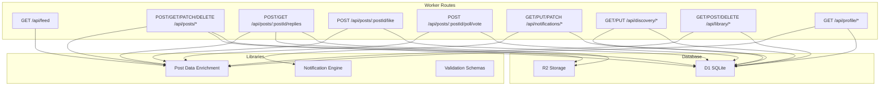
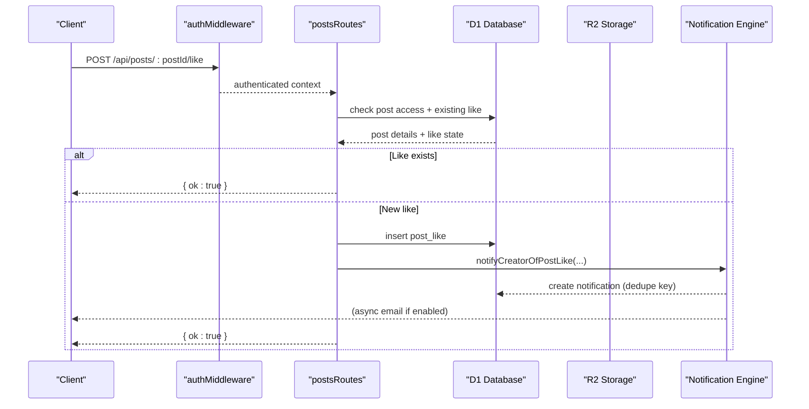
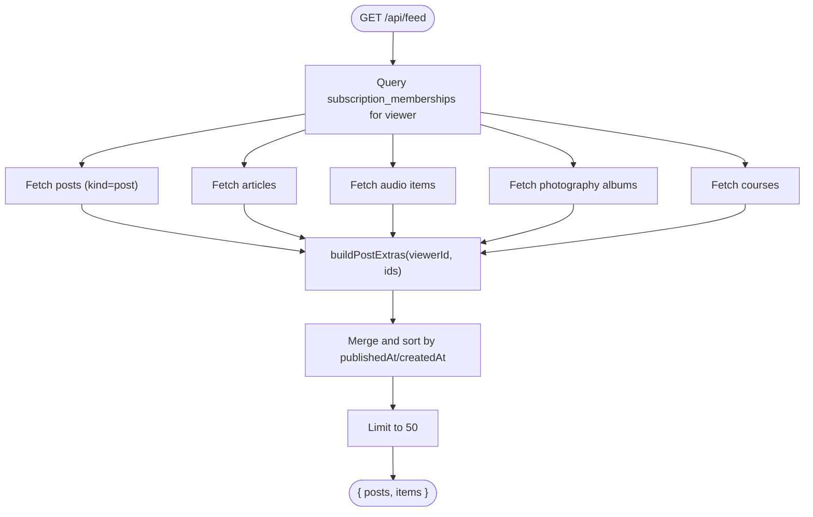
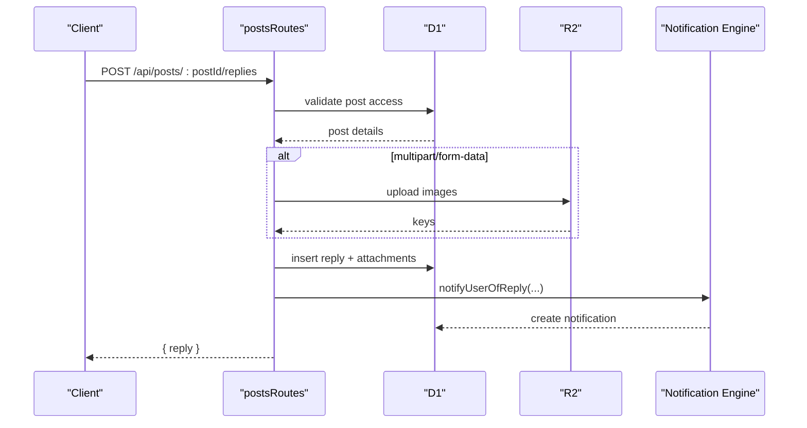
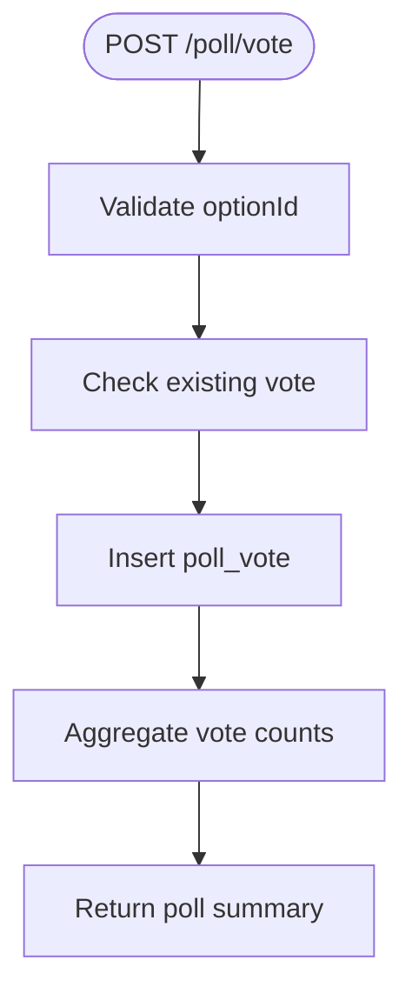
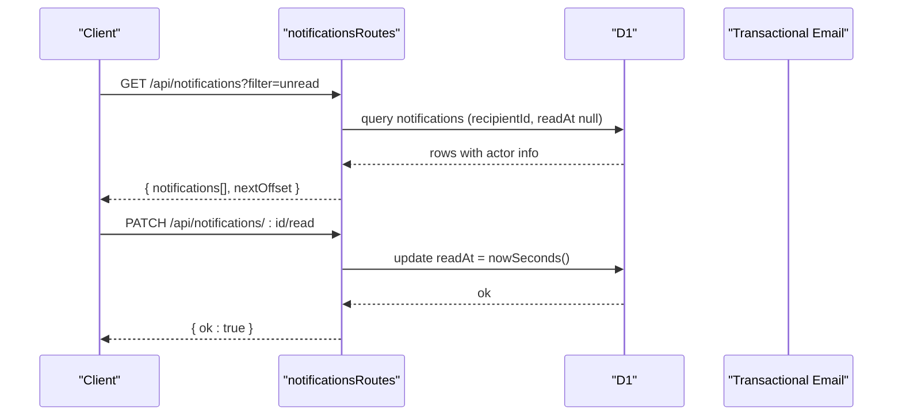
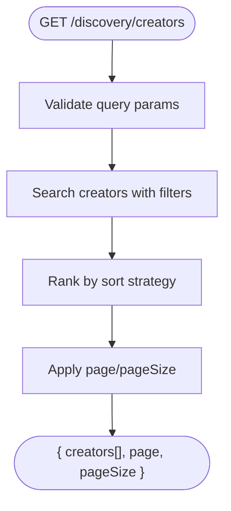
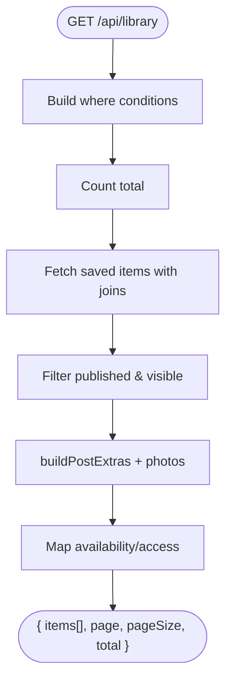
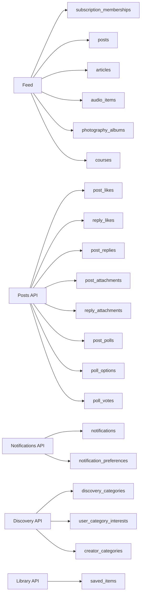

# Social Features API

<cite>
**Referenced Files in This Document**
- [feed.ts](file://src/worker/routes/feed.ts)
- [posts.ts](file://src/worker/routes/posts.ts)
- [notifications.ts](file://src/worker/routes/notifications.ts)
- [discovery.ts](file://src/worker/routes/discovery.ts)
- [library.ts](file://src/worker/routes/library.ts)
- [profile.ts](file://src/worker/routes/profile.ts)
- [notifications.ts (lib)](file://src/worker/lib/notifications.ts)
- [post-data.ts](file://src/worker/lib/post-data.ts)
- [schemas.ts](file://src/worker/lib/schemas.ts)
- [0004_feed_interactions.sql](file://drizzle/0004_feed_interactions.sql)
- [0009_notifications.sql](file://drizzle/0009_notifications.sql)
</cite>

## Table of Contents
1. [Introduction](#introduction)
2. [Project Structure](#project-structure)
3. [Core Components](#core-components)
4. [Architecture Overview](#architecture-overview)
5. [Detailed Component Analysis](#detailed-component-analysis)
6. [Dependency Analysis](#dependency-analysis)
7. [Performance Considerations](#performance-considerations)
8. [Troubleshooting Guide](#troubleshooting-guide)
9. [Conclusion](#conclusion)
10. [Appendices](#appendices)

## Introduction
This document provides comprehensive API documentation for social interaction endpoints, including feed generation, content interactions (likes, replies, comments), notifications, discovery, and library management. It specifies HTTP methods, URL patterns, request/response schemas, pagination examples, real-time notification considerations, engagement metrics, relationship management between users and content, activity tracking, rate limiting guidance, spam prevention, moderation integration, and notification delivery mechanisms with preference management.

## Project Structure
The social features are implemented as Hono routes under the worker layer, with shared libraries for data enrichment, notifications, and schema validation. Database migrations define core tables for interactions and notifications.

**Diagram sources**
- [feed.ts:1-395](file://src/worker/routes/feed.ts#L1-L395)
- [posts.ts:1-800](file://src/worker/routes/posts.ts#L1-L800)
- [notifications.ts:1-188](file://src/worker/routes/notifications.ts#L1-L188)
- [discovery.ts:1-120](file://src/worker/routes/discovery.ts#L1-L120)
- [library.ts:1-200](file://src/worker/routes/library.ts#L1-L200)
- [profile.ts:1-329](file://src/worker/routes/profile.ts#L1-L329)
- [notifications.ts (lib):1-461](file://src/worker/lib/notifications.ts#L1-L461)
- [post-data.ts:1-350](file://src/worker/lib/post-data.ts#L1-L350)

**Section sources**
- [feed.ts:1-395](file://src/worker/routes/feed.ts#L1-L395)
- [posts.ts:1-800](file://src/worker/routes/posts.ts#L1-L800)
- [notifications.ts:1-188](file://src/worker/routes/notifications.ts#L1-L188)
- [discovery.ts:1-120](file://src/worker/routes/discovery.ts#L1-L120)
- [library.ts:1-200](file://src/worker/routes/library.ts#L1-L200)
- [profile.ts:1-329](file://src/worker/routes/profile.ts#L1-L329)
- [notifications.ts (lib):1-461](file://src/worker/lib/notifications.ts#L1-L461)
- [post-data.ts:1-350](file://src/worker/lib/post-data.ts#L1-L350)

## Core Components
- Feed Generation: Aggregates posts, articles, audio items, photography albums, and courses from creators you subscribe to, applying membership entitlements and moderation filters.
- Content Interactions: Likes on posts and replies, threaded replies with attachments, polls creation and voting.
- Notifications: In-app notifications with read/unread state, email delivery based on preferences, deduplication, and categories.
- Discovery: Creator search with sorting by relevance, recommended, popular, recent; category-based filtering and user interests.
- Library: Saved items across content types with access checks and metadata enrichment.
- Profile: Public profile info, subscriptions/subscribers lists, and creator content listings.

**Section sources**
- [feed.ts:1-395](file://src/worker/routes/feed.ts#L1-L395)
- [posts.ts:1-800](file://src/worker/routes/posts.ts#L1-L800)
- [notifications.ts:1-188](file://src/worker/routes/notifications.ts#L1-L188)
- [discovery.ts:1-120](file://src/worker/routes/discovery.ts#L1-L120)
- [library.ts:1-200](file://src/worker/routes/library.ts#L1-L200)
- [profile.ts:1-329](file://src/worker/routes/profile.ts#L1-L329)

## Architecture Overview
Social operations follow a consistent flow:
- Authentication middleware validates the user context.
- Route handlers parse and validate inputs using Zod schemas.
- Data access uses Drizzle ORM against D1.
- Media uploads go to R2 storage.
- Side effects trigger notifications via the notification engine.
- Responses include enriched metadata like like counts, reply counts, viewer states, and poll results.

**Diagram sources**
- [posts.ts:779-800](file://src/worker/routes/posts.ts#L779-L800)
- [notifications.ts (lib):362-388](file://src/worker/lib/notifications.ts#L362-L388)

**Section sources**
- [posts.ts:1-800](file://src/worker/routes/posts.ts#L1-L800)
- [notifications.ts (lib):1-461](file://src/worker/lib/notifications.ts#L1-L461)

## Detailed Component Analysis

### Feed API
- GET /api/feed
  - Method: GET
  - Auth: Required
  - Description: Returns a unified feed of subscribed creators’ content (posts, articles, audio, photography, courses). Applies membership entitlements and moderation filters.
  - Response fields:
    - posts: array of post items with author, attachments, likeCount, replyCount, viewerLiked, viewerSaved, poll
    - items: merged timeline sorted by publishedAt/createdAt
  - Notes:
    - Limits to 50 items per call
    - Uses buildPostExtras to enrich like/reply counts, viewer states, and polls

**Diagram sources**
- [feed.ts:13-394](file://src/worker/routes/feed.ts#L13-L394)
- [post-data.ts:144-292](file://src/worker/lib/post-data.ts#L144-L292)

**Section sources**
- [feed.ts:1-395](file://src/worker/routes/feed.ts#L1-L395)
- [post-data.ts:1-350](file://src/worker/lib/post-data.ts#L1-L350)

### Posts API
- POST /api/posts
  - Method: POST
  - Auth: Required, role: creator
  - Body: multipart/form-data or JSON
  - Fields: body (1–500 chars), scheduledFor (optional ISO datetime), images (up to 4, JPEG/PNG/WebP, max 5MB each), poll (question + 2–4 options)
  - Response: created post with id, slug, timestamps, schedule status if applicable
  - Side effects: upload attachments to R2, create poll, schedule publication if provided, notify subscribers

- PATCH /api/posts/:postId
  - Method: PATCH
  - Auth: Required, role: creator
  - Purpose: Update draft posts (body, images, poll, remove attachments)
  - Validation: same constraints as create; prevents editing moderated or published posts

- DELETE /api/posts/:postId
  - Method: DELETE
  - Auth: Required, role: creator
  - Purpose: Delete draft post and associated attachments

- GET /api/posts/by-slug/:username/:slug
  - Method: GET
  - Auth: Required
  - Purpose: Retrieve a specific post with replies and extras

- GET /api/posts/:postId/replies
  - Method: GET
  - Auth: Required
  - Purpose: List replies for a post with attachments and like state

- POST /api/posts/:postId/replies
  - Method: POST
  - Auth: Required
  - Body: multipart/form-data or JSON with body (1–2000 chars), parentReplyId (optional), images (up to 4, same rules)
  - Response: created reply with author, attachments, like state
  - Side effects: notify mentioned user

- POST /api/posts/:postId/like
  - Method: POST
  - Auth: Required
  - Purpose: Toggle like on a post (idempotent)
  - Side effects: notify creator if new like

**Diagram sources**
- [posts.ts:695-775](file://src/worker/routes/posts.ts#L695-L775)
- [notifications.ts (lib):328-360](file://src/worker/lib/notifications.ts#L328-L360)

**Section sources**
- [posts.ts:1-800](file://src/worker/routes/posts.ts#L1-L800)
- [post-data.ts:1-350](file://src/worker/lib/post-data.ts#L1-L350)
- [schemas.ts:25-67](file://src/worker/lib/schemas.ts#L25-L67)

### Polls API
- POST /api/posts/:postId/poll/vote
  - Method: POST
  - Auth: Required
  - Body: optionId
  - Purpose: Vote on a poll option (one vote per user per poll)
  - Response: updated poll summary with vote counts and viewerOptionId

**Diagram sources**
- [posts.ts:1-800](file://src/worker/routes/posts.ts#L1-L800)
- [post-data.ts:144-292](file://src/worker/lib/post-data.ts#L144-L292)

**Section sources**
- [posts.ts:1-800](file://src/worker/routes/posts.ts#L1-L800)
- [post-data.ts:1-350](file://src/worker/lib/post-data.ts#L1-L350)

### Notifications API
- GET /api/notifications?filter=all|unread&limit=30&offset=0
  - Method: GET
  - Auth: Required
  - Description: Paginated list of notifications with actor info and unread flag
  - Response: { notifications[], nextOffset|null }

- GET /api/notifications/unread-count
  - Method: GET
  - Auth: Required
  - Description: Count of unread notifications

- GET /api/notifications/preferences
  - Method: GET
  - Auth: Required
  - Description: Get email preferences per category

- PUT /api/notifications/preferences
  - Method: PUT
  - Auth: Required
  - Body: { emailEnabled, contentEmailEnabled, interactionEmailEnabled, subscriptionEmailEnabled }
  - Description: Update preferences

- PATCH /api/notifications/:notificationId/read
  - Method: PATCH
  - Auth: Required
  - Description: Mark a single notification as read

- POST /api/notifications/read-all
  - Method: POST
  - Auth: Required
  - Description: Mark all unread notifications as read

**Diagram sources**
- [notifications.ts:74-183](file://src/worker/routes/notifications.ts#L74-L183)

**Section sources**
- [notifications.ts:1-188](file://src/worker/routes/notifications.ts#L1-L188)
- [notifications.ts (lib):1-461](file://src/worker/lib/notifications.ts#L1-L461)
- [schemas.ts:189-198](file://src/worker/lib/schemas.ts#L189-L198)

### Discovery API
- GET /api/discovery
  - Method: GET
  - Auth: Required
  - Description: Overview of discovery settings and counts

- GET /api/discovery/creators?q=&category=&sort=relevance|recommended|popular|recent&page=1&pageSize=20
  - Method: GET
  - Auth: Required
  - Description: Search creators with filters and sorting

- GET /api/discovery/preferences
  - Method: GET
  - Auth: Required
  - Description: Get available categories and current selections

- PUT /api/discovery/interests
  - Method: PUT
  - Auth: Required
  - Body: { categoryIds[] }
  - Description: Set user interests (unique active categories)

- PUT /api/discovery/creator-categories
  - Method: PUT
  - Auth: Required, role: creator
  - Body: { categoryIds[] }
  - Description: Set public creator categories

**Diagram sources**
- [discovery.ts:58-73](file://src/worker/routes/discovery.ts#L58-L73)

**Section sources**
- [discovery.ts:1-120](file://src/worker/routes/discovery.ts#L1-L120)

### Library API
- GET /api/library?page=1&pageSize=20&type=all|post|article|audio|photography|course&sort=newest|oldest&query=
  - Method: GET
  - Auth: Required
  - Description: Paginated saved items with availability and access checks

- POST /api/library/:postId
  - Method: POST
  - Auth: Required
  - Description: Save a post (idempotent)

- DELETE /api/library/:postId
  - Method: DELETE
  - Auth: Required
  - Description: Unsave a post

**Diagram sources**
- [library.ts:66-151](file://src/worker/routes/library.ts#L66-L151)

**Section sources**
- [library.ts:1-200](file://src/worker/routes/library.ts#L1-L200)
- [post-data.ts:1-350](file://src/worker/lib/post-data.ts#L1-L350)

### Profile API
- GET /api/profile/avatar/:userId
  - Method: GET
  - Description: Serve avatar image by userId

- GET /api/profile/:username
  - Method: GET
  - Description: Public profile info, categories, tabs

- GET /api/profile/:username/subscriptions
  - Method: GET
  - Description: Subscriptions for a user (public)

- GET /api/profile/:username/subscribers
  - Method: GET
  - Auth: Required
  - Description: Subscribers for a creator (limited to 100)

- GET /api/profile/:username/posts|articles|photography|audio|courses
  - Method: GET
  - Auth: Required
  - Description: Creator content listings with access checks

**Section sources**
- [profile.ts:1-329](file://src/worker/routes/profile.ts#L1-L329)

## Dependency Analysis
- Feed depends on subscription_memberships and multiple content tables; uses buildPostExtras for enrichment.
- Posts and replies depend on post_likes, reply_likes, post_replies, post_attachments, reply_attachments, post_polls, poll_options, poll_votes.
- Notifications rely on notifications and notification_preferences tables; email delivery is conditional on preferences and environment configuration.
- Discovery uses discovery_categories, user_category_interests, creator_categories.
- Library uses saved_items and cross-joins content tables with membership entitlement checks.

**Diagram sources**
- [feed.ts:1-395](file://src/worker/routes/feed.ts#L1-L395)
- [posts.ts:1-800](file://src/worker/routes/posts.ts#L1-L800)
- [notifications.ts:1-188](file://src/worker/routes/notifications.ts#L1-L188)
- [discovery.ts:1-120](file://src/worker/routes/discovery.ts#L1-L120)
- [library.ts:1-200](file://src/worker/routes/library.ts#L1-L200)

**Section sources**
- [0004_feed_interactions.sql:1-123](file://drizzle/0004_feed_interactions.sql#L1-L123)
- [0009_notifications.sql:1-41](file://drizzle/0009_notifications.sql#L1-L41)

## Performance Considerations
- Feed aggregation queries limit to 50 items and use indexed columns (publishedAt, createdAt).
- buildPostExtras batches enrichment queries (attachments, likes, replies, polls) to minimize round trips.
- Notification creation uses dedupe keys to avoid duplicates and reduces redundant emails.
- Library queries filter visibility and access early to reduce payload size.
- Pagination parameters are bounded (e.g., limit 1–50) to prevent excessive loads.

[No sources needed since this section provides general guidance]

## Troubleshooting Guide
- Validation errors: Use zodHook responses for structured error payloads when input fails schema validation.
- Access denied: Ensure viewer has creator access or subscription; check membershipEntitlementCondition.
- Moderation: Hidden or moderated content will not appear in feeds or be accessible unless restored.
- Notifications: If emails are not sent, verify hasTransactionalEmail and user preferences; check emailStatus and emailError fields.
- Rate limiting: No explicit server-side rate limiting is present; implement client-side retries and backoff.

**Section sources**
- [posts.ts:1-800](file://src/worker/routes/posts.ts#L1-L800)
- [notifications.ts:1-188](file://src/worker/routes/notifications.ts#L1-L188)
- [notifications.ts (lib):1-461](file://src/worker/lib/notifications.ts#L1-L461)

## Conclusion
The social features API provides robust endpoints for feed generation, content interactions, notifications, discovery, and library management. It enforces moderation, membership entitlements, and preference-driven notifications while offering efficient enrichment and pagination. For production deployments, consider adding rate limiting, spam detection, and enhanced real-time notification delivery mechanisms.

[No sources needed since this section summarizes without analyzing specific files]

## Appendices

### Request/Response Schemas Summary
- Post Create (JSON): { body: string (1–500), scheduledFor?: string (ISO datetime) }
- Reply Create (JSON): { body: string (1–2000), parentReplyId?: string }
- Poll Vote (JSON): { optionId: string }
- Notification Preferences (JSON): { emailEnabled: boolean, contentEmailEnabled: boolean, interactionEmailEnabled: boolean, subscriptionEmailEnabled: boolean }
- Discovery Interests (JSON): { categoryIds: string[] (unique, active) }

**Section sources**
- [schemas.ts:25-67](file://src/worker/lib/schemas.ts#L25-L67)
- [schemas.ts:189-198](file://src/worker/lib/schemas.ts#L189-L198)

### Real-Time Notifications Guidance
- Use polling intervals for unread count and notifications list updates.
- For real-time push, integrate WebSocket or Server-Sent Events on top of the existing notification endpoints.
- Dedupe keys ensure no duplicate notifications for the same event and recipient.

[No sources needed since this section provides general guidance]

### Spam Prevention and Moderation Integration
- Input validation limits sizes and character counts to mitigate abuse.
- Moderation status fields control visibility; admin endpoints manage cases and actions.
- Integrate external moderation services before publishing content.

**Section sources**
- [posts.ts:1-800](file://src/worker/routes/posts.ts#L1-L800)
- [admin.ts:238-305](file://src/worker/routes/admin.ts#L238-L305)