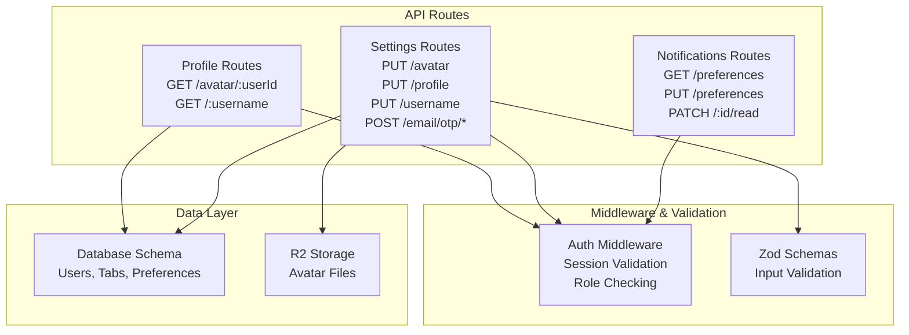
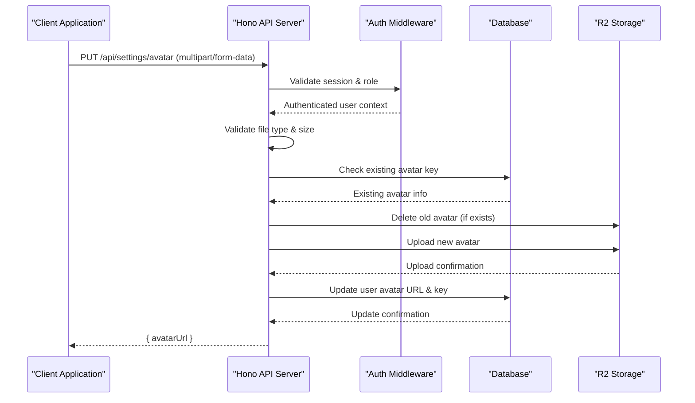
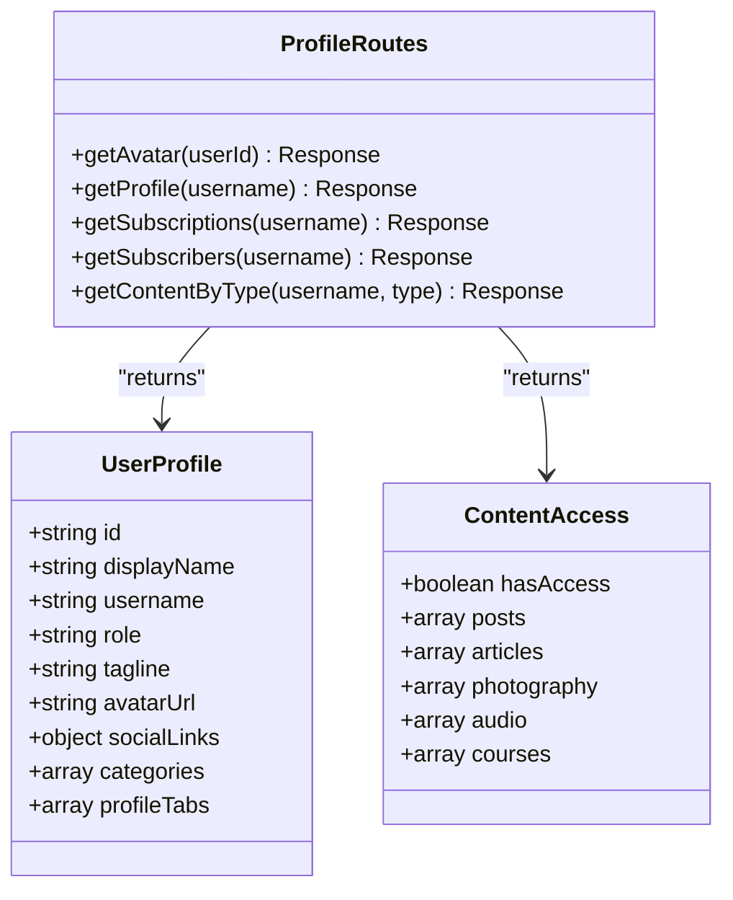
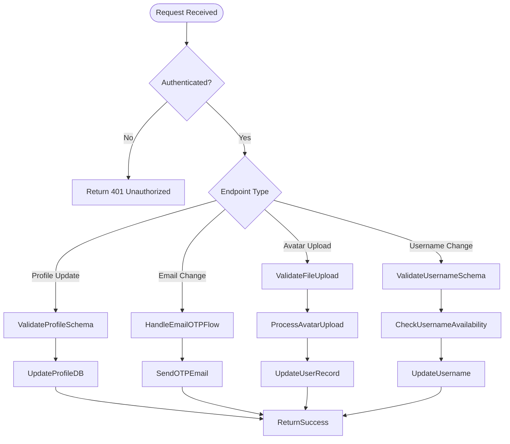
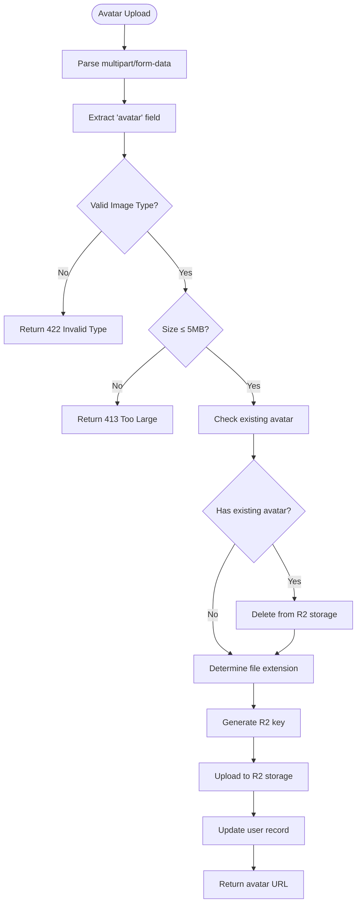
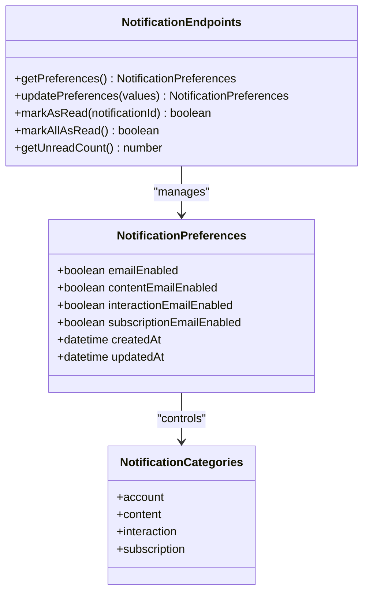
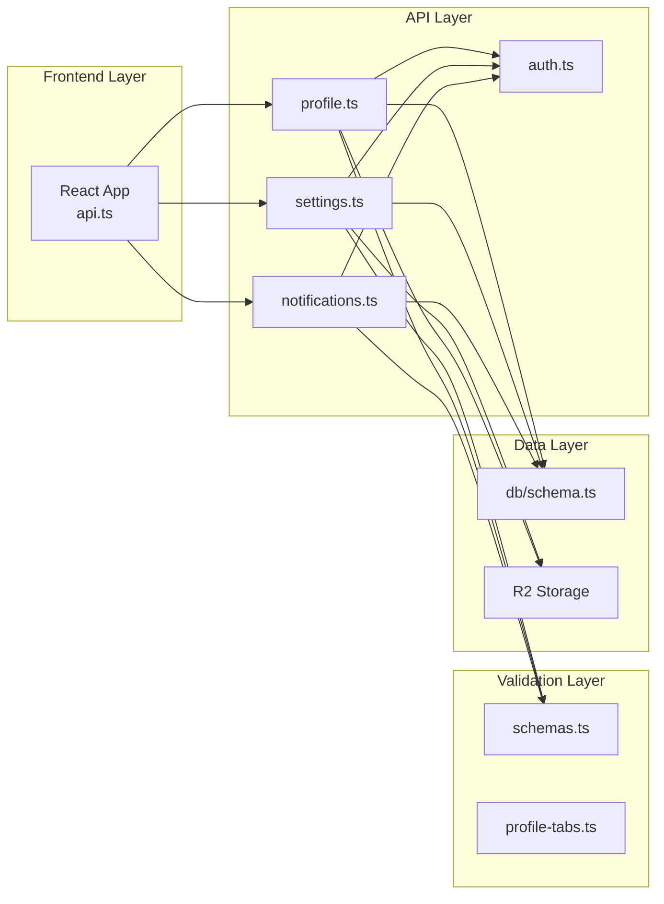

# User Management API

<cite>
**Referenced Files in This Document**
- [profile.ts](file://src/worker/routes/profile.ts)
- [settings.ts](file://src/worker/routes/settings.ts)
- [notifications.ts](file://src/worker/routes/notifications.ts)
- [auth.ts](file://src/worker/middleware/auth.ts)
- [schemas.ts](file://src/worker/lib/schemas.ts)
- [profile-tabs.ts](file://src/worker/lib/profile-tabs.ts)
- [schema.ts](file://src/worker/db/schema.ts)
- [api.ts](file://src/react-app/lib/api.ts)
</cite>

## Table of Contents
1. Introduction
2. Project Structure
3. Core Components
4. Architecture Overview
5. Detailed Component Analysis
6. Dependency Analysis
7. Performance Considerations
8. Troubleshooting Guide
9. Conclusion

## Introduction
This document provides comprehensive API documentation for user management endpoints, focusing on profile management and settings. It covers:
- Profile CRUD operations via public and authenticated routes
- Avatar upload handling with file validation and storage integration
- Profile customization (display name, tagline, social links)
- Account preferences including email change flow and username updates
- Notification preferences and privacy controls
- Authentication requirements, request/response schemas, and security measures

The API is implemented using Hono routes with Zod-based validation and Drizzle ORM for data access.

## Project Structure
The user management functionality is organized across several key files:
- **Profile Routes**: Public profile viewing and avatar retrieval
- **Settings Routes**: Authenticated profile and account management
- **Notifications Routes**: Notification preferences and management
- **Authentication Middleware**: Session validation and role-based access control
- **Validation Schemas**: Input validation rules using Zod
- **Database Schema**: Data models and relationships

**Diagram sources**
- [profile.ts:17-82](file://src/worker/routes/profile.ts#L17-L82)
- [settings.ts:31-133](file://src/worker/routes/settings.ts#L31-L133)
- [notifications.ts:11-147](file://src/worker/routes/notifications.ts#L11-L147)
- [auth.ts:23-50](file://src/worker/middleware/auth.ts#L23-L50)

**Section sources**
- [profile.ts:1-329](file://src/worker/routes/profile.ts#L1-L329)
- [settings.ts:1-327](file://src/worker/routes/settings.ts#L1-L327)
- [notifications.ts:1-188](file://src/worker/routes/notifications.ts#L1-L188)

## Core Components

### Profile Management Endpoints
The profile system provides both public and authenticated endpoints for managing user profiles and content.

#### Public Profile Endpoints
- **GET /api/profile/avatar/:userId**: Retrieves user avatar from R2 storage
- **GET /api/profile/:username**: Gets public profile information
- **GET /api/profile/:username/subscriptions**: Lists creator subscriptions (public)
- **GET /api/profile/:username/subscribers**: Lists subscribers (authenticated)

#### Authenticated Profile Endpoints  
- **GET /api/profile/:username/posts**: Creator's published posts
- **GET /api/profile/:username/articles**: Creator's articles
- **GET /api/profile/:username/photography**: Photography albums
- **GET /api/profile/:username/audio**: Audio content
- **GET /api/profile/:username/courses**: Course offerings

### Settings Management Endpoints
Settings endpoints handle account preferences and profile customization:

#### Profile Customization
- **PUT /api/settings/profile**: Update display name, tagline, social links
- **PUT /api/settings/avatar**: Upload new profile avatar
- **PUT /api/settings/username**: Change username with validation

#### Account Security
- **POST /api/settings/email/otp/request**: Request email change OTP
- **POST /api/settings/email/otp/verify**: Verify email change code
- **PUT /api/settings/password**: Disabled (uses email-based auth)

#### Tab Management
- **GET /api/settings/profile-tabs**: Get creator profile tabs configuration
- **PUT /api/settings/profile-tabs**: Update tab visibility and order

**Section sources**
- [profile.ts:19-82](file://src/worker/routes/profile.ts#L19-L82)
- [settings.ts:35-64](file://src/worker/routes/settings.ts#L35-L64)

## Architecture Overview

**Diagram sources**
- [settings.ts:68-133](file://src/worker/routes/settings.ts#L68-L133)
- [auth.ts:23-50](file://src/worker/middleware/auth.ts#L23-L50)

## Detailed Component Analysis

### Profile Routes Analysis

**Diagram sources**
- [profile.ts:22-82](file://src/worker/routes/profile.ts#L22-L82)
- [profile.ts:159-328](file://src/worker/routes/profile.ts#L159-L328)

### Settings Routes Analysis

**Diagram sources**
- [settings.ts:309-326](file://src/worker/routes/settings.ts#L309-L326)
- [settings.ts:68-133](file://src/worker/routes/settings.ts#L68-L133)
- [settings.ts:270-305](file://src/worker/routes/settings.ts#L270-L305)

### File Upload Processing

The avatar upload endpoint implements comprehensive file validation and processing:

**Diagram sources**
- [settings.ts:68-133](file://src/worker/routes/settings.ts#L68-L133)

**Section sources**
- [settings.ts:68-133](file://src/worker/routes/settings.ts#L68-L133)

### Notification Preferences System

**Diagram sources**
- [notifications.ts:132-147](file://src/worker/routes/notifications.ts#L132-L147)
- [schema.ts:917-930](file://src/worker/db/schema.ts#L917-L930)

**Section sources**
- [notifications.ts:132-147](file://src/worker/routes/notifications.ts#L132-L147)

## Dependency Analysis

**Diagram sources**
- [api.ts:1-164](file://src/react-app/lib/api.ts#L1-164)
- [profile.ts:1-16](file://src/worker/routes/profile.ts#L1-L16)
- [settings.ts:1-30](file://src/worker/routes/settings.ts#L1-L30)
- [notifications.ts:1-11](file://src/worker/routes/notifications.ts#L1-L11)

**Section sources**
- [api.ts:1-164](file://src/react-app/lib/api.ts#L1-L164)
- [schemas.ts:1-221](file://src/worker/lib/schemas.ts#L1-L221)

## Performance Considerations

### Database Query Optimization
- Profile queries use indexed columns for efficient lookups
- Content listing endpoints implement pagination limits (50-100 items)
- Avatar retrieval uses direct R2 storage access without database overhead

### File Upload Performance
- Avatar uploads process files directly to R2 storage
- Old avatar deletion occurs before new upload to prevent orphaned files
- Content-type validation prevents unnecessary file processing

### Caching Strategy
- Profile data can be cached at the CDN level due to immutable nature
- Avatar URLs are stable and cache-friendly
- Notification preferences are frequently accessed but lightweight

## Troubleshooting Guide

### Common Authentication Issues
- **401 Unauthorized**: Invalid or expired session cookies
- **403 Forbidden**: Insufficient permissions or suspended account
- **Account Suspended**: Account status check fails during authentication

### File Upload Errors
- **422 Validation Failed**: Invalid multipart/form-data format
- **Unsupported Media Type**: Non-image file types rejected
- **Payload Too Large**: Files exceeding 5MB limit

### Profile Update Issues
- **Username Conflicts**: Duplicate username validation failures
- **Email Already Taken**: Email change conflicts with existing accounts
- **Invalid Social Links**: URL validation errors for social media links

### Debugging Steps
1. Verify authentication headers and session cookies
2. Check request body format and content-type headers
3. Validate input parameters against schema definitions
4. Review database constraints and unique indexes
5. Monitor R2 storage permissions and bucket access

**Section sources**
- [auth.ts:23-50](file://src/worker/middleware/auth.ts#L23-L50)
- [settings.ts:74-94](file://src/worker/routes/settings.ts#L74-L94)
- [settings.ts:288-296](file://src/worker/routes/settings.ts#L288-L296)

## Conclusion

The User Management API provides a comprehensive set of endpoints for profile management, account settings, and notification preferences. The implementation follows modern web development practices with:

- **Security**: Robust authentication middleware and input validation
- **Scalability**: Efficient database queries and cloud storage integration
- **Flexibility**: Configurable profile tabs and notification preferences
- **Reliability**: Comprehensive error handling and validation

The API supports both public profile viewing and authenticated account management, making it suitable for applications requiring user profile customization and content management capabilities. The modular architecture allows for easy extension and maintenance while maintaining strong security boundaries between different user roles and access levels.