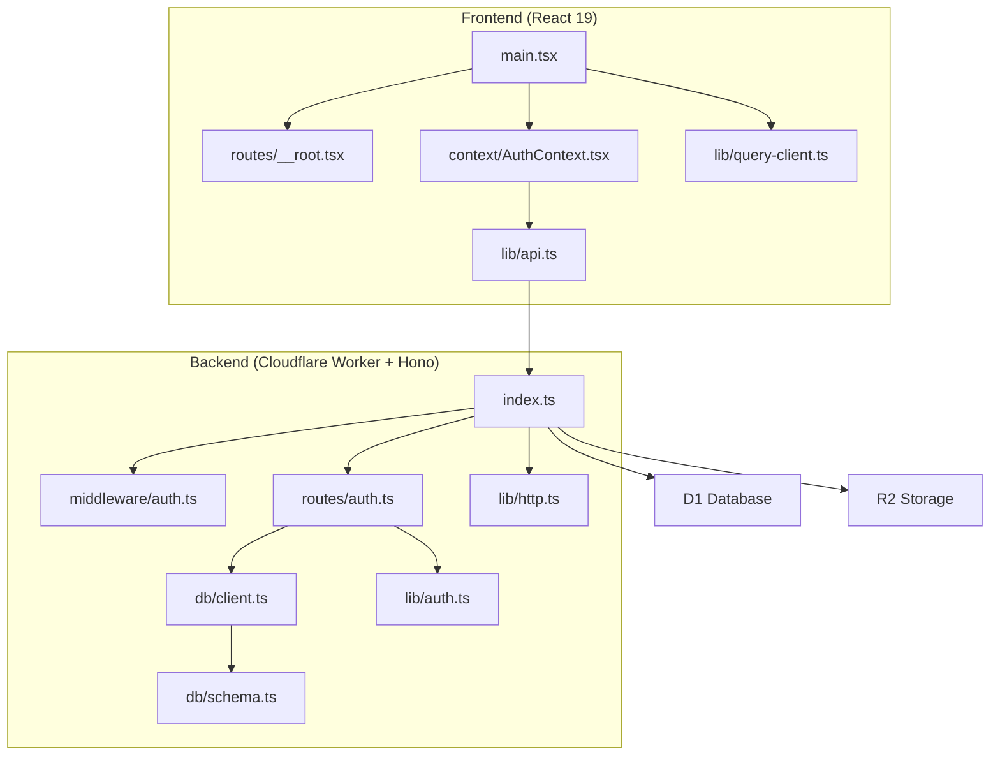
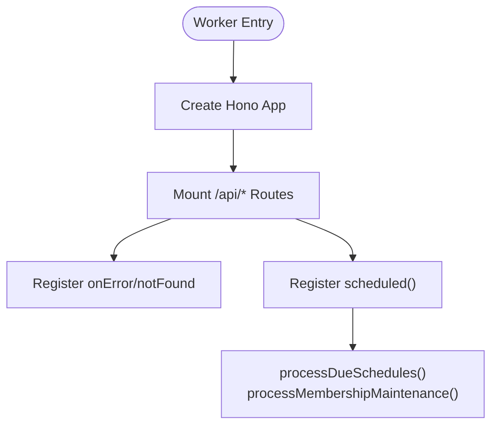
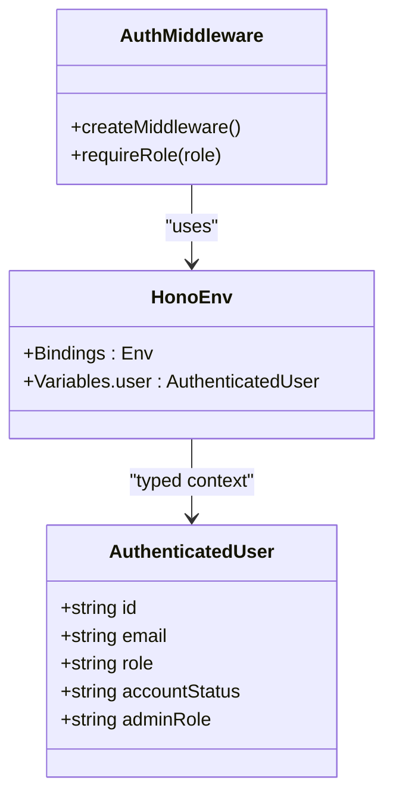
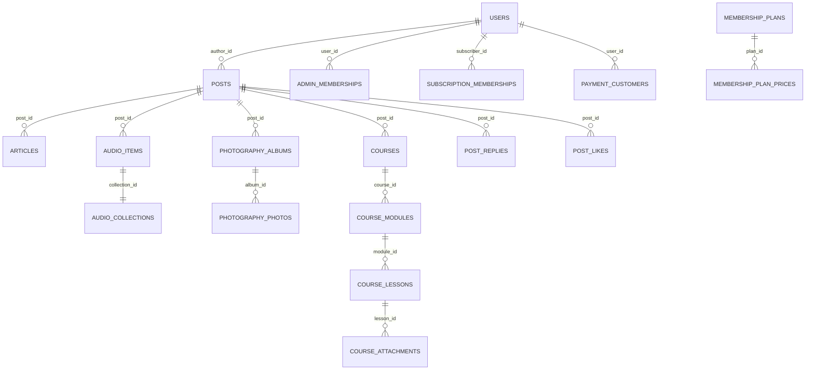
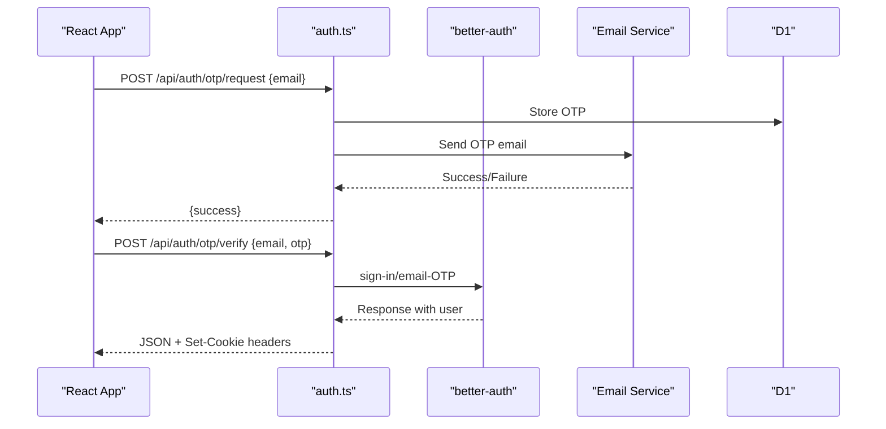
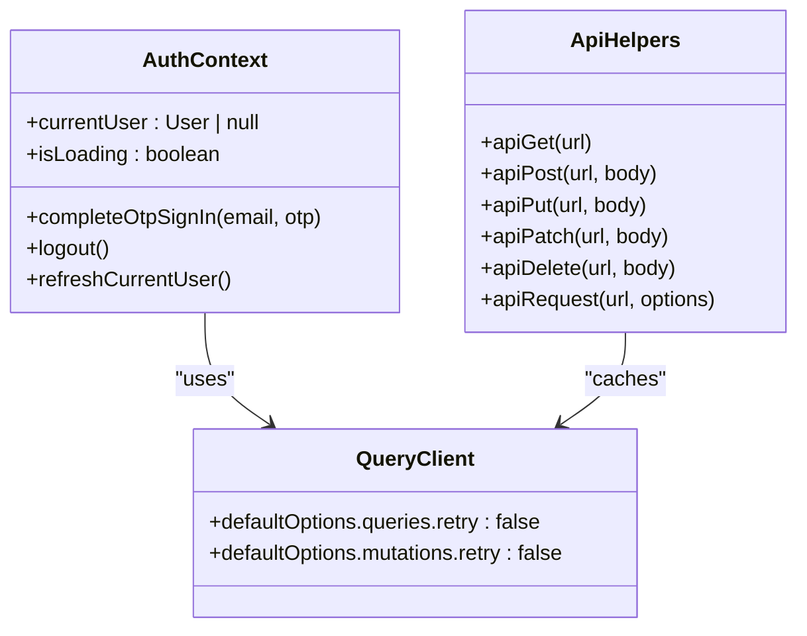
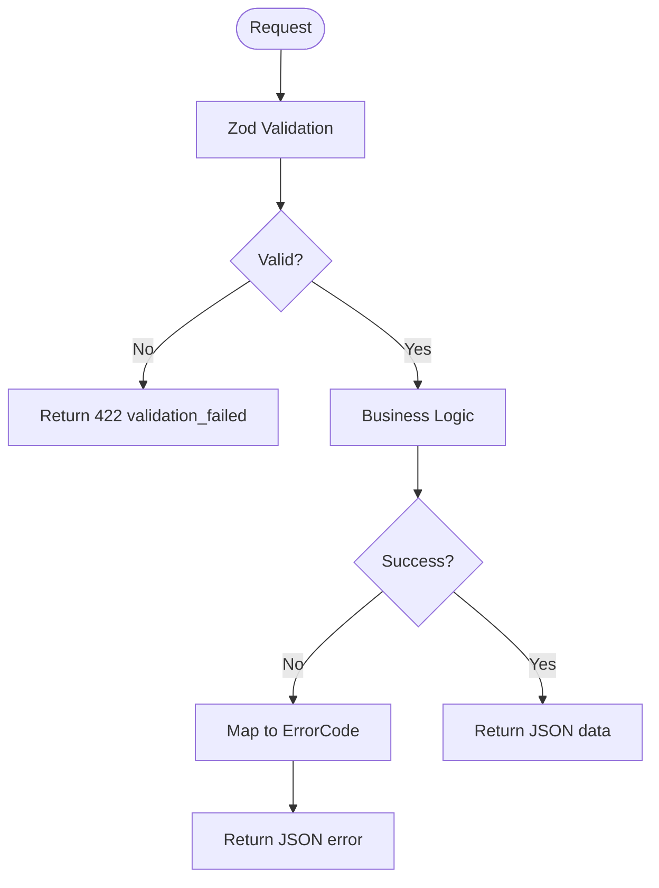
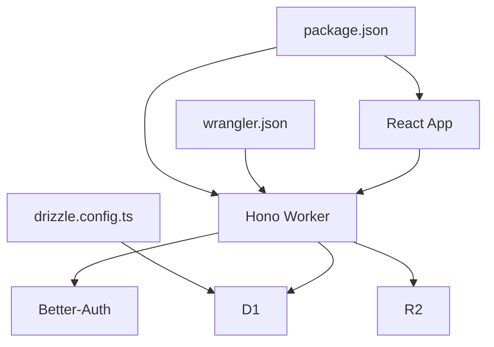

# Architecture

<cite>
**Referenced Files in This Document**
- [package.json](file://package.json)
- [wrangler.json](file://wrangler.json)
- [drizzle.config.ts](file://drizzle.config.ts)
- [src/worker/index.ts](file://src/worker/index.ts)
- [src/worker/middleware/auth.ts](file://src/worker/middleware/auth.ts)
- [src/worker/db/client.ts](file://src/worker/db/client.ts)
- [src/worker/db/schema.ts](file://src/worker/db/schema.ts)
- [src/worker/lib/auth.ts](file://src/worker/lib/auth.ts)
- [src/worker/lib/http.ts](file://src/worker/lib/http.ts)
- [src/worker/routes/auth.ts](file://src/worker/routes/auth.ts)
- [src/react-app/main.tsx](file://src/react-app/main.tsx)
- [src/react-app/context/AuthContext.tsx](file://src/react-app/context/AuthContext.tsx)
- [src/react-app/lib/query-client.ts](file://src/react-app/lib/query-client.ts)
- [src/react-app/lib/api.ts](file://src/react-app/lib/api.ts)
- [src/react-app/routes/__root.tsx](file://src/react-app/routes/__root.tsx)
</cite>

## Table of Contents
1. [Introduction](#introduction)
2. [Project Structure](#project-structure)
3. [Core Components](#core-components)
4. [Architecture Overview](#architecture-overview)
5. [Detailed Component Analysis](#detailed-component-analysis)
6. [Dependency Analysis](#dependency-analysis)
7. [Performance Considerations](#performance-considerations)
8. [Troubleshooting Guide](#troubleshooting-guide)
9. [Conclusion](#conclusion)
10. [Appendices](#appendices)

## Introduction
Zenith is a full-stack creator network application built with React 19 for the frontend and Cloudflare Workers powered by Hono for the backend API layer. The system uses TanStack Router for client-side routing, TanStack Query for data fetching and caching, Better-Auth for authentication, Drizzle ORM for type-safe database access, and Cloudflare D1 as the relational database. R2 provides object storage for media assets. The architecture emphasizes separation of concerns: a thin React SPA communicates with a feature-scoped Hono API, which delegates to business logic modules and persists data via Drizzle to D1. Cross-cutting concerns like authentication, validation, error handling, and scheduled maintenance are implemented through middleware and background tasks.

## Project Structure
The repository is organized into two primary layers:
- Frontend (React SPA): src/react-app contains pages, components, contexts, and TanStack Query utilities.
- Backend (Cloudflare Worker): src/worker contains Hono routes, middleware, DB client and schema, and shared libraries.

Key configuration files:
- package.json defines dependencies and scripts for building, previewing, testing, and deploying.
- wrangler.json configures the Worker entrypoint, assets hosting, environment variables, secrets, D1/R2 bindings, and observability.
- drizzle.config.ts sets up Drizzle Kit for migrations against D1.



**Diagram sources**
- [src/react-app/main.tsx:1-38](file://src/react-app/main.tsx#L1-L38)
- [src/react-app/routes/__root.tsx:1-23](file://src/react-app/routes/__root.tsx#L1-L23)
- [src/react-app/context/AuthContext.tsx:1-90](file://src/react-app/context/AuthContext.tsx#L1-L90)
- [src/react-app/lib/query-client.ts:1-14](file://src/react-app/lib/query-client.ts#L1-L14)
- [src/react-app/lib/api.ts:1-164](file://src/react-app/lib/api.ts#L1-L164)
- [src/worker/index.ts:1-71](file://src/worker/index.ts#L1-L71)
- [src/worker/middleware/auth.ts:1-57](file://src/worker/middleware/auth.ts#L1-L57)
- [src/worker/routes/auth.ts:1-259](file://src/worker/routes/auth.ts#L1-L259)
- [src/worker/db/client.ts:1-9](file://src/worker/db/client.ts#L1-L9)
- [src/worker/db/schema.ts:1-800](file://src/worker/db/schema.ts#L1-L800)
- [src/worker/lib/auth.ts:1-80](file://src/worker/lib/auth.ts#L1-L80)
- [src/worker/lib/http.ts:1-80](file://src/worker/lib/http.ts#L1-L80)

**Section sources**
- [package.json:1-98](file://package.json#L1-L98)
- [wrangler.json:1-139](file://wrangler.json#L1-L139)
- [drizzle.config.ts:1-14](file://drizzle.config.ts#L1-L14)

## Core Components
- Hono Application and Feature Routing: The Worker exposes a single Hono app that mounts feature-specific route groups under /api/* paths. Each group encapsulates endpoints for a domain (auth, feed, posts, payments, etc.).
- Middleware Pipeline: Authentication and authorization are enforced via Hono middleware that validates sessions and user roles, injecting typed user context into handlers.
- Repository Pattern: Data access is abstracted through Drizzle ORM using a centralized db client and strongly-typed schema definitions. Business logic modules call these repositories to read/write data.
- Context Providers: React’s AuthProvider manages current user state, OTP sign-in flows, and logout behavior, integrating with TanStack Query cache and global events for auth state changes.
- TanStack Query Integration: The frontend uses a configured QueryClient with sensible defaults and typed API helpers to fetch and mutate data consistently across pages and components.

**Section sources**
- [src/worker/index.ts:1-71](file://src/worker/index.ts#L1-L71)
- [src/worker/middleware/auth.ts:1-57](file://src/worker/middleware/auth.ts#L1-L57)
- [src/worker/db/client.ts:1-9](file://src/worker/db/client.ts#L1-L9)
- [src/worker/db/schema.ts:1-800](file://src/worker/db/schema.ts#L1-L800)
- [src/react-app/main.tsx:1-38](file://src/react-app/main.tsx#L1-L38)
- [src/react-app/context/AuthContext.tsx:1-90](file://src/react-app/context/AuthContext.tsx#L1-L90)
- [src/react-app/lib/query-client.ts:1-14](file://src/react-app/lib/query-client.ts#L1-L14)
- [src/react-app/lib/api.ts:1-164](file://src/react-app/lib/api.ts#L1-L164)

## Architecture Overview
The system follows a clear separation between the React SPA and the Cloudflare Worker API. Requests flow from the browser through TanStack Router and TanStack Query to the Hono router, which applies middleware, validates inputs, executes business logic, and persists data via Drizzle to D1. Responses are normalized and returned to the client, where UI updates occur reactively.

```mermaid
sequenceDiagram
participant Browser as "Browser"
participant React as "React App<br/>TanStack Router & Query"
participant API as "Hono Router"
participant MW as "Auth Middleware"
participant Biz as "Business Logic"
participant Repo as "Drizzle Repo"
participant DB as "D1 Database"
Browser->>React : User navigates /api/* or triggers mutation
React->>API : HTTP request (fetch with credentials)
API->>MW : Route matches; apply auth/role checks
MW-->>API : Attach user context or return error
API->>Biz : Invoke handler with validated input
Biz->>Repo : Query/mutate via Drizzle
Repo->>DB : Execute SQL
DB-->>Repo : Rows affected / results
Repo-->>Biz : Typed data
Biz-->>API : Normalized response
API-->>React : JSON response (cookies handled)
React->>React : Update Query cache and UI
```

**Diagram sources**
- [src/worker/index.ts:1-71](file://src/worker/index.ts#L1-L71)
- [src/worker/middleware/auth.ts:1-57](file://src/worker/middleware/auth.ts#L1-L57)
- [src/worker/routes/auth.ts:1-259](file://src/worker/routes/auth.ts#L1-L259)
- [src/worker/db/client.ts:1-9](file://src/worker/db/client.ts#L1-L9)
- [src/worker/db/schema.ts:1-800](file://src/worker/db/schema.ts#L1-L800)
- [src/react-app/lib/api.ts:1-164](file://src/react-app/lib/api.ts#L1-L164)

## Detailed Component Analysis

### Hono Router and Feature-Specific Routing
- Central app initialization mounts multiple feature routers under /api prefixes, enabling modular endpoint organization.
- Global error and not-found handlers normalize responses and serve static assets when applicable.
- Scheduled tasks run periodic maintenance jobs (e.g., processing due schedules and membership maintenance).



**Diagram sources**
- [src/worker/index.ts:1-71](file://src/worker/index.ts#L1-L71)

**Section sources**
- [src/worker/index.ts:1-71](file://src/worker/index.ts#L1-L71)

### Authentication Middleware and Authorization
- The auth middleware extracts session info via Better-Auth, queries user details including role and account status, and injects a typed user object into the Hono context.
- Role-based guards enforce access control for specific roles (e.g., subscriber vs creator).
- Suspended accounts receive explicit error responses.



**Diagram sources**
- [src/worker/middleware/auth.ts:1-57](file://src/worker/middleware/auth.ts#L1-L57)

**Section sources**
- [src/worker/middleware/auth.ts:1-57](file://src/worker/middleware/auth.ts#L1-L57)

### Drizzle ORM Repository Pattern
- The db client creates a Drizzle instance bound to D1 with the full schema.
- Schema defines all entities (users, posts, audio, photography, courses, memberships, moderation, etc.) with indexes and constraints.
- Business logic modules use this typed schema to perform safe queries and mutations.



**Diagram sources**
- [src/worker/db/schema.ts:1-800](file://src/worker/db/schema.ts#L1-L800)

**Section sources**
- [src/worker/db/client.ts:1-9](file://src/worker/db/client.ts#L1-L9)
- [src/worker/db/schema.ts:1-800](file://src/worker/db/schema.ts#L1-L800)

### Better-Auth Integration and OTP Flow
- Better-Auth is configured with Drizzle adapter and email OTP plugin. Password auth is disabled in favor of OTP-based sign-in.
- Custom endpoints handle OTP request and verification, bridging to Better-Auth while returning legacy-compatible user payloads and cookies.
- Session management and user profile retrieval are exposed via protected routes.



**Diagram sources**
- [src/worker/routes/auth.ts:1-259](file://src/worker/routes/auth.ts#L1-L259)
- [src/worker/lib/auth.ts:1-80](file://src/worker/lib/auth.ts#L1-L80)

**Section sources**
- [src/worker/routes/auth.ts:1-259](file://src/worker/routes/auth.ts#L1-L259)
- [src/worker/lib/auth.ts:1-80](file://src/worker/lib/auth.ts#L1-L80)

### Frontend State Management and TanStack Query
- main.tsx bootstraps React with providers: ThemeProvider, QueryClientProvider, AuthProvider, AudioPlayerProvider, and RouterProvider.
- AuthContext manages current user via useQuery and mutations for OTP sign-in and logout, updating the Query cache and dispatching window events on unauthorized or suspended states.
- query-client.ts configures retry and refetch policies globally.
- api.ts provides typed fetch wrappers and normalizes errors, emitting custom events for auth-related failures.



**Diagram sources**
- [src/react-app/main.tsx:1-38](file://src/react-app/main.tsx#L1-L38)
- [src/react-app/context/AuthContext.tsx:1-90](file://src/react-app/context/AuthContext.tsx#L1-L90)
- [src/react-app/lib/query-client.ts:1-14](file://src/react-app/lib/query-client.ts#L1-L14)
- [src/react-app/lib/api.ts:1-164](file://src/react-app/lib/api.ts#L1-L164)

**Section sources**
- [src/react-app/main.tsx:1-38](file://src/react-app/main.tsx#L1-L38)
- [src/react-app/context/AuthContext.tsx:1-90](file://src/react-app/context/AuthContext.tsx#L1-L90)
- [src/react-app/lib/query-client.ts:1-14](file://src/react-app/lib/query-client.ts#L1-L14)
- [src/react-app/lib/api.ts:1-164](file://src/react-app/lib/api.ts#L1-L164)

### Error Handling and Validation
- Backend centralizes error responses with standardized codes and messages. Zod validation hooks integrate seamlessly with Hono to reject invalid payloads.
- Frontend normalizes error payloads and maps specific codes to user-facing events (e.g., account suspension), ensuring consistent UX.



**Diagram sources**
- [src/worker/lib/http.ts:1-80](file://src/worker/lib/http.ts#L1-L80)
- [src/react-app/lib/api.ts:1-164](file://src/react-app/lib/api.ts#L1-L164)

**Section sources**
- [src/worker/lib/http.ts:1-80](file://src/worker/lib/http.ts#L1-L80)
- [src/react-app/lib/api.ts:1-164](file://src/react-app/lib/api.ts#L1-L164)

## Dependency Analysis
The system integrates several key technologies:
- React 19 with TanStack Router and Query for SPA routing and data synchronization.
- Hono for lightweight, edge-friendly API routing and middleware.
- Better-Auth for secure, OTP-based authentication backed by Drizzle.
- Drizzle ORM for type-safe SQL generation and migrations against D1.
- Cloudflare ecosystem: Workers runtime, D1 database, R2 storage, and Wrangler for deployment.



**Diagram sources**
- [package.json:1-98](file://package.json#L1-L98)
- [wrangler.json:1-139](file://wrangler.json#L1-L139)
- [drizzle.config.ts:1-14](file://drizzle.config.ts#L1-L14)

**Section sources**
- [package.json:1-98](file://package.json#L1-L98)
- [wrangler.json:1-139](file://wrangler.json#L1-L139)
- [drizzle.config.ts:1-14](file://drizzle.config.ts#L1-L14)

## Performance Considerations
- Edge Execution: Cloudflare Workers execute close to users, minimizing latency. Use smart placement if needed for regional optimization.
- Minimal Payloads: Normalize responses and avoid unnecessary fields to reduce bandwidth.
- Caching Strategy: Configure TanStack Query defaults to avoid excessive retries and refetches; leverage conditional caching keys per resource.
- Database Indexing: Ensure proper indexing on frequently queried columns (e.g., authorId, kind, publishedAt) to optimize reads.
- Background Tasks: Offload heavy operations to scheduled jobs to keep request paths fast.

[No sources needed since this section provides general guidance]

## Troubleshooting Guide
- Authentication Failures: Check session validity and cookie propagation. Verify that credentials are included in requests and that origin/trustedOrigins are correctly set.
- Account Suspension: Suspended accounts receive explicit error codes; ensure the frontend handles these events and redirects appropriately.
- Validation Errors: Inspect Zod issues in the response payload; confirm request bodies match expected schemas.
- Network Errors: Review fetch wrappers for error normalization and event dispatching; verify CORS and headers.

**Section sources**
- [src/worker/middleware/auth.ts:1-57](file://src/worker/middleware/auth.ts#L1-L57)
- [src/worker/routes/auth.ts:1-259](file://src/worker/routes/auth.ts#L1-L259)
- [src/worker/lib/http.ts:1-80](file://src/worker/lib/http.ts#L1-L80)
- [src/react-app/lib/api.ts:1-164](file://src/react-app/lib/api.ts#L1-L164)

## Conclusion
Zenith’s architecture cleanly separates the React SPA from the Cloudflare Worker API, leveraging modern frameworks and tools for robustness and scalability. Feature-scoped routing, middleware-driven authentication, Drizzle-backed repositories, and TanStack Query-powered state management create a maintainable and performant system. Infrastructure choices align with Cloudflare’s edge computing model, enabling low-latency, globally distributed services with minimal operational overhead.

[No sources needed since this section summarizes without analyzing specific files]

## Appendices

### Technology Stack Decisions
- React 19: Latest stable version with improved performance and concurrent features.
- Hono: Lightweight framework optimized for edge environments and TypeScript-first development.
- Better-Auth: Secure, extensible authentication with OTP support and Drizzle integration.
- Drizzle ORM: Type-safe SQL abstraction with excellent DX and migration tooling.
- Cloudflare Ecosystem: Workers for compute, D1 for serverless SQL, R2 for object storage, and Wrangler for deployment and configuration.

**Section sources**
- [package.json:1-98](file://package.json#L1-L98)
- [wrangler.json:1-139](file://wrangler.json#L1-L139)
- [drizzle.config.ts:1-14](file://drizzle.config.ts#L1-L14)

### Deployment Topology
- Assets served from dist/client with single-page application fallback.
- Worker entrypoint at src/worker/index.ts handles API routes and serves assets when appropriate.
- Environment-specific configurations define secrets, database bindings, and email settings.

**Section sources**
- [wrangler.json:1-139](file://wrangler.json#L1-L139)
- [src/worker/index.ts:1-71](file://src/worker/index.ts#L1-L71)