# Backend Architecture

<cite>
**Referenced Files in This Document**
- [index.ts](file://src/worker/index.ts)
- [wrangler.json](file://wrangler.json)
- [package.json](file://package.json)
- [drizzle.config.ts](file://drizzle.config.ts)
- [schema.ts](file://src/worker/db/schema.ts)
- [client.ts](file://src/worker/db/client.ts)
- [auth.ts](file://src/worker/middleware/auth.ts)
- [admin.ts](file://src/worker/middleware/admin.ts)
- [http.ts](file://src/worker/lib/http.ts)
- [schemas.ts](file://src/worker/lib/schemas.ts)
- [auth.ts](file://src/worker/lib/auth.ts)
- [scheduling.ts](file://src/worker/lib/scheduling.ts)
- [memberships.ts](file://src/worker/lib/memberships.ts)
- [posts.ts](file://src/worker/routes/posts.ts)
- [auth.ts](file://src/worker/routes/auth.ts)
</cite>

## Table of Contents
1. Introduction
2. Project Structure
3. Core Components
4. Architecture Overview
5. Detailed Component Analysis
6. Dependency Analysis
7. Performance Considerations
8. Troubleshooting Guide
9. Conclusion

## Introduction
This document describes the Cloudflare Workers backend architecture for the Zenith application. It focuses on the Hono-based API server, modular route handlers organized by feature domains, middleware pipeline (authentication, authorization, and request validation), data access via Drizzle ORM, error handling and response formatting, scheduled background jobs (content scheduling and membership maintenance), external service integrations, worker lifecycle management, and security considerations such as CORS, rate limiting, and input validation.

## Project Structure
The backend is implemented as a single Cloudflare Worker entrypoint that wires together:
- A Hono application with feature-scoped route modules under src/worker/routes
- Middleware for authentication and admin/owner authorization under src/worker/middleware
- Shared utilities for HTTP responses and Zod schemas under src/worker/lib
- Database schema and client under src/worker/db
- Scheduled task processors under src/worker/lib for content scheduling and membership maintenance

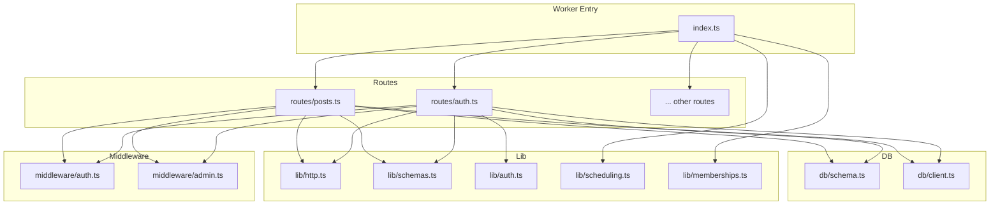

**Diagram sources**
- [index.ts:1-71](file://src/worker/index.ts#L1-L71)
- [auth.ts:1-259](file://src/worker/routes/auth.ts#L1-L259)
- [posts.ts:1-200](file://src/worker/routes/posts.ts#L1-L200)
- [auth.ts:1-57](file://src/worker/middleware/auth.ts#L1-L57)
- [admin.ts:1-14](file://src/worker/middleware/admin.ts#L1-L14)
- [http.ts:1-80](file://src/worker/lib/http.ts#L1-L80)
- [schemas.ts:1-221](file://src/worker/lib/schemas.ts#L1-L221)
- [auth.ts:1-80](file://src/worker/lib/auth.ts#L1-L80)
- [scheduling.ts:1-127](file://src/worker/lib/scheduling.ts#L1-L127)
- [memberships.ts:1-144](file://src/worker/lib/memberships.ts#L1-L144)
- [schema.ts:1-800](file://src/worker/db/schema.ts#L1-L800)
- [client.ts:1-9](file://src/worker/db/client.ts#L1-L9)

**Section sources**
- [index.ts:1-71](file://src/worker/index.ts#L1-L71)
- [wrangler.json:1-139](file://wrangler.json#L1-L139)
- [package.json:1-98](file://package.json#L1-L98)
- [drizzle.config.ts:1-14](file://drizzle.config.ts#L1-L14)

## Core Components
- Hono Application and Routing: The worker exports a Hono app and mounts feature-specific routers under /api/* namespaces. Global error and not-found handlers are registered at the root level.
- Middleware Pipeline: Authentication middleware validates sessions and enriches context with user info; role-based middleware enforces subscriber/creator roles; admin/owner middleware restricts administrative endpoints.
- Request Validation: Zod schemas define strict input contracts; @hono/zod-validator integrates validation into route handlers with a unified hook to return structured errors.
- Data Access: Drizzle ORM is configured against Cloudflare D1 using a typed schema; a simple factory creates DB instances per request.
- Error Handling and Responses: Centralized helpers produce consistent JSON error shapes across all endpoints.
- Scheduled Tasks: Cron-triggered tasks process due content schedules and membership maintenance operations.

**Section sources**
- [index.ts:24-60](file://src/worker/index.ts#L24-L60)
- [auth.ts:23-50](file://src/worker/middleware/auth.ts#L23-L50)
- [admin.ts:5-13](file://src/worker/middleware/admin.ts#L5-L13)
- [schemas.ts:1-221](file://src/worker/lib/schemas.ts#L1-L221)
- [client.ts:4-6](file://src/worker/db/client.ts#L4-L6)
- [http.ts:23-80](file://src/worker/lib/http.ts#L23-L80)
- [scheduling.ts:42-126](file://src/worker/lib/scheduling.ts#L42-L126)
- [memberships.ts:138-144](file://src/worker/lib/memberships.ts#L138-L144)

## Architecture Overview
The worker exposes a REST API through Hono, with each feature domain encapsulated in its own router module. Requests flow through middleware for authentication and authorization before reaching handler logic. Handlers validate inputs with Zod, interact with D1 via Drizzle, and return standardized JSON responses. Background jobs run on a cron schedule to publish scheduled content and maintain memberships.

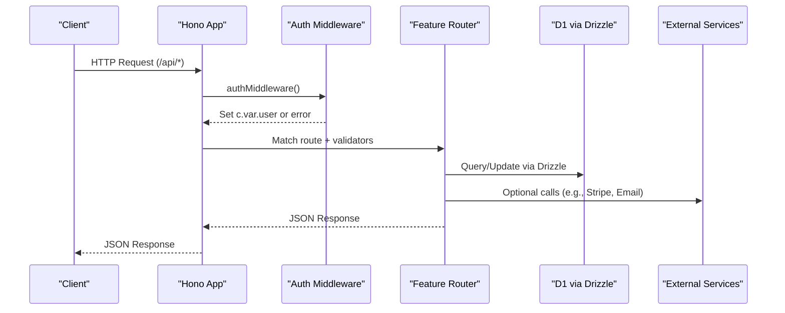

**Diagram sources**
- [index.ts:24-60](file://src/worker/index.ts#L24-L60)
- [auth.ts:23-50](file://src/worker/middleware/auth.ts#L23-L50)
- [posts.ts:1-200](file://src/worker/routes/posts.ts#L1-L200)
- [auth.ts:1-259](file://src/worker/routes/auth.ts#L1-L259)
- [client.ts:4-6](file://src/worker/db/client.ts#L4-L6)

## Detailed Component Analysis

### Hono Application and Routing
- The worker initializes a Hono instance and mounts multiple feature routers under /api prefixes.
- Global error and not-found handlers ensure consistent error responses and asset fallback behavior.
- The exported default handler implements fetch and scheduled hooks for background jobs.

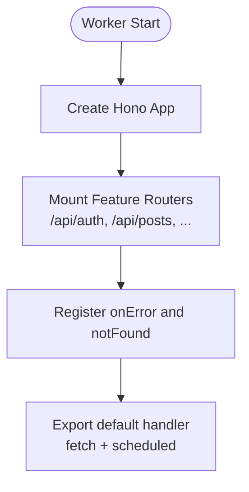

**Diagram sources**
- [index.ts:24-71](file://src/worker/index.ts#L24-L71)

**Section sources**
- [index.ts:24-71](file://src/worker/index.ts#L24-L71)

### Middleware Pipeline: Authentication, Authorization, and Validation
- Authentication: Validates Better Auth session, loads user profile and admin role from D1, rejects unauthorized or suspended accounts, and sets c.var.user.
- Role-based Authorization: requireRole enforces subscriber or creator roles.
- Admin/Owner Authorization: adminMiddleware and ownerMiddleware enforce admin-level access.
- Validation: @hono/zod-validator uses shared Zod schemas and a zodHook to convert validation failures into structured error responses.

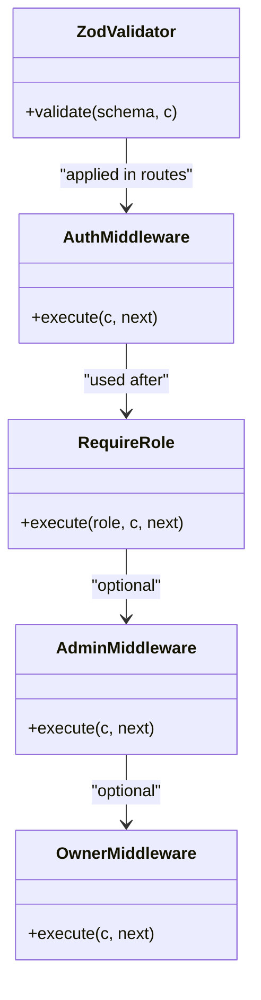

**Diagram sources**
- [auth.ts:23-57](file://src/worker/middleware/auth.ts#L23-L57)
- [admin.ts:5-13](file://src/worker/middleware/admin.ts#L5-L13)
- [schemas.ts:1-221](file://src/worker/lib/schemas.ts#L1-L221)

**Section sources**
- [auth.ts:23-57](file://src/worker/middleware/auth.ts#L23-L57)
- [admin.ts:5-13](file://src/worker/middleware/admin.ts#L5-L13)
- [schemas.ts:1-221](file://src/worker/lib/schemas.ts#L1-L221)

### Data Access Abstraction with Drizzle ORM
- Schema: Comprehensive Drizzle schema defines entities for users, posts, media, courses, subscriptions, moderation, and more, with indexes and constraints.
- Client: A small factory wraps D1 with Drizzle and schema types for type-safe queries.
- Usage: Routes and libraries query/update data using Drizzle’s fluent API, ensuring strong typing and consistent schema usage.

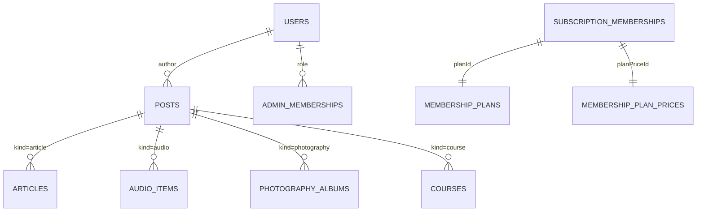

**Diagram sources**
- [schema.ts:1-800](file://src/worker/db/schema.ts#L1-L800)
- [client.ts:4-6](file://src/worker/db/client.ts#L4-L6)

**Section sources**
- [schema.ts:1-800](file://src/worker/db/schema.ts#L1-L800)
- [client.ts:4-6](file://src/worker/db/client.ts#L4-L6)

### Error Handling Strategies and Response Formatting
- Centralized error helpers provide consistent JSON payloads with code, message, and optional details.
- Validation errors use a dedicated helper to return 422 with issues array.
- Global onError returns a standardized internal server error.
- Not-found handler differentiates between API paths and static assets.

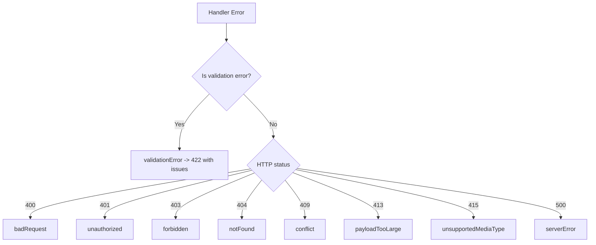

**Diagram sources**
- [http.ts:23-80](file://src/worker/lib/http.ts#L23-L80)

**Section sources**
- [http.ts:23-80](file://src/worker/lib/http.ts#L23-L80)
- [index.ts:47-60](file://src/worker/index.ts#L47-L60)

### Scheduled Task Processing: Content Scheduling and Membership Maintenance
- Content Scheduling:
  - Scans pending due schedules, claims them atomically, attempts publication, and handles retries with exponential backoff or deterministic failure.
  - On failure, notifies creators and logs structured events.
- Membership Maintenance:
  - Expires trials past their end time.
  - Processes plan transitions (e.g., cancel at period end) with retry logic and error logging.

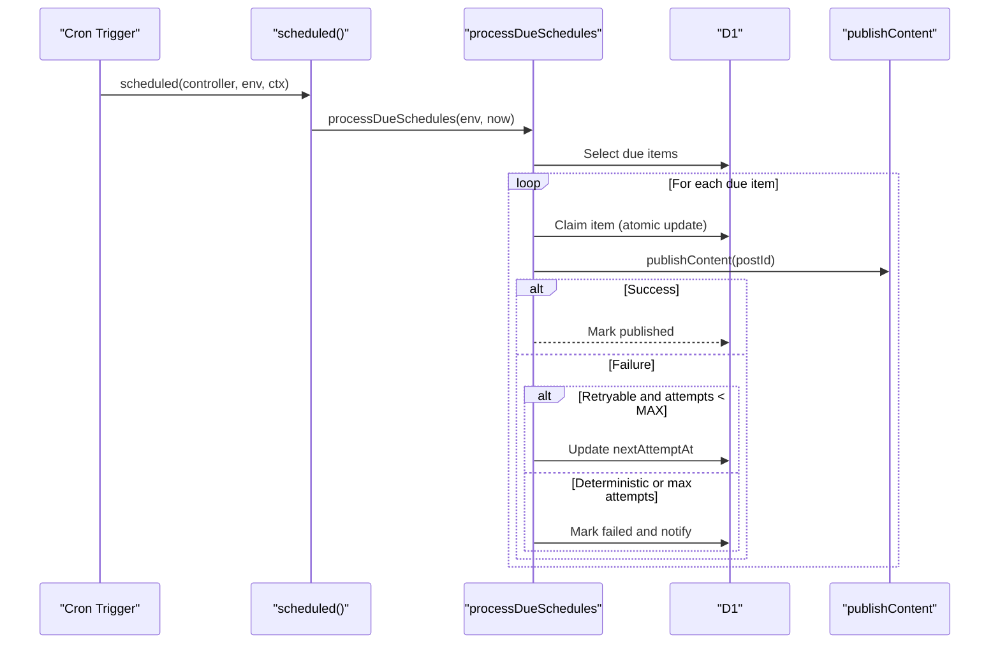

**Diagram sources**
- [index.ts:64-70](file://src/worker/index.ts#L64-L70)
- [scheduling.ts:42-126](file://src/worker/lib/scheduling.ts#L42-L126)

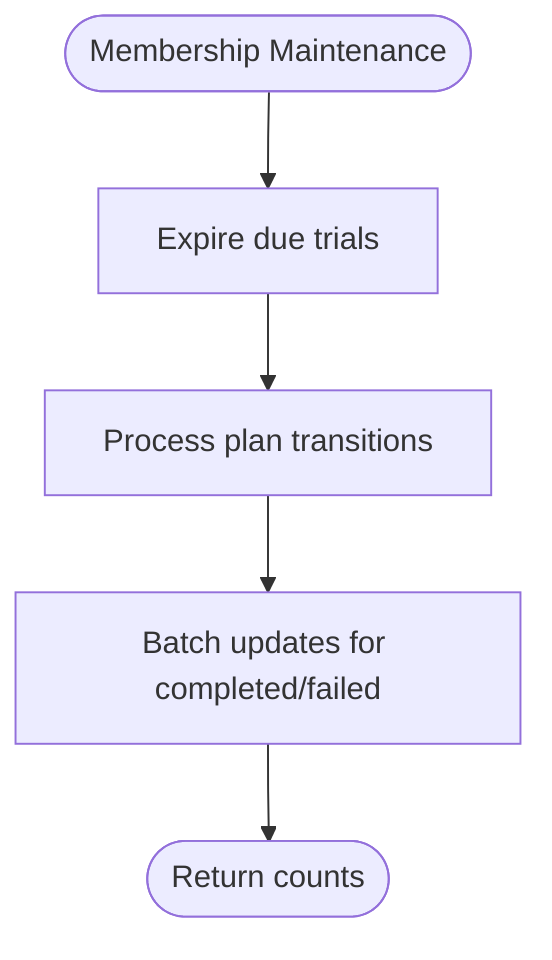

**Diagram sources**
- [memberships.ts:138-144](file://src/worker/lib/memberships.ts#L138-L144)

**Section sources**
- [index.ts:64-70](file://src/worker/index.ts#L64-L70)
- [scheduling.ts:42-126](file://src/worker/lib/scheduling.ts#L42-L126)
- [memberships.ts:138-144](file://src/worker/lib/memberships.ts#L138-L144)

### Integration Patterns with External Services
- Better Auth: Configured with email OTP plugin and Drizzle adapter; customizes user fields and maps to the existing schema.
- Stripe: Payment provider abstraction used for subscription lifecycle operations (e.g., cancel at period end).
- Email: OTP emails sent via Cloudflare Send binding; error handling ensures robustness when delivery fails.
- R2 Storage: Media uploads stored with metadata and tracked in DB.

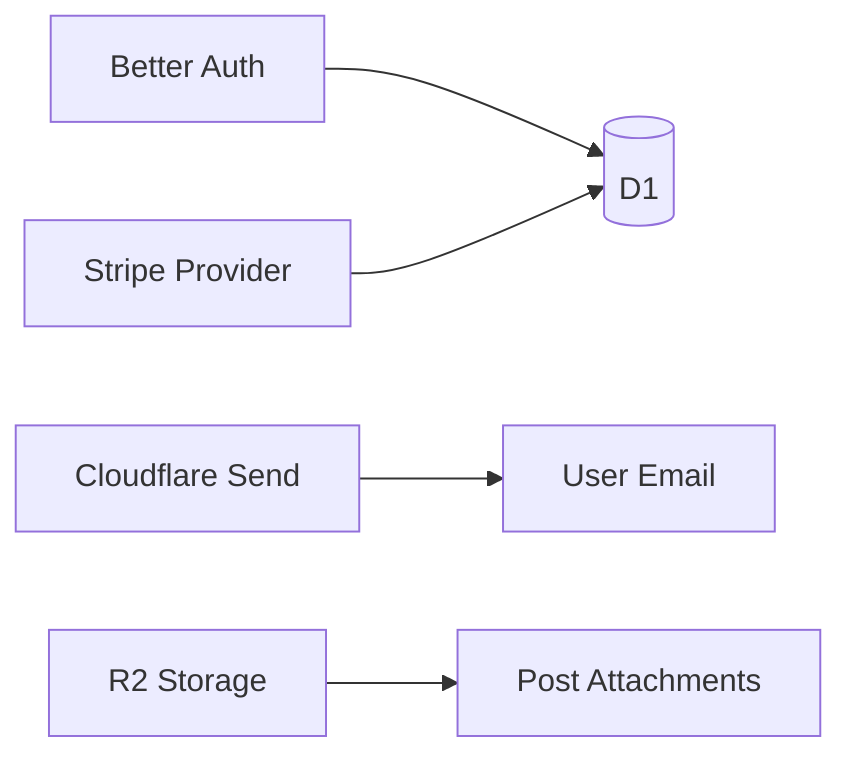

**Diagram sources**
- [auth.ts:9-77](file://src/worker/lib/auth.ts#L9-L77)
- [memberships.ts:99-133](file://src/worker/lib/memberships.ts#L99-L133)
- [posts.ts:172-194](file://src/worker/routes/posts.ts#L172-L194)

**Section sources**
- [auth.ts:9-77](file://src/worker/lib/auth.ts#L9-L77)
- [memberships.ts:99-133](file://src/worker/lib/memberships.ts#L99-L133)
- [posts.ts:172-194](file://src/worker/routes/posts.ts#L172-L194)

### Worker Lifecycle Management
- Entrypoint: Exports fetch and scheduled handlers.
- Assets: Static assets served via ASSETS binding with SPA fallback; API routes take precedence.
- Environment: Wrangler config binds D1, R2, email, and variables/secrets per environment.

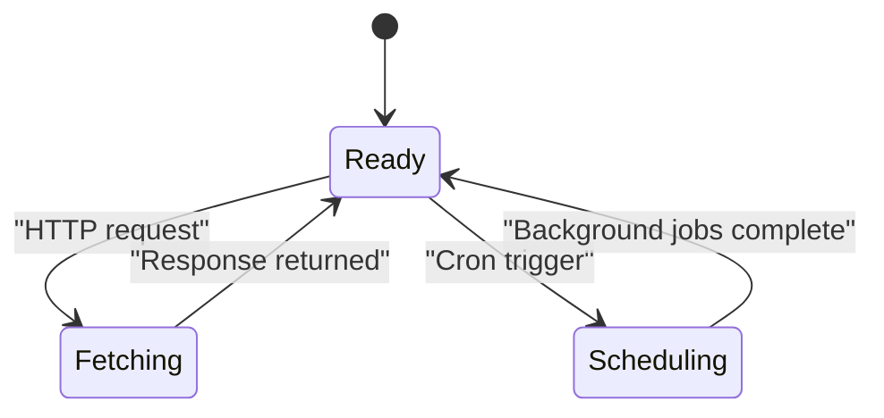

**Diagram sources**
- [index.ts:62-70](file://src/worker/index.ts#L62-L70)
- [wrangler.json:26-33](file://wrangler.json#L26-L33)

**Section sources**
- [index.ts:62-70](file://src/worker/index.ts#L62-L70)
- [wrangler.json:26-33](file://wrangler.json#L26-L33)

## Dependency Analysis
Key runtime dependencies include Hono for routing, @hono/zod-validator for request validation, Drizzle ORM for database access, Better Auth for authentication, Stripe SDK for payments, and Cloudflare bindings for D1, R2, and email.

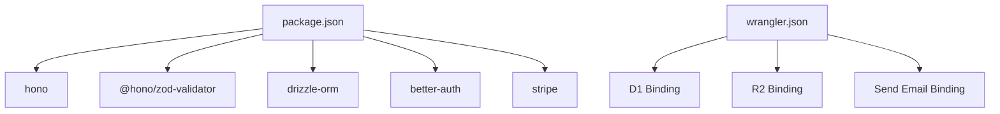

**Diagram sources**
- [package.json:14-56](file://package.json#L14-L56)
- [wrangler.json:52-113](file://wrangler.json#L52-L113)

**Section sources**
- [package.json:14-56](file://package.json#L14-L56)
- [wrangler.json:52-113](file://wrangler.json#L52-L113)

## Performance Considerations
- Use batched DB writes where possible to reduce round-trips.
- Keep scheduled job batches small (as implemented) to avoid long-running invocations.
- Leverage indexes defined in the schema for frequent queries (e.g., due schedules, creator indices).
- Avoid heavy synchronous work in request handlers; offload to background jobs when feasible.
- Cache frequently accessed read-only data at the edge if appropriate.

[No sources needed since this section provides general guidance]

## Troubleshooting Guide
- Authentication Failures: Check session retrieval and account status; verify Better Auth configuration and secrets.
- Validation Errors: Inspect Zod schema definitions and ensure clients send expected payloads.
- Scheduled Jobs: Review logs for “content_schedule_retry” and “membership_plan_transition_failed” events; check retry delays and max attempts.
- External Service Errors: Validate Stripe webhook handling and email delivery settings; handle transient failures gracefully.

**Section sources**
- [auth.ts:168-212](file://src/worker/routes/auth.ts#L168-L212)
- [scheduling.ts:99-126](file://src/worker/lib/scheduling.ts#L99-L126)
- [memberships.ts:111-133](file://src/worker/lib/memberships.ts#L111-L133)

## Conclusion
The backend leverages Hono for clean routing, Zod for robust validation, and Drizzle for type-safe data access over D1. Middleware centralizes authentication and authorization, while centralized error helpers ensure consistent responses. Scheduled tasks handle content publishing and membership maintenance reliably with retries and notifications. Integrations with Better Auth, Stripe, R2, and Cloudflare Send are orchestrated through well-defined abstractions, enabling scalable and secure operation within the Cloudflare Workers ecosystem.