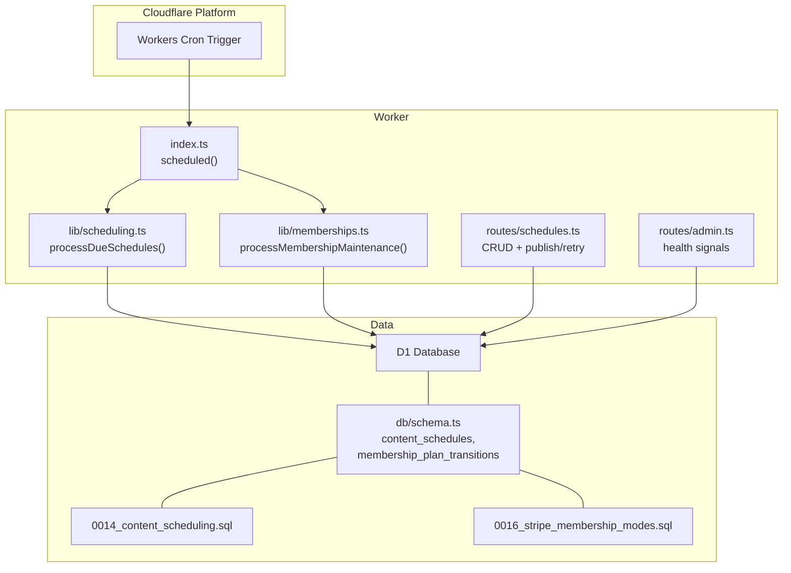
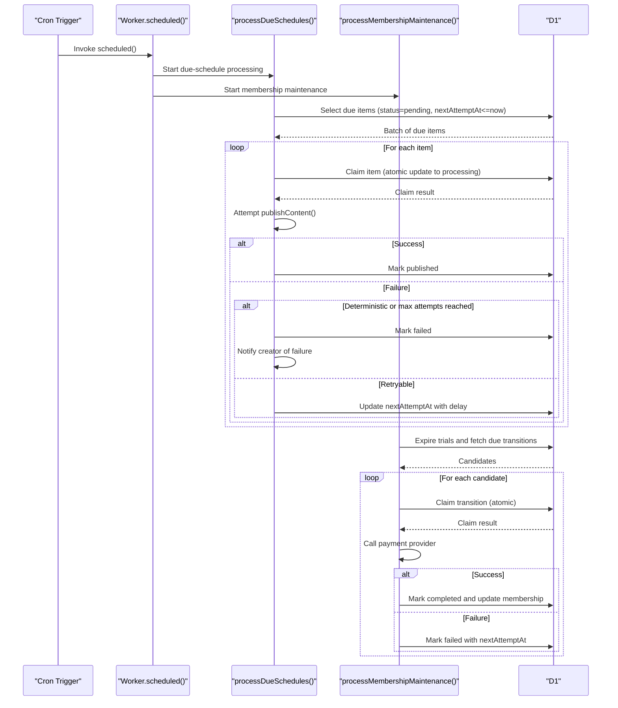
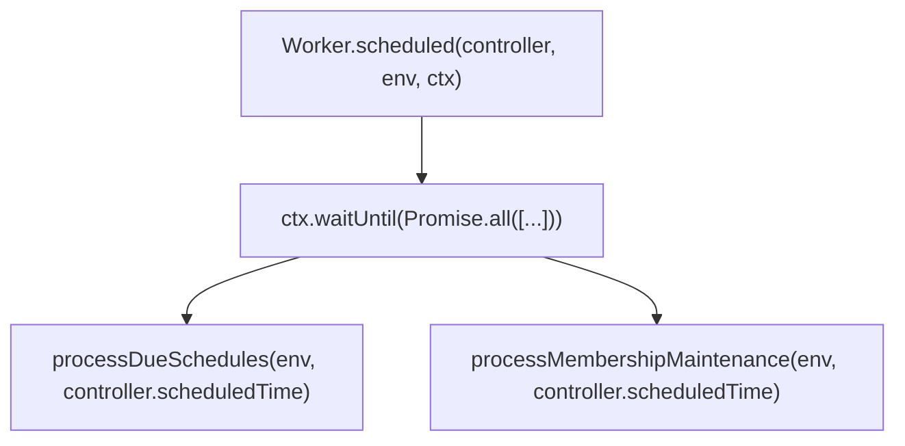
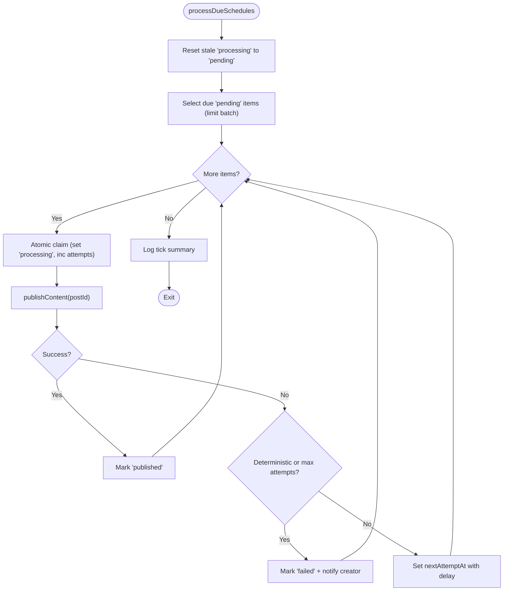
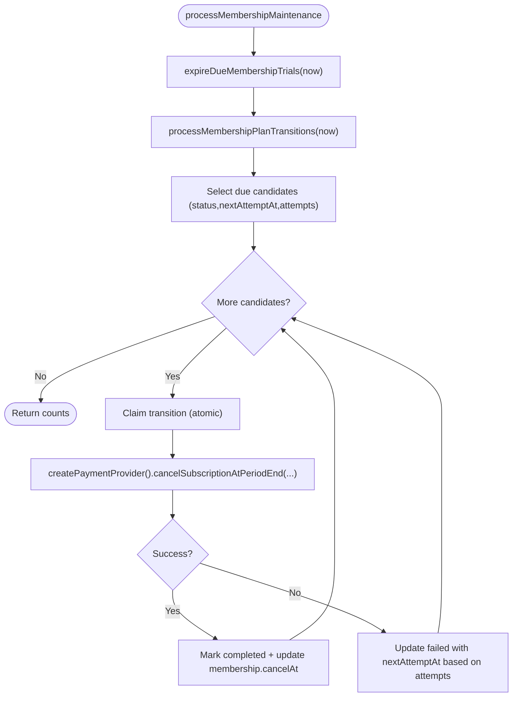
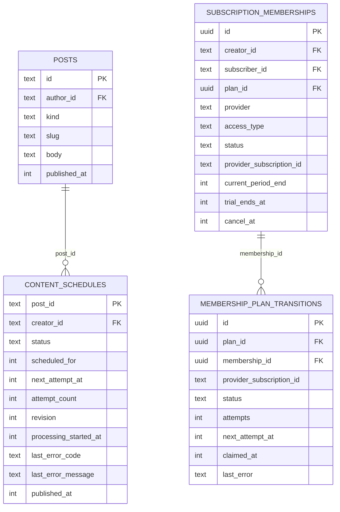
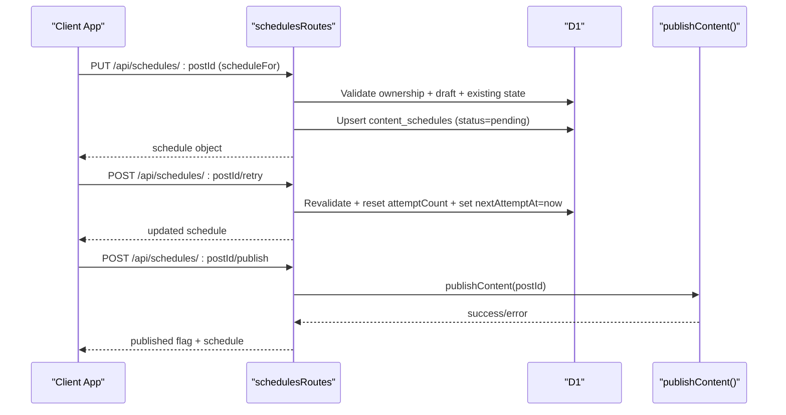
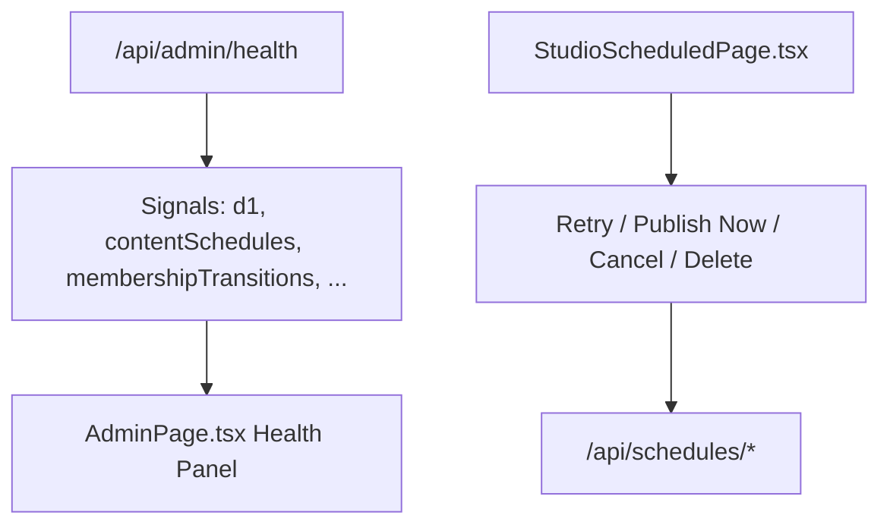
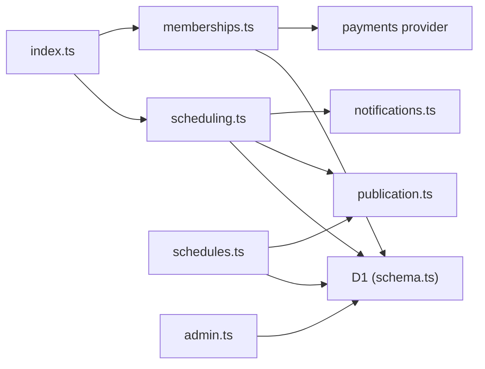

# Background Processing

<cite>
**Referenced Files in This Document**
- [index.ts](file://src/worker/index.ts)
- [wrangler.json](file://wrangler.json)
- [scheduling.ts](file://src/worker/lib/scheduling.ts)
- [memberships.ts](file://src/worker/lib/memberships.ts)
- [schema.ts](file://src/worker/db/schema.ts)
- [0014_content_scheduling.sql](file://drizzle/0014_content_scheduling.sql)
- [0016_stripe_membership_modes.sql](file://drizzle/0016_stripe_membership_modes.sql)
- [notifications.ts](file://src/worker/lib/notifications.ts)
- [schedules.ts](file://src/worker/routes/schedules.ts)
- [admin.ts](file://src/worker/routes/admin.ts)
- [AdminPage.tsx](file://src/react-app/pages/AdminPage.tsx)
- [StudioScheduledPage.tsx](file://src/react-app/pages/StudioScheduledPage.tsx)
</cite>

## Table of Contents
1. Introduction
2. Project Structure
3. Core Components
4. Architecture Overview
5. Detailed Component Analysis
6. Dependency Analysis
7. Performance Considerations
8. Troubleshooting Guide
9. Conclusion
10. Appendices

## Introduction
This document explains the background processing system implemented with Cloudflare Workers scheduled functions. It covers how periodic tasks are triggered, how time-sensitive operations are queued and processed, and how failures are retried and monitored. The system supports two primary job families:
- Content scheduling: publishing posts, articles, audio, photography, and courses at specified times.
- Membership maintenance: expiring trials and processing plan transitions (e.g., cancel-at-period-end).

The scheduler runs on a cron trigger configured in Wrangler and invokes dedicated processors that interact with D1 via Drizzle ORM. Jobs are persisted in database tables with status fields and retry policies, enabling robust, observable, and recoverable background work.

## Project Structure
Background processing is centered around:
- Worker entrypoint exposing a scheduled handler.
- Scheduling and membership maintenance libraries implementing job processing logic.
- Database schema definitions and migrations for job queues.
- API routes for creating, managing, and inspecting schedules.
- Admin health endpoints and UI components for monitoring.

**Diagram sources**
- [index.ts:62-70](file://src/worker/index.ts#L62-L70)
- [scheduling.ts:42-126](file://src/worker/lib/scheduling.ts#L42-L126)
- [memberships.ts:138-143](file://src/worker/lib/memberships.ts#L138-L143)
- [schema.ts:191-208](file://src/worker/db/schema.ts#L191-L208)
- [schema.ts:814-831](file://src/worker/db/schema.ts#L814-L831)
- [0014_content_scheduling.sql:26-47](file://drizzle/0014_content_scheduling.sql#L26-L47)
- [0016_stripe_membership_modes.sql:52-70](file://drizzle/0016_stripe_membership_modes.sql#L52-L70)

**Section sources**
- [index.ts:1-71](file://src/worker/index.ts#L1-L71)
- [wrangler.json:66-84](file://wrangler.json#L66-L84)

## Core Components
- Scheduled entrypoint: Exposes a single scheduled handler that orchestrates both content scheduling and membership maintenance jobs concurrently using waitUntil.
- Content scheduler: Scans due items, claims them atomically, attempts publication, and applies retry/failure logic with exponential backoff and maximum attempts.
- Membership maintenance: Expires trials and processes plan transition jobs with idempotent claiming and retry delays.
- Job queues: Persisted in D1 with status-driven state machines and indexes optimized for due-time queries.
- Notifications: On failure, creators receive notifications about schedule failures; email delivery is tracked and logged.
- APIs: Provide CRUD for schedules, immediate publish, and retry operations for failed jobs.
- Monitoring: Admin health endpoint aggregates signals like failed schedules, overdue schedules, and failed membership transitions.

**Section sources**
- [index.ts:62-70](file://src/worker/index.ts#L62-L70)
- [scheduling.ts:42-126](file://src/worker/lib/scheduling.ts#L42-L126)
- [memberships.ts:56-143](file://src/worker/lib/memberships.ts#L56-L143)
- [schema.ts:191-208](file://src/worker/db/schema.ts#L191-L208)
- [schema.ts:814-831](file://src/worker/db/schema.ts#L814-L831)
- [notifications.ts:301-326](file://src/worker/lib/notifications.ts#L301-L326)
- [schedules.ts:170-295](file://src/worker/routes/schedules.ts#L170-L295)
- [admin.ts:137-170](file://src/worker/routes/admin.ts#L137-L170)

## Architecture Overview
The system uses Cloudflare Workers cron triggers to invoke a single scheduled handler. That handler concurrently executes two independent processors:
- processDueSchedules: Picks up due content schedules, claims them, publishes content, and updates statuses with retries or final failure.
- processMembershipMaintenance: Expires trials and processes membership plan transitions with retry/backoff.

**Diagram sources**
- [index.ts:62-70](file://src/worker/index.ts#L62-L70)
- [scheduling.ts:42-126](file://src/worker/lib/scheduling.ts#L42-L126)
- [memberships.ts:56-143](file://src/worker/lib/memberships.ts#L56-L143)

**Section sources**
- [wrangler.json:66-84](file://wrangler.json#L66-L84)
- [index.ts:62-70](file://src/worker/index.ts#L62-L70)

## Detailed Component Analysis

### Scheduled Entrypoint
- Exposes a default exported handler with fetch and scheduled methods.
- The scheduled method runs both processors concurrently via Promise.all inside ctx.waitUntil.

**Diagram sources**
- [index.ts:62-70](file://src/worker/index.ts#L62-L70)

**Section sources**
- [index.ts:62-70](file://src/worker/index.ts#L62-L70)

### Content Scheduling Processor
Key behaviors:
- Stale recovery: Items stuck in processing beyond a threshold are reset to pending.
- Due selection: Fetches pending items with nextAttemptAt <= now, ordered by earliest attempt.
- Atomic claim: Updates status to processing and increments attempt count atomically.
- Publication attempt: Calls publishContent; handles deterministic vs retryable errors.
- Retry policy: First retry after 60 seconds, subsequent retries after 5 minutes; max attempts enforced before marking failed.
- Failure handling: Marks failed, records error code/message, and notifies the creator.

**Diagram sources**
- [scheduling.ts:42-126](file://src/worker/lib/scheduling.ts#L42-L126)

**Section sources**
- [scheduling.ts:1-127](file://src/worker/lib/scheduling.ts#L1-L127)

### Membership Maintenance Processor
Key behaviors:
- Trial expiration: Sets trial memberships to expired when trialEndsAt <= now.
- Transition processing: Picks candidates in pending/failed states within attempt limits or stale processing; claims atomically; calls payment provider; marks completed or failed with retry delays.
- Retry policy: First attempt delay 60 seconds, second 5 minutes, third 24 hours; max attempts capped.

**Diagram sources**
- [memberships.ts:56-143](file://src/worker/lib/memberships.ts#L56-L143)

**Section sources**
- [memberships.ts:1-144](file://src/worker/lib/memberships.ts#L1-L144)

### Job Queue Data Model
Two primary job queues:
- content_schedules: Tracks per-post scheduling lifecycle with status, timestamps, attempt counts, and error metadata.
- membership_plan_transitions: Tracks subscription plan transitions with status, attempts, claimed timestamps, and last error.

Indexes support efficient due-time queries and creator/status filtering.

**Diagram sources**
- [schema.ts:191-208](file://src/worker/db/schema.ts#L191-L208)
- [schema.ts:814-831](file://src/worker/db/schema.ts#L814-L831)
- [0014_content_scheduling.sql:26-47](file://drizzle/0014_content_scheduling.sql#L26-L47)
- [0016_stripe_membership_modes.sql:52-70](file://drizzle/0016_stripe_membership_modes.sql#L52-L70)

**Section sources**
- [schema.ts:191-208](file://src/worker/db/schema.ts#L191-L208)
- [schema.ts:814-831](file://src/worker/db/schema.ts#L814-L831)
- [0014_content_scheduling.sql:26-47](file://drizzle/0014_content_scheduling.sql#L26-L47)
- [0016_stripe_membership_modes.sql:52-70](file://drizzle/0016_stripe_membership_modes.sql#L52-L70)

### API Surface for Schedules
- List schedules with filters (upcoming, failed, history) and pagination.
- Get a specific schedule by postId.
- Create/update a schedule with validation and conflict checks.
- Cancel a schedule if not processing/published.
- Retry a failed schedule after revalidation.
- Publish immediately by invoking publishContent directly.

**Diagram sources**
- [schedules.ts:170-295](file://src/worker/routes/schedules.ts#L170-L295)

**Section sources**
- [schedules.ts:1-295](file://src/worker/routes/schedules.ts#L1-295)

### Monitoring and Logging
- Admin health endpoint aggregates signals such as failed schedules, overdue schedules, failed membership transitions, webhook failures, and more.
- Frontend Admin page polls the health endpoint and displays overall status and individual signal cards.
- Studio Scheduled page exposes actions to retry, publish now, cancel, or delete drafts based on schedule status.

**Diagram sources**
- [admin.ts:137-170](file://src/worker/routes/admin.ts#L137-L170)
- [AdminPage.tsx:888-925](file://src/react-app/pages/AdminPage.tsx#L888-L925)
- [StudioScheduledPage.tsx:125-143](file://src/react-app/pages/StudioScheduledPage.tsx#L125-L143)

**Section sources**
- [admin.ts:137-170](file://src/worker/routes/admin.ts#L137-L170)
- [AdminPage.tsx:888-925](file://src/react-app/pages/AdminPage.tsx#L888-L925)
- [StudioScheduledPage.tsx:125-143](file://src/react-app/pages/StudioScheduledPage.tsx#L125-L143)

## Dependency Analysis
- index.ts depends on Hono app setup and imports scheduling and membership processors.
- scheduling.ts depends on Drizzle client, schema, and publication utilities; it also triggers notifications on failure.
- memberships.ts depends on Drizzle client, schema, and payment provider abstraction.
- Both processors rely on D1 tables defined in schema.ts and migrations.
- APIs in schedules.ts depend on publication utilities and schema for validation and state management.
- Admin health endpoint reads multiple tables to compute signals.

**Diagram sources**
- [index.ts:1-23](file://src/worker/index.ts#L1-L23)
- [scheduling.ts:1-11](file://src/worker/lib/scheduling.ts#L1-L11)
- [memberships.ts:1-9](file://src/worker/lib/memberships.ts#L1-L9)
- [schema.ts:191-208](file://src/worker/db/schema.ts#L191-L208)
- [schema.ts:814-831](file://src/worker/db/schema.ts#L814-L831)
- [schedules.ts:1-23](file://src/worker/routes/schedules.ts#L1-L23)
- [admin.ts:137-170](file://src/worker/routes/admin.ts#L137-L170)

**Section sources**
- [index.ts:1-23](file://src/worker/index.ts#L1-L23)
- [scheduling.ts:1-11](file://src/worker/lib/scheduling.ts#L1-L11)
- [memberships.ts:1-9](file://src/worker/lib/memberships.ts#L1-L9)
- [schedules.ts:1-23](file://src/worker/routes/schedules.ts#L1-L23)
- [admin.ts:137-170](file://src/worker/routes/admin.ts#L137-L170)

## Performance Considerations
- Batch sizes: Content scheduling uses a fixed batch size to limit memory and DB load per invocation.
- Atomic claims: Using atomic updates prevents duplicate processing and reduces contention.
- Stale recovery: Resets long-running items to avoid deadlocks and resource leaks.
- Retry backoff: Exponential or staged delays reduce pressure on external services and transient failures.
- Observability: Structured logging events enable metrics collection and alerting.
- Resource constraints: Workers have CPU and memory limits; keep loops bounded and avoid heavy computations inside scheduled handlers.

[No sources needed since this section provides general guidance]

## Troubleshooting Guide
Common issues and resolutions:
- Stuck processing: Ensure stale-before thresholds are appropriate; check for unhandled exceptions in publishContent or payment provider calls.
- Excessive retries: Validate deterministic error codes; ensure non-retryable conditions mark jobs as failed promptly.
- Notification failures: Check email configuration and transactional email availability; review notification email status in DB.
- Admin signals: Use the health endpoint to identify attention signals; drill into failed schedules and membership transitions.

Operational tips:
- Inspect logs emitted by processors for event names like content_schedule_tick, content_schedule_retry, content_schedule_failed, and membership_plan_transition_failed.
- Use the Studio Scheduled page to retry or publish immediately when appropriate.
- Review admin health signals for trends and anomalies.

**Section sources**
- [scheduling.ts:39-40](file://src/worker/lib/scheduling.ts#L39-L40)
- [scheduling.ts:120-124](file://src/worker/lib/scheduling.ts#L120-L124)
- [memberships.ts:126-132](file://src/worker/lib/memberships.ts#L126-L132)
- [notifications.ts:222-231](file://src/worker/lib/notifications.ts#L222-L231)
- [admin.ts:137-170](file://src/worker/routes/admin.ts#L137-L170)

## Conclusion
The background processing system leverages Cloudflare Workers scheduled functions to reliably execute time-sensitive tasks. With persistent job queues, atomic claiming, structured retry policies, and comprehensive monitoring, the system ensures robustness and observability. Extending the system involves adding new job types following the established patterns: define queue schema, implement processor with claim/retry/fail logic, integrate with necessary services, and expose relevant APIs and monitoring signals.

[No sources needed since this section summarizes without analyzing specific files]

## Appendices

### How to Implement a New Scheduled Job
Steps:
- Define a queue table in schema.ts with status, timestamps, attempts, and error fields; add migrations accordingly.
- Implement a processor function similar to processDueSchedules or processMembershipMaintenance:
  - Reset stale items.
  - Select due items with an index-friendly query.
  - Atomically claim items.
  - Perform work with error classification (deterministic vs retryable).
  - Apply retry delays and cap attempts.
  - Log structured events for observability.
- Wire the processor into the scheduled handler alongside existing ones.
- Optionally add API endpoints for manual control (retry, cancel, publish now).
- Add admin health signals to monitor job health.

[No sources needed since this section provides general guidance]