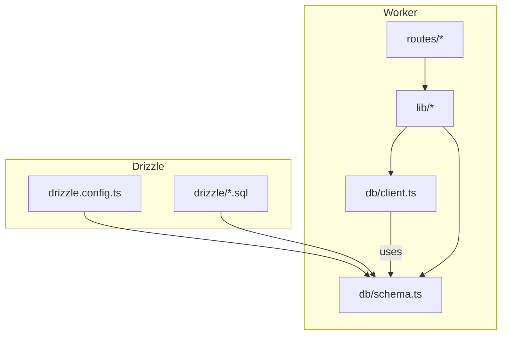
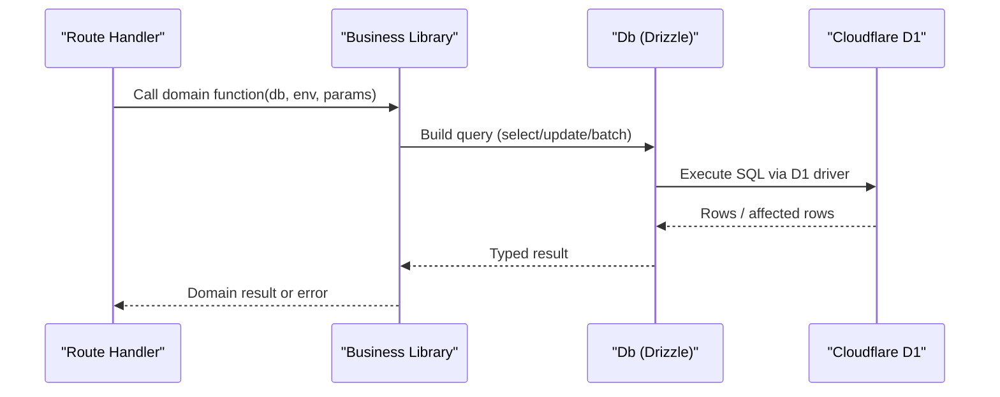
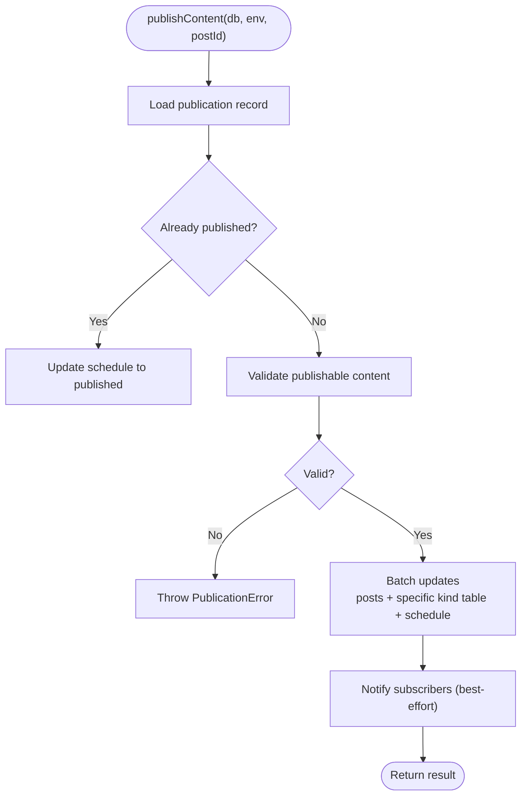
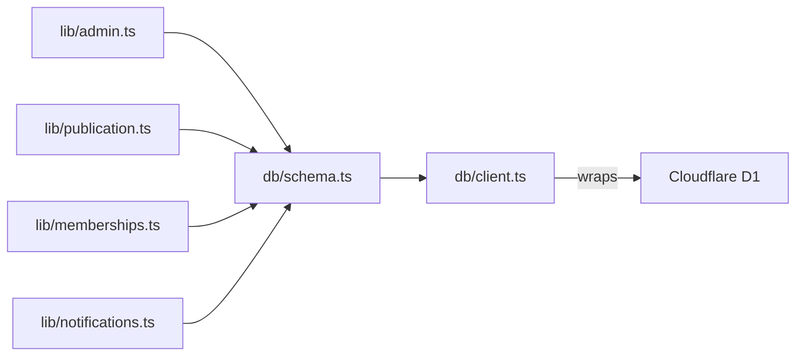

# Data Access Layer

<cite>
**Referenced Files in This Document**
- [client.ts](file://src/worker/db/client.ts)
- [schema.ts](file://src/worker/db/schema.ts)
- [drizzle.config.ts](file://drizzle.config.ts)
- [publication.ts](file://src/worker/lib/publication.ts)
- [admin.ts](file://src/worker/lib/admin.ts)
- [memberships.ts](file://src/worker/lib/memberships.ts)
- [notifications.ts](file://src/worker/lib/notifications.ts)
- [auth.integration.test.ts](file://src/worker/routes/auth.integration.test.ts)
- [0000_overrated_nitro.sql](file://drizzle/0000_overrated_nitro.sql)
</cite>

## Table of Contents
1. [Introduction](#introduction)
2. [Project Structure](#project-structure)
3. [Core Components](#core-components)
4. [Architecture Overview](#architecture-overview)
5. [Detailed Component Analysis](#detailed-component-analysis)
6. [Dependency Analysis](#dependency-analysis)
7. [Performance Considerations](#performance-considerations)
8. [Troubleshooting Guide](#troubleshooting-guide)
9. [Conclusion](#conclusion)

## Introduction
This document explains the data access layer built on Drizzle ORM for a Cloudflare D1 SQLite database. It covers:
- Database client configuration for D1
- Schema definitions, relationships, and constraints
- Repository-style patterns used to abstract database operations
- Query optimization techniques (indexes, batching, selective fields)
- Transaction handling strategies
- Connection pooling considerations in serverless environments
- Migration management via Drizzle migrations
- Error handling patterns for database operations and failures

## Project Structure
The data access layer is organized under src/worker/db with supporting business logic in src/worker/lib and migrations under drizzle. The Drizzle configuration points to the schema and D1 credentials.

**Diagram sources**
- [client.ts:1-9](file://src/worker/db/client.ts#L1-L9)
- [schema.ts:1-800](file://src/worker/db/schema.ts#L1-L800)
- [drizzle.config.ts:1-14](file://drizzle.config.ts#L1-L14)

**Section sources**
- [client.ts:1-9](file://src/worker/db/client.ts#L1-L9)
- [schema.ts:1-800](file://src/worker/db/schema.ts#L1-L800)
- [drizzle.config.ts:1-14](file://drizzle.config.ts#L1-L14)

## Core Components
- Database client: Wraps D1 with Drizzle and exposes a typed Db instance.
- Schema: Centralized table definitions, indexes, and constraints using sqlite-core.
- Business libraries: Implement repository-like functions that encapsulate queries and domain rules.

Key responsibilities:
- Client provides a single entry point to execute type-safe queries against D1.
- Schema defines entities, relations, defaults, and performance-critical indexes.
- Libraries implement CRUD and complex workflows, often using batched writes and careful error handling.

**Section sources**
- [client.ts:1-9](file://src/worker/db/client.ts#L1-L9)
- [schema.ts:1-800](file://src/worker/db/schema.ts#L1-L800)
- [publication.ts:1-273](file://src/worker/lib/publication.ts#L1-L273)
- [admin.ts:1-53](file://src/worker/lib/admin.ts#L1-L53)
- [memberships.ts:1-144](file://src/worker/lib/memberships.ts#L1-L144)

## Architecture Overview
The data access layer follows a thin client + rich schema + repository-style functions pattern.

**Diagram sources**
- [client.ts:1-9](file://src/worker/db/client.ts#L1-L9)
- [schema.ts:1-800](file://src/worker/db/schema.ts#L1-L800)
- [publication.ts:197-273](file://src/worker/lib/publication.ts#L197-L273)
- [memberships.ts:56-136](file://src/worker/lib/memberships.ts#L56-L136)

## Detailed Component Analysis

### Database Client Configuration (Cloudflare D1)
- The client factory wraps a D1Database instance with Drizzle and the shared schema, producing a strongly-typed Db.
- The Drizzle config specifies dialect sqlite, driver d1-http, and credentials from environment variables.

Implementation highlights:
- Factory returns a Drizzle instance bound to schema for type inference.
- Db type is derived from the factory return type for consistent usage across modules.

Operational notes:
- In serverless workers, each request typically creates its own Db instance; connection pooling is managed by the runtime and D1 driver.
- Avoid long-lived connections; reuse the Db instance per request only.

**Section sources**
- [client.ts:1-9](file://src/worker/db/client.ts#L1-L9)
- [drizzle.config.ts:1-14](file://drizzle.config.ts#L1-L14)

### Schema Definitions, Relationships, and Constraints
The schema defines core entities and their relationships:
- Users and authentication: users, session, account, verification
- Content model: posts with kind polymorphism; articles, audioCollections/audioItems, photographyAlbums/photographyPhotos, courses/courseModules/courseLessons/courseAttachments
- Interactions: postReplies/replyAttachments, postLikes/replyLikes, savedItems, postPolls/pollOptions/pollVotes
- Discovery and admin: discoveryCategories, creatorCategories, userCategoryInterests, featuredCreators, adminMemberships, moderationCases, contentReports, adminAuditLogs
- Payments and subscriptions: creatorPaymentAccounts, membershipPlans, membershipPlanPrices, paymentCustomers, subscriptionMemberships
- Scheduling: contentSchedules

Indexes and constraints:
- Primary keys, unique constraints, and foreign keys with onDelete behaviors are defined per table.
- Composite and single-column indexes optimize common queries (e.g., author+slug uniqueness, status+time ranges).
- Timestamps use unixepoch or millisecond modes with default expressions and update hooks.

Relationship examples:
- posts -> users (author), articles/audioItems/photographyAlbums/courses (kind-specific details)
- audioItems -> audioCollections
- courseLessons -> courseModules -> courses
- subscriptionMemberships -> membershipPlans and membershipPlanPrices

**Section sources**
- [schema.ts:1-800](file://src/worker/db/schema.ts#L1-L800)

### Repository Pattern Implementation
Repository-style functions encapsulate database operations behind clear interfaces:
- Admin: writeAdminAuditLog, getAdminRole, assertOwnerWillRemain
- Publication: getPublicationRecord, validatePublishableContent, publishContent
- Memberships: expireDueMembershipTrials, processMembershipPlanTransitions, processMembershipMaintenance
- Notifications: safeCreateNotification and subscriber notification flows

Characteristics:
- Functions accept a Db instance and parameters, returning typed results or throwing domain errors.
- Complex operations use db.batch to group multiple statements atomically where supported.
- Validation and business rules are enforced before writes.

Example flow: publishing content uses a multi-step validation and batched updates.

**Diagram sources**
- [publication.ts:197-273](file://src/worker/lib/publication.ts#L197-L273)

**Section sources**
- [admin.ts:1-53](file://src/worker/lib/admin.ts#L1-L53)
- [publication.ts:1-273](file://src/worker/lib/publication.ts#L1-L273)
- [memberships.ts:1-144](file://src/worker/lib/memberships.ts#L1-L144)
- [notifications.ts:1-52](file://src/worker/lib/notifications.ts#L1-L52)

### Query Optimization Techniques
- Selective field projection: Queries select only needed columns to reduce payload and improve index usage.
- Index utilization: Tables define targeted indexes for frequent filters (status, timestamps, creatorId, etc.).
- Batch writes: db.batch groups related updates to minimize round-trips and ensure consistency.
- Conditional selects: Using sql raw expressions for complex conditions (e.g., membership entitlement).

Practical examples:
- Publication record fetch joins only necessary tables and projects minimal fields.
- Membership transitions query targets pending/stale jobs with efficient filters and limits.

**Section sources**
- [publication.ts:34-77](file://src/worker/lib/publication.ts#L34-L77)
- [memberships.ts:56-136](file://src/worker/lib/memberships.ts#L56-L136)
- [schema.ts:1-800](file://src/worker/db/schema.ts#L1-L800)

### Transaction Handling
- Atomicity is achieved via db.batch for grouped writes within a single statement execution context.
- For more complex transactions requiring rollback semantics beyond batch, wrap operations in a transactional boundary at the caller level if supported by the D1 driver.
- Example: publishContent batches updates to posts and kind-specific tables plus schedule in one call.

Best practices:
- Keep transactions short and focused on a single logical unit.
- Prefer idempotent operations and explicit state checks before writes.

**Section sources**
- [publication.ts:230-256](file://src/worker/lib/publication.ts#L230-L256)

### Connection Pooling Strategies
- In Cloudflare Workers, connections are ephemeral; avoid maintaining global connections.
- Create a Db instance per request using createDb(d1) and dispose it after use.
- Rely on D1’s internal connection management; do not pool manually.

**Section sources**
- [client.ts:1-9](file://src/worker/db/client.ts#L1-L9)

### Data Migration Management
- Migrations are stored as SQL files under drizzle and driven by Drizzle Kit configured for d1-http.
- Tests demonstrate applying migration files by splitting on statement breakpoints and executing sequentially.
- Use drizzle-kit commands to generate and apply migrations consistently across environments.

Migration workflow:
- Define schema changes in schema.ts.
- Generate migration SQL via Drizzle Kit.
- Apply migrations to D1 using CLI or programmatically in tests.

**Section sources**
- [drizzle.config.ts:1-14](file://drizzle.config.ts#L1-L14)
- [auth.integration.test.ts:1-26](file://src/worker/routes/auth.integration.test.ts#L1-L26)
- [0000_overrated_nitro.sql](file://drizzle/0000_overrated_nitro.sql)

### Error Handling Patterns
- Domain-specific errors: PublicationError carries code, message, and retryability flags.
- Safe side effects: Notification sending is wrapped in try/catch to avoid failing primary operations.
- Retry and backoff: Membership transitions track attempts and compute nextAttemptAt with exponential-ish delays.
- Validation failures: Early throws prevent invalid state transitions.

Patterns observed:
- Throw typed errors for business rule violations.
- Log structured events for observability without surfacing stack traces.
- Separate critical path from best-effort notifications.

**Section sources**
- [publication.ts:23-32](file://src/worker/lib/publication.ts#L23-L32)
- [publication.ts:258-268](file://src/worker/lib/publication.ts#L258-L268)
- [memberships.ts:111-132](file://src/worker/lib/memberships.ts#L111-L132)

## Dependency Analysis
High-level dependencies between data access components:

**Diagram sources**
- [schema.ts:1-800](file://src/worker/db/schema.ts#L1-L800)
- [client.ts:1-9](file://src/worker/db/client.ts#L1-L9)
- [admin.ts:1-53](file://src/worker/lib/admin.ts#L1-L53)
- [publication.ts:1-273](file://src/worker/lib/publication.ts#L1-L273)
- [memberships.ts:1-144](file://src/worker/lib/memberships.ts#L1-L144)
- [notifications.ts:1-52](file://src/worker/lib/notifications.ts#L1-L52)

**Section sources**
- [schema.ts:1-800](file://src/worker/db/schema.ts#L1-L800)
- [client.ts:1-9](file://src/worker/db/client.ts#L1-L9)
- [admin.ts:1-53](file://src/worker/lib/admin.ts#L1-L53)
- [publication.ts:1-273](file://src/worker/lib/publication.ts#L1-L273)
- [memberships.ts:1-144](file://src/worker/lib/memberships.ts#L1-L144)
- [notifications.ts:1-52](file://src/worker/lib/notifications.ts#L1-L52)

## Performance Considerations
- Prefer indexed columns in WHERE clauses; leverage composite indexes for multi-column filters.
- Use db.batch for multiple related writes to reduce latency.
- Select only required fields to minimize memory and network overhead.
- Keep transactions short; avoid holding locks longer than necessary.
- Offload heavy work (e.g., notifications) to best-effort paths outside critical paths.

[No sources needed since this section provides general guidance]

## Troubleshooting Guide
Common issues and resolutions:
- Migration failures: Ensure migration files are applied in order; split statements correctly when running programmatically.
- Constraint violations: Check unique/index constraints and foreign key references; verify enum values match schema.
- Stale scheduled jobs: Inspect status and nextAttemptAt fields; reprocess failed jobs with updated timestamps.
- Notification failures: Verify external service availability; rely on logs and non-failing notification paths.

Diagnostic tips:
- Log structured events around critical operations (e.g., admin actions, publish outcomes).
- Use test fixtures to replay migrations and validate behavior deterministically.

**Section sources**
- [auth.integration.test.ts:1-26](file://src/worker/routes/auth.integration.test.ts#L1-L26)
- [admin.ts:24-31](file://src/worker/lib/admin.ts#L24-L31)
- [publication.ts:258-268](file://src/worker/lib/publication.ts#L258-L268)
- [memberships.ts:111-132](file://src/worker/lib/memberships.ts#L111-L132)

## Conclusion
The data access layer leverages Drizzle ORM with a clean separation between schema, client, and repository-style business logic. It emphasizes type safety, performance through indexing and batching, robust error handling, and maintainable migrations. Following the patterns outlined here will help scale the system reliably on Cloudflare D1 while keeping queries efficient and operations resilient.