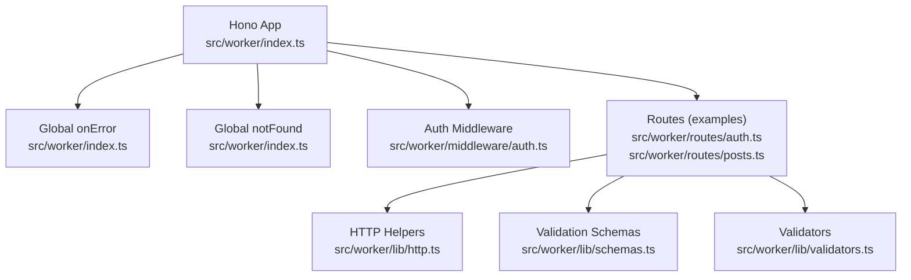
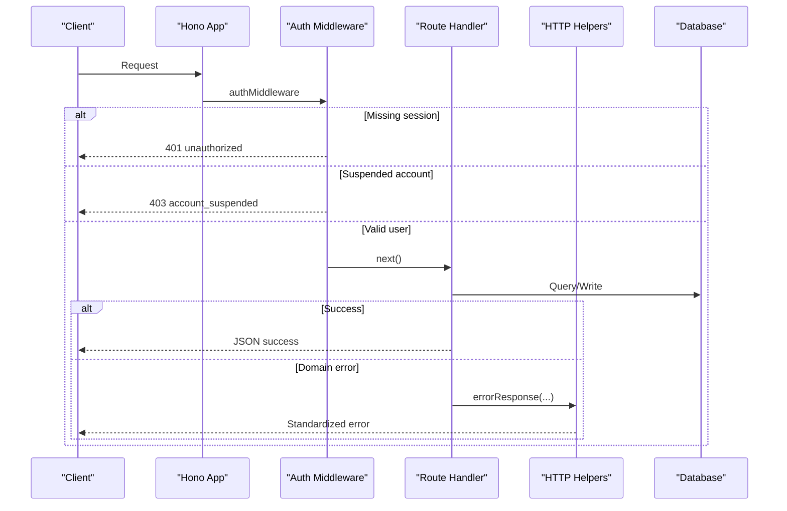
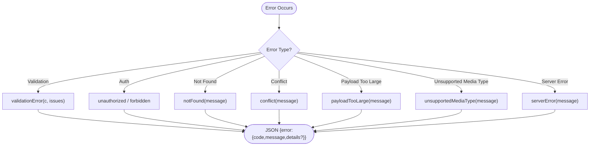
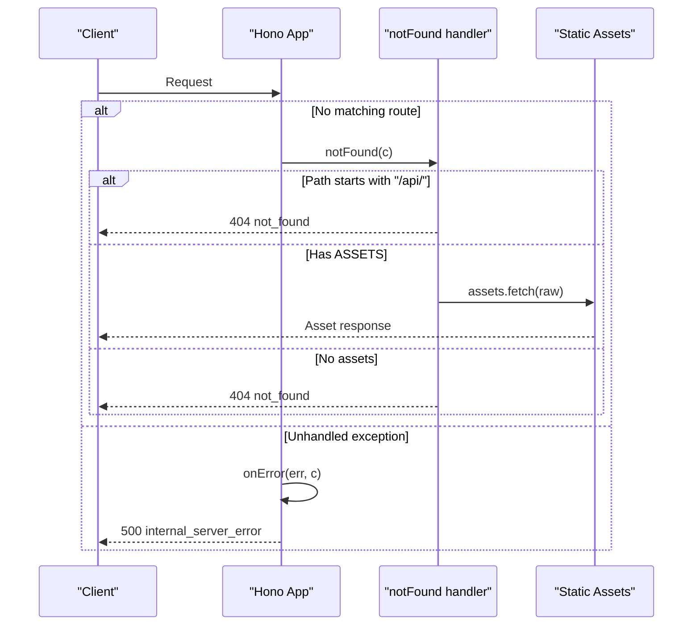
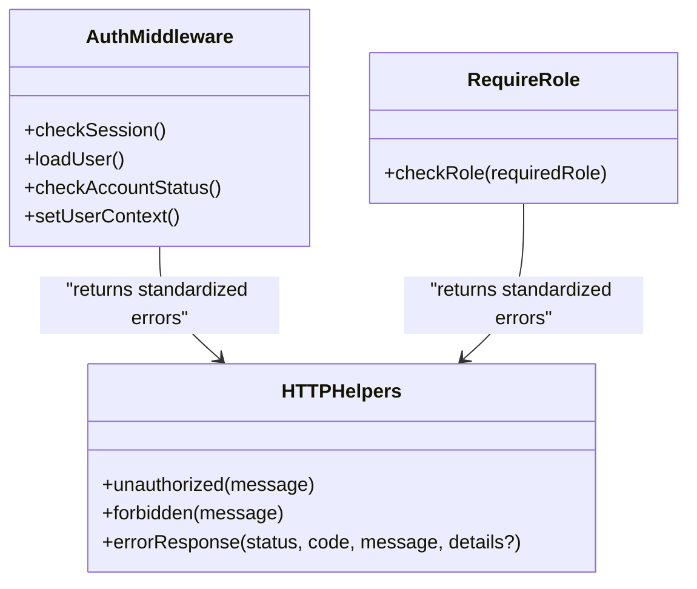
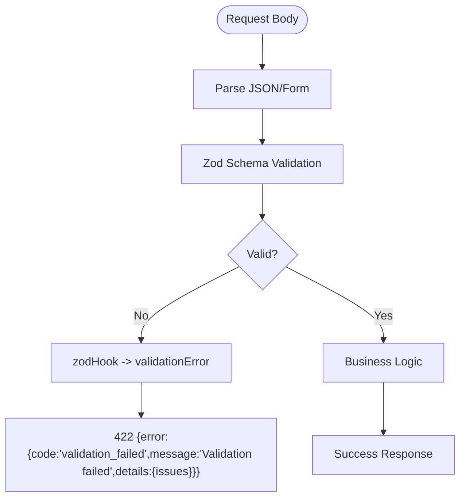
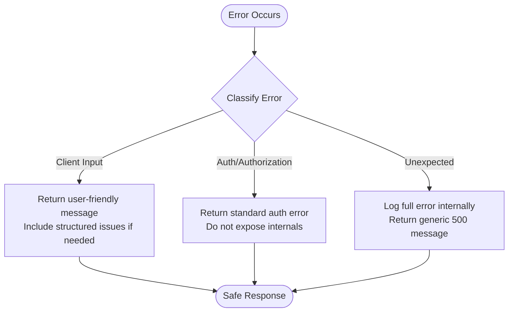
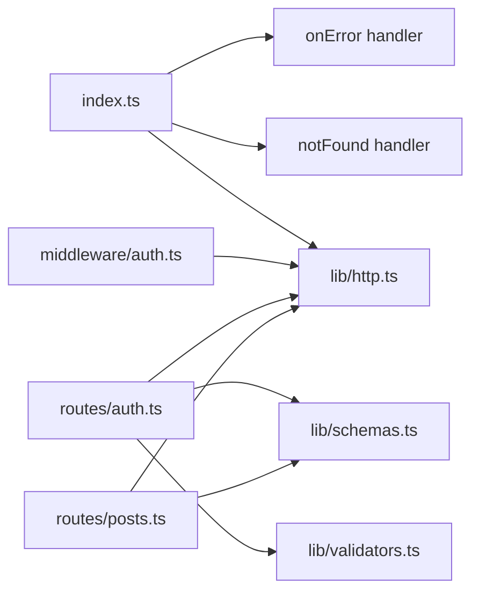

# Error Handling

<cite>
**Referenced Files in This Document**
- [index.ts](file://src/worker/index.ts)
- [http.ts](file://src/worker/lib/http.ts)
- [auth.ts](file://src/worker/middleware/auth.ts)
- [schemas.ts](file://src/worker/lib/schemas.ts)
- [validators.ts](file://src/worker/lib/validators.ts)
- [auth.ts](file://src/worker/routes/auth.ts)
- [posts.ts](file://src/worker/routes/posts.ts)
</cite>

## Table of Contents
1. [Introduction](#introduction)
2. [Project Structure](#project-structure)
3. [Core Components](#core-components)
4. [Architecture Overview](#architecture-overview)
5. [Detailed Component Analysis](#detailed-component-analysis)
6. [Dependency Analysis](#dependency-analysis)
7. [Performance Considerations](#performance-considerations)
8. [Troubleshooting Guide](#troubleshooting-guide)
9. [Conclusion](#conclusion)

## Introduction
This document explains the backend error handling strategy, focusing on centralized error handling middleware, consistent response formatting, custom error types and status code mappings, logging practices, validation error handling, user-friendly messages, security considerations for error responses, and guidelines for implementing consistent error handling across new routes and business logic modules.

## Project Structure
The backend is built with Hono and organizes error handling utilities under a shared HTTP module, integrates Zod-based validation via a validator hook, and applies authentication and authorization middleware that return standardized errors. The application registers global error and not-found handlers to ensure consistent behavior across all routes.

**Diagram sources**
- [index.ts:24-60](file://src/worker/index.ts#L24-L60)
- [auth.ts](file://src/worker/middleware/auth.ts)
- [http.ts](file://src/worker/lib/http.ts)
- [schemas.ts](file://src/worker/lib/schemas.ts)
- [validators.ts](file://src/worker/lib/validators.ts)
- [auth.ts](file://src/worker/routes/auth.ts)
- [posts.ts](file://src/worker/routes/posts.ts)

**Section sources**
- [index.ts:24-60](file://src/worker/index.ts#L24-L60)

## Core Components
- Centralized error formatter and helpers:
  - A unified error body shape with code, message, and optional details.
  - Helper functions for common HTTP statuses (bad request, unauthorized, forbidden, not found, conflict, payload too large, unsupported media type, server error).
  - Validation error helper tailored for Zod issues.
- Global error and not-found handlers:
  - Global onError logs errors and returns a standardized internal server error response.
  - Global notFound differentiates API vs asset requests and returns appropriate responses.
- Authentication and authorization middleware:
  - Returns unauthorized or forbidden responses when sessions are missing or roles do not match.
  - Returns account-suspended errors with a specific code and message.
- Validation integration:
  - Zod schemas define input constraints and human-readable messages.
  - A zodHook converts validation failures into standardized validation_failed responses.

**Section sources**
- [http.ts:1-80](file://src/worker/lib/http.ts#L1-L80)
- [index.ts:47-60](file://src/worker/index.ts#L47-L60)
- [auth.ts](file://src/worker/middleware/auth.ts)
- [schemas.ts:1-221](file://src/worker/lib/schemas.ts#L1-L221)

## Architecture Overview
The error handling architecture follows a layered approach:
- Route-level validators use Zod schemas and a zodHook to convert validation failures early.
- Business logic returns domain-specific errors using the http helpers.
- Middleware enforces authentication and authorization, returning standardized errors.
- Global handlers catch unhandled exceptions and route-not-found cases, ensuring consistent responses.

**Diagram sources**
- [index.ts:47-60](file://src/worker/index.ts#L47-L60)
- [auth.ts](file://src/worker/middleware/auth.ts)
- [http.ts](file://src/worker/lib/http.ts)
- [auth.ts](file://src/worker/routes/auth.ts)
- [posts.ts](file://src/worker/routes/posts.ts)

## Detailed Component Analysis

### Centralized Error Response Formatting
- Unified error body structure includes a code, message, and optional details.
- Dedicated helpers map common HTTP statuses to codes and messages, reducing duplication and inconsistency.
- Validation errors include structured issues for client-side display.

**Diagram sources**
- [http.ts:23-75](file://src/worker/lib/http.ts#L23-L75)

**Section sources**
- [http.ts:1-80](file://src/worker/lib/http.ts#L1-L80)

### Global Error and Not-Found Handlers
- Global onError logs the full error object and returns a standardized internal server error response.
- Global notFound checks if the path starts with /api/ to return an API-style not found; otherwise it attempts to serve static assets or returns not found.

**Diagram sources**
- [index.ts:47-60](file://src/worker/index.ts#L47-L60)

**Section sources**
- [index.ts:47-60](file://src/worker/index.ts#L47-L60)

### Authentication and Authorization Error Handling
- Missing or invalid session results in unauthorized responses.
- Suspended accounts receive a specific account_suspended error with a 403 status.
- Role-based access control returns forbidden when the user role does not match required role.

**Diagram sources**
- [auth.ts](file://src/worker/middleware/auth.ts)
- [http.ts](file://src/worker/lib/http.ts)

**Section sources**
- [auth.ts](file://src/worker/middleware/auth.ts)

### Validation Error Handling and User-Friendly Messages
- Zod schemas define precise rules and human-readable messages for inputs such as emails, passwords, usernames, URLs, and complex objects.
- The zodHook transforms validation failures into structured validation_failed responses including issues for client consumption.
- Route handlers also perform additional validations (e.g., multipart parsing, image size/type limits, poll options) and return consistent error responses.

**Diagram sources**
- [schemas.ts:1-221](file://src/worker/lib/schemas.ts#L1-L221)
- [http.ts:77-80](file://src/worker/lib/http.ts#L77-L80)
- [posts.ts:419-542](file://src/worker/routes/posts.ts#L419-L542)

**Section sources**
- [schemas.ts:1-221](file://src/worker/lib/schemas.ts#L1-L221)
- [http.ts:77-80](file://src/worker/lib/http.ts#L77-L80)
- [posts.ts:419-542](file://src/worker/routes/posts.ts#L419-L542)

### Security Considerations for Error Responses
- Avoid leaking sensitive information in error bodies; only include minimal, safe details.
- Use generic messages for unexpected server errors while preserving detailed logs internally.
- Enforce HTTPS-only URL validation where applicable to prevent insecure links.
- Ensure cookies and headers from downstream auth endpoints are safely copied without exposing secrets.

[No sources needed since this diagram shows conceptual workflow, not actual code structure]

**Section sources**
- [http.ts:23-75](file://src/worker/lib/http.ts#L23-L75)
- [validators.ts:42-49](file://src/worker/lib/validators.ts#L42-L49)
- [auth.ts](file://src/worker/routes/auth.ts)

### Logging Strategy for Debugging and Monitoring
- Global onError logs the complete error object for debugging.
- Route handlers log contextual errors (e.g., OTP email delivery failures) to aid troubleshooting.
- Recommendations:
  - Add structured logging with request IDs and timestamps.
  - Separate debug logs from production logs; avoid printing sensitive data.
  - Integrate with monitoring systems to track error rates and types.

**Section sources**
- [index.ts:47-50](file://src/worker/index.ts#L47-L50)
- [auth.ts](file://src/worker/routes/auth.ts)

### Status Code Mappings and Custom Error Codes
- Standard HTTP status codes are mapped to concise error codes:
  - 400 bad_request
  - 401 unauthorized
  - 403 forbidden
  - 404 not_found
  - 409 conflict
  - 413 payload_too_large
  - 415 unsupported_media_type
  - 422 validation_failed
  - 500 internal_server_error
- Domain-specific codes include:
  - account_suspended
  - otp_email_unavailable
  - too_many_otp_attempts
  - invalid_otp
  - schedule_processing
  - schedule_too_soon
  - password_auth_disabled

**Section sources**
- [http.ts:4-14](file://src/worker/lib/http.ts#L4-L14)
- [auth.ts](file://src/worker/routes/auth.ts)
- [posts.ts:419-542](file://src/worker/routes/posts.ts#L419-L542)

## Dependency Analysis
The error handling components have clear dependencies:
- Routes depend on http helpers for consistent responses and on Zod schemas for validation.
- Middleware depends on http helpers for auth-related errors.
- Global handlers depend on http helpers for notFound and serverError.

**Diagram sources**
- [index.ts:47-60](file://src/worker/index.ts#L47-L60)
- [http.ts](file://src/worker/lib/http.ts)
- [auth.ts](file://src/worker/middleware/auth.ts)
- [auth.ts](file://src/worker/routes/auth.ts)
- [posts.ts](file://src/worker/routes/posts.ts)
- [schemas.ts](file://src/worker/lib/schemas.ts)
- [validators.ts](file://src/worker/lib/validators.ts)

**Section sources**
- [index.ts:47-60](file://src/worker/index.ts#L47-L60)
- [http.ts](file://src/worker/lib/http.ts)
- [auth.ts](file://src/worker/middleware/auth.ts)
- [auth.ts](file://src/worker/routes/auth.ts)
- [posts.ts](file://src/worker/routes/posts.ts)
- [schemas.ts](file://src/worker/lib/schemas.ts)
- [validators.ts](file://src/worker/lib/validators.ts)

## Performance Considerations
- Keep error responses lightweight; avoid serializing large payloads in error bodies.
- Use structured validation to fail fast and reduce unnecessary processing.
- Log selectively to minimize overhead; consider sampling or rate-limiting verbose logs in high-throughput scenarios.
- Prefer async operations with proper error boundaries to prevent cascading failures.

[No sources needed since this section provides general guidance]

## Troubleshooting Guide
Common issues and resolutions:
- Validation failures:
  - Check Zod schema definitions and ensure messages are clear.
  - Inspect issues array in validation_failed responses for field-level errors.
- Authentication errors:
  - Verify session presence and cookie propagation.
  - Confirm account status is active; suspended accounts receive specific errors.
- Resource not found:
  - Ensure correct paths and parameters; confirm access permissions.
- Payload issues:
  - Validate content-type and size limits; handle multipart parsing errors gracefully.
- Unexpected server errors:
  - Review global onError logs; add context to logs for better diagnostics.

**Section sources**
- [http.ts:35-43](file://src/worker/lib/http.ts#L35-L43)
- [auth.ts](file://src/worker/middleware/auth.ts)
- [index.ts:47-60](file://src/worker/index.ts#L47-L60)

## Conclusion
The backend implements a robust, centralized error handling strategy with consistent response formatting, clear status code mappings, and user-friendly validation messages. Authentication and authorization middleware enforce security with standardized errors, while global handlers ensure uniform behavior for unhandled exceptions and not-found cases. Following the provided guidelines will help maintain consistency, security, and observability across new routes and business logic modules.