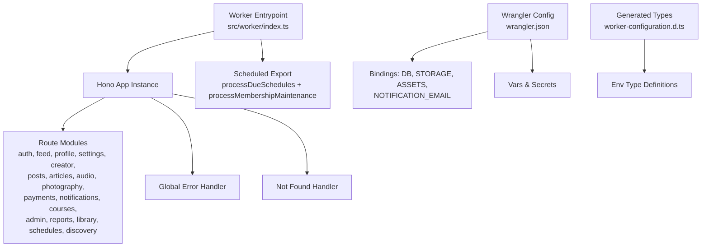
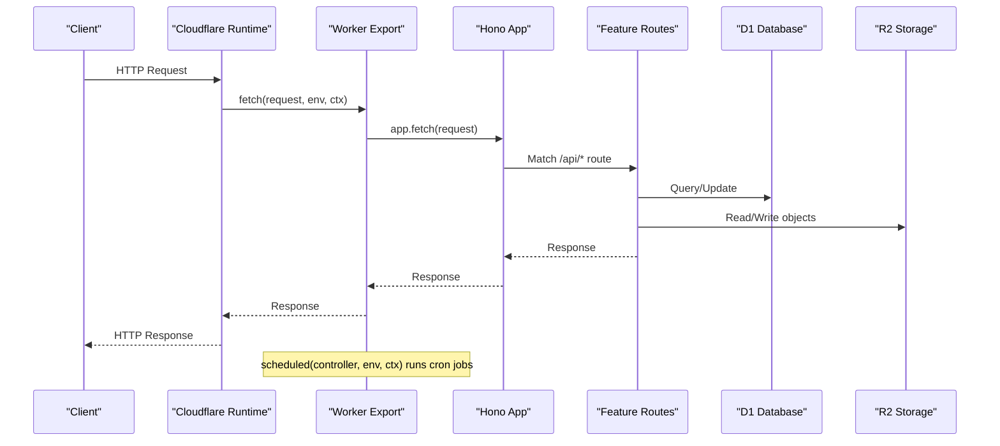
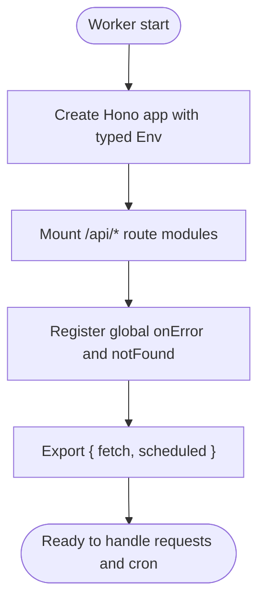
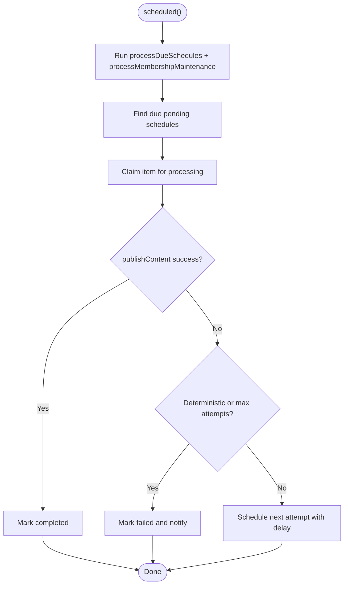
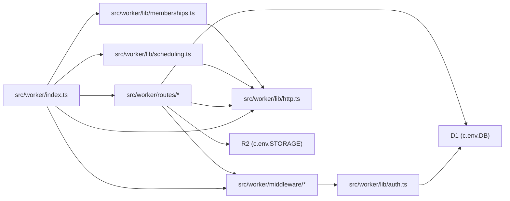

# Hono Framework Setup

<cite>
**Referenced Files in This Document**
- [src/worker/index.ts](file://src/worker/index.ts)
- [wrangler.json](file://wrangler.json)
- [worker-configuration.d.ts](file://worker-configuration.d.ts)
- [src/worker/middleware/auth.ts](file://src/worker/middleware/auth.ts)
- [src/worker/lib/http.ts](file://src/worker/lib/http.ts)
- [src/worker/routes/auth.ts](file://src/worker/routes/auth.ts)
- [src/worker/lib/scheduling.ts](file://src/worker/lib/scheduling.ts)
- [src/worker/lib/memberships.ts](file://src/worker/lib/memberships.ts)
</cite>

## Table of Contents
1. [Introduction](#introduction)
2. [Project Structure](#project-structure)
3. [Core Components](#core-components)
4. [Architecture Overview](#architecture-overview)
5. [Detailed Component Analysis](#detailed-component-analysis)
6. [Dependency Analysis](#dependency-analysis)
7. [Performance Considerations](#performance-considerations)
8. [Troubleshooting Guide](#troubleshooting-guide)
9. [Conclusion](#conclusion)
10. [Appendices](#appendices)

## Introduction
This document explains how the Hono framework is set up and configured for Cloudflare Workers in this project. It covers application initialization, environment configuration, worker export structure, route mounting under /api, error handling middleware (global errors and notFound), scheduled tasks for background processing, integration with Cloudflare environment variables and secrets, and examples for extending the app with new routes and middleware.

## Project Structure
The Worker entrypoint creates a single Hono application instance and mounts feature-specific route modules under /api. Wrangler config defines bindings, environment variables, secrets, assets, and cron triggers. Types are generated to provide strong typing for Env and bindings.

**Diagram sources**
- [src/worker/index.ts:1-71](file://src/worker/index.ts#L1-L71)
- [wrangler.json:1-139](file://wrangler.json#L1-L139)
- [worker-configuration.d.ts:1-43](file://worker-configuration.d.ts#L1-L43)

**Section sources**
- [src/worker/index.ts:1-71](file://src/worker/index.ts#L1-L71)
- [wrangler.json:1-139](file://wrangler.json#L1-L139)
- [worker-configuration.d.ts:1-43](file://worker-configuration.d.ts#L1-L43)

## Core Components
- Application initialization: A typed Hono instance is created and exported as the fetch handler.
- Route mounting: Feature modules are mounted under /api/<feature>.
- Global error handling: Centralized onError returns a consistent JSON error shape.
- Not found handling: API paths return 404; non-API paths delegate to static assets if available.
- Scheduled tasks: Cron-triggered jobs run background maintenance and publication scheduling.
- Environment and secrets: Defined in wrangler.json and strongly typed via generated types.

**Section sources**
- [src/worker/index.ts:24-71](file://src/worker/index.ts#L24-L71)
- [src/worker/lib/http.ts:23-75](file://src/worker/lib/http.ts#L23-L75)
- [wrangler.json:34-114](file://wrangler.json#L34-L114)
- [worker-configuration.d.ts:25-43](file://worker-configuration.d.ts#L25-L43)

## Architecture Overview
The Worker exposes two primary handlers:
- fetch: Delegates all HTTP requests to the Hono app.
- scheduled: Runs periodic background tasks using Cloudflare’s scheduler.

**Diagram sources**
- [src/worker/index.ts:62-70](file://src/worker/index.ts#L62-L70)
- [src/worker/index.ts:24-45](file://src/worker/index.ts#L24-L45)

## Detailed Component Analysis

### Application Initialization and Worker Export
- The Hono app is instantiated with a typed environment that includes Bindings and Variables.
- All feature routes are mounted under /api/<feature>.
- Global error and notFound handlers are registered on the app.
- The default export provides both fetch and scheduled handlers, typed against Env.

**Diagram sources**
- [src/worker/index.ts:24-71](file://src/worker/index.ts#L24-L71)

**Section sources**
- [src/worker/index.ts:24-71](file://src/worker/index.ts#L24-L71)

### Environment Configuration and Secrets Management
- Environment variables are defined in wrangler.json under vars and per-environment overrides.
- Secrets are declared in production env and must be provided at deploy time.
- Bindings include D1 database, R2 bucket, email sending, and static assets.
- Generated types expose Env with required and optional fields based on environment.

Key points:
- Vars: PAYMENT_PROVIDER, PLATFORM_FEE_BPS, STRIPE_MODE, STRIPE_ACCOUNT_ID, NOTIFICATION_* variables, ADMIN_CLOUDFLARE_DASHBOARD_URL.
- Secrets: BETTER_AUTH_SECRET, STRIPE_API_KEY, STRIPE_WEBHOOK_SECRET.
- Bindings: DB (D1), STORAGE (R2), NOTIFICATION_EMAIL (SendEmail), ASSETS (Fetcher).
- Assets: Single-page application fallback with /api/* prioritized.

**Section sources**
- [wrangler.json:34-114](file://wrangler.json#L34-L114)
- [worker-configuration.d.ts:25-43](file://worker-configuration.d.ts#L25-L43)

### Route Mounting Pattern
- Each feature module exports a Hono router instance.
- The main app mounts them under /api/<feature>, e.g., /api/auth, /api/feed, etc.
- This pattern keeps feature logic isolated and testable.

Example mount list:
- /api/auth, /api/feed, /api/profile, /api/settings, /api/creator
- /api/posts, /api/articles, /api/audio, /api/photography
- /api/replies, /api/polls, /api/media
- /api/payments, /api/notifications, /api/courses
- /api/admin, /api/reports, /api/library, /api/schedules, /api/discovery

**Section sources**
- [src/worker/index.ts:26-45](file://src/worker/index.ts#L26-L45)

### Error Handling Middleware
- Global error handler logs errors and returns a standardized JSON error response.
- Not found handler returns 404 for /api/* paths; otherwise delegates to static assets when available.
- Utility functions provide consistent error shapes and status codes across routes.

Error utilities:
- errorResponse, validationError, badRequest, unauthorized, forbidden, notFound, conflict, payloadTooLarge, unsupportedMediaType, serverError.
- Zod hook integrates validation failures into the same error format.

**Section sources**
- [src/worker/index.ts:47-60](file://src/worker/index.ts#L47-L60)
- [src/worker/lib/http.ts:23-75](file://src/worker/lib/http.ts#L23-L75)

### Authentication Middleware and Role Checks
- authMiddleware validates sessions and enriches context with user data.
- Suspended accounts receive a specific error response.
- requireRole enforces role-based access control.

Typical usage:
- Protect routes by adding authMiddleware before handlers.
- Use requireRole('subscriber' | 'creator') for role-scoped endpoints.

**Section sources**
- [src/worker/middleware/auth.ts:23-56](file://src/worker/middleware/auth.ts#L23-L56)

### Scheduled Tasks Implementation
Two background jobs run on a cron schedule:
- processDueSchedules: Publishes due content with retry and failure handling.
- processMembershipMaintenance: Expires trials and processes membership plan transitions.

Flow highlights:
- Stale processing recovery marks stuck items back to pending.
- Due items are claimed atomically and published with retries and exponential backoff.
- Failures log structured events and notify creators where applicable.

**Diagram sources**
- [src/worker/index.ts:64-69](file://src/worker/index.ts#L64-L69)
- [src/worker/lib/scheduling.ts:42-126](file://src/worker/lib/scheduling.ts#L42-L126)
- [src/worker/lib/memberships.ts:56-143](file://src/worker/lib/memberships.ts#L56-L143)

**Section sources**
- [src/worker/index.ts:64-69](file://src/worker/index.ts#L64-L69)
- [src/worker/lib/scheduling.ts:42-126](file://src/worker/lib/scheduling.ts#L42-L126)
- [src/worker/lib/memberships.ts:56-143](file://src/worker/lib/memberships.ts#L56-L143)

### Integration with Cloudflare Bindings and Environment
- D1 database accessed via c.env.DB.
- R2 storage accessed via c.env.STORAGE.
- Email sending via c.env.NOTIFICATION_EMAIL.
- Static assets served via c.env.ASSETS when present.
- Secret values like BETTER_AUTH_SECRET, STRIPE_API_KEY, STRIPE_WEBHOOK_SECRET are consumed through c.env.*.

Examples of usage patterns:
- createDb(c.env.DB) for ORM operations.
- c.env.STORAGE.get(key) for object retrieval.
- sendOtpEmail(env, email, otp) for email dispatch.

**Section sources**
- [src/worker/middleware/auth.ts:29-41](file://src/worker/middleware/auth.ts#L29-L41)
- [src/worker/lib/scheduling.ts:43-44](file://src/worker/lib/scheduling.ts#L43-L44)
- [src/worker/lib/memberships.ts:57-58](file://src/worker/lib/memberships.ts#L57-L58)
- [wrangler.json:52-65](file://wrangler.json#L52-L65)

### Extending the Application

#### Adding a New Route Module
Steps:
1. Create a new Hono router file under src/worker/routes/<feature>.ts.
2. Define endpoints using standard HTTP verbs and attach middleware as needed.
3. Export the router instance.
4. Import and mount it in src/worker/index.ts under /api/<feature>.

Example reference:
- See existing route modules such as auth, feed, posts, admin for patterns.

**Section sources**
- [src/worker/routes/auth.ts:14-14](file://src/worker/routes/auth.ts#L14-L14)
- [src/worker/index.ts:26-45](file://src/worker/index.ts#L26-L45)

#### Adding a New Middleware
Steps:
1. Implement a Hono middleware function in src/worker/middleware/*.
2. Use c.set('key', value) to attach context data.
3. Return early with error helpers for unauthorized/forbidden cases.
4. Apply middleware to routes or globally as needed.

Reference:
- authMiddleware demonstrates session validation and user enrichment.

**Section sources**
- [src/worker/middleware/auth.ts:23-50](file://src/worker/middleware/auth.ts#L23-L50)

#### Adding a New Scheduled Task
Steps:
1. Implement a function that accepts env and scheduledTime.
2. Perform batched DB operations with claim-and-process semantics.
3. Handle retries and failures consistently.
4. Invoke the function from the scheduled export alongside existing jobs.

Reference:
- processDueSchedules and processMembershipMaintenance show robust patterns.

**Section sources**
- [src/worker/lib/scheduling.ts:42-126](file://src/worker/lib/scheduling.ts#L42-L126)
- [src/worker/lib/memberships.ts:138-143](file://src/worker/lib/memberships.ts#L138-L143)
- [src/worker/index.ts:64-69](file://src/worker/index.ts#L64-L69)

## Dependency Analysis
The Worker depends on:
- Hono for routing and middleware.
- Drizzle ORM for database interactions.
- Better Auth for authentication flows.
- Cloudflare bindings for D1, R2, Email, and Assets.
- Wrangler for configuration and deployment.

**Diagram sources**
- [src/worker/index.ts:1-23](file://src/worker/index.ts#L1-L23)
- [src/worker/middleware/auth.ts:1-6](file://src/worker/middleware/auth.ts#L1-L6)
- [src/worker/lib/auth.ts:1-8](file://src/worker/lib/auth.ts#L1-L8)
- [src/worker/lib/scheduling.ts:1-11](file://src/worker/lib/scheduling.ts#L1-L11)
- [src/worker/lib/memberships.ts:1-9](file://src/worker/lib/memberships.ts#L1-L9)

**Section sources**
- [src/worker/index.ts:1-23](file://src/worker/index.ts#L1-L23)
- [src/worker/middleware/auth.ts:1-6](file://src/worker/middleware/auth.ts#L1-L6)
- [src/worker/lib/auth.ts:1-8](file://src/worker/lib/auth.ts#L1-L8)
- [src/worker/lib/scheduling.ts:1-11](file://src/worker/lib/scheduling.ts#L1-L11)
- [src/worker/lib/memberships.ts:1-9](file://src/worker/lib/memberships.ts#L1-L9)

## Performance Considerations
- Batch DB operations where possible to reduce round-trips.
- Use atomic claims for scheduled jobs to avoid duplicate processing.
- Limit result sets and paginate large responses.
- Prefer streaming for large payloads when feasible.
- Keep middleware lightweight; defer heavy work to background jobs.

[No sources needed since this section provides general guidance]

## Troubleshooting Guide
Common issues and resolutions:
- Missing secrets: Ensure BETTER_AUTH_SECRET, STRIPE_API_KEY, STRIPE_WEBHOOK_SECRET are set in production.
- Incorrect binding names: Verify wrangler.json bindings match code usage (DB, STORAGE, NOTIFICATION_EMAIL, ASSETS).
- Not found behavior: Non-API routes fall back to assets; ensure ASSETS is configured correctly.
- Validation errors: Use zodHook to normalize validation failures into consistent error responses.
- Scheduled job failures: Check logs for structured events and adjust retry/backoff parameters.

**Section sources**
- [wrangler.json:84-90](file://wrangler.json#L84-L90)
- [wrangler.json:26-33](file://wrangler.json#L26-L33)
- [src/worker/lib/http.ts:77-80](file://src/worker/lib/http.ts#L77-L80)
- [src/worker/lib/scheduling.ts:110-121](file://src/worker/lib/scheduling.ts#L110-L121)

## Conclusion
The project uses a clean, modular Hono setup within Cloudflare Workers. Routes are organized under /api, errors are centralized, and scheduled tasks handle background processing reliably. Environment configuration and secrets are managed via Wrangler, with strong typing provided by generated types. Extending the app involves creating route modules, middleware, and optionally scheduled jobs following established patterns.

[No sources needed since this section summarizes without analyzing specific files]

## Appendices

### Example: Creating a New Route Under /api/myfeature
- Create src/worker/routes/myfeature.ts exporting a Hono router.
- Add endpoints and apply middleware as needed.
- Mount in src/worker/index.ts with app.route('/api/myfeature', myfeatureRoutes).

**Section sources**
- [src/worker/index.ts:26-45](file://src/worker/index.ts#L26-L45)

### Example: Adding a Global Middleware
- Implement middleware in src/worker/middleware/*.
- Apply to specific routes or globally on the Hono app.

**Section sources**
- [src/worker/middleware/auth.ts:23-50](file://src/worker/middleware/auth.ts#L23-L50)

### Example: Adding a New Cron Job
- Implement a function similar to processDueSchedules or processMembershipMaintenance.
- Call it from the scheduled export alongside existing jobs.

**Section sources**
- [src/worker/lib/scheduling.ts:42-126](file://src/worker/lib/scheduling.ts#L42-L126)
- [src/worker/lib/memberships.ts:138-143](file://src/worker/lib/memberships.ts#L138-L143)
- [src/worker/index.ts:64-69](file://src/worker/index.ts#L64-L69)