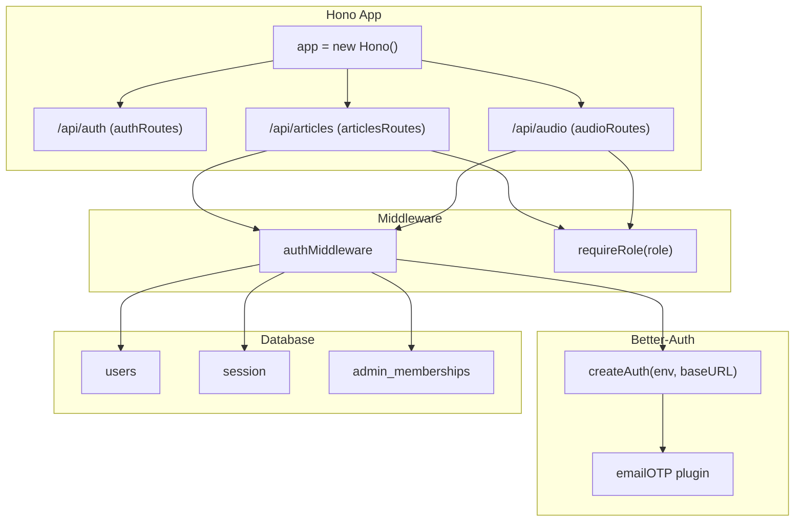
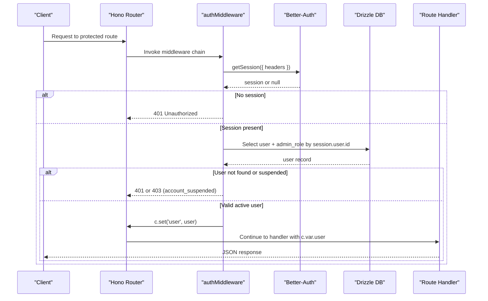
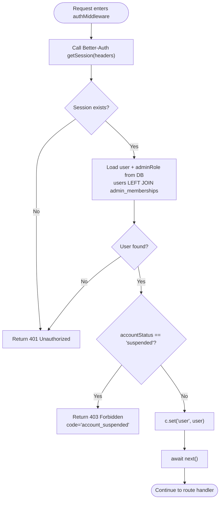
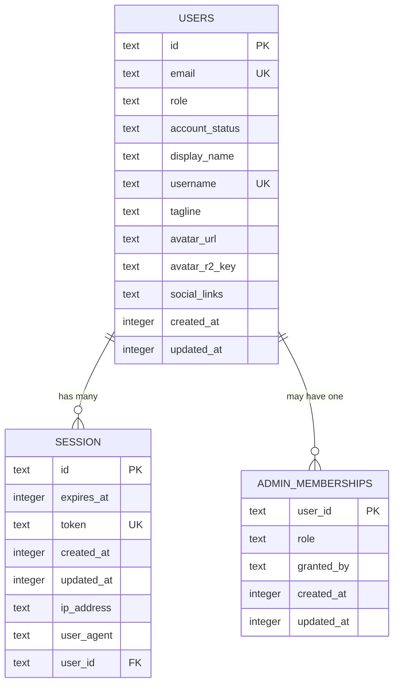
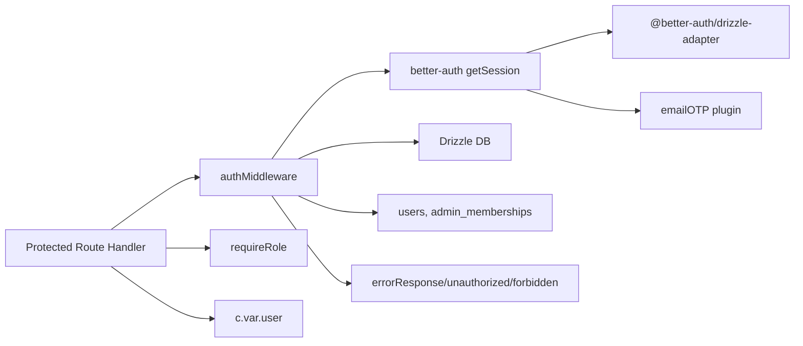

# Authentication Middleware

<cite>
**Referenced Files in This Document**
- [src/worker/middleware/auth.ts](file://src/worker/middleware/auth.ts)
- [src/worker/lib/auth.ts](file://src/worker/lib/auth.ts)
- [src/worker/routes/auth.ts](file://src/worker/routes/auth.ts)
- [src/worker/db/schema.ts](file://src/worker/db/schema.ts)
- [src/worker/index.ts](file://src/worker/index.ts)
- [src/worker/lib/http.ts](file://src/worker/lib/http.ts)
</cite>

## Table of Contents
1. [Introduction](#introduction)
2. [Project Structure](#project-structure)
3. [Core Components](#core-components)
4. [Architecture Overview](#architecture-overview)
5. [Detailed Component Analysis](#detailed-component-analysis)
6. [Dependency Analysis](#dependency-analysis)
7. [Performance Considerations](#performance-considerations)
8. [Troubleshooting Guide](#troubleshooting-guide)
9. [Conclusion](#conclusion)

## Introduction
This document explains the authentication middleware implementation that integrates Better-Auth with Hono, manages sessions, and injects a typed user context into route handlers. It covers how authMiddleware validates sessions, retrieves user data from the database, enforces account status checks, and exposes role-based authorization helpers. It also documents the AuthenticatedUser type (including subscriber/creator roles and owner/moderator admin roles), and shows how to use the middleware within Hono’s request lifecycle.

## Project Structure
The authentication system spans several modules:
- Middleware layer for session validation and user context injection
- Better-Auth configuration and OTP plugin integration
- Route definitions using Hono, including protected endpoints
- Database schema defining users, sessions, and admin memberships
- Central app wiring that mounts routes under /api/*

**Diagram sources**
- [src/worker/index.ts:24-45](file://src/worker/index.ts#L24-L45)
- [src/worker/middleware/auth.ts:23-50](file://src/worker/middleware/auth.ts#L23-L50)
- [src/worker/lib/auth.ts:9-77](file://src/worker/lib/auth.ts#L9-L77)
- [src/worker/db/schema.ts:5-43](file://src/worker/db/schema.ts#L5-L43)
- [src/worker/db/schema.ts:108-124](file://src/worker/db/schema.ts#L108-L124)

**Section sources**
- [src/worker/index.ts:24-45](file://src/worker/index.ts#L24-L45)
- [src/worker/middleware/auth.ts:23-50](file://src/worker/middleware/auth.ts#L23-L50)
- [src/worker/lib/auth.ts:9-77](file://src/worker/lib/auth.ts#L9-L77)
- [src/worker/db/schema.ts:5-43](file://src/worker/db/schema.ts#L5-L43)
- [src/worker/db/schema.ts:108-124](file://src/worker/db/schema.ts#L108-L124)

## Core Components
- authMiddleware: Validates Better-Auth sessions, loads user + admin role from DB, checks account status, and sets c.var.user for downstream handlers.
- requireRole: Role-gated middleware ensuring the authenticated user has the required role (subscriber or creator).
- createAuth: Configures Better-Auth with Drizzle adapter, email OTP plugin, and additional user fields.
- HTTP utilities: Standardized error responses (unauthorized, forbidden, etc.).

Key responsibilities:
- Session validation via Better-Auth API
- User enrichment with role and admin membership
- Account status enforcement (active vs suspended)
- Typed user context injection into Hono Context

**Section sources**
- [src/worker/middleware/auth.ts:8-56](file://src/worker/middleware/auth.ts#L8-L56)
- [src/worker/lib/auth.ts:9-77](file://src/worker/lib/auth.ts#L9-L77)
- [src/worker/lib/http.ts:49-55](file://src/worker/lib/http.ts#L49-L55)

## Architecture Overview
The middleware integrates with Hono’s request lifecycle by creating a typed environment (HonoEnv) where c.var.user is guaranteed after authMiddleware runs. Routes can then safely access c.var.user.id, c.var.user.role, and c.var.user.adminRole.

**Diagram sources**
- [src/worker/middleware/auth.ts:23-50](file://src/worker/middleware/auth.ts#L23-L50)
- [src/worker/lib/auth.ts:9-22](file://src/worker/lib/auth.ts#L9-L22)
- [src/worker/db/schema.ts:5-43](file://src/worker/db/schema.ts#L5-L43)
- [src/worker/db/schema.ts:108-124](file://src/worker/db/schema.ts#L108-L124)

## Detailed Component Analysis

### AuthenticatedUser Type and Hono Environment
- AuthenticatedUser includes:
  - id, email
  - role: 'subscriber' | 'creator'
  - accountStatus: 'active' | 'suspended'
  - adminRole: 'owner' | 'moderator' | null
- HonoEnv declares Bindings and Variables so c.var.user is strongly typed across the app.

Usage pattern:
- After authMiddleware, handlers read c.var.user directly without re-fetching identity.

**Section sources**
- [src/worker/middleware/auth.ts:8-21](file://src/worker/middleware/auth.ts#L8-L21)

### authMiddleware Implementation
Flow:
1. Create Better-Auth instance with current origin and env.
2. Call getSession using the incoming request headers to validate the session cookie/token.
3. If no session, return 401 unauthorized.
4. Query users and left join admin_memberships to get role and adminRole.
5. If user not found, return 401; if accountStatus is suspended, return 403 with code 'account_suspended'.
6. Set c.var.user and continue to next middleware/handler.

**Diagram sources**
- [src/worker/middleware/auth.ts:23-50](file://src/worker/middleware/auth.ts#L23-L50)

**Section sources**
- [src/worker/middleware/auth.ts:23-50](file://src/worker/middleware/auth.ts#L23-L50)
- [src/worker/lib/http.ts:49-55](file://src/worker/lib/http.ts#L49-L55)

### requireRole Middleware
- Factory function returning a middleware that checks c.var.user.role against the required role ('subscriber' | 'creator').
- If mismatch, returns 403 forbidden.

Usage examples in routes:
- POST /api/articles/: requires creator
- GET /api/audio/collections/mine: requires creator

**Section sources**
- [src/worker/middleware/auth.ts:52-56](file://src/worker/middleware/auth.ts#L52-L56)
- [src/worker/routes/articles.ts:215](file://src/worker/routes/articles.ts#L215)
- [src/worker/routes/audio.ts:480](file://src/worker/routes/audio.ts#L480)

### Better-Auth Integration and Session Management
- createAuth configures:
  - Drizzle adapter pointing to the project schema (with user mapped to users table)
  - Email OTP plugin for sign-in flows
  - Additional user fields (role defaults to 'subscriber', username, tagline, avatarR2Key, socialLinks)
- Sessions are stored in the session table and validated via getSession.

Integration points:
- Routes call createAuth with env and origin to reuse the same configuration.
- The auth routes proxy some native Better-Auth endpoints while blocking certain paths.

**Section sources**
- [src/worker/lib/auth.ts:9-77](file://src/worker/lib/auth.ts#L9-L77)
- [src/worker/db/schema.ts:108-124](file://src/worker/db/schema.ts#L108-L124)
- [src/worker/routes/auth.ts:253-258](file://src/worker/routes/auth.ts#L253-L258)

### Hono Request Lifecycle Integration
- The app is created with Hono<HonoEnv>, enabling typed variables.
- Routes are mounted under /api/* and apply middleware per-route or group-level.
- Protected routes typically chain authMiddleware and optionally requireRole before the handler.

Example patterns:
- GET /api/auth/me uses authMiddleware to fetch full profile for the authenticated user.
- POST /api/articles uses authMiddleware + requireRole('creator') to enforce creator-only creation.

**Section sources**
- [src/worker/index.ts:24-45](file://src/worker/index.ts#L24-L45)
- [src/worker/routes/auth.ts:224-249](file://src/worker/routes/auth.ts#L224-L249)
- [src/worker/routes/articles.ts:215](file://src/worker/routes/articles.ts#L215)

### Data Model Relationships Relevant to Auth
- users: stores identity, role, accountStatus, and profile fields.
- session: Better-Auth session records linked to users.
- admin_memberships: optional admin roles (owner, moderator) per user.

**Diagram sources**
- [src/worker/db/schema.ts:5-32](file://src/worker/db/schema.ts#L5-L32)
- [src/worker/db/schema.ts:108-124](file://src/worker/db/schema.ts#L108-L124)
- [src/worker/db/schema.ts:35-43](file://src/worker/db/schema.ts#L35-L43)

## Dependency Analysis
- authMiddleware depends on:
  - Hono createMiddleware for middleware composition
  - Better-Auth getSession for session validation
  - Drizzle client for DB queries
  - Schema tables users and admin_memberships
  - HTTP utilities for standardized error responses

- createAuth depends on:
  - Drizzle adapter for DB connectivity
  - emailOTP plugin for OTP flows
  - Env bindings (e.g., BETTER_AUTH_SECRET)

- Routes depend on:
  - authMiddleware and requireRole for protection
  - c.var.user for identity and permissions

**Diagram sources**
- [src/worker/middleware/auth.ts:23-50](file://src/worker/middleware/auth.ts#L23-L50)
- [src/worker/lib/auth.ts:9-22](file://src/worker/lib/auth.ts#L9-L22)
- [src/worker/lib/http.ts:23-33](file://src/worker/lib/http.ts#L23-L33)

**Section sources**
- [src/worker/middleware/auth.ts:23-56](file://src/worker/middleware/auth.ts#L23-L56)
- [src/worker/lib/auth.ts:9-77](file://src/worker/lib/auth.ts#L9-L77)
- [src/worker/lib/http.ts:23-33](file://src/worker/lib/http.ts#L23-L33)

## Performance Considerations
- Single DB query per protected request: The middleware performs one select with a left join to load both user and admin role. Ensure indexes exist on foreign keys and frequently filtered columns (e.g., users.id, admin_memberships.userId).
- Avoid redundant lookups: Handlers should rely on c.var.user instead of re-querying identity.
- Session validation overhead: getSession reads cookies/headers and validates tokens; keep requests minimal and avoid unnecessary network calls inside protected handlers.

[No sources needed since this section provides general guidance]

## Troubleshooting Guide
Common issues and resolutions:
- 401 Unauthorized:
  - Missing or invalid session cookie/token. Verify Better-Auth secret and cookie propagation.
  - User record missing in DB despite valid session. Re-sync or fix migration state.
- 403 Forbidden:
  - Insufficient role: ensure the user’s role matches the required role (subscriber vs creator).
  - Suspended account: check users.accountStatus; unsuspend or adjust policy.
- Admin role not visible:
  - admin_memberships may be null; verify admin assignment.

Useful utilities:
- unauthorized(c): returns 401 with standard error body.
- forbidden(c): returns 403 with standard error body.
- errorResponse(c, status, code, message): custom error payloads.

**Section sources**
- [src/worker/lib/http.ts:49-55](file://src/worker/lib/http.ts#L49-L55)
- [src/worker/middleware/auth.ts:43-46](file://src/worker/middleware/auth.ts#L43-L46)

## Conclusion
The authentication middleware provides a robust, typed foundation for securing Hono routes. By combining Better-Auth session validation, Drizzle-based user enrichment, and role-based guards, it ensures consistent security policies across the application. Developers can confidently protect endpoints by chaining authMiddleware and requireRole, while leveraging c.var.user for efficient, safe access to identity and permissions.

[No sources needed since this section summarizes without analyzing specific files]