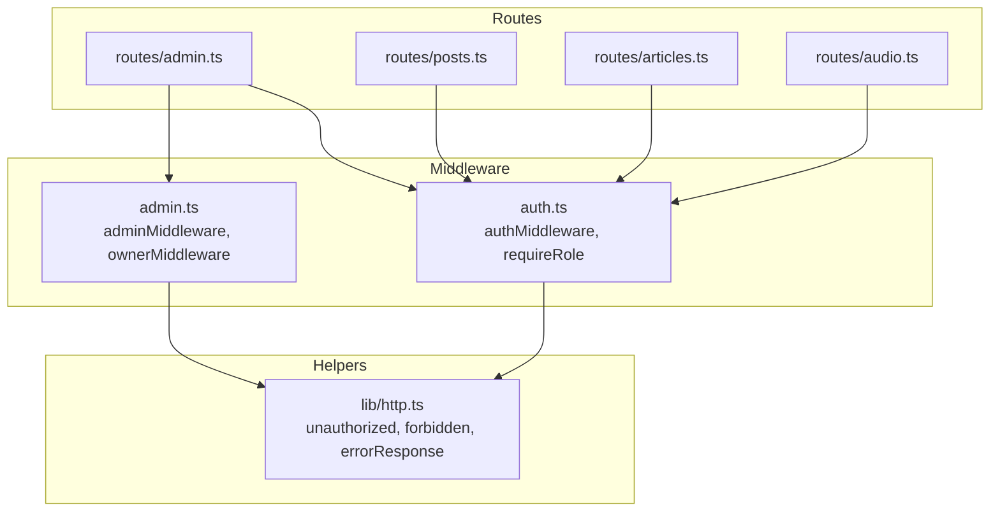
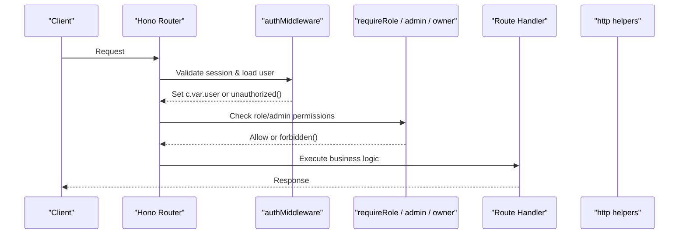
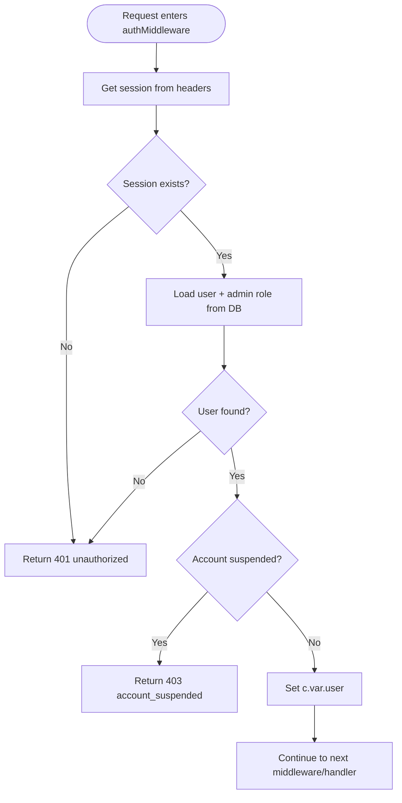
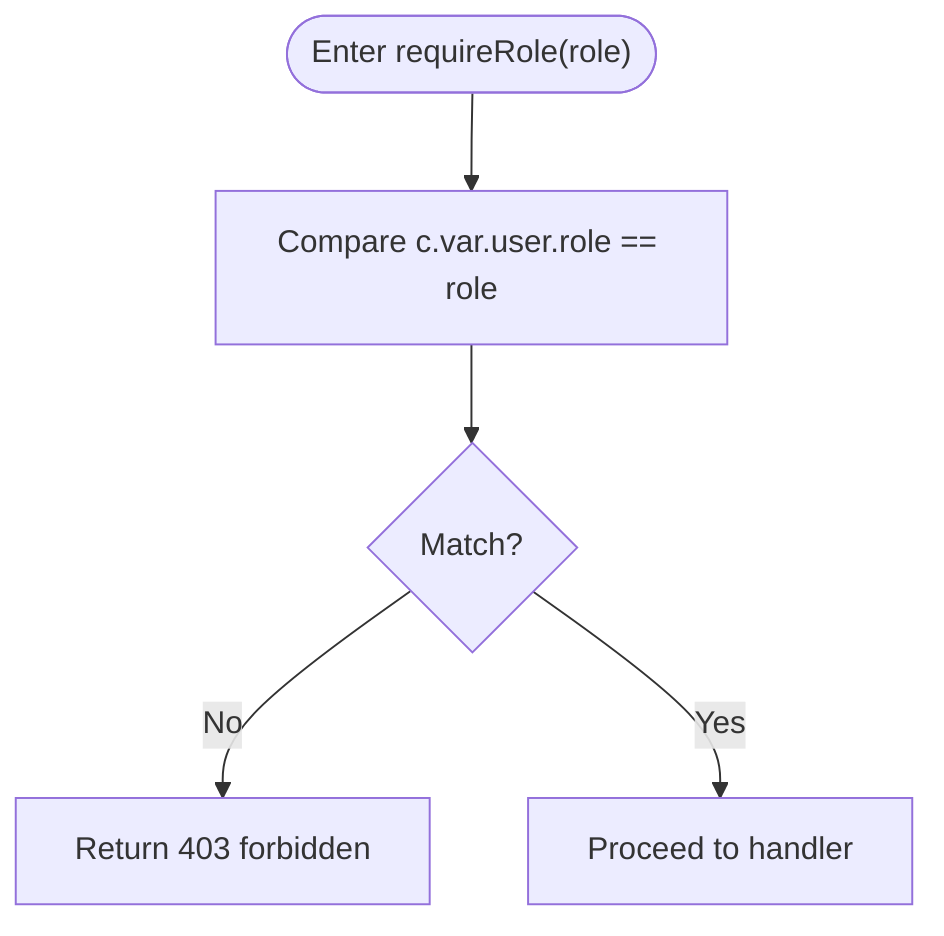
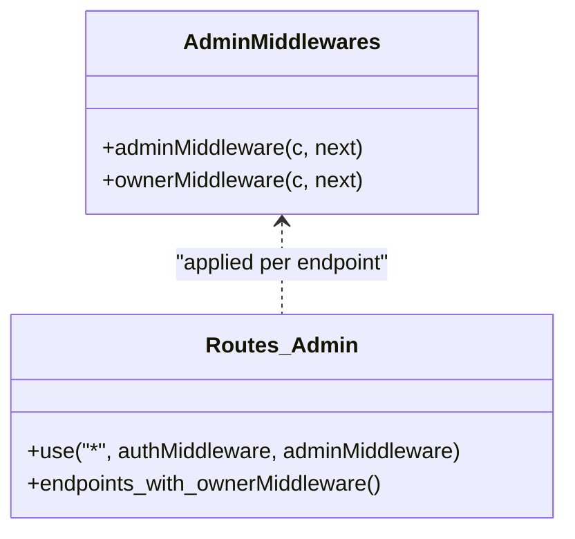
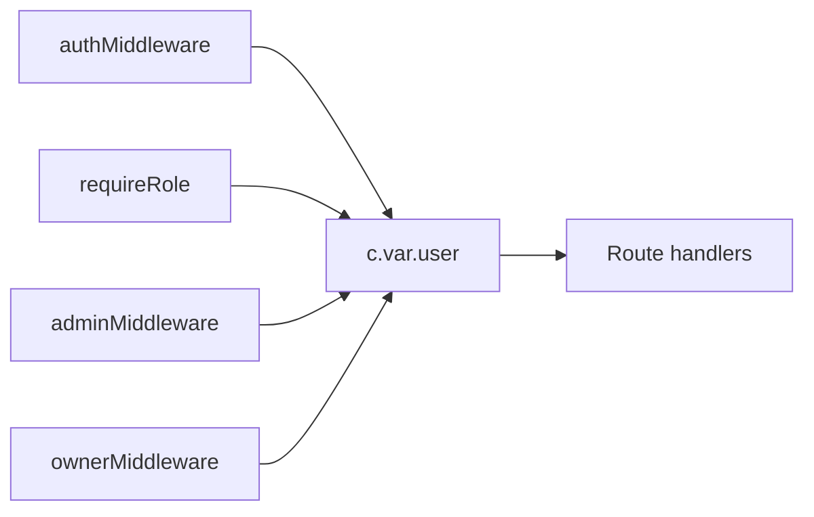

# Authorization Middleware

<cite>
**Referenced Files in This Document**
- [auth.ts](file://src/worker/middleware/auth.ts)
- [admin.ts](file://src/worker/middleware/admin.ts)
- [http.ts](file://src/worker/lib/http.ts)
- [admin.ts](file://src/worker/routes/admin.ts)
- [posts.ts](file://src/worker/routes/posts.ts)
- [articles.ts](file://src/worker/routes/articles.ts)
- [audio.ts](file://src/worker/routes/audio.ts)
</cite>

## Table of Contents
1. [Introduction](#introduction)
2. [Project Structure](#project-structure)
3. [Core Components](#core-components)
4. [Architecture Overview](#architecture-overview)
5. [Detailed Component Analysis](#detailed-component-analysis)
6. [Dependency Analysis](#dependency-analysis)
7. [Performance Considerations](#performance-considerations)
8. [Troubleshooting Guide](#troubleshooting-guide)
9. [Conclusion](#conclusion)

## Introduction
This document explains the authorization middleware system used to enforce role-based access control and admin permissions across API routes. It focuses on:
- The requireRole function for subscriber vs creator enforcement
- Admin authorization patterns including owner and moderator checks
- Integration with authenticated user context to validate permissions before allowing access
- Examples of protecting endpoints and handling permission denials with consistent error responses

## Project Structure
The authorization logic is implemented as Hono middleware and applied at route boundaries:
- Authentication and role middleware live under src/worker/middleware
- Admin-specific middleware lives under src/worker/middleware/admin.ts
- Route files apply these middlewares to protect endpoints
- Error helpers are centralized under src/worker/lib/http.ts

**Diagram sources**
- [auth.ts:1-57](file://src/worker/middleware/auth.ts#L1-L57)
- [admin.ts:1-14](file://src/worker/middleware/admin.ts#L1-L14)
- [http.ts:1-80](file://src/worker/lib/http.ts#L1-L80)
- [admin.ts:85-86](file://src/worker/routes/admin.ts#L85-L86)
- [posts.ts:23-23](file://src/worker/routes/posts.ts#L23-L23)
- [articles.ts:5-5](file://src/worker/routes/articles.ts#L5-L5)
- [audio.ts:5-5](file://src/worker/routes/audio.ts#L5-L5)

**Section sources**
- [auth.ts:1-57](file://src/worker/middleware/auth.ts#L1-L57)
- [admin.ts:1-14](file://src/worker/middleware/admin.ts#L1-L14)
- [http.ts:1-80](file://src/worker/lib/http.ts#L1-L80)
- [admin.ts:85-86](file://src/worker/routes/admin.ts#L85-L86)
- [posts.ts:23-23](file://src/worker/routes/posts.ts#L23-L23)
- [articles.ts:5-5](file://src/worker/routes/articles.ts#L5-L5)
- [audio.ts:5-5](file://src/worker/routes/audio.ts#L5-L5)

## Core Components
- authMiddleware: Validates session, loads user with role and admin role, sets c.var.user, and blocks suspended accounts.
- requireRole(role): Enforces that the authenticated user’s role matches the required role (subscriber or creator).
- adminMiddleware: Ensures the user has any admin role.
- ownerMiddleware: Ensures the user has the owner admin role.
- http helpers: Provide standardized error responses (unauthorized, forbidden, etc.).

Key behaviors:
- Unauthorized requests return a 401 with an 'unauthorized' code.
- Forbidden requests return a 403 with a 'forbidden' code and optional message.
- Suspended accounts receive a 403 with an 'account_suspended' code.

**Section sources**
- [auth.ts:23-50](file://src/worker/middleware/auth.ts#L23-L50)
- [auth.ts:52-56](file://src/worker/middleware/auth.ts#L52-L56)
- [admin.ts:5-13](file://src/worker/middleware/admin.ts#L5-L13)
- [http.ts:49-55](file://src/worker/lib/http.ts#L49-L55)

## Architecture Overview
The middleware pipeline ensures authentication first, then role checks, and finally admin-level checks where applicable.

**Diagram sources**
- [auth.ts:23-50](file://src/worker/middleware/auth.ts#L23-L50)
- [auth.ts:52-56](file://src/worker/middleware/auth.ts#L52-L56)
- [admin.ts:5-13](file://src/worker/middleware/admin.ts#L5-L13)
- [http.ts:49-55](file://src/worker/lib/http.ts#L49-L55)

## Detailed Component Analysis

### Authentication and User Context
- Session validation: Uses the auth library to fetch the current session from request headers.
- User loading: Queries users and left-joins admin_memberships to obtain role and adminRole.
- Context injection: Sets c.var.user with id, email, role, accountStatus, and adminRole.
- Suspension check: Returns a specific error for suspended accounts.

**Diagram sources**
- [auth.ts:23-50](file://src/worker/middleware/auth.ts#L23-L50)
- [http.ts:49-55](file://src/worker/lib/http.ts#L49-L55)

**Section sources**
- [auth.ts:23-50](file://src/worker/middleware/auth.ts#L23-L50)

### Role-Based Access Control: requireRole
- Purpose: Restrict endpoints to specific roles (subscriber or creator).
- Enforcement: Compares c.var.user.role against the required role; denies with 403 if mismatched.
- Typical usage: Applied after authMiddleware on write endpoints for creators.

Examples of protected endpoints using requireRole:
- Creator-only article creation and updates
- Creator-only audio collection listing
- Creator-only post management endpoints

**Diagram sources**
- [auth.ts:52-56](file://src/worker/middleware/auth.ts#L52-L56)

**Section sources**
- [auth.ts:52-56](file://src/worker/middleware/auth.ts#L52-L56)
- [articles.ts:214-214](file://src/worker/routes/articles.ts#L214-L214)
- [articles.ts:261-261](file://src/worker/routes/articles.ts#L261-L261)
- [audio.ts:479-479](file://src/worker/routes/audio.ts#L479-L479)
- [posts.ts:399-399](file://src/worker/routes/posts.ts#L399-L399)

### Admin Authorization Patterns
- adminMiddleware: Requires any admin role (owner or moderator).
- ownerMiddleware: Requires the owner role specifically.
- Usage pattern: Global application on admin routes via router.use('*', authMiddleware, adminMiddleware), then additional ownerMiddleware on sensitive endpoints.

**Diagram sources**
- [admin.ts:5-13](file://src/worker/middleware/admin.ts#L5-L13)
- [admin.ts:85-86](file://src/worker/routes/admin.ts#L85-L86)

**Section sources**
- [admin.ts:5-13](file://src/worker/middleware/admin.ts#L5-L13)
- [admin.ts:85-86](file://src/worker/routes/admin.ts#L85-L86)

### Permission Denial Handling
All denials use centralized helpers to ensure consistent response shapes and status codes:
- unauthorized(): 401 with code 'unauthorized'
- forbidden(): 403 with code 'forbidden'
- errorResponse(): Customizable JSON error body with code, message, and optional details

Common denial scenarios:
- Missing or invalid session -> 401 unauthorized
- Wrong role for endpoint -> 403 forbidden
- Suspended account -> 403 account_suspended
- Non-owner attempting owner-only action -> 403 forbidden with explicit message

**Section sources**
- [http.ts:49-55](file://src/worker/lib/http.ts#L49-L55)
- [auth.ts:44-46](file://src/worker/middleware/auth.ts#L44-L46)

## Dependency Analysis
- Middleware dependencies:
  - authMiddleware depends on the auth library and database client to resolve user context.
  - requireRole depends only on c.var.user set by authMiddleware.
  - admin and owner middlewares depend on c.var.user.adminRole.
- Route integration:
  - Admin routes apply authMiddleware and adminMiddleware globally, then layer ownerMiddleware for privileged actions.
  - Content routes (posts, articles, audio) apply authMiddleware and requireRole('creator') for write operations.

**Diagram sources**
- [auth.ts:23-50](file://src/worker/middleware/auth.ts#L23-L50)
- [auth.ts:52-56](file://src/worker/middleware/auth.ts#L52-L56)
- [admin.ts:5-13](file://src/worker/middleware/admin.ts#L5-L13)

**Section sources**
- [auth.ts:23-50](file://src/worker/middleware/auth.ts#L23-L50)
- [auth.ts:52-56](file://src/worker/middleware/auth.ts#L52-L56)
- [admin.ts:5-13](file://src/worker/middleware/admin.ts#L5-L13)
- [admin.ts:85-86](file://src/worker/routes/admin.ts#L85-L86)
- [posts.ts:23-23](file://src/worker/routes/posts.ts#L23-L23)
- [articles.ts:5-5](file://src/worker/routes/articles.ts#L5-L5)
- [audio.ts:5-5](file://src/worker/routes/audio.ts#L5-L5)

## Performance Considerations
- Database queries: authMiddleware performs one join query per request; consider caching user context when appropriate.
- Middleware order: Keep authMiddleware first to avoid unnecessary processing for unauthenticated requests.
- Error responses: Centralized helpers minimize overhead and ensure consistent payloads.

[No sources needed since this section provides general guidance]

## Troubleshooting Guide
Common issues and resolutions:
- 401 Unauthorized:
  - Cause: Missing or invalid session.
  - Fix: Ensure cookies/headers include valid session tokens.
- 403 Forbidden:
  - Cause: Insufficient role (e.g., subscriber accessing creator-only endpoint) or missing admin role.
  - Fix: Verify user role and admin membership; apply correct middleware chain.
- 403 Account Suspended:
  - Cause: User account is suspended.
  - Fix: Restore account via admin flows or inform the user.

Use the centralized error helpers to standardize responses and debug messages.

**Section sources**
- [http.ts:49-55](file://src/worker/lib/http.ts#L49-L55)
- [auth.ts:44-46](file://src/worker/middleware/auth.ts#L44-L46)

## Conclusion
The authorization middleware system enforces clear separation between authentication, role-based access, and admin privileges:
- authMiddleware establishes identity and injects user context
- requireRole restricts endpoints by user role (subscriber vs creator)
- adminMiddleware and ownerMiddleware gate administrative functionality
- Consistent error responses simplify client-side handling and debugging

Adopting this pattern ensures secure, maintainable, and predictable access control across all API endpoints.