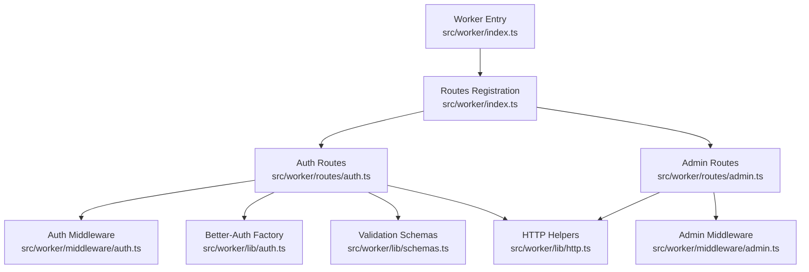
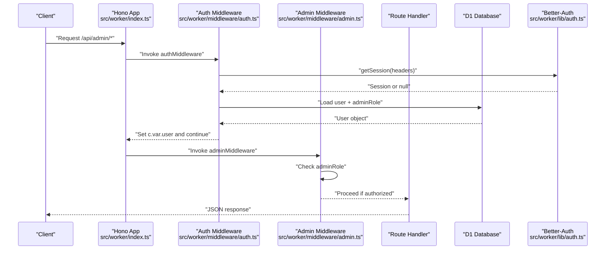
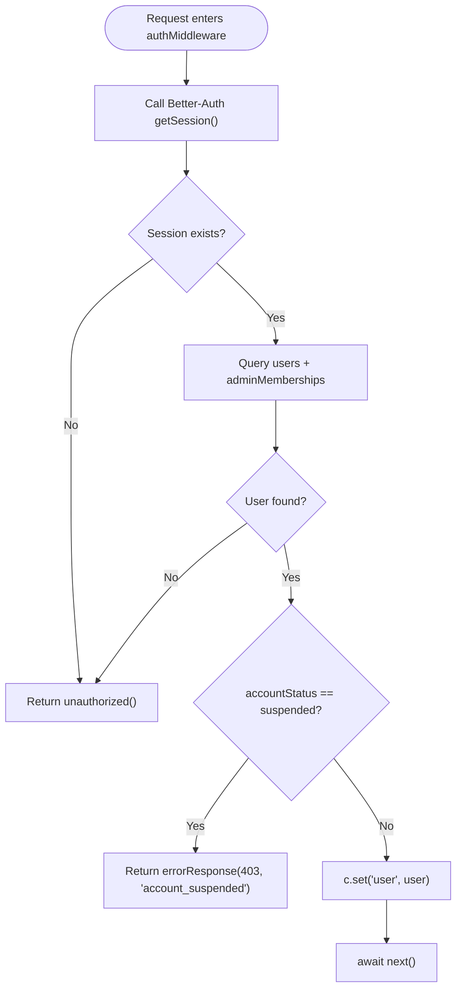
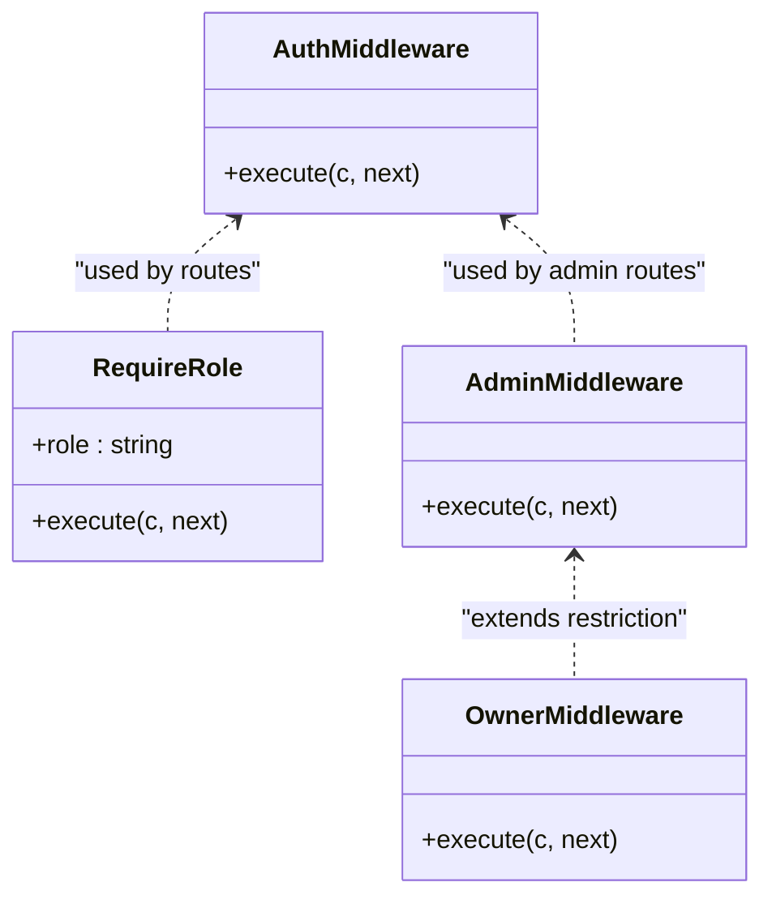
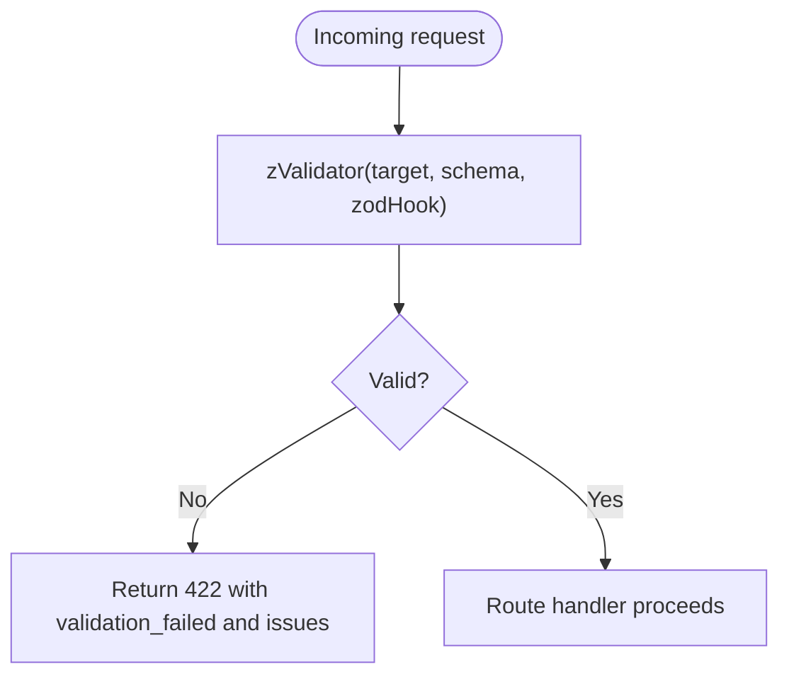
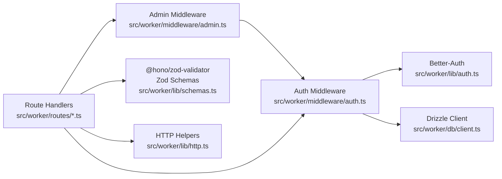

# Middleware Pipeline

<cite>
**Referenced Files in This Document**
- [index.ts](file://src/worker/index.ts)
- [auth.ts](file://src/worker/middleware/auth.ts)
- [admin.ts](file://src/worker/middleware/admin.ts)
- [auth.ts](file://src/worker/lib/auth.ts)
- [auth.ts](file://src/worker/routes/auth.ts)
- [http.ts](file://src/worker/lib/http.ts)
- [schemas.ts](file://src/worker/lib/schemas.ts)
- [admin.ts](file://src/worker/routes/admin.ts)
- [wrangler.json](file://wrangler.json)
</cite>

## Table of Contents
1. [Introduction](#introduction)
2. [Project Structure](#project-structure)
3. [Core Components](#core-components)
4. [Architecture Overview](#architecture-overview)
5. [Detailed Component Analysis](#detailed-component-analysis)
6. [Dependency Analysis](#dependency-analysis)
7. [Performance Considerations](#performance-considerations)
8. [Troubleshooting Guide](#troubleshooting-guide)
9. [Conclusion](#conclusion)
10. [Appendices](#appendices)

## Introduction
This document explains the middleware pipeline architecture for the Worker-based API, focusing on:
- Authentication middleware using Better-Auth integration and session management
- User context injection into request handlers
- Authorization middleware for role-based access control (RBAC) and admin permissions
- Request validation middleware with input sanitization and schema validation
- CORS configuration and security headers considerations
- Rate limiting implementation and request logging patterns
- Guidelines for developing custom middleware and testing strategies

The goal is to provide both a high-level understanding and code-level details so that developers can extend or modify the pipeline safely and effectively.

## Project Structure
At runtime, the Hono application wires routes and global error handling. Middleware is applied per-route or globally via route groups. The authentication flow integrates with Better-Auth through a factory function that configures the adapter and OTP plugin. Validation uses Zod schemas with a Hono validator.

**Diagram sources**
- [index.ts:1-71](file://src/worker/index.ts#L1-L71)
- [auth.ts:1-259](file://src/worker/routes/auth.ts#L1-L259)
- [admin.ts:1-200](file://src/worker/routes/admin.ts#L1-L200)
- [auth.ts:1-57](file://src/worker/middleware/auth.ts#L1-L57)
- [admin.ts:1-14](file://src/worker/middleware/admin.ts#L1-L14)
- [auth.ts:1-80](file://src/worker/lib/auth.ts#L1-L80)
- [schemas.ts:1-221](file://src/worker/lib/schemas.ts#L1-L221)
- [http.ts:1-80](file://src/worker/lib/http.ts#L1-L80)

**Section sources**
- [index.ts:1-71](file://src/worker/index.ts#L1-L71)

## Core Components
- Authentication middleware: Validates sessions via Better-Auth, enriches context with user data, and enforces account status checks.
- Authorization middleware: Enforces role-based access (subscriber vs creator) and admin roles (owner/moderator).
- Validation middleware: Uses @hono/zod-validator with Zod schemas to sanitize and validate inputs; returns standardized errors.
- HTTP helpers: Provide consistent error responses and a Zod hook for validation failures.
- Better-Auth integration: Configures Drizzle adapter, email OTP plugin, and user fields mapping.

Key responsibilities:
- Session verification and user context injection
- RBAC enforcement at route level
- Input validation and sanitization
- Consistent error envelope across endpoints

**Section sources**
- [auth.ts:1-57](file://src/worker/middleware/auth.ts#L1-L57)
- [admin.ts:1-14](file://src/worker/middleware/admin.ts#L1-L14)
- [auth.ts:1-259](file://src/worker/routes/auth.ts#L1-L259)
- [http.ts:1-80](file://src/worker/lib/http.ts#L1-L80)
- [auth.ts:1-80](file://src/worker/lib/auth.ts#L1-L80)
- [schemas.ts:1-221](file://src/worker/lib/schemas.ts#L1-L221)

## Architecture Overview
The middleware pipeline follows a layered approach:
- Global app setup registers all route groups.
- Route groups apply middleware chains (e.g., auth + admin).
- Handlers receive typed context variables (user) and validated payloads.

**Diagram sources**
- [index.ts:1-71](file://src/worker/index.ts#L1-L71)
- [auth.ts:1-57](file://src/worker/middleware/auth.ts#L1-L57)
- [admin.ts:1-14](file://src/worker/middleware/admin.ts#L1-L14)
- [auth.ts:1-80](file://src/worker/lib/auth.ts#L1-L80)

## Detailed Component Analysis

### Authentication Middleware and Better-Auth Integration
- Session retrieval: The middleware calls Better-Auth’s getSession using request headers to obtain the current session.
- User enrichment: It queries the database to fetch user details including role and accountStatus, and joins admin memberships to determine adminRole.
- Context injection: On success, it sets c.set('user', user) for downstream handlers.
- Account status enforcement: Suspended accounts receive a specific error response.
- Better-Auth factory: Creates an instance configured with Drizzle adapter, email OTP plugin, and user field mappings.

**Diagram sources**
- [auth.ts:1-57](file://src/worker/middleware/auth.ts#L1-L57)
- [auth.ts:1-80](file://src/worker/lib/auth.ts#L1-L80)

**Section sources**
- [auth.ts:1-57](file://src/worker/middleware/auth.ts#L1-L57)
- [auth.ts:1-80](file://src/worker/lib/auth.ts#L1-L80)

### Authorization Middleware (RBAC and Admin Permissions)
- Role-based access: requireRole ensures the authenticated user has the required role (subscriber or creator).
- Admin permissions: adminMiddleware requires any adminRole; ownerMiddleware restricts to owner only.
- Usage pattern: Applied after authMiddleware to enforce policy before handler logic.

**Diagram sources**
- [auth.ts:1-57](file://src/worker/middleware/auth.ts#L1-L57)
- [admin.ts:1-14](file://src/worker/middleware/admin.ts#L1-L14)

**Section sources**
- [auth.ts:1-57](file://src/worker/middleware/auth.ts#L1-L57)
- [admin.ts:1-14](file://src/worker/middleware/admin.ts#L1-L14)

### Request Validation Middleware and Schema Definitions
- Validation strategy: Use @hono/zod-validator with Zod schemas to parse and validate JSON, params, and other targets.
- Error handling: The zodHook converts validation failures into a standardized 422 response with issues.
- Common schemas: Email, OTP, post creation, profile settings, and more are defined centrally for reuse.

**Diagram sources**
- [http.ts:1-80](file://src/worker/lib/http.ts#L1-L80)
- [schemas.ts:1-221](file://src/worker/lib/schemas.ts#L1-L221)

**Section sources**
- [http.ts:1-80](file://src/worker/lib/http.ts#L1-L80)
- [schemas.ts:1-221](file://src/worker/lib/schemas.ts#L1-L221)

### CORS Configuration and Security Headers
- Current state: No explicit CORS or security header middleware is present in the analyzed files.
- Recommendations:
  - Add a CORS middleware to allow cross-origin requests from trusted origins.
  - Apply security headers such as Content-Security-Policy, X-Content-Type-Options, X-Frame-Options, and Referrer-Policy.
  - Ensure cookies used by Better-Auth are configured with Secure, HttpOnly, and SameSite attributes where appropriate.

[No sources needed since this section provides general guidance]

### Rate Limiting Implementation and Request Logging Patterns
- Current state: No rate limiting middleware is implemented in the analyzed files.
- Recommendations:
  - Implement per-IP or per-user rate limiting using Cloudflare Workers KV or a dedicated service binding.
  - Integrate structured logging for request lifecycle (method, path, user id when available, latency, status).
  - Use Cloudflare Observability features enabled in wrangler.json for invocation logs and traces.

[No sources needed since this section provides general guidance]

### Custom Middleware Development Guidelines
- Pattern: Use createMiddleware from hono/factory to define reusable logic.
- Type safety: Define HonoEnv with Variables to type c.var (e.g., user).
- Early exits: Return standardized error responses for unauthorized/forbidden cases.
- Composition: Chain multiple middlewares (auth -> role -> validation -> handler).

Example usage patterns:
- Authentication: Verify session and inject user context.
- Authorization: Check roles or admin membership.
- Validation: Parse and sanitize inputs using Zod schemas.
- Logging: Record request metadata and outcomes.

**Section sources**
- [auth.ts:1-57](file://src/worker/middleware/auth.ts#L1-L57)
- [admin.ts:1-14](file://src/worker/middleware/admin.ts#L1-L14)
- [http.ts:1-80](file://src/worker/lib/http.ts#L1-L80)

### Testing Strategies for Middleware Components
- Unit tests: Validate middleware behavior (unauthorized, forbidden, validation failures) using Hono test utilities.
- Integration tests: Simulate end-to-end flows like OTP sign-in and protected endpoint access.
- Cookie handling: Extract Set-Cookie headers correctly for subsequent requests.
- Assertions: Confirm status codes, error envelopes, and presence of user context in handlers.

**Section sources**
- [http.test.ts:1-42](file://src/worker/lib/http.test.ts#L1-L42)
- [auth.integration.test.ts:28-63](file://src/worker/routes/auth.integration.test.ts#L28-L63)

## Dependency Analysis
The middleware components depend on:
- Hono framework for routing and middleware composition
- Better-Auth for session management and OTP flows
- Drizzle ORM for database queries
- Zod for schema validation
- Standardized HTTP helpers for consistent error responses

**Diagram sources**
- [auth.ts:1-57](file://src/worker/middleware/auth.ts#L1-L57)
- [admin.ts:1-14](file://src/worker/middleware/admin.ts#L1-L14)
- [auth.ts:1-80](file://src/worker/lib/auth.ts#L1-L80)
- [schemas.ts:1-221](file://src/worker/lib/schemas.ts#L1-L221)
- [http.ts:1-80](file://src/worker/lib/http.ts#L1-L80)

**Section sources**
- [index.ts:1-71](file://src/worker/index.ts#L1-L71)

## Performance Considerations
- Minimize database queries in middleware: Cache frequently accessed user data where possible.
- Avoid heavy computations in request path; offload to scheduled tasks.
- Use efficient queries and indexes in Drizzle models.
- Enable observability for tracing and head sampling to identify bottlenecks.

[No sources needed since this section provides general guidance]

## Troubleshooting Guide
Common issues and resolutions:
- Unauthorized responses: Ensure session cookies are included in requests and origin matches trustedOrigins.
- Forbidden responses: Verify user role and adminRole assignments.
- Validation failures: Inspect Zod schema definitions and ensure payloads match expected structure.
- Suspended accounts: Handle account_status changes and communicate clearly to clients.

Use standardized error responses to debug client-side issues and log detailed messages server-side.

**Section sources**
- [http.ts:1-80](file://src/worker/lib/http.ts#L1-L80)
- [auth.ts:1-57](file://src/worker/middleware/auth.ts#L1-L57)

## Conclusion
The middleware pipeline combines authentication, authorization, validation, and consistent error handling to secure and streamline API requests. By following the patterns outlined here, you can extend the system with new middleware, maintain strong security posture, and ensure reliable request processing.

[No sources needed since this section summarizes without analyzing specific files]

## Appendices

### Best Practices Summary
- Always apply authMiddleware before authorization and validation middlewares.
- Centralize schemas and validation rules to avoid duplication.
- Use standardized error responses for predictable client behavior.
- Leverage Cloudflare observability for monitoring and debugging.

[No sources needed since this section provides general guidance]