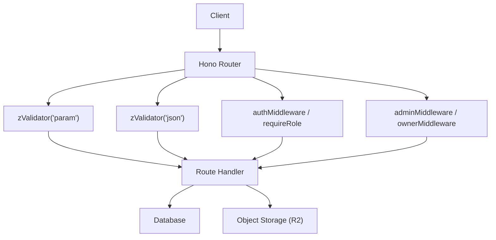
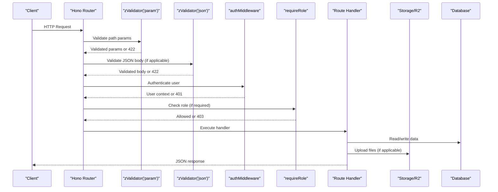
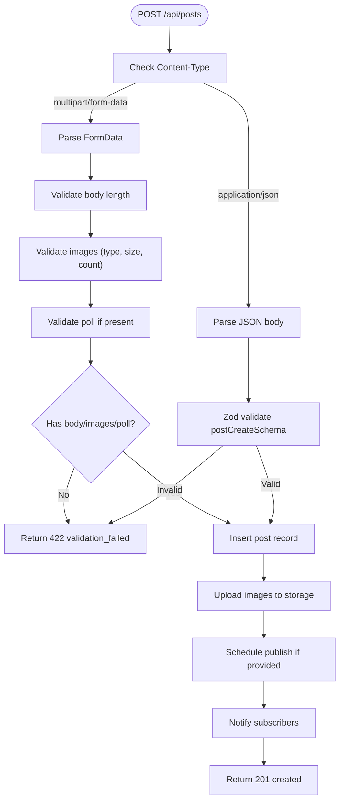
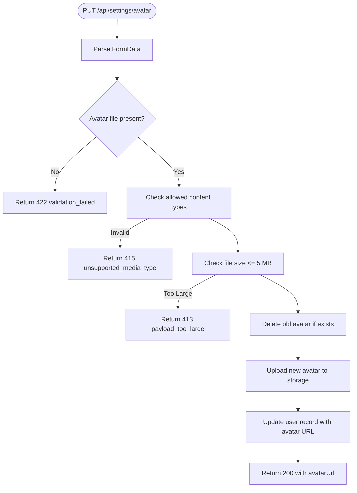
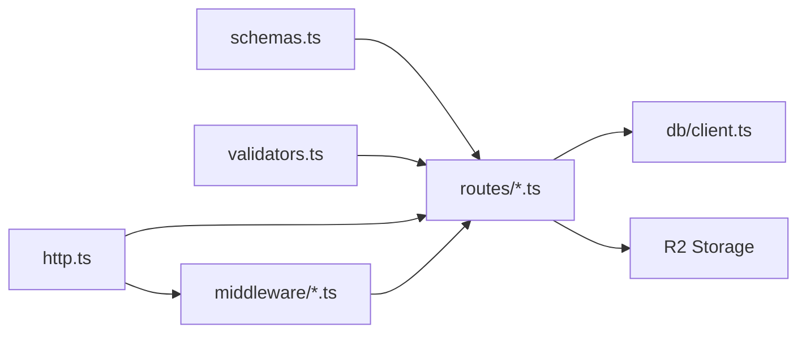

# Request Validation Middleware

<cite>
**Referenced Files in This Document**
- [validators.ts](file://src/worker/lib/validators.ts)
- [schemas.ts](file://src/worker/lib/schemas.ts)
- [http.ts](file://src/worker/lib/http.ts)
- [auth.ts](file://src/worker/middleware/auth.ts)
- [admin.ts](file://src/worker/middleware/admin.ts)
- [auth.ts](file://src/worker/routes/auth.ts)
- [posts.ts](file://src/worker/routes/posts.ts)
- [settings.ts](file://src/worker/routes/settings.ts)
- [profile.ts](file://src/worker/routes/profile.ts)
- [admin.ts](file://src/worker/routes/admin.ts)
</cite>

## Table of Contents
1. [Introduction](#introduction)
2. [Project Structure](#project-structure)
3. [Core Components](#core-components)
4. [Architecture Overview](#architecture-overview)
5. [Detailed Component Analysis](#detailed-component-analysis)
6. [Dependency Analysis](#dependency-analysis)
7. [Performance Considerations](#performance-considerations)
8. [Troubleshooting Guide](#troubleshooting-guide)
9. [Conclusion](#conclusion)

## Introduction
This document explains the request validation middleware patterns used across the worker API. It covers input sanitization, schema validation with Zod, parameter validation strategies, and common patterns for POST/PUT requests, query parameters, and file uploads. It also documents custom validators, error handling for invalid inputs, performance considerations, and security implications to prevent injection attacks.

## Project Structure
The validation system is centered around:
- Reusable Zod schemas for JSON payloads and route parameters
- Lightweight boolean validators for simple fields
- Hono middleware using @hono/zod-validator to validate incoming requests
- Centralized error responses and a Zod hook to convert validation failures into consistent HTTP errors
- Auth and admin middleware that gate access before business logic runs

**Diagram sources**
- [auth.ts:1-20](file://src/worker/routes/auth.ts#L1-L20)
- [posts.ts:1-60](file://src/worker/routes/posts.ts#L1-L60)
- [settings.ts:1-35](file://src/worker/routes/settings.ts#L1-L35)
- [auth.ts:1-57](file://src/worker/middleware/auth.ts#L1-L57)
- [admin.ts:1-14](file://src/worker/middleware/admin.ts#L1-L14)

**Section sources**
- [auth.ts:1-20](file://src/worker/routes/auth.ts#L1-L20)
- [posts.ts:1-60](file://src/worker/routes/posts.ts#L1-L60)
- [settings.ts:1-35](file://src/worker/routes/settings.ts#L1-L35)
- [auth.ts:1-57](file://src/worker/middleware/auth.ts#L1-L57)
- [admin.ts:1-14](file://src/worker/middleware/admin.ts#L1-L14)

## Core Components
- Zod schemas define strict contracts for JSON bodies and route parameters, including trimming, normalization, length limits, enums, and custom refinements.
- Boolean validators provide fast checks for email format, password length, username rules, and URL schemes.
- The Zod validator middleware integrates with Hono to parse and validate requests early in the pipeline.
- A shared Zod hook converts validation failures into standardized 422 responses with structured issues.
- Error helpers return consistent error shapes and status codes for bad requests, unauthorized, forbidden, not found, payload too large, unsupported media type, and server errors.

Key responsibilities:
- Input sanitization: trim, lowercase, normalize dates and URLs
- Schema validation: enforce types, lengths, formats, and domain-specific constraints
- Parameter validation: ensure required path/query params are present and well-formed
- File upload validation: check content type, size, and count
- Consistent error responses: uniform structure and codes for client consumption

**Section sources**
- [schemas.ts:1-221](file://src/worker/lib/schemas.ts#L1-L221)
- [validators.ts:1-94](file://src/worker/lib/validators.ts#L1-L94)
- [http.ts:1-80](file://src/worker/lib/http.ts#L1-L80)

## Architecture Overview
Validation occurs at multiple layers:
- Route-level middleware validates parameters and JSON bodies using Zod schemas
- Auth and role middleware ensures authenticated and authorized users before handlers execute
- Handlers perform additional business validation and interact with storage and database
- Errors are normalized via centralized helpers

**Diagram sources**
- [auth.ts:130-170](file://src/worker/routes/auth.ts#L130-L170)
- [posts.ts:419-542](file://src/worker/routes/posts.ts#L419-L542)
- [settings.ts:40-64](file://src/worker/routes/settings.ts#L40-L64)
- [auth.ts:23-50](file://src/worker/middleware/auth.ts#L23-L50)
- [admin.ts:5-13](file://src/worker/middleware/admin.ts#L5-L13)

## Detailed Component Analysis

### Zod Schemas and JSON Body Validation
- Email and OTP schemas enforce format, trimming, and digit constraints
- Post creation and reply schemas enforce length bounds and optional scheduling timestamps
- Profile settings schemas include complex validations like URL protocol checks and tab uniqueness
- Discriminated unions model mode-based payloads with strict field sets

Common patterns:
- Use .trim() and .toLowerCase() to normalize strings
- Enforce min/max lengths for text fields
- Use z.enum() for constrained values
- Apply superRefine for cross-field validation and custom error messages

**Section sources**
- [schemas.ts:1-221](file://src/worker/lib/schemas.ts#L1-L221)

### Boolean Validators and Custom Sanitization
- isValidEmail uses a strict regex to reject malformed addresses
- isValidPassword enforces minimum length
- isValidUsername applies allowed character sets and boundary rules
- isValidUrl and isValidHttpsUrl use URL parsing to restrict protocols

Use cases:
- Fast pre-checks before expensive operations
- Generating safe usernames from email local parts
- Ensuring external links are secure

**Section sources**
- [validators.ts:1-94](file://src/worker/lib/validators.ts#L1-L94)

### Parameter Validation Strategies
- Path parameters validated via zValidator('param', ...) with dedicated param schemas
- Examples include postId, username, slug, notificationId, attachmentId
- Ensures required identifiers exist and meet basic constraints

Benefits:
- Early failure on missing or malformed IDs
- Centralized validation rules for reuse across routes

**Section sources**
- [schemas.ts:30-54](file://src/worker/lib/schemas.ts#L30-L54)
- [profile.ts:22-40](file://src/worker/routes/profile.ts#L22-L40)
- [posts.ts:546-553](file://src/worker/routes/posts.ts#L546-L553)

### POST/PUT Request Patterns
- JSON endpoints validate bodies with Zod schemas and return structured 422 errors
- Multipart/form-data endpoints parse fields manually and apply explicit checks
- Scheduled publishing times are validated to be in the future with a minimum buffer
- Polls and attachments are parsed and validated with specific constraints

Examples:
- Creating posts with optional images and polls
- Updating drafts with attachment removal and image replacement
- Uploading avatars with strict content-type and size limits

**Section sources**
- [posts.ts:419-542](file://src/worker/routes/posts.ts#L419-L542)
- [posts.ts:555-623](file://src/worker/routes/posts.ts#L555-L623)
- [settings.ts:68-133](file://src/worker/routes/settings.ts#L68-L133)

### File Upload Validation
- Content-type whitelist enforced for images and avatars
- Size limits applied per file and total counts checked
- Unsupported media types return 415; oversized payloads return 413
- Uploaded files stored with deterministic keys and metadata recorded

Security considerations:
- Reject non-image types to prevent code execution via uploaded scripts
- Limit sizes to mitigate resource exhaustion
- Store files outside web-accessible paths when possible

**Section sources**
- [posts.ts:121-140](file://src/worker/routes/posts.ts#L121-L140)
- [settings.ts:84-95](file://src/worker/routes/settings.ts#L84-L95)

### Query Parameter Handling
- Pagination parameters parsed with bounds checking to prevent excessive loads
- Search terms sanitized by wrapping with SQL LIKE wildcards after trimming
- Enum-like filters validated implicitly by usage patterns

Best practices:
- Clamp numeric ranges to reasonable defaults
- Trim and sanitize search inputs
- Avoid passing untrusted values directly into queries without binding

**Section sources**
- [admin.ts:64-68](file://src/worker/routes/admin.ts#L64-L68)

### Authentication and Authorization Middleware
- authMiddleware extracts session, loads user details, and rejects suspended accounts
- requireRole enforces role-based access control for creator-only endpoints
- adminMiddleware and ownerMiddleware restrict administrative actions

Flow:
- Session verification against auth provider
- Database lookup for account status and roles
- Context variables set for downstream handlers

**Section sources**
- [auth.ts:23-50](file://src/worker/middleware/auth.ts#L23-L50)
- [admin.ts:5-13](file://src/worker/middleware/admin.ts#L5-L13)

### Error Handling and Response Normalization
- zodHook converts Zod validation failures into 422 responses with structured issues
- errorResponse centralizes error shape and status codes
- Specific helpers for bad_request, unauthorized, forbidden, not_found, payload_too_large, unsupported_media_type, internal_server_error

Consistency:
- All clients receive predictable error structures
- Details field can carry additional context such as validation issues

**Section sources**
- [http.ts:23-80](file://src/worker/lib/http.ts#L23-L80)

### Example Validation Flows

#### POST Create Post (JSON vs Multipart)

**Diagram sources**
- [posts.ts:419-542](file://src/worker/routes/posts.ts#L419-L542)

#### PUT Update Avatar (Multipart)

**Diagram sources**
- [settings.ts:68-133](file://src/worker/routes/settings.ts#L68-L133)

## Dependency Analysis
Validation components depend on each other as follows:
- Routes import Zod schemas and zValidator middleware
- Routes import error helpers and zodHook for consistent error handling
- Middleware depends on auth utilities and database client
- Handlers depend on storage and database clients for persistence

**Diagram sources**
- [schemas.ts:1-20](file://src/worker/lib/schemas.ts#L1-L20)
- [validators.ts:1-20](file://src/worker/lib/validators.ts#L1-L20)
- [http.ts:1-20](file://src/worker/lib/http.ts#L1-L20)
- [auth.ts:1-10](file://src/worker/middleware/auth.ts#L1-L10)
- [admin.ts:1-10](file://src/worker/middleware/admin.ts#L1-L10)

**Section sources**
- [schemas.ts:1-20](file://src/worker/lib/schemas.ts#L1-L20)
- [validators.ts:1-20](file://src/worker/lib/validators.ts#L1-L20)
- [http.ts:1-20](file://src/worker/lib/http.ts#L1-L20)
- [auth.ts:1-10](file://src/worker/middleware/auth.ts#L1-L10)
- [admin.ts:1-10](file://src/worker/middleware/admin.ts#L1-L10)

## Performance Considerations
- Prefer Zod schemas for bulk validation to avoid repeated manual checks
- Use boolean validators for quick pre-validation where appropriate
- Keep multipart parsing minimal and fail fast on invalid content types or sizes
- Batch database operations when updating multiple records (e.g., removing attachments)
- Avoid heavy computations in validation paths; defer to handlers after validation passes
- Cache frequently accessed configuration or allowlists if needed (e.g., allowed MIME types)

[No sources needed since this section provides general guidance]

## Troubleshooting Guide
Common issues and resolutions:
- 422 Validation failed: Review Zod schema definitions and ensure client sends correct fields and formats
- 415 Unsupported media type: Verify content-type headers and allowed MIME lists
- 413 Payload too large: Reduce file sizes or adjust limits based on policy
- 401 Unauthorized: Confirm session cookies and headers are correctly forwarded
- 403 Forbidden: Check role requirements and account status

Diagnostic tips:
- Inspect the details field in error responses for validation issues
- Log request content-type and parsed fields during development
- Use property tests to assert validator behavior across edge cases

**Section sources**
- [http.ts:23-80](file://src/worker/lib/http.ts#L23-L80)
- [validators.test.ts:1-315](file://src/worker/lib/validators.test.ts#L1-L315)

## Conclusion
The validation middleware pattern in this project combines Zod schemas, lightweight boolean validators, and Hono middleware to enforce robust input contracts. Centralized error handling ensures consistent client experiences, while auth and role middleware protect sensitive operations. By following these patterns—early validation, strict schemas, and clear error responses—you can build secure, maintainable APIs that resist injection and misuse while delivering high performance.

[No sources needed since this section summarizes without analyzing specific files]